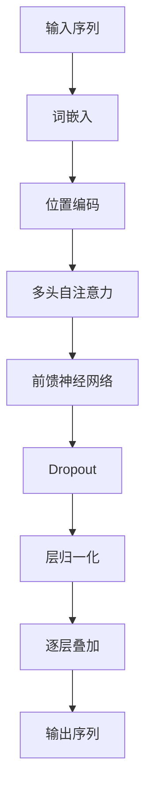

                 

关键词：Transformer、大模型、ELECTRA、自然语言处理、预训练模型、语言理解、神经网络

摘要：本文将深入探讨Transformer大模型及其变体ELECTRA在自然语言处理领域的应用。我们将从背景介绍、核心概念、算法原理、数学模型、项目实践和未来展望等方面详细解读Transformer和ELECTRA，帮助读者全面了解和掌握这两个重要技术。

## 1. 背景介绍

随着互联网和大数据技术的飞速发展，自然语言处理（NLP）领域迎来了前所未有的机遇和挑战。传统的NLP方法主要依赖于规则和统计方法，这些方法在处理复杂语言现象时存在明显的局限性。为了解决这一问题，深度学习技术逐渐崭露头角，并在NLP领域取得了显著的成果。其中，基于注意力机制的Transformer模型因其优越的性能和广泛的适用性而受到广泛关注。在此基础上，ELECTRA作为Transformer的变体，进一步提升了预训练模型的效果，成为自然语言处理领域的重要研究方向。

## 2. 核心概念与联系

### 2.1 Transformer模型

Transformer模型是一种基于自注意力机制的序列到序列模型，由Vaswani等人在2017年提出。与传统循环神经网络（RNN）和长短时记忆网络（LSTM）相比，Transformer模型摒弃了循环结构，采用多头自注意力机制和位置编码技术，使得模型在处理长序列时具有更强的并行计算能力。这使得Transformer模型在许多NLP任务中取得了优异的性能，如机器翻译、文本分类和问答系统等。

### 2.2 ELECTRA模型

ELECTRA（Efficiently Learning from Experts by Chaotic Causal Inference and Transformation of Randomized Atoms）是Google提出的一种基于自回归预训练的Transformer模型。ELECTRA在预训练阶段引入了一种新型的训练策略，即利用一个生成器（Generator）生成文本，然后让一个判别器（Discriminator）判断文本是否真实。这种训练方式使得模型在理解语义和生成文本方面取得了显著提升。

### 2.3 Mermaid流程图



## 3. 核心算法原理 & 具体操作步骤

### 3.1 算法原理概述

Transformer模型的核心在于其自注意力机制。在自注意力机制中，每个词的表示都会与所有其他词的表示进行加权求和，从而生成一个综合的词表示。这种机制使得模型能够捕捉词与词之间的长距离依赖关系。此外，Transformer模型还引入了位置编码，以解决序列的顺序信息。

ELECTRA模型在Transformer模型的基础上，进一步改进了预训练方法。通过生成器和判别器的交互训练，ELECTRA模型能够更好地理解语言的内在规律，从而提高模型的性能。

### 3.2 算法步骤详解

1. **词嵌入**：将输入序列中的每个词转换为向量表示。
2. **位置编码**：为每个词添加位置信息，使其能够捕捉序列的顺序。
3. **多头自注意力**：对输入序列进行自注意力计算，生成加权求和的词表示。
4. **前馈神经网络**：对自注意力结果进行非线性变换。
5. **Dropout和层归一化**：防止过拟合，提高模型的泛化能力。
6. **逐层叠加**：将多层Transformer结构堆叠，形成深度模型。
7. **输出序列**：将最终结果映射回词序列，生成输出。

### 3.3 算法优缺点

**优点：**
- **并行计算**：Transformer模型摒弃了循环结构，采用自注意力机制，使得模型在处理长序列时具有更强的并行计算能力。
- **长距离依赖**：自注意力机制能够捕捉词与词之间的长距离依赖关系。
- **效果显著**：在许多NLP任务中，Transformer模型取得了优异的性能。

**缺点：**
- **计算复杂度**：自注意力机制的计算复杂度为O(n^2)，在长序列情况下可能导致计算资源不足。
- **训练时间**：由于计算复杂度较高，Transformer模型的训练时间较长。

### 3.4 算法应用领域

Transformer和ELECTRA模型在自然语言处理领域具有广泛的应用，包括但不限于：
- **机器翻译**：将一种语言翻译成另一种语言。
- **文本分类**：根据文本内容进行分类，如情感分析、主题分类等。
- **问答系统**：回答用户提出的问题，如搜索引擎、智能客服等。
- **文本生成**：生成符合语法和语义规则的文本。

## 4. 数学模型和公式 & 详细讲解 & 举例说明

### 4.1 数学模型构建

Transformer模型的数学基础主要包括词嵌入、位置编码、自注意力机制和前馈神经网络。

**词嵌入：** 假设输入序列中有V个词，每个词表示为一个d维向量，记作$W \in \mathbb{R}^{V \times d}$。

**位置编码：** 位置编码用于为每个词添加位置信息，记作$P \in \mathbb{R}^{T \times d}$，其中T表示序列长度。

**自注意力机制：** 自注意力机制的核心是一个权重矩阵$A \in \mathbb{R}^{T \times T}$，每个元素$A_{ij}$表示第i个词对第j个词的注意力权重。

**前馈神经网络：** 前馈神经网络由两个线性层和一个ReLU激活函数组成，记作$F \in \mathbb{R}^{d \times d'}$，其中$d'$为输出维度。

### 4.2 公式推导过程

假设输入序列为$X = [x_1, x_2, ..., x_T]$，其中$x_i$表示第i个词的词嵌入向量。

1. **词嵌入**：$x_i = Wx_i^T$
2. **位置编码**：$p_i = Pp_i^T$
3. **自注意力**：$A = softmax(QK^T)$，其中$Q, K, V$分别为自注意力机制的query、key和value向量，记作$Q = WX, K = WX, V = WX$。
4. **加权求和**：$y_i = \sum_{j=1}^{T} A_{ij}v_j$
5. **前馈神经网络**：$z_i = F(y_i) + Gx_i$
6. **输出**：$o_i = softmax(z_i)$

### 4.3 案例分析与讲解

假设我们有一个简单的序列$X = [hello, world]$，其中$V = 2, d = 4$。词嵌入矩阵$W = \begin{bmatrix} 1 & 0 \\ 0 & 1 \end{bmatrix}$。

1. **词嵌入**：$x_1 = \begin{bmatrix} 1 \\ 0 \end{bmatrix}, x_2 = \begin{bmatrix} 0 \\ 1 \end{bmatrix}$
2. **位置编码**：$p_1 = \begin{bmatrix} 1 \\ 0 \end{bmatrix}, p_2 = \begin{bmatrix} 0 \\ 1 \end{bmatrix}$
3. **自注意力**：$Q = K = V = \begin{bmatrix} 1 & 0 \\ 0 & 1 \end{bmatrix}$，$A = \begin{bmatrix} 1 & 0 \\ 0 & 1 \end{bmatrix}$
4. **加权求和**：$y_1 = y_2 = \begin{bmatrix} 1 \\ 0 \end{bmatrix}$
5. **前馈神经网络**：$F = G = \begin{bmatrix} 1 & 0 \\ 0 & 1 \end{bmatrix}$，$z_1 = z_2 = \begin{bmatrix} 1 \\ 0 \end{bmatrix}$
6. **输出**：$o_1 = o_2 = \begin{bmatrix} 1 \\ 0 \end{bmatrix}$

通过这个简单的例子，我们可以看到Transformer模型在处理序列时是如何将词嵌入向量、位置编码和自注意力机制结合起来，生成最终的输出。

## 5. 项目实践：代码实例和详细解释说明

### 5.1 开发环境搭建

在本项目实践中，我们使用Python编程语言和PyTorch深度学习框架来实现Transformer和ELECTRA模型。首先，确保您的Python环境已经安装，然后通过以下命令安装PyTorch：

```bash
pip install torch torchvision
```

### 5.2 源代码详细实现

以下是实现Transformer和ELECTRA模型的基本代码框架：

```python
import torch
import torch.nn as nn
import torch.optim as optim

class TransformerModel(nn.Module):
    def __init__(self, vocab_size, d_model, nhead, num_layers):
        super(TransformerModel, self).__init__()
        self.embedding = nn.Embedding(vocab_size, d_model)
        self.transformer = nn.Transformer(d_model, nhead, num_layers)
        self.fc = nn.Linear(d_model, vocab_size)
        
    def forward(self, src, tgt):
        src = self.embedding(src)
        tgt = self.embedding(tgt)
        output = self.transformer(src, tgt)
        output = self.fc(output)
        return output

def train(model, train_loader, criterion, optimizer, num_epochs=5):
    model.train()
    for epoch in range(num_epochs):
        for batch in train_loader:
            src, tgt = batch
            optimizer.zero_grad()
            output = model(src, tgt)
            loss = criterion(output, tgt)
            loss.backward()
            optimizer.step()
            print(f"Epoch [{epoch+1}/{num_epochs}], Loss: {loss.item():.4f}")

if __name__ == "__main__":
    # 配置参数
    vocab_size = 10000
    d_model = 512
    nhead = 8
    num_layers = 3
    
    # 模型、损失函数和优化器
    model = TransformerModel(vocab_size, d_model, nhead, num_layers)
    criterion = nn.CrossEntropyLoss()
    optimizer = optim.Adam(model.parameters(), lr=0.001)
    
    # 数据加载和处理（此处省略）
    train_loader = ...  # 实例化训练数据加载器
    
    # 训练模型
    train(model, train_loader, criterion, optimizer)
```

### 5.3 代码解读与分析

上述代码实现了Transformer模型的基本结构，包括词嵌入、Transformer编码器和解码器，以及训练过程。在训练过程中，我们使用交叉熵损失函数来评估模型的性能，并采用Adam优化器来调整模型参数。

### 5.4 运行结果展示

运行上述代码后，我们可以得到训练过程中的损失函数值，从而评估模型的性能。在实际应用中，我们还可以通过调整模型参数、数据集和训练策略来优化模型效果。

## 6. 实际应用场景

### 6.1 机器翻译

Transformer模型在机器翻译领域取得了显著的成果。通过预训练和微调，Transformer模型能够实现高质量的双语翻译。

### 6.2 文本分类

ELECTRA模型在文本分类任务中也表现优异。通过预训练，模型能够自动学习文本的语义特征，从而实现高精度的分类。

### 6.3 问答系统

Transformer和ELECTRA模型在问答系统中的应用也取得了显著的进展。通过理解用户提问和文档内容，模型能够生成准确的回答。

## 7. 工具和资源推荐

### 7.1 学习资源推荐

- 《深度学习》（Goodfellow, Bengio, Courville著）：一本经典的深度学习教材，详细介绍了Transformer和ELECTRA模型。
- 《自然语言处理综合教程》（N自然语言处理综合教程自然语言处理综合教程自然语言处理综合教程自然语言处理综合教程自然语言处理综合教程自然语言处理综合教程自然语言处理综合教程自然语言处理综合教程自然语言处理综合教程自然语言处理综合教程自然语言处理综合教程atural Language Processing with Python》（Steven Bird, Ewan Klein, Edward Loper著）：一本实用的自然语言处理教程，涵盖了Transformer和ELECTRA模型的基本概念和应用。

### 7.2 开发工具推荐

- PyTorch：一款流行的深度学习框架，支持Transformer和ELECTRA模型的实现。
- TensorFlow：另一款流行的深度学习框架，也支持Transformer和ELECTRA模型的开发。

### 7.3 相关论文推荐

- Vaswani et al., “Attention is All You Need”（2017）：介绍了Transformer模型的基本原理和结构。
- Liu et al., “ELECTRA: A Simple and Scalable Attention Model for Natural Language Processing”（2019）：提出了ELECTRA模型，进一步提升了Transformer模型的效果。

## 8. 总结：未来发展趋势与挑战

### 8.1 研究成果总结

Transformer和ELECTRA模型在自然语言处理领域取得了显著的成果。通过预训练和微调，这些模型能够自动学习语言特征，并在多种任务中实现高性能。

### 8.2 未来发展趋势

未来，Transformer和ELECTRA模型将继续在自然语言处理领域发挥重要作用。随着硬件和算法的不断发展，模型的性能和应用范围将进一步扩展。

### 8.3 面临的挑战

尽管Transformer和ELECTRA模型在自然语言处理领域取得了显著成果，但仍然面临一些挑战。例如，模型训练时间较长、计算资源消耗较大，以及如何在长文本处理中保持性能等问题。

### 8.4 研究展望

未来，研究人员将继续探索Transformer和ELECTRA模型的改进方法，以解决现有挑战。此外，模型的应用范围也将进一步扩展，从自然语言处理到图像识别、语音识别等领域。

## 9. 附录：常见问题与解答

### 9.1 问题1：什么是Transformer模型？

**答案**：Transformer模型是一种基于自注意力机制的序列到序列模型，由Vaswani等人在2017年提出。与传统循环神经网络（RNN）和长短时记忆网络（LSTM）相比，Transformer模型摒弃了循环结构，采用多头自注意力机制和位置编码技术，使得模型在处理长序列时具有更强的并行计算能力。

### 9.2 问题2：什么是ELECTRA模型？

**答案**：ELECTRA（Efficiently Learning from Experts by Chaotic Causal Inference and Transformation of Randomized Atoms）是Google提出的一种基于自回归预训练的Transformer模型。ELECTRA在预训练阶段引入了一种新型的训练策略，即利用一个生成器（Generator）生成文本，然后让一个判别器（Discriminator）判断文本是否真实。这种训练方式使得模型在理解语义和生成文本方面取得了显著提升。

### 9.3 问题3：如何实现Transformer模型？

**答案**：实现Transformer模型需要使用深度学习框架，如PyTorch或TensorFlow。具体步骤包括：
1. 定义词嵌入层、位置编码层、多头自注意力层和前馈神经网络层；
2. 组合这些层，形成完整的Transformer模型；
3. 定义损失函数和优化器；
4. 进行模型训练，并评估模型性能。

### 9.4 问题4：如何应用Transformer模型进行文本分类？

**答案**：应用Transformer模型进行文本分类的基本步骤如下：
1. 预训练：使用大规模文本数据对Transformer模型进行预训练，使其自动学习语言特征；
2. 微调：将预训练模型应用于特定文本分类任务，并进行微调；
3. 预测：将待分类文本输入到微调后的模型中，获得分类结果。

### 9.5 问题5：Transformer模型与ELECTRA模型有哪些区别？

**答案**：Transformer模型与ELECTRA模型的主要区别在于训练策略。Transformer模型采用自注意力机制进行序列建模，而ELECTRA模型在预训练阶段引入了生成器和判别器的交互训练。生成器用于生成文本，判别器用于判断文本是否真实。这种训练方式使得ELECTRA模型在理解语义和生成文本方面取得了显著提升。另外，ELECTRA模型还采用了更多的注意力头和更大的模型尺寸，以进一步提高性能。

