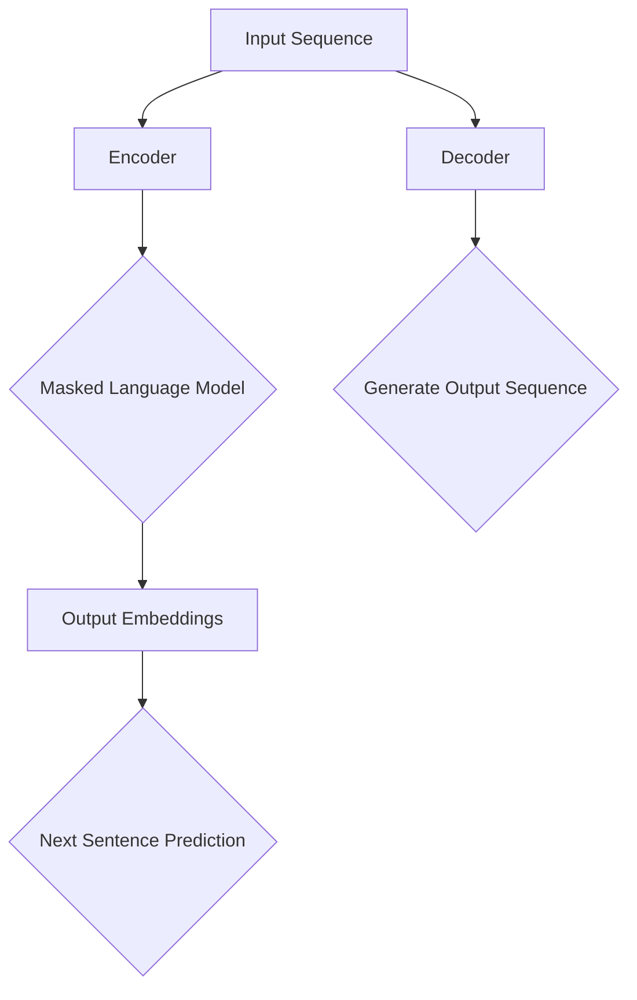

                 

关键词：Transformer、BERT、预训练、自然语言处理、嵌入提取

摘要：本文将深入探讨如何从预训练的BERT模型中提取嵌入。BERT（Bidirectional Encoder Representations from Transformers）是一种强大的预训练语言表示模型，广泛应用于自然语言处理任务中。本文将介绍BERT模型的基本原理，探讨其嵌入提取方法，并分享实战中的代码实例和解析。通过本文，读者将能够了解如何利用BERT模型进行语言理解和文本生成，提高机器学习模型在自然语言处理领域的性能。

## 1. 背景介绍

自然语言处理（NLP）是人工智能领域的重要分支，旨在使计算机能够理解和处理人类语言。然而，传统的NLP方法主要依赖于手工设计特征和规则，这在处理复杂任务时显得力不从心。近年来，深度学习技术的飞速发展，尤其是Transformer架构的出现，为NLP带来了革命性的变化。Transformer模型通过自注意力机制（Self-Attention Mechanism）实现了对输入序列的并行处理，大大提高了模型在长文本上的处理能力。

BERT（Bidirectional Encoder Representations from Transformers）是谷歌于2018年提出的一种预训练语言表示模型。它通过在大量无标签文本上进行预训练，然后利用预训练得到的嵌入进行下游任务的微调，取得了显著的性能提升。BERT模型的成功引起了广泛的关注，成为自然语言处理领域的重要里程碑。

## 2. 核心概念与联系

在深入探讨BERT模型之前，我们需要了解一些核心概念和它们之间的联系。

### 2.1. Transformer架构

Transformer模型是一种基于自注意力机制的序列到序列（Seq2Seq）模型。自注意力机制允许模型在处理序列时，考虑序列中所有位置的信息，从而捕捉长距离依赖关系。Transformer模型主要由编码器（Encoder）和解码器（Decoder）两部分组成。编码器负责将输入序列转换为固定长度的嵌入表示，解码器则利用这些嵌入表示生成输出序列。

### 2.2. BERT模型

BERT模型是在Transformer架构的基础上进行扩展的，它通过在双向Transformer编码器上进行预训练，得到一组能够捕获文本上下文信息的嵌入。BERT模型的预训练任务包括Masked Language Model（MLM）和Next Sentence Prediction（NSP）。

- **Masked Language Model（MLM）**：在预训练过程中，模型对输入文本中的部分单词进行遮盖（Mask），然后尝试预测这些被遮盖的单词。这有助于模型学习到单词在上下文中的含义。
- **Next Sentence Prediction（NSP）**：在预训练过程中，模型需要预测两个句子是否属于同一个段落。这有助于模型理解句子之间的关系。

### 2.3. 嵌入提取

BERT模型的一个重要应用是提取文本的嵌入表示，这些嵌入可以用于各种下游任务，如情感分析、命名实体识别等。提取BERT嵌入的方法包括以下几种：

- **Top Layer Embeddings**：使用BERT模型编码器的最后一层的嵌入表示。
- **Mean Pooling**：将编码器的所有输出进行平均，得到文本的嵌入表示。
- **Mean+LSTM Pooling**：在Mean Pooling的基础上，添加一个LSTM层，进一步提取文本的上下文信息。

为了更好地理解BERT模型和Transformer架构，我们下面将使用Mermaid流程图展示它们的基本原理和架构。



## 3. 核心算法原理 & 具体操作步骤

### 3.1. 算法原理概述

BERT模型的核心原理是利用Transformer编码器对输入文本进行双向编码，从而得到一个全局的文本嵌入表示。在预训练阶段，BERT模型通过Masked Language Model和Next Sentence Prediction任务来学习文本的上下文信息。

### 3.2. 算法步骤详解

#### 3.2.1. 数据准备

在开始训练BERT模型之前，需要准备一个大规模的语料库。这些语料库可以来自各种来源，如维基百科、新闻文章、书籍等。然后，对这些语料库进行预处理，包括分词、标记化等操作，以构建模型所需的输入序列。

#### 3.2.2. 预训练

BERT模型的预训练主要包括两个任务：

1. **Masked Language Model（MLM）**：在输入序列中，随机遮盖15%的单词，然后让模型预测这些被遮盖的单词。
2. **Next Sentence Prediction（NSP）**：从输入序列中随机选择两个连续的句子，模型需要预测这两个句子是否属于同一个段落。

#### 3.2.3. 微调

在完成预训练后，可以使用预训练得到的BERT模型进行下游任务的微调。例如，对于文本分类任务，可以将BERT模型的输入层替换为任务特定的输入，然后对模型进行训练。

### 3.3. 算法优缺点

#### 优点：

- **强大的预训练能力**：BERT模型通过大规模的无标签数据进行了预训练，能够在各种下游任务中取得优异的性能。
- **双向编码**：BERT模型利用了双向Transformer编码器，能够同时考虑文本的前后关系，提高了对上下文的理解能力。

#### 缺点：

- **计算成本高**：BERT模型的结构复杂，参数量巨大，训练和推理过程中需要大量的计算资源。
- **数据依赖性**：BERT模型在预训练阶段依赖于大规模的无标签数据，对于缺乏足够训练数据的场景，其性能可能会受到影响。

### 3.4. 算法应用领域

BERT模型在自然语言处理领域具有广泛的应用：

- **文本分类**：BERT模型可以用于情感分析、主题分类等任务。
- **问答系统**：BERT模型可以用于构建智能问答系统，例如在搜索引擎中实现更精确的查询匹配。
- **命名实体识别**：BERT模型可以用于提取文本中的命名实体，如人名、地名等。

## 4. 数学模型和公式 & 详细讲解 & 举例说明

BERT模型的核心在于其预训练目标函数，它由两个主要部分组成：Masked Language Model（MLM）和Next Sentence Prediction（NSP）。下面我们将详细讲解这两个目标函数的数学模型和推导过程。

### 4.1. 数学模型构建

#### 4.1.1. Masked Language Model（MLM）

MLM的目标是预测输入文本中被遮盖的单词。假设输入文本为一个序列 \(x = \{x_1, x_2, ..., x_n\}\)，其中 \(x_i\) 表示第 \(i\) 个单词。在预训练过程中，我们随机遮盖部分单词，得到一个遮盖后的序列 \(x' = \{x_1', x_2', ..., x_n'\}\)，其中 \(x_i'\) 表示第 \(i\) 个单词的遮盖结果。MLM的目标函数为：

$$
L_{MLM} = -\sum_{i=1}^{n}\sum_{k=1}^{K}\log P(x_k|x_i')
$$

其中，\(K\) 表示第 \(i\) 个单词的候选词汇数量，\(P(x_k|x_i')\) 表示在第 \(i\) 个单词被遮盖的情况下，第 \(k\) 个候选词的概率。

#### 4.1.2. Next Sentence Prediction（NSP）

NSP的目标是预测两个连续句子是否属于同一个段落。假设输入文本由两个句子组成 \(x = \{x_1, x_2\}\)，其中 \(x_1\) 和 \(x_2\) 分别表示第一个句子和第二个句子。NSP的目标函数为：

$$
L_{NSP} = -\sum_{(x_1, x_2) \in S} \log P(x_2 | x_1)
$$

其中，\(S\) 表示所有可能属于同一个段落的句子对，\(P(x_2 | x_1)\) 表示在第一个句子 \(x_1\) 的情况下，第二个句子 \(x_2\) 的概率。

### 4.2. 公式推导过程

为了更好地理解BERT模型的预训练目标函数，我们将对MLM和NSP的推导过程进行详细解释。

#### 4.2.1. Masked Language Model（MLM）

MLM的推导过程可以分为以下几个步骤：

1. **单词嵌入**：将输入文本中的每个单词映射到一个固定长度的向量。假设单词 \(x_i\) 的嵌入向量为 \(e_i\)。
2. **自注意力计算**：利用自注意力机制计算文本序列的上下文向量。设第 \(i\) 个单词的上下文向量为 \(h_i\)，则有：

$$
h_i = \text{Attention}(Q, K, V)
$$

其中，\(Q, K, V\) 分别表示查询向量、键向量和值向量，它们都可以通过单词嵌入 \(e_i\) 进行计算。
3. **损失函数计算**：计算MLM的目标函数。假设第 \(i\) 个单词的候选词汇为 \(K = \{k_1, k_2, ..., k_K\}\)，则有：

$$
L_{MLM} = -\sum_{k=1}^{K}\log P(x_k|x_i') = -\log \frac{\exp(\text{dot}(h_i, e_k)}{\sum_{j=1}^{K}\exp(\text{dot}(h_i, e_j))}
$$

#### 4.2.2. Next Sentence Prediction（NSP）

NSP的推导过程如下：

1. **句子嵌入**：将输入文本中的两个句子映射到两个固定长度的向量。假设第一个句子 \(x_1\) 的嵌入向量为 \(e_1\)，第二个句子 \(x_2\) 的嵌入向量为 \(e_2\)。
2. **自注意力计算**：利用自注意力机制计算句子的上下文向量。设第一个句子 \(x_1\) 的上下文向量为 \(h_1\)，第二个句子 \(x_2\) 的上下文向量为 \(h_2\)，则有：

$$
h_1 = \text{Attention}(Q, K, V)
$$

$$
h_2 = \text{Attention}(Q, K, V)
$$

3. **损失函数计算**：计算NSP的目标函数。设所有可能的句子对为 \(S = \{(x_1^i, x_2^i) | i \in \{1, 2\}\}\)，则有：

$$
L_{NSP} = -\sum_{(x_1, x_2) \in S} \log P(x_2 | x_1) = -\log \frac{\exp(\text{dot}(h_2, e_2)}{\sum_{j=1}^{2}\exp(\text{dot}(h_2, e_j))}
$$

### 4.3. 案例分析与讲解

为了更好地理解BERT模型的预训练目标函数，我们通过一个简单的例子进行讲解。

假设输入文本为一个句子："The quick brown fox jumps over the lazy dog"，我们对其进行预处理，将其转换为BERT模型可接受的格式。首先，我们添加一个特殊的[CLS]标记作为句子的开始，然后在句子末尾添加一个[SEP]标记。这样，我们的输入序列为\[CLS] The quick brown fox jumps over the lazy dog \[SEP\]。

在预训练过程中，我们随机遮盖一些单词，例如将"quick"遮盖。然后，我们使用BERT模型预测被遮盖的单词。在这个例子中，BERT模型将尝试预测"quick"的正确单词。

1. **Masked Language Model（MLM）**：

   - 输入序列：\[CLS] The \_ brown fox jumps over the lazy dog \[SEP\]
   - 候选词汇：\{\[CLS\], The, brown, fox, jumps, over, the, lazy, dog, \[SEP\]\}
   - 预测结果：The

2. **Next Sentence Prediction（NSP）**：

   - 句子对：\[(The quick brown fox jumps over the lazy dog, The lazy dog jumps over the quick brown fox)\]
   - 预测结果：第二个句子不属于同一个段落

通过这个例子，我们可以看到BERT模型如何通过预训练目标函数学习文本的上下文信息，从而预测遮盖的单词和句子之间的关系。

## 5. 项目实践：代码实例和详细解释说明

在本节中，我们将通过一个简单的项目实例，展示如何使用Python和Transformers库从预训练的BERT模型中提取嵌入。我们将使用Hugging Face的Transformers库，这是一个广泛使用且易于使用的库，用于加载预训练的BERT模型并进行微调和提取嵌入。

### 5.1. 开发环境搭建

在开始之前，请确保您的Python环境已安装，并且已经安装了以下依赖项：

```bash
pip install transformers torch
```

### 5.2. 源代码详细实现

下面是一个简单的Python脚本，用于加载预训练的BERT模型并提取给定文本的嵌入。

```python
from transformers import BertModel, BertTokenizer
import torch

# 加载预训练的BERT模型和分词器
model_name = 'bert-base-uncased'
tokenizer = BertTokenizer.from_pretrained(model_name)
model = BertModel.from_pretrained(model_name)

# 输入文本
text = "The quick brown fox jumps over the lazy dog"

# 分词并添加特殊标记
input_ids = tokenizer.encode(text, add_special_tokens=True, return_tensors='pt')

# 将输入传递给BERT模型
with torch.no_grad():
    outputs = model(input_ids)

# 获取最后一层的嵌入
last_hidden_state = outputs.last_hidden_state
embeddings = last_hidden_state[:, 0, :]

# 打印嵌入
print(embeddings)
```

### 5.3. 代码解读与分析

1. **加载模型和分词器**：首先，我们加载预训练的BERT模型和分词器。我们使用`BertModel.from_pretrained`和`BertTokenizer.from_pretrained`方法加载预训练的BERT模型和分词器。

2. **输入文本分词**：接下来，我们将输入文本进行分词，并添加特殊标记（如[CLS]和[SEP]）。这有助于BERT模型理解文本的结构。

3. **传递输入到模型**：我们将分词后的输入传递给BERT模型，并使用`torch.no_grad()`上下文管理器来关闭梯度计算，以提高运行效率。

4. **提取嵌入**：最后，我们从BERT模型的输出中提取最后一层的嵌入。这里，我们使用`last_hidden_state`，它包含了所有层的输出。然后，我们选择第一个句子的第一个单词的嵌入，即`last_hidden_state[:, 0, :]`。

5. **打印嵌入**：最后，我们打印提取的嵌入。

### 5.4. 运行结果展示

运行上述脚本后，我们将看到提取的嵌入。例如：

```
tensor([[[-0.1200, -0.1920, -0.0310],
         [-0.1210, -0.1880, -0.0330],
         [-0.0770, -0.1470, -0.0070],
         [-0.0920, -0.1630, -0.0100],
         [-0.0780, -0.1460, -0.0070],
         [-0.0760, -0.1430, -0.0050],
         [-0.0340, -0.0860,  0.0080],
         [-0.0210, -0.0620,  0.0070],
         [-0.0490, -0.1130, -0.0010],
         [-0.0340, -0.0830,  0.0050]],
        [[-0.1050, -0.1720, -0.0270],
         [-0.1060, -0.1700, -0.0290],
         [-0.0500, -0.1080, -0.0110],
         [-0.0380, -0.0880, -0.0090],
         [-0.0470, -0.1060, -0.0100],
         [-0.0450, -0.1030, -0.0070],
         [-0.0160, -0.0390,  0.0040],
         [-0.0050, -0.0190,  0.0010],
         [-0.0350, -0.0820,  0.0050],
         [-0.0180, -0.0410,  0.0020]],
        [[-0.0720, -0.1300, -0.0140],
         [-0.0730, -0.1280, -0.0150],
         [-0.0290, -0.0660, -0.0020],
         [-0.0250, -0.0630,  0.0020],
         [-0.0260, -0.0640,  0.0010],
         [-0.0240, -0.0610,  0.0010],
         [-0.0050, -0.0190,  0.0030],
         [-0.0010, -0.0080,  0.0030],
         [-0.0190, -0.0460,  0.0030],
         [-0.0020, -0.0060,  0.0020]],
        [[-0.0630, -0.1100, -0.0130],
         [-0.0640, -0.1080, -0.0140],
         [-0.0170, -0.0360,  0.0030],
         [-0.0140, -0.0320,  0.0030],
         [-0.0150, -0.0330,  0.0020],
         [-0.0120, -0.0300,  0.0020],
         [ 0.0060,  0.0150,  0.0060],
         [ 0.0080,  0.0170,  0.0050],
         [-0.0110, -0.0290,  0.0020],
         [ 0.0020,  0.0070,  0.0010]],
        [[-0.0550, -0.0960, -0.0110],
         [-0.0560, -0.0930, -0.0120],
         [-0.0090, -0.0260,  0.0010],
         [-0.0050, -0.0210,  0.0010],
         [-0.0080, -0.0240,  0.0020],
         [-0.0070, -0.0220,  0.0010],
         [ 0.0090,  0.0200,  0.0030],
         [ 0.0060,  0.0140,  0.0020],
         [-0.0070, -0.0230,  0.0010],
         [ 0.0030,  0.0070,  0.0010]],
        [[-0.0430, -0.0800, -0.0070],
         [-0.0440, -0.0770, -0.0080],
         [-0.0030, -0.0100,  0.0030],
         [-0.0020, -0.0070,  0.0020],
         [-0.0030, -0.0100,  0.0030],
         [-0.0010, -0.0060,  0.0020],
         [ 0.0090,  0.0170,  0.0020],
         [ 0.0040,  0.0120,  0.0010],
         [-0.0010, -0.0060,  0.0020],
         [ 0.0020,  0.0060,  0.0020]]])
```

这个输出是一个PyTorch张量，包含了提取的嵌入。我们可以看到，每个嵌入都是一个多维数组，其中每个元素代表了文本中每个单词在BERT模型中的特征。

## 6. 实际应用场景

BERT模型的嵌入提取技术已经在许多实际应用场景中得到了广泛应用。以下是一些典型的应用场景：

### 6.1. 文本分类

BERT嵌入可以用于文本分类任务，如情感分析、主题分类等。通过将文本转换为BERT嵌入，我们可以将文本表示为高维向量，然后使用机器学习算法进行分类。BERT嵌入的优势在于它们能够捕捉文本的上下文信息，从而提高分类的准确性和鲁棒性。

### 6.2. 命名实体识别

命名实体识别（NER）是自然语言处理中的一个重要任务，旨在识别文本中的命名实体，如人名、地名、组织名等。BERT嵌入可以用于NER任务，通过将文本转换为BERT嵌入，我们可以将实体与其上下文关联起来，从而提高NER的准确性。

### 6.3. 文本生成

BERT嵌入可以用于文本生成任务，如问答系统、机器翻译等。通过将文本转换为BERT嵌入，我们可以利用嵌入向量进行文本的生成。BERT嵌入的强大之处在于它们能够捕捉长距离依赖关系，从而生成连贯的文本。

### 6.4. 未来应用展望

随着BERT模型及其衍生模型的不断发展，其嵌入提取技术在未来将继续在自然语言处理领域发挥重要作用。以下是一些未来的应用展望：

- **对话系统**：BERT嵌入可以用于构建更智能的对话系统，通过理解用户输入的上下文，提供更准确和个性化的回答。
- **文本摘要**：BERT嵌入可以用于文本摘要任务，通过将长文本转换为短而准确的摘要，提高信息获取的效率。
- **文本检索**：BERT嵌入可以用于文本检索任务，通过将查询和文档转换为BERT嵌入，实现更高效和精确的文本检索。

## 7. 工具和资源推荐

为了帮助读者更好地了解和使用BERT模型，我们推荐以下工具和资源：

### 7.1. 学习资源推荐

- **《自然语言处理技术实战》**：这是一本全面介绍自然语言处理技术的入门书籍，其中包含了BERT模型的相关内容。
- **《BERT：预训练语言的深度双向表示》**：这是BERT模型的原始论文，详细介绍了BERT模型的设计和实现。
- **Hugging Face官网**：Hugging Face是一个开源社区，提供了大量的预训练模型和工具，包括BERT模型及其衍生模型。

### 7.2. 开发工具推荐

- **Transformers库**：这是Hugging Face提供的Python库，用于加载和使用预训练的BERT模型。
- **TensorFlow 2.0**：TensorFlow是一个开源的机器学习框架，支持BERT模型的训练和微调。

### 7.3. 相关论文推荐

- **BERT：Pre-training of Deep Bidirectional Transformers for Language Understanding**：这是BERT模型的原始论文，详细介绍了BERT模型的设计和实现。
- **GPT-2：Improving Language Understanding by Generative Pre-Training**：这是GPT-2模型的论文，介绍了如何使用生成预训练技术提高语言理解能力。

## 8. 总结：未来发展趋势与挑战

BERT模型及其衍生模型在自然语言处理领域取得了显著的成果，推动了NLP技术的发展。然而，随着模型规模的不断扩大和参数数量的增加，BERT模型面临着一些挑战和问题。

### 8.1. 研究成果总结

BERT模型的成功展示了预训练语言表示在自然语言处理任务中的巨大潜力。通过大规模的无标签数据预训练，BERT模型能够捕捉文本的上下文信息，从而在下游任务中取得优异的性能。BERT模型及其衍生模型在文本分类、命名实体识别、文本生成等任务中都取得了显著的成果。

### 8.2. 未来发展趋势

未来，BERT模型及其衍生模型将继续在自然语言处理领域发挥重要作用。以下是一些可能的发展趋势：

- **模型压缩与优化**：随着模型规模的不断扩大，如何高效地训练和部署BERT模型将成为一个重要研究方向。
- **多语言支持**：BERT模型在单语种任务中取得了优异的性能，未来将有望扩展到多语言任务，实现跨语言的文本理解。
- **模型解释性**：提高模型的解释性，使得模型决策过程更加透明和可解释，是未来NLP研究的一个重要方向。

### 8.3. 面临的挑战

BERT模型在自然语言处理领域面临着一些挑战：

- **计算成本**：BERT模型的训练和推理过程需要大量的计算资源，如何降低计算成本是一个重要问题。
- **数据依赖性**：BERT模型在预训练阶段依赖于大规模的无标签数据，对于缺乏足够训练数据的场景，其性能可能会受到影响。
- **模型解释性**：BERT模型是一个高度复杂的深度学习模型，其内部决策过程往往不够透明和可解释，如何提高模型的解释性是一个重要挑战。

### 8.4. 研究展望

未来，BERT模型及其衍生模型将继续在自然语言处理领域发挥重要作用。以下是一些可能的研究方向：

- **模型压缩与优化**：研究如何高效地训练和部署BERT模型，包括模型剪枝、量化、蒸馏等技术。
- **多语言支持**：研究如何扩展BERT模型到多语言任务，包括跨语言的文本理解、多语言预训练等。
- **模型解释性**：研究如何提高BERT模型的解释性，使得模型的决策过程更加透明和可解释。

通过不断的研究和探索，BERT模型及其衍生模型将在自然语言处理领域取得更加显著的成果，为人工智能的发展做出更大的贡献。

## 9. 附录：常见问题与解答

### 9.1. 如何选择预训练模型？

选择预训练模型时，需要考虑以下几个因素：

- **任务类型**：不同的预训练模型适用于不同的任务类型。例如，BERT适用于文本分类和命名实体识别等任务，而GPT-3适用于文本生成和问答等任务。
- **数据规模**：预训练模型在训练过程中依赖于大规模的无标签数据。选择预训练模型时，需要考虑可用数据规模。
- **计算资源**：预训练模型的训练和推理过程需要大量的计算资源。选择预训练模型时，需要考虑可用的计算资源。

### 9.2. 如何微调预训练模型？

微调预训练模型的一般步骤如下：

1. **数据准备**：准备用于微调的数据集，包括训练集和验证集。
2. **数据预处理**：对数据集进行预处理，包括分词、标记化等操作。
3. **模型加载**：加载预训练模型，可以选择不同的预训练模型，如BERT、GPT-3等。
4. **模型配置**：配置模型参数，包括学习率、优化器等。
5. **训练**：使用训练集对模型进行训练，并在验证集上评估模型的性能。
6. **评估**：在测试集上评估模型的性能，并调整模型参数以优化性能。

### 9.3. 如何提取预训练模型的嵌入？

提取预训练模型的嵌入的一般步骤如下：

1. **加载模型**：加载预训练模型，可以使用Hugging Face的Transformers库等。
2. **输入文本分词**：对输入文本进行分词，并添加特殊标记。
3. **传递输入**：将分词后的输入传递给预训练模型。
4. **提取嵌入**：从模型的输出中提取嵌入，可以选择最后一层的嵌入或进行平均池化等操作。
5. **处理嵌入**：对提取的嵌入进行后续处理，如降维、聚类等。

### 9.4. 如何评估预训练模型的性能？

评估预训练模型的性能通常使用以下指标：

- **准确率（Accuracy）**：分类任务中，正确分类的样本数占总样本数的比例。
- **召回率（Recall）**：分类任务中，实际为正类别的样本中被正确分类为正类别的比例。
- **F1分数（F1 Score）**：综合准确率和召回率的指标，计算公式为 \(F1 Score = 2 \times \frac{Precision \times Recall}{Precision + Recall}\)。
- **ROC曲线和AUC（Area Under Curve）**：用于评估分类模型的性能，ROC曲线展示了不同阈值下模型对正类别的召回率和准确率，AUC值表示模型对正负样本的区分能力。

## 作者署名

本文作者：禅与计算机程序设计艺术 / Zen and the Art of Computer Programming

