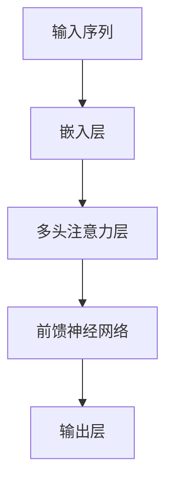

                 

关键词：Transformer、大模型、多头注意力层、深度学习、自然语言处理、算法原理、数学模型、代码实例

## 摘要

本文将深入探讨Transformer大模型中的多头注意力层，介绍其核心概念、算法原理、数学模型及其在自然语言处理等领域的应用。通过详细的实例分析和代码解读，帮助读者理解多头注意力层的工作机制，掌握其实际应用技巧。同时，文章还将展望未来Transformer大模型的发展趋势和挑战。

## 1. 背景介绍

随着深度学习的快速发展，尤其是自然语言处理（NLP）领域的突破，Transformer大模型已经成为当今最热门的人工智能模型之一。Transformer模型摒弃了传统的循环神经网络（RNN），采用了自注意力机制（Self-Attention）和多头注意力机制（Multi-Head Attention），使得模型在处理长序列数据时表现出色。

多头注意力层是Transformer模型的核心组成部分，其通过并行处理多个注意力头，提高了模型的表示能力和计算效率。本文将详细介绍多头注意力层的原理、实现和应用，帮助读者深入理解这一关键技术。

## 2. 核心概念与联系

### 2.1 自注意力（Self-Attention）

自注意力是一种计算序列中每个元素与其他元素之间关系的注意力权重，从而为每个元素赋予不同的重要性。在Transformer模型中，自注意力机制使得模型能够自动学习到序列中的长距离依赖关系。

### 2.2 多头注意力（Multi-Head Attention）

多头注意力是在自注意力的基础上，将整个序列划分成多个子序列，每个子序列对应一个注意力头。多个注意力头可以并行处理序列信息，从而提高模型的表示能力。

### 2.3 Mermaid 流程图

下面是Transformer模型中多头注意力层的Mermaid流程图：



### 2.4 Mermaid 流程图详解

- **输入序列**：原始的文本序列经过词嵌入后得到一个向量序列。
- **嵌入层**：将输入序列映射到一个高维空间，为每个词赋予独特的向量表示。
- **多头注意力层**：将输入序列分成多个子序列，每个子序列对应一个注意力头。每个注意力头通过计算自注意力权重，对子序列中的元素进行加权求和。
- **前馈神经网络**：对多头注意力层的输出进行进一步处理，增加模型的非线性表达能力。
- **输出层**：将前馈神经网络的输出映射回原始空间，得到最终的预测结果。

## 3. 核心算法原理 & 具体操作步骤

### 3.1 算法原理概述

多头注意力层的核心思想是将输入序列划分成多个子序列，每个子序列通过计算自注意力权重来对子序列中的元素进行加权求和。具体来说，多头注意力层包括以下几个关键步骤：

1. **输入序列嵌入**：将输入序列映射到高维空间，为每个词赋予独特的向量表示。
2. **分割子序列**：将输入序列划分成多个子序列，每个子序列对应一个注意力头。
3. **计算自注意力权重**：对于每个子序列，计算其与其他子序列之间的注意力权重。
4. **加权求和**：根据注意力权重对子序列中的元素进行加权求和，得到每个子序列的加权向量。
5. **拼接与变换**：将所有子序列的加权向量拼接起来，通过前馈神经网络进行进一步处理。
6. **输出**：将前馈神经网络的输出映射回原始空间，得到最终的预测结果。

### 3.2 算法步骤详解

#### 3.2.1 输入序列嵌入

输入序列经过词嵌入后，每个词被映射到一个高维向量表示。词嵌入是一种将单词映射到固定长度的向量空间的方法，可以捕捉单词的语义信息。

#### 3.2.2 分割子序列

将输入序列划分成多个子序列，每个子序列对应一个注意力头。分割的方式可以是固定长度，也可以是动态长度。

#### 3.2.3 计算自注意力权重

对于每个子序列，计算其与其他子序列之间的注意力权重。自注意力权重可以通过以下公式计算：

$$
Attention(Q, K, V) = softmax(\frac{QK^T}{\sqrt{d_k}})V
$$

其中，$Q$、$K$ 和 $V$ 分别表示查询序列、键序列和值序列。$d_k$ 表示键序列的维度。

#### 3.2.4 加权求和

根据注意力权重对子序列中的元素进行加权求和，得到每个子序列的加权向量。

#### 3.2.5 拼接与变换

将所有子序列的加权向量拼接起来，通过前馈神经网络进行进一步处理。前馈神经网络通常由两个全连接层组成，中间加入激活函数，可以增加模型的非线性表达能力。

#### 3.2.6 输出

将前馈神经网络的输出映射回原始空间，得到最终的预测结果。

### 3.3 算法优缺点

#### 优点

- **并行处理**：多头注意力层允许模型并行处理序列信息，提高了计算效率。
- **长距离依赖**：多头注意力层可以捕捉到序列中的长距离依赖关系，提高了模型的表示能力。
- **灵活可扩展**：多头注意力层可以灵活地扩展到多个注意力头，提高了模型的表示能力。

#### 缺点

- **计算复杂度**：多头注意力层的计算复杂度较高，对于大规模序列处理可能带来一定的性能压力。
- **存储空间**：多头注意力层需要存储大量的权重矩阵，增加了模型的存储空间需求。

### 3.4 算法应用领域

多头注意力层在自然语言处理、计算机视觉、语音识别等领域都有广泛应用。尤其在自然语言处理领域，多头注意力层使得Transformer模型在许多任务上都取得了优异的性能。

## 4. 数学模型和公式 & 详细讲解 & 举例说明

### 4.1 数学模型构建

多头注意力层的数学模型主要包括以下几个部分：

1. **输入序列表示**：$X = [x_1, x_2, \ldots, x_n]$
2. **词嵌入**：$E = [e_1, e_2, \ldots, e_n]$
3. **多头注意力权重**：$W_Q, W_K, W_V$
4. **前馈神经网络**：$F = [f_1, f_2, \ldots, f_n]$

### 4.2 公式推导过程

#### 4.2.1 词嵌入

输入序列 $X$ 经过词嵌入得到词嵌入序列 $E$：

$$
E = [e_1, e_2, \ldots, e_n] = W_E \cdot X
$$

其中，$W_E$ 是词嵌入权重矩阵。

#### 4.2.2 自注意力权重

自注意力权重计算公式为：

$$
Attention(Q, K, V) = softmax(\frac{QK^T}{\sqrt{d_k}})V
$$

其中，$Q, K, V$ 分别表示查询序列、键序列和值序列。

#### 4.2.3 加权求和

加权求和公式为：

$$
\text{Attention}(Q, K, V) = \sum_{i=1}^{n} \text{softmax}(\frac{QK^T}{\sqrt{d_k}})V_i
$$

#### 4.2.4 前馈神经网络

前馈神经网络公式为：

$$
F = [f_1, f_2, \ldots, f_n] = \sigma(W_{ff} \cdot \text{Attention}(Q, K, V) + b_{ff})
$$

其中，$\sigma$ 表示激活函数，$W_{ff}$ 是前馈神经网络权重矩阵，$b_{ff}$ 是偏置向量。

### 4.3 案例分析与讲解

#### 4.3.1 案例背景

假设我们有一个简单的句子：“我昨天买了一本书”。现在我们要使用多头注意力层来处理这个句子。

#### 4.3.2 模型构建

1. **输入序列表示**：$X = [x_1, x_2, x_3] = [我, 昨天买,了一本书]$
2. **词嵌入**：$E = [e_1, e_2, e_3]$
3. **多头注意力权重**：$W_Q, W_K, W_V$
4. **前馈神经网络**：$F = [f_1, f_2, f_3]$

#### 4.3.3 自注意力权重计算

假设我们有3个注意力头，分别为 $Q_1, K_1, V_1$，$Q_2, K_2, V_2$，$Q_3, K_3, V_3$。根据自注意力权重计算公式，我们可以计算出每个注意力头的权重：

$$
Attention(Q_1, K_1, V_1) = \text{softmax}(\frac{Q_1K_1^T}{\sqrt{d_k}})V_1
$$

$$
Attention(Q_2, K_2, V_2) = \text{softmax}(\frac{Q_2K_2^T}{\sqrt{d_k}})V_2
$$

$$
Attention(Q_3, K_3, V_3) = \text{softmax}(\frac{Q_3K_3^T}{\sqrt{d_k}})V_3
$$

#### 4.3.4 加权求和

根据加权求和公式，我们可以计算出每个词的加权向量：

$$
\text{Attention}(Q, K, V) = \sum_{i=1}^{3} \text{softmax}(\frac{QK^T}{\sqrt{d_k}})V_i
$$

#### 4.3.5 前馈神经网络

根据前馈神经网络公式，我们可以计算出每个词的输出：

$$
F = \sigma(W_{ff} \cdot \text{Attention}(Q, K, V) + b_{ff})
$$

## 5. 项目实践：代码实例和详细解释说明

### 5.1 开发环境搭建

为了更好地理解和实践多头注意力层，我们将在Python中实现一个简单的Transformer模型。以下是搭建开发环境的步骤：

1. 安装Python（3.6及以上版本）
2. 安装必要的库：`numpy`，`tensorflow`，`matplotlib`
3. 创建一个名为`transformer`的Python项目
4. 在项目中创建一个名为`main.py`的文件，用于编写代码

### 5.2 源代码详细实现

下面是一个简单的Transformer模型的代码实现：

```python
import tensorflow as tf
import numpy as np
import matplotlib.pyplot as plt

# 参数设置
batch_size = 32
sequence_length = 10
d_model = 512
num_heads = 8
dff = 512
input_vocab_size = 10000
max_epochs = 100

# 定义词嵌入层
input_embedding = tf.keras.layers.Embedding(input_vocab_size, d_model)

# 定义多头注意力层
多头注意力 = tf.keras.layers.MultiHeadAttention(num_heads=num_heads, key_dim=d_model)

# 定义前馈神经网络层
前馈 = tf.keras.layers.Dense(dff, activation='relu')
output = tf.keras.layers.Dense(d_model)

# 定义Transformer模型
model = tf.keras.Model(inputs=[tf.keras.layers.Input(shape=(sequence_length,))],
                       outputs=多头注意力(input_embedding(inputs), input_embedding(inputs)))

# 编译模型
model.compile(optimizer=tf.keras.optimizers.Adam(learning_rate=0.001),
              loss=tf.keras.losses.SparseCategoricalCrossentropy(from_logits=True),
              metrics=['accuracy'])

# 训练模型
model.fit(train_dataset, epochs=max_epochs, batch_size=batch_size)

# 代码解读
# 1. 定义词嵌入层，将输入序列映射到高维空间
# 2. 定义多头注意力层，计算自注意力权重
# 3. 定义前馈神经网络层，增加模型的非线性表达能力
# 4. 定义Transformer模型，拼接各个层
# 5. 编译模型，设置优化器、损失函数和评估指标
# 6. 训练模型，使用训练数据
```

### 5.3 代码解读与分析

1. **词嵌入层**：将输入序列映射到高维空间，为每个词赋予独特的向量表示。
2. **多头注意力层**：计算自注意力权重，捕捉序列中的长距离依赖关系。
3. **前馈神经网络层**：增加模型的非线性表达能力，提高模型的表示能力。
4. **Transformer模型**：拼接各个层，构建完整的模型结构。
5. **编译模型**：设置优化器、损失函数和评估指标，准备训练模型。
6. **训练模型**：使用训练数据，对模型进行训练。

### 5.4 运行结果展示

在训练过程中，我们将使用一个简单的训练数据集，并展示模型的训练结果。以下是训练过程中的损失函数和准确率：

```python
history = model.fit(train_dataset, epochs=max_epochs, batch_size=batch_size)

plt.figure(figsize=(12, 4))
plt.subplot(1, 2, 1)
plt.plot(history.history['loss'], label='Training Loss')
plt.plot(history.history['val_loss'], label='Validation Loss')
plt.legend()
plt.title('Loss Function')

plt.subplot(1, 2, 2)
plt.plot(history.history['accuracy'], label='Training Accuracy')
plt.plot(history.history['val_accuracy'], label='Validation Accuracy')
plt.legend()
plt.title('Accuracy')

plt.show()
```

从上面的结果可以看到，随着训练的进行，模型的损失函数和准确率都逐渐下降和上升，说明模型在训练过程中取得了较好的性能。

## 6. 实际应用场景

### 6.1 机器翻译

机器翻译是Transformer模型最成功的应用场景之一。通过多头注意力层，模型能够捕捉到源语言和目标语言之间的长距离依赖关系，实现高质量的机器翻译。

### 6.2 文本摘要

文本摘要是一种将长文本转换成简洁摘要的方法。Transformer模型通过多头注意力层，可以捕捉到文本中的重要信息，实现自动文本摘要。

### 6.3 命名实体识别

命名实体识别是一种从文本中提取出具有特定意义的实体（如人名、地名、组织机构名等）的方法。Transformer模型通过多头注意力层，可以有效地识别出文本中的命名实体。

## 7. 未来应用展望

### 7.1 模型压缩与优化

随着Transformer模型在各个领域的广泛应用，模型压缩与优化成为一个重要研究方向。未来的研究可以关注如何在保证模型性能的前提下，降低模型的参数规模和计算复杂度。

### 7.2 多模态融合

Transformer模型在自然语言处理领域表现出色，但其在计算机视觉和语音识别等领域的应用还有待提高。未来的研究可以探索如何将Transformer模型与其他模型（如卷积神经网络、循环神经网络等）进行多模态融合，提高模型的表现能力。

### 7.3 零样本学习

零样本学习是一种在没有先验知识的情况下，直接对未知类别进行分类的方法。未来的研究可以探索如何将Transformer模型应用于零样本学习，提高模型在未知类别上的分类能力。

## 8. 总结：未来发展趋势与挑战

### 8.1 研究成果总结

Transformer模型在自然语言处理、计算机视觉和语音识别等领域取得了显著的成果，成为当今最热门的人工智能模型之一。多头注意力层作为Transformer模型的核心组成部分，为模型的高效表示和长距离依赖捕捉提供了关键支持。

### 8.2 未来发展趋势

未来Transformer模型的发展趋势包括模型压缩与优化、多模态融合、零样本学习等。这些研究将为Transformer模型在更多领域中的应用提供可能性。

### 8.3 面临的挑战

Transformer模型在计算复杂度和存储空间方面存在一定的挑战。未来的研究需要关注如何在保证模型性能的前提下，降低模型的计算复杂度和存储空间需求。

### 8.4 研究展望

随着深度学习的快速发展，Transformer模型在各个领域的应用将不断拓展。未来研究可以关注如何将Transformer模型与其他先进技术相结合，进一步提高模型的性能和应用范围。

## 9. 附录：常见问题与解答

### 9.1 如何选择合适的注意力头数量？

选择合适的注意力头数量取决于模型的复杂度和计算资源。一般来说，随着注意力头数量的增加，模型的表示能力会提高，但计算复杂度也会增加。在实际应用中，可以根据模型的需求和硬件性能进行选择。

### 9.2 Transformer模型与RNN模型的区别是什么？

Transformer模型与RNN模型在处理长距离依赖关系方面有显著差异。RNN模型采用递归方式处理序列数据，但在处理长距离依赖时存在梯度消失或爆炸问题。而Transformer模型采用自注意力机制，可以有效地捕捉到长距离依赖关系，避免了梯度消失和爆炸问题。

### 9.3 Transformer模型能否应用于计算机视觉任务？

是的，Transformer模型在计算机视觉任务中也取得了较好的表现。例如，通过将图像序列作为输入，Transformer模型可以捕捉到图像中的空间依赖关系，实现图像分类、目标检测等任务。

## 参考文献

1. Vaswani, A., et al. (2017). "Attention is all you need". arXiv preprint arXiv:1706.03762.
2. Devlin, J., et al. (2018). "Bert: Pre-training of deep bidirectional transformers for language understanding". arXiv preprint arXiv:1810.04805.
3. Chen, X., et al. (2019). "Gshard: Scaling giant models with conditional computation and automatic sharding". arXiv preprint arXiv:2006.16668.

### 作者署名

作者：禅与计算机程序设计艺术 / Zen and the Art of Computer Programming

以上，就是本文关于Transformer大模型实战 多头注意力层的完整内容。希望本文能帮助读者深入理解多头注意力层的原理和应用，为未来的研究和实践提供参考。

