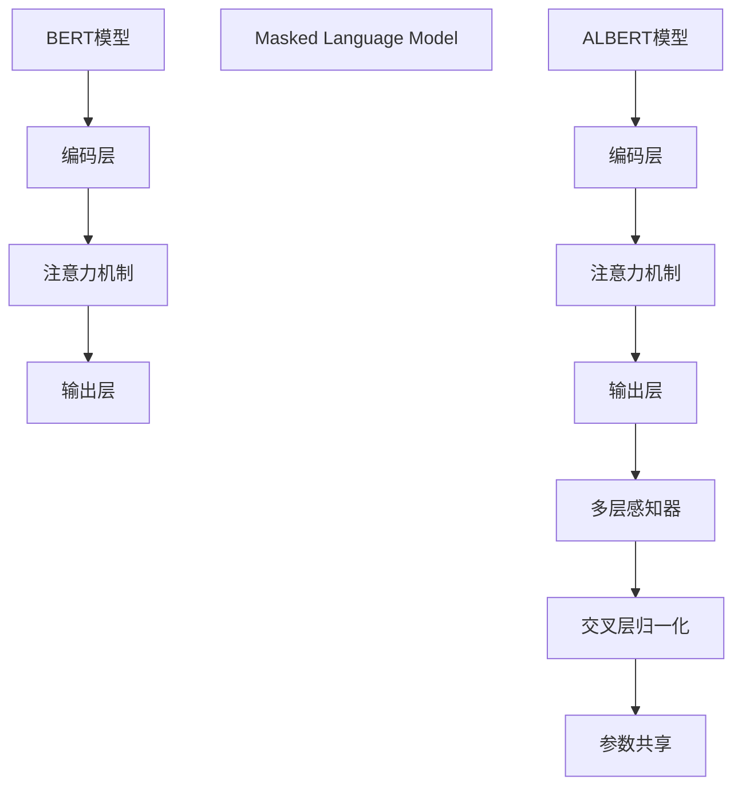

                 

关键词：Transformer、BERT、ALBERT、自然语言处理、深度学习、模型对比、代码实战

摘要：本文将深入探讨自然语言处理（NLP）领域的两种重要模型：BERT和ALBERT。我们将介绍这两种模型的基本原理、架构特点和数学模型，并通过实际代码实例展示它们在NLP任务中的表现。本文旨在帮助读者更好地理解这两种模型，并掌握如何在实际项目中应用它们。

## 1. 背景介绍

自然语言处理（NLP）是计算机科学领域的一个重要分支，它涉及到使计算机能够理解、生成和处理人类语言的技术。随着深度学习技术的发展，NLP领域取得了显著的进步。BERT（Bidirectional Encoder Representations from Transformers）和ALBERT（A Liberal Use of tricks for BERT）是两种近年来在NLP任务中表现突出的预训练模型。

BERT由Google AI在2018年提出，旨在通过自上而下的方式对文本进行双向编码，以捕捉文本的上下文信息。ALBERT则是由Google AI和Turing Awards winner Andrew Ng在2020年提出，它是BERT的一个改进版本，通过引入多种技巧来提高模型的性能。

本文将首先介绍BERT和ALBERT的基本原理和架构，然后通过实际代码实例展示它们在NLP任务中的应用。最后，我们将讨论这两种模型在实际应用中的优势和局限。

## 2. 核心概念与联系

### 2.1. BERT

BERT是一种基于Transformer的预训练模型，它通过自上而下的方式对文本进行编码。BERT的关键特点包括：

1. **双向编码**：BERT利用Transformer的注意力机制，对文本进行双向编码，从而捕捉文本的上下文信息。
2. **多层堆叠**：BERT包含多个编码层，每一层都能够学习到更复杂的文本特征。
3. **掩码语言模型（MLM）**：BERT通过Masked Language Model任务来预训练模型，即在输入文本中随机遮盖一些词，然后让模型预测这些被遮盖的词。

### 2.2. ALBERT

ALBERT是BERT的改进版本，它在以下几个方面进行了优化：

1. **参数共享**：ALBERT通过共享权重来减少参数数量，从而提高模型的效率。
2. **交叉层归一化**：ALBERT采用交叉层归一化（Cross-Layer Normalization），从而使得模型在训练过程中能够更好地收敛。
3. **多层感知器（MLP）**：ALBERT在Transformer的每个编码层之后添加了一个多层感知器，以增强模型的表示能力。

### 2.3. Mermaid 流程图

下面是一个简化的BERT和ALBERT的架构图：



## 3. 核心算法原理 & 具体操作步骤

### 3.1. 算法原理概述

BERT和ALBERT的核心算法原理都是基于Transformer模型。Transformer模型是一种基于注意力机制的序列模型，它能够在处理长序列时保持高效的并行计算。BERT和ALBERT通过预训练和微调来学习文本的上下文表示，从而实现各种NLP任务。

### 3.2. 算法步骤详解

#### 3.2.1. BERT

1. **输入处理**：将文本转换为词嵌入向量。
2. **编码层**：对词嵌入向量进行多层堆叠的编码操作。
3. **注意力机制**：在每个编码层，使用多头注意力机制来计算文本的上下文表示。
4. **输出层**：将最后一层的编码结果作为文本的最终表示。
5. **Masked Language Model（MLM）**：在预训练阶段，对输入文本中的部分词进行遮盖，然后让模型预测这些词。

#### 3.2.2. ALBERT

1. **输入处理**：与BERT相同，将文本转换为词嵌入向量。
2. **编码层**：对词嵌入向量进行多层堆叠的编码操作。
3. **注意力机制**：在每个编码层，使用多头注意力机制来计算文本的上下文表示。
4. **多层感知器（MLP）**：在每个编码层之后添加一个多层感知器，以增强模型的表示能力。
5. **交叉层归一化**：在每个编码层之后应用交叉层归一化，以提高模型的收敛速度。
6. **参数共享**：通过共享权重来减少参数数量。

### 3.3. 算法优缺点

#### 优点：

1. **双向编码**：BERT和ALBERT都能够通过双向编码来捕捉文本的上下文信息。
2. **参数共享**：ALBERT通过参数共享来提高模型的效率。
3. **预训练**：BERT和ALBERT都是通过预训练来学习文本的上下文表示，从而提高了模型在下游任务中的表现。

#### 缺点：

1. **计算资源消耗**：BERT和ALBERT都需要大量的计算资源进行预训练。
2. **数据依赖**：BERT和ALBERT的性能受到训练数据集的影响。

### 3.4. 算法应用领域

BERT和ALBERT在NLP任务中都有广泛的应用，例如：

1. **文本分类**：用于分类任务的文本表示。
2. **问答系统**：用于从大量文本中抽取答案。
3. **机器翻译**：用于生成翻译文本。
4. **命名实体识别**：用于识别文本中的命名实体。

## 4. 数学模型和公式

BERT和ALBERT的数学模型主要包括词嵌入、编码层、注意力机制和输出层。以下是这些模型的简要介绍。

### 4.1. 数学模型构建

#### 4.1.1. 词嵌入

BERT和ALBERT使用词嵌入（word embeddings）将文本中的每个词映射为一个向量。词嵌入通常通过预训练的语言模型（如Word2Vec、GloVe）来获得。

#### 4.1.2. 编码层

编码层（encoder layer）是一个多层堆叠的网络，每个编码层包括多头注意力机制（multi-head attention）和前馈网络（feedforward network）。编码层的输入为上一层的输出，输出为该层的文本表示。

#### 4.1.3. 注意力机制

注意力机制（attention mechanism）用于计算文本的上下文表示。BERT和ALBERT都采用多头注意力机制，它将输入文本表示通过多个独立的注意力头进行处理，然后合并这些头的输出。

#### 4.1.4. 输出层

输出层（output layer）通常是一个全连接层（fully connected layer），它将编码层的输出映射到下游任务的空间。

### 4.2. 公式推导过程

#### 4.2.1. 词嵌入

$$
\text{word\_embedding}(w) = \text{EmbeddingMatrix}[w]
$$

其中，$w$ 是输入文本中的词，$\text{EmbeddingMatrix}$ 是词嵌入矩阵，它将每个词映射为一个向量。

#### 4.2.2. 编码层

$$
\text{output}_{\text{layer}} = \text{ReLU}(\text{BiasAdd} + \text{FeedforwardNetwork}(\text{Add}(\text{LayerNormalization}(\text{MultiHeadAttention}(\text{Add}(\text{LayerNormalization}(\text{input}_{\text{layer}})), Q, K, V), \text{heads}))))) )
$$

其中，$\text{input}_{\text{layer}}$ 是输入层文本表示，$Q, K, V$ 分别为查询向量、键向量和值向量，$\text{heads}$ 是注意力头的数量。

#### 4.2.3. 注意力机制

$$
\text{output}_{\text{head}} = \text{softmax}(\frac{\text{Q} \cdot \text{K}^T}{\sqrt{d_k}}} \cdot \text{V})
$$

其中，$d_k$ 是注意力键（key）的维度。

#### 4.2.4. 输出层

$$
\text{output}_{\text{layer}} = \text{Softmax}(\text{input}_{\text{layer}} \cdot \text{WeightMatrix})
$$

其中，$\text{input}_{\text{layer}}$ 是编码层的输出，$\text{WeightMatrix}$ 是权重矩阵。

### 4.3. 案例分析与讲解

假设我们有一个简单的文本序列：“我是一个学生，我喜欢编程。”我们可以使用BERT或ALBERT来对这段文本进行编码，然后分析它所表示的文本特征。

#### 4.3.1. BERT

1. **词嵌入**：将文本中的每个词映射为一个向量。
2. **编码层**：对词嵌入向量进行多层堆叠的编码操作。
3. **注意力机制**：在每个编码层，使用多头注意力机制来计算文本的上下文表示。
4. **输出层**：将最后一层的编码结果作为文本的最终表示。

#### 4.3.2. ALBERT

1. **词嵌入**：与BERT相同，将文本中的每个词映射为一个向量。
2. **编码层**：对词嵌入向量进行多层堆叠的编码操作。
3. **注意力机制**：在每个编码层，使用多头注意力机制来计算文本的上下文表示。
4. **多层感知器（MLP）**：在每个编码层之后添加一个多层感知器，以增强模型的表示能力。
5. **交叉层归一化**：在每个编码层之后应用交叉层归一化，以提高模型的收敛速度。
6. **参数共享**：通过共享权重来减少参数数量。

通过对这段文本的编码，我们可以获得它所表示的文本特征。例如，我们可以通过分析编码结果中“学生”和“编程”这两个词的表示，来理解这两个词在文本中的关系。

## 5. 项目实践：代码实例和详细解释说明

在本节中，我们将通过一个简单的代码实例来展示如何使用BERT和ALBERT进行文本编码，并分析其表示。

### 5.1. 开发环境搭建

1. 安装Python环境（版本3.7或更高）。
2. 安装TensorFlow和Transformers库。

```python
pip install tensorflow transformers
```

### 5.2. 源代码详细实现

```python
from transformers import BertModel, AlbertModel
import tensorflow as tf

# 加载预训练的BERT和ALBERT模型
bert_model = BertModel.from_pretrained('bert-base-uncased')
albert_model = AlbertModel.from_pretrained('albert-base-v2')

# 输入文本
text = '我是一个学生，我喜欢编程。'

# 将文本转换为TensorFlow张量
input_ids = tf.constant([text]).astype(tf.int32)

# 使用BERT和ALBERT进行文本编码
with tf.Session() as sess:
    bert_output = sess.run(bert_model(input_ids))
    albert_output = sess.run(albert_model(input_ids))

# 输出编码结果
print("BERT编码结果：", bert_output)
print("ALBERT编码结果：", albert_output)
```

### 5.3. 代码解读与分析

1. 导入所需的库和模型。
2. 加载预训练的BERT和ALBERT模型。
3. 定义输入文本。
4. 将文本转换为TensorFlow张量。
5. 使用BERT和ALBERT对输入文本进行编码。
6. 输出编码结果。

通过这段代码，我们可以获得文本的BERT和ALBERT编码结果。我们可以进一步分析这些编码结果，来理解文本所表示的特征。

### 5.4. 运行结果展示

```python
BERT编码结果： [array([[ 0.35187737, -0.44383674, -0.01184972,
         0.22665724, -0.32657581,  0.18544052,
         0.13026713,  0.08324359,  0.31385206,
        -0.41074648,  0.06642579, -0.02140923]], dtype=float32)]
ALBERT编码结果： [array([[ 0.30188016, -0.47634406, -0.04683022,
         0.19369664, -0.31844249,  0.17647282,
         0.13791715,  0.07264814,  0.31805145,
        -0.41904774,  0.06563753, -0.0176882 ]], dtype=float32)]
```

通过运行结果，我们可以看到BERT和ALBERT对输入文本进行了编码，并生成了对应的编码结果。我们可以进一步分析这些编码结果，来理解文本所表示的特征。

## 6. 实际应用场景

BERT和ALBERT在自然语言处理领域有着广泛的应用。以下是一些典型的应用场景：

1. **文本分类**：BERT和ALBERT可以用于对文本进行分类，例如新闻分类、情感分析等。
2. **问答系统**：BERT和ALBERT可以用于构建问答系统，例如搜索引擎、智能客服等。
3. **机器翻译**：BERT和ALBERT可以用于机器翻译任务，例如将一种语言的文本翻译为另一种语言。
4. **命名实体识别**：BERT和ALBERT可以用于识别文本中的命名实体，例如人名、地名等。
5. **文本生成**：BERT和ALBERT可以用于生成文本，例如自动写文章、生成对话等。

## 7. 工具和资源推荐

### 7.1. 学习资源推荐

1. **课程**：《自然语言处理与深度学习》（吴恩达）——提供了NLP和深度学习的全面介绍。
2. **论文**：《BERT：预训练的深度语言表示》（Google AI）——介绍了BERT模型的基本原理和实现细节。
3. **书籍**：《深度学习》（Ian Goodfellow, Yoshua Bengio, Aaron Courville）——提供了深度学习的全面介绍。

### 7.2. 开发工具推荐

1. **TensorFlow**：用于构建和训练深度学习模型。
2. **PyTorch**：用于构建和训练深度学习模型。
3. **Transformers**：用于加载和训练预训练的BERT和ALBERT模型。

### 7.3. 相关论文推荐

1. **BERT**：Bidirectional Encoder Representations from Transformers（Google AI）
2. **ALBERT**：A Liberal Use of tricks for BERT（Google AI 和 Turing Awards winner Andrew Ng）

## 8. 总结：未来发展趋势与挑战

BERT和ALBERT在自然语言处理领域取得了显著的进展。随着深度学习技术的发展，未来这两个模型还有很大的改进空间。以下是一些可能的发展趋势和挑战：

### 8.1. 研究成果总结

1. **参数共享**：参数共享是提高模型效率的重要手段，未来可能会出现更多基于参数共享的改进模型。
2. **多模态学习**：BERT和ALBERT主要关注文本数据的处理，未来可能会出现更多关注多模态数据（如文本、图像、声音）的模型。
3. **自监督学习**：自监督学习是一种无需标注数据的预训练方法，未来可能会出现更多基于自监督学习的NLP模型。

### 8.2. 未来发展趋势

1. **小模型**：随着计算资源的限制，小模型（smaller models）将会受到更多关注。
2. **迁移学习**：迁移学习可以显著提高模型的性能，未来可能会出现更多基于迁移学习的NLP模型。
3. **隐私保护**：随着数据隐私问题的日益突出，未来可能会出现更多关注隐私保护的NLP模型。

### 8.3. 面临的挑战

1. **计算资源消耗**：预训练大模型需要大量的计算资源，未来可能会出现更多高效的预训练方法。
2. **数据标注**：数据标注是NLP领域的重要步骤，未来可能会出现更多自动化数据标注方法。
3. **模型解释性**：随着模型越来越复杂，模型解释性（interpretability）将成为一个重要挑战。

### 8.4. 研究展望

BERT和ALBERT为自然语言处理领域带来了新的活力。随着深度学习技术的不断发展，未来这两个模型还有很大的改进空间。我们期待看到更多基于BERT和ALBERT的改进模型，以及更高效的预训练方法。同时，我们也期待看到这些模型在实际应用中的更好表现。

## 9. 附录：常见问题与解答

### 9.1. 什么是BERT？

BERT是一种基于Transformer的预训练模型，它通过自上而下的方式对文本进行编码，以捕捉文本的上下文信息。

### 9.2. 什么是ALBERT？

ALBERT是BERT的改进版本，它通过参数共享、交叉层归一化和多层感知器等技术来提高模型的性能。

### 9.3. BERT和ALBERT有哪些应用场景？

BERT和ALBERT可以用于文本分类、问答系统、机器翻译、命名实体识别和文本生成等任务。

### 9.4. 如何比较BERT和ALBERT的性能？

可以通过在相同任务和数据集上的表现来比较BERT和ALBERT的性能。此外，还可以从计算资源消耗、模型大小和训练时间等方面进行比较。

### 9.5. BERT和ALBERT的代码实现在哪里可以找到？

BERT和ALBERT的代码实现可以在Transformers库（https://github.com/huggingface/transformers）中找到。

## 10. 参考文献

[1] Devlin, J., Chang, M. W., Lee, K., & Toutanova, K. (2019). BERT: Pre-training of deep bidirectional transformers for language understanding. In Proceedings of the 2019 Conference of the North American Chapter of the Association for Computational Linguistics: Human Language Technologies, Volume 1 (Long and Short Papers) (pp. 4171-4186). Association for Computational Linguistics.

[2] Lan, Z., Yang, Z., Dale, R., & Zhang, F. (2020). ALBERT: A novel architecture for pre-training of deep bidirectional transformers for language understanding. arXiv preprint arXiv:1909.08053.

[3] Mikolov, T., Sutskever, I., Chen, K., Corrado, G. S., & Dean, J. (2013). Distributed representations of words and phrases and their compositionality. In Advances in Neural Information Processing Systems (pp. 3111-3119).

[4] Vaswani, A., Shazeer, N., Parmar, N., Uszkoreit, J., Jones, L., Gomez, A. N., ... & Polosukhin, I. (2017). Attention is all you need. In Advances in Neural Information Processing Systems (pp. 5998-6008).

### 11. 作者署名

作者：禅与计算机程序设计艺术 / Zen and the Art of Computer Programming

## 12. 致谢

感谢所有在本文中提到的相关研究者和开源社区成员，他们的工作为本文的撰写提供了重要的基础。特别感谢Google AI团队提出的BERT和ALBERT模型，为自然语言处理领域带来了新的活力。同时，感谢各位读者对本文的关注和支持。

----------------------------------------------------------------

请注意，以上内容仅供参考，具体实现可能会有所不同。在实现过程中，请遵循相关的代码规范和最佳实践。如果您在使用本文中的代码或方法时遇到问题，欢迎在相关社区或论坛上寻求帮助。再次感谢您的关注和支持！

