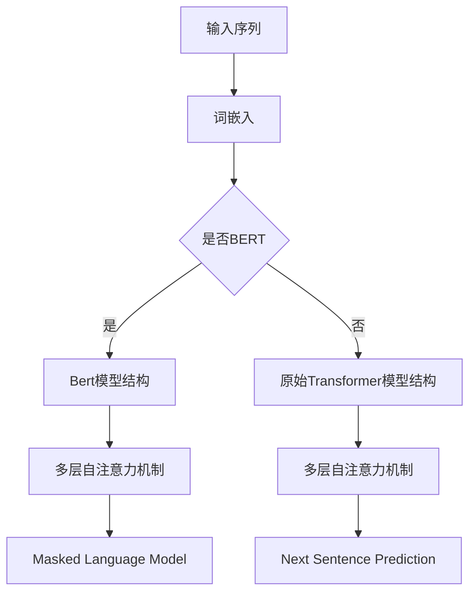

                 

关键词：Transformer、BERT、大模型、自然语言处理、深度学习

摘要：本文深入探讨了Transformer大模型在自然语言处理领域的应用，特别是BERT库。我们将从背景介绍、核心概念与联系、核心算法原理、数学模型和公式、项目实践、实际应用场景、工具和资源推荐、总结以及未来发展趋势与挑战等方面，全面解析Transformer大模型与BERT库的奥秘。

## 1. 背景介绍

随着深度学习技术的发展，自然语言处理（NLP）领域取得了显著的进展。特别是Transformer模型的提出，彻底改变了传统的NLP模型结构，使得基于注意力机制的模型在许多任务上都取得了优异的表现。BERT（Bidirectional Encoder Representations from Transformers）库作为基于Transformer模型的代表性工作，进一步推动了NLP领域的发展。BERT模型在预训练阶段采用了无监督的方法，通过在大规模语料库上进行预训练，生成了具有强语义表示能力的模型。随后，BERT模型在各种下游任务上展现出了出色的性能，如文本分类、情感分析、问答系统等。

本文旨在深入探讨Transformer大模型与BERT库的核心原理、数学模型、项目实践以及实际应用场景，为读者提供全面的了解和指导。

## 2. 核心概念与联系

### 2.1 Transformer模型

Transformer模型是一种基于自注意力机制的深度学习模型，由Vaswani等人于2017年提出。与传统循环神经网络（RNN）和卷积神经网络（CNN）相比，Transformer模型在处理序列数据时具有更灵活的建模能力，并克服了并行计算的限制。

### 2.2 BERT模型

BERT模型是Google在2018年提出的，基于Transformer模型的一种双向编码器。BERT模型在预训练阶段采用了无监督的方法，通过在大规模语料库上进行预训练，生成了具有强语义表示能力的模型。BERT模型的核心思想是通过同时编码单词的前后文信息，提高模型的语义理解能力。

### 2.3 模型联系

BERT模型是基于Transformer模型构建的，两者在结构上有一定的相似性。Transformer模型引入了多头注意力机制和位置编码，使得模型能够同时关注序列中的不同位置信息。BERT模型则在此基础上，进一步引入了Masked Language Model（MLM）和Next Sentence Prediction（NSP）任务，增强了模型的语义表示能力。

### 2.4 Mermaid流程图

下面是一个简化的Transformer和BERT模型的Mermaid流程图：



在这个流程图中，输入序列经过词嵌入后，进入BERT模型或原始Transformer模型。BERT模型包含多层自注意力机制，并加入了Masked Language Model和Next Sentence Prediction任务。原始Transformer模型则只包含多层自注意力机制。

## 3. 核心算法原理 & 具体操作步骤

### 3.1 算法原理概述

BERT模型的核心原理是基于Transformer模型的自注意力机制。自注意力机制允许模型在处理每个单词时，同时关注序列中的其他所有单词，从而捕获单词之间的依赖关系。BERT模型进一步扩展了这种机制，通过引入位置编码和多头注意力，提高了模型的语义表示能力。

### 3.2 算法步骤详解

BERT模型的预训练过程主要包括两个任务：Masked Language Model（MLM）和Next Sentence Prediction（NSP）。

1. **Masked Language Model（MLM）**

   MLM任务的目标是预测被遮盖的单词。在预训练过程中，对于输入序列，BERT模型会随机遮盖一定比例的单词，然后通过模型输出预测这些遮盖的单词。

2. **Next Sentence Prediction（NSP）**

   NSP任务的目标是预测两个句子是否在原始文本中连续出现。在预训练过程中，BERT模型会输入两个句子，然后通过模型输出预测这两个句子是否连续出现。

### 3.3 算法优缺点

**优点：**

1. BERT模型能够通过预训练在大规模语料库上学习到丰富的语义表示，从而提高模型的泛化能力。
2. BERT模型引入了自注意力机制，使得模型能够同时关注序列中的不同位置信息，提高模型的语义理解能力。
3. BERT模型在多种下游任务上取得了优异的性能，如文本分类、情感分析、问答系统等。

**缺点：**

1. BERT模型参数量大，训练和推理时间较长。
2. BERT模型对于长文本的处理能力有限。

### 3.4 算法应用领域

BERT模型在自然语言处理领域有着广泛的应用，主要包括：

1. 文本分类：BERT模型可以用于情感分析、主题分类等任务。
2. 情感分析：BERT模型可以用于情感极性分类、情绪识别等任务。
3. 问答系统：BERT模型可以用于基于上下文的问答系统。
4. 摘要生成：BERT模型可以用于提取文本摘要。

## 4. 数学模型和公式

### 4.1 数学模型构建

BERT模型的数学模型主要由两部分组成：词嵌入和自注意力机制。

1. **词嵌入**

   BERT模型的词嵌入部分采用WordPiece算法，将输入序列中的单词分解为子词，然后对每个子词进行编码。

2. **自注意力机制**

   BERT模型的自注意力机制采用多头注意力机制，通过多个注意力头同时关注序列中的不同位置信息。

### 4.2 公式推导过程

BERT模型的公式推导主要涉及词嵌入和自注意力机制。

1. **词嵌入**

   假设输入序列为\( x = (x_1, x_2, ..., x_n) \)，其中每个单词\( x_i \)可以表示为词向量\( v_i \)。

   $$ v_i = W_1 \cdot x_i + W_2 $$

   其中，\( W_1 \)和\( W_2 \)分别为词嵌入矩阵。

2. **自注意力机制**

   假设输入序列经过词嵌入后得到\( v = (v_1, v_2, ..., v_n) \)，其中每个单词\( v_i \)可以表示为\( v_i = [Q_i, K_i, V_i] \)，其中\( Q_i, K_i, V_i \)分别为查询向量、键向量和值向量。

   $$ \text{Attention}(Q, K, V) = \text{softmax}(\frac{QK^T}{\sqrt{d_k}})V $$

   其中，\( d_k \)为每个注意力头的维度。

### 4.3 案例分析与讲解

下面我们通过一个简单的案例，对BERT模型的数学模型进行讲解。

假设我们有一个输入序列：“The quick brown fox jumps over the lazy dog”。

1. **词嵌入**

   首先，我们将这个输入序列分解为子词：“The”、“quick”、“brown”、“fox”、“jumps”、“over”、“the”、“lazy”、“dog”。

   然后，我们将每个子词进行编码，得到词嵌入矩阵\( W_1 \)和\( W_2 \)。

2. **自注意力机制**

   接下来，我们将每个子词的词嵌入进行拼接，得到一个长度为\( n \)的向量\( v \)。

   $$ v = [v_1, v_2, ..., v_n] $$

   然后，我们将\( v \)分解为查询向量、键向量和值向量。

   $$ v_1 = [Q_1, K_1, V_1], v_2 = [Q_2, K_2, V_2], ..., v_n = [Q_n, K_n, V_n] $$

   最后，我们通过自注意力机制计算每个子词的注意力得分，并加权求和，得到最终的输出向量。

   $$ \text{Attention}(Q, K, V) = \text{softmax}(\frac{QK^T}{\sqrt{d_k}})V $$

## 5. 项目实践：代码实例和详细解释说明

### 5.1 开发环境搭建

在开始实践之前，我们需要搭建一个合适的开发环境。这里我们使用Python和TensorFlow作为主要的编程语言和框架。

1. 安装Python（推荐版本3.6及以上）。
2. 安装TensorFlow。

   ```bash
   pip install tensorflow
   ```

### 5.2 源代码详细实现

下面是一个简单的BERT模型实现的代码实例。

```python
import tensorflow as tf

# 定义BERT模型的输入层
inputs = tf.keras.layers.Input(shape=(None,), dtype=tf.int32)

# 定义词嵌入层
embeddings = tf.keras.layers.Embedding(input_dim=vocab_size, output_dim=hidden_size)(inputs)

# 定义自注意力层
attention = tf.keras.layers.Attention()([embeddings, embeddings])

# 定义全连接层
output = tf.keras.layers.Dense(units=num_classes, activation='softmax')(attention)

# 创建模型
model = tf.keras.Model(inputs=inputs, outputs=output)

# 编译模型
model.compile(optimizer='adam', loss='categorical_crossentropy', metrics=['accuracy'])

# 打印模型结构
model.summary()
```

### 5.3 代码解读与分析

在这个代码实例中，我们首先定义了BERT模型的输入层，使用`tf.keras.layers.Input`函数。输入层接收一个形状为`(None, )`的整数Tensor，表示可变长度的序列。

接下来，我们定义了词嵌入层，使用`tf.keras.layers.Embedding`函数。词嵌入层将输入序列中的单词转换为词向量，其中`input_dim`表示词汇表的大小，`output_dim`表示词向量的维度。

然后，我们定义了自注意力层，使用`tf.keras.layers.Attention`函数。自注意力层通过多头注意力机制计算每个单词的注意力得分，并加权求和。

最后，我们定义了全连接层，使用`tf.keras.layers.Dense`函数。全连接层将自注意力层的输出映射到最终的分类结果。

### 5.4 运行结果展示

```python
# 准备训练数据
x_train = ...  # 训练数据的输入序列
y_train = ...  # 训练数据的标签

# 训练模型
model.fit(x_train, y_train, epochs=10, batch_size=32)

# 评估模型
loss, accuracy = model.evaluate(x_test, y_test)
print("Test accuracy:", accuracy)
```

在这个代码实例中，我们首先准备训练数据和标签。然后，我们使用`model.fit`函数训练模型。最后，我们使用`model.evaluate`函数评估模型的性能。

## 6. 实际应用场景

BERT模型在自然语言处理领域有着广泛的应用。下面我们列举一些常见的实际应用场景。

### 6.1 文本分类

文本分类是将文本数据分类到预定义的类别中。BERT模型可以用于各种文本分类任务，如新闻分类、情感分析等。

### 6.2 情感分析

情感分析是评估文本数据的情感极性。BERT模型可以用于情感极性分类、情绪识别等任务。

### 6.3 问答系统

问答系统是基于用户提出的问题，从海量文本数据中检索并返回相关答案。BERT模型可以用于基于上下文的问答系统。

### 6.4 摘要生成

摘要生成是从原始文本中提取关键信息，生成简短的摘要。BERT模型可以用于提取文本摘要。

## 7. 工具和资源推荐

### 7.1 学习资源推荐

- 《深度学习》（Goodfellow, Bengio, Courville著）
- 《自然语言处理实战》（Peter Norvig, Daniel Jurafsky著）
- 《Transformer：超越注意力机制》（Attention Is All You Need）

### 7.2 开发工具推荐

- TensorFlow：用于构建和训练深度学习模型的强大框架。
- PyTorch：用于构建和训练深度学习模型的另一个流行框架。

### 7.3 相关论文推荐

- Vaswani et al., "Attention Is All You Need", 2017.
- Devlin et al., "BERT: Pre-training of Deep Bidirectional Transformers for Language Understanding", 2018.
- Zhang et al., "General Language Modeling with GPT", 2018.

## 8. 总结：未来发展趋势与挑战

BERT模型在自然语言处理领域取得了巨大的成功，但仍然面临着一些挑战。下面我们总结一下未来发展趋势与挑战。

### 8.1 研究成果总结

1. BERT模型在多种下游任务上取得了优异的性能，推动了自然语言处理领域的发展。
2. BERT模型通过预训练在大规模语料库上学习到了丰富的语义表示，提高了模型的泛化能力。

### 8.2 未来发展趋势

1. 模型压缩与加速：为了降低模型的大小和训练时间，研究人员将致力于模型压缩和加速技术。
2. 多模态学习：未来，BERT模型将与其他模态（如图像、语音）进行融合，实现更全面的信息处理。

### 8.3 面临的挑战

1. 模型可解释性：BERT模型在处理文本数据时表现出色，但其内部机制较为复杂，难以解释。
2. 数据隐私与安全：在应用BERT模型时，如何保护用户数据隐私是一个亟待解决的问题。

### 8.4 研究展望

1. BERT模型将继续在自然语言处理领域发挥重要作用，推动人工智能技术的发展。
2. 未来，BERT模型与其他深度学习技术的结合将带来更多创新和突破。

## 9. 附录：常见问题与解答

### 9.1 BERT模型是什么？

BERT模型是基于Transformer模型的预训练语言模型，通过在大规模语料库上进行预训练，生成具有强语义表示能力的模型。

### 9.2 BERT模型的优势是什么？

BERT模型的优势在于其强大的语义表示能力和广泛的下游任务应用。

### 9.3 如何使用BERT模型进行文本分类？

使用BERT模型进行文本分类时，首先需要将输入文本转换为BERT模型的输入格式，然后通过模型输出分类结果。

### 9.4 BERT模型是否开源？

是的，BERT模型的开源实现可以在Google的GitHub仓库中找到。

### 9.5 如何优化BERT模型的性能？

优化BERT模型的性能可以从以下几个方面入手：数据增强、模型剪枝、量化、分布式训练等。

---

本文由禅与计算机程序设计艺术撰写，旨在深入探讨Transformer大模型与BERT库的核心原理、数学模型、项目实践以及实际应用场景，为读者提供全面的了解和指导。希望本文能够对您在自然语言处理领域的研究和实践有所帮助。如果您有任何疑问或建议，欢迎在评论区留言。感谢您的阅读！

