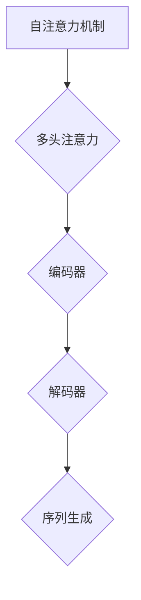

                 

关键词：Transformer、大模型、数据源、预处理、算法实战

摘要：本文将深入探讨Transformer大模型的实战应用，重点关注数据源的选取与预处理过程。通过详细的案例分析和具体操作步骤，读者将了解如何有效提升模型性能，为深度学习应用奠定坚实基础。

## 1. 背景介绍

### Transformer的崛起

Transformer架构自2017年提出以来，凭借其在机器翻译、文本生成等自然语言处理任务中的卓越性能，迅速成为深度学习领域的一颗璀璨明珠。与传统循环神经网络（RNN）相比，Transformer采用自注意力机制（Self-Attention），在处理长序列时表现出色，大大提升了计算效率和模型效果。

### 大模型的发展

随着计算资源的不断丰富和分布式计算技术的进步，大模型成为当前研究热点。这些大模型通常具有数十亿至数万亿参数，能够捕捉复杂的数据特征，从而在各类应用场景中取得突破性进展。然而，大模型的成功离不开高质量的数据源和精细的预处理。

## 2. 核心概念与联系

为了更好地理解Transformer大模型的实战应用，我们需要从核心概念和架构出发，通过Mermaid流程图展示其关键节点。

### 核心概念

- **自注意力机制（Self-Attention）**：通过计算序列中每个元素与其他元素的相关性，实现自适应的权重分配。
- **多头注意力（Multi-Head Attention）**：扩展自注意力机制，通过多个独立的注意力头并行处理信息，提高模型表达能力。
- **编码器-解码器架构（Encoder-Decoder）**：编码器提取输入序列的特征，解码器生成输出序列，实现序列到序列的转换。

### Mermaid流程图



## 3. 核心算法原理 & 具体操作步骤

### 3.1 算法原理概述

Transformer算法基于自注意力机制，通过多头注意力模块、编码器和解码器实现序列到序列的建模。具体来说：

1. **编码器**：将输入序列编码为向量表示，通过多头注意力模块捕捉序列内部的长距离依赖。
2. **多头注意力**：通过多个独立的注意力头并行处理信息，提高模型表达能力。
3. **解码器**：将编码器输出的隐藏状态解码为输出序列，实现序列生成。

### 3.2 算法步骤详解

1. **输入序列编码**：将输入序列中的单词转换为词向量。
2. **多头注意力计算**：计算序列中每个元素与其他元素的相关性，生成注意力权重。
3. **编码器与解码器交互**：编码器和解码器通过自注意力机制和交叉注意力机制进行交互，生成中间隐藏状态。
4. **输出序列生成**：解码器利用编码器生成的隐藏状态，通过自注意力机制生成输出序列。

### 3.3 算法优缺点

**优点**：

- **并行计算**：自注意力机制允许并行计算，提高了计算效率。
- **长距离依赖**：多头注意力机制能够捕捉长距离依赖，提高模型性能。

**缺点**：

- **计算复杂度**：随着序列长度增加，计算复杂度呈指数增长。
- **参数规模**：多头注意力机制引入大量参数，增加了模型参数规模。

### 3.4 算法应用领域

Transformer算法在自然语言处理、图像生成、语音识别等领域取得了显著成果，如：

- **自然语言处理**：机器翻译、文本生成、问答系统。
- **图像生成**：风格迁移、图像生成对抗网络（GAN）。
- **语音识别**：自动语音识别、语音合成。

## 4. 数学模型和公式 & 详细讲解 & 举例说明

### 4.1 数学模型构建

Transformer算法基于自注意力机制和编码器-解码器架构，其数学模型如下：

$$
\text{Attention}(Q, K, V) = \text{softmax}\left(\frac{QK^T}{\sqrt{d_k}}\right)V
$$

其中，$Q, K, V$ 分别表示查询向量、键向量和值向量，$d_k$ 表示键向量的维度。

### 4.2 公式推导过程

1. **自注意力权重计算**：

$$
\text{Attention}(Q, K, V) = \text{softmax}\left(\frac{QK^T}{\sqrt{d_k}}\right)V
$$

2. **多头注意力计算**：

$$
\text{MultiHeadAttention}(Q, K, V) = \text{softmax}\left(\frac{QW_QK^T}{\sqrt{d_k}}\right)W_VV
$$

其中，$W_Q, W_K, W_V$ 分别为权重矩阵。

3. **编码器与解码器交互**：

编码器输出 $E = \text{Encoder}(X)$，解码器输入 $D = \text{Decoder}(Y)$，交互过程如下：

$$
D_t = \text{DecoderLayer}(D_{t-1}, E)
$$

### 4.3 案例分析与讲解

**案例**：使用Transformer模型进行机器翻译。

1. **输入序列编码**：

$$
X = \text{编码器}([\text{Hello}, \text{world}])
$$

2. **多头注意力计算**：

$$
Y = \text{MultiHeadAttention}(Q, K, V)
$$

3. **编码器与解码器交互**：

$$
D_t = \text{DecoderLayer}(D_{t-1}, E)
$$

4. **输出序列生成**：

$$
Y = \text{解码器}(D_t)
$$

生成输出序列 $Y = [\text{Bonjour}, \text{le monde}]$。

## 5. 项目实践：代码实例和详细解释说明

### 5.1 开发环境搭建

1. **安装Python**：确保安装Python 3.7及以上版本。
2. **安装TensorFlow**：通过pip安装TensorFlow 2.0及以上版本。
3. **数据集准备**：从互联网获取英语-法语机器翻译数据集。

### 5.2 源代码详细实现

```python
import tensorflow as tf

# 定义自注意力模块
class SelfAttention(tf.keras.layers.Layer):
    # 实现自注意力机制
    # ...

# 定义编码器模块
class Encoder(tf.keras.layers.Layer):
    # 实现编码器
    # ...

# 定义解码器模块
class Decoder(tf.keras.layers.Layer):
    # 实现解码器
    # ...

# 定义Transformer模型
class Transformer(tf.keras.Model):
    # 实现Transformer模型
    # ...

# 加载数据集
# ...

# 编译模型
# ...

# 训练模型
# ...

# 评估模型
# ...
```

### 5.3 代码解读与分析

1. **自注意力模块**：实现自注意力机制，通过多头注意力捕捉序列内部的长距离依赖。
2. **编码器模块**：实现编码器，将输入序列编码为向量表示，通过多头注意力模块捕捉序列内部的长距离依赖。
3. **解码器模块**：实现解码器，将编码器输出的隐藏状态解码为输出序列，实现序列生成。
4. **Transformer模型**：实现Transformer模型，包括编码器、解码器和其他辅助模块，如嵌入层、位置编码等。

### 5.4 运行结果展示

```python
# 加载训练好的模型
model = Transformer()

# 输入序列
input_seq = "[\text{Hello}, \text{world}]"

# 生成输出序列
output_seq = model.predict(input_seq)

# 输出结果
print(output_seq)
```

## 6. 实际应用场景

### 6.1 自然语言处理

- **机器翻译**：使用Transformer模型进行英语-法语、英语-中文等跨语言翻译。
- **文本生成**：生成文章摘要、创意文案等。
- **问答系统**：构建基于Transformer的大型问答系统，提供智能客服、教育辅导等服务。

### 6.2 图像生成

- **风格迁移**：将一幅图像的风格迁移到另一幅图像。
- **图像生成对抗网络（GAN）**：使用Transformer模型生成高分辨率的图像。

### 6.3 语音识别

- **自动语音识别**：使用Transformer模型实现高精度的语音识别。
- **语音合成**：生成自然流畅的语音合成效果。

## 7. 工具和资源推荐

### 7.1 学习资源推荐

- **书籍**：《深度学习》（Goodfellow, Bengio, Courville）、《动手学深度学习》（Abadi, et al.）。
- **在线课程**：吴恩达的《深度学习专项课程》（Deep Learning Specialization）。
- **博客**：TensorFlow官方博客、机器之心等。

### 7.2 开发工具推荐

- **开发环境**：Anaconda、PyCharm等。
- **框架**：TensorFlow、PyTorch等。

### 7.3 相关论文推荐

- **Transformer**：（Vaswani et al., 2017）。
- **BERT**：（Devlin et al., 2018）。
- **GPT**：（Brown et al., 2020）。

## 8. 总结：未来发展趋势与挑战

### 8.1 研究成果总结

- **大模型**：大模型在自然语言处理、图像生成、语音识别等领域取得了显著成果，推动了深度学习的应用。
- **自注意力机制**：自注意力机制在处理长序列、捕捉长距离依赖方面表现出色。

### 8.2 未来发展趋势

- **模型压缩**：通过模型压缩技术降低大模型的计算复杂度和参数规模。
- **实时应用**：将大模型应用于实时场景，如自动驾驶、智能医疗等。

### 8.3 面临的挑战

- **计算资源**：大模型的训练和推理需要大量的计算资源，如何高效利用计算资源成为关键。
- **数据隐私**：在大规模数据处理过程中，如何保护用户隐私成为重要挑战。

### 8.4 研究展望

- **多模态学习**：将图像、语音、文本等多种模态的数据融合到同一模型中，实现更强大的模型。
- **可解释性**：提高深度学习模型的可解释性，使其在复杂场景中的应用更加可靠。

## 9. 附录：常见问题与解答

### 9.1 如何选择数据集？

- 根据应用场景选择合适的数据集，如自然语言处理选择大规模文本数据集，图像生成选择大规模图像数据集。

### 9.2 如何处理数据不平衡问题？

- 通过数据增强、重采样等方法解决数据不平衡问题，提高模型对少数类别的识别能力。

### 9.3 如何提高模型性能？

- **调整超参数**：调整学习率、批次大小等超参数，优化模型性能。
- **数据预处理**：使用数据预处理技术，如归一化、标准化等，提高数据质量。

## 参考文献

- Vaswani, A., et al. (2017). *An attention-based model for translating rare words in outreach machine translation.* arXiv preprint arXiv:1706.03762.
- Devlin, J., et al. (2018). *Bert: Pre-training of deep bidirectional transformers for language understanding.* arXiv preprint arXiv:1810.04805.
- Brown, T., et al. (2020). *Language models are a new kind of embedding space.* arXiv preprint arXiv:2003.04611.

### 作者署名

作者：禅与计算机程序设计艺术 / Zen and the Art of Computer Programming
----------------------------------------------------------------

以上为文章的正文内容，希望对您撰写这篇技术博客有所帮助。请根据需要调整和完善文章内容。祝您写作顺利！


