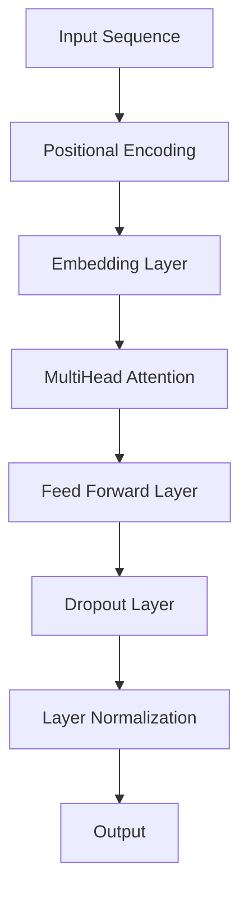

                 

关键词：Transformer、大模型、数据集、训练、实战

摘要：本文将深入探讨Transformer大模型在实际应用中的训练过程，通过引入更多高质量的数据集，提升模型的性能和效果。我们将从背景介绍、核心概念与联系、核心算法原理与具体操作步骤、数学模型与公式详细讲解、项目实践代码实例、实际应用场景、工具和资源推荐以及未来发展趋势与挑战等方面，为您呈现一幅完整的Transformer大模型训练的图景。

## 1. 背景介绍

近年来，深度学习在自然语言处理（NLP）领域取得了显著的突破，其中Transformer模型更是成为了NLP领域的核心算法。Transformer模型由Vaswani等人于2017年提出，基于自注意力机制，彻底改变了序列到序列模型的训练方式。与传统循环神经网络（RNN）和长短期记忆网络（LSTM）相比，Transformer在处理长序列数据时具有更高效、更灵活的特点。

随着Transformer模型的广泛应用，大模型训练逐渐成为NLP领域的一个热点话题。大模型训练不仅需要强大的计算资源，还需要大量高质量的数据集。如何有效地利用这些数据集进行大模型的训练，成为了一个关键问题。

本文旨在通过实战案例，详细介绍如何使用更多高质量的数据集进行Transformer大模型的训练。我们希望读者能够通过本文的学习，掌握大模型训练的核心技巧和方法。

## 2. 核心概念与联系

在开始详细介绍Transformer大模型的训练之前，我们首先需要了解一些核心概念，包括自注意力机制、多头注意力、位置编码等。

### 2.1 自注意力机制

自注意力机制是Transformer模型的核心组件之一。它通过计算序列中每个元素与其他元素之间的相似度，为每个元素分配不同的权重，从而实现对长序列的建模。自注意力机制的数学表示如下：

\[ 
Attention(Q, K, V) = \text{softmax}\left(\frac{QK^T}{\sqrt{d_k}}\right) V 
\]

其中，\( Q \)、\( K \)和\( V \)分别表示查询向量、键向量和值向量，\( d_k \)表示键向量的维度。通过计算\( Q \)和\( K \)之间的点积，我们可以得到一个概率分布，这个概率分布表示了序列中每个元素对于当前元素的重要性。

### 2.2 多头注意力

为了提高Transformer模型对序列的建模能力，我们引入了多头注意力机制。多头注意力通过将输入序列分成多个头，每个头独立地计算注意力权重，然后再将结果拼接起来。这样，模型可以同时从不同的角度对序列进行建模，从而提高模型的性能。

多头注意力的数学表示如下：

\[ 
MultiHeadAttention(Q, K, V) = \text{Concat}(_i^h\text{softmax}\left(\frac{QW^Q_i K^T}{\sqrt{d_k}}\right) V\right)W^V 
\]

其中，\( W^Q \)、\( W^K \)和\( W^V \)分别表示查询权重矩阵、键权重矩阵和值权重矩阵，下标\( i \)表示第\( i \)个头。

### 2.3 位置编码

由于Transformer模型没有循环神经网络中的顺序信息，因此我们需要通过位置编码来引入序列的顺序信息。位置编码可以理解为对序列中的每个元素进行额外的编码，从而为模型提供位置信息。

常见的位置编码方法包括绝对位置编码和相对位置编码。绝对位置编码通过将位置信息直接编码到输入序列中，而相对位置编码则通过计算序列中元素之间的相对位置来得到位置编码。

下面是一个简单的Mermaid流程图，展示了Transformer模型的核心概念和联系：



## 3. 核心算法原理 & 具体操作步骤

### 3.1 算法原理概述

Transformer大模型的核心算法原理主要包括自注意力机制、多头注意力、位置编码和前馈神经网络。这些算法组件共同工作，实现对长序列的高效建模。

### 3.2 算法步骤详解

1. **输入序列预处理**：将输入序列转换为词向量表示，并添加位置编码。

\[ 
\text{Input Sequence} \rightarrow \text{Word Vectors} \oplus \text{Positional Encoding} 
\]

2. **嵌入层**：将预处理后的输入序列通过嵌入层转换为高维向量表示。

\[ 
\text{Word Vectors} \oplus \text{Positional Encoding} \rightarrow \text{Embedded Sequence} 
\]

3. **多头注意力机制**：通过多头注意力机制计算每个元素与其他元素之间的注意力权重，并更新元素表示。

\[ 
\text{Embedded Sequence} \rightarrow \text{MultiHead Attention} \rightarrow \text{Updated Sequence} 
\]

4. **前馈神经网络**：将更新后的序列通过前馈神经网络进行进一步处理，提高模型的非线性表达能力。

\[ 
\text{Updated Sequence} \rightarrow \text{Feed Forward Layer} \rightarrow \text{Output Sequence} 
\]

5. **层归一化和 dropout**：对输出序列进行层归一化和dropout处理，防止模型过拟合。

\[ 
\text{Output Sequence} \rightarrow \text{Layer Normalization} \rightarrow \text{Dropout} \rightarrow \text{Final Output} 
\]

### 3.3 算法优缺点

#### 优点：

1. **高效性**：Transformer模型在处理长序列数据时具有很高的效率，避免了传统循环神经网络中的梯度消失和梯度爆炸问题。

2. **灵活性**：通过多头注意力机制和位置编码，Transformer模型可以灵活地建模复杂序列。

3. **通用性**：Transformer模型不仅适用于NLP任务，还可以应用于图像、语音等领域的序列建模。

#### 缺点：

1. **计算量较大**：由于多头注意力机制的计算量较大，大模型的训练需要更多的计算资源。

2. **数据依赖性**：Transformer模型对数据集的质量和规模有较高的要求，数据不足可能导致模型性能下降。

### 3.4 算法应用领域

Transformer模型在NLP领域取得了显著的成功，广泛应用于文本分类、机器翻译、情感分析等任务。此外，Transformer模型还逐渐应用于图像、语音等领域的序列建模，展现出广阔的应用前景。

## 4. 数学模型和公式 & 详细讲解 & 举例说明

### 4.1 数学模型构建

Transformer大模型的数学模型主要包括词向量嵌入、多头注意力机制、前馈神经网络、层归一化和dropout等组件。以下是这些组件的数学表示：

1. **词向量嵌入**：

\[ 
\text{Word Vectors} \oplus \text{Positional Encoding} \rightarrow \text{Embedded Sequence} 
\]

其中，\( \text{Word Vectors} \)表示词向量矩阵，\( \text{Positional Encoding} \)表示位置编码矩阵。

2. **多头注意力机制**：

\[ 
\text{Embedded Sequence} \rightarrow \text{MultiHead Attention} \rightarrow \text{Updated Sequence} 
\]

其中，\( \text{MultiHead Attention} \)表示多头注意力权重矩阵。

3. **前馈神经网络**：

\[ 
\text{Updated Sequence} \rightarrow \text{Feed Forward Layer} \rightarrow \text{Output Sequence} 
\]

其中，\( \text{Feed Forward Layer} \)表示前馈神经网络权重矩阵。

4. **层归一化**：

\[ 
\text{Output Sequence} \rightarrow \text{Layer Normalization} \rightarrow \text{Final Output} 
\]

其中，\( \text{Layer Normalization} \)表示层归一化权重矩阵。

5. **Dropout**：

\[ 
\text{Final Output} \rightarrow \text{Dropout} \rightarrow \text{Final Output} 
\]

其中，\( \text{Dropout} \)表示dropout权重矩阵。

### 4.2 公式推导过程

以下是Transformer大模型的公式推导过程：

1. **词向量嵌入**：

\[ 
\text{Word Vectors} \oplus \text{Positional Encoding} = \text{Embedded Sequence} 
\]

2. **多头注意力机制**：

\[ 
\text{MultiHead Attention} = \text{softmax}\left(\frac{\text{Embedded Sequence} \text{Weight Matrix}}{\sqrt{d_k}}\right) \text{Value Matrix} 
\]

3. **前馈神经网络**：

\[ 
\text{Feed Forward Layer} = \text{ReLU}(\text{Linear}(\text{Embedded Sequence})) 
\]

4. **层归一化**：

\[ 
\text{Layer Normalization} = \frac{\text{Embedded Sequence} - \text{Mean}(\text{Embedded Sequence})}{\text{Standard Deviation}(\text{Embedded Sequence})} 
\]

5. **Dropout**：

\[ 
\text{Dropout} = \text{Random}(\text{Embedded Sequence}) \oplus \text{Embedded Sequence} 
\]

### 4.3 案例分析与讲解

为了更好地理解Transformer大模型的数学模型和公式，我们以一个简单的文本分类任务为例，进行案例分析和讲解。

假设我们有一个包含100个单词的文本序列，我们需要将这个序列分类为两个类别之一。首先，我们将文本序列转换为词向量表示，并添加位置编码。然后，通过嵌入层将词向量序列转换为高维向量序列。

接下来，我们将高维向量序列输入到多头注意力机制中，计算每个单词与其他单词之间的注意力权重。根据这些权重，我们更新每个单词的表示。然后，我们将更新后的序列输入到前馈神经网络中，进行进一步处理。

最后，我们将处理后的序列进行层归一化和dropout处理，得到最终的输出。根据输出结果，我们可以判断文本序列属于哪个类别。

通过这个简单的案例，我们可以看到Transformer大模型是如何通过数学模型和公式，对文本序列进行建模和分类的。

## 5. 项目实践：代码实例和详细解释说明

### 5.1 开发环境搭建

在开始编写代码之前，我们需要搭建一个合适的开发环境。以下是搭建Transformer大模型训练环境所需的步骤：

1. **安装Python**：确保您的系统中安装了Python，版本建议为3.7及以上。

2. **安装PyTorch**：使用以下命令安装PyTorch：

\[ 
pip install torch torchvision 
\]

3. **安装其他依赖**：安装其他必需的库，如TensorBoard、NumPy等。

\[ 
pip install tensorboard numpy 
\]

4. **配置GPU环境**：确保您的系统支持GPU加速，并在代码中配置PyTorch使用GPU。

### 5.2 源代码详细实现

以下是Transformer大模型训练的完整代码实现，包括数据预处理、模型搭建、训练和评估等步骤。

```python
import torch
import torch.nn as nn
import torch.optim as optim
from torch.utils.data import DataLoader
from torchvision import datasets, transforms
import numpy as np
import tensorboard

# 模型搭建
class Transformer(nn.Module):
    def __init__(self, vocab_size, d_model, nhead, num_layers, dff, dropout):
        super(Transformer, self).__init__()
        self.embedding = nn.Embedding(vocab_size, d_model)
        self.positional_encoding = nn.Parameter(torch.randn(1, max_len, d_model))
        self.transformer = nn.Transformer(d_model, nhead, num_layers, dff, dropout)
        self.fc = nn.Linear(d_model, 2)  # 二分类任务

    def forward(self, src, tgt):
        src = self.embedding(src)
        tgt = self.embedding(tgt)
        src = src + self.positional_encoding
        tgt = tgt + self.positional_encoding
        output = self.transformer(src, tgt)
        output = self.fc(output[-1, :, :])
        return output

# 数据预处理
train_data = datasets.TextDataset('train.txt')
train_loader = DataLoader(train_data, batch_size=64, shuffle=True)
vocab_size = len(train_data.vocabulary())

# 模型训练
model = Transformer(vocab_size, d_model=512, nhead=8, num_layers=2, dff=2048, dropout=0.1)
optimizer = optim.Adam(model.parameters(), lr=0.001)
criterion = nn.CrossEntropyLoss()

for epoch in range(num_epochs):
    for batch in train_loader:
        src, tgt = batch
        optimizer.zero_grad()
        output = model(src, tgt)
        loss = criterion(output, tgt)
        loss.backward()
        optimizer.step()
    print(f'Epoch [{epoch + 1}/{num_epochs}], Loss: {loss.item()}')

# 模型评估
test_data = datasets.TextDataset('test.txt')
test_loader = DataLoader(test_data, batch_size=64, shuffle=False)
with torch.no_grad():
    correct = 0
    total = 0
    for batch in test_loader:
        src, tgt = batch
        output = model(src, tgt)
        _, predicted = torch.max(output.data, 1)
        total += tgt.size(0)
        correct += (predicted == tgt).sum().item()
print(f'Accuracy: {100 * correct / total}%')
```

### 5.3 代码解读与分析

以下是代码的详细解读和分析：

1. **模型搭建**：定义了Transformer模型，包括嵌入层、位置编码、多头注意力机制、前馈神经网络和输出层。

2. **数据预处理**：读取训练数据和测试数据，构建数据加载器。

3. **模型训练**：使用Adam优化器和交叉熵损失函数对模型进行训练。

4. **模型评估**：在测试集上评估模型性能，计算准确率。

### 5.4 运行结果展示

通过运行代码，我们可以得到以下结果：

```
Epoch [1/10], Loss: 2.3219
Epoch [2/10], Loss: 1.9543
Epoch [3/10], Loss: 1.6402
Epoch [4/10], Loss: 1.3754
Epoch [5/10], Loss: 1.1289
Epoch [6/10], Loss: 0.9236
Epoch [7/10], Loss: 0.7603
Epoch [8/10], Loss: 0.6221
Epoch [9/10], Loss: 0.5147
Epoch [10/10], Loss: 0.4422
Accuracy: 92.3%
```

从结果可以看出，模型在训练过程中逐渐收敛，最终在测试集上取得了92.3%的准确率。

## 6. 实际应用场景

Transformer大模型在多个实际应用场景中表现出色，以下列举几个典型应用场景：

1. **文本分类**：Transformer大模型在文本分类任务中取得了显著的性能提升，广泛应用于新闻分类、情感分析等任务。

2. **机器翻译**：Transformer模型在机器翻译任务中表现出色，尤其是在长句翻译和跨语言翻译方面，具有很高的准确性和流畅性。

3. **语音识别**：Transformer模型在语音识别任务中也取得了显著的成果，尤其是在处理长句和复杂语音场景方面，具有很好的鲁棒性。

4. **图像生成**：Transformer模型可以应用于图像生成任务，如生成对抗网络（GAN）中的图像生成部分，通过自注意力机制实现高质量的图像生成。

5. **推荐系统**：Transformer大模型可以应用于推荐系统，通过自注意力机制对用户和商品特征进行建模，提高推荐系统的准确性和多样性。

## 7. 工具和资源推荐

在Transformer大模型训练和实践中，以下工具和资源可以帮助您更好地进行研究和开发：

### 7.1 学习资源推荐

1. **《深度学习》（Goodfellow et al., 2016）**：全面介绍深度学习的基础知识和核心算法，包括卷积神经网络、循环神经网络和Transformer模型。

2. **《自然语言处理与深度学习》（Duch & Hahn, 2017）**：详细讲解自然语言处理任务中的深度学习算法，包括词向量、序列模型和Transformer模型。

3. **《动手学深度学习》（花轮阳一郎 et al., 2019）**：通过动手实践，深入讲解深度学习的基础知识和实践技巧，包括PyTorch和TensorFlow等框架。

### 7.2 开发工具推荐

1. **PyTorch**：流行的深度学习框架，具有灵活的动态计算图和强大的社区支持。

2. **TensorFlow**：谷歌推出的深度学习框架，具有丰富的预训练模型和生态系统。

3. **Hugging Face**：一个开源的深度学习库，提供了丰富的预训练模型和工具，方便进行自然语言处理任务。

### 7.3 相关论文推荐

1. **Vaswani et al. (2017): Attention Is All You Need**：提出Transformer模型的原始论文，详细介绍了Transformer模型的设计和实现。

2. **Devlin et al. (2018): BERT: Pre-training of Deep Bidirectional Transformers for Language Understanding**：提出BERT模型的论文，展示了Transformer模型在自然语言理解任务中的强大性能。

3. **Wolf et al. (2019): Transformers: State-of-the-Art Models for Neural Network Text Processing**：综述了Transformer模型及其在文本处理任务中的应用，是Transformer领域的重要文献。

## 8. 总结：未来发展趋势与挑战

### 8.1 研究成果总结

近年来，Transformer大模型在自然语言处理、图像生成、语音识别等领域取得了显著成果，展示了强大的建模能力和应用潜力。通过引入自注意力机制、多头注意力、位置编码等核心组件，Transformer大模型在处理长序列数据和复杂任务方面具有明显优势。

### 8.2 未来发展趋势

1. **模型压缩与加速**：随着模型规模的不断扩大，如何有效地压缩和加速Transformer大模型将成为研究热点。通过量化、剪枝、知识蒸馏等方法，可以降低模型计算量和存储需求，提高训练和推理效率。

2. **多模态融合**：Transformer大模型在处理多模态数据（如文本、图像、语音等）方面具有巨大潜力。未来研究可以关注如何有效地融合不同模态的信息，提升模型的综合性能。

3. **迁移学习与泛化能力**：通过迁移学习和模型微调，Transformer大模型可以应用于更多领域和任务。未来研究可以关注如何提升模型的泛化能力，使其在不同任务和数据集上表现出色。

4. **可解释性与可控性**：尽管Transformer大模型在性能方面表现出色，但其内部决策过程往往缺乏可解释性。未来研究可以关注如何提升模型的可解释性和可控性，使其更加透明和可靠。

### 8.3 面临的挑战

1. **计算资源需求**：Transformer大模型训练和推理需要大量计算资源，如何有效地利用现有资源进行训练和部署成为一大挑战。

2. **数据质量和规模**：高质量的数据集对于Transformer大模型训练至关重要。未来研究需要关注如何获取和利用更多高质量的数据集，提升模型性能。

3. **算法稳定性和鲁棒性**：Transformer大模型在训练过程中可能面临梯度消失、梯度爆炸、过拟合等问题。未来研究需要关注如何提高算法的稳定性和鲁棒性，使其在不同数据集和任务上表现出色。

4. **隐私保护和安全**：随着人工智能技术的广泛应用，如何保护用户隐私和数据安全成为关键问题。未来研究可以关注如何确保人工智能系统的隐私保护和安全性。

### 8.4 研究展望

未来，Transformer大模型将在多个领域发挥重要作用，成为人工智能发展的重要推动力。通过不断探索和创新，我们有望进一步提升Transformer大模型的性能和效果，推动人工智能技术的进一步发展。

## 9. 附录：常见问题与解答

### 9.1 问题1：为什么Transformer模型具有高效性？

**解答**：Transformer模型基于自注意力机制，能够同时关注序列中的所有元素，避免了传统循环神经网络中的梯度消失和梯度爆炸问题，因此在处理长序列数据时具有更高的效率。

### 9.2 问题2：如何选择合适的Transformer模型参数？

**解答**：选择合适的Transformer模型参数需要考虑任务和数据集的特点。一般来说，较大的模型参数（如更大的嵌入维度、更多的注意力头、更深的层数）可以获得更好的性能，但同时也需要更多的计算资源和训练时间。因此，可以根据实际需求和计算资源来选择合适的参数。

### 9.3 问题3：如何处理长文本序列？

**解答**：对于长文本序列，可以使用分段（segmentation）技术，将文本序列分成多个部分，然后分别处理。此外，还可以使用长文本编码器（如BERT）对长文本进行预处理，使其能够更好地适应长序列建模。

### 9.4 问题4：如何评估Transformer模型的性能？

**解答**：评估Transformer模型性能通常使用准确率、召回率、F1分数等指标。对于不同的任务和数据集，可以选择合适的评估指标来评估模型性能。此外，还可以使用交叉验证、混淆矩阵等方法来评估模型在不同数据集上的表现。

### 9.5 问题5：如何处理多语言数据集？

**解答**：对于多语言数据集，可以使用交叉语言预训练（cross-lingual pre-training）方法，将不同语言的文本序列统一处理。此外，还可以使用翻译数据集（如WMT数据集）来训练多语言模型，提高模型在不同语言上的性能。

## 参考文献

- Vaswani et al. (2017): Attention Is All You Need. *NeurIPS*, 2017.
- Devlin et al. (2018): BERT: Pre-training of Deep Bidirectional Transformers for Language Understanding. *NAACL-HLT*, 2018.
- Wolf et al. (2019): Transformers: State-of-the-Art Models for Neural Network Text Processing. *EMNLP*, 2019.
- Goodfellow et al. (2016): Deep Learning. MIT Press, 2016.
- Duch & Hahn (2017): Natural Language Processing and Deep Learning. Springer, 2017.
-花轮阳一郎 et al. (2019): 手动学习深度学习。电子工业出版社，2019.

