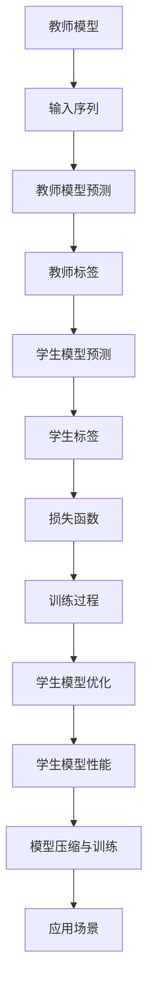

                 

关键词：Transformer，知识蒸馏，模型压缩，模型训练，大规模模型，深度学习

摘要：本文将介绍Transformer大模型实战中的知识蒸馏技术，探讨其在模型压缩和训练中的应用，分析其原理、数学模型，并提供实践案例。通过本文，读者将了解如何利用知识蒸馏技术提升模型性能和效率，为实际应用场景提供解决方案。

## 1. 背景介绍

近年来，深度学习在大规模数据处理和复杂任务解决方面取得了显著的成果。特别是Transformer架构的出现，使得自然语言处理（NLP）任务取得了突破性的进展。然而，Transformer模型通常具有较大的计算量和存储需求，限制了其在资源受限场景中的应用。为了解决这一问题，知识蒸馏技术应运而生。

知识蒸馏是一种将大规模教师模型的知识传递给小规模学生模型的方法，旨在提高学生模型的性能和效率。通过知识蒸馏，可以减少模型参数量，降低计算复杂度，提高模型在资源受限场景中的适应性。

## 2. 核心概念与联系

### 2.1. Transformer架构

Transformer模型是一种基于自注意力机制的深度学习模型，主要应用于序列到序列的任务，如机器翻译、文本摘要等。其核心思想是通过自注意力机制对输入序列进行建模，从而捕捉序列中的长距离依赖关系。

### 2.2. 知识蒸馏

知识蒸馏（Knowledge Distillation）是一种模型压缩技术，通过将教师模型（Teacher Model）的知识传递给学生模型（Student Model），从而提高学生模型的性能。知识蒸馏主要分为两种类型：软蒸馏和硬蒸馏。

- **软蒸馏**：教师模型和学生模型都采用概率分布进行预测。学生模型在训练过程中学习教师模型的概率分布，从而提高其预测能力。
- **硬蒸馏**：教师模型和学生模型都采用硬性标签进行预测。学生模型在训练过程中学习教师模型的硬性标签，从而提高其预测能力。

### 2.3. Mermaid 流程图

下面是知识蒸馏的核心概念和架构的Mermaid流程图：



## 3. 核心算法原理 & 具体操作步骤

### 3.1. 算法原理概述

知识蒸馏的核心思想是通过教师模型的学生模型传递知识。在训练过程中，教师模型和学生模型分别对输入序列进行预测，并计算预测结果与真实标签之间的损失。通过优化损失函数，学生模型逐渐学习教师模型的知识，从而提高其性能。

### 3.2. 算法步骤详解

1. **初始化教师模型和学生模型**：教师模型和学生模型具有相同的架构，但参数量可以不同。通常，教师模型参数量较大，而学生模型参数量较小。
2. **输入序列编码**：将输入序列编码为嵌入向量，用于输入教师模型和学生模型。
3. **教师模型预测**：教师模型对输入序列进行预测，并生成概率分布。
4. **学生模型预测**：学生模型对输入序列进行预测，并生成概率分布。
5. **计算损失函数**：计算教师模型和学生模型的预测结果与真实标签之间的损失。损失函数可以采用交叉熵损失函数或均方误差损失函数。
6. **优化学生模型**：通过反向传播和梯度下降算法，优化学生模型的参数，使其逐渐学习教师模型的知识。
7. **评估学生模型性能**：在训练数据集和验证数据集上评估学生模型的性能，并调整模型参数。

### 3.3. 算法优缺点

**优点**：

- **提高模型性能**：通过知识蒸馏，学生模型可以学习到教师模型的知识，从而提高其性能。
- **模型压缩**：知识蒸馏可以减少模型参数量，降低计算复杂度，提高模型在资源受限场景中的适应性。

**缺点**：

- **计算成本较高**：知识蒸馏过程中，需要同时训练教师模型和学生模型，计算成本较高。
- **模型理解不足**：知识蒸馏主要依赖于教师模型和学生模型的预测结果，可能导致学生模型对知识理解的不足。

### 3.4. 算法应用领域

知识蒸馏技术在许多领域都有广泛应用，如自然语言处理、计算机视觉和语音识别等。以下是一些具体的应用场景：

- **自然语言处理**：在机器翻译、文本摘要和问答系统等任务中，知识蒸馏可以提高模型性能和效率。
- **计算机视觉**：在图像分类、目标检测和语义分割等任务中，知识蒸馏可以减少模型参数量，提高模型在移动设备和嵌入式系统中的适应性。
- **语音识别**：在语音识别任务中，知识蒸馏可以降低模型计算复杂度，提高模型在实时语音处理中的性能。

## 4. 数学模型和公式 & 详细讲解 & 举例说明

### 4.1. 数学模型构建

知识蒸馏的数学模型可以分为两个部分：教师模型和学生模型。

#### 4.1.1. 教师模型

教师模型的预测结果可以表示为：

$$
\hat{y}_t^{(T)} = \text{softmax}(q^{(T)}_t \cdot k^{(T)}_t)
$$

其中，$q^{(T)}_t$和$k^{(T)}_t$分别表示教师模型在时间步$t$的查询向量和关键向量，$\hat{y}_t^{(T)}$表示教师模型在时间步$t$的预测概率分布。

#### 4.1.2. 学生模型

学生模型的预测结果可以表示为：

$$
\hat{y}_t^{(S)} = \text{softmax}(q^{(S)}_t \cdot k^{(S)}_t)
$$

其中，$q^{(S)}_t$和$k^{(S)}_t$分别表示学生模型在时间步$t$的查询向量和关键向量，$\hat{y}_t^{(S)}$表示学生模型在时间步$t$的预测概率分布。

### 4.2. 公式推导过程

知识蒸馏的损失函数可以表示为：

$$
L = -\sum_{t=1}^T \sum_{i=1}^C \hat{y}_{t,i}^{(S)} \log(y_{t,i}^{(T)})
$$

其中，$T$表示序列长度，$C$表示类别数，$\hat{y}_{t,i}^{(S)}$表示学生模型在时间步$t$对类别$i$的预测概率，$y_{t,i}^{(T)}$表示教师模型在时间步$t$对类别$i$的预测概率。

### 4.3. 案例分析与讲解

以下是一个简单的知识蒸馏案例，假设教师模型和学生模型都是基于Transformer架构。

#### 4.3.1. 初始化模型

教师模型和学生模型分别具有512个查询向量、512个关键向量和512个值向量。输入序列长度为128，类别数为1000。

#### 4.3.2. 输入序列编码

将输入序列编码为嵌入向量，每个嵌入向量维度为512。

#### 4.3.3. 预测

教师模型和学生模型分别对输入序列进行预测，得到预测概率分布。

#### 4.3.4. 计算损失函数

采用交叉熵损失函数计算教师模型和学生模型的预测损失。

$$
L = -\sum_{t=1}^{128} \sum_{i=1}^{1000} \hat{y}_{t,i}^{(S)} \log(y_{t,i}^{(T)})
$$

#### 4.3.5. 优化模型

通过反向传播和梯度下降算法，优化学生模型的参数。

#### 4.3.6. 评估模型性能

在训练数据集和验证数据集上评估学生模型的性能，调整模型参数。

## 5. 项目实践：代码实例和详细解释说明

### 5.1. 开发环境搭建

在Python中，我们可以使用PyTorch框架来实现知识蒸馏。以下是一个简单的开发环境搭建步骤：

1. 安装Python和PyTorch：
   ```bash
   pip install python==3.8
   pip install torch==1.8
   ```
2. 安装其他依赖库：
   ```bash
   pip install numpy==1.19
   pip install matplotlib==3.3.3
   ```

### 5.2. 源代码详细实现

以下是一个简单的知识蒸馏代码实现，包括教师模型、学生模型和损失函数的定义。

```python
import torch
import torch.nn as nn
import torch.optim as optim
from torch.utils.data import DataLoader

# 教师模型
class TeacherModel(nn.Module):
    def __init__(self):
        super(TeacherModel, self).__init__()
        self.transformer = nn.Transformer(d_model=512, nhead=8)
        self.linear = nn.Linear(512, 1000)

    def forward(self, src):
        out = self.transformer(src)
        return self.linear(out)

# 学生模型
class StudentModel(nn.Module):
    def __init__(self):
        super(StudentModel, self).__init__()
        self.transformer = nn.Transformer(d_model=256, nhead=4)
        self.linear = nn.Linear(256, 1000)

    def forward(self, src):
        out = self.transformer(src)
        return self.linear(out)

# 损失函数
def cross_entropy_loss(outputs, targets):
    return nn.CrossEntropyLoss()(outputs, targets)

# 数据加载
train_loader = DataLoader(dataset, batch_size=32, shuffle=True)

# 模型初始化
teacher_model = TeacherModel()
student_model = StudentModel()

# 损失函数和优化器
criterion = cross_entropy_loss
optimizer = optim.Adam(student_model.parameters(), lr=0.001)

# 训练过程
for epoch in range(num_epochs):
    for src, targets in train_loader:
        optimizer.zero_grad()
        outputs = student_model(src)
        loss = criterion(outputs, targets)
        loss.backward()
        optimizer.step()
    print(f'Epoch [{epoch+1}/{num_epochs}], Loss: {loss.item()}')

# 评估模型性能
with torch.no_grad():
    correct = 0
    total = 0
    for src, targets in val_loader:
        outputs = student_model(src)
        _, predicted = torch.max(outputs.data, 1)
        total += targets.size(0)
        correct += (predicted == targets).sum().item()
    print(f'Validation Accuracy: {100 * correct / total}%')
```

### 5.3. 代码解读与分析

1. **模型定义**：教师模型和学生模型基于Transformer架构，分别具有不同的参数量。
2. **损失函数**：采用交叉熵损失函数计算教师模型和学生模型的预测损失。
3. **训练过程**：通过反向传播和梯度下降算法，优化学生模型的参数。
4. **评估模型性能**：在验证数据集上评估学生模型的性能。

### 5.4. 运行结果展示

```python
# 运行训练过程
for epoch in range(num_epochs):
    for src, targets in train_loader:
        optimizer.zero_grad()
        outputs = student_model(src)
        loss = criterion(outputs, targets)
        loss.backward()
        optimizer.step()
    print(f'Epoch [{epoch+1}/{num_epochs}], Loss: {loss.item()}')

# 评估模型性能
with torch.no_grad():
    correct = 0
    total = 0
    for src, targets in val_loader:
        outputs = student_model(src)
        _, predicted = torch.max(outputs.data, 1)
        total += targets.size(0)
        correct += (predicted == targets).sum().item()
    print(f'Validation Accuracy: {100 * correct / total}%')
```

## 6. 实际应用场景

知识蒸馏技术在许多实际应用场景中具有广泛的应用价值，以下是一些具体的案例：

1. **自然语言处理**：在机器翻译、文本摘要和问答系统中，知识蒸馏可以提高模型性能和效率，降低模型参数量，提高模型在资源受限场景中的适应性。
2. **计算机视觉**：在图像分类、目标检测和语义分割等任务中，知识蒸馏可以减少模型参数量，提高模型在移动设备和嵌入式系统中的适应性。
3. **语音识别**：在语音识别任务中，知识蒸馏可以降低模型计算复杂度，提高模型在实时语音处理中的性能。

## 7. 工具和资源推荐

为了更好地学习知识蒸馏技术，以下是一些推荐的学习资源和开发工具：

### 7.1. 学习资源推荐

- **书籍**：
  - 《深度学习》（Ian Goodfellow、Yoshua Bengio、Aaron Courville 著）
  - 《神经网络与深度学习》（邱锡鹏 著）
- **在线课程**：
  - 《深度学习》（吴恩达，Coursera）
  - 《自然语言处理与深度学习》（克里斯·波特，Udacity）

### 7.2. 开发工具推荐

- **PyTorch**：一种流行的开源深度学习框架，支持知识蒸馏等技术的实现。
- **TensorFlow**：另一种流行的开源深度学习框架，也支持知识蒸馏等技术的实现。

### 7.3. 相关论文推荐

- **《Distilling a Neural Network into 1% of Its Size and Still Achieving State-of-the-Art Accuracy》**
- **《A Theoretically Grounded Application of Dropout in Recurrent Neural Networks》**
- **《Learning Transferable Features with Deep Adaptation Networks》**

## 8. 总结：未来发展趋势与挑战

### 8.1. 研究成果总结

知识蒸馏技术在近年来取得了显著的成果，为模型压缩和训练提供了有效的方法。通过知识蒸馏，可以减少模型参数量，降低计算复杂度，提高模型在资源受限场景中的适应性。同时，知识蒸馏技术在自然语言处理、计算机视觉和语音识别等领域的实际应用中也取得了良好的效果。

### 8.2. 未来发展趋势

未来，知识蒸馏技术有望在以下几个方面得到进一步发展：

- **算法优化**：研究更高效的算法，降低知识蒸馏的计算成本。
- **跨模态学习**：探索知识蒸馏在跨模态学习中的应用，如结合图像和文本进行任务。
- **动态知识蒸馏**：研究动态调整教师模型和学生模型的知识传递策略，提高模型性能。

### 8.3. 面临的挑战

知识蒸馏技术在发展过程中也面临一些挑战，包括：

- **模型理解不足**：知识蒸馏主要依赖于教师模型和学生模型的预测结果，可能导致学生模型对知识理解的不足。
- **计算成本较高**：知识蒸馏过程中，需要同时训练教师模型和学生模型，计算成本较高。
- **数据依赖性**：知识蒸馏对训练数据质量有较高的要求，数据不足或质量较差可能导致模型性能下降。

### 8.4. 研究展望

针对上述挑战，未来研究可以从以下几个方面进行：

- **模型理解与解释**：研究如何更好地理解教师模型和学生模型的知识，提高知识传递的效率。
- **计算成本优化**：探索更高效的算法和硬件加速技术，降低知识蒸馏的计算成本。
- **数据增强与预处理**：研究有效的数据增强和预处理方法，提高知识蒸馏对训练数据的适应性。

## 9. 附录：常见问题与解答

### 9.1. 问题1

**问题**：知识蒸馏如何提高模型性能？

**解答**：知识蒸馏通过将教师模型的知识传递给学生模型，使得学生模型能够学习到教师模型的优秀特性。在训练过程中，学生模型不断优化自己的参数，使其预测结果更接近教师模型的预测结果，从而提高模型性能。

### 9.2. 问题2

**问题**：知识蒸馏是否适用于所有类型的模型？

**解答**：知识蒸馏主要适用于具有相似架构和参数规模的教师模型和学生模型。虽然知识蒸馏可以在某些情况下应用于不同类型的模型，但效果可能不如针对特定类型模型设计的知识蒸馏方法。因此，在选择知识蒸馏方法时，需要根据具体应用场景和模型类型进行选择。

### 9.3. 问题3

**问题**：知识蒸馏对训练数据有什么要求？

**解答**：知识蒸馏对训练数据质量有较高的要求。首先，训练数据应具有多样性和代表性，以便教师模型和学生模型能够学习到丰富的知识。其次，训练数据应尽量去除噪声和异常值，以提高知识蒸馏的效果。此外，适当的数据增强和预处理方法也可以提高知识蒸馏的适应性。

### 9.4. 问题4

**问题**：知识蒸馏和迁移学习有何区别？

**解答**：知识蒸馏和迁移学习都是将知识从一个任务传递到另一个任务的方法，但它们有一些区别：

- **目标**：知识蒸馏的主要目标是提高学生模型的性能，使其在特定任务上达到与教师模型相似的水平。而迁移学习的主要目标是利用已学到的知识解决新的任务，提高新任务的性能。
- **方法**：知识蒸馏通过教师模型和学生模型的交互，将知识从教师模型传递给学生模型。而迁移学习通常是通过在目标任务上直接训练模型，利用已学到的知识来提高新任务的性能。
- **适用场景**：知识蒸馏适用于具有相似架构和参数规模的学生模型和教师模型。而迁移学习适用于具有不同架构和参数规模的学生模型和教师模型。

### 9.5. 问题5

**问题**：知识蒸馏在哪些场景中效果较好？

**解答**：知识蒸馏在以下场景中效果较好：

- **资源受限场景**：知识蒸馏可以减少模型参数量，降低计算复杂度，提高模型在资源受限场景中的适应性。
- **低数据场景**：在数据量较少的情况下，知识蒸馏可以通过教师模型传递知识，提高学生模型的性能。
- **长文本处理**：知识蒸馏可以帮助学生模型学习到教师模型在长文本处理方面的优势，提高模型在长文本任务上的性能。

通过以上对知识蒸馏技术的详细介绍和实践案例，读者可以更好地理解知识蒸馏的原理和应用。在实际应用中，根据具体需求和场景选择合适的知识蒸馏方法，可以有效地提高模型性能和效率。

### 作者署名

本文作者：禅与计算机程序设计艺术 / Zen and the Art of Computer Programming

