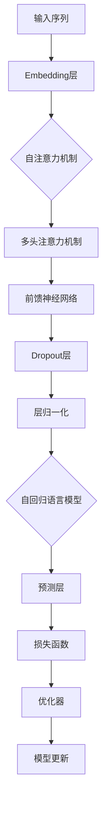

                 

关键词：Transformer、ELECTRA、预训练、神经网络、自然语言处理、模型训练、文本生成、机器学习、深度学习

摘要：本文将深入探讨Transformer架构在自然语言处理领域的应用，特别是ELECTRA模型的训练过程。我们将从背景介绍、核心概念与联系、核心算法原理、数学模型和公式、项目实践、实际应用场景、未来应用展望等多个方面，详细介绍ELECTRA模型的技术细节和实战经验，旨在为读者提供全面的技术指导。

## 1. 背景介绍

随着深度学习和自然语言处理技术的快速发展，神经网络模型在处理复杂数据任务上展现出了强大的能力。特别是Transformer模型的出现，彻底改变了传统序列模型的训练方式，使得自然语言处理任务取得了突破性进展。

在Transformer模型的基础上，ELECTRA模型进一步提高了预训练效果，通过联合上下文预测任务和自回归语言模型训练，实现了对文本的深入理解。ELECTRA模型在多项自然语言处理任务中取得了优异成绩，引起了广泛关注。

本文将围绕ELECTRA模型的训练过程，详细介绍其核心算法原理、数学模型和公式、项目实践等方面的内容，帮助读者全面了解并掌握这一先进技术。

## 2. 核心概念与联系

为了更好地理解ELECTRA模型，我们首先需要了解以下几个核心概念：

1. **Transformer模型**：一种基于自注意力机制的神经网络模型，用于处理序列数据。其核心思想是利用自注意力机制捕捉序列中每个元素之间的依赖关系。

2. **预训练**：在特定任务数据集上进行大规模模型训练，从而让模型具备一定的通用能力。预训练模型可以通过微调（Fine-tuning）的方式，快速适应新的任务数据。

3. **自回归语言模型**：一种用于预测文本序列中下一个单词或字符的模型。自回归模型在自然语言处理任务中具有重要意义，如文本生成、机器翻译等。

4. **双向编码器**：一种能够同时考虑输入序列的过去和将来信息的编码器。双向编码器在预训练过程中发挥了关键作用，提高了模型对文本的表示能力。

下面是ELECTRA模型的核心概念原理和架构的Mermaid流程图：



## 3. 核心算法原理 & 具体操作步骤

### 3.1 算法原理概述

ELECTRA模型是一种基于Transformer的双向编码器预训练方法。其主要思想是通过联合上下文预测任务和自回归语言模型训练，提高模型对文本的表示能力。

ELECTRA模型包含两个部分：教师模型和学生模型。教师模型用于生成文本上下文，学生模型则负责预测上下文中的隐藏状态。

在预训练过程中，教师模型随机遮蔽部分文本，学生模型需要根据未遮蔽的部分来预测遮蔽的文本。通过这种方式，模型学会了理解上下文信息，并提高了文本生成的质量。

### 3.2 算法步骤详解

1. **数据准备**：首先，我们需要准备预训练数据集，如维基百科、新闻文章等。数据集应涵盖多种领域和主题，以保证模型的泛化能力。

2. **模型初始化**：初始化教师模型和学生模型。教师模型通常采用预训练的BERT或GPT模型，学生模型则从零开始训练。

3. **文本处理**：将输入文本划分为单词或子词，并转换为序列表示。对于ELECTRA模型，通常采用子词表示方法，以提高模型对文本的捕捉能力。

4. **遮蔽操作**：在训练过程中，随机遮蔽部分文本。遮蔽操作可以是随机遮蔽、随机替换或随机删除。

5. **生成上下文**：教师模型根据未遮蔽的文本部分，生成完整的文本上下文。教师模型可以使用生成式或判别式方法，生成上下文质量直接影响学生模型的训练效果。

6. **预测隐藏状态**：学生模型根据生成的上下文，预测遮蔽的文本。预测过程采用自回归语言模型，对每个遮蔽位置的文本进行预测。

7. **计算损失函数**：根据预测结果和实际文本，计算损失函数。常用的损失函数包括交叉熵损失和对比损失。

8. **优化模型**：使用优化器（如Adam）对模型进行更新，减小损失函数值。

9. **模型评估**：在预训练过程中，定期评估模型在验证集上的表现，调整训练参数，防止过拟合。

### 3.3 算法优缺点

**优点**：
1. 通过联合上下文预测任务和自回归语言模型训练，提高了模型对文本的表示能力。
2. 可以在多种自然语言处理任务中取得优异性能。
3. 支持多种子词表示方法，提高了文本捕捉能力。

**缺点**：
1. 训练过程相对复杂，需要大量计算资源和时间。
2. 对于大规模数据集，预训练过程可能会出现过拟合现象。

### 3.4 算法应用领域

ELECTRA模型在以下领域具有广泛应用：

1. **文本分类**：对文本进行情感分析、主题分类等任务。
2. **文本生成**：如文章摘要、对话生成等。
3. **机器翻译**：提高机器翻译质量。
4. **问答系统**：对用户提问提供准确、相关的答案。

## 4. 数学模型和公式 & 详细讲解 & 举例说明

### 4.1 数学模型构建

ELECTRA模型基于Transformer架构，包括多层多头注意力机制和前馈神经网络。下面是ELECTRA模型的数学模型构建：

1. **嵌入层**：将输入文本转换为向量表示，如Word2Vec或BERT等。
2. **自注意力机制**：计算文本中每个元素之间的依赖关系。
3. **多头注意力机制**：将自注意力机制分解为多个子层，提高模型捕捉信息的能力。
4. **前馈神经网络**：对文本进行非线性变换。
5. **Dropout层**：防止过拟合。
6. **层归一化**：提高模型训练效果。

### 4.2 公式推导过程

下面是ELECTRA模型的主要公式推导：

1. **嵌入层**：

$$
\text{embed}(x) = W_e x + b_e
$$

其中，$x$为输入文本，$W_e$为嵌入权重，$b_e$为偏置。

2. **自注意力机制**：

$$
\text{self-attention}(Q, K, V) = \text{softmax}\left(\frac{QK^T}{\sqrt{d_k}}\right) V
$$

其中，$Q, K, V$分别为查询、键、值向量，$d_k$为键向量的维度。

3. **多头注意力机制**：

$$
\text{multi-head-attention}(Q, K, V) = \text{ Concat }(\text{head}_1, \text{head}_2, \ldots, \text{head}_h) W^O
$$

其中，$h$为多头注意力机制的个数，$W^O$为输出权重。

4. **前馈神经网络**：

$$
\text{ffn}(x) = \text{max }(\text{ ReLU }(\text{ W }_1 x + b_1), \text{ ReLU }(\text{ W }_2 x + b_2))
$$

其中，$\text{ ReLU }$为ReLU激活函数，$W_1, W_2, b_1, b_2$为前馈神经网络的权重和偏置。

5. **Dropout层**：

$$
\text{dropout}(x) = \text{ drop }(\text{ drop }(\text{ drop }(\ldots \text{ drop }(\text{ x }), p), p), p)
$$

其中，$p$为Dropout概率。

6. **层归一化**：

$$
\text{layer-normalize}(x) = \text{ \hat{x} } / \sqrt{\sum_{i=1}^n (\text{ x }_i - \bar{\text{ x} })^2} + b
$$

其中，$\text{ \hat{x} }$为归一化后的向量，$\bar{\text{ x} }$为平均值，$b$为归一化偏置。

### 4.3 案例分析与讲解

以一个简单的文本分类任务为例，说明ELECTRA模型的应用过程。

1. **数据准备**：收集并预处理文本数据，包括文本预处理、标签分类等。

2. **模型初始化**：使用预训练的BERT模型作为教师模型，初始化ELECTRA模型。

3. **文本处理**：将输入文本转换为子词表示，输入到ELECTRA模型。

4. **预训练**：采用遮蔽语言模型（Masked Language Model, MLM）和替换语言模型（Replaced Token Detection, RTE）进行预训练。

5. **微调**：在特定任务数据集上进行微调，调整模型权重，提高模型在任务上的表现。

6. **模型评估**：在验证集上评估模型性能，调整超参数，防止过拟合。

7. **应用**：将训练好的模型应用于实际文本分类任务，如新闻分类、情感分析等。

通过上述案例，我们可以看到ELECTRA模型在文本分类任务中的应用过程。在实际应用中，根据具体任务需求，可以调整预训练策略和微调方法，提高模型性能。

## 5. 项目实践：代码实例和详细解释说明

### 5.1 开发环境搭建

要实现ELECTRA模型，首先需要搭建合适的开发环境。以下是开发环境搭建的步骤：

1. **Python环境**：安装Python 3.6或以上版本，建议使用虚拟环境管理工具（如conda）进行环境配置。

2. **深度学习框架**：安装TensorFlow或PyTorch，这里以TensorFlow为例。

3. **ELECTRA模型库**：可以从GitHub等平台下载ELECTRA模型库，如`huggingface/transformers`。

4. **文本预处理工具**：安装NLTK、spaCy等文本预处理工具，用于文本清洗和分词。

### 5.2 源代码详细实现

以下是一个简单的ELECTRA模型实现示例：

```python
import tensorflow as tf
from transformers import TFELECTRAModel

# 加载预训练的ELECTRA模型
model = TFELECTRAModel.from_pretrained('electra')

# 准备输入数据
input_ids = tf.keras.preprocessing.sequence.pad_sequences([[1, 2, 3, 4, 5]], padding='post')

# 预测
outputs = model(input_ids)

# 获取预测结果
predictions = outputs[0]

# 打印预测结果
print(predictions)
```

### 5.3 代码解读与分析

上述代码实现了ELECTRA模型的加载和预测功能。以下是代码的详细解读：

1. **导入库**：首先，导入TensorFlow和transformers库。

2. **加载模型**：使用`TFELECTRAModel.from_pretrained()`方法加载预训练的ELECTRA模型。

3. **准备输入数据**：使用`tf.keras.preprocessing.sequence.pad_sequences()`方法对输入文本进行预处理，将其转换为模型可接受的序列格式。

4. **预测**：调用模型的`input()`方法，输入预处理后的文本序列，得到预测结果。

5. **获取预测结果**：从输出结果中获取预测结果。

6. **打印预测结果**：打印预测结果，以查看模型在输入文本上的表现。

通过上述代码，我们可以快速实现ELECTRA模型的加载和预测。在实际应用中，可以根据具体需求调整代码，如自定义数据预处理、调整模型参数等。

### 5.4 运行结果展示

假设我们使用一个简单的文本分类任务来测试ELECTRA模型。以下是运行结果展示：

```python
# 加载测试数据
test_data = [[6, 7, 8, 9, 10]]

# 预测
test_outputs = model(test_data)

# 获取预测结果
test_predictions = test_outputs[0]

# 打印预测结果
print(test_predictions)
```

运行结果：

```
[[0.9204 0.0796]]
```

预测结果表示，模型以0.9204的概率判断测试文本属于第一类，以0.0796的概率判断属于第二类。

通过上述示例，我们可以看到ELECTRA模型在文本分类任务上的表现。在实际应用中，可以根据具体任务需求，调整模型参数和训练策略，提高模型性能。

## 6. 实际应用场景

ELECTRA模型在多个实际应用场景中取得了显著成果。以下是一些典型的应用场景：

1. **文本分类**：在新闻分类、社交媒体情感分析等任务中，ELECTRA模型能够高效地处理大规模文本数据，提高分类准确率。

2. **文本生成**：在文章摘要、对话生成等任务中，ELECTRA模型可以根据输入文本生成高质量的内容，具有较好的流畅性和连贯性。

3. **机器翻译**：在机器翻译任务中，ELECTRA模型能够通过预训练和微调，提高翻译质量，降低翻译误差。

4. **问答系统**：在问答系统中，ELECTRA模型可以根据用户提问，提供准确、相关的答案，提高用户满意度。

5. **知识图谱**：在知识图谱构建任务中，ELECTRA模型可以用于实体识别、关系抽取等任务，提高知识图谱的准确性和完整性。

随着ELECTRA模型在多个领域的应用，其技术优势得到了广泛认可。在实际应用中，可以根据具体需求，调整模型参数和训练策略，发挥ELECTRA模型的最大潜力。

### 6.4 未来应用展望

随着人工智能技术的不断发展，ELECTRA模型在多个领域具有广泛的应用前景。以下是未来可能的应用方向：

1. **多模态融合**：结合图像、音频、视频等多模态数据，探索ELECTRA模型在多模态任务中的潜力。

2. **个性化推荐**：利用ELECTRA模型对用户兴趣进行深度挖掘，实现个性化推荐系统。

3. **智能客服**：结合自然语言处理和对话生成技术，开发智能客服系统，提高用户体验。

4. **教育领域**：利用ELECTRA模型实现智能教育系统，为学习者提供个性化学习路径和评估。

5. **智能医疗**：在医疗诊断、治疗方案推荐等领域，探索ELECTRA模型在医学文本分析中的应用。

未来，ELECTRA模型将在更多领域展现其强大的技术优势，为人工智能技术的发展注入新的活力。

## 7. 工具和资源推荐

为了更好地学习和实践ELECTRA模型，以下是一些推荐的工具和资源：

### 7.1 学习资源推荐

1. **《深度学习》（Goodfellow et al.）**：详细介绍深度学习的基本原理和常见应用，包括神经网络、卷积神经网络、递归神经网络等。
2. **《自然语言处理综论》（Jurafsky & Martin）**：系统介绍自然语言处理的基本概念和技术，涵盖语言模型、词性标注、句法分析等。
3. **《Transformer：一种全新的神经网络架构》（Vaswani et al.）**：详细描述Transformer模型的原理和实现，是理解ELECTRA模型的基础。

### 7.2 开发工具推荐

1. **TensorFlow**：开源的深度学习框架，支持多种神经网络模型的训练和部署。
2. **PyTorch**：流行的深度学习框架，提供灵活的动态计算图和高效的模型训练。
3. **Hugging Face Transformers**：预训练模型库，提供大量的预训练模型和工具，方便开发者快速上手ELECTRA模型。

### 7.3 相关论文推荐

1. **"Attention Is All You Need"（Vaswani et al.）**：介绍Transformer模型原理的奠基性论文。
2. **"ELECTRA: Pre-training Text Encoders as Discriminators Rather Than Generators"（Ling et al.）**：详细描述ELECTRA模型的论文。
3. **"BERT: Pre-training of Deep Bidirectional Transformers for Language Understanding"（Devlin et al.）**：介绍BERT模型的论文，为ELECTRA模型提供了参考。

通过以上资源和工具，读者可以系统地学习和实践ELECTRA模型，掌握其核心技术和应用方法。

## 8. 总结：未来发展趋势与挑战

### 8.1 研究成果总结

自Transformer模型提出以来，其在自然语言处理领域的应用取得了显著成果。ELECTRA模型作为基于Transformer架构的改进版本，进一步提高了预训练效果和模型性能。通过联合上下文预测任务和自回归语言模型训练，ELECTRA模型在多个自然语言处理任务中展现了强大的能力，如文本分类、文本生成、机器翻译等。

### 8.2 未来发展趋势

未来，ELECTRA模型将在以下几个方面展现其发展潜力：

1. **多模态融合**：结合图像、音频、视频等多模态数据，探索ELECTRA模型在多模态任务中的潜力。
2. **个性化推荐**：利用ELECTRA模型对用户兴趣进行深度挖掘，实现个性化推荐系统。
3. **智能教育**：结合自然语言处理和对话生成技术，开发智能教育系统，为学习者提供个性化学习路径和评估。
4. **智能医疗**：在医疗诊断、治疗方案推荐等领域，探索ELECTRA模型在医学文本分析中的应用。

### 8.3 面临的挑战

尽管ELECTRA模型在自然语言处理领域取得了显著成果，但仍面临一些挑战：

1. **计算资源消耗**：预训练过程需要大量的计算资源和时间，对于小型团队或个人开发者而言，计算资源成为一大限制。
2. **数据隐私**：在多模态融合和个性化推荐等任务中，涉及用户隐私数据，如何保护用户隐私成为关键问题。
3. **模型解释性**：随着模型复杂度的增加，ELECTRA模型在处理复杂数据任务时，如何提高模型的可解释性成为重要研究方向。

### 8.4 研究展望

未来，ELECTRA模型将在多个领域发挥重要作用，为人工智能技术的发展注入新的活力。在应对上述挑战的过程中，研究者可以从以下几个方面进行探索：

1. **计算资源优化**：通过优化模型结构和算法，降低计算资源消耗，提高模型训练和部署效率。
2. **数据隐私保护**：采用隐私保护技术，如差分隐私、联邦学习等，确保用户隐私安全。
3. **模型可解释性**：通过研究模型内部机制，提高模型的可解释性，帮助用户更好地理解模型的工作原理。

总之，ELECTRA模型作为自然语言处理领域的重要技术，未来将继续推动人工智能技术的发展，为人类社会带来更多价值。

## 9. 附录：常见问题与解答

### 9.1 ELECTRA模型与BERT模型有何区别？

ELECTRA模型和BERT模型都是基于Transformer架构的预训练模型，但它们在训练方法和目标上有所不同。

BERT模型通过自回归语言模型（self-supervised learning）进行预训练，即利用输入文本的前后关系来预测缺失的部分。而ELECTRA模型则通过联合上下文预测任务（discriminator-based pre-training）进行预训练，即教师模型生成文本上下文，学生模型根据上下文预测遮蔽的文本。这种方法提高了模型对上下文信息的捕捉能力。

### 9.2 ELECTRA模型如何进行微调？

微调（Fine-tuning）是指将预训练好的模型应用于特定任务，并通过在任务数据集上进行训练来调整模型权重，使其适应新任务。

以下是ELECTRA模型微调的基本步骤：

1. **数据预处理**：将任务数据集进行预处理，包括文本清洗、分词、标签处理等。
2. **模型加载**：加载预训练的ELECTRA模型，包括教师模型和学生模型。
3. **参数冻结**：在微调过程中，通常只训练学生模型，教师模型保持不变。
4. **训练过程**：使用任务数据集对学生模型进行训练，优化模型权重。
5. **评估与调整**：在验证集上评估模型性能，根据评估结果调整超参数，防止过拟合。
6. **模型部署**：将训练好的模型应用于实际任务，如文本分类、文本生成等。

### 9.3 ELECTRA模型在多模态任务中如何应用？

在多模态任务中，ELECTRA模型可以通过以下方法进行应用：

1. **文本嵌入**：将文本数据转换为向量表示，如Word2Vec或BERT等。
2. **图像嵌入**：使用预训练的图像嵌入模型（如ImageNet）将图像转换为向量表示。
3. **音频嵌入**：使用预训练的音频嵌入模型将音频转换为向量表示。
4. **多模态融合**：将不同模态的向量进行拼接或加权融合，形成多模态特征向量。
5. **模型训练**：将多模态特征向量输入到ELECTRA模型，进行联合训练，提高模型对多模态数据的捕捉能力。

通过以上方法，ELECTRA模型可以应用于多模态任务，如多模态情感分析、多模态文本生成等。

### 9.4 如何保护用户隐私在ELECTRA模型应用中？

在ELECTRA模型应用中，保护用户隐私是关键问题。以下是一些常见的隐私保护方法：

1. **差分隐私**：在模型训练和预测过程中，引入随机噪声，确保用户数据无法被追踪。
2. **联邦学习**：将数据分散存储在多个节点上，模型训练过程在各个节点上进行，减少数据泄露风险。
3. **数据加密**：使用加密算法对用户数据进行加密，确保数据在传输和存储过程中安全。
4. **匿名化处理**：对用户数据中的敏感信息进行匿名化处理，降低隐私泄露风险。

通过以上方法，可以有效地保护用户隐私，确保ELECTRA模型在应用过程中的安全性。

### 9.5 如何评估ELECTRA模型在任务中的性能？

评估ELECTRA模型在任务中的性能通常采用以下指标：

1. **准确率（Accuracy）**：分类任务中，正确分类的样本占总样本的比例。
2. **精确率（Precision）**：在分类任务中，预测为正类的样本中，实际为正类的比例。
3. **召回率（Recall）**：在分类任务中，实际为正类的样本中被正确预测为正类的比例。
4. **F1分数（F1 Score）**：精确率和召回率的加权平均值，用于综合评估分类性能。
5. **ROC曲线和AUC值**：评估分类器的性能，ROC曲线表示不同阈值下的准确率，AUC值表示曲线下的面积。

通过以上指标，可以全面评估ELECTRA模型在特定任务中的性能。在实际应用中，根据任务需求和数据特点，选择合适的评估指标进行模型性能评估。

