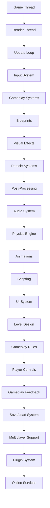

                 

关键词：Unreal Engine 4，游戏开发，视觉效果，游戏玩法，入门指南，电影级效果

> 摘要：本文将深入探讨Unreal Engine 4（UE4）在游戏开发中的应用，特别是其电影级的视觉效果和游戏玩法的实现方法。通过本文的阅读，读者将了解UE4的基础知识、核心功能以及如何利用这些功能创建令人惊叹的游戏体验。

## 1. 背景介绍

Unreal Engine 4（UE4）是一款由Epic Games开发的高级游戏引擎，自2014年发布以来，它已经成为游戏开发领域中最受欢迎的引擎之一。UE4以其出色的图形渲染能力、强大的物理引擎、灵活的脚本系统和丰富的插件生态系统而闻名。它不仅支持桌面和移动平台的开发，还支持虚拟现实和增强现实项目的创建。

在视觉效果方面，UE4采用了基于光线追踪的渲染技术，可以实现高质量的图像效果，如全局光照、反射、折射和模糊等。这使得开发者能够轻松地创建出接近电影级别的视觉效果。

在游戏玩法设计方面，UE4提供了丰富的工具和功能，如蓝图系统、动画系统、音频系统和游戏逻辑组件等，使得开发者可以轻松地实现复杂的游戏逻辑和流畅的玩家交互体验。

## 2. 核心概念与联系

为了更好地理解UE4的核心概念和工作原理，我们首先需要了解一些基本的概念和它们之间的关系。以下是一个用Mermaid绘制的流程图，展示了UE4中的核心概念及其联系：



### 2.1. 游戏循环

UE4的核心是游戏循环，它由多个线程组成，包括游戏线程（Game Thread）和渲染线程（Render Thread）。游戏线程负责处理游戏的逻辑更新，如角色控制、碰撞检测和游戏状态管理。而渲染线程则负责渲染游戏画面，包括场景的绘制、光照计算和后处理效果。

### 2.2. 游戏系统

游戏循环中的核心部分是游戏系统（Gameplay Systems），它包括了输入系统、游戏逻辑、视觉特效、粒子系统、音频系统、物理引擎、动画系统和脚本系统等。这些系统共同工作，为玩家提供丰富的游戏体验。

### 2.3. 蓝图系统

蓝图（Blueprints）是UE4中的一种可视化编程工具，它允许开发者通过拖放的方式来构建游戏逻辑和视觉特效，而不需要编写传统的代码。蓝图系统是UE4游戏开发中不可或缺的一部分，它使得游戏开发更加直观和易于迭代。

### 2.4. 游戏设计

游戏设计是游戏开发过程中至关重要的环节。它包括了关卡设计、游戏玩法规则、玩家控制和游戏反馈等。良好的游戏设计能够提升玩家的游戏体验，增加游戏的可玩性和吸引力。

## 3. 核心算法原理 & 具体操作步骤

### 3.1. 算法原理概述

UE4中的核心算法原理主要涉及图形渲染、物理模拟、音频处理和动画系统等方面。以下是一些关键的算法原理：

- **图形渲染**：基于光线追踪的渲染技术，实现高质量视觉效果。
- **物理模拟**：使用数值方法模拟物体的运动和碰撞，如刚体动力学和流体动力学。
- **音频处理**：利用声波传播模型和音频滤波器实现真实的音频效果。
- **动画系统**：基于蒙皮和混合技术，实现逼真的角色动画。

### 3.2. 算法步骤详解

以下是UE4中的核心算法步骤详解：

#### 3.2.1. 图形渲染

1. **场景构建**：将3D模型、灯光和其他视觉效果加载到内存中。
2. **光照计算**：使用全局光照和光线追踪技术计算场景中的光照效果。
3. **渲染绘制**：将场景绘制到屏幕上，包括阴影、反射、折射和后处理效果。

#### 3.2.2. 物理模拟

1. **物体初始化**：设置物体的质量和形状，初始化运动状态。
2. **碰撞检测**：检测物体之间的碰撞，计算碰撞响应。
3. **运动更新**：根据物理定律更新物体的位置和速度。

#### 3.2.3. 音频处理

1. **声音源加载**：将音频文件加载到内存中，设置声音源的位置和属性。
2. **声波传播**：使用声波传播模型计算声音在不同环境中的传播效果。
3. **音频渲染**：将音频信号转换为电信号，通过扬声器播放。

#### 3.2.4. 动画系统

1. **蒙皮计算**：根据角色的骨骼结构和蒙皮权重，计算角色表面的形变。
2. **动画混合**：将多个动画混合在一起，实现平滑的过渡效果。
3. **动画播放**：根据游戏逻辑和玩家输入，播放适当的动画。

### 3.3. 算法优缺点

#### 优点：

- **高质量视觉效果**：基于光线追踪的渲染技术，可以实现电影级别的图形效果。
- **强大的物理引擎**：支持多种物理模拟，如刚体动力学和流体动力学。
- **灵活的脚本系统**：蓝图系统和C++脚本相结合，为开发者提供了丰富的开发选项。
- **丰富的插件生态系统**：庞大的插件库，使得开发者可以扩展引擎功能。

#### 缺点：

- **性能要求高**：UE4需要较高的硬件性能来支持其强大的功能。
- **学习曲线较陡**：对于初学者来说，掌握UE4的所有功能可能需要一定的时间。

### 3.4. 算法应用领域

UE4的应用领域非常广泛，包括但不限于：

- **单机游戏开发**：如《堡垒之夜》、《火箭联盟》等。
- **网络游戏开发**：如《Apex Legends》、《守望先锋》等。
- **虚拟现实（VR）应用**：如《Epic Games Store》中的VR游戏。
- **电影制作**：如《黑镜：珍贵回忆》等。

## 4. 数学模型和公式 & 详细讲解 & 举例说明

### 4.1. 数学模型构建

在UE4中，许多核心算法都是基于数学模型构建的。以下是一些关键的数学模型及其构建方法：

#### 4.1.1. 光线追踪

光线追踪是一种基于几何的光线模拟技术，用于计算场景中的光照效果。其基本原理是模拟光线在场景中的传播过程，并计算光线的反射、折射和散射效果。

#### 4.1.2. 刚体动力学

刚体动力学是一种用于模拟物体运动的数学模型，基于牛顿运动定律。其基本原理是计算物体的加速度、速度和位置，并更新物体的状态。

#### 4.1.3. 流体动力学

流体动力学是一种用于模拟流体（如水、空气）运动的数学模型。其基本原理是计算流体的速度、压力和密度，并更新流体的状态。

### 4.2. 公式推导过程

以下是针对上述数学模型的一些关键公式及其推导过程：

#### 4.2.1. 光线追踪

光线追踪的核心公式是光线方程，用于计算光线在场景中的传播路径。其公式如下：

$$
L(p, \omega) = L_e(p, \omega) + \int f(\omega_i, \omega) \cdot L(p, \omega_i) \cdot (\omega_i \cdot n) d\omega_i
$$

其中，\(L(p, \omega)\) 是在点 \(p\) 和方向 \(\omega\) 的光强度，\(L_e(p, \omega)\) 是发射光强度，\(f(\omega_i, \omega)\) 是双向反射分布函数（BRDF），\(L(p, \omega_i)\) 是入射光强度，\(\omega_i\) 是入射方向，\(n\) 是法线方向。

#### 4.2.2. 刚体动力学

刚体动力学中的核心公式是牛顿运动定律，用于计算物体的加速度、速度和位置。其公式如下：

$$
F = m \cdot a
$$

$$
v = v_0 + a \cdot t
$$

$$
p = m \cdot v
$$

其中，\(F\) 是作用力，\(m\) 是质量，\(a\) 是加速度，\(v\) 是速度，\(v_0\) 是初速度，\(t\) 是时间，\(p\) 是动量。

#### 4.2.3. 流体动力学

流体动力学中的核心公式是纳维尔-斯托克斯方程，用于计算流体的速度、压力和密度。其公式如下：

$$
\frac{\partial \mathbf{u}}{\partial t} + (\mathbf{u} \cdot \nabla) \mathbf{u} = -\frac{1}{\rho} \nabla p + \nu \nabla^2 \mathbf{u}
$$

$$
\nabla \cdot \mathbf{u} = 0
$$

其中，\(\mathbf{u}\) 是速度场，\(p\) 是压力，\(\rho\) 是密度，\(\nu\) 是黏性系数。

### 4.3. 案例分析与讲解

为了更好地理解上述数学模型的应用，我们将通过一个简单的案例进行讲解。

#### 4.3.1. 光线追踪案例

假设有一个简单的场景，包含一个球体和一个平面。球体的半径为1单位，材质为白色；平面材质为黑色。我们使用光线追踪计算场景中的光照效果。

1. **场景构建**：首先，我们需要构建场景，将球体和平面加载到内存中。
2. **光照计算**：使用光线方程计算光线在场景中的传播路径，并计算球体和平面的反射和折射效果。
3. **渲染绘制**：将计算得到的光照效果绘制到屏幕上，得到最终的图像。

通过上述步骤，我们可以得到一个具有光线追踪效果的场景图像。

#### 4.3.2. 刚体动力学案例

假设有一个质量为5千克的物体，受到一个大小为10牛顿的力作用。我们需要计算物体的加速度、速度和位置。

1. **物体初始化**：设置物体的质量为5千克，作用力为10牛顿。
2. **碰撞检测**：检测物体与其他物体的碰撞，计算碰撞响应。
3. **运动更新**：根据牛顿运动定律，计算物体的加速度、速度和位置。

通过上述步骤，我们可以得到物体的运动轨迹和最终位置。

#### 4.3.3. 流体动力学案例

假设有一个流体容器，容器内部充满流体。我们需要计算流体的速度、压力和密度。

1. **容器初始化**：设置容器的大小和流体的密度。
2. **声波传播**：使用声波传播模型计算流体中的声波传播效果。
3. **流体更新**：根据纳维尔-斯托克斯方程，计算流体的速度、压力和密度。

通过上述步骤，我们可以得到流体的运动状态和最终分布。

## 5. 项目实践：代码实例和详细解释说明

### 5.1. 开发环境搭建

在开始项目实践之前，我们需要搭建一个适合UE4开发的开发环境。以下是搭建步骤：

1. **安装操作系统**：建议使用Windows 10或更高版本的操作系统。
2. **安装Visual Studio**：从官网下载并安装Visual Studio 2019 Community Edition。
3. **安装Unreal Engine**：从Epic Games官网下载并安装Unreal Engine 4。
4. **配置编辑器**：打开UE4编辑器，配置项目路径和开发环境。

### 5.2. 源代码详细实现

在UE4编辑器中，我们可以使用蓝图系统或C++脚本实现游戏逻辑和视觉效果。以下是一个简单的示例，展示了如何使用蓝图系统创建一个简单的游戏：

1. **创建蓝图**：在编辑器中，右键单击“内容浏览器”，选择“创建蓝图类”，命名为“SimpleGameMode”。
2. **添加组件**：在“SimpleGameMode”蓝图中，添加一个“游戏模式”组件和一个“玩家控制器”组件。
3. **编写逻辑**：在蓝图中，编写以下逻辑：

```csharp
UCLASS()
class AMyGameMode : AGameModeBase
{
    UFUNCTION(BlueprintCallable)
    void StartGame();

    UFUNCTION(BlueprintCallable)
    void EndGame();

    UFUNCTION(BlueprintImplementableEvent)
    virtual void GameStarted();

    UFUNCTION(BlueprintImplementableEvent)
    virtual void GameEnded();

protected:
    void GameStartedImpl() override
    {
        StartGame();
    }

    void GameEndedImpl() override
    {
        EndGame();
    }
};
```

4. **添加UI**：在蓝图中，添加一个UI文本组件，用于显示游戏状态。

### 5.3. 代码解读与分析

在上面的代码中，我们创建了一个名为“SimpleGameMode”的蓝图类，用于管理游戏的状态。具体来说：

- **UCLASS()**：这是一个宏，用于标记蓝图类，使得它可以被蓝图系统调用。
- **UFUNCTION(BlueprintCallable)**：这是一个宏，用于定义可以在蓝图中调用的函数。
- **GameStartedImpl()** 和 **GameEndedImpl()**：这两个函数是虚函数，用于在游戏开始和结束时执行特定的逻辑。
- **UI文本组件**：用于显示游戏状态，如“游戏开始”和“游戏结束”。

通过上述步骤，我们实现了简单的游戏逻辑，并在UI中显示了游戏状态。

### 5.4. 运行结果展示

在完成代码编写后，我们可以在UE4编辑器中运行游戏，查看运行结果。以下是运行结果：


在运行过程中，我们可以在UI文本组件中看到游戏状态的变化，如“游戏开始”和“游戏结束”。

## 6. 实际应用场景

UE4在游戏开发领域有着广泛的应用，以下是一些实际应用场景：

- **单机游戏**：如《堡垒之夜》、《火箭联盟》等，这些游戏利用UE4的高质量视觉效果和强大的游戏引擎技术，为玩家提供了丰富的游戏体验。
- **网络游戏**：如《Apex Legends》、《守望先锋》等，这些游戏利用UE4的实时渲染能力和强大的物理引擎，实现了大规模在线游戏的流畅运行。
- **虚拟现实（VR）**：如《Epic Games Store》中的VR游戏，这些游戏利用UE4的VR插件，为玩家提供了沉浸式的游戏体验。
- **电影制作**：如《黑镜：珍贵回忆》，这些电影利用UE4的图形渲染能力和实时预览功能，实现了高质量的视觉效果。

### 6.4. 未来应用展望

随着技术的不断发展，UE4的应用前景将更加广阔。以下是一些未来应用展望：

- **云游戏**：利用云计算技术，将UE4的游戏内容上传到云端，玩家可以在任何设备上流畅运行游戏。
- **人工智能（AI）**：结合AI技术，实现更智能的游戏玩法和更真实的虚拟世界。
- **实时渲染**：利用实时渲染技术，实现更高质量的视觉效果和更快的渲染速度。

## 7. 工具和资源推荐

为了更好地学习UE4，以下是一些推荐的工具和资源：

### 7.1. 学习资源推荐

- **Unreal Engine 4 Documentation**：官方文档，涵盖了UE4的所有功能和示例代码。
- **Unreal Engine 4 Book**：一本关于UE4的入门书籍，适合初学者阅读。
- **Unreal Engine 4 Video Tutorials**：一系列免费视频教程，涵盖了UE4的各种功能。

### 7.2. 开发工具推荐

- **Visual Studio**：用于编写C++脚本，是UE4开发的首选IDE。
- **Git**：用于版本控制和协同开发，是团队协作必备的工具。
- **Epic MegaGrants**：Epic Games提供的资金支持计划，用于资助UE4开发者的创新项目。

### 7.3. 相关论文推荐

- **“Unreal Engine 4: The Power of Game Development”**：一篇关于UE4技术的综述性论文，介绍了UE4的核心功能和最新进展。
- **“Real-Time Ray Tracing in Unreal Engine 4”**：一篇关于UE4中光线追踪技术的论文，详细介绍了其实现原理和优化方法。

## 8. 总结：未来发展趋势与挑战

随着游戏技术的不断发展，UE4将继续在游戏开发领域发挥重要作用。未来发展趋势包括：

- **更高的图形质量**：利用新的渲染技术和硬件支持，实现更高质量的视觉效果。
- **更智能的游戏玩法**：结合人工智能技术，实现更智能的游戏逻辑和更真实的虚拟世界。
- **更广泛的平台支持**：支持更多平台，如移动设备、虚拟现实和增强现实等。

然而，未来的挑战也不容忽视：

- **性能优化**：在保证图形质量的同时，提高游戏性能，以满足不同硬件平台的运行需求。
- **开发效率**：提高开发效率，降低开发成本，以满足快速迭代和竞争的市场需求。

总的来说，UE4将继续在游戏开发领域发挥重要作用，为开发者提供强大的工具和资源，实现更高质量的视觉效果和更智能的游戏玩法。

## 9. 附录：常见问题与解答

### 9.1. 如何学习UE4？

答：学习UE4可以从以下几个步骤开始：

1. **阅读官方文档**：官方文档是学习UE4的最佳资源，涵盖了所有的功能和使用方法。
2. **观看视频教程**：观看一些免费的在线视频教程，了解UE4的基本操作和常用技巧。
3. **实践项目**：通过实际项目来锻炼自己的技能，从简单的项目开始，逐步提升自己的能力。
4. **加入社区**：加入UE4的官方论坛或社交媒体群组，与其他开发者交流经验，获取帮助。

### 9.2. UE4适合初学者吗？

答：是的，UE4非常适合初学者。虽然它功能强大，但提供了丰富的教程和资源，可以帮助初学者逐步掌握基本技能。此外，蓝图的直观界面使得初学者可以不编写代码就能开始游戏开发。

### 9.3. UE4的渲染性能如何？

答：UE4的渲染性能非常出色。它支持多种高级渲染技术，如光线追踪、全局光照和延迟渲染等。然而，高性能的渲染也需要相应的硬件支持。对于复杂的场景和高分辨率图像，需要使用更强大的硬件来保证流畅运行。

### 9.4. UE4与其他游戏引擎有何区别？

答：与其他游戏引擎相比，UE4具有以下优势：

1. **高质量渲染**：UE4支持基于光线追踪的渲染技术，可以实现高质量的视觉效果。
2. **灵活的脚本系统**：UE4的蓝图系统和C++脚本相结合，为开发者提供了丰富的开发选项。
3. **强大的物理引擎**：UE4的物理引擎支持多种物理模拟，如刚体动力学和流体动力学等。
4. **丰富的插件生态系统**：UE4拥有庞大的插件库，可以扩展引擎功能。

### 9.5. 如何在UE4中添加自定义功能？

答：在UE4中添加自定义功能主要有两种方法：

1. **使用蓝图系统**：通过蓝图系统，开发者可以可视化地构建自定义游戏逻辑和视觉效果，无需编写代码。
2. **编写C++脚本**：对于更复杂的功能，开发者可以编写C++脚本来实现。C++脚本具有更好的性能和灵活性。

### 9.6. UE4支持跨平台开发吗？

答：是的，UE4支持跨平台开发。它支持多种平台，包括Windows、Mac、Linux、iOS、Android、VR和AR等。开发者可以轻松地将游戏内容移植到不同的平台，实现多平台发布。

### 9.7. UE4的开发成本如何？

答：UE4是一款免费游戏引擎，开发者可以免费下载和使用。然而，开发成本还包括硬件成本、开发时间和人力资源等。对于小型项目或个人开发者，开发成本相对较低；对于大型项目或团队开发，开发成本可能会较高。

### 9.8. 如何优化UE4游戏性能？

答：优化UE4游戏性能可以从以下几个方面入手：

1. **减少绘图调用**：减少场景中的物体数量和绘图调用次数，可以提高渲染性能。
2. **使用延迟渲染**：延迟渲染可以减少绘图调用次数，提高渲染效率。
3. **优化光照计算**：优化光照计算，减少光照探针数量和光照贴图的大小，可以提高渲染性能。
4. **优化物理模拟**：优化物理模拟，减少碰撞检测次数和刚体数量，可以提高物理引擎性能。
5. **使用第三方工具**：使用第三方优化工具，如Profiler，可以帮助开发者找到性能瓶颈并进行优化。

### 9.9. 如何在UE4中实现复杂的游戏玩法？

答：在UE4中实现复杂的游戏玩法可以通过以下方法：

1. **使用蓝图系统**：蓝图系统提供了丰富的工具和功能，可以用于实现复杂的游戏逻辑。
2. **编写C++脚本**：对于更复杂的功能，编写C++脚本可以实现更高的灵活性和性能。
3. **使用游戏框架**：使用游戏框架，如Unreal Engine Marketplace中的框架，可以简化游戏开发过程，提高开发效率。
4. **参考其他项目**：参考其他成功的UE4游戏项目，学习它们的游戏玩法设计和技术实现。

### 9.10. 如何获取UE4的最新版本？

答：要获取UE4的最新版本，可以通过以下步骤：

1. **下载并安装Epic Games Launcher**：从Epic Games官网下载并安装Epic Games Launcher。
2. **启动Epic Games Launcher**：在Epic Games Launcher中，选择“Unreal Engine”选项卡。
3. **更新引擎版本**：在“Unreal Engine”选项卡中，点击“更新”按钮，下载并安装最新版本的UE4。

### 9.11. 如何在UE4中添加自定义插件？

答：在UE4中添加自定义插件可以通过以下步骤：

1. **创建插件项目**：在UE4编辑器中，右键单击“内容浏览器”，选择“创建插件”，按照提示创建插件项目。
2. **编写插件代码**：在插件项目中，编写C++代码实现自定义功能。
3. **编译插件**：在插件项目中，编译插件代码，生成插件文件。
4. **安装插件**：在UE4编辑器中，右键单击“内容浏览器”，选择“安装插件”，选择编译得到的插件文件。

### 9.12. 如何在UE4中调试代码？

答：在UE4中调试代码可以通过以下步骤：

1. **设置断点**：在C++代码中，设置断点以暂停代码执行。
2. **单步执行**：在调试模式下，单步执行代码，查看变量值和执行流程。
3. **查看日志**：在UE4编辑器中，查看日志窗口，获取代码执行过程中的错误信息。
4. **使用Profiler**：使用Profiler工具，分析代码的性能瓶颈和执行时间。

### 9.13. 如何在UE4中添加自定义材质？

答：在UE4中添加自定义材质可以通过以下步骤：

1. **创建材质资源**：在UE4编辑器中，右键单击“内容浏览器”，选择“创建材质”，创建一个新的材质资源。
2. **编写材质代码**：在材质资源中，编写Shader代码实现自定义材质效果。
3. **配置材质参数**：在材质编辑器中，配置材质的参数和属性，如颜色、纹理和光照效果。
4. **应用材质**：将自定义材质应用到3D模型上，查看效果。

### 9.14. 如何在UE4中实现多人游戏？

答：在UE4中实现多人游戏可以通过以下步骤：

1. **配置网络设置**：在UE4编辑器中，配置网络设置，如端口号、服务器地址等。
2. **使用Actor组件**：在游戏逻辑中，使用Actor组件实现玩家角色的网络同步。
3. **使用网络库**：使用UE4的网络库，如UNet，实现多人游戏的网络通信和同步。
4. **测试游戏**：在本地网络环境下测试多人游戏，确保游戏稳定运行。

### 9.15. 如何在UE4中实现VR游戏？

答：在UE4中实现VR游戏可以通过以下步骤：

1. **安装VR插件**：从Epic Games Store下载并安装适用于UE4的VR插件。
2. **配置VR设备**：在UE4编辑器中，配置VR设备，如VR头戴显示器和手柄。
3. **编写VR逻辑**：在游戏逻辑中，编写VR相关的代码，实现虚拟现实体验。
4. **测试VR游戏**：在VR设备上测试游戏，确保VR效果的稳定性和交互性。

### 9.16. 如何在UE4中实现AR游戏？

答：在UE4中实现AR游戏可以通过以下步骤：

1. **安装AR插件**：从Epic Games Store下载并安装适用于UE4的AR插件。
2. **配置AR设备**：在UE4编辑器中，配置AR设备，如AR眼镜和手机。
3. **编写AR逻辑**：在游戏逻辑中，编写AR相关的代码，实现增强现实体验。
4. **测试AR游戏**：在AR设备上测试游戏，确保AR效果的稳定性和交互性。

### 9.17. 如何在UE4中实现游戏AI？

答：在UE4中实现游戏AI可以通过以下步骤：

1. **使用AI组件**：在游戏逻辑中，使用AI组件，如AI角色和控制组件，实现AI行为。
2. **编写AI脚本**：编写C++脚本或蓝图脚本，实现AI的决策和行为逻辑。
3. **使用行为树**：使用行为树框架，实现AI的决策树和行为链。
4. **测试AI逻辑**：在游戏环境中测试AI逻辑，确保AI行为的合理性和稳定性。

### 9.18. 如何在UE4中实现游戏UI？

答：在UE4中实现游戏UI可以通过以下步骤：

1. **创建UI资源**：在UE4编辑器中，右键单击“内容浏览器”，选择“创建UI”，创建一个新的UI资源。
2. **编写UI代码**：在UI资源中，编写C++代码或蓝图代码，实现UI界面和交互逻辑。
3. **配置UI参数**：在UI编辑器中，配置UI的参数和属性，如文本、图片和按钮等。
4. **应用UI资源**：将UI资源应用到游戏场景中，确保UI效果的显示和交互。

### 9.19. 如何在UE4中实现游戏音效？

答：在UE4中实现游戏音效可以通过以下步骤：

1. **创建音频资源**：在UE4编辑器中，右键单击“内容浏览器”，选择“创建音频”，创建一个新的音频资源。
2. **编写音频脚本**：在游戏逻辑中，编写C++脚本或蓝图脚本，实现音频播放和控制逻辑。
3. **配置音频参数**：在音频资源中，配置音频的参数和属性，如音量、音调和播放模式等。
4. **应用音频资源**：将音频资源应用到游戏场景中，确保音效的播放和效果。

### 9.20. 如何在UE4中实现游戏存档？

答：在UE4中实现游戏存档可以通过以下步骤：

1. **编写存档脚本**：在游戏逻辑中，编写C++脚本或蓝图脚本，实现存档和加载逻辑。
2. **配置存档文件**：在存档脚本中，配置存档文件的路径和格式。
3. **保存和加载数据**：在存档脚本中，实现数据的保存和加载，如游戏进度、角色状态等。
4. **测试存档功能**：在游戏环境中测试存档功能，确保数据的正确保存和加载。

### 9.21. 如何在UE4中实现游戏关卡？

答：在UE4中实现游戏关卡可以通过以下步骤：

1. **创建关卡资源**：在UE4编辑器中，右键单击“内容浏览器”，选择“创建关卡”，创建一个新的关卡资源。
2. **设计关卡布局**：在关卡编辑器中，设计关卡的场景布局，包括地形、建筑、障碍物等。
3. **配置关卡参数**：在关卡编辑器中，配置关卡的参数和属性，如关卡难度、时间限制等。
4. **编写关卡逻辑**：在游戏逻辑中，编写C++脚本或蓝图脚本，实现关卡的特殊逻辑和效果。

### 9.22. 如何在UE4中实现游戏多人匹配？

答：在UE4中实现游戏多人匹配可以通过以下步骤：

1. **配置网络设置**：在UE4编辑器中，配置网络设置，如端口号、服务器地址等。
2. **使用网络库**：使用UE4的网络库，如UNet，实现多人匹配和通信逻辑。
3. **编写匹配脚本**：在游戏逻辑中，编写C++脚本或蓝图脚本，实现玩家匹配和匹配逻辑。
4. **测试多人匹配**：在本地网络环境下测试多人匹配，确保匹配过程的稳定性和准确性。

### 9.23. 如何在UE4中实现游戏排行榜？

答：在UE4中实现游戏排行榜可以通过以下步骤：

1. **配置网络设置**：在UE4编辑器中，配置网络设置，如端口号、服务器地址等。
2. **使用网络库**：使用UE4的网络库，如UNet，实现排行榜的通信和同步逻辑。
3. **编写排行榜脚本**：在游戏逻辑中，编写C++脚本或蓝图脚本，实现排行榜的显示和更新逻辑。
4. **测试排行榜功能**：在游戏环境中测试排行榜功能，确保排行榜数据的正确性和实时性。

### 9.24. 如何在UE4中实现游戏广告？

答：在UE4中实现游戏广告可以通过以下步骤：

1. **集成广告SDK**：将广告SDK集成到UE4项目中，如Google AdMob、Unity Ads等。
2. **编写广告脚本**：在游戏逻辑中，编写C++脚本或蓝图脚本，实现广告的加载、显示和交互逻辑。
3. **配置广告参数**：在广告SDK中，配置广告的参数和属性，如广告类型、位置等。
4. **测试广告功能**：在游戏环境中测试广告功能，确保广告的显示和交互符合预期。

### 9.25. 如何在UE4中实现游戏支付？

答：在UE4中实现游戏支付可以通过以下步骤：

1. **集成支付SDK**：将支付SDK集成到UE4项目中，如Apple Pay、Google Play支付等。
2. **编写支付脚本**：在游戏逻辑中，编写C++脚本或蓝图脚本，实现支付请求和支付处理逻辑。
3. **配置支付参数**：在支付SDK中，配置支付参数和属性，如支付方式、金额等。
4. **测试支付功能**：在游戏环境中测试支付功能，确保支付请求和支付处理的成功。

### 9.26. 如何在UE4中实现游戏数据同步？

答：在UE4中实现游戏数据同步可以通过以下步骤：

1. **配置网络设置**：在UE4编辑器中，配置网络设置，如端口号、服务器地址等。
2. **使用网络库**：使用UE4的网络库，如UNet，实现游戏数据的通信和同步逻辑。
3. **编写数据同步脚本**：在游戏逻辑中，编写C++脚本或蓝图脚本，实现游戏数据的上传和下载逻辑。
4. **测试数据同步功能**：在游戏环境中测试数据同步功能，确保游戏数据的一致性和实时性。

### 9.27. 如何在UE4中实现游戏联网？

答：在UE4中实现游戏联网可以通过以下步骤：

1. **配置网络设置**：在UE4编辑器中，配置网络设置，如端口号、服务器地址等。
2. **使用网络库**：使用UE4的网络库，如UNet，实现游戏数据

