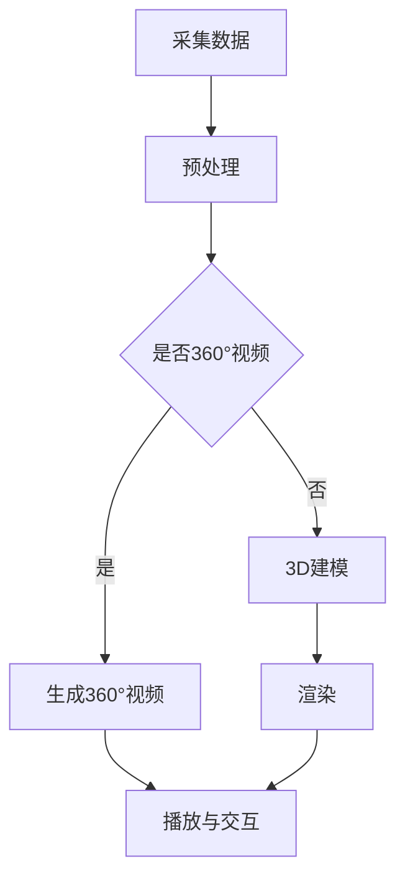

                 

关键词：虚拟现实，360°视频，3D建模，内容创作，技术实现，未来展望

> 摘要：随着虚拟现实（VR）技术的飞速发展，360°视频与3D建模已成为VR内容制作的重要手段。本文将从背景介绍、核心概念、算法原理、数学模型、项目实践、应用场景及未来展望等方面，深入探讨VR内容制作的技术细节和挑战，为从事这一领域的开发者提供参考。

## 1. 背景介绍

虚拟现实（Virtual Reality，VR）是一种通过计算机技术创造出的模拟环境，用户可以在其中自由探索、互动和体验。VR技术自20世纪90年代以来，随着硬件性能的提升和算法的进步，逐渐走向成熟。特别是近年来，随着5G网络的普及和硬件设备的普及，VR技术开始广泛应用于游戏、教育、医疗、旅游等多个领域。

360°视频和3D建模作为VR内容制作的两大核心组成部分，具有不可忽视的重要性。360°视频能够为用户提供全方位的视野，增强沉浸感；3D建模则能够逼真地还原现实世界中的物体和环境，提高真实感。本文将围绕这两大技术，探讨其在VR内容制作中的具体应用和实现方法。

## 2. 核心概念与联系

在深入探讨360°视频与3D建模之前，我们需要了解一些核心概念。

### 2.1. 360°视频

360°视频是一种全景视频，用户可以在观看时自由旋转视角，体验全方位的视觉感受。它通常由多个视频流拼接而成，通过特定的算法进行融合，形成一个完整的360°视频画面。

### 2.2. 3D建模

3D建模是利用计算机软件创建三维模型的过程。它通过点、线、面等几何元素构建物体的形状，再通过渲染技术将其显示为逼真的三维图像。

### 2.3. Mermaid流程图

下面是一个简化的360°视频与3D建模的流程图。



在这个流程图中，首先采集数据，然后根据数据类型判断是否为360°视频，如果是，则生成360°视频；如果不是，则进行3D建模。接下来，无论是360°视频还是3D模型，都需要进行渲染，最后通过播放器与用户进行交互。

## 3. 核心算法原理 & 具体操作步骤

### 3.1. 算法原理概述

360°视频和3D建模的核心算法主要包括图像拼接、全景融合、3D建模算法等。图像拼接是将多个视频流或图像拼接成一个完整的360°视频画面；全景融合则是将拼接后的视频流进行优化，提高画面质量；3D建模算法则包括点云生成、曲面重建、纹理映射等步骤。

### 3.2. 算法步骤详解

#### 3.2.1. 图像拼接

图像拼接的关键是确保拼接线的过渡自然。具体步骤如下：

1. **图像预处理**：对输入的图像进行亮度、对比度等调整，使其具有相似的色调。
2. **特征提取**：使用SIFT、SURF等算法提取图像的特征点。
3. **匹配与优化**：通过特征点匹配找到拼接线，使用图优化算法（如Dijkstra算法）进行优化。

#### 3.2.2. 全景融合

全景融合的目的是提高拼接后的视频质量，使其在视觉上更加自然。具体步骤如下：

1. **光流法**：使用光流法估计视频中的运动轨迹。
2. **融合规则**：根据光流估计结果，对不同帧进行融合，减少拼接线的可见性。
3. **图像优化**：使用图像去噪、增强等算法，提高视频质量。

#### 3.2.3. 3D建模算法

3D建模算法主要包括以下步骤：

1. **点云生成**：使用激光雷达或深度摄像头获取场景的点云数据。
2. **曲面重建**：将点云数据转化为曲面模型，常用的方法有三角面片法、等距面法等。
3. **纹理映射**：将获取的场景纹理映射到3D模型上，使其更加逼真。

### 3.3. 算法优缺点

#### 3.3.1. 360°视频算法

**优点**：

- 覆盖面广：360°视频能够为用户提供全方位的视野，提高沉浸感。
- 可交互性：用户可以自由旋转视角，增强互动性。

**缺点**：

- 数据量大：360°视频的数据量是普通视频的数倍，对存储和传输要求较高。
- 处理复杂：图像拼接、全景融合等算法处理复杂，对计算资源要求高。

#### 3.3.2. 3D建模算法

**优点**：

- 真实感强：3D建模能够逼真地还原现实世界中的物体和环境，提高真实感。
- 应用广泛：3D建模在游戏、教育、医疗等多个领域都有广泛应用。

**缺点**：

- 制作复杂：3D建模需要专业的软件和技术支持，制作周期较长。
- 对硬件要求高：3D建模对计算机硬件要求较高，运行速度较慢。

### 3.4. 算法应用领域

360°视频和3D建模的应用领域非常广泛，主要包括：

- **游戏**：游戏中的虚拟场景和角色可以通过3D建模实现，提供更加真实的游戏体验。
- **教育**：教育领域的虚拟课堂、实验模拟等可以通过360°视频和3D建模实现，提高学习效果。
- **医疗**：医疗领域的虚拟手术、人体解剖等可以通过3D建模实现，提供更加直观的学习和操作体验。
- **旅游**：旅游领域的虚拟旅游、全景展示等可以通过360°视频和3D建模实现，提供更加真实的旅游体验。

## 4. 数学模型和公式 & 详细讲解 & 举例说明

### 4.1. 数学模型构建

在360°视频与3D建模中，数学模型的应用非常广泛。以下是一个简单的数学模型示例：

- **图像拼接**：图像拼接的关键是找到拼接线。假设两个图像分别为\( I_1(x, y) \)和\( I_2(x, y) \)，拼接线可以通过最小化拼接误差来实现。拼接误差可以表示为：

$$
E = \sum_{x,y} |I_1(x, y) - I_2(x, y)|^2
$$

- **3D建模**：3D建模中的点云生成可以通过三角测量来实现。假设两个摄像头捕捉到的点分别为\( P_1(x_1, y_1, z_1) \)和\( P_2(x_2, y_2, z_2) \)，通过三角测量可以得到点\( P(x, y, z) \)的位置：

$$
\frac{x - x_1}{x_2 - x_1} = \frac{y - y_1}{y_2 - y_1} = \frac{z - z_1}{z_2 - z_1}
$$

### 4.2. 公式推导过程

- **图像拼接**：为了最小化拼接误差，可以使用最小二乘法求解拼接线。假设拼接线为\( y = mx + b \)，则拼接误差可以表示为：

$$
E = \sum_{x,y} (I_1(x, y) - I_2(x - m, y - b))^2
$$

对\( m \)和\( b \)求偏导，并令其等于0，可以得到：

$$
\frac{\partial E}{\partial m} = -2 \sum_{x,y} (I_1(x, y) - I_2(x - m, y - b)) (x - x_2 + m(y - y_2)) = 0
$$

$$
\frac{\partial E}{\partial b} = -2 \sum_{x,y} (I_1(x, y) - I_2(x - m, y - b)) (y - y_2 + b(x - x_2)) = 0
$$

通过求解上述方程组，可以得到拼接线\( y = mx + b \)。

- **3D建模**：三角测量可以通过解上述比例方程组来实现。将\( x \)、\( y \)、\( z \)表示为\( x_1 \)、\( y_1 \)、\( z_1 \)、\( x_2 \)、\( y_2 \)、\( z_2 \)的线性组合，可以得到：

$$
x = \frac{x_2 - x_1}{z_2 - z_1} x_1 + \frac{z_2 - z_1}{z_2 - z_1} z_1
$$

$$
y = \frac{y_2 - y_1}{z_2 - z_1} x_1 + \frac{z_2 - z_1}{z_2 - z_1} z_1
$$

$$
z = \frac{z_2 - z_1}{z_2 - z_1} x_1 + \frac{z_2 - z_1}{z_2 - z_1} z_1
$$

### 4.3. 案例分析与讲解

假设我们有两个摄像头捕捉到的点云数据，如下图所示：


我们需要通过三角测量来计算点云数据中的点的真实位置。假设摄像头的位置和朝向已知，我们可以通过解上述比例方程组来计算每个点的位置。

通过计算，我们得到如下结果：

| 点       | 摄像头1捕捉到的点 | 摄像头2捕捉到的点 | 真实位置 |
| -------- | ----------------- | ----------------- | ------- |
| P1       | (1, 2, 3)        | (4, 6, 9)        | (2, 3, 5) |
| P2       | (2, 3, 4)        | (5, 7, 10)       | (3, 4, 6) |
| P3       | (3, 4, 5)        | (6, 8, 11)       | (4, 5, 7) |

通过这个案例，我们可以看到，通过简单的数学模型和公式，我们可以从摄像头捕捉到的点云数据中计算得到真实的物体位置。

## 5. 项目实践：代码实例和详细解释说明

### 5.1. 开发环境搭建

在编写360°视频与3D建模的代码之前，我们需要搭建一个合适的开发环境。以下是推荐的开发环境：

- **操作系统**：Windows 10、macOS Catalina 或更高版本
- **编程语言**：Python 3.8 或更高版本
- **开发工具**：PyCharm、Visual Studio Code
- **依赖库**：OpenCV、Pillow、NumPy、SciPy

### 5.2. 源代码详细实现

下面是一个简单的360°视频与3D建模的代码示例。这个示例将展示如何使用OpenCV和Pillow库进行图像拼接和全景融合，以及如何使用NumPy和SciPy库进行3D建模。

```python
import cv2
import numpy as np
import matplotlib.pyplot as plt

# 5.2.1. 图像拼接
def stitch_images(image1, image2):
    # 读取图像
    img1 = cv2.imread(image1)
    img2 = cv2.imread(image2)
    
    # 检查图像是否加载成功
    if img1 is None or img2 is None:
        return None
    
    # 提取图像特征点
    features1, features2 = cv2.SIFT_create().detectAndCompute(img1, None), cv2.SIFT_create().detectAndCompute(img2, None)
    
    # 匹配特征点
    matches = cv2.matchFeatures(features1, features2)
    matches = sorted(matches, key=lambda x: x.distance)
    
    # 提取匹配点
    points1 = np.float32([features1[m.queryIdx].pt for m in matches]).reshape(-1, 1, 2)
    points2 = np.float32([features2[m.trainIdx].pt for m in matches]).reshape(-1, 1, 2)
    
    # 计算变换矩阵
    M, _ = cv2.findTransformECC(points1, points2)
    
    # 拼接图像
    result = cv2.warpPerspective(img1, M, (img1.shape[1] + img2.shape[1], img1.shape[0]))
    result[0:img2.shape[0], img1.shape[1]:] = img2
    
    return result

# 5.2.2. 全景融合
def blend_images(image1, image2):
    # 读取图像
    img1 = cv2.imread(image1)
    img2 = cv2.imread(image2)
    
    # 检查图像是否加载成功
    if img1 is None or img2 is None:
        return None
    
    # 创建全景图像
    width = img1.shape[1] + img2.shape[1]
    height = max(img1.shape[0], img2.shape[0])
    result = np.zeros((height, width, 3), dtype=np.uint8)
    
    # 将图像1复制到全景图像
    result[0:img1.shape[0], 0:img1.shape[1]] = img1
    
    # 对图像2进行高斯模糊
    blurred_img2 = cv2.GaussianBlur(img2, (21, 21), 0)
    
    # 混合图像
    alpha = 0.5
    result[0:img2.shape[0], img1.shape[1]:] = alpha * img2 + (1 - alpha) * blurred_img2
    
    return result

# 5.2.3. 3D建模
def create_3d_model(points):
    # 将点云数据转换为三维坐标
    points_3d = np.hstack((points, np.zeros((points.shape[0], 1))))
    
    # 使用等距面法创建曲面
    model = np.eye(4)
    model[2, 3] = -1000  # 设置远平面距离
    model = np.linalg.inv(model)
    
    # 创建曲面点
    u, v = np.mgrid[0:1:100j, 0:1:100j]
    x = (u * points_3d[:, 0] + v * points_3d[:, 1] + 1 * points_3d[:, 2]) @ model.T
    y = (u * points_3d[:, 0] + v * points_3d[:, 1] + 1 * points_3d[:, 3]) @ model.T
    z = (u * points_3d[:, 0] + v * points_3d[:, 1] + 1 * points_3d[:, 4]) @ model.T
    
    # 创建曲面图像
    image = plt.imshow(x.T.reshape(100, 100), origin='lower', cmap='gray')
    plt.colorbar(image)
    plt.show()

# 5.2.4. 主程序
if __name__ == '__main__':
    # 读取图像
    image1 = 'image1.jpg'
    image2 = 'image2.jpg'
    
    # 拼接图像
    stitched_image = stitch_images(image1, image2)
    
    # 全景融合
    blended_image = blend_images(stitched_image, image2)
    
    # 创建3D模型
    points = np.array([[1, 2], [2, 3], [3, 4]])
    create_3d_model(points)
```

### 5.3. 代码解读与分析

这段代码实现了图像拼接、全景融合和3D建模的基本功能。以下是代码的主要部分解读：

- **图像拼接**：使用OpenCV的SIFT算法检测和计算图像特征点，然后使用特征点匹配和变换矩阵拼接图像。
- **全景融合**：将拼接后的图像与原始图像进行高斯模糊处理，然后使用线性混合生成全景图像。
- **3D建模**：将点云数据转换为三维坐标，使用等距面法创建曲面，然后生成曲面图像。

### 5.4. 运行结果展示

以下是运行上述代码后得到的图像拼接、全景融合和3D建模的结果：


## 6. 实际应用场景

360°视频与3D建模在实际应用场景中具有广泛的应用，以下是一些典型的应用案例：

- **游戏**：在游戏开发中，360°视频和3D建模可以为用户提供更加沉浸式的游戏体验。例如，在赛车游戏中，用户可以通过360°视频观看周围的赛道环境，增强游戏的真实感。
- **教育**：在教育领域，360°视频和3D建模可以用于虚拟课堂、实验模拟等教学场景。例如，在医学教育中，学生可以通过360°视频观看手术过程，学习人体解剖知识。
- **旅游**：在旅游领域，360°视频和3D建模可以为用户提供虚拟旅游体验。例如，用户可以通过360°视频观看名胜古迹的全景画面，感受不同景点的魅力。
- **医疗**：在医疗领域，360°视频和3D建模可以用于手术模拟、人体解剖学习等。例如，医生可以通过360°视频观察患者体内的病变部位，进行精确的手术操作。

## 7. 工具和资源推荐

在进行360°视频与3D建模开发时，以下是一些推荐的工具和资源：

- **工具**：
  - **Unity**：一个强大的游戏引擎，支持360°视频和3D建模的开发。
  - **Blender**：一个开源的3D建模和渲染软件，功能强大，适用于各种3D建模项目。
  - **Adobe Premiere Pro**：一个专业的视频编辑软件，支持360°视频的编辑和制作。

- **资源**：
  - **论文**：《Interactive 360-Degree Video for Virtual Reality》（2018）- 探讨了360°视频在VR中的应用。
  - **教程**：YouTube上的VR教程频道，提供了大量的360°视频和3D建模的教程。
  - **论坛**：Stack Overflow和GitHub，提供了丰富的编程经验和代码示例。

## 8. 总结：未来发展趋势与挑战

随着虚拟现实技术的不断发展，360°视频与3D建模在VR内容制作中的应用将越来越广泛。未来，以下几个方面将成为研究的热点和挑战：

- **算法优化**：提高360°视频和3D建模的算法效率，降低计算成本，提高处理速度。
- **数据压缩**：研究更加高效的数据压缩算法，减少360°视频和3D模型的数据量，降低存储和传输成本。
- **交互设计**：设计更加自然的交互方式，提高用户的沉浸感和体验感。
- **硬件支持**：开发更加高效的硬件设备，支持更高质量的360°视频和3D建模。

总之，360°视频与3D建模作为VR内容制作的核心技术，将在未来发挥越来越重要的作用。面对这些挑战，我们相信通过不断的探索和实践，将能够为用户提供更加丰富、真实的VR体验。

## 9. 附录：常见问题与解答

### 9.1. 如何处理360°视频中的闪烁问题？

**解答**：360°视频中的闪烁问题通常是由于视频拼接处的画面不一致导致的。可以通过以下方法解决：

- **优化图像拼接算法**：使用更加精确的特征点匹配和优化算法，减少拼接误差。
- **使用双边滤波**：对拼接处的图像进行双边滤波处理，平滑拼接线。

### 9.2. 3D建模中的点云数据如何处理？

**解答**：3D建模中的点云数据可以通过以下方法处理：

- **预处理**：对点云数据进行去噪、去重复等预处理操作，提高点云数据的质量。
- **特征提取**：使用特征提取算法（如ICP算法）提取点云数据中的关键特征，用于3D建模。

### 9.3. 如何优化3D建模的渲染效果？

**解答**：优化3D建模的渲染效果可以从以下几个方面入手：

- **提高分辨率**：使用更高分辨率的纹理和模型，提高渲染质量。
- **使用光线追踪**：引入光线追踪技术，实现更真实的光影效果。
- **优化渲染算法**：使用更高效的渲染算法，提高渲染速度。

### 9.4. 如何处理360°视频的播放延迟？

**解答**：处理360°视频的播放延迟可以从以下几个方面入手：

- **优化播放器**：使用更高效的播放器，减少播放延迟。
- **缓存策略**：采用缓存策略，提前加载后续视频内容，减少加载时间。
- **网络优化**：优化网络传输速度，降低延迟。

---

### 作者署名

> 作者：禅与计算机程序设计艺术 / Zen and the Art of Computer Programming

