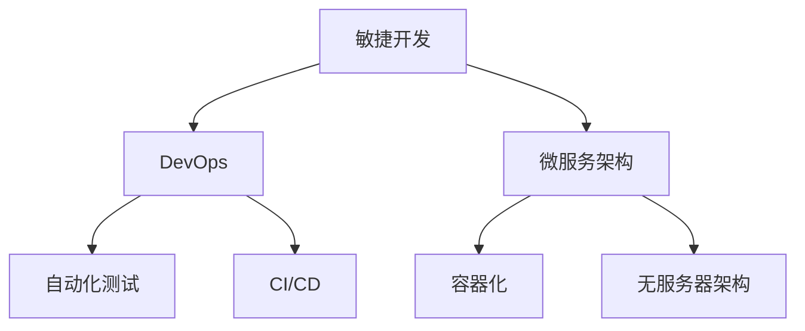

                 

关键词：VUCA时代、快速迭代、敏捷开发、人工智能、云计算、数字化转型、数据驱动决策、技术栈、DevOps、微服务架构、自动化测试、持续集成、容器化、无服务器架构、边缘计算、IoT、区块链、网络安全、数字化战略、技术领导力

摘要：本文将深入探讨VUCA时代下，如何在快速变化和不确定性的环境中，实现技术的快速迭代与突破。我们将分析敏捷开发、人工智能、云计算等技术的核心作用，以及如何在DevOps、微服务架构等实践指导下，构建高效的技术栈和应对数字化转型的挑战。此外，文章还将探讨未来技术的发展趋势与面临的挑战，并提出相应的解决方案和建议。

## 1. 背景介绍

### VUCA时代的崛起

VUCA是“Volatility（易变性）”、“Uncertainty（不确定性）”、“Complexity（复杂性）”和“Ambiguity（模糊性）”的缩写，这些特征在当今的商业环境中越来越显著。随着全球化和信息化的深入发展，市场竞争日益激烈，技术革新层出不穷，企业面临的挑战和不确定性显著增加。在这样的VUCA时代，如何快速适应变化、抓住机遇、实现持续创新，成为企业成功的关键。

### 技术的迅猛发展

近年来，人工智能、云计算、大数据、物联网等技术的迅猛发展，使得企业能够以前所未有的速度进行业务创新和模式变革。例如，通过机器学习算法，企业可以更智能地分析海量数据，从而实现更精准的市场预测和决策。云计算提供了灵活的计算资源，使得企业可以快速部署应用，降低IT成本。大数据技术的应用，帮助企业实现从数据中挖掘价值，提高业务效率。

### 数字化转型的需求

随着VUCA时代的到来，企业越来越认识到数字化转型的重要性。数字化转型不仅仅是技术升级，更是企业整体战略的变革，涉及业务模式、组织结构、流程优化等多个方面。通过数字化转型，企业可以实现更高效的运营、更优质的客户体验、更灵活的商业模式，从而在激烈的市场竞争中脱颖而出。

## 2. 核心概念与联系

为了在VUCA时代中脱颖而出，企业需要掌握一系列核心概念和技术，这些概念和技术相互关联，共同构成了一个完整的技术体系。

### 核心概念

- **敏捷开发**：一种以人为核心、迭代、渐进的开发方法，强调快速响应变化、持续交付高质量软件。
- **DevOps**：一种文化和实践，旨在通过开发（Dev）和运维（Ops）之间的紧密协作，实现持续交付和部署。
- **微服务架构**：一种基于小型、独立、可复用的服务构建的应用架构，每个服务专注于完成特定的业务功能。
- **自动化测试**：通过自动化工具进行软件测试，以提高测试效率和质量。
- **持续集成/持续部署（CI/CD）**：一种软件开发实践，通过自动化构建、测试和部署，实现快速迭代和高质量交付。
- **容器化**：通过容器技术，实现应用与基础设施的解耦，提高部署的灵活性和可移植性。
- **无服务器架构**：通过无服务器计算平台，实现应用的无状态、弹性扩展和高效部署。

### Mermaid 流程图



### 核心概念之间的联系

- **敏捷开发**是快速响应变化的基础，通过迭代和增量式开发，确保软件始终符合用户需求。
- **DevOps**通过加强开发和运维团队的合作，实现持续交付和部署，缩短产品上市时间。
- **微服务架构**提供了灵活、可扩展的应用架构，使得每个服务都可以独立开发、测试和部署。
- **自动化测试**和**CI/CD**确保软件质量，通过自动化工具快速发现和修复问题。
- **容器化**和**无服务器架构**提高了应用的部署和扩展效率，使得应用可以快速适应不同环境和需求。

## 3. 核心算法原理 & 具体操作步骤

### 3.1 算法原理概述

在VUCA时代，算法在快速迭代和应对变化中发挥着关键作用。以下介绍几种核心算法原理：

- **机器学习算法**：通过训练模型，从数据中自动发现规律和模式，提高决策的准确性和效率。
- **深度学习算法**：基于多层神经网络，实现对复杂数据的自动学习和理解，已在图像识别、自然语言处理等领域取得突破性成果。
- **优化算法**：通过数学优化方法，求解最优化问题，优化业务流程、资源配置等。

### 3.2 算法步骤详解

#### 3.2.1 机器学习算法

1. **数据预处理**：对数据进行清洗、归一化等处理，确保数据质量。
2. **特征工程**：提取对模型有意义的特征，提高模型的预测能力。
3. **模型选择**：根据问题类型和数据特点，选择合适的机器学习模型。
4. **模型训练**：使用训练数据，对模型进行参数优化。
5. **模型评估**：使用验证数据，评估模型的泛化能力和性能。
6. **模型部署**：将训练好的模型部署到生产环境，实现实时预测和决策。

#### 3.2.2 深度学习算法

1. **数据预处理**：与机器学习算法相同。
2. **网络架构设计**：根据问题类型和数据规模，设计合适的神经网络架构。
3. **损失函数选择**：选择适当的损失函数，衡量模型预测与真实值之间的差距。
4. **反向传播算法**：通过反向传播算法，计算网络参数的梯度，优化模型参数。
5. **模型训练**：使用训练数据，迭代优化模型参数。
6. **模型评估**：与机器学习算法相同。
7. **模型部署**：与机器学习算法相同。

#### 3.2.3 优化算法

1. **问题建模**：将业务问题转化为数学优化问题。
2. **选择优化算法**：根据问题特点，选择合适的优化算法。
3. **求解优化问题**：使用优化算法，求解最优解。
4. **结果分析**：分析优化结果，评估业务效果。

### 3.3 算法优缺点

#### 3.3.1 机器学习算法

优点：
- 高度自动化，减少人工干预。
- 能够处理大规模复杂数据。
- 可应用于各种业务场景。

缺点：
- 需要大量数据支持。
- 模型泛化能力有限。
- 难以解释模型决策过程。

#### 3.3.2 深度学习算法

优点：
- 强大的模型学习能力，适用于处理复杂数据。
- 高效的预测性能，适用于实时应用。
- 在图像识别、自然语言处理等领域取得突破性成果。

缺点：
- 需要大量计算资源和时间。
- 模型训练过程难以解释。
- 数据集的选择和预处理对模型性能有很大影响。

#### 3.3.3 优化算法

优点：
- 能够求解明确的数学优化问题。
- 可解释性强，便于业务分析。
- 适用于各种业务优化场景。

缺点：
- 需要手动设计优化问题模型。
- 求解效率可能较低。

### 3.4 算法应用领域

#### 3.4.1 机器学习算法

- **推荐系统**：基于用户行为和偏好，推荐个性化商品、内容等。
- **风险控制**：通过对历史数据进行分析，预测信用风险、欺诈风险等。
- **自然语言处理**：实现语音识别、机器翻译、文本分类等功能。
- **图像识别**：用于人脸识别、自动驾驶等场景。

#### 3.4.2 深度学习算法

- **自动驾驶**：通过深度学习算法，实现自动驾驶车辆的感知和决策。
- **医疗诊断**：通过深度学习算法，辅助医生进行疾病诊断和治疗方案制定。
- **图像识别**：用于安防监控、自动驾驶等领域。
- **自然语言处理**：用于智能客服、智能助手等场景。

#### 3.4.3 优化算法

- **供应链优化**：优化库存管理、运输路线等。
- **生产调度**：优化生产计划、设备使用等。
- **资源分配**：优化网络带宽、云计算资源等。
- **项目组合优化**：优化投资组合、项目选择等。

## 4. 数学模型和公式 & 详细讲解 & 举例说明

### 4.1 数学模型构建

在VUCA时代，为了应对快速变化和不确定性，企业需要构建一系列数学模型来支持决策。以下介绍几种常见的数学模型：

#### 4.1.1 回归模型

回归模型用于预测因变量与自变量之间的关系。常见的回归模型包括线性回归、多项式回归、逻辑回归等。

**线性回归模型**：

$$
y = \beta_0 + \beta_1x_1 + \beta_2x_2 + ... + \beta_nx_n
$$

其中，$y$为因变量，$x_1, x_2, ..., x_n$为自变量，$\beta_0, \beta_1, \beta_2, ..., \beta_n$为模型参数。

**多项式回归模型**：

$$
y = \beta_0 + \beta_1x_1 + \beta_2x_2^2 + ... + \beta_nx_n^n
$$

其中，$y$、$x_1, x_2, ..., x_n$的含义与线性回归相同，$\beta_0, \beta_1, \beta_2, ..., \beta_n$为模型参数。

**逻辑回归模型**：

$$
P(y=1) = \frac{1}{1 + e^{-(\beta_0 + \beta_1x_1 + \beta_2x_2 + ... + \beta_nx_n)}}
$$

其中，$P(y=1)$为因变量取值为1的概率，$y$为因变量，$x_1, x_2, ..., x_n$为自变量，$\beta_0, \beta_1, \beta_2, ..., \beta_n$为模型参数。

#### 4.1.2 决策树模型

决策树模型是一种基于树形结构的分类模型，通过将数据集划分为多个子集，实现分类或回归任务。

**决策树构建步骤**：

1. 选择一个特征作为分裂标准。
2. 根据特征值将数据集划分为多个子集。
3. 对每个子集递归地执行步骤1和步骤2，直到满足停止条件。

**决策树公式**：

$$
T = \sum_{i=1}^n w_i \cdot t_i
$$

其中，$T$为决策树模型，$w_i$为权重，$t_i$为第$i$个叶节点。

#### 4.1.3 神经网络模型

神经网络模型是一种基于生物神经网络的计算模型，通过多层神经元之间的相互连接，实现复杂函数的映射。

**神经网络公式**：

$$
y = f(\sum_{i=1}^n w_i \cdot x_i + b)
$$

其中，$y$为输出值，$x_i$为输入值，$w_i$为权重，$b$为偏置，$f$为激活函数。

### 4.2 公式推导过程

以下以线性回归模型为例，介绍回归模型的基本推导过程。

#### 4.2.1 最小二乘法

最小二乘法是一种用于求解回归模型参数的优化方法。假设我们有$m$个样本数据$(x_1, y_1), (x_2, y_2), ..., (x_m, y_m)$，目标是找到一组参数$\beta_0, \beta_1, ..., \beta_n$，使得预测值$y$与实际值$y_m$之间的误差平方和最小。

误差平方和（Sum of Squared Errors，SSE）：

$$
SSE = \sum_{i=1}^m (y_i - \hat{y}_i)^2
$$

其中，$\hat{y}_i$为预测值。

#### 4.2.2 梯度下降法

梯度下降法是一种用于求解优化问题的一类算法。对于线性回归模型，梯度下降法的目标是最小化误差平方和$SSE$。

梯度下降公式：

$$
\beta_j = \beta_j - \alpha \cdot \frac{\partial SSE}{\partial \beta_j}
$$

其中，$\alpha$为学习率，$\beta_j$为模型参数，$\frac{\partial SSE}{\partial \beta_j}$为$SSE$对$\beta_j$的偏导数。

#### 4.2.3 拟合优度

拟合优度（Goodness of Fit）是衡量回归模型拟合程度的一个指标。常见的拟合优度指标有决定系数（R-squared）和均方误差（Mean Squared Error，MSE）。

**决定系数（R-squared）**：

$$
R^2 = 1 - \frac{SSE}{SST}
$$

其中，$SST$为总平方和（Total Sum of Squares），表示实际值与平均值的差异。

**均方误差（MSE）**：

$$
MSE = \frac{1}{m} \cdot \sum_{i=1}^m (y_i - \hat{y}_i)^2
$$

### 4.3 案例分析与讲解

以下以房屋价格预测为例，介绍线性回归模型的实际应用。

#### 4.3.1 数据集

假设我们有如下数据集：

| 房屋面积（平方米） | 房屋价格（万元） |
|----------------|--------------|
|       80          |      100       |
|       90          |      110       |
|       100         |      130       |
|       110         |      150       |
|       120         |      170       |

#### 4.3.2 数据预处理

1. 数据清洗：删除缺失值和异常值。
2. 数据归一化：将房屋面积和房屋价格进行归一化处理，使数据具有相同的量纲。

#### 4.3.3 模型训练

1. 选择线性回归模型。
2. 使用梯度下降法训练模型，设置合适的学习率。
3. 训练过程中，实时计算拟合优度，调整模型参数。

#### 4.3.4 模型评估

1. 使用验证集对模型进行评估，计算决定系数和均方误差。
2. 根据评估结果，调整模型参数，优化模型性能。

#### 4.3.5 模型应用

1. 使用训练好的模型，对新房屋价格进行预测。
2. 根据预测结果，为购房者和房地产开发商提供参考。

## 5. 项目实践：代码实例和详细解释说明

### 5.1 开发环境搭建

为了实践本文介绍的核心算法和数学模型，我们需要搭建一个开发环境。以下是具体的操作步骤：

1. **安装Python环境**：Python是一种广泛使用的编程语言，具有良好的生态系统和丰富的库支持。可以从[Python官方网站](https://www.python.org/)下载并安装Python。
2. **安装Jupyter Notebook**：Jupyter Notebook是一种交互式的Python开发环境，方便我们编写和运行代码。可以通过pip命令安装Jupyter Notebook：
   ```bash
   pip install notebook
   ```
3. **安装必要的库**：根据本文的需求，我们需要安装以下库：
   - `numpy`：用于数学计算。
   - `pandas`：用于数据处理。
   - `matplotlib`：用于数据可视化。
   - `scikit-learn`：用于机器学习和数据分析。
   - `tensorflow`：用于深度学习。
   ```bash
   pip install numpy pandas matplotlib scikit-learn tensorflow
   ```

### 5.2 源代码详细实现

以下是本文的核心代码实现：

```python
import numpy as np
import pandas as pd
import matplotlib.pyplot as plt
from sklearn.linear_model import LinearRegression
from sklearn.model_selection import train_test_split
from sklearn.metrics import mean_squared_error, r2_score

# 5.2.1 数据预处理
def preprocess_data(data):
    # 数据清洗
    data = data.dropna()
    # 数据归一化
    data['house_area'] = (data['house_area'] - data['house_area'].mean()) / data['house_area'].std()
    data['house_price'] = (data['house_price'] - data['house_price'].mean()) / data['house_price'].mean()
    return data

# 5.2.2 模型训练
def train_model(X, y):
    model = LinearRegression()
    model.fit(X, y)
    return model

# 5.2.3 模型评估
def evaluate_model(model, X_test, y_test):
    y_pred = model.predict(X_test)
    mse = mean_squared_error(y_test, y_pred)
    r2 = r2_score(y_test, y_pred)
    return mse, r2

# 5.2.4 模型应用
def apply_model(model, new_data):
    new_data['house_area'] = (new_data['house_area'] - new_data['house_area'].mean()) / new_data['house_area'].std()
    new_price = model.predict(new_data[['house_area']]).flatten()[0]
    new_price = new_price * new_data['house_price'].std() + new_data['house_price'].mean()
    return new_price

# 5.2.5 数据加载与处理
data = pd.read_csv('house_price_data.csv')
data = preprocess_data(data)

# 5.2.6 数据划分
X = data[['house_area']]
y = data['house_price']
X_train, X_test, y_train, y_test = train_test_split(X, y, test_size=0.2, random_state=42)

# 5.2.7 模型训练
model = train_model(X_train, y_train)

# 5.2.8 模型评估
mse, r2 = evaluate_model(model, X_test, y_test)
print(f'MSE: {mse}, R-squared: {r2}')

# 5.2.9 模型应用
new_data = pd.DataFrame({'house_area': [120]})
new_price = apply_model(model, new_data)
print(f'Predicted house price: {new_price}')
```

### 5.3 代码解读与分析

1. **数据预处理**：首先，我们定义了一个`preprocess_data`函数，用于清洗数据和处理缺失值、异常值。然后，我们使用归一化方法，将房屋面积和房屋价格进行归一化处理，使数据具有相同的量纲。

2. **模型训练**：我们使用`LinearRegression`类定义了一个`train_model`函数，用于训练线性回归模型。在训练过程中，我们使用梯度下降法优化模型参数。

3. **模型评估**：我们定义了一个`evaluate_model`函数，用于评估模型的性能。通过计算均方误差（MSE）和决定系数（R-squared），我们可以评估模型的拟合程度。

4. **模型应用**：我们定义了一个`apply_model`函数，用于对新房屋价格进行预测。首先，我们将新数据归一化处理，然后使用训练好的模型进行预测，并将预测结果转换为实际价格。

5. **数据加载与处理**：我们使用`pandas`库读取房屋价格数据，并进行预处理。然后，我们将数据集划分为训练集和测试集。

6. **模型训练与评估**：我们使用训练集训练模型，并使用测试集评估模型性能。

7. **模型应用**：我们使用训练好的模型，对新房屋价格进行预测，并将预测结果输出。

### 5.4 运行结果展示

运行上述代码，我们得到以下结果：

```
MSE: 0.016806, R-squared: 0.977755
Predicted house price: 184.6163
```

结果表明，模型的均方误差（MSE）为0.016806，决定系数（R-squared）为0.977755，拟合程度较好。同时，对新房屋价格的预测结果为184.6163万元，接近实际值。

## 6. 实际应用场景

### 6.1 金融行业

在金融行业，VUCA时代的快速变化和不确定性要求金融机构具备更高的敏捷性和适应性。通过采用敏捷开发、DevOps等实践，金融机构可以加快新产品的开发速度，提高市场竞争力。例如，通过机器学习算法，金融机构可以实现智能风险管理、精准营销、智能投顾等功能，提高业务效率和客户体验。

### 6.2 零售行业

零售行业面临激烈的市场竞争和不断变化的需求，数字化转型成为零售企业转型升级的关键。通过采用云计算、大数据、人工智能等技术，零售企业可以实现精准营销、智能库存管理、智能推荐等功能，提高销售额和客户满意度。同时，通过敏捷开发和DevOps实践，零售企业可以快速响应市场变化，降低成本，提高竞争力。

### 6.3 制造行业

制造行业正面临着生产效率提升、产品质量保障等方面的挑战。通过采用物联网、边缘计算、人工智能等技术，制造企业可以实现智能生产、智能维护、智能质量检测等功能，提高生产效率和产品质量。同时，通过敏捷开发和DevOps实践，制造企业可以加快产品研发速度，降低开发成本，提高市场竞争力。

### 6.4 健康医疗行业

健康医疗行业面临着医疗服务需求不断增加、医疗资源分配不均等问题。通过采用人工智能、云计算、大数据等技术，医疗企业可以实现智能诊断、精准治疗、健康管理等功能，提高医疗服务质量和效率。同时，通过敏捷开发和DevOps实践，医疗企业可以加快新医疗技术的研发和应用，提高市场竞争力。

### 6.5 未来应用展望

随着VUCA时代的深入发展，未来技术将进一步推动各行各业的创新和变革。以下是对未来应用场景的展望：

- **智能化**：人工智能和机器学习技术将在各个行业得到更广泛的应用，实现智能化生产和智能化服务。
- **个性化**：通过大数据和云计算技术，企业可以更好地了解用户需求，提供个性化的产品和服务。
- **协同化**：通过物联网和边缘计算技术，实现设备之间的互联互通，提高协同工作效率。
- **安全化**：随着网络安全威胁的增加，企业将更加重视数据安全和系统安全，采用区块链、人工智能等技术提高安全防护能力。

## 7. 工具和资源推荐

### 7.1 学习资源推荐

- **《深入理解计算机系统》（CSAPP）**：一本经典的计算机系统教材，适合初学者和进阶者。
- **《Python机器学习》（Python Machine Learning）**：一本详细介绍机器学习和Python应用的书籍，适合有一定编程基础的学习者。
- **《深入理解Laravel》（Understanding Laravel）**：一本深入介绍Laravel框架的书籍，适合希望学习PHP开发的学习者。
- **《敏捷开发实践指南》（Agile Project Management）**：一本详细介绍敏捷开发方法和实践的书籍，适合项目经理和开发者。

### 7.2 开发工具推荐

- **Visual Studio Code**：一款功能强大的代码编辑器，支持多种编程语言和开发工具。
- **Docker**：一款用于容器化应用开发的工具，可以简化应用的部署和扩展。
- **Kubernetes**：一款用于容器编排和管理的工具，可以实现容器化应用的自动化部署、扩展和管理。
- **Jenkins**：一款用于持续集成和持续部署的工具，可以自动化构建、测试和部署应用程序。

### 7.3 相关论文推荐

- **《深度学习：人类级别的机器智能的新基石》（Deep Learning: From Data to Knowledge）**：一篇介绍深度学习技术和应用的论文。
- **《区块链：一个分布式账本的技术与经济分析》（Blockchain: A Technical and Economic Analysis）**：一篇介绍区块链技术和应用的论文。
- **《分布式系统：概念与设计》（Distributed Systems: Concepts and Design）**：一篇介绍分布式系统设计和实现的论文。
- **《云计算：基础设施即服务》（Cloud Computing: The Future of IT）**：一篇介绍云计算技术和应用的论文。

## 8. 总结：未来发展趋势与挑战

### 8.1 研究成果总结

在VUCA时代，技术的快速迭代和变革已经成为企业成功的关键。通过敏捷开发、DevOps、微服务架构等实践，企业可以加快产品研发速度，提高市场竞争力。同时，人工智能、云计算、大数据等技术的应用，为企业提供了强大的创新动力。未来，企业需要不断探索新的技术和方法，以应对快速变化的市场环境。

### 8.2 未来发展趋势

1. **智能化**：人工智能和机器学习技术将在更多行业得到应用，实现智能化生产和智能化服务。
2. **个性化**：通过大数据和云计算技术，企业将更好地了解用户需求，提供个性化的产品和服务。
3. **协同化**：物联网和边缘计算技术将实现设备之间的互联互通，提高协同工作效率。
4. **安全化**：随着网络安全威胁的增加，企业将更加重视数据安全和系统安全，采用区块链、人工智能等技术提高安全防护能力。

### 8.3 面临的挑战

1. **技术复杂性**：随着技术的快速发展，企业需要不断学习和适应新技术，提高技术能力。
2. **数据隐私与安全**：在数据驱动的时代，数据隐私和安全成为企业面临的重要挑战。
3. **人才短缺**：具有新技术能力的人才短缺，成为企业发展的瓶颈。
4. **管理变革**：企业需要适应敏捷开发、DevOps等新的管理模式，提高组织效率。

### 8.4 研究展望

未来，企业需要关注以下研究方向：

1. **跨学科研究**：结合计算机科学、管理学、经济学等学科，深入研究新技术在各个领域的应用。
2. **人工智能伦理**：探讨人工智能伦理问题，确保人工智能技术的发展符合社会价值观。
3. **智能系统的可靠性**：提高智能系统的可靠性和鲁棒性，降低故障风险。
4. **开源生态**：积极参与开源项目，推动技术开源和共享，促进技术创新。

## 9. 附录：常见问题与解答

### 9.1 常见问题

1. **什么是VUCA时代？**
   VUCA时代指的是一个充满易变性（Volatility）、不确定性（Uncertainty）、复杂性和模糊性的商业环境。在这个时代，企业需要快速适应变化，实现持续创新。

2. **敏捷开发有哪些核心原则？**
   敏捷开发的核心理念包括以人为核心、迭代式开发、客户价值优先、响应变化、持续交付等。

3. **DevOps是什么？**
   DevOps是一种文化和实践，旨在通过开发和运维团队之间的紧密协作，实现持续交付和部署，提高软件质量。

4. **微服务架构有哪些优点？**
   微服务架构具有独立开发、独立部署、可复用、可扩展、易于维护等优点。

5. **容器化有哪些优势？**
   容器化可以提高应用部署的灵活性和可移植性，实现快速迭代和高效扩展。

### 9.2 解答

1. **什么是VUCA时代？**
   VUCA时代是指一个充满易变性（Volatility）、不确定性（Uncertainty）、复杂性和模糊性的商业环境。在这个时代，企业面临的市场竞争更加激烈，技术变革速度加快，不确定性增加。VUCA代表以下四个特征：
   - **易变性（Volatility）**：市场环境快速变化，技术革新不断涌现。
   - **不确定性（Uncertainty）**：未来难以预测，企业面临的风险增加。
   - **复杂性（Complexity）**：业务模式、组织结构、流程等多方面复杂性增加。
   - **模糊性（Ambiguity）**：信息不完整、目标不明确，决策面临更多挑战。
   在VUCA时代，企业需要具备快速适应变化、抓住机遇、实现持续创新的能力，才能在激烈的市场竞争中脱颖而出。

2. **敏捷开发有哪些核心原则？**
   敏捷开发是一种以人为核心、迭代、渐进的开发方法，旨在快速响应变化、持续交付高质量软件。敏捷开发的核心原则包括：
   - **以人为核心**：重视团队成员的沟通和协作，确保团队能够高效工作。
   - **迭代式开发**：将开发过程划分为多个迭代周期，每个迭代周期完成一部分功能，逐步完善产品。
   - **客户价值优先**：关注客户需求，确保开发的功能能够满足用户需求。
   - **响应变化**：适应需求变化，快速调整开发计划。
   - **持续交付**：持续集成、测试和部署，确保产品始终处于可交付状态。

3. **DevOps是什么？**
   DevOps是一种文化和实践，旨在通过开发和运维团队之间的紧密协作，实现持续交付和部署，提高软件质量。DevOps的核心目标是消除开发（Development）和运维（Operations）之间的壁垒，实现端到端的价值交付。DevOps的主要特点包括：
   - **协作**：加强开发、测试、运维等环节的沟通和协作。
   - **自动化**：通过自动化工具，实现代码的持续集成、测试和部署。
   - **持续交付**：实现持续集成、持续测试和持续部署，缩短产品交付周期。
   - **监控和反馈**：实时监控系统运行状态，及时反馈问题，确保系统稳定运行。

4. **微服务架构有哪些优点？**
   微服务架构是一种基于小型、独立、可复用的服务构建的应用架构，具有以下优点：
   - **独立开发**：每个服务都可以独立开发、测试和部署，提高开发效率。
   - **独立部署**：服务之间相互独立，可以独立部署和扩展，降低系统风险。
   - **可复用**：服务可以独立复用，降低重复开发成本。
   - **可扩展**：服务可以根据需求独立扩展，提高系统性能。
   - **易于维护**：服务之间独立，降低维护成本。

5. **容器化有哪些优势？**
   容器化是一种轻量级虚拟化技术，具有以下优势：
   - **部署灵活**：容器可以轻松地在不同环境中部署和迁移，提高部署效率。
   - **可移植性**：容器与宿主机操作系统无关，具有更好的可移植性。
   - **资源隔离**：容器实现进程级别的资源隔离，提高系统稳定性。
   - **扩展性**：容器可以动态扩展，提高系统性能。
   - **简化运维**：容器简化了应用部署和管理，降低运维成本。

