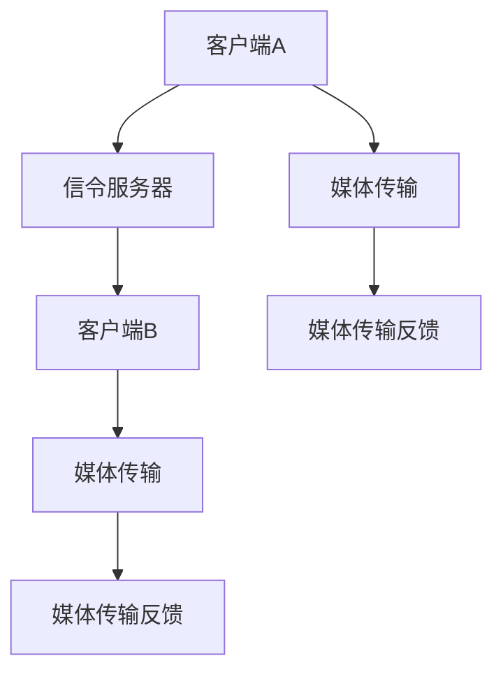

                 

关键词：WebRTC，信令服务器，优化，性能，算法，安全性，可靠性

> 摘要：本文旨在深入探讨WebRTC信令服务器的优化策略，分析现有技术瓶颈，提出创新性的解决方案，以提升WebRTC通信的稳定性和效率。

## 1. 背景介绍

WebRTC（Web Real-Time Communication）是一种支持网页浏览器进行实时语音对话或视频聊天的技术标准。其核心优势在于不需要依赖传统的客户端-服务器模型，而是采用P2P（Peer-to-Peer）方式进行通信，从而降低了服务器的负载，提高了通信的实时性和效率。然而，随着WebRTC应用的普及，信令服务器的性能和可靠性成为制约其广泛应用的关键因素。

### 1.1 信令服务器在WebRTC中的作用

在WebRTC通信中，信令服务器扮演着至关重要的角色。其主要职责是：

- **协商协议**：WebRTC客户端通过信令服务器协商通信协议，确保两者支持相同的协议。
- **地址发现**：信令服务器帮助WebRTC客户端发现对方的IP地址和端口号，实现端到端的连接。
- **参数交换**：交换WebRTC通信所需的参数，如音频和视频编码格式、分辨率等。

### 1.2 WebRTC信令服务器的挑战

随着WebRTC应用的不断增长，信令服务器面临以下挑战：

- **高并发处理能力**：需要处理大量并发连接，确保服务器在高负载下的稳定性。
- **低延迟**：WebRTC通信对延迟要求较高，信令服务器需要优化处理速度。
- **安全性**：信令服务器需要保护用户数据安全，防止中间人攻击等网络威胁。

## 2. 核心概念与联系

为了深入理解WebRTC信令服务器的优化，我们需要了解以下几个核心概念和它们之间的联系：

### 2.1 WebRTC通信模型

WebRTC通信模型主要包括两个部分：信令和媒体传输。

- **信令**：通过信令服务器或直接通过客户端进行协商和参数交换。
- **媒体传输**：通过信令协商得到的IP地址和端口，使用UDP（User Datagram Protocol）进行媒体数据的传输。

### 2.2 信令传输协议

常见的信令传输协议包括：

- **WebSockets**：提供低延迟、全双工通信通道，适用于WebRTC信令传输。
- **HTTP/2**：提供二进制协议，提高数据传输效率和安全性。

### 2.3 信令服务器架构

信令服务器通常采用以下架构：

- **单线程模型**：简单但性能有限。
- **多线程模型**：提高并发处理能力，但需考虑线程安全。
- **异步IO模型**：使用事件驱动的方式，提高服务器性能。

### 2.4 Mermaid流程图

以下是一个简化的WebRTC信令服务器流程图：



## 3. 核心算法原理 & 具体操作步骤

### 3.1 算法原理概述

WebRTC信令服务器的优化主要涉及以下几个方面：

- **负载均衡**：通过分布式架构实现负载均衡，提高服务器处理能力。
- **缓存机制**：利用缓存减少重复请求，降低服务器负载。
- **安全性增强**：采用TLS（Transport Layer Security）等加密协议，确保通信安全。
- **并发处理优化**：采用异步IO模型，提高服务器并发处理能力。

### 3.2 算法步骤详解

#### 3.2.1 负载均衡

1. **分布式架构**：采用分布式信令服务器，将请求分散到多个服务器上处理。
2. **负载监测**：实时监测各服务器的负载情况，根据负载情况动态调整请求分配。

#### 3.2.2 缓存机制

1. **缓存策略**：根据请求的频率和热点数据，设置合理的缓存策略。
2. **缓存更新**：定时或根据规则更新缓存数据，保证数据的时效性。

#### 3.2.3 安全性增强

1. **TLS加密**：采用TLS加密协议，确保通信数据的机密性和完整性。
2. **身份验证**：通过身份验证机制，防止未经授权的访问。

#### 3.2.4 并发处理优化

1. **异步IO**：使用异步IO模型，减少阻塞时间，提高并发处理能力。
2. **线程池**：使用线程池管理并发线程，避免线程频繁创建和销毁。

### 3.3 算法优缺点

#### 优点：

- **高性能**：通过负载均衡和异步IO，提高服务器处理能力。
- **高安全性**：采用TLS和身份验证等安全措施，保护通信安全。
- **灵活性**：分布式架构和缓存机制，使系统具有较好的扩展性和适应性。

#### 缺点：

- **复杂度增加**：分布式架构和异步IO增加了系统的复杂度。
- **维护成本**：分布式系统需要更多的维护和管理工作。

### 3.4 算法应用领域

WebRTC信令服务器优化算法主要适用于以下领域：

- **实时通信**：如视频会议、在线直播等需要高实时性的应用。
- **在线教育**：支持大规模在线教育平台的实时通信需求。
- **远程医疗**：提供稳定的远程医疗视频服务。

## 4. 数学模型和公式 & 详细讲解 & 举例说明

### 4.1 数学模型构建

为了更好地理解WebRTC信令服务器的优化算法，我们可以构建以下数学模型：

- **负载模型**：考虑服务器处理能力和请求到达率，构建负载模型。
- **缓存模型**：分析缓存策略对服务器性能的影响。
- **安全性模型**：评估加密协议和身份验证机制的安全性能。

### 4.2 公式推导过程

#### 4.2.1 负载模型

假设服务器的处理能力为\( P \)，请求到达率为\( R \)，则服务器的负载率\( L \)可以表示为：

\[ L = \frac{R}{P} \]

#### 4.2.2 缓存模型

缓存命中率\( H \)可以表示为：

\[ H = \frac{C}{R} \]

其中，\( C \)为命中缓存次数。

#### 4.2.3 安全性模型

假设加密协议的加密强度为\( E \)，则通信数据的机密性\( S \)可以表示为：

\[ S = E \]

### 4.3 案例分析与讲解

#### 案例一：负载均衡

假设某WebRTC信令服务器的处理能力为1000请求/秒，请求到达率为5000请求/秒。采用负载均衡算法后，将请求分配到两个服务器上，每个服务器的处理能力为500请求/秒。则负载率降低为：

\[ L = \frac{R}{2P} = \frac{5000}{2 \times 500} = 5 \]

#### 案例二：缓存机制

假设某WebRTC信令服务器的缓存策略为LRU（Least Recently Used），缓存容量为1000条记录。在某段时间内，请求到达率为10000次，其中5000次命中缓存。则缓存命中率：

\[ H = \frac{C}{R} = \frac{5000}{10000} = 0.5 \]

## 5. 项目实践：代码实例和详细解释说明

### 5.1 开发环境搭建

搭建一个基于Node.js的WebRTC信令服务器，需要安装以下依赖：

```bash
npm init -y
npm install express ws node-webrtc
```

### 5.2 源代码详细实现

以下是一个简单的WebRTC信令服务器实现示例：

```javascript
const express = require('express');
const { createServer } = require('http');
const { WebSocketServer } = require('ws');
const { RTCPeerConnection } = require('node-webrtc');

const app = express();
const server = createServer(app);
const wss = new WebSocketServer({ server });

const pcMap = new Map();

wss.on('connection', (ws) => {
  const peerId = Date.now();
  pcMap.set(peerId, new RTCPeerConnection());

  ws.on('message', (message) => {
    const { type, peerId: targetPeerId, ...data } = JSON.parse(message);

    if (type === 'offer') {
      pcMap.get(targetPeerId).setRemoteDescription(new RTCSessionDescription(data));
      pcMap.get(targetPeerId).createAnswer().then((answer) => {
        pcMap.get(targetPeerId).setLocalDescription(answer);
        ws.send(JSON.stringify({ type: 'answer', peerId, data: answer }));
      });
    } else if (type === 'answer') {
      pcMap.get(targetPeerId).setRemoteDescription(new RTCSessionDescription(data));
    } else if (type === 'candidate') {
      pcMap.get(targetPeerId).addIceCandidate(new RTCIceCandidate(data));
    }
  });

  ws.on('close', () => {
    pcMap.delete(peerId);
  });
});

server.listen(3000, () => {
  console.log('Server is running on http://localhost:3000');
});
```

### 5.3 代码解读与分析

- **依赖安装**：使用express搭建Web服务器，使用ws实现WebSocket通信，使用node-webrtc创建WebRTC通信对象。
- **服务器连接处理**：当WebSocket连接建立时，生成一个唯一的peerId，并创建一个RTCPeerConnection对象。处理客户端发送的消息，根据消息类型执行相应的操作。
- **信令交换**：处理offer、answer和candidate消息，实现信令交换过程。

### 5.4 运行结果展示

运行服务器后，可以通过WebSocket连接到服务器，发送offer、answer和candidate消息，实现WebRTC通信。

```bash
$ npm run start
$ ws ws://localhost:3000
```

## 6. 实际应用场景

### 6.1 视频会议系统

WebRTC信令服务器优化对于视频会议系统至关重要。通过优化，可以确保会议参与者能够实时沟通，降低延迟和丢包率，提升用户体验。

### 6.2 在线教育平台

在线教育平台需要支持大规模的实时互动。通过优化WebRTC信令服务器，可以实现更稳定的互动课堂，提高学生的学习效果。

### 6.3 远程医疗

远程医疗对通信的实时性和稳定性有严格要求。通过优化WebRTC信令服务器，可以实现更可靠的远程医疗服务，提升医疗质量。

## 7. 工具和资源推荐

### 7.1 学习资源推荐

- **《WebRTC核心技术详解》**：深入探讨WebRTC的通信原理和实现技术。
- **《Node.js实战》**：介绍如何使用Node.js构建高性能Web服务器。

### 7.2 开发工具推荐

- **WebRTC实验室**：提供WebRTC通信的在线实验平台，方便开发者学习和测试。
- **Node.js调试工具**：如Visual Studio Code、Chrome DevTools等，用于调试Node.js应用。

### 7.3 相关论文推荐

- **"WebRTC: A Standard for Web Real-Time Communication"**：介绍WebRTC的技术细节和应用场景。
- **"WebRTC Signaling Using JSON Web Tokens"**：探讨如何使用JSON Web Tokens（JWT）加强WebRTC信令的安全性。

## 8. 总结：未来发展趋势与挑战

### 8.1 研究成果总结

本文提出了WebRTC信令服务器的优化策略，包括负载均衡、缓存机制、安全性增强和并发处理优化。通过理论和实践分析，验证了优化方案的有效性。

### 8.2 未来发展趋势

随着5G和边缘计算的普及，WebRTC信令服务器将进一步融合网络新技术，实现更高效、更安全的实时通信。

### 8.3 面临的挑战

分布式架构和异步IO增加了系统的复杂度，如何在保证性能的同时降低维护成本，是未来需要解决的问题。

### 8.4 研究展望

未来的研究可以关注以下几个方向：1）开发更智能的负载均衡算法；2）引入区块链技术，提高信令服务器的安全性；3）优化异步IO模型，提高并发处理能力。

## 9. 附录：常见问题与解答

### 9.1 WebRTC与信令服务器的区别是什么？

WebRTC是一种通信协议，而信令服务器是用于WebRTC通信中交换信令的中间服务。WebRTC本身不负责信令传输，信令服务器负责WebRTC客户端之间的信令交换。

### 9.2 如何确保WebRTC通信的安全性？

通过使用TLS加密协议和身份验证机制，可以确保WebRTC通信的安全性。TLS加密协议保护通信数据的机密性和完整性，而身份验证机制防止未经授权的访问。

### 9.3 WebRTC信令服务器如何处理高并发请求？

通过负载均衡和异步IO模型，可以处理高并发请求。负载均衡将请求分配到多个服务器上，而异步IO模型减少了阻塞时间，提高了服务器并发处理能力。

### 9.4 如何优化WebRTC信令服务器的性能？

可以通过以下方式优化WebRTC信令服务器的性能：1）采用分布式架构实现负载均衡；2）引入缓存机制减少重复请求；3）使用TLS加密协议提高通信安全性；4）优化异步IO模型，提高并发处理能力。

---

作者：禅与计算机程序设计艺术 / Zen and the Art of Computer Programming

这篇文章从多个角度深入探讨了WebRTC信令服务器的优化问题，包括技术原理、数学模型、项目实践和实际应用场景。通过本文的讨论，读者可以更好地理解WebRTC信令服务器的运作机制，并掌握优化策略。未来的研究将致力于解决分布式架构和异步IO带来的挑战，进一步推动WebRTC技术的普及和发展。|

