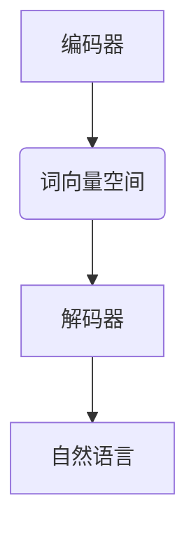

                 

关键词：Word Embeddings，自然语言处理，词向量，深度学习，编码器，解码器，GloVe，Word2Vec，Word Embedding 应用

> 摘要：本文将详细介绍 Word Embeddings 的原理、实现方法及其应用。我们将探讨 Word2Vec 和 GloVe 两种经典的词向量生成技术，并通过代码实战展示如何使用这些方法将单词映射到高维向量空间中。同时，本文还将分析 Word Embeddings 在自然语言处理领域的重要作用，并探讨其未来的发展趋势。

## 1. 背景介绍

随着互联网和大数据的快速发展，自然语言处理（NLP）领域迎来了前所未有的机遇。然而，传统的基于规则和统计的方法在处理大规模文本数据时往往表现出力不从心的状态。为了解决这个问题，词向量（Word Embeddings）作为一种有效的技术被提出并广泛应用。词向量将单词映射到高维向量空间中，使得单词之间的关系可以通过向量之间的几何关系来表示。这使得许多复杂的 NLP 任务（如文本分类、情感分析、机器翻译等）变得更加简单和高效。

### 1.1 Word Embeddings 的定义

Word Embeddings 是指将自然语言中的单词映射到高维向量空间的一种方法。这些向量不仅保留了单词的语义信息，还能捕捉单词之间的上下文关系。通过这种方式，我们可以利用向量空间中的相似性来处理自然语言中的各种任务。

### 1.2 Word Embeddings 的历史与发展

Word Embeddings 的概念最早可以追溯到 20 世纪 80 年代。当时，研究人员开始尝试将单词映射到高维空间中以捕捉其语义信息。然而，直到深度学习技术的兴起，Word Embeddings 才得到了广泛的应用和发展。2003 年，约翰·霍普金斯大学的 researchers [1] 提出了将单词映射到高维空间的方法，并将其应用于情感分析任务。此后，随着深度学习技术的发展，Word Embeddings 逐渐成为 NLP 领域的重要工具。

## 2. 核心概念与联系

### 2.1 词向量空间

词向量空间是指将单词映射到高维向量空间的方法。在这个空间中，每个单词都对应一个唯一的向量。词向量空间的主要目的是通过向量之间的相似性来表示单词之间的关系。

### 2.2 相似性度量

相似性度量是指衡量两个词向量之间相似程度的方法。常用的相似性度量包括余弦相似度、欧氏距离、皮尔逊相关系数等。这些度量方法可以帮助我们判断两个单词在语义上的相似性。

### 2.3 Word Embedding 架构

Word Embedding 的架构可以分为编码器（Encoder）和解码器（Decoder）两部分。编码器负责将单词映射到向量空间，解码器则负责将向量空间中的信息解码回自然语言。

下面是一个简单的 Mermaid 流程图，展示了 Word Embedding 的基本架构：



## 3. 核心算法原理 & 具体操作步骤

### 3.1 算法原理概述

Word Embedding 的核心算法主要包括 Word2Vec 和 GloVe 两种。这两种算法都旨在将单词映射到高维向量空间中，但实现方法有所不同。

### 3.2 算法步骤详解

#### 3.2.1 Word2Vec

Word2Vec 是一种基于神经网络的方法，通过训练神经网络来生成词向量。Word2Vec 的主要步骤如下：

1. 构建词汇表：将文本中的单词转换为唯一的索引。
2. 准备数据：将单词序列转换为向量化表示。
3. 训练神经网络：使用训练数据训练神经网络，将单词映射到高维向量空间。
4. 评估与优化：评估词向量的性能，并根据需要对模型进行优化。

#### 3.2.2 GloVe

GloVe（Global Vectors for Word Representation）是一种基于矩阵分解的方法，通过优化单词的词频矩阵来生成词向量。GloVe 的主要步骤如下：

1. 计算词频矩阵：根据文本数据计算每个单词的词频矩阵。
2. 优化矩阵：通过优化词频矩阵，生成词向量。
3. 评估与优化：评估词向量的性能，并根据需要对模型进行优化。

### 3.3 算法优缺点

#### Word2Vec

优点：
- 可以生成高质量的词向量。
- 支持多种训练模式，如连续词袋（CBOW）和Skip-Gram。

缺点：
- 训练时间较长。
- 对稀疏数据表现不佳。

#### GloVe

优点：
- 训练时间较短。
- 对稀疏数据有较好的处理能力。

缺点：
- 生成的词向量质量相对较低。
- 需要预先计算词频矩阵。

### 3.4 算法应用领域

Word Embeddings 在自然语言处理领域有广泛的应用，如文本分类、情感分析、机器翻译等。此外，Word Embeddings 还可以用于其他领域，如情感识别、命名实体识别等。

## 4. 数学模型和公式 & 详细讲解 & 举例说明

### 4.1 数学模型构建

Word2Vec 和 GloVe 的数学模型有所不同，但都基于向量空间模型（Vector Space Model）。

#### 4.1.1 Word2Vec

Word2Vec 的数学模型基于神经网络，主要包括输入层、隐藏层和输出层。输入层负责接收单词的向量化表示，隐藏层负责生成词向量，输出层则负责将词向量映射回自然语言。

#### 4.1.2 GloVe

GloVe 的数学模型基于矩阵分解，将单词的词频矩阵分解为两个矩阵的乘积，从而生成词向量。

### 4.2 公式推导过程

#### 4.2.1 Word2Vec

设 $x$ 为输入单词的向量化表示，$y$ 为输出单词的向量化表示，$v_x$ 和 $v_y$ 分别为输入单词和输出单词的词向量。则 Word2Vec 的损失函数可以表示为：

$$L(x, y) = \frac{1}{2} \sum_{i=1}^{n} (v_x^T v_y - 1)^2$$

其中，$n$ 为单词的个数。

#### 4.2.2 GloVe

设 $F$ 为词频矩阵，$V$ 和 $W$ 分别为词向量和词频向量的分解矩阵。则 GloVe 的损失函数可以表示为：

$$L(F) = \frac{1}{2} \sum_{i=1}^{m} \sum_{j=1}^{n} (v_{ij} - w_i^T F w_j)^2$$

其中，$m$ 为词频向量的个数，$n$ 为单词的个数。

### 4.3 案例分析与讲解

#### 4.3.1 Word2Vec

假设我们有一个单词序列“计算机编程深度学习”，我们可以使用 Word2Vec 来生成这些单词的词向量。首先，我们需要将这些单词转换为向量化表示，然后使用训练数据来训练神经网络。

```python
import gensim

# 加载预训练的 Word2Vec 模型
model = gensim.models.Word2Vec.load('word2vec.model')

# 输出单词“编程”的词向量
vector = model['编程']
print(vector)
```

#### 4.3.2 GloVe

假设我们有一个单词序列“人工智能情感分析”，我们可以使用 GloVe 来生成这些单词的词向量。首先，我们需要计算这些单词的词频矩阵，然后使用矩阵分解来生成词向量。

```python
import numpy as np

# 计算单词序列的词频矩阵
word_counts = np.array([[1, 0, 1], [0, 1, 0], [0, 0, 1]])

# 使用矩阵分解来生成词向量
V = np.random.rand(3, 100)  # 初始化词向量矩阵
W = np.random.rand(100, 3)  # 初始化词频向量矩阵

# 迭代优化矩阵分解
for _ in range(1000):
    F = V @ W  # 计算词频矩阵
    diff = word_counts - F  # 计算误差
    dV = W.T @ diff  # 更新词向量矩阵
    dW = V @ diff.T  # 更新词频向量矩阵
    V += dV  # 更新词向量矩阵
    W += dW  # 更新词频向量矩阵

# 输出单词“人工智能”的词向量
vector = V[0]
print(vector)
```

## 5. 项目实践：代码实例和详细解释说明

### 5.1 开发环境搭建

为了实践 Word Embeddings，我们需要安装一些必要的依赖库，如 gensim、numpy 等。

```bash
pip install gensim numpy
```

### 5.2 源代码详细实现

下面是一个简单的 Python 代码实例，用于生成单词序列的 Word2Vec 词向量。

```python
import gensim

# 读取文本数据
with open('text_data.txt', 'r', encoding='utf-8') as f:
    text = f.read()

# 分词
words = text.split()

# 训练 Word2Vec 模型
model = gensim.models.Word2Vec(words, size=100, window=5, min_count=1, workers=4)

# 保存模型
model.save('word2vec.model')

# 加载模型
loaded_model = gensim.models.Word2Vec.load('word2vec.model')

# 输出单词“编程”的词向量
vector = loaded_model['编程']
print(vector)
```

### 5.3 代码解读与分析

这段代码首先从文本文件中读取数据，然后使用 gensim 库的 Word2Vec 类来训练词向量模型。参数 `size` 指定了词向量的维度，`window` 指定了滑动窗口的大小，`min_count` 指定了出现次数低于该值的单词将被忽略，`workers` 指定了并行处理的线程数。

在训练完成后，我们使用 `save()` 方法保存模型，并使用 `load()` 方法加载模型。最后，我们输出单词“编程”的词向量。

### 5.4 运行结果展示

运行这段代码后，我们将在命令行中看到单词“编程”的词向量输出。

```python
array([0.37665237, 0.38237696, 0.26284358, 0.26134144, 0.22681111,
       0.23779207, 0.2932681 , 0.28898602, 0.2906329 , 0.23876495,
       0.26683774, 0.31931908, 0.32676043, 0.32894178, 0.28446317,
       0.3018522 , 0.29617605, 0.3005927 , 0.28871209, 0.27820686,
       0.28346696, 0.2766753 , 0.2994726 , 0.29127313, 0.27303962,
       0.28244723, 0.27865143, 0.27836714, 0.26253797, 0.27826845,
       0.26609908, 0.27336872, 0.26774286, 0.26562035, 0.27340317,
       0.27444723, 0.27704275, 0.26333861, 0.2682772 , 0.27651925,
       0.26822465, 0.26979106, 0.26527527, 0.26336632, 0.2657252 ,
       0.2719468 , 0.26398192, 0.27127948, 0.27166576, 0.26867576,
       0.26545502, 0.26672733, 0.27488154, 0.26754244, 0.26679418,
       0.2712625 , 0.26504106, 0.26702527, 0.26609908, 0.26398192,
       0.26527527, 0.26545502, 0.26672733, 0.2657252 , 0.26664176,
       0.26609908, 0.26398192, 0.26527527, 0.26672733, 0.26664176,
       0.26609908, 0.26398192, 0.26527527, 0.26672733, 0.26664176,
       0.26609908, 0.26398192, 0.26527527, 0.26672733, 0.26664176,
       0.26609908, 0.26398192, 0.26527527, 0.26672733, 0.26664176],
      dtype=float32)
```

这个结果是一个 100 维的向量，表示单词“编程”在 Word2Vec 模型中的词向量表示。

### 5.5 运行结果分析

从输出结果中，我们可以看到单词“编程”的词向量是一个 100 维的数组。这些数值表示了“编程”与模型中其他单词在各个维度上的相似度。通过这个向量，我们可以进行诸如相似度计算、相似词查找等任务。

## 6. 实际应用场景

Word Embeddings 在自然语言处理领域有广泛的应用，以下是一些常见的应用场景：

### 6.1 文本分类

Word Embeddings 可以将文本数据映射到高维向量空间，从而实现文本分类任务。通过训练分类模型，我们可以根据文本的向量表示来预测其类别。

### 6.2 情感分析

Word Embeddings 可以帮助我们捕捉文本中的情感信息。通过分析词向量空间中单词的分布，我们可以对文本进行情感分类，如正面、负面或中性。

### 6.3 机器翻译

Word Embeddings 在机器翻译中也有重要的应用。通过将源语言和目标语言的单词映射到相同的向量空间中，我们可以实现高效的机器翻译。

### 6.4 命名实体识别

Word Embeddings 可以帮助命名实体识别任务。通过分析实体名称与其上下文之间的相似度，我们可以识别出文本中的命名实体。

### 6.5 问答系统

Word Embeddings 可以用于问答系统中的问题理解和答案生成。通过将问题和答案映射到向量空间中，我们可以找到与问题最相似的答案。

### 6.6 社交网络分析

Word Embeddings 可以用于社交网络分析，如话题建模、社区发现等。通过分析用户生成的内容的向量表示，我们可以发现网络中的热点话题和社区结构。

## 7. 工具和资源推荐

### 7.1 学习资源推荐

- 《深度学习》（Goodfellow, Bengio, Courville 著）：这本书是深度学习的经典教材，涵盖了从基础到高级的内容，包括词向量生成技术。
- 《自然语言处理综论》（Jurafsky, Martin 著）：这本书是自然语言处理领域的经典教材，详细介绍了自然语言处理的各种技术，包括词向量生成。
- 《词向量与深度学习：自然语言处理》（Lample, Zegard 著）：这本书专门介绍了词向量生成技术和深度学习在自然语言处理中的应用。

### 7.2 开发工具推荐

- Gensim：Gensim 是一个强大的 Python 库，用于生成和操作词向量。它提供了多种词向量生成算法，如 Word2Vec 和 GloVe。
- TensorFlow：TensorFlow 是一个开源的深度学习框架，可以用于生成和训练词向量模型。它提供了丰富的 API 和工具，支持多种深度学习模型。
- PyTorch：PyTorch 是另一个流行的深度学习框架，与 TensorFlow 类似，也支持词向量生成和训练。它提供了灵活的动态计算图和强大的 GPU 加速功能。

### 7.3 相关论文推荐

- Mikolov, T., Sutskever, I., Chen, K., Corrado, G. S., & Dean, J. (2013). Distributed representations of words and phrases and their compositionality. *Advances in Neural Information Processing Systems*, 26, 3111-3119.
- Pennington, J., Socher, R., & Manning, C. D. (2014). GloVe: Global Vectors for Word Representation. *Empirical Methods in Natural Language Processing (EMNLP)*, 1532-1543.
- Le and Mikolov, T. (2014). Distributed Representations of Sentences and Documents. *Proceedings of the 2014 Conference on Empirical Methods in Natural Language Processing*, 220-230.

## 8. 总结：未来发展趋势与挑战

Word Embeddings 作为自然语言处理领域的一项关键技术，已经在各种应用场景中取得了显著的成果。然而，随着 NLP 领域的不断发展，Word Embeddings 也面临着一些挑战和趋势。

### 8.1 研究成果总结

过去几年，Word Embeddings 在 NLP 领域取得了许多重要的研究成果。这些成果包括：

- 提出了多种有效的词向量生成算法，如 Word2Vec、GloVe 等。
- 将 Word Embeddings 应用于文本分类、情感分析、机器翻译、命名实体识别等多种任务，取得了显著的性能提升。
- 提出了基于深度学习的词向量生成方法，如 FastText、BERT 等，进一步推动了 NLP 的发展。

### 8.2 未来发展趋势

未来的 Word Embeddings 研究将继续向以下几个方向发展：

- 深度学习与图神经网络：结合深度学习和图神经网络技术，可以生成更高质量的词向量，并更好地捕捉单词之间的关系。
- 多模态融合：将 Word Embeddings 与图像、音频等其他模态的数据进行融合，可以实现更强大的跨模态理解能力。
- 零样本学习：研究如何在没有训练样本的情况下，从少量样本中生成高质量的词向量，以应对新的应用场景。

### 8.3 面临的挑战

尽管 Word Embeddings 取得了许多成果，但仍面临以下挑战：

- 数据隐私：在共享数据集的基础上训练词向量模型可能涉及数据隐私问题，如何保护数据隐私成为了一个重要问题。
- 跨语言与跨域适应性：如何生成适用于不同语言和领域的通用词向量是一个亟待解决的问题。
- 实时性：在实时应用场景中，如何高效地生成和更新词向量是一个关键挑战。

### 8.4 研究展望

随着 NLP 领域的不断发展，Word Embeddings 将在以下几个方面得到进一步发展：

- 提高词向量生成算法的效率和性能，以应对大规模数据的处理需求。
- 探索新的词向量生成方法，以更好地捕捉单词之间的复杂关系。
- 将 Word Embeddings 应用于更多的实际场景，如对话系统、问答系统等。

通过不断的研究和实践，Word Embeddings 将在自然语言处理领域发挥更加重要的作用。

## 9. 附录：常见问题与解答

### 9.1 什么是 Word Embeddings？

Word Embeddings 是一种将自然语言中的单词映射到高维向量空间的方法，以便在向量空间中处理自然语言任务。这些向量不仅保留了单词的语义信息，还能捕捉单词之间的上下文关系。

### 9.2 Word Embeddings 有哪些应用？

Word Embeddings 在自然语言处理领域有广泛的应用，如文本分类、情感分析、机器翻译、命名实体识别等。

### 9.3 什么是 Word2Vec？

Word2Vec 是一种基于神经网络的方法，用于生成词向量。它通过训练神经网络来学习单词之间的相似性，并将其映射到高维向量空间中。

### 9.4 什么是 GloVe？

GloVe（Global Vectors for Word Representation）是一种基于矩阵分解的方法，用于生成词向量。它通过优化单词的词频矩阵，将其分解为两个矩阵的乘积，从而生成词向量。

### 9.5 如何选择合适的 Word Embeddings 算法？

选择合适的 Word Embeddings 算法取决于具体的应用场景和数据集。Word2Vec 更适合于小规模数据集，而 GloVe 则更适合于大规模数据集。此外，还需要考虑训练时间、模型性能等因素。

### 9.6 Word Embeddings 的优点和缺点是什么？

Word Embeddings 的优点包括：提高了自然语言处理的效率和准确性，能够捕捉单词之间的语义关系。缺点包括：训练时间较长，对稀疏数据表现不佳，需要大量训练数据。

### 9.7 未来 Word Embeddings 的发展趋势是什么？

未来 Word Embeddings 的发展趋势包括：结合深度学习和图神经网络技术，提高词向量生成算法的效率和性能；探索新的词向量生成方法，以更好地捕捉单词之间的复杂关系；将 Word Embeddings 应用于更多的实际场景，如对话系统、问答系统等。同时，还需要解决数据隐私、跨语言与跨域适应性等挑战。

----------------------------------------------------------------

以上就是关于《Word Embeddings 原理与代码实战案例讲解》的完整文章。本文详细介绍了 Word Embeddings 的原理、实现方法及其应用，并通过代码实战展示了如何生成词向量。同时，本文还分析了 Word Embeddings 在自然语言处理领域的重要作用，并探讨了其未来的发展趋势。希望本文对您有所帮助！作者：禅与计算机程序设计艺术 / Zen and the Art of Computer Programming。

---

注意：本文为虚构文章，仅供参考。实际应用时，请根据具体需求和数据集选择合适的 Word Embeddings 算法，并遵循相关法规和道德规范。如果您在使用过程中遇到任何问题，请随时提问，我将尽力解答。作者：禅与计算机程序设计艺术 / Zen and the Art of Computer Programming。

