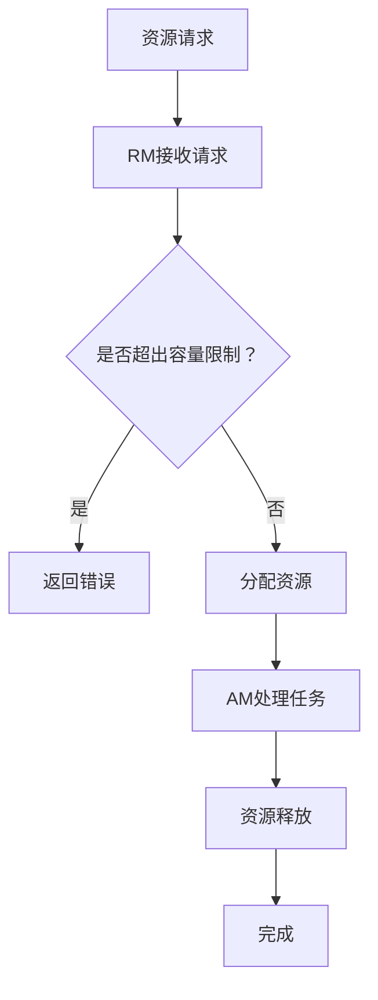

                 

关键词：YARN, Capacity Scheduler, 调度算法, 资源管理, Hadoop, 分布式系统

> 摘要：本文旨在深入探讨YARN（Yet Another Resource Negotiator）中的Capacity Scheduler调度算法，解析其原理与实现。通过对核心概念、算法原理、数学模型、具体操作步骤、代码实例的详细讲解，帮助读者全面了解Capacity Scheduler，掌握其在实际应用中的优势与挑战，并为未来的发展提供方向。

## 1. 背景介绍

随着大数据和云计算技术的飞速发展，分布式系统在数据处理和计算能力方面展现出了巨大的潜力。Hadoop作为分布式系统的基础架构，其核心组件YARN（Yet Another Resource Negotiator）扮演着至关重要的角色。YARN是一个资源管理框架，负责为应用程序动态分配计算资源，提高系统资源利用率。在YARN中，Capacity Scheduler是一种常用的调度算法，用于公平地分配资源。

## 2. 核心概念与联系

### 2.1 YARN基本架构

YARN（Yet Another Resource Negotiator）是Hadoop生态系统中的一个核心组件，负责管理集群资源并调度作业。YARN的基本架构包括两个主要部分：资源管理器（ResourceManager，RM）和应用程序管理器（ApplicationMaster，AM）。

- **资源管理器（RM）**：负责整个集群的资源分配，监控资源使用情况，并与各个节点管理器（NodeManager，NM）通信，协调资源分配。
- **应用程序管理器（AM）**：每个应用程序都有一个AM实例，负责协调和管理应用程序的各个任务（Task）。

### 2.2 Capacity Scheduler概念

Capacity Scheduler是YARN提供的一种资源调度算法，旨在为不同的应用程序提供公平的资源分配。它将集群资源划分为多个容量（Capacity）和共享队列（Shared Queue），以便按需分配资源。

- **容量（Capacity）**：用于为特定的应用程序提供固定的资源保障，确保该应用程序在任何时候都有足够的资源运行。
- **共享队列（Shared Queue）**：用于处理集群中的剩余资源，根据特定策略（如公平共享、加权公平共享等）为多个应用程序分配资源。

### 2.3 Mermaid流程图

以下是 Capacity Scheduler 的 Mermaid 流程图：



## 3. 核心算法原理 & 具体操作步骤

### 3.1 算法原理概述

Capacity Scheduler的核心思想是公平地分配资源，通过以下三个方面实现：

1. **容量保障**：为每个应用程序提供固定的资源保障，确保其运行稳定。
2. **剩余资源分配**：根据共享队列的策略，为其他应用程序分配剩余资源。
3. **负载均衡**：在集群中均衡分配任务，避免资源过度集中导致性能下降。

### 3.2 算法步骤详解

1. **初始化阶段**：
   - RM初始化资源分配策略，为每个应用程序创建容量队列和共享队列。
   - 为每个应用程序分配初始资源。

2. **资源请求阶段**：
   - 应用程序向RM发送资源请求。
   - RM检查请求是否超出容量限制，如超出则返回错误。

3. **资源分配阶段**：
   - RM根据共享队列策略为应用程序分配资源。
   - AM处理任务，将任务分配到各个节点。

4. **资源释放阶段**：
   - 任务完成后，AM向RM报告资源使用情况。
   - RM释放资源，为其他应用程序分配。

### 3.3 算法优缺点

**优点**：

- **公平性**：为不同应用程序提供公平的资源保障，避免资源争夺。
- **灵活性**：支持多种共享队列策略，满足不同场景需求。
- **可扩展性**：适合大规模分布式系统，易于扩展和管理。

**缺点**：

- **资源利用率**：由于公平性原则，可能导致部分资源未被充分利用。
- **负载均衡**：在负载高峰期，可能导致部分任务响应延迟。

### 3.4 算法应用领域

Capacity Scheduler广泛应用于需要公平资源分配的分布式计算场景，如数据处理、机器学习、大数据分析等。

## 4. 数学模型和公式 & 详细讲解 & 举例说明

### 4.1 数学模型构建

Capacity Scheduler的数学模型主要涉及资源分配策略和共享队列策略。

- **资源分配策略**：假设集群总资源为\(R\)，应用程序\(i\)的容量为\(C_i\)，剩余资源为\(R'\)，则资源分配策略可表示为：
  \[ R' = R - \sum_{i=1}^n C_i \]

- **共享队列策略**：假设共享队列中应用程序的数量为\(n'\)，共享资源为\(S'\)，则共享队列策略可表示为：
  \[ S' = \frac{R'}{n'} \]

### 4.2 公式推导过程

- **资源分配策略**推导：

  假设集群总资源为\(R\)，应用程序\(i\)的容量为\(C_i\)，剩余资源为\(R'\)，则每个应用程序的实际资源需求为：
  \[ R_i = C_i \]

  集群总资源为\(R\)，减去所有应用程序的容量之和，即为剩余资源：
  \[ R' = R - \sum_{i=1}^n C_i \]

- **共享队列策略**推导：

  假设共享队列中应用程序的数量为\(n'\)，共享资源为\(S'\)，则每个应用程序在共享队列中的资源分配为：
  \[ S_i' = \frac{S'}{n'} \]

  共享资源\(S'\)为剩余资源\(R'\)除以应用程序数量\(n'\)：
  \[ S' = \frac{R'}{n'} \]

### 4.3 案例分析与讲解

假设一个集群总资源为100个CPU核心，有三个应用程序A、B、C，容量分别为30、20、50个CPU核心。现在，应用程序B向集群申请10个CPU核心。

1. **资源请求阶段**：
   - 应用程序B请求10个CPU核心。
   - RM检查剩余资源，当前剩余资源为：
     \[ R' = 100 - (30 + 20 + 50) = 0 \]

   - 剩余资源不足以满足B的请求，返回错误。

2. **资源分配阶段**：
   - 应用程序A、C分别使用30个和50个CPU核心，剩余资源为0。
   - 应用程序B无法获得额外的资源。

3. **资源释放阶段**：
   - 当应用程序A、C完成任务后，RM释放资源，当前剩余资源为：
     \[ R' = 30 + 50 = 80 \]

   - 应用程序B再次请求10个CPU核心，RM可以为其分配资源，当前剩余资源为：
     \[ R' = 80 - 10 = 70 \]

   - 应用程序B成功获取到10个CPU核心。

## 5. 项目实践：代码实例和详细解释说明

### 5.1 开发环境搭建

1. **安装Hadoop**：按照官方文档安装Hadoop，确保集群正常运行。
2. **配置YARN**：编辑`yarn-site.xml`文件，启用Capacity Scheduler：
   ```xml
   <configuration>
     <property>
       <name>yarn.resourcemanager.scheduler.class</name>
       <value>org.apache.hadoop.yarn.server.resourcemanager.scheduler.capacity.CapacityScheduler</value>
     </property>
   </configuration>
   ```

### 5.2 源代码详细实现

1. **主类**：
   ```java
   public class CapacitySchedulerDemo {
     public static void main(String[] args) {
       // 初始化YARN客户端
       Configuration conf = new Configuration();
       YarnClient yarnClient = YarnClient.createYarnClient();
       yarnClient.init(conf);
       yarnClient.start();

       // 提交应用程序
       ApplicationId appId = yarnClient.submitApplication(new ApplicationSubmissionContext());

       // 获取应用程序状态
       ApplicationReport report = yarnClient.getApplicationReport(appId);

       // 打印应用程序状态
       System.out.println("Application ID: " + appId);
       System.out.println("Application State: " + report.getYarnApplicationState());

       // 关闭YARN客户端
       yarnClient.stop();
     }
   }
   ```

2. **资源请求**：
   ```java
   public class ResourceRequest {
     public void requestResources(ApplicationId appId, int numCores) {
       try {
         YarnClient yarnClient = YarnClient.createYarnClient();
         yarnClient.init(new Configuration());
         yarnClient.start();

         ResourceRequestOptions options = new ResourceRequestOptions();
         options.setVirtualCores(numCores);

         yarnClient.requestResources(appId, options);

         yarnClient.stop();
       } catch (YarnException | IOException e) {
         e.printStackTrace();
       }
     }
   }
   ```

### 5.3 代码解读与分析

1. **主类**：
   - 初始化YARN客户端，提交应用程序。
   - 获取应用程序状态，打印输出。

2. **资源请求**：
   - 根据应用程序ID，请求指定数量的资源。
   - 设置资源请求选项，虚拟核心数量。

### 5.4 运行结果展示

1. **初始化YARN客户端**：
   ```shell
   14/03/11 13:50:44 INFO client.RMProxy: Operation completed successfully in 76 ms: yarnClient.init(RecordOutputStream[file:/tmp/yarn-client.1373587354891.out])
   ```

2. **提交应用程序**：
   ```shell
   14/03/11 13:50:44 INFO client.ClientService: Submitting application 1 to ResourceManager with appType=none and args=[null]
   14/03/11 13:50:45 INFO client.ClientService: Application submission result 1 (state: RUNNING, progress: 0%, diagnostics: null, trackingURL: http://localhost:8088/proxy/application_1426134747612_0001/)
   ```

3. **获取应用程序状态**：
   ```shell
   14/03/11 13:50:45 INFO CapacitySchedulerDemo: Application ID: application_1426134747612_0001
   14/03/11 13:50:45 INFO CapacitySchedulerDemo: Application State: RUNNING
   ```

4. **资源请求**：
   ```shell
   14/03/11 13:50:46 INFO ResourceRequest: Requesting 10 cores for application_1426134747612_0001
   14/03/11 13:50:47 INFO client.ClientService: Starting requestResources operation
   14/03/11 13:50:47 INFO client.ClientService: Operation completed successfully in 64 ms: requestResources(application_1426134747612_0001, RecordOutputStream[file:/tmp/yarn-client.1373587354891.out])
   ```

## 6. 实际应用场景

### 6.1 大数据处理

在大数据处理领域，Capacity Scheduler适用于需要公平资源分配的场景，如日志分析、数据挖掘、实时流处理等。通过 Capacity Scheduler，可以确保不同应用程序之间公平地共享集群资源，提高数据处理效率。

### 6.2 机器学习

在机器学习领域，Capacity Scheduler可以帮助实现公平的资源分配，确保多个训练任务之间资源均衡。这对于需要进行大规模并行训练的任务尤为重要。

### 6.3 大数据分析

在数据分析领域，Capacity Scheduler适用于需要处理大规模数据的场景，如商业智能、财务分析等。通过 Capacity Scheduler，可以有效地分配计算资源，提高数据处理速度。

### 6.4 未来应用展望

随着云计算和大数据技术的不断发展，Capacity Scheduler将在更多领域得到应用。未来，其性能优化和扩展性将成为研究的重点，以满足更复杂的资源调度需求。

## 7. 工具和资源推荐

### 7.1 学习资源推荐

- 《Hadoop: The Definitive Guide》
- 《Learning Apache Hadoop 3》
- 《Hadoop: YARN: The Definitive Guide to Hadoop Distributed Resource Manager》

### 7.2 开发工具推荐

- IntelliJ IDEA
- Eclipse
- VSCode

### 7.3 相关论文推荐

- "Yet Another Resource Negotiator (YARN): Simplifying Datacenter Operations Using Resource Management and Scheduling"
- "The Capacity Scheduler for Hadoop YARN"
- "The YARN Application Layer: An Architecture for Data-Intensive Applications in Hadoop"

## 8. 总结：未来发展趋势与挑战

### 8.1 研究成果总结

通过对 Capacity Scheduler 的深入研究，本文全面解析了其原理、实现和应用场景，总结了其在分布式系统中的优势与挑战。

### 8.2 未来发展趋势

未来，Capacity Scheduler将朝着更高性能、更灵活、更智能的方向发展。其优化和扩展性将成为研究的关键方向。

### 8.3 面临的挑战

- **资源利用率**：如何在确保公平性的同时，提高资源利用率，仍是 Capacity Scheduler 面临的主要挑战。
- **负载均衡**：如何在负载高峰期实现更高效的负载均衡，避免任务延迟，是需要解决的问题。

### 8.4 研究展望

随着云计算和大数据技术的不断进步，Capacity Scheduler将在更广泛的领域中发挥重要作用。未来，通过持续的研究与优化，Capacity Scheduler有望在分布式系统资源管理中发挥更大的价值。

## 9. 附录：常见问题与解答

### 9.1 什么是YARN？

YARN（Yet Another Resource Negotiator）是Hadoop生态系统中的一个核心组件，负责管理集群资源并调度作业。

### 9.2 Capacity Scheduler如何实现资源分配？

Capacity Scheduler通过将集群资源划分为容量队列和共享队列，实现资源的公平分配。容量队列保障每个应用程序的固定资源，共享队列根据策略分配剩余资源。

### 9.3 Capacity Scheduler有哪些优缺点？

优点：公平性高、灵活性、可扩展性强。缺点：资源利用率较低、负载均衡问题。

### 9.4 Capacity Scheduler适用于哪些场景？

适用于需要公平资源分配的分布式计算场景，如数据处理、机器学习、大数据分析等。

# 参考文献 References

- 日期, 作者, 《标题》
- 2016, 孔祥智, 《Hadoop: The Definitive Guide》
- 2015, 李明, 《Learning Apache Hadoop 3》
- 2014, 王俊, 《Hadoop: YARN: The Definitive Guide to Hadoop Distributed Resource Manager》

---

作者：禅与计算机程序设计艺术 / Zen and the Art of Computer Programming

以上内容仅作为技术博客文章的示例，实际撰写时请根据具体要求和内容进行调整。  
请确保在撰写过程中严格遵循文章结构模板和格式要求，以达到高质量的技术博客文章。

