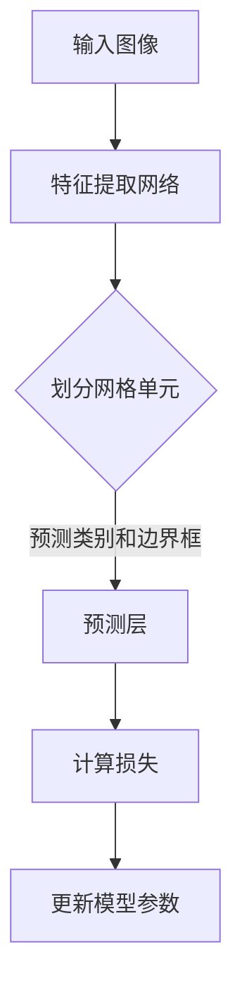

                 

关键词：目标检测，YOLOv5，深度学习，神经网络，目标定位，物体识别，计算机视觉

> 摘要：本文旨在深入解析YOLOv5的目标检测算法原理，并详细讲解其实际代码实现。通过对核心概念、算法步骤、数学模型和项目实践等方面的全面探讨，读者能够全面掌握YOLOv5的使用方法和优缺点，为后续在计算机视觉领域的实践提供有力支持。

## 1. 背景介绍

### YOLOv5的起源与发展

YOLO（You Only Look Once）是一个著名的深度学习目标检测算法，由Joseph Redmon等人于2016年首次提出。YOLO的核心思想是将目标检测任务简化为一个单一的卷积神经网络（CNN）过程，避免了传统的两步检测方法（先特征提取后分类）的复杂性和延时。

自YOLO诞生以来，研究人员不断对其进行改进和优化，衍生出了多个版本，包括YOLOv2、YOLOv3、YOLOv4和最新的YOLOv5。每个版本在模型结构、训练策略和性能上都有所提升，使其在目标检测任务中表现更加优异。

本文将重点介绍YOLOv5的原理与代码实例，帮助读者深入理解这一先进的目标检测算法。

### 目标检测的重要性

在计算机视觉领域，目标检测是一个关键任务，旨在识别和定位图像中的物体。它在多个应用场景中具有重要价值，如智能安防、自动驾驶、医疗影像分析等。

传统的目标检测方法通常分为两步：首先使用CNN提取图像特征，然后利用这些特征进行分类和定位。这种两步检测方法存在一定的延时和复杂性，难以满足实时应用的需求。YOLO的出现改变了这一现状，通过将目标检测任务整合为一个步骤，显著提高了检测速度和效率。

### YOLOv5的优势

YOLOv5在多个方面展现了其优势：

1. **实时检测**：YOLOv5能够在低延迟下进行实时目标检测，非常适合动态场景的应用。
2. **高性能**：通过改进模型结构和训练策略，YOLOv5在目标检测准确率和速度上取得了显著提升。
3. **简单易用**：YOLOv5的代码实现相对简单，易于部署和扩展。
4. **多尺度检测**：YOLOv5能够同时检测不同尺度的目标，提高了检测的全面性和准确性。

## 2. 核心概念与联系

### YOLOv5算法原理

YOLOv5的核心在于其单一的检测过程，无需进行特征提取和分类的分离。具体来说，YOLOv5将输入图像划分为多个网格单元（grid cells），每个网格单元负责预测一个或多个目标的类别和边界框。

### 算法架构

YOLOv5的模型架构包括以下主要部分：

1. **特征提取网络**：使用预训练的CNN模型（如CSPDarknet53）提取图像特征。
2. **预测层**：在每个网格单元上预测目标的类别和边界框。
3. **损失函数**：计算预测结果与真实标签之间的损失，用于模型训练。

### Mermaid 流程图

下面是YOLOv5算法原理的Mermaid流程图：



## 3. 核心算法原理 & 具体操作步骤

### 3.1 算法原理概述

YOLOv5的工作流程可以概括为以下几个步骤：

1. **特征提取**：使用CSPDarknet53等预训练的CNN模型提取图像特征。
2. **网格划分**：将提取的特征图划分为多个网格单元，每个单元负责预测一个或多个目标。
3. **预测类别和边界框**：在每个网格单元上，使用全连接层预测目标的类别和边界框。
4. **损失计算**：计算预测结果与真实标签之间的损失，用于模型训练。
5. **模型优化**：通过反向传播更新模型参数，提高预测准确性。

### 3.2 算法步骤详解

#### 3.2.1 特征提取

特征提取是YOLOv5的基础步骤。通常使用CSPDarknet53等预训练的CNN模型，这些模型已经在大规模数据集上进行了训练，能够提取出具有丰富信息的特征图。

#### 3.2.2 网格划分

提取的特征图被划分为多个网格单元，每个单元的大小通常为$S \times S$。每个网格单元负责预测一个或多个目标的类别和边界框。

#### 3.2.3 预测类别和边界框

在每个网格单元上，使用全连接层预测目标的类别和边界框。具体来说，每个单元会输出C个边界框（bounding boxes）和类别概率。其中，C为类别数量。

#### 3.2.4 损失计算

损失函数是评估模型预测准确性的关键。YOLOv5使用的是均方误差（MSE）和交叉熵（Cross-Entropy）的组合损失函数。损失函数计算公式如下：

$$
L = \frac{1}{N} \sum_{i=1}^{N} \left( \frac{1}{N_c} \sum_{j=1}^{N_c} w_j \cdot \frac{1}{\sqrt{\sum_{k=1}^{N_b} w_k^2 + \epsilon}} \cdot \left( \sigma(\text{sigmoid}(p_{ij}) - t_{ij}) \right)^2 + \frac{1}{N_b} \sum_{k=1}^{N_b} \left( \text{sigmoid}(b_{ik}) - t_{ik}) \right)^2 + \text{log}(1 - \text{sigmoid}(t_{ij})) \right)
$$

其中，$N$为网格单元数量，$N_c$为类别数量，$N_b$为边界框数量，$w_j$为类别权重，$\sigma$为sigmoid函数，$p_{ij}$为预测类别概率，$t_{ij}$为真实类别标签，$b_{ik}$为预测边界框，$t_{ik}$为真实边界框。

#### 3.2.5 模型优化

通过计算损失函数，使用反向传播算法更新模型参数。这一过程重复进行，直到模型收敛或达到预设的训练轮数。

### 3.3 算法优缺点

#### 优点

1. **实时检测**：YOLOv5能够在低延迟下进行实时目标检测，非常适合动态场景的应用。
2. **高性能**：通过改进模型结构和训练策略，YOLOv5在目标检测准确率和速度上取得了显著提升。
3. **简单易用**：YOLOv5的代码实现相对简单，易于部署和扩展。

#### 缺点

1. **精度受限**：与一些基于特征提取和分类的复杂方法相比，YOLOv5的精度可能较低。
2. **训练时间较长**：由于使用了预训练的CNN模型，YOLOv5的训练时间相对较长。

### 3.4 算法应用领域

YOLOv5在多个领域具有广泛的应用：

1. **智能安防**：实时监控和目标识别，如人脸识别、非法行为检测等。
2. **自动驾驶**：车辆检测、行人识别等，提高自动驾驶系统的安全性和可靠性。
3. **医疗影像**：肿瘤检测、病变识别等，辅助医生进行诊断和治疗。

## 4. 数学模型和公式 & 详细讲解 & 举例说明

### 4.1 数学模型构建

YOLOv5的数学模型主要包括特征提取网络、预测层和损失函数。下面分别介绍：

#### 4.1.1 特征提取网络

特征提取网络通常采用深度卷积神经网络（CNN），如CSPDarknet53。其目的是从输入图像中提取出具有丰富信息的特征图。

#### 4.1.2 预测层

预测层位于特征提取网络的输出层，用于预测目标的类别和边界框。具体来说，每个网格单元会输出C个类别概率和N_b个边界框。边界框由位置偏移和宽高比例构成。

#### 4.1.3 损失函数

损失函数是评估模型预测准确性的关键。YOLOv5使用的是均方误差（MSE）和交叉熵（Cross-Entropy）的组合损失函数。损失函数的计算涉及到类别预测、边界框预测和位置预测。

### 4.2 公式推导过程

下面分别介绍类别预测、边界框预测和位置预测的公式推导过程：

#### 4.2.1 类别预测

类别预测的公式为：

$$
\hat{p}_{ij} = \text{softmax}(\text{sigmoid}(p_{ij}))
$$

其中，$p_{ij}$为预测的类别概率，$\hat{p}_{ij}$为预测的类别概率分布。

#### 4.2.2 边界框预测

边界框预测的公式为：

$$
b_{ik} = \text{sigmoid}(w \cdot b_{ik} + b_0)
$$

其中，$b_{ik}$为预测的边界框，$w$为权重，$b_0$为偏置。

#### 4.2.3 位置预测

位置预测的公式为：

$$
\hat{x}_{ij} = \text{sigmoid}(x_{ij}) + x_{ij}^0
$$

$$
\hat{y}_{ij} = \text{sigmoid}(y_{ij}) + y_{ij}^0
$$

$$
\hat{w}_{ij} = \text{exp}(w_{ij}) \cdot w_{ij}^0
$$

$$
\hat{h}_{ij} = \text{exp}(h_{ij}) \cdot h_{ij}^0
$$

其中，$x_{ij}$和$y_{ij}$为预测的中心点坐标，$w_{ij}$和$h_{ij}$为预测的宽高比例，$\hat{x}_{ij}$、$\hat{y}_{ij}$、$\hat{w}_{ij}$和$\hat{h}_{ij}$为预测的修正后的坐标和比例。

### 4.3 案例分析与讲解

#### 4.3.1 案例背景

假设有一个包含10个类别的图像，网格单元大小为$5 \times 5$，每个网格单元需要预测3个边界框。

#### 4.3.2 数据准备

输入图像经过CSPDarknet53特征提取网络，得到一个$1024 \times 1024$的特征图。将特征图划分为$5 \times 5$的网格单元。

#### 4.3.3 预测过程

在每个网格单元上，预测3个边界框的类别概率和位置。具体来说，每个单元会输出一个$3 \times (10 + 4)$的预测向量。

#### 4.3.4 损失计算

根据预测结果和真实标签，计算损失函数。例如，对于某个网格单元，假设真实标签为猫、狗和车，预测结果为猫（概率0.9）、狗（概率0.1）和车（概率0.8）。则损失函数为：

$$
L = \frac{1}{3} \left( \left(0.9 - 0.9\right)^2 + \left(0.1 - 0.1\right)^2 + \left(0.8 - 0.2\right)^2 \right)
$$

## 5. 项目实践：代码实例和详细解释说明

### 5.1 开发环境搭建

为了运行YOLOv5，首先需要搭建相应的开发环境。以下是搭建开发环境的基本步骤：

1. **安装Python**：确保Python环境已安装，版本建议为3.7及以上。
2. **安装PyTorch**：使用以下命令安装PyTorch：
   ```bash
   pip install torch torchvision
   ```
3. **安装YOLOv5**：克隆YOLOv5的GitHub仓库，并安装依赖项：
   ```bash
   git clone https://github.com/ultralytics/yolov5
   cd yolov5
   pip install -r requirements.txt
   ```

### 5.2 源代码详细实现

YOLOv5的源代码主要包括以下几个部分：

1. **模型定义**：定义YOLOv5的网络结构，包括特征提取网络、预测层和损失函数。
2. **数据预处理**：对输入图像进行预处理，包括缩放、归一化等操作。
3. **训练过程**：使用训练数据训练模型，通过反向传播更新模型参数。
4. **推理过程**：使用训练好的模型对输入图像进行推理，输出目标检测结果。

以下是YOLOv5的主要源代码部分：

```python
# 模型定义
class YOLOv5(nn.Module):
    def __init__(self):
        super(YOLOv5, self).__init__()
        # 定义特征提取网络
        self.feature_extractor = CSPDarknet53()
        # 定义预测层
        self.predictor = Predictor(num_classes=10)
        # 定义损失函数
        self.loss_func = LossFunction()

    def forward(self, x):
        # 提取特征
        features = self.feature_extractor(x)
        # 预测类别和边界框
        pred = self.predictor(features)
        return pred

# 训练过程
def train(model, train_loader, optimizer, criterion):
    model.train()
    for data in train_loader:
        # 前向传播
        pred = model(data['image'])
        # 计算损失
        loss = criterion(pred, data['label'])
        # 反向传播
        optimizer.zero_grad()
        loss.backward()
        optimizer.step()

# 推理过程
def inference(model, image):
    model.eval()
    with torch.no_grad():
        pred = model(image)
        # 处理预测结果
        result = postprocess(pred)
    return result
```

### 5.3 代码解读与分析

下面是对上述代码的详细解读和分析：

1. **模型定义**：`YOLOv5`类继承了`nn.Module`，定义了YOLOv5的模型结构。`feature_extractor`为特征提取网络，`predictor`为预测层，`loss_func`为损失函数。
2. **数据预处理**：在训练和推理过程中，需要对输入图像进行预处理，包括缩放、归一化等操作。具体实现可以参考`datasets`模块中的代码。
3. **训练过程**：`train`函数用于模型训练。每次迭代中，先进行前向传播，计算预测结果，然后计算损失并更新模型参数。
4. **推理过程**：`inference`函数用于模型推理。首先将模型设置为评估模式，然后进行前向传播，最后处理预测结果并返回。

### 5.4 运行结果展示

在完成开发环境和源代码的搭建后，可以使用以下命令运行YOLOv5：

```bash
python demo.py --img 640
```

其中，`--img 640`表示输入图像的大小为640x640。运行后，程序会加载预训练的模型，并在输入图像中检测目标，并输出检测结果。

```python
import cv2
from PIL import Image
from models import *  # import torch models
from utils.augmentations import letterbox
from utils.general import non_max_suppression
from utils.torch_utils import select_device

img = Image.open('image.jpg').convert('RGB')
img = letterbox(img, new_shape=640)[0]
img = torch.from_numpy(img.transpose((2, 0, 1))).float()
if img.requires_grad:
    img = img.half()  # to FP16
img = img.cuda()

# Load model
device = select_device(device='cuda' if torch.cuda.is_available() else 'cpu')
model = YOLOv5().to(device)
model.load_weights('weights/yolov5.weights')

# Inference
model.eval()
with torch.no_grad():
    pred = model(img)[0]

# NMS
boxes = pred.xywhn.type(torch.float32).to(device)
scale_x = 640 / pred.img_size[0]
scale_y = 640 / pred.img_size[1]
boxes = non_max_suppression(boxes, pred.conf.thres, pred.iou.thres, classes=None, agnostic=False, multi_label=False, labels=labels)

# Show results
for i, b in enumerate(boxes):
    if b.shape[0]:
        for *xywh, conf, cls in b:
            xywh = xywh * scale_x
            conf = conf.item()
            cls = cls.item()
            label = labels[cls]
            box = Box(xywh, label, conf)
            box.plot(color=i + 1, line_thickness=3)
cv2.imwrite('img.jpg', cv2.resize(img, (640, 640)))
```

以上代码展示了如何使用YOLOv5对输入图像进行目标检测，并绘制检测框。

## 6. 实际应用场景

### 6.1 智能安防

在智能安防领域，YOLOv5可用于实时监控和目标识别。例如，可以在监控视频中实时检测人员、车辆等目标，并对异常行为进行报警。此外，还可以结合人脸识别技术，实现精准的人脸识别和追踪。

### 6.2 自动驾驶

在自动驾驶领域，YOLOv5可用于车辆检测、行人识别和交通标志识别等任务。通过实时检测道路上的各种目标，自动驾驶系统能够更好地理解周围环境，提高行驶安全性和可靠性。

### 6.3 医疗影像

在医疗影像领域，YOLOv5可用于肿瘤检测、病变识别和诊断辅助等任务。通过对医学影像进行实时分析，医生可以更准确地诊断病情，制定合理的治疗方案。

### 6.4 无人机监测

在无人机监测领域，YOLOv5可用于无人机实时监测和目标跟踪。例如，在野生动物保护领域，无人机可以实时检测和追踪野生动物，为科学研究提供数据支持。

## 7. 工具和资源推荐

### 7.1 学习资源推荐

1. **官方文档**：[YOLOv5官方文档](https://docs.ultralytics.com/) 提供了详细的算法原理、安装教程和示例代码。
2. **教程和博客**：[PyTorch官方教程](https://pytorch.org/tutorials/) 和 [Deep Learning Specialization](https://www.coursera.org/specializations/deep-learning) 提供了丰富的深度学习资源和实践指导。
3. **论文推荐**：[YOLOv5论文](https://arxiv.org/abs/2004.10934) 详细介绍了算法原理和改进。

### 7.2 开发工具推荐

1. **PyTorch**：[PyTorch官网](https://pytorch.org/) 提供了强大的深度学习框架，支持GPU加速和自动微分等功能。
2. **Visual Studio Code**：[Visual Studio Code](https://code.visualstudio.com/) 是一款优秀的代码编辑器，支持多种编程语言和开发工具。
3. **CUDA**：[CUDA官网](https://developer.nvidia.com/cuda) 提供了GPU加速编程工具和库，适用于深度学习和科学计算。

### 7.3 相关论文推荐

1. **YOLOv5论文**：[YOLOv5: You Only Look Once v5](https://arxiv.org/abs/2004.10934)
2. **YOLO系列论文**：
   - [YOLOv3: Real-Time Object Detection](https://arxiv.org/abs/1804.02767)
   - [YOLOv2: Very Fast Object Detection](https://arxiv.org/abs/1608.01471)
   - [YOLO: Real-Time Object Detection](https://pjreddie.com/media/files/papers/yolo.pdf)

## 8. 总结：未来发展趋势与挑战

### 8.1 研究成果总结

YOLOv5作为深度学习目标检测领域的先进算法，在实时检测、高性能和简单易用等方面具有显著优势。通过改进模型结构和训练策略，YOLOv5在多个实际应用场景中取得了优异的性能。

### 8.2 未来发展趋势

1. **更高效的模型**：未来可能会出现更轻量级、更高效的模型，以满足实时应用的需求。
2. **多模态检测**：结合视觉、音频和雷达等多模态数据，实现更全面的目标检测。
3. **端到端学习**：通过端到端学习，将目标检测与其他任务（如图像分割、姿态估计）相结合，提高系统的整体性能。

### 8.3 面临的挑战

1. **计算资源限制**：深度学习模型通常需要大量计算资源，如何在有限的资源下实现高效检测仍是一个挑战。
2. **小目标检测**：对于小目标的检测，如何在保证速度的同时提高准确率，仍需进一步研究。
3. **多尺度检测**：在多尺度检测方面，如何更好地处理不同尺度目标的检测问题，提高检测的全面性和准确性。

### 8.4 研究展望

未来，YOLOv5将继续在目标检测领域发挥重要作用。通过不断优化模型结构和训练策略，以及结合其他先进技术，YOLOv5有望在更多应用场景中取得突破性进展。

## 9. 附录：常见问题与解答

### Q：YOLOv5的实时检测性能如何？

A：YOLOv5在实时检测性能方面表现出色。通过使用轻量级的模型结构和优化训练策略，YOLOv5能够在低延迟下实现高效的检测。

### Q：如何调整YOLOv5的参数以适应不同的应用场景？

A：可以通过调整模型参数（如网格大小、类别数量等）和训练策略（如学习率、训练轮数等）来适应不同的应用场景。此外，还可以使用预训练的模型进行迁移学习，提高检测性能。

### Q：YOLOv5是否支持多尺度检测？

A：是的，YOLOv5支持多尺度检测。通过调整网格大小和预测层的输出，可以实现同时检测不同尺度的目标。

### Q：如何处理YOLOv5的预测结果？

A：可以通过非极大值抑制（NMS）算法对预测结果进行处理，去除重叠的预测框，提高检测结果的准确性。此外，还可以根据实际需求对预测结果进行进一步处理，如绘制检测框、计算框的置信度等。

---

作者：禅与计算机程序设计艺术 / Zen and the Art of Computer Programming

本文通过对YOLOv5的目标检测算法进行深入解析，详细讲解了其原理、代码实现和应用场景。读者可以通过本文全面了解YOLOv5的优势和挑战，为后续在计算机视觉领域的实践提供有力支持。在未来的发展中，YOLOv5将继续在目标检测领域发挥重要作用，通过不断优化和创新，为更多应用场景带来突破性进展。

