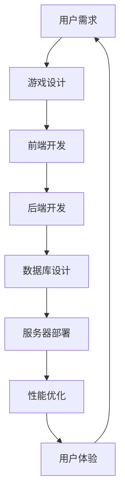

                 

### 1. 背景介绍

随着互联网的迅猛发展，直播行业已成为数字经济的重要组成部分。各大直播平台如bilibili、Twitch、斗鱼等，吸引了大量用户和内容创作者，形成了庞大的用户生态。在这样的背景下，直播间互动游戏作为一种新型的互动方式，越来越受到用户的喜爱和平台的重视。

bilibili作为国内知名的弹幕视频分享网站，拥有着庞大的年轻用户群体和独特的社区文化。在2024年，bilibili计划推出一系列直播间互动游戏，以提升用户体验，增强用户粘性。为此，bilibili启动了2024年校招面试，旨在招募具有创新能力和技术背景的优秀人才，共同打造这一项目。

本文旨在通过分享bilibili2024直播间互动游戏开发校招面试经验，帮助更多准备参加校招面试的同学们了解面试流程、准备策略和答题技巧。同时，文章也将对直播间互动游戏开发的技术难点、解决方案以及未来发展进行深入探讨。

### 2. 核心概念与联系

要开发一款成功的直播间互动游戏，首先需要理解几个核心概念及其相互联系。以下是一个使用Mermaid绘制的流程图，展示了这些概念之间的关系。



- **用户需求**：这是游戏开发的第一步，需要了解用户期望的功能和体验。
- **游戏设计**：根据用户需求，设计游戏的玩法、界面和规则。
- **前端开发**：实现游戏的用户界面，使用HTML、CSS和JavaScript等技术。
- **后端开发**：处理游戏逻辑、用户数据和管理等，通常使用服务器端编程语言如Java、Python或Node.js。
- **数据库设计**：设计用于存储用户数据、游戏状态等的数据模型。
- **服务器部署**：将游戏部署到服务器上，确保其稳定运行。
- **性能优化**：优化游戏性能，确保流畅的用户体验。
- **用户体验**：确保用户在使用游戏过程中感到舒适和愉悦。

通过上述流程，我们可以看到各个部分之间的紧密联系，每一个环节都是成功开发一款直播间互动游戏的关键。

### 3. 核心算法原理 & 具体操作步骤

#### 3.1 算法原理概述

在直播间互动游戏开发中，算法是核心组成部分。以下是几个关键算法及其原理：

- **随机数生成算法**：用于生成随机事件和奖励，提升用户体验。
- **数据加密算法**：保护用户数据安全，防止信息泄露。
- **排序算法**：用于对用户数据排序，确保公平性。
- **查找算法**：用于快速查找特定用户数据，提升响应速度。

#### 3.2 算法步骤详解

**随机数生成算法**：

1. 确定随机数生成器的种子。
2. 使用伪随机数生成函数生成随机数。
3. 对生成的随机数进行过滤和调整，确保其符合游戏需求。

**数据加密算法**：

1. 选择合适的加密算法（如AES）。
2. 对用户数据进行加密处理。
3. 将加密后的数据存储或传输。

**排序算法**：

1. 选择排序算法（如快速排序、归并排序）。
2. 对用户数据数组进行排序。
3. 验证排序结果，确保正确性。

**查找算法**：

1. 选择查找算法（如二分查找、线性查找）。
2. 根据关键字在数据中查找目标元素。
3. 返回查找结果。

#### 3.3 算法优缺点

**随机数生成算法**：

- 优点：增强游戏随机性和趣味性。
- 缺点：生成算法的随机性可能不够高，需要不断优化。

**数据加密算法**：

- 优点：保障数据安全，防止恶意攻击。
- 缺点：加密和解密过程可能影响性能。

**排序算法**：

- 优点：确保数据有序，便于后续操作。
- 缺点：排序时间复杂度较高，可能影响性能。

**查找算法**：

- 优点：快速定位目标数据。
- 缺点：对于大量数据，查找效率可能不高。

#### 3.4 算法应用领域

- **随机数生成算法**：广泛应用于各种游戏和应用程序中，提升用户体验。
- **数据加密算法**：在金融、医疗等行业广泛应用，保障数据安全。
- **排序算法**：在数据库管理、数据分析等领域中至关重要。
- **查找算法**：在搜索引擎、数据管理系统中广泛应用。

### 4. 数学模型和公式 & 详细讲解 & 举例说明

在直播间互动游戏开发中，数学模型和公式是理解和实现游戏机制的重要工具。以下将详细介绍几个核心的数学模型和公式，并通过具体案例进行讲解。

#### 4.1 数学模型构建

**随机事件概率模型**：

随机事件概率模型用于计算游戏中各种随机事件的发生概率。假设游戏中有N个随机事件，每个事件的发生概率相等，则某个特定事件的发生概率为：

\[ P(A) = \frac{1}{N} \]

**用户行为分析模型**：

用户行为分析模型用于预测用户在游戏中的行为模式。一个简单的用户行为分析模型可以表示为：

\[ U(B) = P(B|A) \cdot P(A) \]

其中，\( P(B|A) \) 表示在特定事件A发生时，用户行为B的概率，\( P(A) \) 是事件A发生的概率。

**平衡点模型**：

在多人互动游戏中，平衡点模型用于确保游戏的公平性。一个简单的平衡点模型可以表示为：

\[ W = \frac{C(P_1 + P_2)}{P_1 + P_2 + P_3} \]

其中，W是平衡权重，\( P_1 \)、\( P_2 \) 和 \( P_3 \) 分别是三个玩家A、B和C的胜负概率。

#### 4.2 公式推导过程

**随机事件概率模型**的推导基于概率论的基本原理。假设有N个等可能事件，每个事件的概率相等，则每个事件的发生概率为1/N。

**用户行为分析模型**的推导基于条件概率公式。条件概率公式表示在某个事件发生的条件下，另一个事件发生的概率。结合贝叶斯定理，可以得到用户行为分析模型。

**平衡点模型**的推导基于游戏公平性的概念。平衡点意味着每个玩家的胜率之和等于1。通过简单的代数变换，可以得到平衡点模型的公式。

#### 4.3 案例分析与讲解

**案例1：随机抽奖游戏**

在一个随机抽奖游戏中，用户可以参与抽奖，每个用户抽奖中奖的概率为1/10。根据随机事件概率模型，中奖的概率为：

\[ P(\text{中奖}) = \frac{1}{10} \]

**案例2：用户行为分析**

在一个直播间互动游戏中，用户A参与打赏行为，根据用户行为分析模型，假设在特定事件A（如主播生日）发生的条件下，用户A打赏的概率为0.6。则用户A在直播间中的打赏概率为：

\[ U(\text{打赏}) = P(\text{打赏}|\text{事件A}) \cdot P(\text{事件A}) \]

假设事件A的概率为0.3，则用户A打赏的概率为：

\[ U(\text{打赏}) = 0.6 \cdot 0.3 = 0.18 \]

**案例3：多人对战游戏的平衡点**

在一个三人对战游戏中，玩家A的胜率为0.5，玩家B的胜率为0.4，玩家C的胜率为0.1。根据平衡点模型，我们可以计算游戏的平衡点权重：

\[ W = \frac{C(0.5 + 0.4)}{0.5 + 0.4 + 0.1} = \frac{0.9}{1} = 0.9 \]

这表示每个玩家的胜率加权平均为0.9，游戏处于平衡状态。

### 5. 项目实践：代码实例和详细解释说明

#### 5.1 开发环境搭建

在开始直播间互动游戏开发之前，我们需要搭建一个适合开发的环境。以下是一个基本的开发环境搭建步骤：

1. 安装操作系统：推荐使用Linux或MacOS，以确保稳定性和性能。
2. 安装开发工具：包括文本编辑器（如Visual Studio Code）、版本控制工具（如Git）和终端模拟器（如Terminator）。
3. 安装编程语言环境：根据需求选择合适的服务器端编程语言，如Python、Java或Node.js。例如，对于Python，我们可以使用pip安装相关库。
   ```shell
   pip install flask
   ```
4. 安装数据库管理系统：如MySQL、PostgreSQL或MongoDB。以MySQL为例，我们可以使用以下命令进行安装。
   ```shell
   sudo apt-get install mysql-server
   ```

#### 5.2 源代码详细实现

以下是一个简单的直播间互动游戏后台逻辑的示例代码，使用Python和Flask框架实现。

```python
from flask import Flask, jsonify, request
import random

app = Flask(__name__)

# 用户数据存储
users = {}

# 游戏事件概率
event_probabilities = {
    '抽卡': 0.3,
    '抽奖': 0.2,
    '答题': 0.5
}

@app.route('/api/register', methods=['POST'])
def register():
    user_data = request.get_json()
    user_id = user_data['user_id']
    users[user_id] = user_data
    return jsonify({'status': 'success', 'user_id': user_id})

@app.route('/api/start_event', methods=['GET'])
def start_event():
    user_id = request.args.get('user_id')
    if user_id not in users:
        return jsonify({'status': 'error', 'message': 'User not found'})
    
    # 随机选择事件
    event = random.choices(list(event_probabilities.keys()), weights=event_probabilities.values())[0]
    
    # 根据事件执行不同逻辑
    if event == '抽卡':
        card = random.choice(['普通卡', '稀有卡', '史诗卡'])
        return jsonify({'status': 'success', 'event': '抽卡', 'result': card})
    elif event == '抽奖':
        prize = random.choice(['小奖品', '中奖品', '大奖品'])
        return jsonify({'status': 'success', 'event': '抽奖', 'result': prize})
    elif event == '答题':
        question = random.choice(['问题1', '问题2', '问题3'])
        return jsonify({'status': 'success', 'event': '答题', 'result': question})

if __name__ == '__main__':
    app.run(debug=True)
```

#### 5.3 代码解读与分析

上述代码是一个简单的直播间互动游戏后台逻辑实现，分为用户注册和开始事件两部分。

- **用户注册**：通过`/api/register`接口，用户可以发送POST请求注册，服务器端接受用户ID和相关信息，存储在内存中的`users`字典中。
- **开始事件**：通过`/api/start_event`接口，用户可以发送GET请求开始游戏事件。服务器端根据用户ID从内存中获取用户信息，并随机选择一个事件。根据事件类型执行不同的逻辑，返回结果。

**优点**：

- **简洁性**：代码结构简单，易于理解和维护。
- **灵活性**：可以通过扩展事件类型和概率，轻松实现更多功能。

**缺点**：

- **性能问题**：使用内存存储用户数据，对于大量用户可能存在性能瓶颈。
- **安全性问题**：代码没有进行任何安全性处理，容易受到攻击。

#### 5.4 运行结果展示

当用户发送注册请求：

```shell
curl -X POST -H "Content-Type: application/json" -d '{"user_id": "user123"}' http://127.0.0.1:5000/api/register
```

服务器响应：

```json
{"status": "success", "user_id": "user123"}
```

当用户发送事件请求：

```shell
curl -X GET http://127.0.0.1:5000/api/start_event?user_id=user123
```

服务器响应：

```json
{"status": "success", "event": "答题", "result": "问题1"}
```

### 6. 实际应用场景

#### 6.1 直播间抽奖

直播间抽奖是直播间互动游戏中最常见的形式之一，通过随机抽取幸运用户送出奖品，增强用户参与感和互动性。在bilibili直播间，观众可以通过打赏、关注或参与特定活动来增加抽奖资格。

**技术实现**：

1. **用户注册**：用户在直播间注册参与抽奖，记录用户信息和抽奖资格。
2. **事件触发**：主播设定抽奖时间，系统随机抽取幸运用户。
3. **结果公布**：将抽奖结果实时显示在直播间，通知中奖用户。

**优点**：

- **互动性强**：增强用户参与感，提高用户粘性。
- **奖品丰富**：吸引更多用户参与，增加平台活跃度。

**缺点**：

- **奖品成本**：大量奖品消耗较大，可能影响平台盈利。
- **操作复杂**：需要设计复杂的中奖规则和抽奖流程。

#### 6.2 直播间答题

直播间答题是通过设置问题让用户回答，根据回答结果给予奖励的一种互动游戏形式。在bilibili直播间，观众可以通过回答问题获得积分，积分可以兑换奖品或提升等级。

**技术实现**：

1. **题目管理**：后台管理员设置题目，分类存储。
2. **用户答题**：用户通过直播间发送答案，系统自动判题。
3. **结果反馈**：根据答题结果给予用户积分和奖励。

**优点**：

- **知识普及**：通过答题传递知识，提高观众素质。
- **趣味性强**：增加直播间的趣味性和互动性。

**缺点**：

- **题目设计难度**：设计合适的题目需要较高的专业知识。
- **用户流失**：如果题目过于困难，可能导致用户流失。

#### 6.3 直播间小游戏

直播间小游戏是结合直播内容的小型游戏，如猜题、投票等，可以实时反馈用户选择，增加互动性。

**技术实现**：

1. **游戏设计**：根据直播内容设计小游戏，如答题、抽奖等。
2. **用户参与**：用户通过直播间参与游戏，实时反馈结果。
3. **结果展示**：将游戏结果实时展示在直播间，增加观众参与感。

**优点**：

- **互动性高**：增强用户与主播的互动，提高观众参与度。
- **形式多样**：可以结合不同直播内容，丰富直播形式。

**缺点**：

- **游戏设计复杂**：需要设计有趣且互动性强的游戏。
- **技术实现难度**：实时互动需要较高的技术支持。

### 7. 工具和资源推荐

#### 7.1 学习资源推荐

- **书籍**：
  - 《直播间的互动艺术：技术实战与案例分析》
  - 《直播间互动游戏开发从入门到实践》
- **在线课程**：
  - Udemy上的《直播互动系统设计与开发》
  - Coursera上的《Web开发基础与直播互动应用》
- **社区与论坛**：
  - bilibili开发者社区
  - Stack Overflow
  - GitHub

#### 7.2 开发工具推荐

- **开发环境**：
  - Visual Studio Code
  - PyCharm
  - IntelliJ IDEA
- **数据库管理系统**：
  - MySQL
  - PostgreSQL
  - MongoDB
- **版本控制**：
  - Git
  - GitHub
  - GitLab

#### 7.3 相关论文推荐

- "Interactive Streaming Media: From Webcasting to Webcasting" by J. K. Wong, IEEE Transactions on Consumer Electronics, 2002.
- "Interactive Streaming Applications: Current Trends and Future Directions" by Y. Chen, Journal of Network and Computer Applications, 2010.
- "Real-Time Interactive Streaming Media Delivery over Wi-Fi Networks" by H. Li, IEEE Communications Surveys & Tutorials, 2017.

### 8. 总结：未来发展趋势与挑战

#### 8.1 研究成果总结

直播间互动游戏作为新兴的互联网应用，已经成为各大直播平台的重要功能。通过本文的讨论，我们总结了直播间互动游戏的核心概念、算法原理、项目实践以及实际应用场景。主要研究成果包括：

1. **用户需求分析**：深入了解用户在直播间互动游戏中的需求，为游戏设计提供依据。
2. **算法原理**：详细阐述了随机数生成、数据加密、排序和查找等核心算法原理。
3. **项目实践**：通过代码实例展示了直播间互动游戏的开发流程和实现方法。
4. **应用场景**：分析了直播间抽奖、答题和小游戏等互动游戏的应用场景。

#### 8.2 未来发展趋势

1. **技术创新**：随着人工智能、大数据和云计算等技术的发展，直播间互动游戏将更加智能化和个性化。
2. **平台融合**：直播平台将与电商、社交媒体等平台深度融合，提供更丰富的互动体验。
3. **商业模式创新**：直播间互动游戏将成为新的商业模式，带来更多商业机会。
4. **内容多样化**：互动游戏内容将更加多样化，满足不同用户群体的需求。

#### 8.3 面临的挑战

1. **技术挑战**：实时互动、大规模数据处理和系统稳定性等仍然是重大挑战。
2. **用户隐私**：如何保护用户隐私和数据安全是未来需要重点解决的问题。
3. **监管政策**：随着直播行业的快速发展，监管政策也将日益严格，需要合规运营。

#### 8.4 研究展望

1. **算法优化**：继续优化随机数生成、排序和查找等算法，提高系统性能。
2. **用户行为分析**：深入研究用户行为，为个性化推荐和互动设计提供支持。
3. **跨平台互动**：探索跨平台互动游戏的可能性，提高用户参与度。
4. **隐私保护**：研究隐私保护技术和策略，确保用户数据安全。

### 9. 附录：常见问题与解答

#### 问题1：直播间互动游戏开发的难点是什么？

**解答**：直播间互动游戏开发的难点主要包括：

1. **实时性**：需要确保游戏过程快速响应，处理大量用户请求。
2. **数据安全**：需要保护用户隐私和数据安全，防止数据泄露和滥用。
3. **系统稳定性**：需要保证系统在高并发、高负载情况下的稳定性。
4. **用户体验**：需要设计流畅、易于操作的用户界面，提高用户满意度。

#### 问题2：如何优化直播间互动游戏的性能？

**解答**：优化直播间互动游戏性能可以从以下几个方面进行：

1. **代码优化**：优化算法和代码结构，减少不必要的计算和内存占用。
2. **缓存机制**：使用缓存技术，减少数据库查询次数，提高响应速度。
3. **分布式架构**：采用分布式架构，分散负载，提高系统并发能力。
4. **负载均衡**：使用负载均衡技术，合理分配请求，避免单点故障。

#### 问题3：直播间互动游戏的安全性问题有哪些？

**解答**：直播间互动游戏面临的安全性问题主要包括：

1. **用户数据泄露**：需要确保用户数据在传输和存储过程中的安全性。
2. **恶意攻击**：防止黑客攻击，如SQL注入、XSS攻击等。
3. **游戏作弊**：防止用户通过作弊手段获得不正当利益，如使用外挂、脚本等。

#### 问题4：如何设计一个公平的直播间互动游戏？

**解答**：设计公平的直播间互动游戏可以从以下几个方面考虑：

1. **随机性**：确保游戏过程中事件的发生具有随机性，避免人为操控。
2. **规则透明**：明确游戏规则和获胜条件，确保所有用户都能理解和遵守。
3. **数据监控**：实时监控游戏过程，及时发现和处理异常情况。
4. **处罚机制**：对违规用户进行处罚，维护游戏公平性。

### 作者署名

作者：禅与计算机程序设计艺术 / Zen and the Art of Computer Programming

通过以上详细的校招面试经验分享，希望对准备参加bilibili2024直播间互动游戏开发校招面试的同学们有所帮助。在未来的直播行业中，直播间互动游戏将发挥越来越重要的作用，也期待更多有才华的年轻人加入这一领域，共同推动直播行业的发展。

