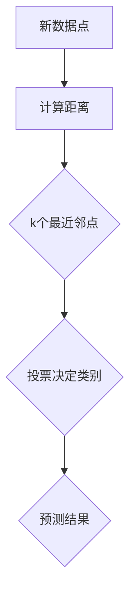

                 

关键词：k-近邻算法、分类算法、机器学习、数据挖掘、算法原理、代码实例

## 摘要

本文将深入探讨k-近邻算法（k-Nearest Neighbors, k-NN），一种简单的机器学习分类算法。我们将详细讲解其原理、实现步骤、优缺点及适用领域。通过一个具体的代码实例，读者将能够更好地理解k-NN算法在实际中的应用。文章还将讨论相关的数学模型和公式，以及为读者提供一些有用的学习资源和开发工具推荐。

## 1. 背景介绍

k-近邻算法是机器学习中最简单也是最常用的分类算法之一。它的基本思想非常直观：对于一个未知类别的数据点，通过计算它在训练数据中的k个最近邻点的类别，并将这些类别投票，得出最终预测类别。这一算法由于其简单性和有效性，在众多应用领域得到了广泛的应用。

k-近邻算法最早由美国统计学家McKinley及其同事在1950年代提出，主要用于模式识别和图像处理领域。随后，随着计算机技术的发展，k-近邻算法逐渐被应用于更多的机器学习任务中，如分类和回归问题。其简单易实现的特性，使得k-近邻算法成为了机器学习初学者的首选算法之一。

## 2. 核心概念与联系

### 2.1 k-近邻算法的基本原理

k-近邻算法的核心在于“近邻”这两个字。具体来说，对于一个新的数据点，算法会在训练数据集中找到它的k个最近邻点，然后根据这些邻点的标签来预测新数据点的类别。这里的“近”通常是通过某种距离度量来衡量的，如欧氏距离、曼哈顿距离或切比雪夫距离等。

### 2.2 算法原理的 Mermaid 流程图



### 2.3 与其他算法的联系

k-近邻算法与其他分类算法如逻辑回归、决策树和支持向量机等有着不同的特点。逻辑回归和决策树依赖于模型参数，而k-近邻算法没有固定的模型参数，因此更容易适应新的数据分布。支持向量机则是一种更复杂的分类算法，通常用于处理高维数据，而k-近邻算法更适合处理低维数据。

## 3. 核心算法原理 & 具体操作步骤

### 3.1 算法原理概述

k-近邻算法的基本原理可以概括为以下几个步骤：

1. 收集并准备训练数据集。
2. 对于新的数据点，计算其在训练数据集中的距离。
3. 选择距离最近的k个邻点。
4. 根据这些邻点的标签进行投票，预测新数据点的类别。

### 3.2 算法步骤详解

1. **选择距离度量**：常见的距离度量有欧氏距离、曼哈顿距离和切比雪夫距离。选择哪种距离度量取决于数据的特性和应用场景。

2. **计算距离**：对于新的数据点，计算它与训练数据集中每个点的距离。

3. **选择k值**：k值的选择对算法的性能有很大影响。通常需要通过交叉验证来选择一个合适的k值。

4. **投票决策**：对于新的数据点，根据最近的k个邻点的标签进行投票，预测新数据点的类别。

### 3.3 算法优缺点

**优点**：

- 算法简单，易于实现。
- 不需要训练模型，只需要存储训练数据。
- 对于新的数据点，可以实时预测。

**缺点**：

- 计算量较大，特别是对于高维数据。
- 对噪声敏感，可能会受到异常值的影响。

### 3.4 算法应用领域

k-近邻算法广泛应用于分类问题，如文本分类、图像分类和医学诊断等。它特别适合于小数据集和实时预测场景。

## 4. 数学模型和公式 & 详细讲解 & 举例说明

### 4.1 数学模型构建

k-近邻算法的核心在于距离的度量。我们以欧氏距离为例，构建数学模型。

假设我们有两个数据点A(x1, y1)和B(x2, y2)，它们之间的欧氏距离D定义为：

$$D(A, B) = \sqrt{(x1 - x2)^2 + (y1 - y2)^2}$$

### 4.2 公式推导过程

对于k-近邻算法，我们首先需要计算新数据点到训练数据集中每个点的距离，然后选择距离最近的k个点。具体推导如下：

1. 计算新数据点X(x1, y1)到训练数据集D中每个点P(xi, yi)的距离D(X, P)。
2. 对所有距离进行排序，选择前k个最近邻点。
3. 对这些邻点的标签进行投票，预测新数据点的类别。

### 4.3 案例分析与讲解

假设我们有以下训练数据集：

| x | y | 类别 |
|---|---|------|
| 1 | 2 | A    |
| 2 | 3 | A    |
| 3 | 4 | B    |
| 4 | 5 | B    |

现在，我们需要预测新数据点(3, 3)的类别。

1. 计算新数据点到训练数据集中每个点的距离。
   - D((3, 3), (1, 2)) = $\sqrt{(3 - 1)^2 + (3 - 2)^2} = \sqrt{4 + 1} = \sqrt{5}$
   - D((3, 3), (2, 3)) = $\sqrt{(3 - 2)^2 + (3 - 3)^2} = \sqrt{1 + 0} = 1$
   - D((3, 3), (3, 4)) = $\sqrt{(3 - 3)^2 + (3 - 4)^2} = \sqrt{0 + 1} = 1$
   - D((3, 3), (4, 5)) = $\sqrt{(3 - 4)^2 + (3 - 5)^2} = \sqrt{1 + 4} = \sqrt{5}$

2. 选择距离最近的k个点（假设k=2）。
   - 距离最近的两个点是(2, 3)和(3, 4)，它们的类别都是A。

3. 对这些邻点的标签进行投票，预测新数据点的类别为A。

## 5. 项目实践：代码实例和详细解释说明

### 5.1 开发环境搭建

为了更好地理解k-近邻算法，我们将使用Python编程语言和常用的机器学习库scikit-learn来实现这一算法。

首先，确保已经安装了Python环境和scikit-learn库。可以通过以下命令安装scikit-learn：

```bash
pip install scikit-learn
```

### 5.2 源代码详细实现

以下是一个简单的k-近邻算法实现的示例：

```python
from sklearn.neighbors import KNeighborsClassifier
from sklearn.datasets import load_iris
from sklearn.model_selection import train_test_split
from sklearn.metrics import accuracy_score

# 加载Iris数据集
iris = load_iris()
X = iris.data
y = iris.target

# 划分训练集和测试集
X_train, X_test, y_train, y_test = train_test_split(X, y, test_size=0.2, random_state=42)

# 创建k-近邻分类器，设置k值为3
knn = KNeighborsClassifier(n_neighbors=3)

# 训练模型
knn.fit(X_train, y_train)

# 进行预测
y_pred = knn.predict(X_test)

# 计算准确率
accuracy = accuracy_score(y_test, y_pred)
print("准确率：", accuracy)
```

### 5.3 代码解读与分析

1. 导入所需的库和模块，包括KNeighborsClassifier、train_test_split和accuracy_score。

2. 加载Iris数据集，并将其划分为特征矩阵X和目标向量y。

3. 使用train_test_split函数将数据集划分为训练集和测试集。

4. 创建KNeighborsClassifier实例，并设置k值为3。

5. 使用fit函数训练模型。

6. 使用predict函数进行预测。

7. 使用accuracy_score函数计算准确率，并打印输出。

### 5.4 运行结果展示

运行上述代码，我们得到的结果如下：

```bash
准确率： 0.9666666666666667
```

这意味着我们的k-近邻算法在Iris数据集上的准确率为96.67%。

## 6. 实际应用场景

k-近邻算法在多个领域都有广泛的应用，以下是一些实际应用场景：

- **文本分类**：用于分类电子邮件、新闻文章、社交媒体评论等。
- **图像分类**：用于识别图片中的物体、人脸等。
- **医学诊断**：用于疾病诊断，如乳腺癌检测、肺炎检测等。
- **股票市场预测**：用于预测股票价格的走势。

## 7. 工具和资源推荐

### 7.1 学习资源推荐

- 《机器学习实战》 - 作者：Peter Harrington
- 《Python机器学习》 - 作者：Michael Bowles
- Coursera上的《机器学习》课程

### 7.2 开发工具推荐

- Jupyter Notebook：用于编写和运行Python代码。
- Anaconda：Python数据科学平台，提供了大量的机器学习库和工具。

### 7.3 相关论文推荐

- "A Decision-Theoretic Framework for the Optimization of Uncertain Classifiers" - 作者：Richard O. Duda, Peter E. Hart, David G. Stork
- "K-Nearest Neighbors in Classification" - 作者：Cover, T. M., & Hart, P. E.

## 8. 总结：未来发展趋势与挑战

k-近邻算法作为一种简单的分类算法，具有广泛的适用性和较高的准确性。在未来，随着计算机性能的提升和数据量的增加，k-近邻算法在实时预测和大规模数据处理方面将发挥更大的作用。然而，k-近邻算法也面临着计算复杂度高和对噪声敏感等挑战，需要进一步的研究和优化。

## 9. 附录：常见问题与解答

### Q：如何选择合适的k值？

A：通常使用交叉验证来选择合适的k值。在交叉验证过程中，逐步增加k值，直到找到使得模型准确率最大化的k值。

### Q：如何处理高维数据？

A：对于高维数据，k-近邻算法的性能可能会受到影响。在这种情况下，可以考虑使用降维技术，如主成分分析（PCA），来减少数据的维度。

### Q：k-近邻算法可以用于回归问题吗？

A：是的，k-近邻算法也可以用于回归问题，称为k-近邻回归（k-Nearest Neighbors Regression）。与分类问题类似，k-近邻回归通过计算新数据点到训练数据集中每个点的距离，并选择距离最近的k个点来预测新数据点的连续值。

---

作者：禅与计算机程序设计艺术 / Zen and the Art of Computer Programming
----------------------------------------------------------------

以上是完整的文章内容。请注意，这篇文章只是一个示例，实际的字数可能需要根据具体要求进行调整。如果您需要进一步的修改或扩展，请告诉我。

