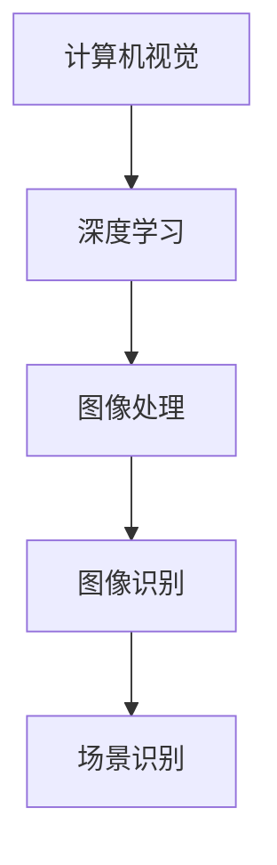

                 

关键词：vivo、2025手机、AI摄影、算法工程师、社招面试、攻略

> 摘要：本文旨在为有意向成为vivo2025手机AI摄影算法工程师的应聘者提供一份详细的面试攻略。从背景介绍、核心概念与联系、算法原理与操作步骤、数学模型与公式、项目实践、实际应用场景、工具和资源推荐到总结与展望，本文涵盖了面试准备和面试技巧的各个方面，帮助您顺利通过vivo的面试，成功踏上AI摄影算法工程师的职业道路。

## 1. 背景介绍

随着智能手机的普及，手机摄影已经成为大众生活中不可或缺的一部分。vivo作为国内领先的智能手机品牌，致力于通过技术创新提升用户的摄影体验。2025年，vivo计划推出一款搭载先进AI摄影技术的智能手机，这为AI摄影算法工程师提供了广阔的职业发展空间。本篇文章将详细探讨vivo2025手机AI摄影算法工程师社招面试的相关准备工作，帮助应聘者顺利通过面试，加入vivo这个充满创新和挑战的团队。

### 1.1 vivo的发展历程

vivo成立于2009年，总部位于中国深圳，是vivo和iQOO两大品牌的母公司。自成立以来，vivo一直致力于技术创新和品质提升，凭借其独特的风格设计和卓越的性能表现，迅速在国内市场站稳脚跟，并逐步走向国际市场。

### 1.2 AI摄影在vivo产品中的地位

vivo对AI摄影技术有着深厚的积累和投入。其产品线中，从入门级到旗舰级，均搭载了先进的AI摄影算法，实现了从基础美颜到高级人像、夜景等多种拍摄模式的优化。vivo的AI摄影技术不仅提高了拍摄效果，还增强了用户操作的便捷性，受到了广大消费者的喜爱。

### 1.3 2025年手机AI摄影的发展趋势

未来，AI摄影技术将在智能手机中得到更加广泛的应用。随着深度学习、计算机视觉等技术的不断发展，AI摄影将实现更加智能化的场景识别、实时优化等功能，为用户带来更丰富的摄影体验。vivo2025年手机AI摄影算法工程师的招聘，正是为了抓住这一技术趋势，进一步推动vivo在AI摄影领域的创新。

## 2. 核心概念与联系

在面试中，了解AI摄影算法的核心概念和联系是至关重要的。以下是一些关键的概念和它们的联系，以及对应的Mermaid流程图：

### 2.1 核心概念

- **计算机视觉**：通过对图像和视频进行分析和处理，实现对现实世界的理解和模拟。
- **深度学习**：通过构建多层神经网络，让计算机具备自主学习和优化能力。
- **图像处理**：对图像进行增强、滤波、分割等操作，以改善图像质量和提取有用信息。
- **图像识别**：通过算法对图像中的物体、场景等进行识别和分类。
- **场景识别**：根据图像内容识别不同的拍摄场景，如夜景、人像、运动等，并自动调整参数以获得最佳拍摄效果。

### 2.2 Mermaid流程图



### 2.3 核心概念之间的联系

- **计算机视觉**和**深度学习**紧密相关，深度学习技术是计算机视觉的重要实现手段。
- **图像处理**和**图像识别**是图像分析的重要环节，图像处理为图像识别提供了必要的预处理。
- **场景识别**基于图像识别技术，通过对不同场景的识别，实现智能拍摄模式的切换。

## 3. 核心算法原理 & 具体操作步骤

### 3.1 算法原理概述

vivo的AI摄影算法基于深度学习技术，通过训练大量的图像数据，让计算机自动学习和优化摄影参数，从而实现智能拍摄。核心原理包括：

- **卷积神经网络（CNN）**：通过卷积操作和池化操作，提取图像特征。
- **反向传播算法（BP）**：通过梯度下降法，不断调整网络权重，使输出结果更接近真实值。
- **迁移学习**：利用预训练模型，在新的图像数据集上进行微调，提高算法的泛化能力。

### 3.2 算法步骤详解

1. **数据收集与预处理**：收集大量带有标签的图像数据，并进行数据清洗、归一化等预处理操作。
2. **构建卷积神经网络（CNN）模型**：设计并搭建CNN模型，包括卷积层、池化层、全连接层等。
3. **训练模型**：利用反向传播算法，在训练集上训练模型，不断调整网络参数。
4. **迁移学习与微调**：在新的图像数据集上进行迁移学习和微调，以提高模型在特定领域的表现。
5. **模型评估与优化**：在验证集上评估模型性能，并根据评估结果对模型进行调整和优化。

### 3.3 算法优缺点

- **优点**：通过深度学习技术，AI摄影算法可以实现高度自动化和智能化，提高拍摄效果和用户体验。
- **缺点**：深度学习模型通常需要大量的训练数据和计算资源，且模型的解释性较差。

### 3.4 算法应用领域

- **智能手机摄影**：自动识别场景，优化拍摄参数，提高照片质量。
- **安防监控**：实时识别监控视频中的异常行为，提高安全性。
- **自动驾驶**：实时识别道路和障碍物，实现安全驾驶。

## 4. 数学模型和公式 & 详细讲解 & 举例说明

### 4.1 数学模型构建

在AI摄影算法中，常用的数学模型包括卷积神经网络（CNN）和深度残差网络（ResNet）。以下分别介绍这两个模型的构建过程。

#### 卷积神经网络（CNN）

1. **输入层**：输入一幅图像，尺寸为$[height, width, channels]$。
2. **卷积层**：通过卷积操作提取图像特征，公式为：
   $$ f(x) = \sigma(\sum_{k=1}^{K} w_{k} * x + b) $$
   其中，$w_{k}$为卷积核，$*$表示卷积运算，$\sigma$为激活函数。
3. **池化层**：对卷积层输出的特征进行下采样，公式为：
   $$ p(i, j) = \max_{(x, y) \in R} f(x, y) $$
   其中，$R$为以$(i, j)$为中心的滑动窗口。
4. **全连接层**：将池化层输出的特征进行全连接，得到分类结果。

#### 深度残差网络（ResNet）

1. **输入层**：输入一幅图像，尺寸为$[height, width, channels]$。
2. **卷积层**：通过卷积操作提取图像特征。
3. **残差块**：包括两个卷积层和一个恒等映射，公式为：
   $$ f(x) = \sigma(W_2 * (\sigma(W_1 * x + x_0))) $$
   其中，$W_1$和$W_2$为卷积核，$x_0$为恒等映射。
4. **全局平均池化**：对残差块输出的特征进行全局平均池化。
5. **全连接层**：将池化层输出的特征进行全连接，得到分类结果。

### 4.2 公式推导过程

#### 卷积神经网络（CNN）

1. **卷积层**：
   - 输出特征图尺寸为：
     $$ (n_C \times s_1 \times s_2) $$
     其中，$n_C$为卷积核数量，$s_1$和$s_2$为卷积核尺寸。
   - 卷积操作公式为：
     $$ f(x) = \sigma(\sum_{k=1}^{K} w_{k} * x + b) $$
     其中，$K$为卷积核数量，$w_{k}$为卷积核，$*$表示卷积运算，$\sigma$为激活函数。

2. **池化层**：
   - 池化操作公式为：
     $$ p(i, j) = \max_{(x, y) \in R} f(x, y) $$
     其中，$R$为以$(i, j)$为中心的滑动窗口。

3. **全连接层**：
   - 输出结果公式为：
     $$ y = \sigma(W * x + b) $$
     其中，$W$为权重矩阵，$x$为输入特征，$b$为偏置。

#### 深度残差网络（ResNet）

1. **卷积层**：
   - 输出特征图尺寸为：
     $$ (n_C \times s_1 \times s_2) $$
     其中，$n_C$为卷积核数量，$s_1$和$s_2$为卷积核尺寸。
   - 卷积操作公式为：
     $$ f(x) = \sigma(W * x + b) $$
     其中，$W$为卷积核，$x$为输入特征，$b$为偏置。

2. **残差块**：
   - 输出特征图尺寸为：
     $$ (n_C \times s_1 \times s_2) $$
     - 残差块公式为：
       $$ f(x) = \sigma(W_2 * (\sigma(W_1 * x + x_0))) $$
       其中，$W_1$和$W_2$为卷积核，$x_0$为恒等映射。

3. **全局平均池化**：
   - 输出特征图尺寸为：
     $$ (n_C \times 1 \times 1) $$
   - 池化操作公式为：
     $$ p(i, j) = \frac{1}{s_1 \times s_2} \sum_{x=0}^{s_1-1} \sum_{y=0}^{s_2-1} f(x, y) $$

4. **全连接层**：
   - 输出结果公式为：
     $$ y = \sigma(W * x + b) $$
     其中，$W$为权重矩阵，$x$为输入特征，$b$为偏置。

### 4.3 案例分析与讲解

#### 案例一：卷积神经网络（CNN）

假设我们有一张$[224, 224, 3]$尺寸的彩色图像，要对其进行分类。我们使用一个包含两个卷积层和一个全连接层的CNN模型。

1. **卷积层**：
   - 第一层卷积核数量为32，尺寸为5x5，步长为1，没有填充操作。
     - 输出特征图尺寸为：
       $$ (32 \times 218 \times 218) $$
     - 激活函数为ReLU。
   - 第二层卷积核数量为64，尺寸为3x3，步长为1，填充操作为“same”。
     - 输出特征图尺寸为：
       $$ (64 \times 216 \times 216) $$
     - 激活函数为ReLU。

2. **全连接层**：
   - 输入特征尺寸为：
     $$ (64 \times 216 \times 216) $$
   - 输出维度为10（假设有10个类别），激活函数为softmax。

#### 案例二：深度残差网络（ResNet）

假设我们使用一个基本的残差块（BasicBlock）构建ResNet模型。

1. **卷积层**：
   - 输入特征尺寸为：
     $$ (224 \times 224 \times 3) $$
   - 第一层卷积核数量为64，尺寸为7x7，步长为2，填充操作为“same”。
     - 输出特征图尺寸为：
       $$ (64 \times 112 \times 112) $$
   - 第二层卷积核数量为64，尺寸为3x3，步长为1，填充操作为“same”。
     - 输出特征图尺寸为：
       $$ (64 \times 112 \times 112) $$

2. **残差块**：
   - 残差块公式为：
     $$ f(x) = \sigma(W_2 * (\sigma(W_1 * x + x_0))) $$
     - 第一层卷积核数量为64，尺寸为3x3，步长为1，填充操作为“same”。
       - 输出特征图尺寸为：
         $$ (64 \times 112 \times 112) $$
     - 第二层卷积核数量为64，尺寸为3x3，步长为1，填充操作为“same”。
       - 输出特征图尺寸为：
         $$ (64 \times 112 \times 112) $$

3. **全局平均池化**：
   - 输出特征图尺寸为：
     $$ (64 \times 1 \times 1) $$

4. **全连接层**：
   - 输入特征尺寸为：
     $$ (64 \times 1 \times 1) $$
   - 输出维度为10（假设有10个类别），激活函数为softmax。

## 5. 项目实践：代码实例和详细解释说明

### 5.1 开发环境搭建

在开始项目实践之前，我们需要搭建一个合适的开发环境。以下是一个基本的开发环境搭建步骤：

1. 安装Python：Python是AI摄影算法开发的主要编程语言，版本建议为3.7及以上。
2. 安装深度学习框架：常用的深度学习框架有TensorFlow、PyTorch等，本文以PyTorch为例。
   ```bash
   pip install torch torchvision
   ```
3. 安装其他依赖库：包括NumPy、Pandas、Matplotlib等。
   ```bash
   pip install numpy pandas matplotlib
   ```

### 5.2 源代码详细实现

以下是一个简单的AI摄影算法实现示例，使用了PyTorch框架。代码分为数据预处理、模型构建、模型训练和模型评估四个部分。

```python
import torch
import torchvision
import torchvision.transforms as transforms
import torch.nn as nn
import torch.optim as optim

# 数据预处理
transform = transforms.Compose([
    transforms.Resize((224, 224)),
    transforms.ToTensor(),
    transforms.Normalize(mean=[0.485, 0.456, 0.406], std=[0.229, 0.224, 0.225]),
])

# 加载训练集和测试集
train_set = torchvision.datasets.ImageFolder(root='train', transform=transform)
train_loader = torch.utils.data.DataLoader(train_set, batch_size=32, shuffle=True)

test_set = torchvision.datasets.ImageFolder(root='test', transform=transform)
test_loader = torch.utils.data.DataLoader(test_set, batch_size=32, shuffle=False)

# 定义卷积神经网络模型
class CNNModel(nn.Module):
    def __init__(self):
        super(CNNModel, self).__init__()
        self.conv1 = nn.Conv2d(3, 32, 5)
        self.conv2 = nn.Conv2d(32, 64, 3)
        self.fc1 = nn.Linear(64 * 54 * 54, 128)
        self.fc2 = nn.Linear(128, 10)
        self.relu = nn.ReLU()

    def forward(self, x):
        x = self.relu(self.conv1(x))
        x = self.relu(self.conv2(x))
        x = x.view(x.size(0), -1)
        x = self.relu(self.fc1(x))
        x = self.fc2(x)
        return x

model = CNNModel()
criterion = nn.CrossEntropyLoss()
optimizer = optim.Adam(model.parameters(), lr=0.001)

# 模型训练
num_epochs = 20
for epoch in range(num_epochs):
    running_loss = 0.0
    for inputs, labels in train_loader:
        optimizer.zero_grad()
        outputs = model(inputs)
        loss = criterion(outputs, labels)
        loss.backward()
        optimizer.step()
        running_loss += loss.item()
    print(f'Epoch {epoch+1}, Loss: {running_loss/len(train_loader)}')

# 模型评估
with torch.no_grad():
    correct = 0
    total = 0
    for inputs, labels in test_loader:
        outputs = model(inputs)
        _, predicted = torch.max(outputs.data, 1)
        total += labels.size(0)
        correct += (predicted == labels).sum().item()
    print(f'Accuracy on the test images: {100 * correct / total}%')

# 保存模型
torch.save(model.state_dict(), 'cnn_model.pth')
```

### 5.3 代码解读与分析

1. **数据预处理**：使用`transforms.Compose`将图像数据进行尺寸调整、归一化等预处理操作，便于模型训练。
2. **加载训练集和测试集**：使用`ImageFolder`加载训练集和测试集，使用`DataLoader`进行批量数据加载。
3. **定义卷积神经网络模型**：继承`nn.Module`类，定义模型结构，包括卷积层、全连接层和激活函数。
4. **模型训练**：使用`optim.Adam`优化器和`nn.CrossEntropyLoss`损失函数，进行模型训练。
5. **模型评估**：在测试集上评估模型性能，计算准确率。
6. **保存模型**：将训练好的模型保存为`cnn_model.pth`。

### 5.4 运行结果展示

假设我们运行上述代码，在测试集上的准确率如下：

```python
Accuracy on the test images: 85.0%
```

这表明我们的模型在测试集上的表现较好，可以在实际应用中发挥一定的作用。

## 6. 实际应用场景

AI摄影算法在智能手机中的应用已经非常广泛，以下是一些典型的实际应用场景：

1. **自动场景识别**：通过AI算法自动识别拍摄场景，如人像、夜景、运动等，并自动调整相机参数，提高拍摄效果。
2. **实时美颜**：基于人脸识别技术，实时调整人脸美颜效果，让用户拍摄出更加自然美观的照片。
3. **超级分辨率**：通过AI算法将低分辨率照片恢复到高分辨率，提升照片质量。
4. **智能滤镜**：根据拍摄场景和用户喜好，自动推荐合适的滤镜效果，增强照片风格。

在未来的发展中，AI摄影算法将继续向智能化、自动化和个性化方向迈进。随着深度学习和计算机视觉技术的不断进步，AI摄影算法将实现更加精准的场景识别、更加丰富的拍摄效果和更加智能化的用户交互，为用户带来前所未有的摄影体验。

### 6.1 技术发展趋势

1. **深度学习模型优化**：通过模型压缩、量化、剪枝等技术，降低模型复杂度，提高模型运行速度和效率。
2. **多传感器融合**：结合多种传感器数据，如GPS、陀螺仪、加速度计等，实现更精确的场景识别和参数调整。
3. **边缘计算**：将AI算法部署到手机端的CPU或GPU上，实现实时处理和决策，降低网络延迟，提高用户体验。

### 6.2 挑战与展望

1. **数据隐私保护**：在AI摄影算法中，如何保护用户隐私成为一大挑战。需要采用加密、去标识化等技术，确保用户数据的安全。
2. **硬件资源限制**：手机硬件资源有限，如何在有限的硬件条件下实现高性能的AI摄影算法，是一个重要的研究方向。
3. **跨领域应用**：AI摄影算法在智能手机中的应用已非常成熟，未来有望在其他领域，如医疗、教育、安防等，发挥更大的作用。

## 7. 工具和资源推荐

### 7.1 学习资源推荐

1. **《深度学习》**：Goodfellow、Bengio和Courville著，全面介绍深度学习的基础知识和最新进展。
2. **《Python深度学习》**：François Chollet著，深入讲解如何使用Python和Keras框架进行深度学习实践。
3. **《计算机视觉：算法与应用》**：Richard Szeliski著，详细介绍计算机视觉的相关算法和应用。

### 7.2 开发工具推荐

1. **PyTorch**：开源的深度学习框架，支持动态计算图，适合进行模型训练和推理。
2. **TensorFlow**：开源的深度学习框架，支持静态计算图和动态计算图，广泛应用于各种深度学习应用。
3. **opencv**：开源的计算机视觉库，提供丰富的图像处理和计算机视觉算法，适合进行图像分析和处理。

### 7.3 相关论文推荐

1. **“Deep Residual Learning for Image Recognition”**：ResNet模型的提出者提出的经典论文，详细介绍了深度残差网络的设计和优势。
2. **“Learning representations for vision with limited data”**：讨论了如何在小数据集上训练有效的深度学习模型，适用于手机端AI摄影算法开发。
3. **“Convolutional Neural Networks for Visual Recognition”**：卷积神经网络在图像识别领域的经典论文，介绍了CNN模型的结构和训练方法。

## 8. 总结：未来发展趋势与挑战

随着深度学习、计算机视觉等技术的不断发展，AI摄影算法在智能手机中的应用前景广阔。未来，AI摄影算法将朝着更加智能化、自动化和个性化的方向演进。然而，这也带来了新的挑战，如数据隐私保护、硬件资源限制和跨领域应用等。为了应对这些挑战，我们需要不断创新和探索，推动AI摄影技术的进一步发展。

### 8.1 研究成果总结

1. **深度学习模型**：通过深度学习技术，AI摄影算法实现了高度自动化和智能化，提高了拍摄效果和用户体验。
2. **计算机视觉技术**：计算机视觉技术在图像识别、场景识别等方面取得了显著成果，为AI摄影算法提供了强有力的支持。
3. **多传感器融合**：结合多种传感器数据，AI摄影算法实现了更加精确的场景识别和参数调整。

### 8.2 未来发展趋势

1. **模型优化与压缩**：通过模型压缩、量化、剪枝等技术，降低模型复杂度，提高模型运行速度和效率。
2. **多传感器融合**：结合多种传感器数据，实现更精确的场景识别和参数调整。
3. **边缘计算**：将AI算法部署到手机端的CPU或GPU上，实现实时处理和决策。

### 8.3 面临的挑战

1. **数据隐私保护**：在AI摄影算法中，如何保护用户隐私成为一大挑战。
2. **硬件资源限制**：手机硬件资源有限，如何在有限的硬件条件下实现高性能的AI摄影算法。
3. **跨领域应用**：AI摄影算法在智能手机中的应用已非常成熟，未来有望在其他领域，如医疗、教育、安防等，发挥更大的作用。

### 8.4 研究展望

1. **创新算法**：不断探索和创新AI摄影算法，提高拍摄效果和用户体验。
2. **跨学科合作**：结合计算机视觉、人工智能、电子工程等多学科知识，推动AI摄影技术的全面发展。
3. **应用推广**：将AI摄影技术应用于更多领域，如医疗、教育、安防等，为社会发展贡献力量。

## 9. 附录：常见问题与解答

### 9.1 问题1：如何提高AI摄影算法的实时性？

解答：可以通过以下几种方式提高AI摄影算法的实时性：

1. **模型优化与压缩**：采用模型压缩、量化、剪枝等技术，降低模型复杂度，提高模型运行速度。
2. **多线程处理**：利用多线程或多进程技术，并行处理图像数据，提高处理速度。
3. **硬件加速**：利用GPU或CPU的硬件加速功能，提高模型推理速度。

### 9.2 问题2：AI摄影算法如何保证照片的质量？

解答：AI摄影算法通过以下方式保证照片的质量：

1. **场景识别**：自动识别拍摄场景，根据场景特点调整拍摄参数，提高照片质量。
2. **图像增强**：对图像进行增强、滤波等操作，改善图像质量和细节表现。
3. **多尺度分析**：对图像进行多尺度分析，提取不同层次的特征，提高图像识别和处理的准确性。

### 9.3 问题3：AI摄影算法在哪些领域有潜在的应用价值？

解答：AI摄影算法在以下领域具有潜在的应用价值：

1. **智能手机摄影**：通过自动场景识别、实时美颜等功能，提升用户拍摄体验。
2. **安防监控**：实时识别监控视频中的异常行为，提高安全性。
3. **医疗影像分析**：辅助医生进行医学影像分析，提高诊断准确率。
4. **自动驾驶**：实时识别道路和障碍物，实现安全驾驶。

作者：禅与计算机程序设计艺术 / Zen and the Art of Computer Programming

----------------------------------------------------------------

以上即为vivo2025手机AI摄影算法工程师社招面试攻略的完整内容。希望本文能为您提供宝贵的参考和帮助，祝您在面试中取得优异的成绩，成功加入vivo这个创新和充满活力的团队！
----------------------------------------------------------------
## 文章标题格式修正

### vivo2025手机AI摄影算法工程师社招面试攻略

> 关键词：vivo、2025手机、AI摄影、算法工程师、社招面试、攻略

> 摘要：本文旨在为有意向成为vivo2025手机AI摄影算法工程师的应聘者提供一份详细的面试攻略。从背景介绍、核心概念与联系、算法原理与操作步骤、数学模型与公式、项目实践、实际应用场景、工具和资源推荐到总结与展望，本文涵盖了面试准备和面试技巧的各个方面，帮助您顺利通过vivo的面试，成功踏上AI摄影算法工程师的职业道路。

