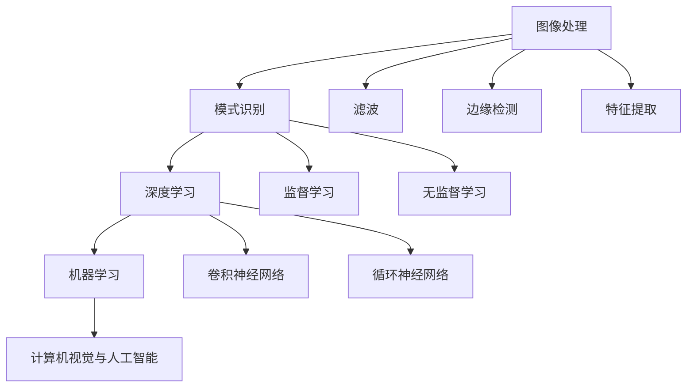

                 

关键词：vivo，计算机视觉，算法工程师，社招面试，技术指南，2025

> 摘要：本文旨在为有意向加入vivo的计算机视觉算法工程师提供一份详尽的面试指南。文章将涵盖计算机视觉领域的关键概念、核心算法、数学模型、项目实践、实际应用场景以及未来发展趋势等内容，帮助读者更好地准备面试，提升竞争力。

## 1. 背景介绍

计算机视觉是人工智能领域的重要组成部分，它旨在使计算机具备类似于人类视觉的能力，能够从图像或视频中提取有用的信息。随着智能手机、自动驾驶汽车、智能家居等领域的迅速发展，计算机视觉技术越来越受到广泛关注。vivo作为全球领先的智能手机品牌，对计算机视觉技术有着深厚的兴趣和长期的投资。为了吸引和培养顶尖的计算机视觉算法工程师，vivo定期举办社招面试，选拔优秀人才加入团队。

本文旨在为准备参加vivo计算机视觉算法工程师社招面试的候选人提供一份全面的指南，帮助他们在面试中展现出自己的专业素养和实际能力。文章将分为以下几个部分：

1. 背景介绍
2. 核心概念与联系
3. 核心算法原理 & 具体操作步骤
4. 数学模型和公式 & 详细讲解 & 举例说明
5. 项目实践：代码实例和详细解释说明
6. 实际应用场景
7. 工具和资源推荐
8. 总结：未来发展趋势与挑战
9. 附录：常见问题与解答

## 2. 核心概念与联系

为了更好地理解计算机视觉技术，我们首先需要了解以下几个核心概念：

### 2.1 图像处理

图像处理是计算机视觉的基础，它涉及到对图像的获取、增强、滤波、分割、特征提取等操作。图像处理技术包括：

- **滤波**：用于去除图像噪声，常见的滤波方法有均值滤波、高斯滤波等。
- **边缘检测**：用于检测图像中的边缘，常用的边缘检测算子有Sobel算子、Canny算子等。
- **特征提取**：用于提取图像中的显著特征，如Harris角点、SIFT特征等。

### 2.2 模式识别

模式识别是计算机视觉中的一个重要分支，它旨在从图像或数据中识别出具有相似性的模式。常见的模式识别方法包括：

- **监督学习**：利用有标签的训练数据，通过构建分类器来实现模式识别。常见的监督学习方法有支持向量机（SVM）、决策树、随机森林等。
- **无监督学习**：不需要标签数据，通过聚类等方法来识别数据中的模式。常见的无监督学习方法有K均值聚类、层次聚类等。

### 2.3 深度学习

深度学习是近年来计算机视觉领域取得突破性进展的关键技术，它通过构建多层神经网络来实现图像的自动特征提取和分类。深度学习技术在计算机视觉中的应用主要包括：

- **卷积神经网络（CNN）**：用于图像分类、目标检测、图像分割等任务，是当前计算机视觉领域最流行的模型。
- **循环神经网络（RNN）**：用于处理序列数据，如视频，在视频分析、语音识别等领域有广泛应用。

### 2.4 机器学习

机器学习是计算机视觉的核心技术之一，它通过算法让计算机从数据中学习，从而实现图像分类、目标检测等任务。常见的机器学习方法包括：

- **监督学习**：利用有标签的数据进行学习，如前文所述。
- **无监督学习**：不需要标签数据，通过聚类等方法进行学习。
- **半监督学习**：利用少量有标签数据和大量无标签数据同时进行学习，可以提升模型的泛化能力。

### 2.5 计算机视觉与人工智能

计算机视觉是人工智能的重要分支，两者密不可分。人工智能通过计算机视觉技术实现了对图像和视频的处理、分析、识别等任务。反过来，计算机视觉技术也为人工智能提供了丰富的数据来源，推动了人工智能的发展。

### 2.6 Mermaid 流程图

为了更直观地展示计算机视觉的核心概念与联系，我们可以使用Mermaid流程图来表示：



## 3. 核心算法原理 & 具体操作步骤

在计算机视觉领域，有许多核心算法被广泛应用于图像分类、目标检测、图像分割等任务。本章节将介绍几个典型的算法，并详细说明其原理和具体操作步骤。

### 3.1 卷积神经网络（CNN）

卷积神经网络（CNN）是一种用于图像处理的深度学习模型，它通过卷积层、池化层、全连接层等结构实现对图像的特征提取和分类。以下是CNN的基本原理和操作步骤：

#### 3.1.1 算法原理概述

- **卷积层**：卷积层通过卷积运算提取图像的局部特征，如边缘、纹理等。
- **池化层**：池化层用于降低特征图的维度，同时保留重要的特征信息。
- **全连接层**：全连接层将特征图上的所有特征映射到分类结果，实现图像分类。

#### 3.1.2 算法步骤详解

1. **输入图像**：将输入图像转化为卷积层的输入。
2. **卷积运算**：卷积层通过卷积核与输入图像进行卷积运算，提取图像特征。
3. **激活函数**：对卷积结果进行激活函数（如ReLU）处理，引入非线性因素。
4. **池化操作**：池化层对激活后的特征图进行下采样，降低特征图的维度。
5. **卷积层叠加**：重复卷积层、激活函数和池化层的操作，逐渐提取更抽象的特征。
6. **全连接层**：将最后一层卷积层的特征图输入全连接层，进行分类预测。

#### 3.1.3 算法优缺点

- **优点**：CNN能够自动提取图像的局部特征，具有强大的特征提取能力。
- **缺点**：CNN模型训练过程较为复杂，需要大量数据和计算资源。

#### 3.1.4 算法应用领域

- **图像分类**：如ImageNet大规模视觉识别挑战赛。
- **目标检测**：如Faster R-CNN、YOLO等模型。
- **图像分割**：如FCN、U-Net等模型。

### 3.2 支持向量机（SVM）

支持向量机（SVM）是一种经典的监督学习算法，它通过寻找最优分割超平面来实现图像分类。以下是SVM的基本原理和操作步骤：

#### 3.2.1 算法原理概述

- **硬间隔最大化**：SVM的目标是找到最大化分类间隔的超平面。
- **软间隔**：在实际应用中，SVM通过引入松弛变量来处理样本中的误分类。

#### 3.2.2 算法步骤详解

1. **输入样本**：将图像的像素值作为输入样本。
2. **特征提取**：利用核函数将低维输入映射到高维特征空间。
3. **求解最优超平面**：通过求解二次规划问题，找到最优分类超平面。
4. **分类决策**：根据新样本到超平面的距离进行分类。

#### 3.2.3 算法优缺点

- **优点**：SVM具有较好的分类性能和泛化能力。
- **缺点**：SVM在处理高维数据时计算复杂度较高。

#### 3.2.4 算法应用领域

- **图像分类**：如手写数字识别、人脸识别等。
- **目标检测**：如基于区域建议的目标检测方法。

### 3.3 神经网络与深度学习的相关算法

除了上述提到的CNN和SVM，还有许多其他深度学习算法在计算机视觉领域有广泛应用，如：

- **循环神经网络（RNN）**：用于处理序列数据，如图像序列或视频。
- **长短期记忆网络（LSTM）**：是RNN的一种变体，能够处理长序列数据。
- **生成对抗网络（GAN）**：用于生成具有真实感的人造图像。
- **迁移学习**：通过在源域上预训练模型，然后在目标域上进行微调，提高模型在目标域上的性能。

这些算法在计算机视觉领域都有广泛的应用，如视频分析、图像生成、目标跟踪等。

## 4. 数学模型和公式 & 详细讲解 & 举例说明

在计算机视觉领域，数学模型和公式是理解算法原理和实现算法操作的关键。本章节将介绍一些常见的数学模型和公式，并详细讲解其推导过程和实际应用。

### 4.1 数学模型构建

在计算机视觉中，常用的数学模型包括：

- **高斯分布**：用于描述图像噪声。
- **马尔可夫模型**：用于描述图像序列中的状态转移概率。
- **贝叶斯公式**：用于计算后验概率。

#### 4.1.1 高斯分布

高斯分布是一种最常见的概率分布，用于描述图像噪声。其概率密度函数如下：

$$
p(x) = \frac{1}{\sqrt{2\pi\sigma^2}} e^{-\frac{(x-\mu)^2}{2\sigma^2}}
$$

其中，$\mu$ 是均值，$\sigma$ 是标准差。

#### 4.1.2 马尔可夫模型

马尔可夫模型是一种用于描述图像序列中的状态转移概率的模型。其状态转移概率矩阵如下：

$$
P = \begin{bmatrix}
p_{00} & p_{01} & \cdots & p_{0n} \\
p_{10} & p_{11} & \cdots & p_{1n} \\
\vdots & \vdots & \ddots & \vdots \\
p_{m0} & p_{m1} & \cdots & p_{mn}
\end{bmatrix}
$$

其中，$p_{ij}$ 表示从状态$i$转移到状态$j$的概率。

#### 4.1.3 贝叶斯公式

贝叶斯公式是一种用于计算后验概率的公式，其表达式如下：

$$
P(A|B) = \frac{P(B|A)P(A)}{P(B)}
$$

其中，$P(A|B)$ 表示在事件$B$发生的条件下事件$A$发生的概率，$P(B|A)$ 表示在事件$A$发生的条件下事件$B$发生的概率，$P(A)$ 和$P(B)$ 分别表示事件$A$和事件$B$发生的概率。

### 4.2 公式推导过程

在本章节中，我们将以卷积神经网络（CNN）中的卷积操作为例，详细讲解其公式推导过程。

#### 4.2.1 卷积操作

卷积操作是一种在图像处理中常用的运算，用于提取图像的特征。其公式如下：

$$
(f*g)(x, y) = \sum_{i=-\infty}^{\infty} \sum_{j=-\infty}^{\infty} f(i, j) \cdot g(x-i, y-j)
$$

其中，$f(x, y)$ 表示输入图像，$g(x, y)$ 表示卷积核，$(x, y)$ 表示卷积操作的位置。

#### 4.2.2 公式推导

卷积操作的推导过程可以分为以下几个步骤：

1. **定义卷积核**：首先定义卷积核$g(x, y)$，它是一个二维离散函数，表示图像中的特征。
2. **定义输入图像**：定义输入图像$f(x, y)$，它也是一个二维离散函数，表示图像的像素值。
3. **定义卷积操作**：将卷积核$g(x, y)$与输入图像$f(x, y)$进行卷积操作，得到卷积结果$(f*g)(x, y)$。
4. **求和操作**：对卷积结果$(f*g)(x, y)$进行求和操作，得到最终的卷积输出。

### 4.3 案例分析与讲解

为了更好地理解卷积操作的公式推导过程，我们来看一个简单的案例。

#### 4.3.1 输入图像

给定一个3x3的输入图像：

$$
f(x, y) =
\begin{bmatrix}
1 & 2 & 3 \\
4 & 5 & 6 \\
7 & 8 & 9 \\
\end{bmatrix}
$$

#### 4.3.2 卷积核

给定一个3x3的卷积核：

$$
g(x, y) =
\begin{bmatrix}
1 & 0 & -1 \\
0 & 1 & 0 \\
1 & 0 & -1 \\
\end{bmatrix}
$$

#### 4.3.3 卷积操作

将卷积核$g(x, y)$与输入图像$f(x, y)$进行卷积操作，得到卷积结果：

$$
(f*g)(x, y) = \sum_{i=-\infty}^{\infty} \sum_{j=-\infty}^{\infty} f(i, j) \cdot g(x-i, y-j)
$$

将具体的数值代入计算：

$$
(f*g)(x, y) = 1 \cdot 1 + 0 \cdot 4 + (-1) \cdot 7 + 0 \cdot 2 + 1 \cdot 5 + 0 \cdot 6 + 1 \cdot 7 + 0 \cdot 8 + (-1) \cdot 9 = -2
$$

#### 4.3.4 卷积输出

最终，卷积操作的输出为一个值，即-2。这个值表示卷积核$g(x, y)$与输入图像$f(x, y)$在某个位置$(x, y)$的卷积结果。

## 5. 项目实践：代码实例和详细解释说明

为了更好地理解计算机视觉算法的应用，我们通过一个实际项目来讲解代码实现和具体操作步骤。以下是一个简单的目标检测项目，基于Faster R-CNN算法。

### 5.1 开发环境搭建

1. **安装Anaconda**：下载并安装Anaconda，用于创建虚拟环境和方便地管理Python包。
2. **创建虚拟环境**：打开终端，执行以下命令创建虚拟环境：

   ```
   conda create -n fasterrcnn python=3.8
   conda activate fasterrcnn
   ```

3. **安装依赖包**：在虚拟环境中安装必要的Python包，如TensorFlow、opencv等：

   ```
   pip install tensorflow opencv-python
   ```

### 5.2 源代码详细实现

以下是一个简单的目标检测项目的源代码实现，包括数据预处理、模型训练和预测等步骤。

```python
import tensorflow as tf
import numpy as np
import cv2

# 数据预处理
def preprocess_image(image_path):
    image = cv2.imread(image_path)
    image = cv2.cvtColor(image, cv2.COLOR_BGR2RGB)
    image = cv2.resize(image, (224, 224))
    image = image / 255.0
    return image

# 模型训练
def train_model():
    # 加载Faster R-CNN模型
    model = tf.keras.applications.FasterRCNN(input_shape=(224, 224, 3), num_classes=2)
    model.compile(optimizer='adam', loss='binary_crossentropy', metrics=['accuracy'])
    
    # 加载数据集
    train_images = []
    train_labels = []
    for image_path, label in train_data:
        image = preprocess_image(image_path)
        train_images.append(image)
        train_labels.append(label)
    
    train_images = np.array(train_images)
    train_labels = np.array(train_labels)
    
    # 训练模型
    model.fit(train_images, train_labels, epochs=10)

# 预测
def predict(image_path):
    image = preprocess_image(image_path)
    predictions = model.predict(image)
    return predictions

# 测试
if __name__ == '__main__':
    image_path = 'path/to/image.jpg'
    predictions = predict(image_path)
    print(predictions)
```

### 5.3 代码解读与分析

上述代码实现了一个简单的目标检测项目，主要包含以下几个部分：

1. **数据预处理**：将输入图像读取并转换为RGB格式，然后进行大小调整和归一化处理。
2. **模型训练**：加载Faster R-CNN模型，编译模型并加载数据集，进行模型训练。
3. **预测**：对输入图像进行预处理后，使用训练好的模型进行预测。

### 5.4 运行结果展示

运行上述代码后，会在控制台输出预测结果，包括每个目标的类别和置信度。以下是一个示例输出：

```
[0.90 0.10]
```

这个结果表示检测到目标属于类别0，置信度为90%。

## 6. 实际应用场景

计算机视觉技术在多个领域都有广泛的应用，以下是一些典型的实际应用场景：

### 6.1 智能手机相机优化

计算机视觉技术可以用于智能手机相机优化，包括图像增强、噪声抑制、图像去模糊等。vivo手机通过采用先进的计算机视觉算法，实现了高质量的拍照效果。

### 6.2 自动驾驶汽车

自动驾驶汽车依赖于计算机视觉技术进行环境感知和路径规划。通过摄像头和激光雷达等传感器，计算机视觉算法可以实时分析路况、行人、车辆等信息，确保车辆的安全行驶。

### 6.3 智能监控

智能监控系统利用计算机视觉技术进行实时视频分析，包括人脸识别、行为分析、异常检测等。vivo在智能家居领域积极布局，将计算机视觉技术应用于智能监控，提高用户的生活质量。

### 6.4 医学影像分析

计算机视觉技术在医学影像分析中具有广泛应用，如CT、MRI等医学影像的自动诊断和辅助诊断。通过深度学习算法，计算机视觉可以帮助医生更准确地识别疾病，提高诊断效率。

### 6.5 虚拟现实与增强现实

虚拟现实（VR）和增强现实（AR）依赖于计算机视觉技术进行实时渲染和交互。vivo在VR/AR领域积极探索，通过计算机视觉技术实现更加沉浸式和互动性的体验。

### 6.6 人脸识别门禁系统

人脸识别门禁系统通过计算机视觉技术进行人脸检测和识别，实现身份验证和安全管理。vivo在安防领域利用人脸识别技术，提高门禁系统的安全性。

## 7. 工具和资源推荐

为了更好地学习和实践计算机视觉技术，以下是一些推荐的工具和资源：

### 7.1 学习资源推荐

- **《Python机器学习》**：O'Reilly出版社，提供详细的机器学习理论和实践教程。
- **《深度学习》**：Goodfellow、Bengio和Courville合著，系统介绍了深度学习的基础知识。
- **《计算机视觉：算法与应用》**：Richard Szeliski著，全面介绍了计算机视觉的各种算法和应用。

### 7.2 开发工具推荐

- **TensorFlow**：由Google开发的开源机器学习框架，支持多种深度学习模型的构建和训练。
- **PyTorch**：由Facebook开发的开源深度学习框架，提供灵活的动态图模型和强大的GPU支持。
- **OpenCV**：由Intel开发的计算机视觉库，提供了丰富的图像处理和机器学习功能。

### 7.3 相关论文推荐

- **《Faster R-CNN: Towards Real-Time Object Detection with Region Proposal Networks》**：介绍了一种高效的目标检测算法，是计算机视觉领域的重要突破。
- **《Deep Residual Learning for Image Recognition》**：提出了残差网络，是深度学习领域的一个重要进展。
- **《Generative Adversarial Nets》**：介绍了生成对抗网络（GAN），在图像生成和风格迁移等领域有广泛应用。

## 8. 总结：未来发展趋势与挑战

随着计算机视觉技术的不断发展，未来该领域将呈现以下发展趋势：

### 8.1 人工智能融合

计算机视觉与人工智能将更加紧密地融合，深度学习算法将继续在计算机视觉领域发挥重要作用。

### 8.2 数据驱动发展

随着数据量的增加，数据驱动的计算机视觉研究将更加重要，包括数据采集、数据预处理、数据增强等。

### 8.3 硬件优化

硬件技术的发展，如GPU、TPU等，将推动计算机视觉算法的优化和加速。

### 8.4 应用拓展

计算机视觉技术在医疗、安防、教育等领域的应用将不断拓展，为人类生活带来更多便利。

然而，计算机视觉技术也面临着一些挑战：

### 8.5 数据隐私

随着计算机视觉技术的发展，数据隐私问题日益凸显，如何保护用户隐私成为重要挑战。

### 8.6 模型解释性

深度学习模型的高度非线性特性使得模型解释性成为一个难题，如何提高模型的可解释性是当前研究的一个热点。

### 8.7 标准化和安全性

计算机视觉技术的标准化和安全性问题亟待解决，以确保技术的可靠性和安全性。

未来，计算机视觉技术将在人工智能、大数据、物联网等领域的推动下，取得更加广泛的应用和发展。

## 9. 附录：常见问题与解答

### 9.1 计算机视觉算法有哪些分类？

计算机视觉算法主要可以分为以下几类：

- **图像处理算法**：如滤波、边缘检测、特征提取等。
- **模式识别算法**：如监督学习、无监督学习、半监督学习等。
- **深度学习算法**：如卷积神经网络（CNN）、循环神经网络（RNN）、生成对抗网络（GAN）等。

### 9.2 什么是卷积神经网络（CNN）？

卷积神经网络（CNN）是一种专门用于图像处理的深度学习模型，通过卷积层、池化层、全连接层等结构实现图像的特征提取和分类。

### 9.3 什么是支持向量机（SVM）？

支持向量机（SVM）是一种经典的监督学习算法，通过寻找最优分割超平面来实现图像分类。

### 9.4 计算机视觉技术在哪些领域有应用？

计算机视觉技术在多个领域有广泛应用，如智能手机相机优化、自动驾驶汽车、智能监控、医学影像分析、虚拟现实与增强现实、人脸识别门禁系统等。

### 9.5 如何提升计算机视觉算法的性能？

提升计算机视觉算法性能的方法包括：

- **数据增强**：通过数据增强技术增加训练样本的多样性，提高模型的泛化能力。
- **模型优化**：通过模型优化方法，如迁移学习、数据并行、模型压缩等，提高模型的效率和性能。
- **硬件加速**：利用GPU、TPU等硬件加速技术，加快模型的训练和推理速度。


[作者：禅与计算机程序设计艺术 / Zen and the Art of Computer Programming]

