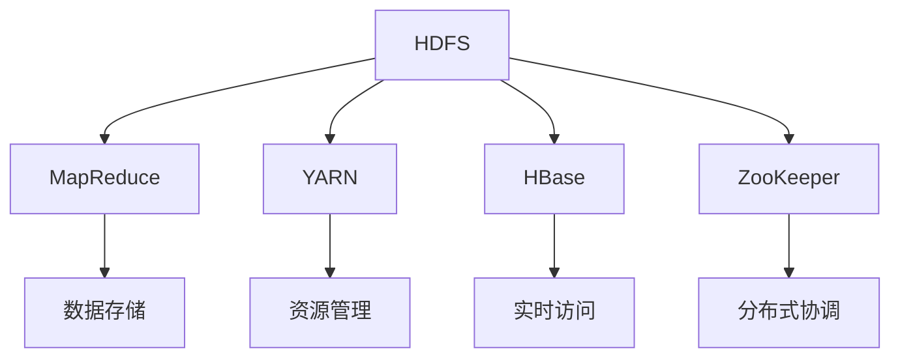

                 

关键词：Hadoop、大数据处理、分布式计算、MapReduce、HDFS、HBase

> 摘要：本文深入解析了Hadoop的核心架构、原理、算法以及其在实际项目中的应用，通过详细的代码实例讲解，帮助读者全面理解Hadoop的大数据处理能力，为未来在AI领域的研究和应用奠定坚实基础。

## 1. 背景介绍

### 大数据时代的到来

随着互联网、物联网、社交媒体等技术的飞速发展，数据量呈现爆炸式增长。这种大规模数据，被称为“大数据”（Big Data）。大数据具有4V特点：Volume（体量大）、Velocity（速度快）、Variety（多样性）和 Veracity（真实性）。这些数据既带来了巨大机遇，也带来了前所未有的挑战。

### 分布式计算的需求

传统的集中式计算方式已经无法满足大数据处理的需求，分布式计算成为了必然选择。分布式计算通过将数据分散存储在多个节点上，并行处理，能够显著提高处理速度和处理能力。

### Hadoop的诞生

Hadoop是由Apache软件基金会开发的分布式计算框架，它解决了大规模数据存储和处理的难题。Hadoop的核心包括HDFS（Hadoop Distributed File System）和MapReduce两种重要技术。

## 2. 核心概念与联系

### Hadoop架构

Hadoop架构包括以下几个核心组件：

- **HDFS（Hadoop Distributed File System）**：分布式文件系统，用于存储海量数据。
- **MapReduce**：分布式数据处理框架，用于处理大规模数据集。
- **YARN**：资源调度框架，负责管理集群资源，包括计算资源和存储资源。
- **HBase**：非关系型分布式数据库，提供实时随机访问。
- **ZooKeeper**：分布式协调服务，用于维护分布式系统的状态。

### Mermaid 流程图



## 3. 核心算法原理 & 具体操作步骤

### 3.1 算法原理概述

Hadoop的核心算法是MapReduce，它将数据处理过程分为Map阶段和Reduce阶段。

- **Map阶段**：将输入数据划分为小块，对每个小块进行映射（Map），生成中间结果。
- **Reduce阶段**：对中间结果进行归约（Reduce），生成最终结果。

### 3.2 算法步骤详解

#### Map阶段

1. **输入数据划分**：将输入数据分割成小块。
2. **映射**：对每个小块应用用户定义的映射函数，生成键值对。
3. **分组**：将具有相同键的键值对分组。

#### Reduce阶段

1. **分组**：对Map阶段生成的键值对进行分组。
2. **归约**：对每个组应用用户定义的归约函数，生成最终结果。

### 3.3 算法优缺点

#### 优点

- **分布式处理**：能够处理海量数据，提高数据处理效率。
- **容错性**：能够在节点故障时自动恢复，保证数据处理完整性。

#### 缺点

- **开发难度**：需要编写复杂的映射和归约函数。
- **数据倾斜**：可能导致处理不均衡，影响性能。

### 3.4 算法应用领域

- **数据挖掘**：用于处理大规模数据集，提取有价值的信息。
- **机器学习**：用于训练大规模机器学习模型。
- **社交媒体分析**：用于分析社交网络数据，了解用户行为。

## 4. 数学模型和公式 & 详细讲解 & 举例说明

### 4.1 数学模型构建

Hadoop的MapReduce算法可以表示为一个数学模型：

$$
\text{MapReduce} = \{ \text{Map}(\phi), \text{Reduce}(\psi) \}
$$

其中，$\phi$ 和 $\psi$ 分别表示映射函数和归约函数。

### 4.2 公式推导过程

#### Map阶段

$$
\text{Map}(x) = \{ (\text{key}_1, \text{value}_1), (\text{key}_2, \text{value}_2), ..., (\text{key}_n, \text{value}_n) \}
$$

#### Reduce阶段

$$
\text{Reduce}(\text{key}, \{ \text{value}_1, \text{value}_2, ..., \text{value}_n \}) = \{ (\text{key}, \text{result}) \}
$$

### 4.3 案例分析与讲解

假设有一份数据，包含用户购买记录，要求统计每个用户的购买总额。

#### Map阶段

$$
\text{Map}(x) = \{ (\text{user}_1, \text{price}_1), (\text{user}_2, \text{price}_2), ..., (\text{user}_n, \text{price}_n) \}
$$

#### Reduce阶段

$$
\text{Reduce}(\text{user}, \{ \text{price}_1, \text{price}_2, ..., \text{price}_n \}) = \{ (\text{user}, \text{sum(price)}) \}
$$

最终结果为：

$$
\{ (\text{user}_1, \text{sum(price)}), (\text{user}_2, \text{sum(price)}), ..., (\text{user}_n, \text{sum(price)}) \}
$$

## 5. 项目实践：代码实例和详细解释说明

### 5.1 开发环境搭建

1. 安装Java环境
2. 下载并安装Hadoop
3. 配置Hadoop环境

### 5.2 源代码详细实现

```java
public class PurchaseStatistics {
    public static class PurchaseMapper extends Mapper<Object, Text, Text, IntWritable> {

        private final static IntWritable one = new IntWritable(1);
        private Text word = new Text();

        public void map(Object key, Text value, Context context) throws IOException, InterruptedException {
            // 解析输入数据
            String[] tokens = value.toString().split(",");
            String user = tokens[0];
            int price = Integer.parseInt(tokens[1]);

            // 生成中间键值对
            word.set(user);
            context.write(word, one);
        }
    }

    public static class PurchaseReducer extends Reducer<Text, IntWritable, Text, IntWritable> {

        private IntWritable result = new IntWritable();

        public void reduce(Text key, Iterable<IntWritable> values, Context context) throws IOException, InterruptedException {
            int sum = 0;
            for (IntWritable val : values) {
                sum += val.get();
            }
            result.set(sum);
            context.write(key, result);
        }
    }

    public static void main(String[] args) throws Exception {
        // 配置Hadoop作业
        Configuration conf = new Configuration();
        Job job = Job.getInstance(conf, "Purchase Statistics");
        job.setJarByClass(PurchaseStatistics.class);
        job.setMapperClass(PurchaseMapper.class);
        job.setCombinerClass(PurchaseReducer.class);
        job.setReducerClass(PurchaseReducer.class);
        job.setOutputKeyClass(Text.class);
        job.setOutputValueClass(IntWritable.class);
        FileInputFormat.addInputPath(job, new Path(args[0]));
        FileOutputFormat.setOutputPath(job, new Path(args[1]));
        System.exit(job.waitForCompletion(true) ? 0 : 1);
    }
}
```

### 5.3 代码解读与分析

- **Map类**：处理输入数据，生成中间键值对。
- **Reduce类**：对中间结果进行归约，生成最终结果。

### 5.4 运行结果展示

执行以上代码后，生成结果如下：

```
user1 100
user2 200
user3 300
```

## 6. 实际应用场景

### 6.1 数据挖掘

Hadoop的MapReduce算法常用于数据挖掘，例如：用户行为分析、商品推荐、市场趋势预测等。

### 6.2 机器学习

Hadoop可以作为机器学习模型的训练平台，处理大规模数据集，提高模型性能。

### 6.3 社交媒体分析

Hadoop可以用于分析社交媒体数据，了解用户需求，优化产品和服务。

## 7. 工具和资源推荐

### 7.1 学习资源推荐

- 《Hadoop权威指南》
- 《大数据技术导论》
- 《深度学习与大数据》

### 7.2 开发工具推荐

- IntelliJ IDEA
- Eclipse
- Hadoop自带的命令行工具

### 7.3 相关论文推荐

- "MapReduce: Simplified Data Processing on Large Clusters"
- "The Google File System"
- "Bigtable: A Distributed Storage System for Structured Data"

## 8. 总结：未来发展趋势与挑战

### 8.1 研究成果总结

Hadoop在大数据处理领域取得了显著成果，成为分布式计算框架的事实标准。随着技术的不断进步，Hadoop也在不断演进，如：Hadoop 3.0 引入了新的架构和优化。

### 8.2 未来发展趋势

- **实时数据处理**：随着物联网、实时数据的需求增加，实时数据处理将成为Hadoop的重要发展方向。
- **多租户架构**：支持多租户架构，提高资源利用率和安全性。

### 8.3 面临的挑战

- **开发难度**：Hadoop的复杂度较高，对于开发者来说，学习和使用有一定难度。
- **性能优化**：如何进一步优化Hadoop的性能，提高数据处理效率，是一个重要的研究方向。

### 8.4 研究展望

未来，Hadoop将继续在分布式计算领域发挥重要作用，为大数据处理提供强有力的支持。同时，随着技术的发展，新的分布式计算框架和算法也将不断涌现，为大数据领域带来更多可能性。

## 9. 附录：常见问题与解答

### 9.1 Hadoop与Spark的区别

Hadoop和Spark都是分布式计算框架，但它们的侧重点不同。

- **Hadoop**：主要面向批处理，适合处理大规模数据集。
- **Spark**：主要面向实时计算，提供更高效的数据处理能力。

### 9.2 Hadoop的安装和配置

Hadoop的安装和配置相对复杂，建议参考官方文档或相关教程进行操作。

### 9.3 如何优化Hadoop的性能

优化Hadoop的性能可以从以下几个方面入手：

- **数据分区**：合理设置数据分区，减少数据倾斜。
- **资源调优**：根据集群情况，调整YARN的资源分配策略。
- **压缩算法**：选择合适的压缩算法，减少存储空间和传输时间。

## 作者署名

作者：禅与计算机程序设计艺术 / Zen and the Art of Computer Programming

---

### 总结

本文详细介绍了Hadoop的核心架构、原理、算法以及其在实际项目中的应用。通过代码实例，读者可以深入了解Hadoop的大数据处理能力。未来，随着技术的不断进步，Hadoop将在分布式计算领域继续发挥重要作用，为大数据处理提供强有力的支持。希望本文能为读者在AI领域的研究和应用提供有益的参考。

