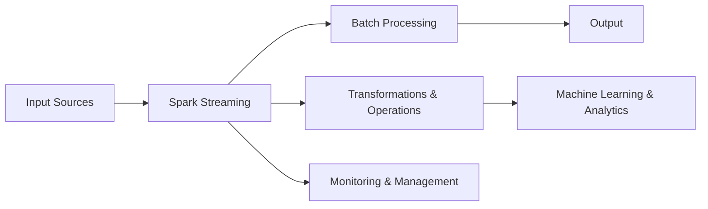

                 

关键词：(Spark Streaming、实时数据处理、流计算、大数据技术、分布式系统、内存管理、机器学习应用)

摘要：本文旨在深入探讨Spark Streaming在实时数据处理和流计算中的应用，通过详细解析其原理、数学模型、算法步骤、代码实例及未来应用场景，帮助读者全面理解Spark Streaming的工作机制及其在AI领域的潜力。

## 1. 背景介绍

随着互联网和物联网的快速发展，数据量呈现爆炸性增长，传统的批处理系统已无法满足实时数据处理的需求。流计算作为一种新兴的计算模型，能够对实时数据流进行快速处理和分析，具有极高的时效性和灵活性。Apache Spark Streaming是Spark生态系统的重要组成部分，提供了高效、可靠的流计算解决方案。本文将围绕Spark Streaming的核心概念、工作原理和具体应用进行探讨。

### 1.1 Spark Streaming简介

Spark Streaming是一个能够在集群上运行实时数据流的计算系统，它基于Spark的核心计算引擎，利用微批处理（micro-batching）的方式实现流计算。Spark Streaming能够对实时的数据流进行高效处理，支持多种数据源，如Kafka、Flume、Kinesis等，同时提供了丰富的数据转换和机器学习算法。

### 1.2 Spark Streaming的优势

- **高吞吐量**：Spark Streaming利用内存计算的优势，大大提高了数据处理的速度和效率。
- **弹性伸缩**：Spark Streaming能够根据数据流量的变化动态调整资源分配，支持横向扩展。
- **兼容性强**：Spark Streaming与Spark的其他组件如Spark SQL、MLlib等无缝集成，便于构建复杂的数据处理和分析应用。
- **易于使用**：Spark Streaming提供了简单易用的API，使得开发者可以轻松实现流数据处理任务。

## 2. 核心概念与联系

在深入探讨Spark Streaming之前，我们需要了解其核心概念和架构设计。以下是一个简化的Spark Streaming架构图，通过Mermaid流程图展示其关键节点和流程。



### 2.1 输入源（Input Sources）

Spark Streaming支持多种数据源，包括Apache Kafka、Flume、Kinesis和自定义源。这些数据源将实时数据传输到Spark Streaming系统中。

### 2.2 微批处理（Batch Processing）

Spark Streaming通过微批处理的方式对数据流进行计算。每个批处理通常包含一段时间的数据，例如，如果配置了2秒的批次间隔，那么每个批次将包含2秒内的所有数据。

### 2.3 转换与操作（Transformations & Operations）

Spark Streaming提供了丰富的转换和操作功能，如map、filter、reduce、join等，用于对数据流进行预处理和分析。

### 2.4 机器学习与分析（Machine Learning & Analytics）

Spark Streaming与MLlib集成，支持实时数据流上的机器学习算法，如分类、聚类、回归等。

### 2.5 监控与管理（Monitoring & Management）

Spark Streaming提供了监控和管理功能，包括资源监控、任务状态追踪、错误报告等，确保系统的稳定运行。

## 3. 核心算法原理 & 具体操作步骤

### 3.1 算法原理概述

Spark Streaming的核心算法原理基于微批处理和内存计算。其基本工作流程如下：

1. **数据采集**：从输入源（如Kafka）读取实时数据。
2. **批次划分**：将读取到的数据划分成固定大小的批次。
3. **批次处理**：对每个批次内的数据进行计算和处理。
4. **结果输出**：将处理结果输出到指定的输出源或存储系统。

### 3.2 算法步骤详解

#### 3.2.1 初始化Spark Streaming上下文

```python
from pyspark import SparkContext
from pyspark.streaming import StreamingContext

sc = SparkContext("local[2]", "NetworkWordCount")
ssc = StreamingContext(sc, 2)  # 设定批次间隔为2秒
```

#### 3.2.2 创建数据流

```python
lines = ssc.socketTextStream("localhost", 9999)
```

#### 3.2.3 数据转换与处理

```python
words = lines.flatMap(lambda line: line.split(" "))
pairs = words.map(lambda word: (word, 1))
word_counts = pairs.reduceByKey(lambda x, y: x + y)
```

#### 3.2.4 输出结果

```python
word_counts.pprint()
```

### 3.3 算法优缺点

#### 优点

- **高效性**：基于内存计算，处理速度极快。
- **弹性伸缩**：支持动态资源分配和横向扩展。
- **易用性**：提供了丰富的API和操作函数。

#### 缺点

- **资源消耗**：由于使用内存计算，对系统资源要求较高。
- **单节点性能受限**：在大规模数据处理时，单节点的性能可能成为瓶颈。

### 3.4 算法应用领域

- **实时数据分析**：用于处理和实时分析大规模数据流。
- **机器学习应用**：支持实时数据流上的机器学习任务。
- **物联网应用**：用于处理物联网设备产生的实时数据。

## 4. 数学模型和公式 & 详细讲解 & 举例说明

### 4.1 数学模型构建

在流计算中，数据的批次处理可以看作是一个动态的加法过程。假设我们有一个数据流{X1, X2, X3, ...}，其中每个数据点X具有特定的属性，如时间戳、标签等。

### 4.2 公式推导过程

设我们有一个固定大小的批次间隔T，那么在每个批次结束时，我们可以计算批次的聚合结果。例如，对于词频统计任务，可以使用以下公式：

$$
Count(word) = \sum_{t \in [T_{start}, T_{end}]} \sum_{word' \in Data(t)} Count(word', t)
$$

其中，$T_{start}$和$T_{end}$分别是批次的时间起点和终点，$Data(t)$是时间t内的数据集合。

### 4.3 案例分析与讲解

假设我们有一个包含用户行为数据的实时数据流，每条数据记录包括用户ID、事件类型和时间戳。我们需要统计每个用户在特定时间段内的事件总数。

1. **数据预处理**：将原始数据转换为键值对形式，其中键为用户ID，值为事件类型和时间戳。
2. **批次聚合**：在每个批次结束时，统计每个用户的事件总数。
3. **结果输出**：将统计结果输出到数据库或存储系统。

使用Spark Streaming实现上述任务：

```python
from pyspark import SparkContext
from pyspark.streaming import StreamingContext

sc = SparkContext("local[2]", "UserEventCount")
ssc = StreamingContext(sc, 2)

user_events = ssc.socketTextStream("localhost", 9999)
user_event_pairs = user_events.map(lambda line: (line.split(",")[0], 1))

user_event_counts = user_event_pairs.reduceByKey(lambda x, y: x + y)

user_event_counts.pprint()
```

## 5. 项目实践：代码实例和详细解释说明

### 5.1 开发环境搭建

1. 安装Java环境。
2. 安装Scala环境（可选，因为Spark Streaming支持Scala和Python两种编程语言）。
3. 下载并安装Spark，配置环境变量。

### 5.2 源代码详细实现

以下是一个简单的Spark Streaming程序，用于统计网络中接收到的文本消息的词频。

```python
from pyspark import SparkContext
from pyspark.streaming import StreamingContext

sc = SparkContext("local[2]", "WordCount")
ssc = StreamingContext(sc, 2)

lines = ssc.socketTextStream("localhost", 9999)

words = lines.flatMap(lambda line: line.split(" "))
pairs = words.map(lambda word: (word, 1))
word_counts = pairs.reduceByKey(lambda x, y: x + y)

word_counts.pprint()

ssc.start()  # 启动流计算任务
ssc.awaitTermination()  # 等待流计算任务结束
```

### 5.3 代码解读与分析

- **SparkContext和StreamingContext的创建**：创建Spark和Spark Streaming的上下文。
- **数据流读取**：使用socketTextStream从本地主机接收文本消息。
- **数据转换**：将接收到的文本消息按空格分隔，形成词列表。
- **聚合操作**：对每个词进行计数，并合并相同词的不同实例。
- **结果输出**：打印每个批次的结果。

### 5.4 运行结果展示

在本地主机上运行以下命令启动WordCount程序：

```shell
python word_count.py
```

同时，在另一个终端中使用nc工具发送文本消息：

```shell
nc localhost 9999
```

输入一些文本消息，如 "Hello World Hello Spark"，然后按Ctrl+C停止发送。程序将实时打印每个批次的结果。

## 6. 实际应用场景

Spark Streaming在实时数据处理和流计算领域有着广泛的应用。以下是一些典型的应用场景：

- **实时日志分析**：用于实时分析服务器日志，监控系统性能和用户行为。
- **股市数据监控**：实时监控股票市场的价格和交易量，为交易决策提供支持。
- **物联网数据处理**：处理物联网设备产生的实时数据，如传感器数据、设备状态等。
- **社交媒体分析**：实时分析社交媒体平台上的数据，如Twitter、Facebook等。

### 6.1 优步实时数据分析

Uber使用Spark Streaming处理实时数据流，包括行程数据、用户位置信息和支付信息。通过实时分析，Uber可以提供更好的用户体验，如实时估算行车时间、优化路线规划等。

### 6.2 网易云音乐实时推荐

网易云音乐利用Spark Streaming分析用户的音乐喜好和播放记录，实时推荐用户可能喜欢的歌曲，提高用户黏性和满意度。

## 7. 工具和资源推荐

### 7.1 学习资源推荐

- **官方文档**：《[Spark Streaming官方文档](https://spark.apache.org/docs/latest/streaming-programming-guide.html)》是学习Spark Streaming的最佳资源。
- **在线课程**：《Spark Streaming实战》（实战课程）。
- **书籍**：《Spark技术内幕》详细讲解了Spark的内部实现和优化技巧。

### 7.2 开发工具推荐

- **IntelliJ IDEA**：支持Scala和Python，提供了丰富的开发插件。
- **Zeppelin**：支持多种数据处理框架，包括Spark Streaming，提供了交互式数据分析平台。

### 7.3 相关论文推荐

- **《Large-scale Incremental Processing Using MapReduce》**：阐述了MapReduce在大规模增量处理中的应用。
- **《Dask: Parallel computing with task scheduling》**：介绍了Dask，一个与Spark类似的开源分布式计算框架。

## 8. 总结：未来发展趋势与挑战

### 8.1 研究成果总结

Spark Streaming作为实时数据处理和流计算的重要工具，已经取得了显著的研究成果。其高效、弹性、易用等特点使其在多个领域得到了广泛应用。未来，Spark Streaming有望进一步优化，包括更高效的内存管理、更灵活的资源调度和更强大的机器学习支持。

### 8.2 未来发展趋势

- **性能优化**：通过改进内存管理、优化算法实现等手段，进一步提高Spark Streaming的性能和吞吐量。
- **跨语言支持**：提供更多编程语言的支持，如Go、R等，以满足不同开发者的需求。
- **云服务集成**：更好地与云服务提供商集成，提供按需扩展和资源优化方案。

### 8.3 面临的挑战

- **资源消耗**：实时数据处理对系统资源的需求较高，需要优化资源利用效率。
- **实时性保障**：在确保实时性的同时，保障数据处理的一致性和准确性。

### 8.4 研究展望

未来，Spark Streaming的研究重点将集中在性能优化、跨语言支持和云服务集成等方面。同时，随着人工智能和大数据技术的快速发展，Spark Streaming在实时数据分析、机器学习应用等领域将发挥更大的作用。

## 9. 附录：常见问题与解答

### 9.1 Spark Streaming与Apache Flink的区别是什么？

Spark Streaming和Apache Flink都是优秀的流计算框架。主要区别在于：

- **数据处理模型**：Spark Streaming基于微批处理，而Flink基于事件驱动。
- **性能**：Flink在低延迟和高吞吐量方面具有优势。
- **生态集成**：Spark Streaming与Spark的其他组件如Spark SQL、MLlib等更紧密集成。

### 9.2 Spark Streaming支持哪些数据源？

Spark Streaming支持多种数据源，包括Apache Kafka、Flume、Kinesis和自定义源。

### 9.3 如何优化Spark Streaming的性能？

可以通过以下方法优化Spark Streaming的性能：

- **调整批次大小**：根据实际需求调整批次大小，以平衡延迟和吞吐量。
- **内存管理**：合理配置内存参数，确保系统有足够的内存进行数据处理。
- **并行度优化**：调整任务并行度，充分利用集群资源。

## 结束语

Spark Streaming作为实时数据处理和流计算的重要工具，具有广泛的应用前景。通过本文的详细解析，我们了解了Spark Streaming的原理、算法、应用场景和优化策略。希望本文能够帮助读者更好地理解Spark Streaming，并在实际项目中充分发挥其潜力。作者：禅与计算机程序设计艺术 / Zen and the Art of Computer Programming。

