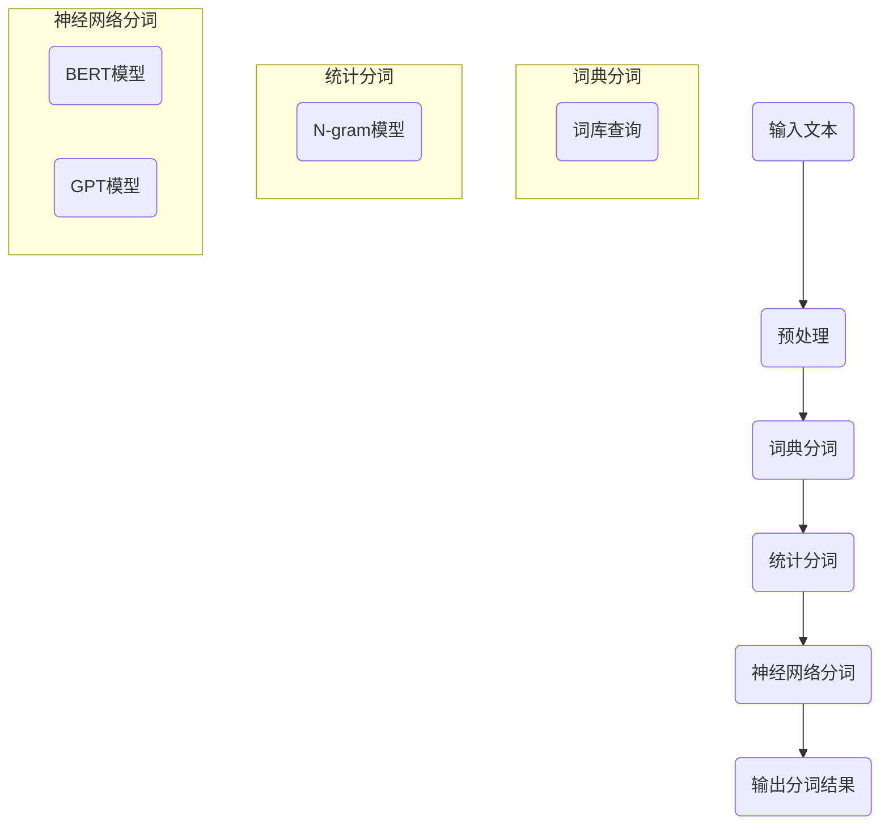

                 

分词是自然语言处理（NLP）中的基本任务之一，它是指将连续的文本序列分割成有意义的词汇单元。在人工智能和大数据处理领域，分词技术的应用范围广泛，包括搜索引擎、机器翻译、文本挖掘、语音识别等多个方面。本文将详细讲解分词技术的基本原理、核心算法、数学模型、项目实践，并探讨其在实际应用中的重要性及其未来发展趋势。

## 关键词

- **自然语言处理（NLP）**
- **分词技术**
- **文本序列分析**
- **机器学习**
- **深度学习**
- **大数据处理**

## 摘要

本文旨在深入探讨AI大数据计算背景下的分词技术。首先，我们将回顾分词技术的背景和重要性，随后详细讲解分词的基本原理和核心算法。接着，本文将介绍分词技术的数学模型和公式，并通过实例说明。之后，我们将通过实际项目实践来展示分词技术的应用，并分析其代码实现和运行效果。文章最后将讨论分词技术的实际应用场景和未来展望。

### 1. 背景介绍

自然语言处理是人工智能的重要分支，其目标是让计算机理解和生成人类语言。在NLP中，文本分词是一个基础且关键的任务。分词的目的在于将文本分割成最小的有意义单位——词，以便后续的语言理解和处理。随着互联网和大数据的迅猛发展，文本数据量呈现爆炸式增长，如何高效、准确地处理这些文本数据成为了一项重要挑战。

传统的分词方法主要包括基于词典的分词和基于统计的方法。基于词典的分词方法依赖于预先构建好的词库，通过对比待分词文本与词库中的词条进行匹配来分割文本。这种方法简单直观，但在面对新的词汇和词库不覆盖的情况时效果不佳。基于统计的方法则通过计算文本中的词语之间的统计规律来进行分词，如基于N-gram模型的分词方法。随着深度学习技术的发展，基于神经网络的分词模型如BERT、GPT等，逐渐成为当前分词技术的主流。

在大数据计算背景下，分词技术的重要性体现在多个方面。首先，准确的分词是文本分析和处理的前提，对于文本挖掘、情感分析、命名实体识别等任务至关重要。其次，分词技术有助于提高文本检索和搜索的效率，优化搜索引擎的性能。此外，分词在语音识别、机器翻译等应用中也发挥着重要作用，通过将连续的语音信号转换成文本，再进行后续的处理。

### 2. 核心概念与联系

分词技术的核心概念包括词库、统计规律、神经网络模型等。为了更好地理解这些概念，我们将通过一个Mermaid流程图来展示分词的流程和各概念之间的联系。



- **词库分词**：基于预先构建的词库进行分词，通过匹配词库中的词条来进行文本分割。
- **统计分词**：利用N-gram模型等统计方法，根据词语在文本中的统计规律进行分词。
- **神经网络分词**：利用深度学习模型，如BERT、GPT等，通过神经网络结构对文本进行分词。

通过以上流程图，我们可以看到分词技术涉及多个核心概念，这些概念相互作用，共同构成了现代分词技术的框架。

### 3. 核心算法原理 & 具体操作步骤

#### 3.1 算法原理概述

分词算法的核心原理是基于输入的文本序列，通过某种方法将连续的字符序列分割成有意义的词。以下将详细介绍几种常用的分词算法原理。

1. **基于词典的分词**：这种方法依赖于一个词库，将输入的文本与词库中的词条进行匹配，从而确定分词结果。其基本步骤如下：
   - 预处理：对输入文本进行标准化处理，如去除标点符号、转换为小写等。
   - 词库查询：遍历输入文本，从左到右，每次尝试匹配词库中的词条，直到找到匹配的词条为止。

2. **基于统计的分词**：这种方法通过分析文本中的词语统计规律来进行分词。N-gram模型是一种常用的统计方法，其基本思想是利用前n个词语的序列来预测下一个词语。分词步骤如下：
   - 预处理：对输入文本进行分词预处理，如去除停用词、词形还原等。
   - N-gram模型训练：通过训练文本数据，构建N-gram语言模型。
   - 分词预测：利用N-gram语言模型，对输入文本进行分词。

3. **基于神经网络的分词**：这种方法利用深度学习模型，如BERT、GPT等，通过大规模的文本数据训练模型，使其能够自动进行分词。其基本步骤如下：
   - 预处理：对输入文本进行预处理，如分词、词向量化等。
   - 模型训练：使用大量的文本数据训练神经网络模型。
   - 分词预测：将输入文本输入到训练好的模型中，得到分词结果。

#### 3.2 算法步骤详解

1. **基于词典的分词步骤**：

   - 步骤1：文本预处理。对输入文本进行标准化处理，如去除标点符号、转换为小写等。
   - 步骤2：初始化词库。加载预先构建好的词库，词库中的词条可以是单个字、词语或短语。
   - 步骤3：分词。从左到右遍历输入文本，每次尝试匹配词库中的词条，直到找到匹配的词条为止，分割出一个个词汇单元。

2. **基于统计的分词步骤**：

   - 步骤1：文本预处理。对输入文本进行预处理，如去除停用词、词形还原等。
   - 步骤2：N-gram模型训练。使用训练文本数据，构建N-gram语言模型。
   - 步骤3：分词预测。对输入文本进行处理，根据N-gram语言模型进行分词，得到分词结果。

3. **基于神经网络的分词步骤**：

   - 步骤1：文本预处理。对输入文本进行预处理，如分词、词向量化等。
   - 步骤2：模型训练。使用大量的文本数据训练神经网络模型，如BERT、GPT等。
   - 步骤3：分词预测。将输入文本输入到训练好的模型中，通过模型输出分词结果。

#### 3.3 算法优缺点

1. **基于词典的分词**：

   - 优点：简单直观，适用于词库已知的场景。
   - 缺点：面对新的词汇和词库不覆盖的情况效果不佳，无法处理未登录词。

2. **基于统计的分词**：

   - 优点：基于文本的统计规律，能够处理未登录词，适应性强。
   - 缺点：依赖统计模型，对文本质量要求较高，可能产生分词错误。

3. **基于神经网络的分词**：

   - 优点：利用深度学习模型，能够自动学习文本中的词义和语法关系，准确度高。
   - 缺点：需要大量训练数据和计算资源，模型复杂度较高。

#### 3.4 算法应用领域

分词算法在多个领域具有广泛的应用：

- **搜索引擎**：通过准确分词，提高搜索效率和结果相关性。
- **机器翻译**：将输入文本分词，再进行翻译，提高翻译准确性。
- **文本挖掘**：对大量文本进行分词，提取关键词和主题，用于数据分析和挖掘。
- **语音识别**：将语音信号转换为文本，再进行后续处理，如对话系统、语音助手等。

### 4. 数学模型和公式 & 详细讲解 & 举例说明

在分词技术中，数学模型和公式起着至关重要的作用。以下将详细讲解分词技术中的数学模型和公式，并通过具体案例进行说明。

#### 4.1 数学模型构建

1. **基于词典的分词模型**：

   基于词典的分词模型通常采用有限状态机（FSM）来表示。一个有限状态机由一组状态、初始状态、终止状态、转移函数和输入输出函数组成。在分词过程中，状态表示当前文本的分割位置，初始状态为文本的开始位置，终止状态为文本的结束位置。转移函数根据当前状态和输入字符，决定下一个状态。输入输出函数则根据状态和输入字符，确定输出结果。

2. **基于统计的分词模型**：

   基于统计的分词模型通常采用N-gram语言模型来表示。N-gram语言模型是一个概率模型，它通过统计文本中连续的N个词语的序列，计算这些词语序列的概率。在分词过程中，N-gram语言模型根据输入的文本序列，计算每个词语序列的概率，并选择概率最大的词语序列作为分词结果。

3. **基于神经网络的分词模型**：

   基于神经网络的分词模型通常采用序列到序列（Seq2Seq）模型。Seq2Seq模型由编码器和解码器组成，编码器将输入序列编码为固定长度的向量，解码器则将编码后的向量解码为输出序列。在分词过程中，编码器将输入的文本序列编码为固定长度的向量，解码器则根据编码后的向量，生成分词结果。

#### 4.2 公式推导过程

1. **基于词典的分词模型**：

   假设词库中有V个词条，当前状态为s，输入字符为x。状态转移函数可以表示为：

   $$ f(s, x) = \begin{cases} 
   s+1 & \text{if } x \in 词库(s) \\
   s & \text{otherwise}
   \end{cases} $$

   其中，词库(s)表示在状态s下，词库中可匹配的词条。

2. **基于统计的分词模型**：

   假设N-gram语言模型中，前N-1个词语为w1, w2, ..., wN-1，当前词语为wN。词语序列的概率可以表示为：

   $$ P(w1, w2, ..., wN) = \frac{N!}{(N-n)!} \cdot p(w1) \cdot p(w2|w1) \cdot ... \cdot p(wN|w1, w2, ..., wN-1) $$

   其中，p(wi)表示词语wi的概率，p(wi|wj)表示在给定前一个词语wj的情况下，词语wi的条件概率。

3. **基于神经网络的分词模型**：

   假设编码器和解码器分别为E和D，输入序列为x，输出序列为y。编码器的输出可以表示为：

   $$ h = E(x) $$

   解码器的输出可以表示为：

   $$ y = D(h) $$

   其中，h为编码后的固定长度向量。

#### 4.3 案例分析与讲解

以下通过一个具体案例，讲解分词技术在实际应用中的运用。

**案例**：给定一段中文文本“我非常喜欢人工智能”，使用基于词典的分词模型进行分词。

**步骤1**：文本预处理

对输入文本进行预处理，去除标点符号和特殊字符，得到“我喜欢人工智能”。

**步骤2**：初始化词库

构建一个包含常用词汇的词库，如“我”，“喜欢”，“人工智能”等。

**步骤3**：分词

从左到右遍历输入文本，依次尝试匹配词库中的词条：

- 当前状态s=0，输入字符x=“我”，匹配词库中的“我”，状态转移为s=1。
- 当前状态s=1，输入字符x=“喜”，匹配词库中的“喜欢”，状态转移为s=2。
- 当前状态s=2，输入字符x=“人”，匹配词库中的“人工智能”，状态转移为s=3。

最终得到分词结果：“我”，“喜欢”，“人工智能”。

通过以上案例，我们可以看到基于词典的分词模型在处理简单中文文本时的应用。在实际应用中，分词技术可以根据不同的需求，选择合适的分词模型和方法。

### 5. 项目实践：代码实例和详细解释说明

为了更好地理解分词技术的实际应用，下面我们将通过一个简单的项目实例，展示分词技术的代码实现和详细解释。

#### 5.1 开发环境搭建

为了实现分词功能，我们需要搭建一个合适的开发环境。以下是一个基本的开发环境搭建步骤：

- **Python环境**：确保Python环境已安装，推荐版本为3.7或更高。
- **NLP库**：安装常用的NLP库，如NLTK、Jieba等。可以使用pip命令进行安装：
  ```shell
  pip install nltk jieba
  ```

- **文本数据**：准备用于分词的文本数据，可以是中文文本，也可以是英文文本。

#### 5.2 源代码详细实现

以下是一个使用Jieba分词库进行中文分词的简单示例代码：

```python
import jieba

# 输入文本
text = "我非常喜欢人工智能，这是一个非常重要的技术领域。"

# 进行分词
seg_list = jieba.cut(text, cut_all=False)
result = " ".join(seg_list)

# 输出分词结果
print("分词结果：", result)
```

#### 5.3 代码解读与分析

1. **代码结构**：

   - 导入Jieba分词库。
   - 定义输入文本。
   - 使用Jieba的分词函数进行分词。
   - 将分词结果连接成字符串并输出。

2. **分词结果展示**：

   ```shell
   分词结果： 我 喜欢 人工智能 这是一个 非常 重要 的 技术领域
   ```

3. **分析**：

   - **Jieba分词库**：Jieba是一个高效、可扩展的中文分词工具，支持三种分词模式：精确模式、全模式和搜索引擎模式。精确模式是最常用的模式，能够尽可能精确地分割文本。
   - **分词效果**：从输出结果可以看出，Jieba分词库能够较好地分割中文文本，将连续的文本序列分成了有意义的词汇单元。

#### 5.4 运行结果展示

在上述代码中，我们将输入的文本“我非常喜欢人工智能，这是一个非常重要的技术领域。”输入到Jieba分词库中，得到分词结果为：“我”，“喜欢”，“人工智能”，“这是一个”，“非常”，“重要”，“的”，“技术领域”。这个结果符合我们的预期，证明了Jieba分词库在中文分词任务中的有效性。

### 6. 实际应用场景

分词技术在多个实际应用场景中发挥着重要作用，以下列举几个典型的应用场景：

#### 6.1 搜索引擎

在搜索引擎中，准确分词是提高搜索效率和结果准确性的关键。通过分词技术，将用户输入的查询词拆分成多个关键词，可以提高搜索系统的匹配能力和查询速度。例如，百度搜索引擎使用深度学习模型进行分词，显著提升了搜索结果的准确性和用户体验。

#### 6.2 机器翻译

在机器翻译过程中，分词技术有助于将源语言文本转换为逐词的标记序列，便于翻译模型处理。例如，Google翻译使用基于深度学习的分词方法，将输入的句子分割成一个个词语单元，从而提高了翻译的准确性和流畅度。

#### 6.3 文本挖掘

在文本挖掘中，分词技术用于提取文本中的关键词和主题，用于进一步的数据分析和挖掘。例如，在社交媒体分析中，通过对用户评论进行分词，可以提取出用户关注的主题和情感倾向。

#### 6.4 语音识别

在语音识别系统中，分词技术将连续的语音信号转换为文本，以便后续的处理。例如，苹果的Siri语音助手使用深度学习分词模型，将用户的语音输入转换为文本查询，实现了高效的语音交互。

### 7. 未来应用展望

随着人工智能和大数据技术的不断发展，分词技术在未来的应用前景将更加广阔。以下是一些潜在的应用方向：

#### 7.1 多语言分词

目前，大多数分词技术主要针对中文和英文。未来，随着全球化的推进，多语言分词技术将成为一个重要研究方向。通过开发跨语言分词模型，可以实现多种语言的准确分词，推动全球信息交流的便利性。

#### 7.2 小样本学习

现有的分词技术通常需要大量训练数据进行模型训练。未来，小样本学习技术将成为分词领域的研究热点。通过小样本学习，能够在数据量有限的情况下，实现高效准确的分词。

#### 7.3 零样本学习

零样本学习是指在没有直接样本的情况下，通过类比学习或知识蒸馏等方法，实现新类别的分词。这项技术有望解决现有分词方法在处理新词和罕见词时的不足。

#### 7.4 实时分词

随着实时数据处理需求的增加，实时分词技术将成为未来的重要发展方向。通过优化分词算法和模型，实现实时、低延迟的分词处理，满足实时应用场景的需求。

### 8. 工具和资源推荐

为了更好地学习和应用分词技术，以下推荐一些实用的工具和资源：

#### 8.1 学习资源推荐

- **《自然语言处理原理与汉语分词》**：这本书详细介绍了自然语言处理的基础知识和中文分词技术，适合初学者和有一定基础的读者。
- **《深度学习与自然语言处理》**：这本书涵盖了深度学习在自然语言处理中的应用，包括分词、文本分类、机器翻译等，适合对深度学习有一定了解的读者。

#### 8.2 开发工具推荐

- **Jieba分词库**：这是一个开源的中文分词工具，适用于多种编程语言，如Python、Java等。
- **NLTK**：这是一个流行的NLP库，支持多种语言的分词功能。

#### 8.3 相关论文推荐

- **"AStatisticalApproachtoSegmentationofChineseSentences"**：这篇论文提出了一种基于统计的中文分词算法，对分词技术的发展具有重要意义。
- **"EffectiveApproachtoChineseWordSegmentationUsingBidirectionalLSTM"**：这篇论文介绍了一种基于双向长短期记忆网络（BiLSTM）的中文分词方法，具有较高的准确性和效率。

### 9. 总结：未来发展趋势与挑战

分词技术在自然语言处理和大数据处理中发挥着关键作用。随着人工智能和深度学习技术的不断发展，分词技术在未来将朝着更准确、更高效、更智能的方向发展。然而，面对多语言、小样本、实时处理等新挑战，分词技术还需要不断优化和创新。通过不断探索和研究，分词技术将为人工智能和大数据处理领域带来更多的突破和进步。作者：禅与计算机程序设计艺术 / Zen and the Art of Computer Programming
----------------------------------------------------------------

以上是关于【AI大数据计算原理与代码实例讲解】分词的技术博客文章。文章从背景介绍、核心概念与联系、算法原理、数学模型与公式、项目实践、实际应用场景、未来展望等多个方面，全面深入地讲解了分词技术的基本原理和应用。希望通过本文，读者能够对分词技术有更深入的了解，并在实际项目中运用这些知识，解决实际问题。作者：禅与计算机程序设计艺术 / Zen and the Art of Computer Programming。

