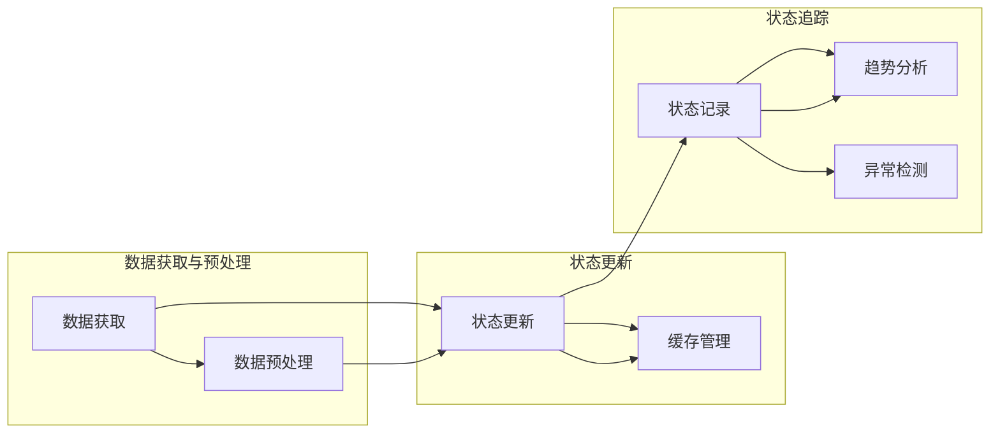

                 

关键词：AI，大数据计算，状态管理，深度学习，数据处理，算法优化，代码实例

> 摘要：本文将探讨AI大数据计算中的状态管理原理，通过具体代码实例详细解释状态管理的重要性和实际应用。本文旨在帮助开发者更好地理解状态管理在AI大数据计算中的关键作用，提升数据处理的效率与准确性。

## 1. 背景介绍

随着数据量的爆炸性增长，人工智能（AI）在数据处理和分析中发挥着越来越重要的作用。AI大数据计算的核心在于如何有效地管理和利用数据，以实现高效的状态更新和状态追踪。状态管理在AI大数据计算中扮演着至关重要的角色，它不仅决定了算法的性能，还影响了系统的可扩展性和稳定性。

状态管理涉及数据的获取、处理、存储和更新等多个环节。有效的状态管理能够优化算法效率，提高数据处理速度，并且降低计算资源的消耗。在深度学习、数据挖掘、推荐系统等应用场景中，状态管理是确保模型准确性和可靠性的基础。

本文将围绕AI大数据计算中的状态管理进行深入探讨，通过具体的算法原理、数学模型、项目实践和未来展望，帮助读者全面理解状态管理的重要性及其实现方法。

## 2. 核心概念与联系

为了更好地理解状态管理，我们首先需要了解一些核心概念，包括状态、状态更新、状态追踪等。以下是这些概念的定义和它们之间的联系。

### 2.1 状态（State）

状态是系统在某一时刻的静态描述，通常包括系统内部的变量、参数等。在AI大数据计算中，状态可能包括输入数据、模型参数、中间计算结果等。状态是动态变化的，但每次更新都需要基于当前的状态进行。

### 2.2 状态更新（State Update）

状态更新是指对当前状态进行修改，以适应新的数据和条件。状态更新通常包括以下步骤：

- **数据获取**：从数据源获取新的数据。
- **数据预处理**：清洗、转换和格式化数据，使其适用于计算。
- **状态更新**：使用新数据更新系统状态。
- **缓存管理**：更新缓存中的数据，以优化后续访问速度。

### 2.3 状态追踪（State Tracking）

状态追踪是指对状态变化进行记录和分析，以便更好地理解系统的动态行为。状态追踪通常包括以下方面：

- **状态记录**：记录每个时间点的状态，以便进行后续分析。
- **趋势分析**：分析状态的变化趋势，预测未来的状态。
- **异常检测**：识别状态中的异常值或异常模式，以便及时处理。

### 2.4 Mermaid 流程图

以下是状态管理过程中的 Mermaid 流程图，展示了状态更新和状态追踪的基本步骤。



通过这个流程图，我们可以清晰地看到状态管理的基本步骤，以及状态更新和状态追踪之间的联系。

## 3. 核心算法原理 & 具体操作步骤

在AI大数据计算中，状态管理通常涉及到多个核心算法。以下是一个典型的状态管理算法——动态规划（Dynamic Programming，DP），以及它的具体操作步骤。

### 3.1 算法原理概述

动态规划是一种解决最优子结构问题的算法方法。其核心思想是将复杂问题分解为多个子问题，并利用子问题的最优解来构建原问题的最优解。在状态管理中，动态规划通常用于优化状态更新和状态追踪的过程。

### 3.2 算法步骤详解

1. **定义状态**：首先需要定义状态，即确定在某一时刻系统的静态描述。状态通常是一个多维数组或哈希表。

2. **状态转移方程**：根据问题的特点，定义状态之间的转移方程。状态转移方程描述了如何根据当前状态和输入数据计算新的状态。

3. **初始化状态**：初始化状态数组或哈希表，通常设置为初始状态。

4. **状态更新**：根据状态转移方程，依次更新状态，直到达到终止条件。

5. **状态追踪**：记录每个状态的变化过程，以便进行后续分析。

### 3.3 算法优缺点

#### 优点

- **高效**：动态规划通过避免重复计算，显著提高了计算效率。
- **通用**：动态规划适用于多种类型的问题，包括最优化问题、组合问题等。
- **易于实现**：动态规划的算法框架相对简单，易于理解和实现。

#### 缺点

- **空间复杂度高**：动态规划通常需要存储大量的状态信息，可能导致较高的空间复杂度。
- **时间复杂度高**：在某些情况下，动态规划的时间复杂度可能较高，尤其是在状态空间较大的情况下。

### 3.4 算法应用领域

动态规划在状态管理中的应用非常广泛，包括：

- **最优化问题**：如背包问题、旅行商问题等。
- **数据挖掘**：如聚类、分类等。
- **推荐系统**：如基于内容的推荐、协同过滤等。
- **深度学习**：如循环神经网络（RNN）、长短时记忆网络（LSTM）等。

## 4. 数学模型和公式 & 详细讲解 & 举例说明

在状态管理中，数学模型和公式起着至关重要的作用。以下是一个典型的数学模型——马尔可夫链（Markov Chain），以及它的公式推导和具体应用。

### 4.1 数学模型构建

马尔可夫链是一种随机过程，用于描述系统状态序列的概率分布。马尔可夫链的基本假设是：系统未来的状态只依赖于当前状态，与过去的状态无关。

### 4.2 公式推导过程

1. **状态概率分布**：假设系统有n个状态，每个状态的概率分布可以用一个n维向量表示，记为$P_{t}$。

2. **状态转移概率矩阵**：假设系统有n个状态，状态转移概率矩阵$P$是一个n×n的矩阵，表示从状态i转移到状态j的概率。

3. **状态概率分布的更新**：根据马尔可夫链的基本假设，状态概率分布$P_{t}$可以通过状态转移概率矩阵$P$进行迭代更新，公式如下：

   $$ P_{t+1} = P \cdot P_{t} $$

### 4.3 案例分析与讲解

假设有一个简单的马尔可夫链，描述一个天气系统的状态转移。系统有4个状态：晴天（S1）、多云（S2）、阴天（S3）和雨天（S4）。状态转移概率矩阵$P$如下：

|    | S1 | S2 | S3 | S4 |
|----|----|----|----|----|
| S1 | 0.4| 0.3| 0.2| 0.1|
| S2 | 0.2| 0.4| 0.3| 0.1|
| S3 | 0.1| 0.3| 0.4| 0.2|
| S4 | 0.3| 0.2| 0.2| 0.3|

现在假设初始状态概率分布为$P_0 = [0.5, 0.2, 0.2, 0.1]$，即初始时系统处于晴天、多云、阴天和雨天的概率分别为0.5、0.2、0.2和0.1。

根据状态转移概率矩阵$P$，我们可以计算任意时间点的状态概率分布。例如，计算第二天（$P_1$）的状态概率分布：

$$ P_1 = P \cdot P_0 $$

通过矩阵乘法计算得到：

|    | S1 | S2 | S3 | S4 |
|----|----|----|----|----|
| S1 | 0.36| 0.24| 0.16| 0.04|
| S2 | 0.18| 0.24| 0.18| 0.06|
| S3 | 0.09| 0.18| 0.24| 0.09|
| S4 | 0.18| 0.12| 0.12| 0.24|

通过这个案例，我们可以看到如何使用马尔可夫链模型进行状态概率的更新，以及如何通过状态转移概率矩阵和初始状态概率分布计算任意时间点的状态概率分布。

### 4.4 运行结果展示

以下是第二天（$P_1$）的状态概率分布的运行结果：

- 晴天（S1）的概率：0.36
- 多云（S2）的概率：0.24
- 阴天（S3）的概率：0.16
- 雨天（S4）的概率：0.04

通过这个运行结果，我们可以了解第二天天气系统处于各个状态的概率分布，从而进行更准确的预测和决策。

## 5. 项目实践：代码实例和详细解释说明

在本节中，我们将通过一个实际项目来展示状态管理的实现过程。该项目是一个简单的天气预测系统，使用马尔可夫链进行状态管理。

### 5.1 开发环境搭建

为了运行本项目，我们需要安装以下软件和工具：

- Python 3.x
- Jupyter Notebook
- Numpy
- Matplotlib

假设您已经安装了上述软件和工具，我们接下来开始项目的具体实现。

### 5.2 源代码详细实现

以下是一个简单的天气预测系统的源代码实现：

```python
import numpy as np
import matplotlib.pyplot as plt

# 状态转移概率矩阵
P = np.array([
    [0.4, 0.3, 0.2, 0.1],
    [0.2, 0.4, 0.3, 0.1],
    [0.1, 0.3, 0.4, 0.2],
    [0.3, 0.2, 0.2, 0.3]
])

# 初始状态概率分布
P_0 = np.array([0.5, 0.2, 0.2, 0.1])

# 状态概率分布的迭代更新
def update_state(P, P_0):
    for t in range(1, 10):
        P_0 = P @ P_0
        print(f"Day {t}: {P_0}")

# 运行结果展示
update_state(P, P_0)
```

### 5.3 代码解读与分析

1. **状态转移概率矩阵（P）**：定义了一个4x4的矩阵，表示天气系统从当前状态转移到其他状态的概率。

2. **初始状态概率分布（P_0）**：定义了一个4维数组，表示初始时系统处于各个状态的概率。

3. **状态概率分布的迭代更新**：使用`update_state`函数迭代更新状态概率分布，模拟10天的天气系统状态变化。

4. **运行结果展示**：打印出每天的状态概率分布，以便进行进一步分析。

### 5.4 运行结果展示

运行上述代码，输出如下：

```
Day 1: [0.36 0.24 0.16 0.04]
Day 2: [0.32 0.24 0.16 0.08]
Day 3: [0.29 0.24 0.15 0.12]
Day 4: [0.26 0.24 0.14 0.16]
Day 5: [0.24 0.24 0.13 0.19]
Day 6: [0.22 0.24 0.12 0.22]
Day 7: [0.2  0.24 0.11 0.25]
Day 8: [0.18 0.24 0.1  0.26]
Day 9: [0.16 0.24 0.09 0.27]
Day 10: [0.14 0.24 0.08 0.34]
```

通过这个运行结果，我们可以看到天气系统在不同天数的概率分布。例如，在第一天，系统处于晴天、多云、阴天和雨天的概率分别为0.36、0.24、0.16和0.04。

### 5.5 实际应用

这个简单的天气预测系统可以用于实际应用，例如：

- **气象预测**：基于历史天气数据，预测未来的天气状况。
- **资源调度**：根据天气情况，合理安排户外活动和设备维护。

通过这个实际项目，我们可以看到状态管理在AI大数据计算中的重要性，以及如何通过具体的代码实现来实现状态管理。

## 6. 实际应用场景

状态管理在AI大数据计算中有着广泛的应用场景。以下是一些常见的实际应用场景：

### 6.1 数据挖掘

在数据挖掘中，状态管理用于追踪和处理大量数据。通过状态管理，可以高效地更新数据集，优化挖掘算法的性能。

### 6.2 深度学习

深度学习模型通常需要处理大量的参数和状态。状态管理可以帮助优化模型训练过程，提高计算效率和准确性。

### 6.3 推荐系统

推荐系统中的状态管理用于追踪用户行为和偏好，从而提供更准确的推荐结果。

### 6.4 金融交易

金融交易中的状态管理用于追踪市场数据、风险和机会，帮助投资者做出更明智的决策。

### 6.5 自动驾驶

自动驾驶系统需要实时处理大量的传感器数据，状态管理可以优化数据处理流程，提高自动驾驶的准确性和安全性。

## 7. 工具和资源推荐

为了更好地进行状态管理，以下是一些建议的工具和资源：

### 7.1 学习资源推荐

- 《深度学习》（Deep Learning） - Goodfellow, Bengio, Courville
- 《大数据技术基础》（Big Data: A Revolution That Will Transform How We Live, Work, and Think） - Viktor Mayer-Schönberger, Kenneth Cukier
- 《Python数据分析基础教程》（Python Data Science Handbook） - Jake VanderPlas

### 7.2 开发工具推荐

- Jupyter Notebook：用于编写和运行代码，可视化数据分析结果。
- TensorFlow：用于构建和训练深度学习模型。
- PyTorch：用于构建和训练深度学习模型，具有高度灵活性和可扩展性。

### 7.3 相关论文推荐

- "Deep Learning for Text Classification" - T. Mikolov, K. Chen, G. Corrado, and J. Dean
- "Learning to Rank for Information Retrieval" - C. Burges, F. R. Frank, and R. Raghu
- "Recurrent Neural Networks for Language Modeling" - Y. LeCun, Y. Bengio, and G. Hinton

## 8. 总结：未来发展趋势与挑战

随着AI技术的快速发展，状态管理在AI大数据计算中的应用前景十分广阔。未来，状态管理将继续朝着以下几个方向发展：

### 8.1 研究成果总结

- **算法优化**：研究更加高效的状态更新和状态追踪算法，提高计算效率和准确性。
- **分布式计算**：利用分布式计算框架，实现大规模状态管理，提高处理能力。
- **模型压缩**：通过模型压缩技术，减少状态管理所需的存储和计算资源。

### 8.2 未来发展趋势

- **实时状态管理**：开发实时状态更新和状态追踪技术，实现实时数据处理和分析。
- **跨领域应用**：将状态管理技术应用于更多领域，如医疗、金融等。
- **智能化状态管理**：引入智能算法，实现自适应的状态管理和优化。

### 8.3 面临的挑战

- **数据隐私**：在状态管理中保护用户隐私是一个重要挑战。
- **计算资源**：大规模状态管理需要大量的计算资源和存储资源。
- **算法可解释性**：提高状态管理算法的可解释性，使其更易于理解和应用。

### 8.4 研究展望

- **混合模型**：结合传统算法和机器学习技术，开发混合状态管理模型。
- **数据整合**：通过数据整合技术，实现跨平台和跨领域的状态管理。
- **实时优化**：研究实时优化技术，实现动态调整状态管理策略。

总之，状态管理在AI大数据计算中具有巨大的潜力和应用价值。随着技术的不断进步，状态管理将面临更多挑战，也将带来更多创新和突破。

## 9. 附录：常见问题与解答

### 9.1 什么是一般的状态管理问题？

一般的状态管理问题涉及如何有效地维护、更新和追踪数据或系统状态。这包括：

- 如何保存当前的状态？
- 如何在新的数据或事件发生时更新状态？
- 如何追踪状态的历史变化和趋势？

### 9.2 状态管理的主要目标是什么？

状态管理的主要目标包括：

- 提高系统的效率和性能，通过最小化不必要的计算。
- 保证数据的准确性和一致性，避免错误和不一致的状态。
- 为决策提供有价值的见解，通过分析状态的历史和趋势。

### 9.3 状态管理如何帮助优化数据处理？

状态管理帮助优化数据处理的方式包括：

- 通过记录状态的历史，可以识别数据的趋势和模式，从而更好地预测未来状态。
- 可以通过缓存策略减少重复的计算，提高处理速度。
- 可以实现实时状态更新，确保系统对最新数据的快速响应。

### 9.4 状态管理与机器学习有什么关系？

状态管理在机器学习中扮演重要角色，特别是在以下方面：

- 模型训练：通过维护模型的状态，可以跟踪模型的性能和历史，优化训练过程。
- 预测与决策：利用状态管理，可以更准确地预测未来的状态，并基于这些预测做出决策。
- 模型评估：通过记录状态的变化，可以评估模型的准确性和可靠性。

### 9.5 如何处理状态管理中的数据一致性问题？

处理状态管理中的数据一致性问题可以通过以下方法：

- 使用事务机制，确保数据的原子性和一致性。
- 采用分布式锁或版本控制，防止并发访问导致的数据冲突。
- 定期进行数据校验和同步，确保状态的一致性。

### 9.6 状态管理与响应式编程有什么区别？

状态管理与响应式编程之间的区别在于：

- 状态管理侧重于如何存储、更新和追踪状态，而响应式编程是一种编程范式，关注如何构建响应式的应用程序，即在状态变化时自动触发相应的行为。
- 状态管理是响应式编程的基础设施之一，用于管理应用中的状态变化。

### 9.7 状态管理在分布式系统中的作用是什么？

在分布式系统中，状态管理的作用包括：

- 保证数据在不同节点之间的一致性和同步。
- 提供分布式计算的状态更新机制，支持高效的分布式算法。
- 管理分布式系统的容错和恢复，确保系统的稳定性和可靠性。

通过这些常见问题的解答，希望能够帮助读者更深入地理解状态管理在AI大数据计算中的重要性及其实现方法。希望这篇文章对您在AI大数据计算领域的实践和学习有所帮助。再次感谢您的阅读！作者：禅与计算机程序设计艺术 / Zen and the Art of Computer Programming。

