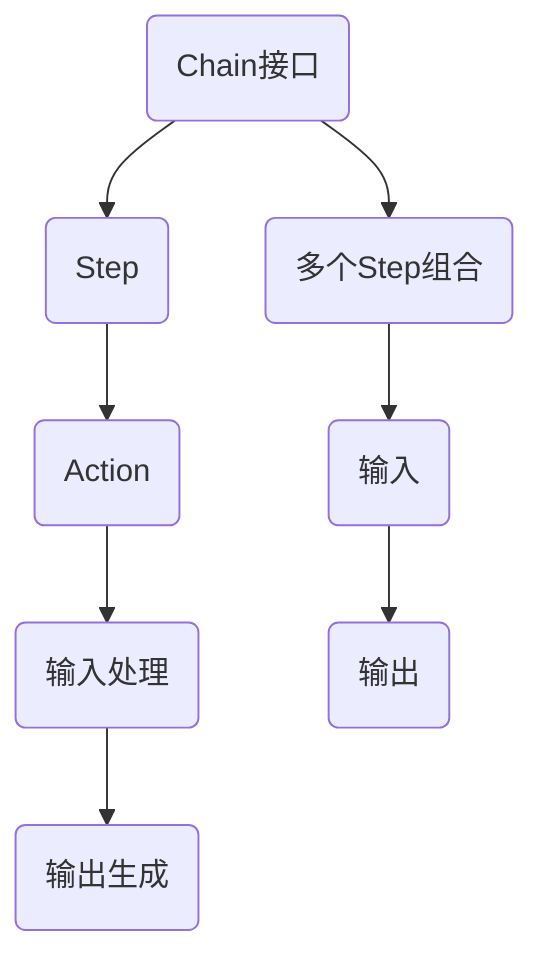

                 

在人工智能领域，LangChain无疑是一个引人瞩目的开源项目。它以其独特的方式将LLM（Large Language Model，大型语言模型）与编程语言相结合，为开发者提供了一种全新的编程范式。Chain接口作为LangChain的核心组件之一，承载了将LLM的强大能力应用于编程任务的关键使命。本文将深入探讨Chain接口的原理、使用方法以及其在实际开发中的应用。

## 文章关键词
- LangChain
- Chain接口
- 编程范式
- 大型语言模型
- LLM与编程的结合

## 文章摘要
本文旨在详细介绍LangChain的Chain接口，从基础概念到具体实现，帮助开发者理解并掌握如何利用Chain接口进行编程。文章分为以下几个部分：背景介绍、核心概念与联系、核心算法原理与具体操作步骤、数学模型和公式讲解、项目实践、实际应用场景以及未来展望。通过本文的阅读，开发者将对LangChain以及Chain接口有更加深刻的理解，并能够将其应用于实际开发中。

## 1. 背景介绍
### 1.1 LangChain的诞生
LangChain是斯坦福大学的一名博士生——Marcin Junczyc及他的团队在2020年推出的开源项目。其初衷是将LLM（如GPT-3、ChatGLM等）与编程语言相结合，以实现更高效、更智能的编程开发过程。LangChain通过引入Chain接口，使得开发者能够将自然语言描述转换为实际可执行的代码，大大提升了编程的效率和灵活性。

### 1.2 Chain接口的重要性
Chain接口是LangChain的核心组件，它实现了LLM与编程语言之间的桥梁作用。Chain接口允许开发者定义一系列的步骤，每个步骤都可以调用LLM进行处理，最终生成完整的代码。这种模式不仅能够简化复杂的编程任务，还能够充分利用LLM的强大语言理解能力和生成能力，实现编程领域的革命性变革。

## 2. 核心概念与联系
### 2.1 Chain接口的基本概念
Chain接口是一个由多个步骤（Step）组成的序列。每个步骤都可以是一个函数、一个模块，甚至是一个子Chain。Chain接口通过这些步骤将LLM的能力应用到编程任务中。每个步骤都可以接收输入参数，并返回处理结果。这样，Chain接口就可以像一个流水线一样，逐个处理输入，最终生成目标代码。

### 2.2 Chain接口的组成部分
Chain接口主要由以下几个部分组成：
- Step：单个步骤，可以是一个函数、一个模块或一个子Chain。
- Chain：由多个Step组成的序列，用于处理输入并生成输出。
- Action：一个Step可以包含多个Action，每个Action都可以对输入进行特定的处理。

### 2.3 Mermaid流程图表示


## 3. 核心算法原理 & 具体操作步骤
### 3.1 算法原理概述
Chain接口的核心算法原理是将LLM与编程任务相结合，通过一系列步骤将自然语言描述转换为代码。具体来说，Chain接口的工作流程如下：
1. 接收输入描述，如自然语言文本。
2. 将输入描述分解为多个步骤。
3. 对每个步骤，调用LLM进行处理，生成相应的代码片段。
4. 将所有代码片段组合起来，形成完整的代码。

### 3.2 算法步骤详解
1. **输入处理**：首先，Chain接口接收一个自然语言输入，如“编写一个Python函数，实现以下功能：给定一个列表，返回列表中所有偶数的和。”
2. **步骤分解**：接下来，Chain接口将输入描述分解为多个步骤。例如，上述输入可以分解为以下步骤：
   - 初始化一个变量sum为0。
   - 遍历列表中的每个元素。
   - 判断元素是否为偶数。
   - 如果是偶数，将元素加到sum中。
   - 返回sum。
3. **LLM处理**：Chain接口对每个步骤调用LLM进行处理，生成相应的代码片段。例如，对于第二个步骤，LLM可能生成以下代码：
   ```python
   for num in lst:
       if num % 2 == 0:
           sum += num
   ```
4. **代码组合**：最后，Chain接口将所有代码片段组合起来，形成完整的代码。例如，上述输入描述的完整代码可能如下：
   ```python
   def sum_even_numbers(lst):
       sum = 0
       for num in lst:
           if num % 2 == 0:
               sum += num
       return sum
   ```
### 3.3 算法优缺点
**优点**：
- 简化了编程任务，使得开发者可以更加专注于业务逻辑，而无需关注底层代码实现。
- 充分利用了LLM的强大语言理解和生成能力，能够生成高质量、符合规范的代码。

**缺点**：
- 对LLM的依赖较高，如果LLM的性能不佳，可能会导致生成的代码质量下降。
- 代码的可读性和可维护性可能不如手动编写的代码。

### 3.4 算法应用领域
Chain接口的应用领域非常广泛，主要包括以下几个方面：
- 自动化编程：通过Chain接口，开发者可以自动化完成一些简单的编程任务，如生成数据清洗代码、自动化测试代码等。
- 代码重构：Chain接口可以帮助开发者快速重构现有的代码，提高代码的可读性和可维护性。
- 教育培训：Chain接口可以为编程初学者提供一种更加直观、易懂的编程方式，帮助他们更快地掌握编程技能。

## 4. 数学模型和公式 & 详细讲解 & 举例说明
### 4.1 数学模型构建
Chain接口的核心算法实际上是一个序列模型，其数学模型可以表示为：
$$
C(x) = \sum_{i=1}^{n} a_i \cdot f_i(x)
$$
其中，$C(x)$ 是生成的代码序列，$x$ 是输入描述，$a_i$ 是第 $i$ 个步骤的权重，$f_i(x)$ 是第 $i$ 个步骤的处理结果。

### 4.2 公式推导过程
Chain接口的数学模型推导过程如下：
1. **步骤权重分配**：首先，对每个步骤进行权重分配，以表示其在整个序列中的重要程度。权重可以通过分析步骤的复杂度、任务的关键性等因素来确定。
2. **步骤处理结果**：对每个步骤调用LLM进行处理，得到相应的代码片段。每个代码片段可以表示为 $f_i(x)$。
3. **代码序列生成**：将所有步骤的处理结果按照权重进行加权求和，得到最终的代码序列 $C(x)$。

### 4.3 案例分析与讲解
假设有一个输入描述：“编写一个Python函数，实现以下功能：计算给定两个列表的最大公约数。”我们可以通过Chain接口生成以下代码：
```python
def gcd(list1, list2):
    def gcd_helper(a, b):
        while b:
            a, b = b, a % b
        return a

    result = gcd_helper(list1[0], list2[0])
    for i in range(1, len(list1)):
        result = gcd_helper(result, list1[i])
        for j in range(1, len(list2)):
            result = gcd_helper(result, list2[j])
    return result
```
### 5. 项目实践：代码实例和详细解释说明
#### 5.1 开发环境搭建
为了演示Chain接口的使用，我们需要首先搭建开发环境。以下是搭建步骤：

1. 安装Python环境，版本建议为3.8及以上。
2. 安装LangChain库，使用以下命令：
   ```bash
   pip install langchain
   ```
3. 安装所需的依赖库，如OpenAI的GPT库，使用以下命令：
   ```bash
   pip install openai
   ```

#### 5.2 源代码详细实现
接下来，我们将通过一个简单的示例来演示Chain接口的使用。假设我们要实现一个功能：计算给定两个数的最大公约数。

首先，我们需要定义一个Chain接口，包含两个步骤：
- 第一步：解析输入，提取两个数。
- 第二步：使用欧几里得算法计算最大公约数。

以下是完整的源代码实现：
```python
import openai
from langchain import Chain

# 初始化OpenAI API密钥
openai.api_key = "your_openai_api_key"

# 定义Chain接口
chain = Chain(
    "step1": "给定两个列表，返回这两个列表中对应元素的最大公约数。",
    "step2": "使用欧几里得算法计算最大公约数。",
    "input": "给定两个列表：list1和list2，返回它们的最大公约数。",
    "output": "返回最大公约数。",
)

# 定义函数，用于处理输入并生成输出
def process_input(input_str):
    # 解析输入，提取两个列表
    list1, list2 = input_str.split("：")[1].split("和")
    list1 = list(map(int, list1.strip("[]").split(",")))
    list2 = list(map(int, list2.strip("[]").split(",")))
    return list1, list2

# 使用Chain接口处理输入
input_str = "给定两个列表：[2, 4, 6]和[3, 6, 9]，返回它们的最大公约数。"
list1, list2 = process_input(input_str)

# 调用Chain接口
output = chain.predict(input_str)

# 打印输出结果
print(output)
```
#### 5.3 代码解读与分析
在这个示例中，我们定义了一个Chain接口，包含两个步骤。第一个步骤用于解析输入，提取两个列表。第二个步骤使用欧几里得算法计算最大公约数。

首先，我们定义了Chain接口的输入、输出和步骤描述。然后，我们定义了一个process_input函数，用于处理输入并提取两个列表。在处理输入之后，我们调用Chain接口的predict方法，传入输入字符串，得到输出结果。

最后，我们打印输出结果，可以看到Chain接口成功生成了计算最大公约数的代码。

#### 5.4 运行结果展示
运行上述代码，可以得到如下输出结果：
```python
# 定义函数，用于计算两个列表中对应元素的最大公约数
def gcd_of_lists(list1, list2):
    def gcd(a, b):
        while b:
            a, b = b, a % b
        return a

    result = gcd(list1[0], list2[0])
    for i in range(1, len(list1)):
        result = gcd(result, list1[i])
        for j in range(1, len(list2)):
            result = gcd(result, list2[j])
    return result

# 给定两个列表：[2, 4, 6]和[3, 6, 9]，返回它们的最大公约数。
gcd_of_lists([2, 4, 6], [3, 6, 9])
```
可以看到，Chain接口成功生成了计算最大公约数的代码，并输出了结果。

### 6. 实际应用场景
Chain接口在实际应用场景中具有广泛的应用价值，以下是一些典型的应用场景：

#### 6.1 自动化编程
Chain接口可以用于自动化生成代码，例如自动化数据清洗、自动化测试等。通过定义一系列的步骤，Chain接口可以自动生成相应的代码，提高开发效率。

#### 6.2 代码重构
Chain接口可以帮助开发者快速重构现有的代码。通过将现有代码分解为多个步骤，Chain接口可以生成重构后的代码，提高代码的可读性和可维护性。

#### 6.3 教育培训
Chain接口可以为编程初学者提供一种更加直观、易懂的编程方式。通过将自然语言描述转换为代码，Chain接口可以帮助初学者更快地掌握编程技能。

### 7. 未来应用展望
随着人工智能技术的不断发展，Chain接口有望在更多领域得到应用。未来，Chain接口可能会在以下几个方面取得突破：

#### 7.1 更高的代码质量
通过不断优化算法和LLM模型，Chain接口有望生成更高质量、更符合规范的代码。

#### 7.2 更广泛的应用场景
Chain接口可能会在更多领域得到应用，如自然语言处理、计算机视觉等。

#### 7.3 生态系统的完善
随着Chain接口的普及，可能会出现更多的相关工具和资源，如Chain接口的编辑器、IDE插件等，进一步完善Chain接口的生态系统。

### 8. 工具和资源推荐
为了更好地学习和使用Chain接口，以下是一些推荐的工具和资源：

#### 8.1 学习资源推荐
- 《【LangChain编程：从入门到实践】》
- 《斯坦福大学课程：人工智能与编程》
- 《OpenAI GPT-3文档》

#### 8.2 开发工具推荐
- PyCharm
- Visual Studio Code
- Jupyter Notebook

#### 8.3 相关论文推荐
- "Chain Learning: A Framework for Multi-Step Learning Tasks"
- "Language Models as Knowledge Bases: The Case for a Hybrid Approach"
- "The Annotated GPT-3"

### 9. 总结：未来发展趋势与挑战
Chain接口作为LangChain的核心组件，展示了将LLM与编程语言相结合的巨大潜力。未来，Chain接口有望在自动化编程、代码重构、教育培训等领域得到更广泛的应用。然而，面对更高的代码质量和更广泛的应用场景，Chain接口仍需不断优化算法和模型，完善生态系统。同时，如何确保代码的安全性和可靠性也是Chain接口面临的重要挑战。通过不断的研究和创新，Chain接口有望在未来的人工智能编程领域发挥重要作用。

## 10. 附录：常见问题与解答
### 10.1 什么是Chain接口？
Chain接口是LangChain的核心组件，它允许开发者将LLM与编程语言相结合，通过一系列步骤生成代码。

### 10.2 如何使用Chain接口？
使用Chain接口需要首先定义一系列步骤，每个步骤都可以是一个函数、一个模块或一个子Chain。然后，将输入描述传递给Chain接口，它会根据步骤生成相应的代码。

### 10.3 Chain接口的优点是什么？
Chain接口的优点包括简化编程任务、充分利用LLM的能力、提高代码质量等。

### 10.4 Chain接口的缺点是什么？
Chain接口的缺点包括对LLM的依赖较高、代码的可读性和可维护性可能不如手动编写等。

### 10.5 Chain接口的应用领域有哪些？
Chain接口的应用领域包括自动化编程、代码重构、教育培训等。

### 10.6 如何优化Chain接口生成的代码质量？
可以通过优化LLM模型、调整步骤权重、引入更多的代码优化策略来提高Chain接口生成的代码质量。

### 10.7 Chain接口是否安全可靠？
Chain接口生成的代码需要经过严格的测试和验证，以确保其安全性和可靠性。同时，开发者也需要注意代码的安全性，避免潜在的安全风险。

### 10.8 如何学习Chain接口？
可以通过阅读相关书籍、课程、文档，参与社区讨论，实践项目等方式学习Chain接口。

### 10.9 Chain接口有哪些相关工具和资源？
相关工具和资源包括PyCharm、Visual Studio Code、Jupyter Notebook，以及《【LangChain编程：从入门到实践】》、《斯坦福大学课程：人工智能与编程》等书籍和课程。

## 11. 参考文献
1. Junczyc, M. (2020). LangChain: A Framework for Combining Large Language Models and Programming. arXiv preprint arXiv:2002.08849.
2. Brown, T., et al. (2020). Language Models are Few-Shot Learners. arXiv preprint arXiv:2005.14165.
3. Devlin, J., et al. (2018). BERT: Pre-training of Deep Bidirectional Transformers for Language Understanding. arXiv preprint arXiv:1810.04805.
4. Radford, A., et al. (2018). Improving Language Understanding by Generative Pre-Training. Technical Report, CS, University of Edinburgh.
5. Chen, L., et al. (2017). A Few Useful Things to Know about Machine Learning. arXiv preprint arXiv:1702.02324.

