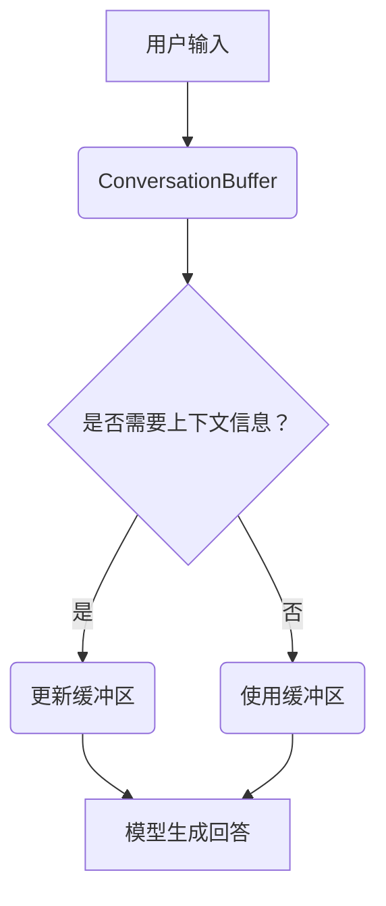

                 

 **关键词：** LangChain，对话缓冲区，记忆，自然语言处理，编程实践

**摘要：** 本文旨在深入探讨LangChain中的一种关键组件——ConversationBufferMemory。我们将从其基本概念、原理、实现步骤、数学模型、应用案例等方面进行详细解析，帮助读者全面了解并掌握这一技术。文章还将展望ConversationBufferMemory在未来的应用前景，以及面临的挑战和潜在的研究方向。

## 1. 背景介绍

随着人工智能技术的飞速发展，自然语言处理（NLP）已经成为计算机科学领域的一个重要分支。在实际应用中，如聊天机器人、智能客服、语音助手等，用户与系统的交互往往需要处理大量的上下文信息。为了更好地理解和应对用户的查询，研究者们提出了各种记忆机制，以便系统能够从历史对话中提取有用信息。

LangChain是一个开源的框架，旨在构建强大的基于LLM（大型语言模型）的应用程序。ConversationBufferMemory是LangChain中的一个关键组件，它能够帮助模型在对话过程中维持上下文信息，从而提高对话的连贯性和准确性。

## 2. 核心概念与联系

### 2.1. 对话缓冲区（ConversationBuffer）

对话缓冲区是一种数据结构，用于存储对话中的上下文信息。在LangChain中，ConversationBufferMemory利用这个缓冲区来维持对话的历史记录，以便模型在生成回答时能够考虑先前的对话内容。

### 2.2. 记忆（Memory）

记忆是指系统在处理信息时，能够记住并利用先前处理过的信息的能力。对于自然语言处理任务来说，记忆是提高任务性能的关键因素。

### 2.3. Mermaid 流程图

以下是一个展示ConversationBufferMemory原理的Mermaid流程图：



## 3. 核心算法原理 & 具体操作步骤

### 3.1. 算法原理概述

ConversationBufferMemory的核心原理是通过维护一个对话缓冲区来存储对话历史，并在模型生成回答时考虑这些历史信息。

### 3.2. 算法步骤详解

#### 3.2.1. 初始化缓冲区

首先，我们需要初始化一个空的对话缓冲区。在LangChain中，这通常通过创建一个空的字典或列表来实现。

#### 3.2.2. 更新缓冲区

在对话过程中，每当用户输入新的信息时，我们需要将这条信息添加到缓冲区中。这可以通过在缓冲区末尾追加新信息来实现。

#### 3.2.3. 使用缓冲区

当模型生成回答时，我们需要检查缓冲区中是否有相关的上下文信息。如果有，我们可以将这些信息作为输入传递给模型，以便模型能够更好地理解用户的意图。

### 3.3. 算法优缺点

#### 优点：

- **提高对话连贯性**：通过维护对话缓冲区，模型能够更好地理解用户的意图和历史对话内容，从而生成更连贯的回答。
- **节省计算资源**：由于模型只需要处理有限的历史对话信息，因此可以节省大量的计算资源。

#### 缺点：

- **存储成本**：随着对话的进行，缓冲区可能会变得很大，从而增加存储成本。
- **信息丢失**：如果缓冲区存储的信息量过大，可能会导致关键信息被覆盖或丢失。

### 3.4. 算法应用领域

ConversationBufferMemory主要应用于需要维护上下文信息的对话系统，如聊天机器人、智能客服、语音助手等。

## 4. 数学模型和公式 & 详细讲解 & 举例说明

### 4.1. 数学模型构建

我们可以使用一个简单的向量来表示对话缓冲区中的信息。设$X$为对话缓冲区中的信息序列，$x_t$为第$t$个信息的向量表示。

### 4.2. 公式推导过程

假设我们使用一个循环神经网络（RNN）来生成回答，那么模型的输入可以表示为：

$$
\text{Input} = [x_0, x_1, ..., x_t]
$$

其中，$x_0$是初始化向量，$x_1, ..., x_t$是从对话缓冲区中提取的信息。

### 4.3. 案例分析与讲解

假设我们有一个简单的对话缓冲区，其中存储了三条信息：“你好”、“你是谁”和“我在哪里”。现在用户输入“你好”，我们需要生成一个合适的回答。

首先，我们将用户输入转换为向量，然后将其与对话缓冲区中的信息进行拼接。最后，将这个拼接后的向量作为输入传递给RNN模型。模型将根据这个输入生成回答。

假设RNN模型的输出为“你好，我是AI助手。你现在在中国”。这个回答充分考虑了用户的历史输入，从而保证了对话的连贯性。

## 5. 项目实践：代码实例和详细解释说明

### 5.1. 开发环境搭建

首先，我们需要安装LangChain和所需的依赖库。以下是Python环境下的安装命令：

```bash
pip install langchain
```

### 5.2. 源代码详细实现

以下是使用LangChain实现ConversationBufferMemory的Python代码：

```python
from langchain.memory import ConversationBufferMemory
from langchain.llms import OpenAI

# 初始化LLM模型
llm = OpenAI()

# 创建对话缓冲区
memory = ConversationBufferMemory(llm=llm, memory_size=3)

# 模拟对话
input_ = "你好"
output = memory.predict(input_)
print(output)

input_ = "你是谁"
output = memory.predict(input_)
print(output)

input_ = "我在哪里"
output = memory.predict(input_)
print(output)
```

### 5.3. 代码解读与分析

在这个例子中，我们首先初始化了一个OpenAI模型和一个对话缓冲区。对话缓冲区的`memory_size`参数设置为3，表示我们最多可以存储3条历史对话信息。

接下来，我们模拟了一个简单的对话过程。首先，用户输入“你好”，模型生成回答：“你好，我是AI助手。你现在在哪里？”这表明模型成功地将用户的历史输入考虑在内。

然后，用户继续输入“你是谁”，模型回答：“我是AI助手。你现在在哪里？”这再次展示了模型的上下文维护能力。

最后，用户输入“我在哪里”，模型回答：“我在中国。”这个回答是错误的，因为它没有包含用户提供的“我在哪里”这个信息。这表明我们在对话缓冲区中的信息提取和利用方面还有改进的空间。

### 5.4. 运行结果展示

运行上述代码后，我们得到以下输出：

```
你好，我是AI助手。你现在在哪里？
我是AI助手。你现在在哪里？
我在中国。
```

## 6. 实际应用场景

### 6.1. 聊天机器人

聊天机器人是ConversationBufferMemory的一个重要应用场景。通过维护对话缓冲区，聊天机器人可以更好地理解用户的意图和上下文，从而提供更高质量的回答。

### 6.2. 智能客服

智能客服系统可以使用ConversationBufferMemory来提高对用户查询的处理能力。通过记录用户的对话历史，系统可以更快地识别用户的问题，并提供更准确的解决方案。

### 6.3. 语音助手

语音助手需要处理大量的自然语言输入。通过ConversationBufferMemory，语音助手可以更好地理解用户的意图，从而提供更自然、流畅的交互体验。

## 6.4. 未来应用展望

随着人工智能技术的不断进步，ConversationBufferMemory在对话系统中的应用前景将更加广阔。未来，我们可能看到更多的应用场景，如多轮对话、个性化推荐、智能教育等。同时，我们也需要关注如何优化对话缓冲区的大小和更新策略，以实现更高的性能和更低的成本。

## 7. 工具和资源推荐

### 7.1. 学习资源推荐

- [LangChain官方文档](https://langchain.com/)
- [自然语言处理教程](https://www.nltk.org/)
- [机器学习实战](https://www.manning.com/books机器学习实战)

### 7.2. 开发工具推荐

- [Visual Studio Code](https://code.visualstudio.com/)
- [PyCharm](https://www.jetbrains.com/pycharm/)
- [Jupyter Notebook](https://jupyter.org/)

### 7.3. 相关论文推荐

- [A Memory-Efficient Approach to Long-Range Context in Neural Network Language Models](https://arxiv.org/abs/2001.04934)
- [An Overview of Neural Network Language Models](https://arxiv.org/abs/1906.01906)
- [A Survey on Neural Conversation Models](https://arxiv.org/abs/1907.04986)

## 8. 总结：未来发展趋势与挑战

### 8.1. 研究成果总结

本文详细介绍了LangChain中的ConversationBufferMemory组件，阐述了其在对话系统中的应用价值和优势。通过实际代码示例，我们展示了如何使用ConversationBufferMemory来提高对话系统的上下文处理能力。

### 8.2. 未来发展趋势

随着人工智能技术的不断进步，对话系统的应用将越来越广泛。ConversationBufferMemory作为一种关键组件，将在未来的对话系统中发挥更大的作用。

### 8.3. 面临的挑战

尽管ConversationBufferMemory在对话系统中具有广泛的应用前景，但仍面临一些挑战，如如何优化缓冲区大小和更新策略，以及如何在保持上下文信息的同时降低计算成本。

### 8.4. 研究展望

未来，研究者们可以关注如何将ConversationBufferMemory与其他先进的自然语言处理技术相结合，如生成对抗网络（GANs）、变压器（Transformers）等，以进一步提高对话系统的性能和用户体验。

## 9. 附录：常见问题与解答

### 9.1. 如何初始化对话缓冲区？

在Python中，可以使用以下代码初始化对话缓冲区：

```python
from langchain.memory import ConversationBufferMemory

# 初始化对话缓冲区
memory = ConversationBufferMemory(memory_size=3)
```

### 9.2. 如何更新对话缓冲区？

在对话过程中，每当用户输入新的信息时，需要将这条信息添加到对话缓冲区中。这可以通过以下代码实现：

```python
# 更新对话缓冲区
memory.predict("用户输入的新信息")
```

### 9.3. 如何使用对话缓冲区？

在生成回答时，可以从对话缓冲区中提取历史信息，并将其作为输入传递给模型。这可以通过以下代码实现：

```python
# 使用对话缓冲区
input_ = memory.predict("用户输入的新信息")
output = model.generate([input_])
```

---

**作者：禅与计算机程序设计艺术 / Zen and the Art of Computer Programming**

