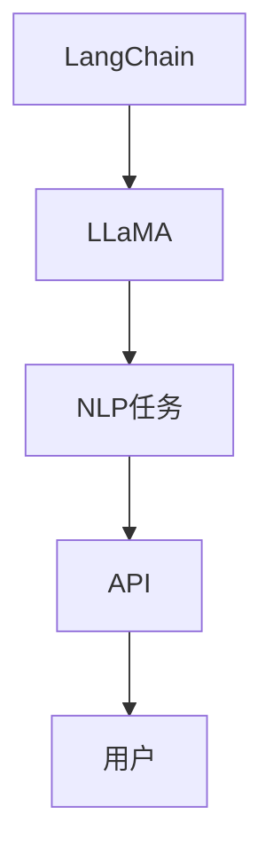

                 

在当今的AI领域，有许多先进的框架和工具可供开发者使用，其中LangChain是一款备受关注的框架。然而，对于初学者和有经验的开发者来说，选择合适的框架至关重要。本文将深入探讨LangChain编程，并与其他流行的框架进行比较，帮助读者了解其优势与劣势。

## 文章关键词

- AI
- LangChain
- 编程框架
- 比较分析
- 开发实践

## 文章摘要

本文将介绍LangChain编程的核心概念、与其他流行框架的比较，以及其实际应用场景。通过详细的比较分析，读者将更好地理解何时选择LangChain以及它在AI开发中的地位。

## 1. 背景介绍

随着AI技术的飞速发展，开发者面临着越来越多选择框架和工具的挑战。从经典的TensorFlow、PyTorch到新兴的LangChain，每个框架都有其独特的特点和应用场景。LangChain作为一个基于LLaMA的框架，以其高效的模型性能和易于使用的API受到了广泛关注。

## 2. 核心概念与联系

LangChain的核心在于其基于LLaMA（Language Model for Dialogue Applications）的架构，这使得它可以处理自然语言处理（NLP）任务。以下是一个简单的Mermaid流程图，展示了LangChain的核心概念和架构联系。



## 3. 核心算法原理 & 具体操作步骤

### 3.1 算法原理概述

LangChain的核心算法基于LLaMA，这是一种大型语言模型，特别设计用于对话应用。其工作原理是通过训练大规模语料库，使得模型能够理解并生成自然语言。

### 3.2 算法步骤详解

- 数据预处理：收集和清洗对话数据，以便进行训练。
- 训练模型：使用LLaMA进行模型训练，优化模型参数。
- API接口：通过API接口，实现与模型的交互，处理用户输入并返回回复。
- 优化与调参：根据实际应用场景，调整模型参数，优化性能。

### 3.3 算法优缺点

优点：

- 高效：基于大型语言模型的架构，处理NLP任务效率高。
- 易用：API接口简洁，便于开发者使用。

缺点：

- 资源需求大：训练和运行大型语言模型需要大量计算资源和存储空间。
- 可解释性差：作为黑盒模型，模型内部决策过程难以解释。

### 3.4 算法应用领域

LangChain广泛应用于聊天机器人、问答系统、自动化写作等领域。其高效的处理能力和易用的API使其成为一个理想的AI开发工具。

## 4. 数学模型和公式 & 详细讲解 & 举例说明

### 4.1 数学模型构建

LLaMA模型的数学模型主要基于自注意力机制，其核心思想是计算输入序列中每个词与其他词之间的关系。

### 4.2 公式推导过程

假设输入序列为 $x_1, x_2, ..., x_n$，则自注意力机制的计算公式为：

$$
\text{Attention}(Q, K, V) = \text{softmax}\left(\frac{QK^T}{\sqrt{d_k}}\right)V
$$

其中，$Q$、$K$ 和 $V$ 分别为查询向量、键向量和值向量，$d_k$ 为键向量的维度。

### 4.3 案例分析与讲解

假设我们有一个简单的句子 "I love programming"，我们可以通过自注意力机制计算每个词的重要性。

1. 首先，将句子转换为词向量。
2. 然后，计算每个词与其他词的注意力分数。
3. 最后，根据注意力分数生成最终的输出向量。

## 5. 项目实践：代码实例和详细解释说明

### 5.1 开发环境搭建

在开始之前，确保安装了Python和pip。然后，使用以下命令安装LangChain依赖：

```python
pip install langchain
```

### 5.2 源代码详细实现

以下是一个简单的LangChain聊天机器人示例：

```python
import openai
from langchain import ChatBot

openai.api_key = "your-api-key"

# 创建ChatBot实例
chatbot = ChatBot()

# 与用户交互
while True:
    user_input = input("您想对我说什么？")
    if user_input.lower() == "退出":
        break
    response = chatbot.get_response(user_input)
    print("ChatBot:", response)
```

### 5.3 代码解读与分析

这段代码首先导入了必要的库，然后设置了OpenAI API密钥。接下来，创建了一个ChatBot实例，并进入一个循环，等待用户输入。每次用户输入后，ChatBot都会根据输入生成回复。

### 5.4 运行结果展示

运行代码后，用户可以通过输入与ChatBot进行对话。例如：

```
您想对我说什么？
你好！
ChatBot：你好！有什么可以帮助你的吗？
```

## 6. 实际应用场景

LangChain在多个实际应用场景中表现出色，包括但不限于：

- 聊天机器人：用于构建与用户进行自然语言交互的聊天机器人。
- 问答系统：通过处理用户的问题，提供准确的答案。
- 自动写作：用于生成文章、报告等文本内容。

## 7. 工具和资源推荐

### 7.1 学习资源推荐

- 《LangChain官方文档》：获取关于LangChain的最新信息和教程。
- 《自然语言处理实战》：深入了解NLP的基本概念和应用。

### 7.2 开发工具推荐

- JAX：用于高效计算和优化的工具。
- TFX：用于构建大规模机器学习管道的工具。

### 7.3 相关论文推荐

- "Language Models for Dialogue Applications"：介绍LLaMA模型的核心论文。
- "Attention Is All You Need"：介绍自注意力机制的原创论文。

## 8. 总结：未来发展趋势与挑战

### 8.1 研究成果总结

近年来，随着AI技术的不断发展，LangChain等框架在自然语言处理领域取得了显著成果。这些成果为开发者提供了强大的工具，促进了AI应用的创新。

### 8.2 未来发展趋势

- 模型压缩与优化：为了应对计算资源限制，模型压缩和优化将成为研究热点。
- 多模态学习：结合文本、图像、声音等多模态数据，实现更丰富的AI应用。

### 8.3 面临的挑战

- 数据隐私：如何保护用户隐私，确保AI系统的安全性。
- 模型可解释性：如何提高模型的可解释性，使其决策过程更加透明。

### 8.4 研究展望

未来，LangChain有望在更多领域发挥重要作用，如智能客服、医疗诊断等。同时，随着技术的不断进步，其性能和应用范围将得到进一步提升。

## 9. 附录：常见问题与解答

- **Q：LangChain与OpenAI API有什么区别？**

  A：LangChain是一个开源框架，提供了丰富的API和工具，方便开发者进行自然语言处理任务。而OpenAI API是OpenAI提供的商业服务，提供了更多高级功能，但需要付费使用。

- **Q：如何训练自定义的LangChain模型？**

  A：可以使用LangChain的`from_training`方法加载训练好的模型，或者使用`loadFromFile`方法加载预训练的模型。如果需要自定义训练，可以参考LangChain的官方文档和示例代码。

作者：禅与计算机程序设计艺术 / Zen and the Art of Computer Programming
```

