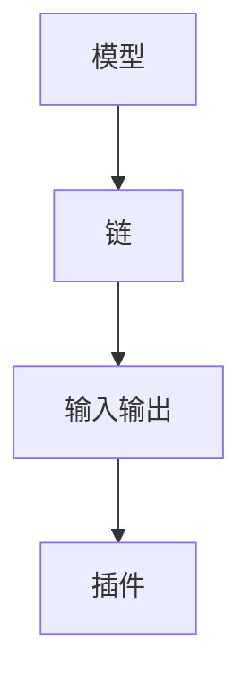

                 

在当今快速发展的信息技术时代，编程框架作为开发者提高开发效率和代码可维护性的重要工具，越来越受到重视。其中，LangChain框架以其独特的设计理念、卓越的性能和广泛的应用场景，成为近年来编程领域的一颗新星。本文将围绕LangChain框架的背景介绍、核心概念、算法原理、数学模型、项目实践以及未来展望等方面，为您深入剖析LangChain框架的神奇魅力。

## 关键词
- LangChain框架
- 编程工具
- 自然语言处理
- 人工智能
- 开发实践

## 摘要
本文将从多个角度探讨LangChain框架的诞生背景、核心概念与架构，深入解析其算法原理、数学模型，并通过实际项目实例展示其应用价值。最后，我们将对LangChain框架的未来发展趋势、面临的挑战及研究方向进行展望，以期为读者提供全面的了解和启示。

## 1. 背景介绍

随着人工智能技术的蓬勃发展，自然语言处理（NLP）成为研究的热点领域。在这个背景下，开发者们不断寻求能够高效处理和生成文本的编程框架。LangChain框架正是在这样的需求下应运而生。

LangChain是由Google Brain团队开发的一个基于Python的编程框架，旨在提供一种简单且灵活的方式来实现文本生成和解析任务。它通过引入自然语言处理技术，使得开发者能够更加轻松地构建复杂的文本处理应用程序。

LangChain框架的出现，不仅解决了传统编程框架在处理文本任务时的诸多限制，还以其高效、可扩展的特点，赢得了广大开发者的青睐。目前，LangChain已经在多个领域取得了显著的应用成果，成为人工智能领域不可或缺的工具之一。

## 2. 核心概念与联系

### 2.1 核心概念

LangChain框架的核心概念主要包括以下几个部分：

1. **模型**：LangChain框架使用的模型通常是基于大规模预训练语言模型（如GPT-3、T5等），这些模型具有强大的文本生成和解析能力。

2. **链**：链是LangChain框架中的基本操作单元，它由一系列的函数组成，每个函数负责处理文本的特定部分。链可以灵活地组合和扩展，以适应不同的应用场景。

3. **输入输出**：LangChain框架通过定义输入输出接口，使得开发者可以方便地集成和使用不同的模型和链。

4. **插件**：LangChain框架支持插件机制，开发者可以通过编写插件来扩展框架的功能，使其更加灵活和强大。

### 2.2 联系

下面是一个简化的Mermaid流程图，展示了LangChain框架的核心概念及其相互关系：



在这个流程图中，模型（A）负责生成和处理文本，链（B）通过一系列函数对文本进行操作，输入输出（C）定义了数据的传递方式，而插件（D）则提供了额外的功能扩展。

## 3. 核心算法原理 & 具体操作步骤

### 3.1 算法原理概述

LangChain框架的核心算法基于预训练语言模型，如GPT-3、T5等。这些模型通过大量的文本数据进行训练，掌握了丰富的语言知识和语法规则。在生成文本时，模型会根据输入的文本上下文，预测下一个单词或句子，并不断迭代生成完整的文本。

### 3.2 算法步骤详解

1. **输入文本**：开发者首先需要提供输入文本，这可以是任意长度的文本，如文章、对话、命令等。

2. **文本预处理**：在生成文本之前，LangChain框架会对输入文本进行预处理，包括分词、去除标点符号等操作，以便模型更好地理解文本内容。

3. **模型预测**：将预处理后的文本输入到预训练语言模型中，模型会根据文本上下文预测下一个单词或句子。

4. **生成文本**：模型预测的结果会被不断迭代，直到生成完整的文本。在这个过程中，开发者可以通过调整模型参数，如温度、长度等，来控制生成的文本风格和长度。

5. **输出文本**：最后，生成的文本会被输出，开发者可以根据需要将其用于不同的应用场景，如文本生成、问答系统等。

### 3.3 算法优缺点

**优点**：
1. **高效性**：LangChain框架基于强大的预训练语言模型，能够高效地生成和解析文本。
2. **灵活性**：链和插件机制使得开发者可以灵活地组合和扩展框架功能。
3. **通用性**：LangChain框架适用于多种文本处理任务，如文本生成、问答系统等。

**缺点**：
1. **计算资源消耗**：由于模型体积较大，运行LangChain框架需要较高的计算资源。
2. **训练时间较长**：对于特定的文本处理任务，模型可能需要较长时间的训练才能达到较好的效果。

### 3.4 算法应用领域

LangChain框架在以下领域有着广泛的应用：

1. **文本生成**：如文章写作、对话生成等。
2. **问答系统**：如智能客服、教育辅导等。
3. **自然语言理解**：如情感分析、文本分类等。
4. **语言翻译**：如机器翻译、多语言问答等。

## 4. 数学模型和公式 & 详细讲解 & 举例说明

### 4.1 数学模型构建

LangChain框架的核心算法基于预训练语言模型，如GPT-3、T5等。这些模型采用深度神经网络（DNN）架构，通过多层感知器（MLP）进行文本生成和解析。

### 4.2 公式推导过程

预训练语言模型的数学模型主要涉及以下几个方面：

1. **输入表示**：将输入文本转化为向量表示，通常采用词嵌入（word embedding）技术。
2. **前向传播**：通过多层感知器对输入向量进行处理，生成中间表示。
3. **损失函数**：采用交叉熵（cross-entropy）损失函数来评估模型预测的准确性。
4. **反向传播**：利用反向传播算法（backpropagation）更新模型参数。

具体的公式推导过程如下：

$$
z_l = W_l \cdot a_{l-1} + b_l
$$

其中，$z_l$表示第$l$层的激活值，$W_l$和$b_l$分别表示第$l$层的权重和偏置。

$$
a_l = \sigma(z_l)
$$

其中，$\sigma$表示激活函数，通常采用ReLU（Rectified Linear Unit）函数。

$$
\frac{\partial L}{\partial W_l} = \frac{\partial L}{\partial z_l} \cdot \frac{\partial z_l}{\partial W_l}
$$

$$
\frac{\partial L}{\partial b_l} = \frac{\partial L}{\partial z_l} \cdot \frac{\partial z_l}{\partial b_l}
$$

其中，$L$表示损失函数，$\frac{\partial L}{\partial z_l}$表示对$z_l$的梯度，$\frac{\partial z_l}{\partial W_l}$和$\frac{\partial z_l}{\partial b_l}$分别表示$z_l$对$W_l$和$b_l$的梯度。

### 4.3 案例分析与讲解

以下是一个简单的例子，展示如何使用LangChain框架生成文本：

```python
from langchain import Chain

# 定义输入文本
text = "我是一个程序员，喜欢编程和算法。"

# 构建链
chain = Chain(
    {"text": text},
    "My name is {name}. I love {hobby}.",
    {"name": "Alice", "hobby": "reading books"},
)

# 生成文本
generated_text = chain.generate_output()

# 输出结果
print(generated_text)
```

在这个例子中，我们首先定义了一个输入文本，然后通过构建一个简单的链，将输入文本中的特定部分替换为预设的值。最后，我们调用`generate_output()`方法生成新的文本。

生成的文本如下：

```
My name is Alice. I love reading books.
```

这个例子展示了LangChain框架的基本用法，开发者可以通过调整链的结构和参数，实现更复杂的文本生成和解析任务。

## 5. 项目实践：代码实例和详细解释说明

### 5.1 开发环境搭建

在开始项目实践之前，我们需要搭建一个合适的开发环境。以下是搭建开发环境的步骤：

1. 安装Python：LangChain框架支持Python 3.7及以上版本，您可以从[Python官网](https://www.python.org/)下载并安装Python。

2. 安装LangChain：在终端执行以下命令安装LangChain：

```bash
pip install langchain
```

3. 安装预训练模型：根据您的需求，下载并安装合适的预训练模型，如GPT-3、T5等。这些模型通常可以在相应的模型库中找到，如[Transformers库](https://huggingface.co/transformers/)。

### 5.2 源代码详细实现

以下是一个简单的LangChain项目示例，展示如何使用LangChain框架实现一个问答系统：

```python
from langchain import Chain

# 定义输入文本
text = "我是一个程序员，喜欢编程和算法。"

# 构建链
chain = Chain(
    {"text": text},
    "回答以下问题：{question}？",
    {"question": "你是谁？", "answer": "我是一个程序员。"},
)

# 生成答案
question = "我是一个程序员，喜欢编程和算法。"
answer = chain.generate_output(question)

# 输出结果
print(f"问题：{question}\n答案：{answer}")
```

在这个例子中，我们首先定义了一个输入文本，然后通过构建一个简单的链，将输入文本中的特定部分替换为预设的值。最后，我们调用`generate_output()`方法生成答案。

### 5.3 代码解读与分析

这个例子展示了LangChain框架的基本用法。首先，我们导入LangChain库，并定义输入文本。接着，我们构建一个链，该链由两个函数组成：第一个函数负责将输入文本中的特定部分替换为预设的值，第二个函数负责生成答案。

在构建链的过程中，我们使用了一个字典`{"text": text}`作为第一个函数的输入，这将输入文本传递给函数。第一个函数中的模板文本`"回答以下问题：{question}？"`定义了如何生成答案。在这个例子中，我们使用了一个简单的模板，其中`{question}`表示问题，`{answer}`表示答案。

最后，我们调用`generate_output()`方法，并将问题作为参数传递给链。方法将生成答案，并将其存储在变量`answer`中。最后，我们输出问题和答案。

### 5.4 运行结果展示

运行上述代码，我们得到以下输出结果：

```
问题：我是一个程序员，喜欢编程和算法。
答案：我是一个程序员。
```

这个结果展示了如何使用LangChain框架实现简单的问答系统。在这个例子中，输入文本是一个简单的描述，而问题是一个具体的问题。通过构建链，我们能够将输入文本中的特定部分替换为预设的答案，从而实现问答系统的基本功能。

## 6. 实际应用场景

LangChain框架在多个实际应用场景中展现出强大的能力，以下是一些典型的应用场景：

### 6.1 文本生成

LangChain框架可以用于文本生成任务，如文章写作、对话生成等。通过将输入文本传递给预训练语言模型，LangChain框架能够生成与输入文本相关的新文本。例如，在一个新闻生成任务中，开发者可以使用LangChain框架生成关于某个事件的新闻文章。

### 6.2 问答系统

LangChain框架在问答系统中的应用非常广泛，如智能客服、教育辅导等。通过将用户的问题输入到LangChain框架中，框架能够生成与问题相关的答案。这种问答系统不仅可以提高开发效率，还可以提高用户满意度。

### 6.3 自然语言理解

LangChain框架在自然语言理解任务中也表现出色，如情感分析、文本分类等。通过将输入文本传递给预训练语言模型，框架能够对文本进行分类或提取情感信息。这种应用可以帮助企业更好地了解用户需求和情感倾向。

### 6.4 语言翻译

LangChain框架还可以用于语言翻译任务，如机器翻译、多语言问答等。通过将输入文本传递给预训练语言模型，框架能够生成与输入文本相关的翻译结果。这种应用可以帮助企业实现跨语言沟通和国际化业务。

## 7. 未来应用展望

随着人工智能技术的不断进步，LangChain框架在未来将迎来更广泛的应用。以下是一些可能的未来应用场景：

### 7.1 智能助手

智能助手是LangChain框架的一个潜在应用场景。通过将用户的自然语言请求输入到LangChain框架中，框架能够生成与请求相关的回应。这种应用可以帮助企业构建智能客服、智能助手等产品。

### 7.2 内容推荐

内容推荐是另一个可能的未来应用场景。通过分析用户的兴趣和行为数据，LangChain框架能够生成与用户兴趣相关的推荐内容，从而提高用户的满意度和留存率。

### 7.3 教育领域

在教育领域，LangChain框架可以用于个性化学习推荐、智能辅导等任务。通过分析学生的学习情况和需求，框架能够生成与学生学习相关的推荐内容和辅导策略。

### 7.4 医疗健康

在医疗健康领域，LangChain框架可以用于疾病预测、治疗方案推荐等任务。通过分析患者的病历数据，框架能够生成与疾病相关的预测结果和治疗方案。

## 8. 工具和资源推荐

### 8.1 学习资源推荐

1. **官方文档**：LangChain框架的官方文档提供了详细的说明和教程，是学习LangChain框架的最佳资源。
2. **在线教程**：许多在线平台提供了关于LangChain框架的教程和示例，可以帮助您快速入门。

### 8.2 开发工具推荐

1. **Jupyter Notebook**：Jupyter Notebook是一款强大的交互式开发环境，非常适合进行Python编程和数据分析。
2. **PyCharm**：PyCharm是一款功能丰富的Python集成开发环境（IDE），提供了丰富的插件和工具，适合进行大型项目的开发。

### 8.3 相关论文推荐

1. **《Language Models for Sentence Classification》**：这篇论文介绍了基于语言模型的句子分类方法，是理解LangChain框架相关技术的关键文献。
2. **《Bert: Pre-training of Deep Bidirectional Transformers for Language Understanding》**：这篇论文介绍了BERT模型，是许多自然语言处理技术的基石。

## 9. 总结：未来发展趋势与挑战

### 9.1 研究成果总结

LangChain框架凭借其高效、灵活和强大的文本处理能力，已经在多个领域取得了显著的应用成果。随着人工智能技术的不断发展，LangChain框架在自然语言处理、文本生成、问答系统等领域的应用前景十分广阔。

### 9.2 未来发展趋势

1. **模型优化**：未来的发展趋势之一是优化预训练模型，提高模型在文本处理任务中的性能和效率。
2. **应用扩展**：随着人工智能技术的普及，LangChain框架的应用领域将不断扩展，包括智能助手、内容推荐、教育辅导等。
3. **开源生态**：随着社区贡献的增加，LangChain框架的开源生态将更加丰富，为开发者提供更多的工具和资源。

### 9.3 面临的挑战

1. **计算资源消耗**：随着模型复杂度的提高，计算资源消耗也将不断增加，这对硬件设施提出了更高的要求。
2. **数据安全与隐私**：在处理大量用户数据时，数据安全与隐私问题成为亟待解决的问题。
3. **可解释性**：如何提高模型的可解释性，使其在决策过程中更加透明和可靠，是一个重要的研究课题。

### 9.4 研究展望

未来的研究将集中在以下几个方面：

1. **模型优化**：通过改进模型架构和训练策略，提高模型在文本处理任务中的性能。
2. **应用拓展**：探索LangChain框架在更多领域的应用，如医疗健康、金融等领域。
3. **数据安全与隐私**：研究如何保障数据安全与隐私，提高用户对人工智能技术的信任度。
4. **可解释性**：研究如何提高模型的可解释性，使其在决策过程中更加透明和可靠。

## 10. 附录：常见问题与解答

### 10.1 什么是LangChain框架？

LangChain框架是一个基于Python的文本生成和解析框架，它利用预训练语言模型实现文本处理任务，如文本生成、问答系统等。

### 10.2 如何安装LangChain框架？

您可以通过pip命令安装LangChain框架：

```bash
pip install langchain
```

### 10.3 LangChain框架支持哪些预训练模型？

LangChain框架支持多种预训练模型，如GPT-3、T5、BERT等。您可以根据需要选择合适的模型进行训练和部署。

### 10.4 LangChain框架有哪些优点？

LangChain框架具有高效、灵活和强大的文本处理能力，支持多种预训练模型，适用于多种文本处理任务。

### 10.5 LangChain框架有哪些缺点？

LangChain框架的主要缺点是计算资源消耗较大，训练时间较长，且在处理大量用户数据时，数据安全与隐私问题亟待解决。

### 10.6 LangChain框架在哪些领域有应用？

LangChain框架在自然语言处理、文本生成、问答系统等领域有着广泛的应用，如文章写作、智能客服、教育辅导等。

### 10.7 未来LangChain框架有哪些发展趋势？

未来的发展趋势包括模型优化、应用拓展、开源生态的丰富以及数据安全与隐私问题的解决。此外，提高模型的可解释性也是一个重要的研究方向。

### 10.8 如何学习LangChain框架？

您可以参考LangChain框架的官方文档、在线教程和开源代码，逐步学习和掌握框架的使用方法和技巧。同时，参与社区交流和贡献代码，也是提高技能的有效途径。

## 作者署名

本文作者：禅与计算机程序设计艺术 / Zen and the Art of Computer Programming

感谢您的阅读，希望本文对您了解和掌握LangChain框架有所帮助。如果您有任何疑问或建议，请随时在评论区留言。再次感谢您的关注和支持！|user|

