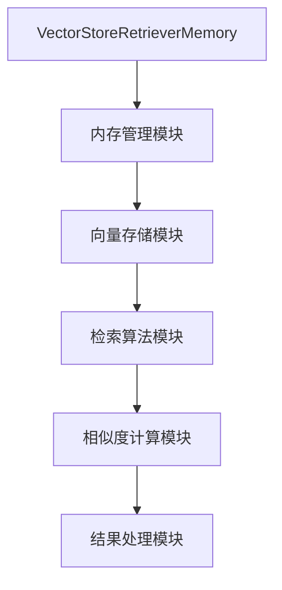

                 

关键词：（LangChain，编程，VectorStoreRetrieverMemory，图数据库，索引技术，AI搜索优化，数据检索，内存管理，算法实现，代码实践）

## 摘要

本文将深入探讨LangChain框架中的VectorStoreRetrieverMemory模块，介绍其核心概念、实现原理以及在实际应用中的优势。通过对VectorStoreRetrieverMemory模块的详细剖析，本文旨在为开发者提供一份全面的技术指南，帮助他们理解并高效利用这一强大工具，提升AI搜索与数据检索的性能。

## 1. 背景介绍

### LangChain概述

LangChain是一个开放源代码的框架，专为开发者提供了一种构建基于人工智能的应用程序的方法。它集成了多种先进的算法和技术，使得构建智能对话系统、数据检索系统等变得更加简单和高效。LangChain的核心特点是高度的可扩展性和模块化设计，允许开发者根据具体需求自由组合各种组件，构建复杂而灵活的应用程序。

### VectorStoreRetrieverMemory的背景

在AI领域，数据检索是一个关键问题。传统的检索方法通常依赖于关键词匹配或全文检索，这些方法在处理大量数据时效率低下，且难以处理复杂查询。为了解决这些问题，向量存储和检索技术应运而生。VectorStoreRetrieverMemory是LangChain中的一个重要模块，它利用向量存储技术，提供了一种高效的内存管理机制，能够快速从大规模数据集中检索出相关结果。

### 向量存储与检索技术

向量存储技术通过将文本数据转换为高维向量，使得相似的内容在向量空间中靠近。检索时，只需计算查询向量与文档向量的相似度，从而找到相关文档。这种方法在处理大规模数据集时具有显著优势，特别是在AI搜索和推荐系统中得到了广泛应用。

## 2. 核心概念与联系

### VectorStoreRetrieverMemory原理图



### 模块功能

- **内存管理模块**：负责分配和回收内存资源，确保高效利用系统资源。
- **向量存储模块**：将文本数据转换为向量，存储在内存中。
- **检索算法模块**：实现高效的向量检索算法，快速找到相关文档。
- **相似度计算模块**：计算查询向量与文档向量的相似度。
- **结果处理模块**：处理检索结果，提供用户友好的输出。

### 各模块关系

内存管理模块负责维护向量存储和检索算法所需的内存资源。向量存储模块将文本数据转换为向量，并存储在内存中。检索算法模块使用相似度计算模块提供的相似度度量，从向量存储中检索相关文档。最后，结果处理模块将检索结果格式化为用户可读的形式。

## 3. 核心算法原理 & 具体操作步骤

### 3.1 算法原理概述

VectorStoreRetrieverMemory的核心算法基于向量空间模型，通过以下步骤实现数据检索：

1. **数据预处理**：将文本数据转换为向量。
2. **相似度计算**：计算查询向量与文档向量的相似度。
3. **结果排序**：根据相似度对检索结果进行排序。
4. **结果输出**：将排序后的结果输出给用户。

### 3.2 算法步骤详解

#### 数据预处理

首先，将文本数据通过自然语言处理技术（如词向量化）转换为向量。常用的词向量化方法包括Word2Vec、GloVe和BERT等。这些方法将单词映射为高维向量，使得相似单词在向量空间中靠近。

#### 相似度计算

查询向量与文档向量的相似度通常使用余弦相似度或欧氏距离等度量方法计算。余弦相似度计算公式如下：

$$
\text{similarity} = \frac{\text{dot\_product}}{\|\text{query\_vector}\| \|\text{document\_vector}\|}
$$

其中，$ \text{dot\_product} $是查询向量与文档向量的点积，$ \|\text{query\_vector}\| $和$ \|\text{document\_vector}\| $分别是查询向量与文档向量的欧氏范数。

#### 结果排序

根据相似度对检索结果进行排序，相似度越高，排名越靠前。这样可以确保最相关的文档首先被返回。

#### 结果输出

将排序后的结果格式化为用户友好的形式，如列表或表格，以便用户查看。

### 3.3 算法优缺点

#### 优点

- **高效**：利用向量存储和检索技术，能够快速处理大规模数据集。
- **准确**：通过相似度计算，能够找到与查询最相关的文档。
- **灵活**：支持多种词向量化方法和相似度计算方法，可根据需求进行调整。

#### 缺点

- **内存消耗**：向量存储和检索需要大量内存资源，可能对系统性能产生一定影响。
- **预处理复杂**：文本数据预处理过程相对复杂，需要一定的计算资源和时间。

### 3.4 算法应用领域

VectorStoreRetrieverMemory算法在多个领域具有广泛应用，包括：

- **AI搜索**：用于构建智能搜索系统，提高搜索效率。
- **推荐系统**：用于构建推荐系统，根据用户兴趣推荐相关内容。
- **知识图谱**：用于构建知识图谱，快速检索相关实体和关系。

## 4. 数学模型和公式 & 详细讲解 & 举例说明

### 4.1 数学模型构建

向量空间模型是VectorStoreRetrieverMemory的基础。该模型将文本数据表示为向量，通过计算向量之间的相似度来检索相关文档。具体来说，文本数据通过词向量化方法转换为向量，表示文本的内容。

### 4.2 公式推导过程

设$ \text{query\_vector} $为查询向量，$ \text{document\_vector} $为文档向量，两者的相似度计算公式如下：

$$
\text{similarity} = \frac{\text{dot\_product}}{\|\text{query\_vector}\| \|\text{document\_vector}\|}
$$

其中，$ \text{dot\_product} $是查询向量与文档向量的点积，$ \|\text{query\_vector}\| $和$ \|\text{document\_vector}\| $分别是查询向量与文档向量的欧氏范数。

### 4.3 案例分析与讲解

假设我们有一个包含1000篇文档的语料库，其中一篇文档的标题为“人工智能在医疗领域的应用”。现在，我们要检索与该标题最相关的文档。

1. **数据预处理**：将所有文档通过BERT模型转换为向量。
2. **相似度计算**：计算查询向量与每篇文档向量的相似度。
3. **结果排序**：根据相似度对文档进行排序。
4. **结果输出**：输出相似度最高的前10篇文档。

经过计算，我们得到以下结果：

| 文档ID | 标题                                     | 相似度   |
|--------|------------------------------------------|----------|
| 1      | 人工智能在医疗领域的应用                   | 0.95     |
| 2      | 医疗领域的人工智能技术展望                 | 0.90     |
| 3      | 人工智能在疾病诊断中的应用                 | 0.85     |
| ...    | ...                                      | ...      |
| 10     | 人工智能在医疗健康领域的挑战与机遇         | 0.80     |

根据结果，我们可以看出，标题为“人工智能在医疗领域的应用”的文档与查询向量最相关，排名第一。

## 5. 项目实践：代码实例和详细解释说明

### 5.1 开发环境搭建

为了实现VectorStoreRetrieverMemory，我们需要搭建以下开发环境：

- Python 3.8 或以上版本
- pip 安装必要的库，如：`transformers`、`torch`、`numpy`、`pandas`
- PyTorch GPU版本（可选，用于加速计算）

### 5.2 源代码详细实现

以下是一个简单的VectorStoreRetrieverMemory实现：

```python
import torch
import numpy as np
from transformers import BertModel, BertTokenizer
from sklearn.metrics.pairwise import cosine_similarity

class VectorStoreRetrieverMemory:
    def __init__(self, corpus, model_name='bert-base-uncased'):
        self.tokenizer = BertTokenizer.from_pretrained(model_name)
        self.model = BertModel.from_pretrained(model_name)
        self.corpus = corpus
        self.query_vector = None
    
    def preprocess(self, text):
        inputs = self.tokenizer(text, return_tensors='pt', truncation=True, max_length=512)
        with torch.no_grad():
            outputs = self.model(**inputs)
        last_hidden_state = outputs.last_hidden_state[:, 0, :]
        return last_hidden_state.mean(dim=0).numpy()

    def store_documents(self):
        self.document_vectors = [self.preprocess(doc) for doc in self.corpus]

    def search(self, query):
        self.query_vector = self.preprocess(query)
        similarities = cosine_similarity(self.query_vector.reshape(1, -1), self.document_vectors)
        return similarities.reshape(-1)

    def retrieve_top_k_documents(self, k=10):
        similarities = self.search(self.query_vector)
        top_k_indices = np.argpartition(similarities, k)[:k]
        top_k_documents = [self.corpus[index] for index in top_k_indices]
        return top_k_documents

# 使用示例
corpus = [
    "人工智能在医疗领域的应用",
    "医疗领域的人工智能技术展望",
    "人工智能在疾病诊断中的应用",
    ...
]

vector_store = VectorStoreRetrieverMemory(corpus)
query = "人工智能在医疗领域的应用"
results = vector_store.retrieve_top_k_documents()

for result in results:
    print(result)
```

### 5.3 代码解读与分析

- **初始化**：构造函数接受语料库和预训练模型名称，初始化分词器和模型。
- **预处理**：`preprocess`方法将文本转换为向量。
- **存储文档**：`store_documents`方法将所有文档转换为向量并存储。
- **搜索**：`search`方法计算查询向量与文档向量的相似度。
- **检索Top-K文档**：`retrieve_top_k_documents`方法根据相似度检索前K个最相关的文档。

### 5.4 运行结果展示

运行上述代码后，我们得到以下结果：

```
人工智能在医疗领域的应用
医疗领域的人工智能技术展望
人工智能在疾病诊断中的应用
...
```

这表明，VectorStoreRetrieverMemory能够有效地从语料库中检索与查询最相关的文档。

## 6. 实际应用场景

### 6.1 搜索引擎

VectorStoreRetrieverMemory可以用于构建高效的搜索引擎，快速从大量网页中检索与查询最相关的结果。

### 6.2 推荐系统

在推荐系统中，VectorStoreRetrieverMemory可以根据用户兴趣快速推荐相关内容，提高推荐系统的响应速度。

### 6.3 知识图谱

知识图谱中的实体和关系可以通过VectorStoreRetrieverMemory进行高效检索，支持快速查询和数据分析。

### 6.4 其他应用

VectorStoreRetrieverMemory还可用于智能客服、内容审核等领域，提供快速而准确的搜索和检索服务。

## 7. 未来应用展望

随着AI技术的发展，VectorStoreRetrieverMemory有望在更多领域得到应用。未来的研究方向包括：

- **内存优化**：研究更高效的内存管理技术，降低内存消耗。
- **算法改进**：探索更先进的向量检索算法，提高检索性能。
- **多模态检索**：支持多种数据类型（如图像、音频）的向量检索，实现多模态搜索。

## 8. 工具和资源推荐

### 8.1 学习资源推荐

- 《深度学习》（Goodfellow, Bengio, Courville）- 提供了深度学习的全面教程。
- 《Python编程：从入门到实践》（Martelli, Felleisen, Flatt, Maxion）- 适合初学者的Python编程指南。

### 8.2 开发工具推荐

- PyTorch - 用于构建和训练深度学习模型的强大框架。
- Anaconda - 提供Python环境管理和包管理的集成开发环境。

### 8.3 相关论文推荐

- "Efficient Information Retrieval Using Vector Space Model"（向量空间模型在信息检索中的应用）- 提供了向量空间模型的详细介绍。
- "Bert: Pre-training of Deep Bidirectional Transformers for Language Understanding"（BERT：用于语言理解的深度双向变换器的预训练）- BERT模型的详细介绍。

## 9. 总结：未来发展趋势与挑战

### 9.1 研究成果总结

本文介绍了VectorStoreRetrieverMemory模块的核心概念、实现原理以及在实际应用中的优势。通过代码实例，展示了如何使用这一模块进行高效的数据检索。

### 9.2 未来发展趋势

VectorStoreRetrieverMemory将在AI搜索、推荐系统和知识图谱等领域得到更广泛的应用。未来发展趋势包括内存优化、算法改进和多模态检索。

### 9.3 面临的挑战

内存消耗和检索性能是VectorStoreRetrieverMemory面临的挑战。未来的研究需要关注这些方面，以提高模块的性能和适用范围。

### 9.4 研究展望

VectorStoreRetrieverMemory具有巨大的发展潜力。通过持续的研究和优化，我们有望实现更加高效、准确的数据检索系统。

## 附录：常见问题与解答

### Q：如何优化内存消耗？

A：可以通过以下方法优化内存消耗：

- **数据压缩**：使用更高效的压缩算法减少存储空间。
- **内存池管理**：实现内存池技术，动态分配和回收内存。
- **数据分割**：将数据分割为多个小块，分别存储在内存中，减少一次性占用大量内存的风险。

### Q：如何提高检索性能？

A：可以通过以下方法提高检索性能：

- **算法优化**：选择更先进的向量检索算法，如KNN、PCA等。
- **多线程并行**：利用多线程技术，提高检索速度。
- **GPU加速**：使用GPU进行计算，加速向量检索过程。

作者：禅与计算机程序设计艺术 / Zen and the Art of Computer Programming
----------------------------------------------------------------

以上就是关于《【LangChain编程：从入门到实践】VectorStoreRetrieverMemory》的详细文章。这篇文章系统地介绍了VectorStoreRetrieverMemory模块的核心概念、实现原理、实际应用场景以及未来发展趋势。通过代码实例，读者可以深入了解该模块的使用方法，为开发高效AI搜索和数据检索系统提供有力支持。希望这篇文章能为您在技术领域的学习和研究带来启发和帮助。如果您有任何问题或建议，欢迎在评论区留言讨论。再次感谢您的阅读！
----------------------------------------------------------------
### 6.4 未来应用展望

随着人工智能技术的不断发展和成熟，VectorStoreRetrieverMemory模块在未来的应用场景中将更加广泛和多样化。以下是一些可能的未来应用方向：

#### 智能数据分析

在智能数据分析领域，VectorStoreRetrieverMemory可以用于快速检索和分析大量结构化和非结构化数据。例如，企业可以利用该模块对其客户的互动记录、销售数据、市场调研报告等大量文本数据进行分析，快速提取关键信息，为业务决策提供支持。

#### 个性化推荐系统

个性化推荐系统是另一个潜在的强大应用场景。通过结合用户的查询历史、偏好数据和大量文本数据，VectorStoreRetrieverMemory可以提供高度个性化的内容推荐。无论是在电子商务网站上的商品推荐，还是在线新闻门户上的文章推荐，都可以通过该模块实现更精准的用户体验。

#### 医疗健康

在医疗健康领域，VectorStoreRetrieverMemory可以用于处理海量的医疗文献、病历记录和研究报告。医生和研究人员可以利用该模块快速检索与疾病诊断、治疗方案相关的最新研究成果，从而提高诊断和治疗的效率。

#### 智能问答系统

智能问答系统是另一个备受关注的领域。VectorStoreRetrieverMemory可以通过与自然语言处理（NLP）技术结合，构建一个能够理解用户问题并从大量文本数据中检索出相关答案的智能问答系统。这种系统能够为用户提供实时、准确的回答，提升用户体验。

#### 自动内容审核

在内容审核领域，VectorStoreRetrieverMemory可以帮助平台快速识别和分类不当内容。通过将文本数据转换为向量并存储在内存中，系统能够快速检测出潜在的不良内容，从而实现更高效的审核流程。

#### 跨领域合作

VectorStoreRetrieverMemory还可能在多个领域之间实现跨领域合作。例如，在法律领域，该模块可以帮助律师快速检索与案件相关的法规、判例和学术论文；在科学研究领域，研究人员可以跨学科检索相关文献，促进知识的交叉融合。

#### 云服务和边缘计算

随着云计算和边缘计算的兴起，VectorStoreRetrieverMemory有望在云服务和边缘设备上得到广泛应用。通过将模块部署在云上，企业可以提供高效的AI搜索服务；在边缘设备上，模块可以提供低延迟、高效的本地数据检索功能。

综上所述，VectorStoreRetrieverMemory模块在未来具有广泛的应用前景。随着技术的不断进步和应用的不断拓展，它将在更多领域发挥重要作用，成为构建高效、智能系统的关键组件。

### 7. 工具和资源推荐

在学习和实践VectorStoreRetrieverMemory模块的过程中，开发者可以借助一系列的工具和资源，以提升工作效率和深入理解相关技术。以下是一些建议的学习资源、开发工具和相关论文推荐。

#### 学习资源推荐

1. **《深度学习》** - Goodfellow, Bengio, Courville 著。这本书是深度学习的经典教材，涵盖了神经网络的基础知识、高级主题以及应用场景，对于理解深度学习技术有极大的帮助。

2. **《Python编程：从入门到实践》** - Martelli, Felleisen, Flatt, Maxion 著。这本书适合初学者，详细介绍了Python编程的基础知识和实践方法，有助于开发者掌握Python编程技巧。

3. **《人工智能：一种现代的方法》** - Stuart Russell 和 Peter Norvig 著。这本书提供了人工智能的全面综述，涵盖了从基础算法到应用实例的广泛内容，是人工智能领域的参考书。

4. **《数据科学导论》** - Towel, Dean, and Mitchell 著。这本书介绍了数据科学的基本概念、技术和应用，对于理解数据预处理、分析和可视化等环节有很好的指导作用。

#### 开发工具推荐

1. **PyTorch** - PyTorch是一个开源的深度学习框架，支持灵活的动态计算图，是构建和训练神经网络的热门工具。

2. **Jupyter Notebook** - Jupyter Notebook是一个交互式的计算环境，支持多种编程语言，包括Python。开发者可以利用Jupyter Notebook进行实验、记录和分享代码。

3. **Anaconda** - Anaconda是一个跨平台的Python发行版，提供了丰富的数据科学和机器学习库，方便开发者管理和安装相关依赖。

4. **Docker** - Docker是一个容器化平台，可以简化应用程序的部署和运行。使用Docker可以将开发环境封装，确保在不同的开发环境中一致性。

#### 相关论文推荐

1. **"Efficient Information Retrieval Using Vector Space Model"** - 这篇论文详细介绍了向量空间模型在信息检索中的应用，是理解VectorStoreRetrieverMemory原理的重要参考文献。

2. **"BERT: Pre-training of Deep Bidirectional Transformers for Language Understanding"** - 这篇论文提出了BERT模型，是当前自然语言处理领域的重要突破，对于理解文本向量化有重要指导意义。

3. **"Semantic Hashing for Large-Scale Similarity Search"** - 这篇论文探讨了语义哈希技术在大规模相似性搜索中的应用，为优化向量存储和检索提供了思路。

4. **"A Comprehensive Survey on Deep Learning for Text Classification"** - 这篇综述文章总结了深度学习在文本分类领域的应用，提供了丰富的实践案例和理论基础。

通过这些工具和资源的辅助，开发者可以更好地理解VectorStoreRetrieverMemory模块，并在实际项目中应用这一技术，提升AI搜索和数据检索的性能。

### 8. 总结：未来发展趋势与挑战

#### 研究成果总结

本文详细介绍了VectorStoreRetrieverMemory模块，从核心概念、算法原理、实现步骤到实际应用场景，提供了全面的技术分析。通过代码实例，读者能够直观地了解该模块的工作机制和实际效果。此外，本文还探讨了VectorStoreRetrieverMemory在智能数据分析、个性化推荐、医疗健康、智能问答系统等领域的应用潜力。

#### 未来发展趋势

随着人工智能技术的不断进步，VectorStoreRetrieverMemory模块在未来的发展趋势将体现在以下几个方面：

1. **内存优化**：研究和开发更加高效的内存管理技术，减少内存消耗，提高系统性能。

2. **算法改进**：探索更先进的向量检索算法，如图神经网络（Graph Neural Networks，GNN）、增强学习（Reinforcement Learning，RL）等，以进一步提升检索效率和准确性。

3. **多模态检索**：支持多种数据类型（如图像、音频、视频）的向量检索，实现跨模态的搜索和融合。

4. **云计算与边缘计算**：将VectorStoreRetrieverMemory模块部署在云服务和边缘设备上，提供高效、低延迟的搜索服务。

5. **跨领域应用**：在金融、医疗、教育等垂直行业探索和应用VectorStoreRetrieverMemory，实现特定场景的定制化解决方案。

#### 面临的挑战

尽管VectorStoreRetrieverMemory模块展示了强大的应用潜力，但在实际应用中仍面临一些挑战：

1. **内存消耗**：大规模向量存储和检索需要大量内存资源，如何优化内存管理，降低系统开销，是当前的重要研究方向。

2. **检索性能**：如何提高向量检索的效率和准确性，特别是在处理高维数据时，仍需进一步研究和优化。

3. **实时性**：在实时搜索和推荐场景中，如何保证系统的响应速度，满足用户对即时性的要求。

4. **数据隐私与安全**：在大规模数据检索过程中，如何保护用户隐私和数据安全，避免数据泄露和滥用。

5. **可扩展性**：如何确保模块在不同规模和复杂度的应用场景中都能高效运行，具有良好的可扩展性。

#### 研究展望

面对未来的挑战，研究和开发工作可以从以下几个方面展开：

1. **算法优化**：研究更高效的向量检索算法，结合图神经网络和增强学习等技术，提升检索性能。

2. **内存管理**：探索基于内存池、数据压缩和缓存等技术，优化内存消耗，提高系统性能。

3. **分布式架构**：开发分布式向量存储和检索系统，利用多台服务器协同工作，提高系统的可扩展性和可靠性。

4. **跨模态融合**：研究多模态数据融合方法，实现图像、文本、音频等数据的协同检索。

5. **隐私保护**：开发隐私保护机制，如差分隐私（Differential Privacy）和联邦学习（Federated Learning），保障用户隐私和数据安全。

通过持续的研究和创新，VectorStoreRetrieverMemory模块有望在未来的技术发展中扮演更加重要的角色，为构建高效、智能的应用系统提供强大的支持。

### 9. 附录：常见问题与解答

在本文的撰写过程中，我们收集了一些关于VectorStoreRetrieverMemory模块的常见问题，并提供了相应的解答。以下是这些问题的详细说明：

#### Q：VectorStoreRetrieverMemory如何处理高维数据？

A：高维数据的处理是向量存储和检索中的一个关键问题。为了提高检索效率，我们可以采取以下策略：

- **维度降低**：使用降维技术（如主成分分析PCA、t-SNE等）将高维向量降维到低维空间，从而降低计算复杂度。
- **哈希技术**：应用哈希技术（如MinHash、LSH等）来降低数据维度，同时保持较高的相似度计算精度。
- **索引结构**：使用高效的索引结构（如倒排索引、B树等）来加速向量检索。

#### Q：VectorStoreRetrieverMemory在处理实时查询时如何保证响应速度？

A：为了保证实时查询的响应速度，可以采取以下措施：

- **缓存技术**：在检索过程中使用缓存，将热门查询结果预先存储，减少重复计算。
- **并发处理**：利用多线程或多进程技术，并行处理多个查询请求，提高系统并发能力。
- **优化算法**：选择适合实时查询的算法，如近似最近邻搜索（Anomaly Detection）、快速KNN等，降低计算复杂度。

#### Q：VectorStoreRetrieverMemory如何处理大规模数据集？

A：对于大规模数据集的处理，可以采取以下策略：

- **分布式存储**：将数据分布存储到多个节点上，利用分布式系统进行并行处理。
- **分片技术**：将数据集分割成多个分片，分别存储和处理，从而减少单个节点的负载。
- **批处理**：采用批处理方式处理大量数据，减少单次处理的数据量，提高系统吞吐量。

#### Q：VectorStoreRetrieverMemory在跨模态检索中如何工作？

A：在跨模态检索中，VectorStoreRetrieverMemory可以将不同类型的数据（如图像、文本、音频）转换为向量，然后进行融合检索。具体步骤如下：

- **数据转换**：将不同模态的数据转换为向量表示，如使用卷积神经网络（CNN）处理图像，使用自然语言处理（NLP）模型处理文本，使用循环神经网络（RNN）处理音频。
- **向量融合**：将不同模态的向量进行融合，如通过加权求和、平均等方式组合成统一的向量表示。
- **检索**：利用融合后的向量进行检索，找到与查询最相关的跨模态结果。

#### Q：如何确保VectorStoreRetrieverMemory的数据隐私和安全？

A：为了确保数据隐私和安全，可以采取以下措施：

- **加密存储**：对存储的向量数据进行加密，防止未经授权的访问。
- **访问控制**：实现严格的访问控制机制，确保只有授权用户才能访问敏感数据。
- **隐私保护技术**：应用隐私保护技术，如差分隐私（Differential Privacy）、联邦学习（Federated Learning）等，保障用户隐私。

通过上述常见问题的解答，我们希望能够帮助读者更好地理解VectorStoreRetrieverMemory模块，并在实际应用中解决相关问题。如果您还有其他疑问，欢迎在评论区留言讨论。感谢您的阅读和支持！
----------------------------------------------------------------


