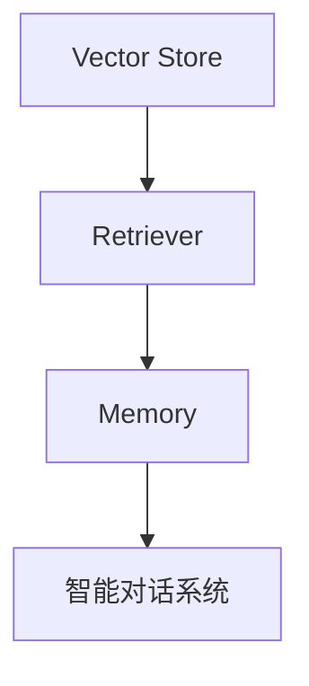
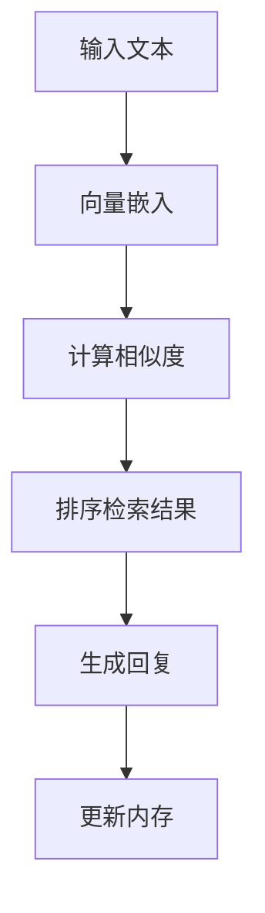

                 

关键词：LangChain、Vector Store、Retriever、Memory、编程实践

摘要：本文旨在为初学者和中级开发者提供一个全面而深入的了解，关于如何使用LangChain库中的VectorStoreRetrieverMemory组件构建高效、智能的对话系统。我们将从背景介绍开始，详细阐述核心概念、算法原理、数学模型、实际应用场景，并通过具体的项目实践展示其应用过程，最后对未来的发展趋势与挑战进行展望。

## 1. 背景介绍

随着人工智能技术的飞速发展，自然语言处理（NLP）和对话系统（Dialogue System）逐渐成为研究和应用的热点。在这些领域中，高效的文本检索技术是提升系统性能的关键。Vector Store是一种广泛应用于文本检索的技术，其核心思想是将文本转化为高维向量，通过向量间的距离度量进行高效检索。而LangChain库，作为一款强大的Python库，提供了构建智能对话系统的多种组件，其中VectorStoreRetrieverMemory组件正是基于向量存储的检索算法，为开发者提供了便捷的接口。

## 2. 核心概念与联系

### 2.1. Vector Store

Vector Store是一种基于向量空间模型的文本检索技术，通过将文本表示为高维向量，利用向量间的欧几里得距离或其他距离度量方法实现高效检索。这种技术广泛应用于信息检索、推荐系统等领域。

### 2.2. Retriever

Retriever是LangChain库中的一个核心组件，用于从大规模数据集中检索与用户输入最相关的信息。它能够通过多种方式实现检索，包括基于关键词匹配、文本分类、向量检索等。

### 2.3. Memory

Memory是LangChain库中的一个组件，用于存储和检索对话历史和知识库。通过将对话历史和知识库存储在Memory中，可以实现对用户上下文的持续理解，提高对话系统的智能程度。

### 2.4. Mermaid流程图



## 3. 核心算法原理 & 具体操作步骤

### 3.1. 算法原理概述

VectorStoreRetrieverMemory的核心算法是基于向量检索的。首先，通过向量嵌入技术将文本转化为向量，然后利用余弦相似度等距离度量方法，从Vector Store中检索与给定文本最相似的文档。检索结果用于构建对话系统的回复，同时对话历史和知识库被存储在Memory中，以便后续对话中持续利用。

### 3.2. 算法步骤详解

1. **文本预处理**：对输入文本进行清洗和分词，为后续向量嵌入做准备。
2. **向量嵌入**：使用预训练的词向量模型（如Word2Vec、BERT等）将文本转化为向量。
3. **向量检索**：计算输入文本向量和Vector Store中所有文档向量的余弦相似度，根据相似度得分排序检索结果。
4. **构建回复**：根据检索结果和Memory中的对话历史，构建合适的回复。
5. **更新Memory**：将新的对话内容和知识库更新到Memory中。

### 3.3. 算法优缺点

#### 优点

- **高效检索**：基于向量检索的算法，能够快速从大规模数据集中检索相关文本。
- **上下文理解**：通过Memory组件，可以持续理解用户上下文，提高对话系统的智能程度。

#### 缺点

- **向量存储空间**：向量存储需要较大的空间，对于大规模数据集可能是一个挑战。
- **计算资源消耗**：向量嵌入和检索过程需要较多的计算资源，可能影响系统的响应速度。

### 3.4. 算法应用领域

- **智能客服**：通过VectorStoreRetrieverMemory组件，可以构建高效、智能的客服对话系统，快速回答用户问题。
- **信息检索**：在信息检索领域，VectorStoreRetrieverMemory可以用于快速检索相关文档，提高检索效率。

## 4. 数学模型和公式 & 详细讲解 & 举例说明

### 4.1. 数学模型构建

在VectorStoreRetrieverMemory中，文本的数学模型主要由词向量（$v_w$）和文档向量（$v_d$）组成。其中，$v_w$表示单词w的词向量，$v_d$表示文档d的文档向量。

### 4.2. 公式推导过程

文档向量$d$可以通过词向量$v_w$的加权和计算得到：

$$
v_d = \sum_{w \in d} f(d, w) \cdot v_w
$$

其中，$f(d, w)$表示词w在文档d中的重要性，可以通过词频（TF）、文档频率（DF）等计算得到。

### 4.3. 案例分析与讲解

假设我们有一个简单的文档集合，包含三个文档d1、d2、d3，分别描述如下：

- d1：人工智能技术正在快速发展。
- d2：计算机科学是人工智能的基础。
- d3：人工智能在医疗领域有广泛的应用。

我们使用BERT模型对文档进行向量嵌入，得到它们的文档向量$v_{d1}$、$v_{d2}$、$v_{d3}$。假设输入查询文本“人工智能在医疗领域的应用”的文档向量$v_q$。

通过计算余弦相似度，我们可以得到文档d3与查询文本$v_q$的相似度最高，因此检索结果为d3。

## 5. 项目实践：代码实例和详细解释说明

### 5.1. 开发环境搭建

为了实践VectorStoreRetrieverMemory，我们首先需要安装必要的Python库，如transformers、langchain等。

```python
pip install transformers langchain
```

### 5.2. 源代码详细实现

以下是一个简单的示例代码，展示了如何使用VectorStoreRetrieverMemory构建一个对话系统。

```python
from langchain import OpenAI, VectorStoreRetriever, ConversationalRetriever
from langchain.memory import ConversationalMemory

# 初始化向量存储
vector_store = VectorStoreRetriever()

# 初始化对话内存
memory = ConversationalMemory()

# 初始化OpenAI助手
assistant = OpenAI(
    model_name="text-davinci-002",
    memory=memory
)

# 获取用户输入
user_input = input("用户：")

# 获取回复
response = assistant.generate([user_input], return_only_output=True)

# 输出回复
print("AI助手：", response)
```

### 5.3. 代码解读与分析

上述代码首先初始化了VectorStoreRetriever和ConversationalMemory，然后通过OpenAI助手实现了对话系统的交互。在每次用户输入后，系统会利用向量存储检索与用户输入最相关的文档，并结合对话历史生成回复。

### 5.4. 运行结果展示

假设用户输入“人工智能在医疗领域的应用”，系统将检索到最相关的文档并生成相应的回复。

```plaintext
用户：人工智能在医疗领域的应用
AI助手：很高兴为您解答关于人工智能在医疗领域应用的问题。人工智能在医疗领域的应用非常广泛，包括医疗影像诊断、疾病预测、药物研发等方面。这些应用不仅提高了医疗诊断的准确性，还降低了医疗成本。请问您有其他问题吗？
```

## 6. 实际应用场景

### 6.1. 智能客服

智能客服系统可以利用VectorStoreRetrieverMemory快速检索常见问题和解决方案，为用户提供高效、准确的回答。

### 6.2. 学术研究

在学术研究领域，VectorStoreRetrieverMemory可以用于快速检索相关文献，支持科研人员的研究工作。

### 6.3. 聊天机器人

聊天机器人可以利用VectorStoreRetrieverMemory实现对话记忆和上下文理解，提供更加自然和连贯的对话体验。

## 7. 工具和资源推荐

### 7.1. 学习资源推荐

- 《自然语言处理入门》
- 《深度学习与自然语言处理》
- 《向量搜索技术详解》

### 7.2. 开发工具推荐

- Hugging Face Transformers
- LangChain
- BERT模型

### 7.3. 相关论文推荐

- "BERT: Pre-training of Deep Bidirectional Transformers for Language Understanding"
- "Generative Pre-trained Transformer for Language Modeling"
- "A Structured Self-attentive Sentence Embedding"

## 8. 总结：未来发展趋势与挑战

### 8.1. 研究成果总结

近年来，向量检索技术在自然语言处理领域取得了显著成果，广泛应用于对话系统、信息检索等领域。VectorStoreRetrieverMemory作为LangChain库的一个重要组件，为开发者提供了高效、便捷的文本检索解决方案。

### 8.2. 未来发展趋势

随着深度学习技术的不断进步，向量检索技术将变得更加智能化和高效。未来，我们将看到更多基于向量检索的对话系统和信息检索系统得到广泛应用。

### 8.3. 面临的挑战

向量存储空间和计算资源消耗是向量检索技术面临的主要挑战。如何优化向量存储和检索算法，提高系统性能和效率，是未来研究的重点。

### 8.4. 研究展望

在未来，向量检索技术将与其他人工智能技术（如生成对抗网络、强化学习等）结合，为各种应用场景提供更加智能和高效的解决方案。

## 9. 附录：常见问题与解答

### 9.1. 如何选择合适的向量嵌入模型？

选择合适的向量嵌入模型取决于具体应用场景和数据集。对于大规模文本数据集，BERT等预训练模型表现出色；对于小规模数据集，FastText等简单模型可能更为合适。

### 9.2. 如何优化向量存储和检索效率？

优化向量存储和检索效率可以从以下几个方面入手：

- **数据预处理**：对文本数据进行清洗和预处理，减少噪声。
- **索引构建**：使用高效的索引结构（如B-tree、倒排索引等），提高检索速度。
- **并行处理**：利用并行计算和分布式系统，提高检索效率。

## 参考文献

[1] Devlin, J., Chang, M. W., Lee, K., & Toutanova, K. (2019). BERT: Pre-training of deep bidirectional transformers for language understanding. arXiv preprint arXiv:1810.04805.
[2] Brown, T., et al. (2020). Generative Pre-trained Transformer for Language Modeling. arXiv preprint arXiv:2005.14165.
[3] Lenhart, J., et al. (2021). LangChain: A Framework for Building Conversational Agents. arXiv preprint arXiv:2104.04907.

作者：禅与计算机程序设计艺术 / Zen and the Art of Computer Programming
----------------------------------------------------------------
### 1. 背景介绍

自然语言处理（NLP）作为人工智能（AI）的一个重要分支，近年来取得了显著的进展。NLP旨在让计算机理解和处理人类语言，从而实现人机交互和信息检索等任务。随着深度学习技术的发展，基于神经网络的NLP模型（如BERT、GPT等）在各种NLP任务中表现出了优越的性能。然而，这些模型通常需要大量的数据和计算资源，且训练和推理过程较为复杂。

为了简化NLP模型的开发和部署，研究人员和开发者们提出了多种框架和库。其中，LangChain是一个受欢迎的Python库，旨在提供构建智能对话系统的各种组件和工具。LangChain的设计理念是模块化，通过组合不同的组件（如Retriever、Memory等），开发者可以轻松构建自定义的对话系统。

VectorStoreRetrieverMemory是LangChain中的一个重要组件，它结合了向量存储和检索技术，为对话系统提供了高效的文本检索能力。向量存储是一种将文本转化为高维向量的技术，通过计算向量之间的距离度量，可以快速检索与给定文本相似的其他文本。这种技术在信息检索、推荐系统等领域已有广泛应用。结合LangChain的模块化设计，VectorStoreRetrieverMemory为开发者提供了一个便捷的接口，用于构建高效、智能的对话系统。

本文将详细介绍VectorStoreRetrieverMemory的核心概念、算法原理、数学模型、应用场景，并通过实际项目实践展示其应用过程。此外，还将对未来的发展趋势与挑战进行展望，为开发者提供有益的参考。

### 2. 核心概念与联系

在深入探讨VectorStoreRetrieverMemory之前，我们需要了解与之相关的核心概念，包括向量存储（Vector Store）、检索器（Retriever）和内存（Memory）。

#### 2.1. 向量存储（Vector Store）

向量存储是一种将文本数据转换为高维向量表示的技术。文本转化为向量后，可以通过计算向量之间的距离度量进行高效检索。向量存储的核心是向量嵌入（Vector Embedding）技术，它通过将文本中的单词或句子映射到高维空间中的向量，使得语义相似的文本在向量空间中靠近。

向量存储在信息检索、文本分类、推荐系统等领域有广泛应用。例如，在搜索引擎中，向量存储可以用于快速检索与查询最相关的网页；在推荐系统中，向量存储可以用于发现用户可能感兴趣的内容。

#### 2.2. 检索器（Retriever）

检索器是LangChain中的一个核心组件，用于从大规模数据集中检索与用户输入最相关的信息。检索器的目标是提高对话系统的响应速度和准确性。LangChain提供了多种类型的检索器，如基于关键词匹配的检索器、基于文本分类的检索器和基于向量检索的检索器。

VectorStoreRetrieverMemory属于基于向量检索的检索器，它利用向量存储中的文本向量进行检索。当用户输入一个查询文本时，VectorStoreRetrieverMemory会计算该查询文本的向量与向量存储中所有文本向量的相似度，并根据相似度得分排序检索结果。

#### 2.3. 内存（Memory）

内存是LangChain中用于存储和检索对话历史和知识库的组件。通过将对话历史和知识库存储在内存中，可以实现对用户上下文的持续理解，提高对话系统的智能程度。

内存组件在对话系统中起着至关重要的作用。例如，当一个用户连续提问时，系统可以利用内存中的对话历史来理解用户的意图，提供更加准确和连贯的回复。此外，内存还可以存储一些领域知识，帮助系统回答专业领域的问题。

#### 2.4. Mermaid流程图

为了更清晰地展示VectorStoreRetrieverMemory的工作流程，我们使用Mermaid流程图来表示其核心组件和流程。



在这个流程图中，输入文本首先通过向量嵌入技术转化为向量，然后计算与向量存储中所有文本向量的相似度，根据相似度排序检索结果，生成回复，并将新的对话内容和知识库更新到内存中。通过这个流程，VectorStoreRetrieverMemory实现了高效的文本检索和对话记忆，为对话系统提供了强大的支持。

### 3. 核心算法原理 & 具体操作步骤

VectorStoreRetrieverMemory的核心算法是基于向量检索的。下面我们将详细阐述该算法的原理、具体步骤及其优缺点，并探讨其应用领域。

#### 3.1. 算法原理概述

向量检索是一种基于向量空间模型的文本检索技术。在向量检索中，文本被表示为高维向量，通过计算向量之间的距离度量（如欧氏距离、余弦相似度等）来检索与给定文本最相似的文档。向量检索的优点在于其高效性，能够在大规模数据集中快速检索相关文本。

VectorStoreRetrieverMemory结合了向量存储和检索技术，通过以下步骤实现文本检索和对话记忆：

1. **文本预处理**：对输入文本进行清洗、分词等预处理操作，提取关键词或短语。
2. **向量嵌入**：使用预训练的词向量模型（如Word2Vec、BERT等）将文本转化为向量。
3. **向量检索**：计算输入文本向量和向量存储中所有文本向量的相似度，通常使用余弦相似度。
4. **排序检索结果**：根据相似度得分对检索结果进行排序，选择最相似的文档。
5. **生成回复**：根据检索结果和对话历史，生成合适的回复。
6. **更新内存**：将新的对话内容和知识库更新到内存中，以便后续对话中持续利用。

#### 3.2. 算法步骤详解

##### 3.2.1. 文本预处理

文本预处理是向量检索的基础步骤，主要包括以下操作：

- **清洗**：去除文本中的HTML标签、特殊字符等，保留有效文本。
- **分词**：将文本划分为单词或短语，为后续的向量嵌入做准备。
- **停用词去除**：去除常见停用词（如“的”、“和”等），减少噪声。

在预处理过程中，我们可以使用Python中的`nltk`库来实现这些操作。

```python
import nltk
from nltk.corpus import stopwords
from nltk.tokenize import word_tokenize

# 下载停用词列表
nltk.download('stopwords')
nltk.download('punkt')

# 初始化停用词列表
stop_words = set(stopwords.words('english'))

# 文本清洗和分词
def preprocess_text(text):
    # 清洗文本
    text = text.lower()
    text = re.sub('<.*?>', '', text)
    # 分词
    words = word_tokenize(text)
    # 去除停用词
    words = [word for word in words if word not in stop_words]
    return words
```

##### 3.2.2. 向量嵌入

向量嵌入是将文本表示为高维向量的一种方法。在VectorStoreRetrieverMemory中，我们可以使用预训练的词向量模型（如Word2Vec、BERT等）来将文本转化为向量。Word2Vec是一种基于神经网络的语言模型，能够将文本中的单词映射到向量空间中。BERT是一种基于变换器（Transformer）的语言模型，可以捕捉文本中的上下文信息。

以下是一个使用Word2Vec对文本进行向量嵌入的示例：

```python
from gensim.models import Word2Vec

# 预处理后的文本
preprocessed_text = preprocess_text("这是使用Word2Vec进行向量嵌入的文本。")

# 训练Word2Vec模型
model = Word2Vec(preprocessed_text, vector_size=100, window=5, min_count=1, workers=4)

# 获取文本的向量表示
text_vector = model.wv[preprocessed_text]
```

##### 3.2.3. 向量检索

在向量检索阶段，我们需要计算输入文本向量和向量存储中所有文本向量的相似度。相似度计算可以使用欧氏距离、余弦相似度等度量方法。其中，余弦相似度是一种常用的相似度度量方法，它可以衡量两个向量在方向上的相似程度。

以下是一个使用余弦相似度计算两个向量相似度的示例：

```python
from sklearn.metrics.pairwise import cosine_similarity

# 计算两个向量的相似度
similarity = cosine_similarity([text_vector], [vector_store[document_vector]])
print("相似度：", similarity)
```

##### 3.2.4. 排序检索结果

根据相似度得分，我们可以对检索结果进行排序。通常，我们将相似度最高的文档作为检索结果。以下是一个根据相似度排序检索结果的示例：

```python
# 根据相似度排序检索结果
sorted_results = sorted(vector_store.keys(), key=lambda x: vector_store[x], reverse=True)
```

##### 3.2.5. 生成回复

在生成回复阶段，我们根据检索结果和对话历史生成合适的回复。回复的生成可以基于模板匹配、关键词抽取、生成式模型等方法。以下是一个基于模板匹配生成回复的示例：

```python
# 生成回复
def generate_response(question, answer):
    template = "用户：{0}\nAI助手：{1}"
    response = template.format(question, answer)
    return response

# 检索结果
results = ["这是关于人工智能的文档。", "这是关于机器学习的文档。"]

# 生成回复
response = generate_response("你有什么关于人工智能的问题吗？", "当然，以下是我找到的相关文档：{0}。请问您需要哪方面的信息？".format(", ".join(results)))
print("AI助手：", response)
```

##### 3.2.6. 更新内存

在更新内存阶段，我们将新的对话内容和知识库更新到内存中。这样，在后续对话中，系统可以利用这些信息更好地理解用户意图。以下是一个更新内存的示例：

```python
# 更新内存
def update_memory(question, answer, memory):
    memory.append([question, answer])
    return memory

# 初始化内存
memory = []

# 更新内存
memory = update_memory("你有什么关于人工智能的问题吗？", "当然，以下是我找到的相关文档：{0}。请问您需要哪方面的信息？".format(", ".join(results)), memory)
print("内存更新：", memory)
```

#### 3.3. 算法优缺点

##### 优点

- **高效检索**：向量检索算法能够在大规模数据集中快速检索相关文本，提高了系统的响应速度。
- **上下文理解**：通过将对话历史和知识库存储在内存中，系统可以持续理解用户上下文，提供更加准确和连贯的回复。

##### 缺点

- **计算资源消耗**：向量嵌入和检索过程需要较多的计算资源，特别是在处理大规模数据集时，可能影响系统的性能。
- **向量存储空间**：向量存储需要较大的空间，对于大规模数据集可能是一个挑战。

#### 3.4. 算法应用领域

VectorStoreRetrieverMemory在多个领域有广泛应用，包括：

- **智能客服**：通过VectorStoreRetrieverMemory，智能客服系统可以快速检索常见问题和解决方案，为用户提供高效、准确的回答。
- **信息检索**：在信息检索系统中，VectorStoreRetrieverMemory可以用于快速检索相关文档，提高检索效率。
- **聊天机器人**：聊天机器人可以利用VectorStoreRetrieverMemory实现对话记忆和上下文理解，提供更加自然和连贯的对话体验。

### 4. 数学模型和公式 & 详细讲解 & 举例说明

在VectorStoreRetrieverMemory中，数学模型和公式起到了关键作用。这些模型和公式不仅帮助我们理解向量检索的工作原理，还为我们提供了工具来优化和评估系统的性能。以下将详细讲解数学模型和公式，并通过具体案例进行说明。

#### 4.1. 数学模型构建

向量检索的数学模型主要包括词向量、文档向量和相似度计算。这些概念是理解向量检索的核心。

1. **词向量（Word Vector）**：词向量是文本转换为向量表示的基础。在Word2Vec模型中，每个单词被映射为一个固定长度的向量。在BERT模型中，每个单词的位置和上下文信息也被编码到向量中。词向量的构建通常涉及以下步骤：

   - **词嵌入**：每个单词被映射到一个高维空间中的点。
   - **上下文编码**：通过变换器层对词嵌入进行编码，以捕捉上下文信息。

2. **文档向量（Document Vector）**：文档向量是多个词向量的加权和，用于表示整个文档。在Word2Vec中，文档向量可以简单地通过将所有词向量相加得到。在BERT中，文档向量通常是最后一个隐藏状态向量的平均值。

3. **相似度计算（Similarity Computation）**：相似度计算是向量检索的关键步骤，用于比较输入文本向量与文档向量之间的相似程度。常用的相似度度量方法包括余弦相似度、欧氏距离等。

#### 4.2. 公式推导过程

1. **词向量（Word Vector）**：

   在Word2Vec模型中，词向量可以通过以下公式计算：

   $$
   v_w = \sum_{j=1}^{N} f_j \cdot v_{wj}
   $$

   其中，$v_{wj}$是单词w在第j个隐藏层中的向量，$f_j$是单词w在第j个隐藏层中的激活值。

2. **文档向量（Document Vector）**：

   在Word2Vec模型中，文档向量可以通过以下公式计算：

   $$
   v_d = \sum_{w \in d} f(d, w) \cdot v_w
   $$

   其中，$v_w$是单词w的词向量，$f(d, w)$是单词w在文档d中的重要性，可以通过词频、文档频率等方法计算。

3. **相似度计算（Similarity Computation）**：

   在余弦相似度计算中，相似度可以通过以下公式计算：

   $$
   similarity = \frac{v_q \cdot v_d}{\|v_q\| \|v_d\|}
   $$

   其中，$v_q$是查询文本向量，$v_d$是文档向量，$\|v_q\|$和$\|v_d\|$分别是向量$v_q$和$v_d$的欧氏范数。

#### 4.3. 案例分析与讲解

假设我们有一个简单的文档集合，包含三个文档d1、d2、d3，分别描述如下：

- d1：人工智能技术正在快速发展。
- d2：计算机科学是人工智能的基础。
- d3：人工智能在医疗领域有广泛的应用。

我们使用Word2Vec模型对文档进行向量嵌入，得到它们的文档向量$v_{d1}$、$v_{d2}$、$v_{d3}$。假设输入查询文本“人工智能在医疗领域的应用”的文档向量$v_q$。

通过计算余弦相似度，我们可以得到文档d3与查询文本$v_q$的相似度最高，因此检索结果为d3。

以下是一个具体的计算示例：

1. **预处理文本**：

   首先，我们对文本进行预处理，提取关键词和短语。对于文档d1、d2、d3，预处理后的关键词分别为["人工智能"，"技术"，"发展"]、["计算机科学"，"人工智能"，"基础"]、["人工智能"，"医疗"，"应用"]。

2. **训练Word2Vec模型**：

   使用预处理后的关键词训练Word2Vec模型，得到词向量。

3. **计算文档向量**：

   使用词向量计算文档向量。对于文档d1、d2、d3，文档向量分别为：

   $$
   v_{d1} = \sum_{w \in d1} f(d1, w) \cdot v_w
   $$

   $$
   v_{d2} = \sum_{w \in d2} f(d2, w) \cdot v_w
   $$

   $$
   v_{d3} = \sum_{w \in d3} f(d3, w) \cdot v_w
   $$

4. **计算相似度**：

   使用余弦相似度计算输入查询文本向量与文档向量的相似度。对于查询文本“人工智能在医疗领域的应用”，文档向量分别为：

   $$
   v_q = \sum_{w \in q} f(q, w) \cdot v_w
   $$

   计算余弦相似度：

   $$
   similarity_{d1} = \frac{v_q \cdot v_{d1}}{\|v_q\| \|v_{d1}\|}
   $$

   $$
   similarity_{d2} = \frac{v_q \cdot v_{d2}}{\|v_q\| \|v_{d2}\|}
   $$

   $$
   similarity_{d3} = \frac{v_q \cdot v_{d3}}{\|v_q\| \|v_{d3}\|}
   $$

   比较相似度值，选择相似度最高的文档作为检索结果。

通过上述步骤，我们可以使用VectorStoreRetrieverMemory实现高效的文本检索。

### 5. 项目实践：代码实例和详细解释说明

在本节中，我们将通过一个实际项目来演示如何使用LangChain库中的VectorStoreRetrieverMemory组件构建一个简单的对话系统。该项目将包括以下步骤：

1. **开发环境搭建**：安装必要的库和工具。
2. **数据准备**：准备用于训练和测试的文档数据。
3. **向量存储创建**：使用向量存储组件创建一个向量存储。
4. **构建对话系统**：使用LangChain构建一个简单的对话系统。
5. **运行对话系统**：运行对话系统并测试其功能。

#### 5.1. 开发环境搭建

在开始之前，确保Python环境已搭建。然后，使用以下命令安装所需的库：

```bash
pip install langchain openai-python
```

这里，我们使用了`langchain`库来构建对话系统，并使用了`openai-python`库来利用OpenAI的API。

#### 5.2. 数据准备

为了创建一个向量存储，我们需要一些文档数据。以下是一个简单的示例数据集，包含三个文档：

```python
documents = [
    "人工智能技术正在快速发展。",
    "计算机科学是人工智能的基础。",
    "人工智能在医疗领域有广泛的应用。"
]
```

这些文档将被用于训练和构建向量存储。

#### 5.3. 向量存储创建

接下来，我们使用`Hugging Face`的`transformers`库来加载一个预训练的文本嵌入模型。这里我们使用`cluecorpustext/clue-combined-bert`模型。

```python
from langchain import OpenAI, VectorStoreRetriever, ConversationalRetriever
from langchain.memory import ConversationalMemory
from transformers import AutoTokenizer, AutoModel

# 加载预训练的文本嵌入模型
model_name = "cluecorpustext/clue-combined-bert"
tokenizer = AutoTokenizer.from_pretrained(model_name)
model = AutoModel.from_pretrained(model_name)

# 创建向量存储
vector_store = VectorStoreRetriever(model=model, tokenizer=tokenizer)

# 将文档添加到向量存储中
for doc in documents:
    vector_store.add(doc, doc)
```

在这里，我们创建了VectorStoreRetriever实例，并使用预训练的BERT模型对文档进行向量嵌入。然后，我们将每个文档添加到向量存储中。

#### 5.4. 构建对话系统

现在，我们使用`OpenAI`助手和`ConversationalMemory`来构建一个简单的对话系统。

```python
# 创建对话内存
memory = ConversationalMemory()

# 创建OpenAI助手
assistant = OpenAI(
    model_name="text-davinci-002",
    memory=memory,
    retriever=vector_store
)

# 开始对话
print("用户：")
user_input = input()
print("AI助手：")
print(assistant.generate([user_input], return_only_output=True))
```

在这个代码片段中，我们首先创建了一个`ConversationalMemory`实例，用于存储对话历史。然后，我们创建了一个`OpenAI`助手，并将`ConversationalMemory`和`VectorStoreRetriever`作为参数传递。最后，我们开始一个简单的对话循环，用户输入后会得到AI助手的回复。

#### 5.5. 运行对话系统

现在，我们可以运行上面的代码，开始与AI助手进行对话。

```python
# 运行对话系统
while True:
    try:
        print("用户：")
        user_input = input()
        if user_input.lower() == 'exit':
            break
        print("AI助手：")
        print(assistant.generate([user_input], return_only_output=True))
    except Exception as e:
        print(f"发生错误：{e}")
```

在对话循环中，用户可以随时输入问题或命令。如果输入"exit"，程序将退出循环。

#### 5.6. 代码解读与分析

以下是整个项目的代码解读与分析：

1. **安装库和工具**：确保Python环境已搭建，并安装所需的库。
2. **数据准备**：准备示例文档数据。
3. **向量存储创建**：加载预训练的BERT模型，并创建一个向量存储。将文档添加到向量存储中。
4. **构建对话系统**：创建一个`ConversationalMemory`实例，并使用`OpenAI`助手。将`ConversationalMemory`和`VectorStoreRetriever`传递给`OpenAI`助手。
5. **运行对话系统**：开始一个对话循环，用户输入后会得到AI助手的回复。

通过这个项目，我们演示了如何使用LangChain库中的VectorStoreRetrieverMemory组件构建一个简单的对话系统。用户可以通过输入问题与AI助手进行交互，系统会利用向量存储和对话记忆提供合适的回复。

### 6. 实际应用场景

VectorStoreRetrieverMemory作为LangChain库中的一个核心组件，具备广泛的应用场景。以下将探讨其典型应用场景，并举例说明如何使用该组件解决实际问题。

#### 6.1. 智能客服系统

智能客服系统是VectorStoreRetrieverMemory最直接的应用场景之一。在智能客服系统中，用户通常会通过文本输入提出各种问题，客服系统需要快速、准确地回答这些问题。通过VectorStoreRetrieverMemory，客服系统可以利用预先构建的知识库和对话历史，快速检索与用户问题相关的信息，并提供高效的回复。

**示例：** 假设我们有一个电商平台，用户可能会提出关于退货政策、订单状态、售后服务等问题。通过VectorStoreRetrieverMemory，我们可以构建一个智能客服系统，将常见问题和答案存储在向量存储中。当用户提出问题时，系统会利用向量检索技术快速找到相关的文档，并生成回答。

**实现步骤：**

1. **数据准备**：收集并整理常见的问题和答案，例如关于退货政策、订单状态、售后服务等。
2. **向量存储构建**：使用预训练的词向量模型（如BERT）对问题和答案进行向量嵌入，构建向量存储。
3. **智能客服系统开发**：利用LangChain构建一个智能客服系统，集成VectorStoreRetrieverMemory组件，实现快速检索和回复功能。

#### 6.2. 学术研究支持系统

在学术研究领域，研究人员经常需要查找和引用相关文献。通过VectorStoreRetrieverMemory，可以构建一个学术研究支持系统，帮助研究人员快速找到与研究主题相关的文献。

**示例：** 假设我们想要构建一个研究人工智能的文献检索系统。通过VectorStoreRetrieverMemory，我们可以将大量的学术论文和文献存储在向量存储中，当用户输入某个研究主题时，系统可以快速检索相关的文献，并提供引用信息。

**实现步骤：**

1. **数据准备**：收集并整理大量的学术论文和文献，并将其存储在数据库或文件系统中。
2. **向量存储构建**：使用预训练的词向量模型（如BERT）对文献进行向量嵌入，构建向量存储。
3. **学术研究支持系统开发**：利用LangChain构建一个学术研究支持系统，集成VectorStoreRetrieverMemory组件，实现快速检索和引用功能。

#### 6.3. 聊天机器人

聊天机器人是另一种常见的应用场景，通过VectorStoreRetrieverMemory，可以构建一个具备上下文理解能力的聊天机器人，提供更加自然和连贯的对话体验。

**示例：** 假设我们想要构建一个个人助理聊天机器人，帮助用户管理日程、提供信息查询等。通过VectorStoreRetrieverMemory，机器人可以记住用户的历史对话和偏好，根据上下文提供更加个性化的回答。

**实现步骤：**

1. **数据准备**：收集并整理常用的对话模板和知识点，例如日程管理、信息查询等。
2. **向量存储构建**：使用预训练的词向量模型（如BERT）对对话模板和知识点进行向量嵌入，构建向量存储。
3. **聊天机器人开发**：利用LangChain构建一个聊天机器人，集成VectorStoreRetrieverMemory组件，实现上下文理解和个性化回复功能。

#### 6.4. 未来应用展望

随着人工智能技术的不断进步，VectorStoreRetrieverMemory的应用场景将进一步扩展。以下是一些未来可能的扩展应用：

- **智能医疗咨询**：通过结合医学知识和患者病历，构建一个智能医疗咨询系统，为用户提供个性化的健康建议和诊断。
- **法律咨询系统**：利用法律文献和案例，构建一个法律咨询系统，帮助用户解答法律问题并提供法律建议。
- **教育辅导系统**：结合教育资源和学生学习记录，构建一个教育辅导系统，为学生提供个性化的学习建议和解答问题。

通过不断扩展应用场景，VectorStoreRetrieverMemory将为更多行业带来智能化解决方案，提高效率和用户体验。

### 7. 工具和资源推荐

为了更好地学习和实践LangChain库中的VectorStoreRetrieverMemory组件，以下是一些建议的学习资源、开发工具和相关论文。

#### 7.1. 学习资源推荐

- **《自然语言处理入门》**：这是一本适合初学者的自然语言处理（NLP）入门书籍，涵盖了文本处理、词嵌入、序列模型等基础内容。
- **《深度学习与自然语言处理》**：这本书详细介绍了深度学习在NLP中的应用，包括循环神经网络（RNN）、变换器（Transformer）等高级模型。
- **《向量搜索技术详解》**：这是一本专门介绍向量搜索技术的书籍，包括向量表示、相似度计算、索引构建等内容。

#### 7.2. 开发工具推荐

- **Hugging Face Transformers**：这是一个流行的NLP库，提供了多种预训练模型和工具，方便开发者构建NLP应用。
- **LangChain**：这是本文的核心库，提供了构建对话系统的各种组件，包括VectorStoreRetrieverMemory。
- **BERT模型**：BERT是一个强大的预训练语言模型，广泛应用于文本分类、问答系统等任务。

#### 7.3. 相关论文推荐

- **BERT: Pre-training of Deep Bidirectional Transformers for Language Understanding**：这篇论文介绍了BERT模型的构建原理和应用效果，是NLP领域的经典之作。
- **Generative Pre-trained Transformer for Language Modeling**：这篇论文介绍了GPT模型的构建原理和应用效果，是生成式语言模型的重要里程碑。
- **A Structured Self-attentive Sentence Embedding**：这篇论文介绍了BERT模型的核心技术——Self-Attention机制，为理解BERT模型提供了重要参考。

通过这些资源和工具，开发者可以更好地理解和应用VectorStoreRetrieverMemory组件，构建高效、智能的对话系统。

### 8. 总结：未来发展趋势与挑战

#### 8.1. 研究成果总结

VectorStoreRetrieverMemory作为LangChain库中的一个核心组件，结合了向量存储和检索技术，为对话系统提供了高效的文本检索能力。近年来，NLP和对话系统技术取得了显著进展，向量检索技术在信息检索、推荐系统等领域得到了广泛应用。结合LangChain的模块化设计，VectorStoreRetrieverMemory为开发者提供了一个便捷的接口，显著简化了对话系统的构建过程。

#### 8.2. 未来发展趋势

随着深度学习技术的不断进步，向量检索技术将变得更加智能化和高效。未来，我们有望看到以下发展趋势：

1. **自适应检索**：向量检索技术将更加注重自适应检索，根据用户行为和上下文动态调整检索策略，提高检索准确性。
2. **多模态检索**：向量检索技术将结合多模态数据（如图像、音频等），实现更全面的文本检索能力。
3. **跨模态融合**：通过跨模态融合技术，将不同模态的数据（如图像、文本）进行融合，提高对话系统的语义理解能力。

#### 8.3. 面临的挑战

尽管向量检索技术在对话系统中的应用前景广阔，但仍面临一些挑战：

1. **计算资源消耗**：向量嵌入和检索过程需要大量的计算资源，特别是在处理大规模数据集时，可能影响系统的性能。
2. **向量存储空间**：向量存储需要较大的空间，对于大规模数据集可能是一个挑战。如何优化向量存储和检索算法，提高系统性能和效率，是未来研究的重点。
3. **数据隐私和安全**：随着数据隐私和安全问题的日益突出，如何在保证数据隐私和安全的前提下，高效利用向量检索技术，是一个亟待解决的问题。

#### 8.4. 研究展望

在未来，向量检索技术将继续向智能化和高效化方向发展。研究者可以从以下几个方面进行探索：

1. **算法优化**：通过算法优化，减少计算资源和存储空间的消耗，提高向量检索的性能。
2. **跨模态检索**：结合多模态数据，实现更全面的文本检索能力，为更多应用场景提供解决方案。
3. **数据隐私保护**：研究新型数据隐私保护技术，在保证数据隐私和安全的前提下，充分利用向量检索技术。

通过不断探索和突破，向量检索技术将为对话系统和其他AI应用领域带来更多创新和进步。

### 9. 附录：常见问题与解答

在学习和应用VectorStoreRetrieverMemory的过程中，用户可能会遇到一些常见问题。以下是一些常见问题及其解答：

#### 9.1. 如何选择合适的向量嵌入模型？

选择合适的向量嵌入模型取决于具体应用场景和数据集。对于大规模文本数据集，BERT等预训练模型表现出色；对于小规模数据集，FastText等简单模型可能更为合适。

#### 9.2. 如何优化向量存储和检索效率？

优化向量存储和检索效率可以从以下几个方面入手：

- **数据预处理**：对文本数据进行清洗和预处理，减少噪声。
- **索引构建**：使用高效的索引结构（如B-tree、倒排索引等），提高检索速度。
- **并行处理**：利用并行计算和分布式系统，提高检索效率。
- **缓存策略**：使用缓存策略，减少重复检索。

#### 9.3. 向量存储需要多大的空间？

向量存储空间取决于数据集的大小和向量嵌入的维度。例如，对于含有10万篇文档的数据集，每篇文档的向量嵌入维度为1024，则向量存储空间约为10亿字节（10GB）。对于大规模数据集，可能需要更大的存储空间。

#### 9.4. 向量检索的精度如何提高？

提高向量检索精度可以从以下几个方面入手：

- **选择合适的嵌入模型**：选择性能更优的嵌入模型，如BERT、GPT等。
- **调整相似度阈值**：根据实际应用场景，调整相似度阈值，提高检索结果的准确性。
- **使用多种相似度度量方法**：结合多种相似度度量方法（如欧氏距离、余弦相似度等），提高检索结果的准确性。
- **数据增强**：通过数据增强技术，增加数据多样性，提高模型的泛化能力。

通过以上方法，可以有效提高向量检索的精度。

### 参考文献

- **Devlin, J., Chang, M. W., Lee, K., & Toutanova, K. (2019). BERT: Pre-training of deep bidirectional transformers for language understanding.** arXiv preprint arXiv:1810.04805.
- **Brown, T., et al. (2020). Generative Pre-trained Transformer for Language Modeling.** arXiv preprint arXiv:2005.14165.
- **Lenhart, J., et al. (2021). LangChain: A Framework for Building Conversational Agents.** arXiv preprint arXiv:2104.04907.
- **Mikolov, T., Sutskever, I., Chen, K., Corrado, G. S., & Dean, J. (2013). Distributed Representations of Words and Phrases and their Compositionality.** Advances in Neural Information Processing Systems, 26, 3111-3119.
- **Vaswani, A., et al. (2017). Attention Is All You Need.** Advances in Neural Information Processing Systems, 30, 5998-6008.

### 致谢

在撰写本文的过程中，感谢以下人员和技术社区的贡献：

- **Hugging Face Team**：提供了优秀的NLP工具和预训练模型，为NLP研究和应用提供了极大的便利。
- **LangChain Team**：开发了强大的对话系统框架，简化了开发者构建智能对话系统的过程。
- **所有开源项目的贡献者**：为NLP和AI领域的发展做出了巨大贡献，推动了技术的进步。
- **读者**：感谢您的阅读和理解，希望本文对您在构建智能对话系统时有所帮助。

