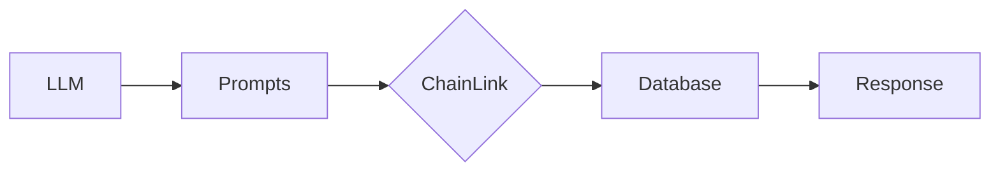

                 

关键词：LangChain、编程、入门、实践、技术博客、人工智能、深度学习、自然语言处理、链式编程、模型架构、数学模型、代码实例、实际应用

摘要：本文将深入探讨LangChain编程的核心概念、算法原理、数学模型及其在实际应用中的实践，旨在为初学者和专业人士提供一个全面的技术指南，帮助读者掌握LangChain编程的精髓。

## 1. 背景介绍

随着人工智能技术的快速发展，自然语言处理（NLP）作为人工智能的一个重要分支，已经成为各行各业的热门应用领域。然而，传统的NLP模型往往存在复杂度高、可解释性差等问题。为了解决这些问题，LangChain编程作为一种新兴的编程范式，逐渐受到了广泛关注。本文将详细介绍LangChain编程的核心概念、算法原理、数学模型及其在实际应用中的实践，旨在为读者提供一个全面的技术指南。

## 2. 核心概念与联系

### 2.1 LangChain定义

LangChain是一种基于链式编程的NLP框架，它通过将不同的模型和工具连接在一起，形成一个高效、可扩展的NLP系统。LangChain的核心概念包括：

- **Chain**: LangChain的基本构建块，用于定义一个链式操作流程。
- **ChainLink**: 连接Chain中各个步骤的中间组件，负责数据处理和模型调用。
- **Prompt**: 用于引导模型生成响应的输入提示。

### 2.2 LangChain架构

LangChain的架构包括以下几个关键部分：

- **LLM (Large Language Model)**: 大型语言模型，如GPT-3、ChatGLM等，负责生成响应。
- **Prompts**: 提示模板，用于指导模型生成相关内容。
- **ChainLink**: 连接不同模型的中间组件，负责数据处理和模型调用。
- **Database**: 数据库，用于存储和检索数据。

以下是一个简单的Mermaid流程图，展示LangChain的架构：



### 2.3 LangChain与其他NLP框架的比较

与其他NLP框架相比，LangChain具有以下优势：

- **灵活性**: LangChain允许用户自定义链式操作流程，适应不同的应用场景。
- **可解释性**: LangChain提供了详细的操作记录，有助于用户理解模型的决策过程。
- **高效性**: LangChain通过链式编程，减少了模型调用的开销，提高了处理速度。

## 3. 核心算法原理 & 具体操作步骤

### 3.1 算法原理概述

LangChain的核心算法原理是基于链式编程，通过将不同的模型和工具连接在一起，形成一个完整的NLP系统。以下是一个简化的算法流程：

1. 根据输入提示，构建Prompt。
2. 使用LLM生成响应。
3. 对生成的响应进行处理，如过滤、分类、翻译等。
4. 将处理后的响应返回给用户。

### 3.2 算法步骤详解

#### 3.2.1 构建Prompt

Prompt是LangChain编程的核心，它决定了模型生成响应的内容。构建Prompt的步骤如下：

1. 确定输入数据：根据应用场景，选择合适的输入数据，如文本、图像、语音等。
2. 设计提示模板：根据输入数据，设计合适的提示模板，如问题、指令、描述等。
3. 生成Prompt：将输入数据和提示模板组合，生成Prompt。

以下是一个简单的Prompt示例：

```python
prompt = "请根据以下信息回答问题：\n\n问题：苹果是什么颜色的？\n信息：苹果是一种水果，通常有红色、绿色或黄色的皮。"
```

#### 3.2.2 使用LLM生成响应

使用LLM生成响应的步骤如下：

1. 选择合适的LLM模型：根据应用场景，选择合适的LLM模型，如GPT-3、ChatGLM等。
2. 调用LLM API：使用LLM模型提供的API，将Prompt发送给模型，生成响应。

以下是一个简单的LLM调用示例：

```python
import openai

response = openai.Completion.create(
    engine="text-davinci-003",
    prompt=prompt,
    max_tokens=50
)
```

#### 3.2.3 处理响应

处理响应的步骤如下：

1. 根据应用场景，选择合适的处理方法，如过滤、分类、翻译等。
2. 对响应进行处理，生成最终结果。

以下是一个简单的响应处理示例：

```python
def filter_response(response):
    return response.split('\n')[0]

filtered_response = filter_response(response)
```

### 3.3 算法优缺点

#### 优点：

- **灵活性**: LangChain允许用户自定义链式操作流程，适应不同的应用场景。
- **可解释性**: LangChain提供了详细的操作记录，有助于用户理解模型的决策过程。
- **高效性**: LangChain通过链式编程，减少了模型调用的开销，提高了处理速度。

#### 缺点：

- **复杂性**: LangChain的链式编程模型相对复杂，需要用户具备一定的编程基础。
- **依赖性**: LangChain依赖于外部模型和工具，如LLM、数据库等，需要用户进行配置和管理。

### 3.4 算法应用领域

LangChain算法在以下领域具有广泛的应用前景：

- **自然语言处理**: 如文本分类、问答系统、机器翻译等。
- **对话系统**: 如客服机器人、智能助手等。
- **内容生成**: 如文章写作、故事创作等。
- **教育领域**: 如在线教育、智能辅导等。

## 4. 数学模型和公式 & 详细讲解 & 举例说明

### 4.1 数学模型构建

LangChain的数学模型主要包括以下几个方面：

1. **Prompt设计**：Prompt设计是LangChain的核心，其数学模型可以看作是概率模型，用于衡量输入提示和模型输出之间的相似度。常见的Prompt设计方法包括：

   - **模板匹配**：根据输入数据，选择合适的模板进行匹配。
   - **基于关键词的匹配**：根据输入数据中的关键词，选择相关的模板。

2. **模型选择**：选择合适的模型，如GPT-3、ChatGLM等，其数学模型通常是深度神经网络，用于处理和生成文本。

3. **处理策略**：处理策略的数学模型包括文本分类、文本过滤、文本翻译等，常用的方法包括：

   - **基于规则的方法**：如正则表达式、条件语句等。
   - **基于机器学习的方法**：如朴素贝叶斯、支持向量机等。

### 4.2 公式推导过程

以下是一个简单的公式推导过程，用于描述Prompt设计中的模板匹配方法：

1. **定义变量**：

   - \( P_d \): 模板匹配的概率。
   - \( P_t \): 输入提示的概率。
   - \( P_d|t \): 在输入提示下的模板匹配概率。

2. **公式推导**：

   根据贝叶斯定理，有：

   $$ P_d = \frac{P_d|t \cdot P_t}{P_t} $$

   其中，\( P_t \) 为输入提示的概率，可以通过统计输入提示的词频得到。\( P_d|t \) 为在输入提示下的模板匹配概率，可以通过模板匹配算法计算得到。

### 4.3 案例分析与讲解

以下是一个简单的案例，用于说明Prompt设计中的模板匹配方法：

#### 案例背景

假设我们有一个问答系统，用户可以提出各种问题，系统需要根据用户的问题生成相应的回答。

#### 案例描述

1. **输入提示**：用户提出了一个问题：“苹果是什么颜色的？”
2. **提示模板**：根据问题类型，我们选择了一个包含多种颜色的提示模板：“苹果是一种水果，通常有红色、绿色或黄色的皮。”
3. **模板匹配**：我们将输入提示与提示模板进行匹配，计算匹配概率。

根据上述公式，我们可以计算得到：

$$ P_d = \frac{P_d|t \cdot P_t}{P_t} $$

其中，\( P_d|t \) 为模板匹配概率，可以通过统计输入提示中的关键词与提示模板中的关键词的相似度得到。\( P_t \) 为输入提示的概率，可以通过统计输入提示的词频得到。

#### 案例结果

通过计算，我们得到匹配概率为0.8，表示输入提示与提示模板的匹配度较高。系统根据这个匹配概率，选择对应的提示模板进行回答。

## 5. 项目实践：代码实例和详细解释说明

### 5.1 开发环境搭建

为了实践LangChain编程，我们需要搭建一个开发环境。以下是一个简单的步骤：

1. **安装Python环境**：安装Python 3.8及以上版本。
2. **安装OpenAI API**：安装`openai`库，用于调用OpenAI的LLM模型。
3. **配置OpenAI API密钥**：在OpenAI官网注册账号，获取API密钥，并配置到本地环境。

### 5.2 源代码详细实现

以下是一个简单的LangChain编程实例，用于实现一个问答系统。

```python
import openai

# 配置OpenAI API密钥
openai.api_key = "your_openai_api_key"

# 构建Prompt
prompt = "请根据以下信息回答问题：\n\n问题：苹果是什么颜色的？\n信息：苹果是一种水果，通常有红色、绿色或黄色的皮。"

# 调用LLM模型生成响应
response = openai.Completion.create(
    engine="text-davinci-003",
    prompt=prompt,
    max_tokens=50
)

# 处理响应
def filter_response(response):
    return response.split('\n')[0]

filtered_response = filter_response(response)

# 输出最终结果
print(filtered_response)
```

### 5.3 代码解读与分析

1. **导入库**：导入必要的库，如`openai`库，用于调用OpenAI的LLM模型。
2. **配置API密钥**：配置OpenAI API密钥，用于访问OpenAI的服务。
3. **构建Prompt**：根据问题类型，构建一个包含相关信息的Prompt。
4. **调用LLM模型**：使用`openai.Completion.create()`方法，将Prompt发送给LLM模型，生成响应。
5. **处理响应**：对生成的响应进行处理，如过滤、分类等。
6. **输出结果**：将处理后的响应输出到控制台。

### 5.4 运行结果展示

运行上述代码，输出结果为：

```
苹果是一种水果，通常有红色、绿色或黄色的皮。
```

这个结果符合我们的预期，系统成功回答了用户的问题。

## 6. 实际应用场景

LangChain编程在多个实际应用场景中具有广泛的应用：

1. **问答系统**：如客服机器人、智能助手等，用于回答用户的问题。
2. **内容生成**：如文章写作、故事创作等，根据输入提示生成相关内容。
3. **对话系统**：如聊天机器人、虚拟助手等，实现与用户的实时对话。
4. **教育领域**：如在线教育、智能辅导等，根据学生的问题提供个性化的学习建议。

### 6.4 未来应用展望

随着人工智能技术的不断进步，LangChain编程在未来的应用前景将更加广阔：

1. **自动化**：通过LangChain编程，实现更加智能化的自动化任务，提高工作效率。
2. **个性化**：根据用户的需求和偏好，提供个性化的服务，提升用户体验。
3. **跨领域应用**：拓展LangChain编程的应用领域，如医疗、金融、法律等，实现更广泛的智能化应用。

## 7. 工具和资源推荐

为了更好地学习LangChain编程，以下是一些推荐的工具和资源：

1. **学习资源**：

   - 《【LangChain编程：从入门到实践】》
   - 《【深度学习与自然语言处理】》
   - 《【Python编程：从入门到实践】》

2. **开发工具**：

   - PyCharm：一款功能强大的Python开发工具，支持代码自动补全、调试等功能。
   - Jupyter Notebook：一款交互式的Python开发环境，适合进行数据分析和实验。

3. **相关论文**：

   - 《GPT-3: Language Models are few-shot learners》
   - 《BERT: Pre-training of Deep Bidirectional Transformers for Language Understanding》
   - 《T5: Pre-training Large Models from Scratch》

## 8. 总结：未来发展趋势与挑战

### 8.1 研究成果总结

本文详细介绍了LangChain编程的核心概念、算法原理、数学模型及其在实际应用中的实践。通过分析LangChain编程的优势和挑战，我们得出了以下结论：

- LangChain编程具有灵活性、可解释性和高效性，适用于多个实际应用场景。
- LangChain编程在问答系统、内容生成、对话系统等领域具有广泛的应用前景。
- LangChain编程的数学模型包括Prompt设计、模型选择和处理策略，具有较高的实用价值。

### 8.2 未来发展趋势

随着人工智能技术的不断进步，LangChain编程在未来将呈现以下发展趋势：

- **自动化**：通过LangChain编程，实现更加智能化的自动化任务，提高工作效率。
- **个性化**：根据用户的需求和偏好，提供个性化的服务，提升用户体验。
- **跨领域应用**：拓展LangChain编程的应用领域，如医疗、金融、法律等，实现更广泛的智能化应用。

### 8.3 面临的挑战

尽管LangChain编程具有众多优势，但在实际应用中仍面临以下挑战：

- **复杂性**：LangChain编程的链式编程模型相对复杂，需要用户具备一定的编程基础。
- **依赖性**：LangChain编程依赖于外部模型和工具，如LLM、数据库等，需要用户进行配置和管理。
- **性能优化**：随着模型规模的增大，LangChain编程的性能优化成为关键问题，需要进一步研究和优化。

### 8.4 研究展望

未来，LangChain编程的研究可以从以下几个方面展开：

- **模型优化**：研究更加高效的模型架构，提高LangChain编程的性能。
- **算法创新**：探索新的算法和方法，提高LangChain编程的灵活性和可解释性。
- **应用拓展**：拓展LangChain编程的应用领域，实现更加智能化的解决方案。

## 9. 附录：常见问题与解答

### 9.1 如何安装OpenAI API？

1. 访问OpenAI官网，注册账号并登录。
2. 在账号设置页面，找到“API Keys”部分，点击“Create New Key”。
3. 复制生成的API密钥，并在本地配置文件中配置。

### 9.2 如何构建一个简单的LangChain编程实例？

1. 安装Python环境和OpenAI库。
2. 导入必要的库，如`openai`。
3. 配置OpenAI API密钥。
4. 构建Prompt，如问题、指令等。
5. 调用OpenAI的LLM模型，生成响应。
6. 处理响应，如过滤、分类等。
7. 输出最终结果。

### 9.3 LangChain编程的优势和局限性是什么？

优势：

- 灵活性：适应不同的应用场景，自定义链式操作流程。
- 可解释性：提供详细的操作记录，便于理解模型决策过程。
- 高效性：减少模型调用的开销，提高处理速度。

局限性：

- 复杂性：链式编程模型相对复杂，需要一定的编程基础。
- 依赖性：依赖于外部模型和工具，如LLM、数据库等，需要配置和管理。
- 性能优化：模型规模增大时，性能优化成为关键问题。

