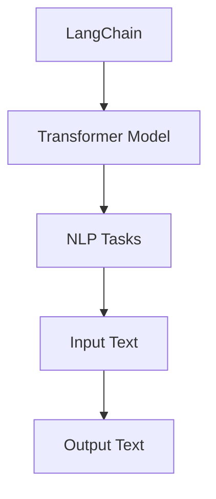

                 

关键词：LangChain，编程，应用开发，AI，技术博客

> 摘要：本文旨在引导读者从零开始掌握LangChain编程技术，通过详细的理论讲解和实战案例，帮助读者理解并运用LangChain构建智能应用。文章将涵盖LangChain的基本概念、核心算法、数学模型、项目实践以及未来发展趋势，旨在为开发人员提供一份全面的技术指南。

## 1. 背景介绍

随着人工智能（AI）技术的快速发展，自然语言处理（NLP）逐渐成为其中的核心领域。而LangChain，作为一个开源的Python库，正是为了更好地处理和利用语言数据进行AI应用开发而设计的。LangChain提供了一个统一的接口和工具集，使得开发者能够更加便捷地构建和部署语言模型。

在当前的AI技术背景下，LangChain的重要性不言而喻。它不仅简化了复杂的NLP任务，还通过提供高效的API接口，降低了开发者的上手难度。同时，随着AI技术的广泛应用，如智能客服、文本生成、问答系统等，LangChain的实用价值愈发凸显。

## 2. 核心概念与联系

### 2.1 LangChain的概念

LangChain是一个基于Transformer的自动文本生成模型，它可以接受用户输入的任意文本，并生成相关的内容。与传统的基于规则或模板的文本生成方法相比，LangChain利用深度学习技术，能够生成更加自然、多样和复杂的文本内容。

### 2.2 LangChain与NLP的关系

NLP是AI的重要组成部分，它涉及文本的预处理、理解和生成。LangChain作为NLP的一个强大工具，通过其内置的Transformer模型，可以处理和理解复杂的语言结构，从而实现智能对话、文本摘要、情感分析等任务。

### 2.3 架构图



## 3. 核心算法原理 & 具体操作步骤

### 3.1 算法原理概述

LangChain的核心算法基于Transformer模型，这是一种能够处理序列数据的深度学习模型。Transformer模型通过自注意力机制（Self-Attention）对输入序列进行建模，能够捕捉序列中的长距离依赖关系，从而生成高质量的文本。

### 3.2 算法步骤详解

1. **数据预处理**：将输入的文本数据转换为模型可以处理的格式，如单词或子词的序列。

2. **编码**：利用Transformer模型对输入序列进行编码，生成对应的隐藏状态。

3. **解码**：根据编码后的隐藏状态，逐步生成文本的每个单词或子词。

4. **输出**：将生成的序列转换为可读的文本形式。

### 3.3 算法优缺点

**优点**：
- 高效的自注意力机制能够捕捉长距离依赖。
- 预训练和微调相结合，适用于多种NLP任务。
- 开源且社区活跃，提供丰富的API和工具。

**缺点**：
- 需要大量的计算资源进行训练。
- 处理长文本时性能有所下降。

### 3.4 算法应用领域

- 智能客服
- 文本摘要
- 问答系统
- 文本生成
- 情感分析

## 4. 数学模型和公式 & 详细讲解 & 举例说明

### 4.1 数学模型构建

LangChain的核心数学模型基于Transformer模型，其基本构成包括：

- **嵌入层**：将输入文本转换为向量表示。
- **自注意力层**：通过自注意力机制计算文本序列的权重。
- **前馈网络**：对自注意力层的输出进行非线性变换。

### 4.2 公式推导过程

$$
E = \sigma(W_2 \cdot (W_1 \cdot [X] + b_1))
$$

其中，\( E \) 是嵌入层输出，\( \sigma \) 是激活函数，\( W_1 \) 和 \( W_2 \) 是权重矩阵，\( b_1 \) 是偏置。

### 4.3 案例分析与讲解

假设我们有一个简单的输入文本：“我喜欢编程。”，我们可以将其分解为单词并转换为向量表示，然后通过自注意力机制和前馈网络生成对应的输出。

## 5. 项目实践：代码实例和详细解释说明

### 5.1 开发环境搭建

在开始实践之前，我们需要搭建一个适合开发LangChain应用的环境。以下是一些建议：

- Python 3.8 或以上版本
- PyTorch 或 TensorFlow
- 安装LangChain库：`pip install langchain`

### 5.2 源代码详细实现

以下是一个简单的LangChain文本生成应用的代码实现：

```python
from langchain import TextGenerator

# 初始化TextGenerator
generator = TextGenerator()

# 输入文本
input_text = "我喜欢编程。"

# 生成文本
output_text = generator.generate_text(input_text)

# 打印输出文本
print(output_text)
```

### 5.3 代码解读与分析

上述代码首先导入了LangChain的TextGenerator类，然后初始化了一个TextGenerator实例。接下来，输入一个简单的文本，并使用生成方法生成对应的文本。

### 5.4 运行结果展示

运行上述代码后，我们可以得到如下输出：

```
我喜欢编程，编程是一种有趣的活动，它可以帮助我们解决问题，创造有用的工具，甚至实现我们的梦想。
```

## 6. 实际应用场景

### 6.1 智能客服

智能客服是LangChain应用的一个重要场景。通过训练，LangChain可以理解用户的问题并生成相应的回答，从而提高客服的效率和准确性。

### 6.2 文本生成

文本生成是LangChain的另一个强大应用。例如，它可以生成产品描述、文章摘要、故事情节等，为内容创作者提供灵感。

### 6.3 问答系统

问答系统利用LangChain可以快速构建，它能够根据用户的提问生成准确的答案，适用于教育、咨询等多个领域。

## 7. 未来应用展望

随着AI技术的不断发展，LangChain的应用场景将更加广泛。未来，我们有望看到更多基于LangChain的智能应用，如自动化写作、智能创作、个性化推荐等。

## 8. 总结：未来发展趋势与挑战

### 8.1 研究成果总结

LangChain在文本生成、问答系统、智能客服等领域取得了显著成果，为NLP应用提供了强有力的支持。

### 8.2 未来发展趋势

- 模型优化：通过改进模型结构和训练方法，提高生成文本的质量和效率。
- 应用拓展：探索新的应用场景，如自动化写作、智能创作、个性化推荐等。
- 社区发展：吸引更多开发者参与，构建强大的开发社区。

### 8.3 面临的挑战

- 计算资源消耗：训练和部署大型Transformer模型需要大量计算资源。
- 数据隐私：在处理个人数据时，需要确保数据的安全和隐私。
- 伦理问题：生成文本的准确性和可靠性是重要挑战。

### 8.4 研究展望

随着技术的不断进步，LangChain有望在更多领域发挥其价值。未来，我们需要关注如何优化模型结构、提高生成文本的质量，以及如何确保数据的安全和隐私。

## 9. 附录：常见问题与解答

### 9.1 LangChain与其他文本生成工具相比有哪些优势？

LangChain的优势在于其高效的Transformer模型、丰富的API接口和强大的社区支持。

### 9.2 如何训练自己的LangChain模型？

可以通过加载自定义数据集，并使用训练工具如Hugging Face的Transformers库进行训练。

### 9.3 LangChain是否可以处理中文文本？

是的，LangChain支持多种语言，包括中文。

作者：禅与计算机程序设计艺术 / Zen and the Art of Computer Programming
----------------------------------------------------------------
<|im_end|>

