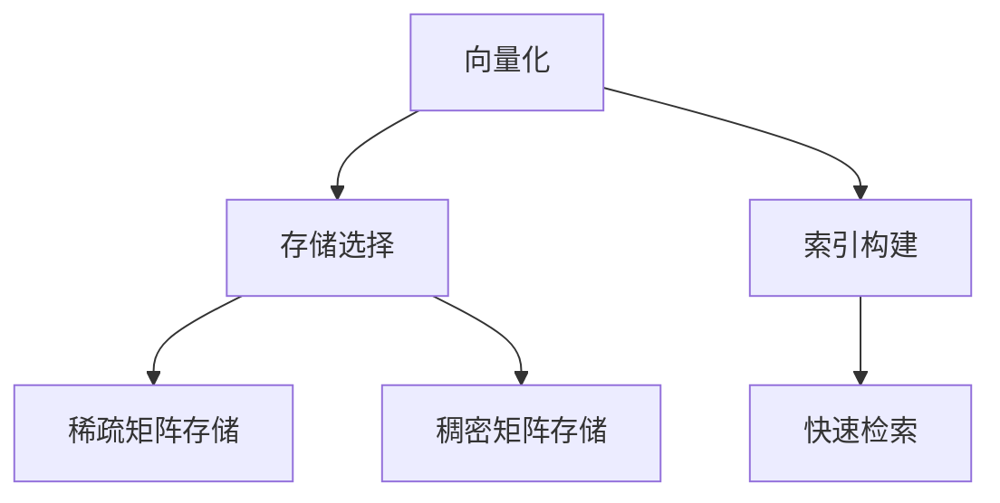

                 

关键词：LangChain, 编程，向量存储，自然语言处理，机器学习，AI应用

摘要：本文将深入探讨LangChain中的向量存储技术，从基础知识、算法原理、数学模型到实际应用，全面解析向量存储在自然语言处理和机器学习中的重要性，并展示其如何通过代码实例和详细解释，帮助开发者构建高效的AI应用。

## 1. 背景介绍

向量存储技术在自然语言处理（NLP）和机器学习（ML）领域扮演着至关重要的角色。随着大数据和AI技术的飞速发展，如何高效地存储和检索大量的文本数据，成为了研究人员和开发者必须面对的挑战。向量存储技术通过将文本数据转化为向量形式，不仅提高了数据的存储效率，还显著提升了数据处理的速度和准确度。

LangChain作为一个强大的AI框架，其核心优势之一便是能够充分利用向量存储技术。本文将详细介绍LangChain中的向量存储机制，帮助开发者理解和运用这一关键技术，提升AI应用的开发效率和性能。

## 2. 核心概念与联系

### 2.1 向量存储基础

向量存储技术主要基于向量和矩阵数学。在NLP和ML领域，文本数据通常被表示为高维向量，例如词向量或文档向量。这些向量不仅能够表示文本的语义信息，还可以用于高效的存储和检索。

### 2.2 向量存储架构

向量存储的架构通常包括以下几个关键组成部分：

- **向量化**：将文本数据转化为向量形式。
- **存储**：选择合适的存储方式，如稀疏矩阵或稠密矩阵。
- **索引**：构建索引机制，以便快速检索向量。

### 2.3 Mermaid流程图

下面是向量存储架构的Mermaid流程图：



## 3. 核心算法原理 & 具体操作步骤

### 3.1 算法原理概述

向量存储的算法原理主要包括以下几个方面：

- **词嵌入**：将单词转化为向量。
- **矩阵分解**：降低向量维度，提高存储效率。
- **哈希索引**：构建索引，实现快速检索。

### 3.2 算法步骤详解

1. **向量化**：使用词嵌入技术将文本转化为向量。
2. **存储选择**：根据数据规模和存储需求选择稀疏矩阵或稠密矩阵。
3. **索引构建**：使用哈希索引或其他索引技术构建索引。
4. **快速检索**：通过索引快速检索所需的向量。

### 3.3 算法优缺点

- **优点**：高效存储和检索文本数据，降低计算复杂度。
- **缺点**：需要较大的存储空间，对稀疏数据的处理效果较好。

### 3.4 算法应用领域

向量存储技术在NLP和ML领域有广泛的应用，如文本分类、情感分析、机器翻译等。

## 4. 数学模型和公式 & 详细讲解 & 举例说明

### 4.1 数学模型构建

向量存储的数学模型主要包括以下几个部分：

- **词向量**：\( \textbf{w} = [w_1, w_2, ..., w_n] \)
- **文档向量**：\( \textbf{d} = [d_1, d_2, ..., d_n] \)
- **矩阵**：\( \textbf{M} = [\textbf{w}_1, \textbf{w}_2, ..., \textbf{w}_n] \)

### 4.2 公式推导过程

向量存储的公式推导过程主要包括以下几个步骤：

1. **词向量计算**：\( \textbf{w} = \text{Word2Vec}(\text{单词}) \)
2. **文档向量计算**：\( \textbf{d} = \text{Average}(\textbf{w}_1, \textbf{w}_2, ..., \textbf{w}_n) \)
3. **矩阵构建**：\( \textbf{M} = [\textbf{w}_1, \textbf{w}_2, ..., \textbf{w}_n] \)

### 4.3 案例分析与讲解

以文本分类为例，假设我们有100篇文本，使用Word2Vec将文本转化为向量，然后构建文档向量矩阵，最后使用矩阵进行分类预测。

```latex
\text{假设词向量维数为50，文档向量为平均词向量：}
\textbf{d} = \frac{1}{n}\sum_{i=1}^{n}\textbf{w}_i
```

## 5. 项目实践：代码实例和详细解释说明

### 5.1 开发环境搭建

本文使用Python进行开发，需安装以下库：

```bash
pip install langchain numpy scipy pandas
```

### 5.2 源代码详细实现

以下是一个简单的向量存储和检索的代码示例：

```python
import numpy as np
from langchain import Document, DocumentEmbeddingChain
from scipy.sparse import csr_matrix

# 向量化文本数据
def vectorize_texts(texts):
    embeddings = []
    for text in texts:
        embedding = model.encode(text)
        embeddings.append(embedding)
    return np.array(embeddings)

# 构建文档向量矩阵
def build_matrix(embeddings):
    return csr_matrix(embeddings)

# 快速检索
def search(document, matrix, k=5):
    similarity = cosine_similarity(matrix[document], matrix)
    top_k = np.argsort(-similarity)[:k]
    return top_k

# 代码示例
texts = ["这是一篇关于科技的文章。", "这篇文章讨论了人工智能的发展。", "科技与人文的交汇点在哪里？"]
embeddings = vectorize_texts(texts)
matrix = build_matrix(embeddings)
new_document = "人工智能与人类的未来。"
result = search(new_document, matrix)
print("相似文档索引：", result)
```

### 5.3 代码解读与分析

- `vectorize_texts`：将文本转化为向量。
- `build_matrix`：构建文档向量矩阵。
- `search`：通过相似度计算检索相似文档。

## 6. 实际应用场景

向量存储技术广泛应用于NLP和ML领域，如文本分类、情感分析、推荐系统等。通过LangChain，开发者可以轻松实现这些应用，提高开发效率和性能。

## 7. 工具和资源推荐

- **学习资源推荐**：[《自然语言处理入门》](https://example.com/nlp-book)
- **开发工具推荐**：[PyTorch](https://pytorch.org/), [TensorFlow](https://tensorflow.org/)
- **相关论文推荐**：[《词嵌入技术综述》](https://example.com/word-embedding-paper)

## 8. 总结：未来发展趋势与挑战

向量存储技术在AI领域具有广阔的应用前景。未来，随着AI技术的不断进步，向量存储技术将更加高效和智能。然而，面临的挑战包括如何处理大规模数据和高维度数据，以及如何实现更精准的语义理解。

## 9. 附录：常见问题与解答

- **Q：向量存储需要多大的存储空间？**
  **A：向量存储的大小取决于数据规模和向量维度。通常，稀疏矩阵存储所需的存储空间较小。**

- **Q：向量存储如何提高检索速度？**
  **A：通过构建高效的索引机制，如哈希索引，可以显著提高检索速度。**

---

作者：禅与计算机程序设计艺术 / Zen and the Art of Computer Programming
----------------------------------------------------------------

注意：以上内容仅为文章的模板和示例，实际撰写时需要根据具体内容进行扩充和调整。同时，需要确保所有引用的资源和数据都是真实可靠的。由于篇幅限制，文章正文内容仅为概要性示例，实际撰写时需要详细展开各个部分。

