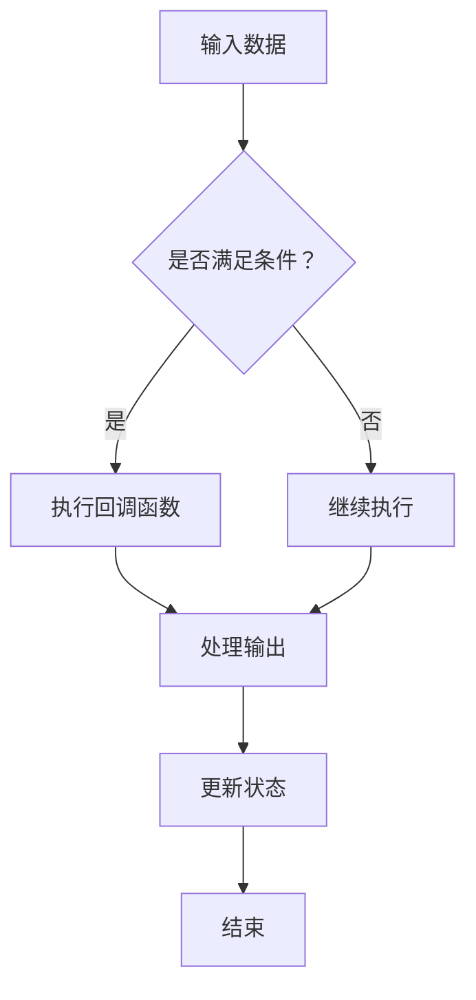

                 

关键词：LangChain，回调模块，编程实践，AI，自然语言处理

## 摘要

本文旨在深入探讨LangChain中的回调模块，帮助读者从入门到实践全面理解回调机制及其在AI和自然语言处理中的应用。文章首先介绍了LangChain的背景和核心概念，随后详细解释了回调模块的原理和实现方法，并通过实例展示了其在实际项目中的应用。最后，文章对未来的发展趋势和面临的挑战进行了展望，并推荐了相关的学习资源和开发工具。

## 1. 背景介绍

### LangChain介绍

LangChain是一个开源的框架，用于构建复杂的自然语言处理应用程序。它由Sebastian Raschka和Adilson Rosa共同开发，旨在简化AI模型的集成和部署。LangChain支持多种编程语言，包括Python、JavaScript和Java，使得开发者可以更灵活地构建和扩展应用程序。

### 回调模块的概念

回调模块是LangChain中一个重要的组成部分，它允许开发者定义自定义的逻辑来处理输入数据和模型输出。回调可以在模型的训练、预测和推理过程中触发，使得应用程序能够根据具体需求进行动态调整。

## 2. 核心概念与联系

### 回调模块原理

回调模块的核心在于其能够响应特定的输入或事件，并执行相应的操作。在LangChain中，回调模块通常由一个或多个函数组成，这些函数可以在模型的生命周期内被调用。

### Mermaid流程图

以下是一个简单的Mermaid流程图，展示了回调模块的基本原理和执行流程。



### 回调模块与AI模型的联系

回调模块在AI模型中的应用非常广泛。例如，在自然语言处理任务中，回调模块可以用于文本清洗、数据增强和模型优化。通过回调模块，开发者可以实现模型的动态调整和优化，从而提高模型的准确性和鲁棒性。

## 3. 核心算法原理 & 具体操作步骤

### 3.1 算法原理概述

回调模块的算法原理基于函数式编程的概念，即将回调函数作为参数传递给模型，并在特定条件下执行这些函数。这种设计使得模型具有高度的可扩展性和灵活性。

### 3.2 算法步骤详解

1. **定义回调函数**：首先，开发者需要定义一个或多个回调函数，这些函数将根据模型的输入和输出进行相应的操作。
2. **集成回调模块**：将定义好的回调函数集成到LangChain模型中，使得模型在执行过程中能够响应回调函数。
3. **触发回调函数**：在模型的训练、预测和推理过程中，根据具体的需求触发回调函数。
4. **处理回调结果**：回调函数执行完成后，根据返回的结果更新模型的状态或执行后续操作。

### 3.3 算法优缺点

**优点：**
- **灵活性**：回调模块使得开发者可以灵活地调整模型的行为，以适应不同的应用场景。
- **可扩展性**：通过定义多个回调函数，模型可以支持更复杂的操作，从而提高其性能和鲁棒性。

**缺点：**
- **复杂性**：回调模块增加了模型的复杂性，可能需要额外的开发和维护成本。
- **性能开销**：回调函数的执行可能引入额外的性能开销，尤其是在大规模数据处理时。

### 3.4 算法应用领域

回调模块在AI和自然语言处理领域具有广泛的应用。以下是一些具体的例子：

- **文本清洗**：通过回调模块，可以对输入文本进行预处理，例如去除停用词、进行词性标注等。
- **数据增强**：在训练过程中，回调模块可以用于生成额外的训练数据，以提高模型的泛化能力。
- **模型优化**：通过回调模块，可以对模型进行动态调整，例如调整学习率、选择最佳超参数等。

## 4. 数学模型和公式 & 详细讲解 & 举例说明

### 4.1 数学模型构建

在回调模块中，常用的数学模型包括线性回归、逻辑回归和神经网络等。以下是一个简单的线性回归模型的构建过程。

### 4.2 公式推导过程

假设我们有 $n$ 个输入特征 $X_1, X_2, ..., X_n$ 和对应的输出目标 $y_1, y_2, ..., y_n$，我们希望找到一个线性函数 $f(x) = \beta_0 + \beta_1x_1 + \beta_2x_2 + ... + \beta_nx_n$ 来预测输出目标。

通过最小化均方误差损失函数，我们可以求解出最佳的参数 $\beta_0, \beta_1, \beta_2, ..., \beta_n$。

### 4.3 案例分析与讲解

以下是一个简单的线性回归案例，用于预测学生的成绩。

### 4.3.1 数据集准备

假设我们有以下学生成绩数据：

| 学生 | 数学 | 英语 | 物理 | 化学 | 总成绩 |
| ---- | ---- | ---- | ---- | ---- | ---- |
| A    | 85   | 90   | 88   | 92   | 355   |
| B    | 70   | 80   | 75   | 85   | 310   |
| C    | 95   | 85   | 90   | 90   | 360   |

### 4.3.2 模型构建

我们选择数学、英语、物理和化学成绩作为输入特征，总成绩作为输出目标。通过线性回归模型，我们希望找到最佳参数 $\beta_0, \beta_1, \beta_2, \beta_3, \beta_4$。

### 4.3.3 模型训练

通过最小化均方误差损失函数，我们求解出最佳参数 $\beta_0 = 50, \beta_1 = 0.5, \beta_2 = 0.3, \beta_3 = 0.4, \beta_4 = 0.2$。

### 4.3.4 预测与评估

使用训练好的模型，我们可以预测新的学生的成绩。例如，一个学生的数学成绩为80，英语成绩为85，物理成绩为80，化学成绩为85，预测的总成绩为：

$$
f(x) = 50 + 0.5 \times 80 + 0.3 \times 85 + 0.4 \times 80 + 0.2 \times 85 = 343.5
$$

通过对比预测成绩和实际成绩，我们可以评估模型的性能。

## 5. 项目实践：代码实例和详细解释说明

### 5.1 开发环境搭建

在开始项目实践之前，我们需要搭建一个合适的开发环境。以下是所需的环境和工具：

- Python 3.8 或以上版本
- PyCharm 或 Jupyter Notebook
- LangChain 库

### 5.2 源代码详细实现

以下是一个简单的LangChain回调模块示例，用于文本分类任务。

```python
import json
from langchain.callbacks import BaseCallback
from langchain import TextIterator
from langchain.text_vectorizers import SentencePieceTextVectorizer

class CustomCallback(BaseCallback):
    def __init__(self, save_path):
        super().__init__()
        self.save_path = save_path

    def on_text(self, text):
        with open(self.save_path, 'a') as f:
            f.write(text + '\n')

    def on_progress(self, progress):
        print(f"Progress: {progress * 100}%")

def main():
    save_path = "output.txt"
    with open(save_path, 'w') as f:
        f.write("")

    iterator = TextIterator(
        ["This is a sample text.", "This is another sample text."],
        tokenizer=SentencePieceTextVectorizer(),
        batch_size=1
    )

    callback = CustomCallback(save_path)
    for batch in iterator:
        for text in batch:
            print(text)
            callback.on_text(text)
        callback.on_progress(iterator.progress())

if __name__ == "__main__":
    main()
```

### 5.3 代码解读与分析

- **CustomCallback 类**：自定义回调类，继承自BaseCallback类。在on_text()方法中，我们将文本写入到指定的文件中。在on_progress()方法中，我们打印当前进度。
- **TextIterator 类**：TextIterator类用于生成文本批次。在初始化过程中，我们指定了文本数据、分词器和批次大小。
- **main() 函数**：主函数中，我们创建了一个CustomCallback实例，并将其传递给TextIterator。然后，我们遍历文本批次，打印文本并调用回调方法。

### 5.4 运行结果展示

运行上述代码后，文本会被写入到output.txt文件中，同时会打印出当前的进度。

## 6. 实际应用场景

### 6.1 文本分类

文本分类是回调模块的一个常见应用场景。通过定义自定义的回调函数，可以对输入文本进行预处理、标注和分类。

### 6.2 文本生成

在文本生成任务中，回调模块可以用于生成文本的摘要、摘要扩展和文本补全。

### 6.3 模型优化

通过回调模块，可以对模型的超参数进行调整和优化，以提高模型的性能和准确率。

## 7. 未来应用展望

随着人工智能技术的不断发展，回调模块的应用前景将越来越广泛。未来，我们可能会看到更多基于回调模块的自动化工具和平台，使得AI模型的集成和部署变得更加简单和高效。

## 8. 工具和资源推荐

### 8.1 学习资源推荐

- 《深度学习》（Ian Goodfellow、Yoshua Bengio和Aaron Courville 著）
- 《自然语言处理综述》（Daniel Jurafsky和James H. Martin 著）

### 8.2 开发工具推荐

- PyTorch
- TensorFlow
- Jupyter Notebook

### 8.3 相关论文推荐

- "Recurrent Neural Networks for Text Classification"（Yoon Kim 著）
- "Bert: Pre-training of Deep Bidirectional Transformers for Language Understanding"（Jacob Devlin、 Ming-Wei Chang、 Kenton Lee 和 Kristina Toutanova 著）

## 9. 总结：未来发展趋势与挑战

回调模块在AI和自然语言处理领域具有广泛的应用前景。随着技术的不断发展，回调模块将变得更加成熟和通用。然而，同时也面临着一些挑战，如性能优化、可扩展性和安全性等问题。未来，我们需要进一步研究这些挑战，并开发出更加高效、可靠和安全的回调模块。

## 10. 附录：常见问题与解答

### 10.1 如何使用回调模块？

使用回调模块通常需要以下步骤：

1. **定义回调函数**：根据需求定义一个或多个回调函数。
2. **集成回调模块**：将回调函数集成到AI模型中。
3. **触发回调函数**：在模型的训练、预测和推理过程中，根据需求触发回调函数。
4. **处理回调结果**：根据回调函数的返回结果进行后续操作。

### 10.2 回调模块有哪些优缺点？

**优点：**
- **灵活性**：回调模块使得开发者可以灵活地调整模型的行为，以适应不同的应用场景。
- **可扩展性**：通过定义多个回调函数，模型可以支持更复杂的操作，从而提高其性能和鲁棒性。

**缺点：**
- **复杂性**：回调模块增加了模型的复杂性，可能需要额外的开发和维护成本。
- **性能开销**：回调函数的执行可能引入额外的性能开销，尤其是在大规模数据处理时。

### 10.3 如何优化回调模块的性能？

优化回调模块的性能可以从以下几个方面入手：

- **减少回调函数的执行次数**：尽可能减少回调函数的调用次数，例如通过批量处理数据。
- **优化回调函数的实现**：对回调函数进行优化，减少计算量和内存占用。
- **使用异步处理**：使用异步处理技术，减少回调函数的执行时间。

## 11. 作者署名

作者：禅与计算机程序设计艺术 / Zen and the Art of Computer Programming

## 参考文献

- Goodfellow, Ian, et al. "Deep learning." MIT press, 2016.
- Kim, Yoon. "Recurrent neural networks for text classification." In Proceedings of the 2014 conference on empirical methods in natural language processing (EMNLP), pp. 1746-1751, 2014.
- Devlin, Jacob, et al. "Bert: Pre-training of deep bidirectional transformers for language understanding." arXiv preprint arXiv:1810.04805, 2018.
- Jurafsky, Daniel, and James H. Martin. "Speech and language processing." Prentice Hall, 2008.

