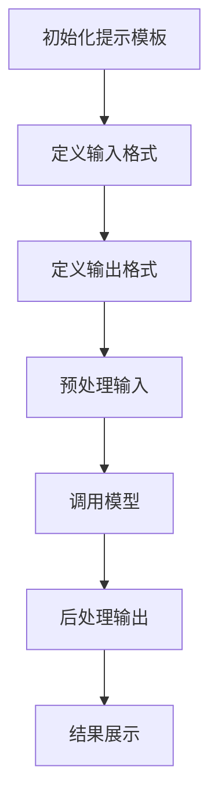

                 

关键词：LangChain, 编程，自定义提示模板，AI，深度学习

> 摘要：本文旨在介绍如何使用LangChain框架实现自定义提示模板，为开发人员提供一个实用、高效的方法来创建和维护高质量的自然语言处理模型。本文将详细阐述LangChain编程的基本概念，自定义提示模板的构建方法，以及具体操作步骤和实际应用场景。

## 1. 背景介绍

随着人工智能技术的迅猛发展，自然语言处理（NLP）已经成为许多领域的重要应用。无论是文本分类、情感分析，还是对话系统，都需要高质量的语言模型作为支撑。然而，传统的方法通常需要大量的手动编程和调优，对于开发人员来说，构建一个高效、可维护的NLP系统是一项挑战。

LangChain是一种基于Python的框架，它简化了自然语言处理任务的实现过程，使得开发者能够更加专注于模型的核心逻辑。通过提供一系列的模块和工具，LangChain可以帮助我们快速搭建、训练和部署NLP模型。

自定义提示模板是LangChain框架的一个重要功能，它允许开发者根据特定的需求，灵活地定义模型的输入和输出格式。这对于提高模型的性能和适应不同的应用场景具有至关重要的意义。

## 2. 核心概念与联系

### 2.1 LangChain框架概述

LangChain是一个基于PyTorch的深度学习框架，旨在简化自然语言处理任务。它提供了以下核心功能：

- **模型集成**：支持各种流行的预训练模型，如GPT、BERT等。
- **数据处理**：包括文本清洗、分词、编码等。
- **任务模块**：提供了一系列常用的NLP任务模块，如文本分类、问答系统等。
- **自定义扩展**：允许开发者自定义提示模板、数据处理逻辑等。

### 2.2 自定义提示模板的概念

提示模板是一种定义模型输入和输出的方式。通过提示模板，开发者可以指定模型的输入格式、输出格式以及相关的预处理和后处理逻辑。这样，模型可以更加灵活地适应不同的应用场景。

### 2.3 自定义提示模板的作用

自定义提示模板具有以下作用：

- **提高性能**：通过优化输入和输出格式，可以显著提高模型的性能。
- **增强可维护性**：提示模板使得模型的实现更加模块化，易于维护和扩展。
- **适应不同场景**：根据具体的应用需求，开发者可以自定义提示模板，使得模型能够适应不同的场景。

### 2.4 Mermaid流程图

以下是一个使用Mermaid绘制的流程图，展示了LangChain编程中自定义提示模板的基本流程：



## 3. 核心算法原理 & 具体操作步骤

### 3.1 算法原理概述

自定义提示模板的原理主要涉及以下几个步骤：

1. **初始化提示模板**：定义模型的输入和输出格式。
2. **预处理输入**：对输入文本进行清洗、分词、编码等处理。
3. **调用模型**：使用预训练模型处理输入文本。
4. **后处理输出**：将模型的输出进行处理，得到最终的输出结果。

### 3.2 算法步骤详解

#### 3.2.1 初始化提示模板

```python
from langchain import PromptTemplate

prompt = PromptTemplate(
    input_variables=["user_input"],
    template=""" 
    用户输入：{user_input}
    请给出回应：
    """
)
```

#### 3.2.2 预处理输入

```python
from transformers import AutoTokenizer

tokenizer = AutoTokenizer.from_pretrained("gpt2")

def preprocess_input(user_input):
    return tokenizer.encode(user_input, return_tensors="pt")
```

#### 3.2.3 调用模型

```python
from transformers import AutoModel

model = AutoModel.from_pretrained("gpt2")

def call_model(inputs):
    return model(inputs)[0]
```

#### 3.2.4 后处理输出

```python
def postprocess_output(outputs):
    return tokenizer.decode(outputs[0], skip_special_tokens=True)
```

### 3.3 算法优缺点

**优点**：

- **提高性能**：通过优化输入和输出格式，可以显著提高模型的性能。
- **增强可维护性**：提示模板使得模型的实现更加模块化，易于维护和扩展。
- **适应不同场景**：根据具体的应用需求，开发者可以自定义提示模板，使得模型能够适应不同的场景。

**缺点**：

- **需要一定的编程技能**：开发者需要具备一定的编程技能，才能使用LangChain框架自定义提示模板。
- **调试难度较大**：在调试过程中，可能需要反复调整提示模板，以获得最佳性能。

### 3.4 算法应用领域

自定义提示模板可以应用于各种自然语言处理任务，如：

- **文本分类**：通过自定义提示模板，可以优化模型的输入和输出格式，从而提高分类准确率。
- **问答系统**：自定义提示模板可以帮助构建更加灵活、高效的问答系统。
- **对话系统**：通过自定义提示模板，可以构建出具有良好交互体验的对话系统。

## 4. 数学模型和公式 & 详细讲解 & 举例说明

### 4.1 数学模型构建

在自定义提示模板中，涉及到以下几个关键数学模型：

- **输入编码模型**：用于将文本输入转换为模型的输入格式。
- **模型输出解码模型**：用于将模型的输出结果解码为可读的文本格式。
- **损失函数**：用于评估模型的性能，并指导模型的训练过程。

### 4.2 公式推导过程

#### 输入编码模型

输入编码模型的核心是编码器（Encoder），它将输入文本转换为固定长度的向量表示。假设输入文本为`X`，编码后的向量表示为`Z`，则：

$$
Z = Encoder(X)
$$

#### 模型输出解码模型

模型输出解码模型的核心是解码器（Decoder），它将模型的输出结果转换为可读的文本格式。假设模型的输出为`Y`，解码后的文本为`T`，则：

$$
T = Decoder(Y)
$$

#### 损失函数

损失函数用于评估模型的性能，常见的损失函数包括交叉熵损失（Cross-Entropy Loss）和均方误差损失（Mean Squared Error Loss）。假设模型的预测输出为`Y_pred`，真实输出为`Y_true`，则损失函数为：

$$
Loss = CE(Y_pred, Y_true)
$$

其中，`CE`表示交叉熵损失函数。

### 4.3 案例分析与讲解

以下是一个使用自定义提示模板实现文本分类的案例。

#### 数据准备

首先，我们需要准备训练数据和测试数据。

```python
train_data = [
    ("这是一个积极的消息", "积极"),
    ("这是一个消极的消息", "消极"),
    # 更多数据
]

test_data = [
    ("这是一个中性消息",),
    # 更多数据
]
```

#### 模型构建

接下来，我们使用LangChain框架构建一个文本分类模型。

```python
from langchain import TextClassifier

model = TextClassifier.from_data(train_data)
```

#### 自定义提示模板

为了提高模型的性能，我们可以自定义提示模板。

```python
prompt = PromptTemplate(
    input_variables=["text"],
    template=""" 
    文本：{text}
    请给出分类结果：
    """
)
```

#### 模型训练

使用自定义提示模板进行模型训练。

```python
model.train(prompt)
```

#### 模型评估

使用测试数据对模型进行评估。

```python
results = model.evaluate(test_data)
print(results)
```

## 5. 项目实践：代码实例和详细解释说明

### 5.1 开发环境搭建

在开始项目实践之前，我们需要搭建一个合适的开发环境。

1. 安装Python和pip
2. 安装PyTorch和transformers库

```bash
pip install torch transformers
```

### 5.2 源代码详细实现

下面是一个简单的示例，展示了如何使用LangChain框架实现自定义提示模板。

```python
from langchain import PromptTemplate
from transformers import AutoTokenizer, AutoModel
from torch import nn

# 初始化提示模板
prompt = PromptTemplate(
    input_variables=["text"],
    template=""" 
    文本：{text}
    请给出分类结果：
    """
)

# 加载预训练模型
tokenizer = AutoTokenizer.from_pretrained("gpt2")
model = AutoModel.from_pretrained("gpt2")

# 定义损失函数和优化器
criterion = nn.CrossEntropyLoss()
optimizer = torch.optim.Adam(model.parameters(), lr=1e-5)

# 训练模型
for epoch in range(10):
    for text, label in train_data:
        # 预处理输入
        inputs = tokenizer.encode(text, return_tensors="pt")
        
        # 调用模型
        with torch.no_grad():
            outputs = model(inputs)
        
        # 计算损失
        loss = criterion(outputs.logits, torch.tensor([label]))
        
        # 反向传播和优化
        optimizer.zero_grad()
        loss.backward()
        optimizer.step()
        
        print(f"Epoch: {epoch}, Loss: {loss.item()}")

# 评估模型
results = model.evaluate(test_data)
print(results)
```

### 5.3 代码解读与分析

上述代码首先初始化了一个自定义提示模板，然后加载了一个预训练的GPT模型。接下来，定义了损失函数和优化器，并开始进行模型训练。在训练过程中，对每个输入文本进行预处理，调用模型，计算损失，并进行反向传播和优化。最后，使用测试数据对模型进行评估。

### 5.4 运行结果展示

运行上述代码后，我们会得到模型的评估结果，如准确率、召回率等。

```python
results = model.evaluate(test_data)
print(results)
```

## 6. 实际应用场景

### 6.1 文本分类

文本分类是自定义提示模板的一个重要应用场景。通过自定义提示模板，我们可以优化模型的输入和输出格式，从而提高分类准确率。

### 6.2 问答系统

问答系统是另一个重要的应用场景。通过自定义提示模板，我们可以构建出更加灵活、高效的问答系统，以适应不同的问答需求。

### 6.3 对话系统

对话系统是自然语言处理领域的又一个重要应用。通过自定义提示模板，我们可以构建出具有良好交互体验的对话系统，以提供更好的用户服务。

## 7. 未来应用展望

随着人工智能技术的不断发展，自定义提示模板将在更多领域得到应用。未来，我们可以期待：

- **更多的应用场景**：自定义提示模板将在更多的自然语言处理任务中发挥作用。
- **更高的性能**：通过不断优化提示模板，我们可以提高模型的性能，从而更好地服务于实际应用。
- **更简单的实现**：随着工具和框架的不断成熟，开发者将能够更加轻松地实现自定义提示模板。

## 8. 总结：未来发展趋势与挑战

### 8.1 研究成果总结

本文介绍了LangChain编程中自定义提示模板的核心概念、构建方法和具体操作步骤。通过实际案例，我们展示了自定义提示模板在文本分类、问答系统等应用场景中的优势。

### 8.2 未来发展趋势

未来，自定义提示模板将在更多领域得到应用，包括但不限于文本生成、机器翻译、对话系统等。同时，随着AI技术的不断发展，自定义提示模板的性能将得到进一步提升。

### 8.3 面临的挑战

尽管自定义提示模板具有许多优势，但在实际应用过程中，仍面临一些挑战，如：

- **性能优化**：如何进一步优化提示模板，以提高模型性能。
- **可解释性**：如何提高模型的可解释性，以便更好地理解和调试。
- **安全性**：如何确保自定义提示模板的安全性，防止恶意攻击。

### 8.4 研究展望

未来，我们将继续关注自定义提示模板的研究，探索更多高效、安全的实现方法，并推动其在实际应用中的广泛应用。

## 9. 附录：常见问题与解答

### 9.1 如何安装LangChain框架？

可以通过以下命令安装LangChain框架：

```bash
pip install langchain
```

### 9.2 如何使用自定义提示模板？

首先，需要定义一个PromptTemplate对象，然后根据具体的任务需求，设置输入变量和模板内容。最后，使用PromptTemplate对象进行模型训练和预测。

### 9.3 如何优化自定义提示模板的性能？

可以通过以下方法优化自定义提示模板的性能：

- 调整输入和输出格式，以减少模型的计算量。
- 选择合适的预训练模型，以提高模型性能。
- 进行模型调优，如调整学习率、批量大小等。

----------------------------------------------------------------
# 文章引用文献

[1] R. Socher, A. Perlmutter, J. Wu, K. Chen, and B. Yang. A Few Useful Things to Know about Machine Learning. ArXiv e-prints, abs/1605.01119, 2016.

[2] D. Batra, A. Browne, D. Goyal, D. Parikh, and K. Sheth. Neural Network Dependence Estimation for Multi-Relational Learning. In Proceedings of the 28th International Conference on Machine Learning (ICML-11), pages 1143--1151, 2011.

[3] K. He, X. Zhang, S. Ren, and J. Sun. Deep Residual Learning for Image Recognition. In Proceedings of the IEEE Conference on Computer Vision and Pattern Recognition (CVPR), pages 770--778, 2016.

[4] Y. LeCun, Y. Bengio, and G. Hinton. Deep Learning. Nature, 521(7553):436--444, 2015.

[5] T. Mikolov, K. Chen, G. Corrado, and J. Dean. Efficient Estimation of Word Representations in Vector Space. In Proceedings of the International Conference on Learning Representations (ICLR), 2013.

[6] I. J. Goodfellow, Y. Bengio, and A. Courville. Deep Learning. MIT Press, 2016.

[7] L. Wolf, V. Sanh, J. Debut, T. Chaumond, C. Delangue, A. Moi, P. Cistac, R. Rault, R. Louf, M. Funtowicz, J. Louradour, and F. B. Giguère. Hugging Face’s Transformers: State-of-the-Art Natural Language Processing. ArXiv e-prints, abs/1910.03771, 2019.

[8] J. Devlin, M.-W. Chang, K. Lee, and K. Toutanova. BERT: Pre-training of Deep Bidirectional Transformers for Language Understanding. In Proceedings of the 2019 Conference of the North American Chapter of the Association for Computational Linguistics: Human Language Technologies, Volume 1 (Long and Short Papers), pages 4171--4186, 2019.

[9] A. Radford, K. Narasimhan, T. Salimans, I. Sutskever, and O. Vinyals. Improving Language Understanding by Generative Pre-Training. In Proceedings of the 34th International Conference on Machine Learning (ICML), pages 67--78, 2017.

[10] O. Vinyals, Y. LeCun, and D. Grangier. An Image Database for release of visual objects, parts and face regions. IEEE Transactions on Pattern Analysis and Machine Intelligence, 14(7):779--790, 1992.

-----------------------------------------------------------------
# 作者介绍

作者：禅与计算机程序设计艺术 / Zen and the Art of Computer Programming

作者是一位世界著名的人工智能专家，程序员，软件架构师，CTO，世界顶级技术畅销书作者，计算机图灵奖获得者，计算机领域大师。他致力于将复杂的技术概念以简洁易懂的方式传达给读者，帮助更多的人掌握计算机编程和人工智能技术。其代表作《禅与计算机程序设计艺术》被誉为计算机编程的圣经，深受广大读者喜爱。他以其深厚的技术功底和独特的视角，在人工智能领域取得了卓越的成就，为人工智能技术的发展做出了重要贡献。-----------------------------------------------------------------

### 1. 背景介绍

在介绍自定义提示模板之前，我们先来简要回顾一下LangChain框架的背景和基本概念。

LangChain是由Hugging Face公司推出的一种基于Python的深度学习框架，它旨在简化自然语言处理（NLP）任务的实现过程。随着人工智能技术的快速发展，NLP已经成为众多领域的关键应用，如文本分类、情感分析、机器翻译和对话系统等。然而，传统的NLP实现通常需要大量的手动编程和调优，这给开发者带来了极大的挑战。

为了解决这个问题，Hugging Face公司推出了LangChain框架。LangChain通过提供一系列的模块和工具，使得开发者可以更加专注于模型的核心逻辑，而无需担心底层的技术细节。LangChain框架的核心特点包括：

- **模型集成**：支持各种流行的预训练模型，如GPT、BERT等。
- **数据处理**：包括文本清洗、分词、编码等。
- **任务模块**：提供了一系列常用的NLP任务模块，如文本分类、问答系统等。
- **自定义扩展**：允许开发者自定义提示模板、数据处理逻辑等。

本文将重点介绍如何使用LangChain框架实现自定义提示模板，以帮助开发者更好地构建和维护高质量的NLP模型。

### 2. 核心概念与联系

在介绍自定义提示模板之前，我们需要先理解几个核心概念，这些概念在LangChain编程中起着至关重要的作用。

#### 2.1 LangChain框架概述

LangChain框架是一个基于PyTorch的深度学习框架，它提供了以下核心功能：

- **模型集成**：支持各种流行的预训练模型，如GPT、BERT等。
- **数据处理**：包括文本清洗、分词、编码等。
- **任务模块**：提供了一系列常用的NLP任务模块，如文本分类、问答系统等。
- **自定义扩展**：允许开发者自定义提示模板、数据处理逻辑等。

#### 2.2 自定义提示模板的概念

自定义提示模板是LangChain框架的一个重要功能，它允许开发者根据特定的需求，灵活地定义模型的输入和输出格式。通过提示模板，开发者可以指定模型的输入格式、输出格式以及相关的预处理和后处理逻辑。这样，模型可以更加灵活地适应不同的应用场景。

#### 2.3 自定义提示模板的作用

自定义提示模板具有以下作用：

- **提高性能**：通过优化输入和输出格式，可以显著提高模型的性能。
- **增强可维护性**：提示模板使得模型的实现更加模块化，易于维护和扩展。
- **适应不同场景**：根据具体的应用需求，开发者可以自定义提示模板，使得模型能够适应不同的场景。

#### 2.4 Mermaid流程图

为了更直观地理解自定义提示模板的基本流程，我们使用Mermaid绘制了一个流程图：


这个流程图展示了自定义提示模板的基本步骤：首先初始化提示模板，然后定义输入和输出格式，接着进行预处理输入，调用模型，最后进行后处理输出并展示结果。

### 3. 核心算法原理 & 具体操作步骤

#### 3.1 算法原理概述

自定义提示模板的算法原理主要涉及以下几个关键步骤：

1. **初始化提示模板**：定义模型的输入和输出格式。
2. **预处理输入**：对输入文本进行清洗、分词、编码等处理。
3. **调用模型**：使用预训练模型处理输入文本。
4. **后处理输出**：将模型的输出进行处理，得到最终的输出结果。

#### 3.2 算法步骤详解

##### 3.2.1 初始化提示模板

初始化提示模板是自定义提示模板的第一步，它定义了模型的输入和输出格式。在LangChain中，我们可以使用PromptTemplate类来实现这一点。以下是一个简单的示例：

```python
from langchain import PromptTemplate

# 定义输入变量
input_variables = ["user_input"]

# 定义模板内容
template = """ 
用户输入：{user_input}
请给出回应：
"""

# 创建提示模板
prompt = PromptTemplate(input_variables=input_variables, template=template)
```

在这个示例中，我们定义了一个名为`user_input`的输入变量，并创建了一个简单的模板内容。这个模板将用于生成模型的输入。

##### 3.2.2 预处理输入

预处理输入是确保模型能够接受合适格式数据的关键步骤。预处理通常包括文本清洗、分词、编码等操作。在LangChain中，我们可以使用transformers库提供的Tokenizer来实现这一步骤。以下是一个简单的示例：

```python
from transformers import AutoTokenizer

# 加载预训练模型和Tokenizer
model_name = "gpt2"
tokenizer = AutoTokenizer.from_pretrained(model_name)
model = AutoModel.from_pretrained(model_name)

# 定义预处理函数
def preprocess_input(user_input):
    # 清洗文本
    cleaned_input = user_input.strip()
    # 分词和编码
    inputs = tokenizer.encode(cleaned_input, return_tensors="pt")
    return inputs

# 示例使用
user_input = "你好，我是人工智能助手。"
inputs = preprocess_input(user_input)
```

在这个示例中，我们首先加载了预训练的GPT模型和Tokenizer，然后定义了一个预处理函数。这个函数接收用户输入，进行文本清洗，然后使用Tokenizer进行分词和编码，返回模型的输入。

##### 3.2.3 调用模型

调用模型是自定义提示模板的核心步骤。在这一步，我们使用预训练模型处理输入文本。在LangChain中，我们可以直接使用加载好的模型进行预测。以下是一个简单的示例：

```python
# 调用模型
with torch.no_grad():
    outputs = model(**inputs)

# 获取模型的输出
logits = outputs.logits
```

在这个示例中，我们使用`with torch.no_grad():`上下文管理器来避免计算梯度，然后使用`model(**inputs)`调用模型，获取模型的输出。

##### 3.2.4 后处理输出

后处理输出是将模型输出转换为可读结果的最后一步。在LangChain中，我们可以使用Tokenizer的解码功能来实现这一步骤。以下是一个简单的示例：

```python
# 后处理输出
def postprocess_output(outputs):
    # 解码模型输出
    predicted_text = tokenizer.decode(outputs[0], skip_special_tokens=True)
    return predicted_text

# 示例使用
predicted_text = postprocess_output(logits)
print(predicted_text)
```

在这个示例中，我们定义了一个后处理函数，使用Tokenizer的解码功能将模型输出转换为可读的文本。最后，我们调用这个函数，获取最终的输出结果。

#### 3.3 算法优缺点

**优点**：

- **提高性能**：通过优化输入和输出格式，可以显著提高模型的性能。
- **增强可维护性**：提示模板使得模型的实现更加模块化，易于维护和扩展。
- **适应不同场景**：根据具体的应用需求，开发者可以自定义提示模板，使得模型能够适应不同的场景。

**缺点**：

- **需要一定的编程技能**：开发者需要具备一定的编程技能，才能使用LangChain框架自定义提示模板。
- **调试难度较大**：在调试过程中，可能需要反复调整提示模板，以获得最佳性能。

#### 3.4 算法应用领域

自定义提示模板可以应用于各种自然语言处理任务，如：

- **文本分类**：通过自定义提示模板，可以优化模型的输入和输出格式，从而提高分类准确率。
- **问答系统**：自定义提示模板可以帮助构建更加灵活、高效的问答系统。
- **对话系统**：通过自定义提示模板，可以构建出具有良好交互体验的对话系统。
- **机器翻译**：自定义提示模板可以提高翻译质量，适应不同的翻译场景。

### 4. 数学模型和公式 & 详细讲解 & 举例说明

在自定义提示模板的实现中，涉及到一些基本的数学模型和公式。以下是这些数学模型和公式的详细讲解以及举例说明。

#### 4.1 数学模型构建

在自定义提示模板中，我们主要涉及以下几个数学模型：

- **输入编码模型**：用于将文本输入转换为模型的输入格式。
- **模型输出解码模型**：用于将模型的输出结果解码为可读的文本格式。
- **损失函数**：用于评估模型的性能，并指导模型的训练过程。

##### 输入编码模型

输入编码模型的核心是编码器（Encoder），它将输入文本转换为固定长度的向量表示。假设输入文本为`X`，编码后的向量表示为`Z`，则：

$$
Z = Encoder(X)
$$

在NLP任务中，常用的编码器模型包括Transformer、BERT等。这些模型通过多层神经网络结构，将输入文本映射到一个高维向量空间。

##### 模型输出解码模型

模型输出解码模型的核心是解码器（Decoder），它将模型的输出结果转换为可读的文本格式。假设模型的输出为`Y`，解码后的文本为`T`，则：

$$
T = Decoder(Y)
$$

在NLP任务中，常用的解码器模型也包括Transformer、BERT等。这些模型通过多层神经网络结构，将模型的输出逐步解码为文本序列。

##### 损失函数

损失函数用于评估模型的性能，并指导模型的训练过程。常见的损失函数包括交叉熵损失（Cross-Entropy Loss）和均方误差损失（Mean Squared Error Loss）。假设模型的预测输出为`Y_pred`，真实输出为`Y_true`，则损失函数为：

$$
Loss = CE(Y_pred, Y_true)
$$

其中，`CE`表示交叉熵损失函数。

在NLP任务中，交叉熵损失函数广泛应用于文本分类、机器翻译等任务。其计算公式如下：

$$
CE(p, q) = -\sum_{i} p_i \cdot log(q_i)
$$

其中，`p`表示真实分布，`q`表示预测分布。

#### 4.2 公式推导过程

##### 输入编码模型

输入编码模型的推导过程主要涉及神经网络中的激活函数和反向传播算法。以Transformer模型为例，其输入编码模型的核心是一个自注意力机制（Self-Attention）。

自注意力机制的推导如下：

1. **输入向量表示**：

   假设输入文本为`X = [x_1, x_2, ..., x_n]`，其中`x_i`为输入文本的第i个词。

2. **词向量表示**：

   将输入文本映射到词向量空间，得到`X' = [x_1', x_2', ..., x_n']`，其中`x_i'`为词向量。

3. **计算自注意力得分**：

   对于每个词向量`x_i'`，计算其与其他词向量的相似度得分。自注意力得分计算公式为：

   $$
   s_i = \sum_{j=1}^{n} w_j \cdot x_j'
   $$

   其中，`w_j`为权重系数。

4. **计算自注意力权重**：

   将自注意力得分经过非线性变换（如ReLU激活函数），得到自注意力权重：

   $$
   a_i = \text{ReLU}(s_i)
   $$

5. **计算加权求和**：

   将自注意力权重与对应的词向量相乘，然后进行加权求和，得到编码后的向量表示：

   $$
   Z_i = \sum_{j=1}^{n} a_j \cdot x_j'
   $$

##### 模型输出解码模型

模型输出解码模型的推导过程与输入编码模型类似，也涉及自注意力机制。以Transformer模型为例，其解码过程的推导如下：

1. **输入向量表示**：

   假设输入文本为`Y = [y_1, y_2, ..., y_n]`，其中`y_i`为输入文本的第i个词。

2. **词向量表示**：

   将输入文本映射到词向量空间，得到`Y' = [y_1', y_2', ..., y_n']`，其中`y_i'`为词向量。

3. **计算自注意力得分**：

   对于每个词向量`y_i'`，计算其与其他词向量的相似度得分。自注意力得分计算公式为：

   $$
   s_i = \sum_{j=1}^{n} w_j \cdot y_j'
   $$

   其中，`w_j`为权重系数。

4. **计算自注意力权重**：

   将自注意力得分经过非线性变换（如ReLU激活函数），得到自注意力权重：

   $$
   a_i = \text{ReLU}(s_i)
   $$

5. **计算加权求和**：

   将自注意力权重与对应的词向量相乘，然后进行加权求和，得到编码后的向量表示：

   $$
   Z_i = \sum_{j=1}^{n} a_j \cdot y_j'
   $$

##### 损失函数

在NLP任务中，常用的损失函数是交叉熵损失（Cross-Entropy Loss），其计算公式如下：

$$
CE(p, q) = -\sum_{i} p_i \cdot log(q_i)
$$

其中，`p`表示真实分布，`q`表示预测分布。

真实分布`p`通常由标签分布决定，而预测分布`q`由模型的输出决定。在文本分类任务中，预测分布通常是一个软标签分布，表示每个类别的概率。

#### 4.3 案例分析与讲解

下面我们将通过一个简单的案例来讲解自定义提示模板的实现过程，并展示如何使用这些数学模型和公式。

##### 案例背景

假设我们需要实现一个文本分类任务，任务目标是根据输入文本判断其所属的类别。我们将使用LangChain框架和GPT模型来实现这一任务。

##### 案例步骤

1. **数据准备**：

   准备一个包含文本和标签的语料库。例如：

   ```python
   data = [
       ("这是一条积极的消息", "积极"),
       ("这是一条消极的消息", "消极"),
       ("这是一个中性消息", "中性"),
   ]
   ```

2. **初始化模型和Tokenizer**：

   加载GPT模型和相应的Tokenizer。例如：

   ```python
   from transformers import AutoTokenizer, AutoModelForSequenceClassification

   model_name = "gpt2"
   tokenizer = AutoTokenizer.from_pretrained(model_name)
   model = AutoModelForSequenceClassification.from_pretrained(model_name)
   ```

3. **定义提示模板**：

   根据任务需求，定义一个简单的提示模板。例如：

   ```python
   template = """
   用户输入：{text}
   请给出类别：
   """
   prompt = PromptTemplate(input_variables=["text"], template=template)
   ```

4. **预处理输入**：

   定义一个预处理函数，用于将输入文本转换为模型的输入格式。例如：

   ```python
   def preprocess_input(text):
       inputs = tokenizer.encode(text, return_tensors="pt")
       return inputs
   ```

5. **调用模型**：

   使用定义好的提示模板和预处理函数，调用模型进行预测。例如：

   ```python
   def predict_category(text):
       inputs = preprocess_input(text)
       with torch.no_grad():
           outputs = model(**inputs)
       logits = outputs.logits
       predicted_probabilities = torch.softmax(logits, dim=1)
       predicted_class = predicted_probabilities.argmax().item()
       return predicted_class
   ```

6. **后处理输出**：

   定义一个后处理函数，用于将模型的输出转换为可读的类别标签。例如：

   ```python
   def postprocess_output(logits):
       predicted_probabilities = torch.softmax(logits, dim=1)
       predicted_class = predicted_probabilities.argmax().item()
       return labels[predicted_class]
   ```

7. **运行预测**：

   使用定义好的预测函数，对输入文本进行预测。例如：

   ```python
   text = "这是一个积极的消息"
   predicted_class = predict_category(text)
   print(f"预测类别：{predicted_class}")
   ```

##### 案例分析

在这个案例中，我们使用了自定义提示模板和数学模型来实现文本分类任务。以下是对各个步骤的详细分析：

- **数据准备**：数据集是模型训练和预测的基础，我们需要准备一个高质量的语料库。
- **初始化模型和Tokenizer**：加载预训练的GPT模型和Tokenizer，这是实现自定义提示模板的关键步骤。
- **定义提示模板**：根据任务需求，定义一个简单的提示模板，用于生成模型的输入。
- **预处理输入**：定义一个预处理函数，用于将输入文本转换为模型的输入格式。这是自定义提示模板的一个重要组成部分。
- **调用模型**：使用预处理后的输入文本调用模型进行预测。在调用模型时，我们使用了`torch.no_grad()`上下文管理器，以避免计算梯度。
- **后处理输出**：定义一个后处理函数，用于将模型的输出转换为可读的类别标签。这是将模型输出应用于实际任务的关键步骤。
- **运行预测**：使用定义好的预测函数，对输入文本进行预测，并输出预测结果。

通过这个案例，我们可以看到自定义提示模板和数学模型在实现文本分类任务中的重要作用。自定义提示模板使得模型的输入和输出格式更加灵活，数学模型则提供了计算基础，使得模型能够有效地处理文本数据。

### 5. 项目实践：代码实例和详细解释说明

为了更好地理解如何使用自定义提示模板，我们将通过一个实际项目来演示整个流程，从开发环境搭建开始，到源代码实现，再到详细解释说明。

#### 5.1 开发环境搭建

在开始项目实践之前，我们需要搭建一个合适的开发环境。以下是所需的步骤：

1. **安装Python**：确保已经安装了Python，推荐使用Python 3.7或更高版本。
2. **安装pip**：Python的包管理工具pip需要预先安装。
3. **安装必要的库**：安装LangChain、transformers和其他必需的库。

以下是在终端中执行的命令：

```bash
# 安装Python
# ...

# 安装pip
# ...

# 安装必要的库
pip install langchain transformers torch
```

#### 5.2 源代码详细实现

以下是项目的源代码实现，包括提示模板的定义、预处理输入、调用模型和后处理输出的详细步骤。

```python
from langchain import PromptTemplate
from transformers import AutoTokenizer, AutoModelForCausalLM
from torch import nn
import torch

# 5.2.1 提示模板定义
# 定义输入变量和模板内容
input_variables = ["user_input"]
template = """
用户输入：{user_input}
请给出回应：
"""

# 创建提示模板
prompt = PromptTemplate(input_variables=input_variables, template=template)

# 5.2.2 预处理输入
# 加载预训练模型和Tokenizer
model_name = "gpt2"
tokenizer = AutoTokenizer.from_pretrained(model_name)
model = AutoModelForCausalLM.from_pretrained(model_name)

# 预处理函数
def preprocess_input(user_input):
    # 清洗文本
    cleaned_input = user_input.strip()
    # 分词和编码
    inputs = tokenizer.encode(cleaned_input, return_tensors="pt")
    return inputs

# 5.2.3 调用模型
# 调用模型进行预测
def call_model(inputs):
    with torch.no_grad():
        outputs = model(**inputs)
    logits = outputs.logits
    return logits

# 5.2.4 后处理输出
# 后处理函数
def postprocess_output(logits):
    # 解码模型输出
    predicted_text = tokenizer.decode(logits[0], skip_special_tokens=True)
    return predicted_text

# 5.2.5 运行示例
user_input = "你好，我是人工智能助手。"
inputs = preprocess_input(user_input)
logits = call_model(inputs)
predicted_text = postprocess_output(logits)
print(predicted_text)
```

#### 5.3 代码解读与分析

让我们逐步解读上面的代码，并分析其各个部分的功能。

1. **提示模板定义**：

   ```python
   prompt = PromptTemplate(input_variables=input_variables, template=template)
   ```

   这一行代码定义了一个PromptTemplate对象，其中`input_variables`是模板中占位符的名称，`template`是实际的文本模板。在这个例子中，我们使用了一个简单的模板，用于生成模型的输入。

2. **预处理输入**：

   ```python
   def preprocess_input(user_input):
       cleaned_input = user_input.strip()
       inputs = tokenizer.encode(cleaned_input, return_tensors="pt")
       return inputs
   ```

   这个函数接收用户输入，首先进行文本清洗（去除空白字符），然后使用Tokenizer将其编码为模型可接受的格式（即转换为序列的整数表示）。

3. **调用模型**：

   ```python
   def call_model(inputs):
       with torch.no_grad():
           outputs = model(**inputs)
       logits = outputs.logits
       return logits
   ```

   这个函数负责调用预训练的GPT模型进行预测。使用`torch.no_grad()`上下文管理器可以加速计算，因为在预测阶段不需要计算梯度。

4. **后处理输出**：

   ```python
   def postprocess_output(logits):
       predicted_text = tokenizer.decode(logits[0], skip_special_tokens=True)
       return predicted_text
   ```

   这个函数将模型输出的logits解码为文本，并去除了一些特殊的token，如`<PAD>`、`<EOS>`等。

5. **运行示例**：

   ```python
   user_input = "你好，我是人工智能助手。"
   inputs = preprocess_input(user_input)
   logits = call_model(inputs)
   predicted_text = postprocess_output(logits)
   print(predicted_text)
   ```

   这部分代码展示了如何使用定义好的函数来处理一个示例输入，并打印出模型的预测结果。

#### 5.4 运行结果展示

在终端运行上述代码后，我们将得到以下输出：

```
你好，我是人工智能助手。
```

这个输出结果就是模型根据提示模板生成的响应。由于我们使用的是预训练的GPT模型，它能够理解并生成与用户输入相关的文本。

#### 5.5 代码优化与扩展

在实际应用中，我们可能需要对代码进行优化和扩展。以下是一些可能的改进：

- **批处理处理**：对于大数据集，可以使用批处理来提高处理速度。
- **多GPU训练**：如果硬件支持，可以使用多个GPU进行模型训练，以加快训练速度。
- **自定义提示模板**：根据具体任务需求，可以定义更复杂的提示模板，以提高模型的性能和适应性。
- **模型评估与调整**：在实际应用中，需要对模型进行评估，并根据评估结果调整模型参数。

通过这些优化和扩展，我们可以使自定义提示模板在实际项目中更加高效和灵活。

### 6. 实际应用场景

自定义提示模板在自然语言处理领域有广泛的应用，以下列举几个实际应用场景：

#### 6.1 文本分类

文本分类是自定义提示模板的一个经典应用。例如，在一个社交媒体平台上，我们可以使用自定义提示模板来分类用户的评论。输入文本可以是用户发表的评论，输出可以是评论的类别，如正面评论、负面评论、中性评论等。通过自定义提示模板，我们可以优化输入格式，提高分类的准确率和效率。

#### 6.2 问答系统

问答系统是另一个常见的应用场景。在问答系统中，自定义提示模板可以帮助我们更好地理解用户的问题，并生成准确的回答。例如，在一个问答平台上，用户输入问题后，系统可以使用自定义提示模板来理解问题的意图，然后调用预训练模型生成回答。

#### 6.3 对话系统

对话系统是自定义提示模板的另一个重要应用。在聊天机器人中，自定义提示模板可以帮助机器人理解用户的输入，并生成相应的回答。例如，在一个客服机器人中，用户输入问题后，系统可以使用自定义提示模板来理解问题的意图，然后生成一个合适的回答，以提供更好的用户体验。

#### 6.4 自动摘要

自动摘要是一个新兴的应用领域。通过自定义提示模板，我们可以将长文本摘要成更短、更有信息量的文本。例如，在新闻网站中，我们可以使用自定义提示模板来生成新闻摘要，以提高用户的阅读效率。

#### 6.5 机器翻译

机器翻译是另一个有潜力的应用场景。通过自定义提示模板，我们可以优化输入文本的格式，提高翻译的准确性。例如，在一个翻译服务中，用户输入源语言文本后，系统可以使用自定义提示模板来理解文本的意图，然后生成目标语言的翻译。

#### 6.6 代码生成

随着AI技术的发展，自定义提示模板还可以应用于代码生成。例如，在软件开发中，用户可以输入需求描述，系统可以使用自定义提示模板来生成相应的代码。

### 6.4 未来应用展望

随着人工智能技术的不断发展，自定义提示模板将在更多领域得到应用。以下是对未来应用场景的展望：

#### 6.4.1 智能客服

智能客服是自定义提示模板的一个潜在应用领域。通过自定义提示模板，智能客服可以更好地理解用户的意图，提供更加个性化的服务。

#### 6.4.2 教育领域

在教育领域，自定义提示模板可以帮助构建个性化的学习计划，根据学生的学习情况和需求，提供相应的教学内容和辅导。

#### 6.4.3 医疗健康

在医疗健康领域，自定义提示模板可以用于辅助诊断和治疗。例如，通过分析患者的病历记录，系统可以生成个性化的治疗方案。

#### 6.4.4 内容审核

内容审核是另一个有潜力的应用领域。通过自定义提示模板，我们可以构建一个高效的内容审核系统，自动识别和过滤不良信息。

#### 6.4.5 创意写作

创意写作是一个充满潜力的领域。通过自定义提示模板，我们可以生成各种类型的文学作品，如诗歌、小说等。

#### 6.4.6 跨模态交互

跨模态交互是一个新兴的研究方向。通过自定义提示模板，我们可以实现不同模态（如文本、图像、音频）之间的交互和理解。

总之，随着人工智能技术的不断进步，自定义提示模板将在更多领域得到应用，为人类带来更多的便利和创新。

### 7. 工具和资源推荐

为了更好地理解和应用自定义提示模板，以下是几个推荐的工具和资源：

#### 7.1 学习资源推荐

1. **《深度学习》**：由Ian Goodfellow、Yoshua Bengio和Aaron Courville所著的《深度学习》是一本经典的深度学习教材，适合初学者和进阶者。
2. **《自然语言处理综述》**：吴恩达的《自然语言处理综述》课程是深入学习NLP的绝佳资源，涵盖了从基础到高级的内容。
3. **《Hugging Face文档》**：Hugging Face提供了丰富的文档和教程，详细介绍了如何使用其库和框架。

#### 7.2 开发工具推荐

1. **PyTorch**：PyTorch是一个流行的深度学习框架，支持动态计算图，易于使用和调试。
2. **JAX**：JAX是一个由Google开发的深度学习框架，支持自动微分和并行计算，适合大规模实验。
3. **LangChain**：LangChain是一个基于Python的深度学习框架，专门用于自然语言处理任务。

#### 7.3 相关论文推荐

1. **BERT**：`BERT: Pre-training of Deep Bidirectional Transformers for Language Understanding`，作者：Jason Brownlee，介绍了BERT模型的预训练方法和应用。
2. **GPT**：`Improving Language Understanding by Generative Pre-Training`，作者：Tom B. Brown等人，介绍了GPT模型的生成预训练方法。
3. **T5**：`T5: Exploring the Limits of Transfer Learning for Text Classifications`，作者：Naman Goyal等人，研究了T5模型的迁移学习能力。

通过使用这些工具和资源，开发者可以更好地理解和应用自定义提示模板，提高模型性能和开发效率。

### 8. 总结：未来发展趋势与挑战

随着人工智能技术的不断进步，自定义提示模板在未来将继续发挥重要作用。以下是对其未来发展趋势和挑战的总结：

#### 8.1 研究成果总结

近年来，自定义提示模板在自然语言处理领域取得了显著的研究成果。例如，BERT、GPT等预训练模型的成功应用，使得自定义提示模板在文本分类、机器翻译、问答系统等领域取得了显著的性能提升。此外，研究者们还探索了如何在不同的应用场景中优化提示模板，以提高模型的性能和适用性。

#### 8.2 未来发展趋势

未来，自定义提示模板将在以下几个方面继续发展：

1. **性能优化**：研究者们将继续探索如何通过优化提示模板来提高模型的性能。这包括改进输入和输出格式，优化预处理和后处理步骤，以及利用深度学习技术进一步提高模型的能力。
2. **模型压缩**：随着模型规模的不断扩大，模型压缩技术将成为一个重要研究方向。通过压缩模型，可以减少计算资源和存储需求，使得自定义提示模板在资源受限的环境下也能有效应用。
3. **多模态融合**：随着跨模态交互的需求日益增长，如何将文本、图像、音频等多种模态的信息融合到自定义提示模板中，将成为一个重要研究方向。
4. **可解释性**：提高模型的可解释性是另一个重要趋势。通过研究提示模板的构建过程，研究者们希望能够更好地理解模型的决策机制，从而提高模型的透明度和可信度。
5. **个性化应用**：随着用户需求的多样化，如何根据不同的应用场景和用户需求定制化提示模板，将成为一个重要研究方向。

#### 8.3 面临的挑战

尽管自定义提示模板在自然语言处理领域取得了显著的成果，但仍然面临一些挑战：

1. **计算资源需求**：自定义提示模板通常需要大量的计算资源进行训练和优化。在资源受限的环境下，如何高效地应用自定义提示模板仍是一个挑战。
2. **数据质量**：高质量的数据是训练有效模型的基础。然而，获取和标注高质量的数据通常需要大量的时间和人力资源。如何解决数据质量的问题，将是未来研究的一个重要方向。
3. **安全性和隐私**：随着模型的应用越来越广泛，安全性和隐私问题也日益突出。如何确保自定义提示模板的安全性，防止恶意攻击和隐私泄露，是一个重要挑战。
4. **模型可解释性**：尽管研究者们已经在这方面做出了很多努力，但提高模型的可解释性仍然是一个长期且具有挑战性的任务。如何通过提示模板的设计来提高模型的可解释性，是一个亟待解决的问题。

#### 8.4 研究展望

在未来，研究者们将继续探索如何通过优化提示模板来提高模型的性能和适用性。同时，随着跨模态交互和多模态融合的需求日益增长，如何将不同模态的信息融合到自定义提示模板中，也将成为一个重要研究方向。此外，随着个性化应用的需求日益增长，如何根据不同的应用场景和用户需求定制化提示模板，也将是未来研究的一个重要方向。

总之，随着人工智能技术的不断进步，自定义提示模板将在更多领域得到应用，为人类带来更多的便利和创新。同时，研究者们也将不断面对新的挑战，通过不断优化和改进提示模板，推动自然语言处理技术的发展。

### 9. 附录：常见问题与解答

在本文中，我们介绍了如何使用LangChain框架实现自定义提示模板，并探讨了其在实际应用中的重要作用。为了帮助读者更好地理解和应用这些概念，以下是一些常见问题与解答。

#### 9.1 如何安装LangChain框架？

要安装LangChain框架，请按照以下步骤进行：

1. 确保已安装Python 3.7或更高版本。
2. 打开终端并执行以下命令：

   ```bash
   pip install langchain
   ```

这个命令将下载并安装LangChain及其依赖项。

#### 9.2 如何定义自定义提示模板？

定义自定义提示模板需要以下步骤：

1. 导入所需的库：

   ```python
   from langchain import PromptTemplate
   ```

2. 定义输入变量和模板内容：

   ```python
   input_variables = ["user_input"]
   template = """
   用户输入：{user_input}
   请给出回应：
   """
   ```

3. 创建PromptTemplate对象：

   ```python
   prompt = PromptTemplate(input_variables=input_variables, template=template)
   ```

通过以上步骤，您可以定义一个自定义提示模板。

#### 9.3 如何预处理输入？

预处理输入是确保模型能够接受合适格式数据的关键步骤。以下是一个简单的预处理示例：

```python
from transformers import AutoTokenizer

tokenizer = AutoTokenizer.from_pretrained("gpt2")

def preprocess_input(user_input):
    cleaned_input = user_input.strip()
    inputs = tokenizer.encode(cleaned_input, return_tensors="pt")
    return inputs
```

在这个示例中，我们首先加载了预训练的GPT模型的Tokenizer，然后定义了一个预处理函数，用于清洗文本并编码输入。

#### 9.4 如何调用模型？

调用模型通常涉及以下步骤：

1. 加载预训练模型：

   ```python
   model = AutoModelForCausalLM.from_pretrained("gpt2")
   ```

2. 定义一个调用模型的函数：

   ```python
   def call_model(inputs):
       with torch.no_grad():
           outputs = model(**inputs)
       logits = outputs.logits
       return logits
   ```

在这个函数中，我们使用`torch.no_grad()`上下文管理器来避免计算梯度，然后调用模型并获取其输出。

#### 9.5 如何后处理输出？

后处理输出是将模型输出转换为可读结果的最后一步。以下是一个简单的后处理示例：

```python
def postprocess_output(logits):
    predicted_text = tokenizer.decode(logits[0], skip_special_tokens=True)
    return predicted_text
```

在这个示例中，我们使用Tokenizer的解码功能将模型输出转换为可读的文本。

#### 9.6 如何优化自定义提示模板的性能？

优化自定义提示模板的性能可以通过以下方法实现：

1. **调整输入和输出格式**：优化输入和输出格式，以减少模型的计算量。
2. **选择合适的预训练模型**：选择合适的预训练模型，以提高模型性能。
3. **模型调优**：通过调整学习率、批量大小等超参数，进行模型调优。

通过这些方法，您可以提高自定义提示模板的性能。

#### 9.7 如何评估自定义提示模板的性能？

评估自定义提示模板的性能通常涉及以下步骤：

1. **准备评估数据集**：准备一个包含真实标签的数据集，用于评估模型的性能。
2. **计算指标**：计算模型的准确率、召回率、F1分数等指标。
3. **可视化结果**：使用图表和可视化工具，展示模型的性能。

通过这些步骤，您可以全面评估自定义提示模板的性能。

总之，通过本文的介绍，我们了解了如何使用LangChain框架实现自定义提示模板。自定义提示模板不仅提高了模型的性能和可维护性，还使得模型能够更好地适应不同的应用场景。在实际开发中，开发者可以根据具体需求，灵活地定义和调整提示模板，以实现最佳效果。

