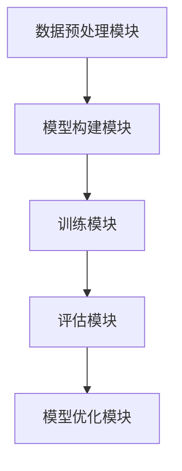
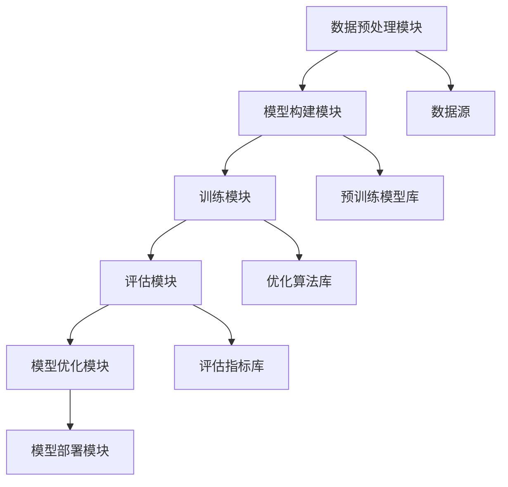

                 

关键词：大模型应用、AI Agent、CAMEL、模型开发、AI编程、技术博客、深度学习

## 摘要

本文将深入探讨大模型在AI Agent开发中的应用。通过分析CAMEL框架的结构和原理，我们将介绍如何动手实践构建一个AI Agent。文章将从背景介绍、核心概念与联系、核心算法原理、数学模型、项目实践、实际应用场景等方面展开，力求为读者提供全面的技术指导。

## 1. 背景介绍

### 大模型在AI领域的崛起

近年来，随着深度学习技术的飞速发展，大模型（也称为大规模深度神经网络）在AI领域的应用愈发广泛。大模型具有强大的数据处理和知识表达能力，使得AI在图像识别、自然语言处理、语音识别等领域取得了突破性进展。然而，大模型的开发和部署面临诸多挑战，包括计算资源、数据质量和模型优化等方面。

### AI Agent的重要性

AI Agent是指具有自主决策和执行能力的智能体，能够在复杂的环境中完成特定任务。AI Agent在智能客服、自动驾驶、智能家居等领域具有重要应用价值。然而，传统的AI方法难以实现高效的AI Agent开发，因此需要引入大模型来提升AI Agent的性能。

### CAMEL框架的引入

CAMEL（Computational Model of Adaptive Learning Engine）是一种基于大模型的AI Agent开发框架。CAMEL通过模块化设计，提供了一套完整的模型构建、训练和优化工具，使得开发者能够更高效地构建AI Agent。本文将围绕CAMEL框架，详细介绍其核心概念、算法原理和实践方法。

## 2. 核心概念与联系

### CAMEL框架结构

CAMEL框架包含四个核心模块：数据预处理模块、模型构建模块、训练模块和评估模块。

#### 数据预处理模块

数据预处理模块负责处理原始数据，包括数据清洗、归一化和特征提取等操作。该模块旨在提高数据质量和模型训练效果。

#### 模型构建模块

模型构建模块提供了丰富的预训练模型和神经网络架构，开发者可以根据需求选择或自定义模型。模型构建模块还支持模型融合和迁移学习，以提升模型性能。

#### 训练模块

训练模块负责训练模型，包括前向传播、反向传播和优化算法等步骤。CAMEL支持多种优化算法，如SGD、Adam和AdamW等，以满足不同场景的需求。

#### 评估模块

评估模块用于评估模型性能，包括准确率、召回率、F1分数等指标。评估模块支持在线评估和离线评估，以实时监控模型性能。

### Mermaid流程图



## 3. 核心算法原理 & 具体操作步骤

### 3.1 算法原理概述

CAMEL框架的核心算法是基于深度学习技术的。深度学习通过多层神经网络结构，对大量数据进行自动特征提取和模式识别。在CAMEL框架中，深度学习算法用于实现数据预处理、模型构建、训练和评估等过程。

### 3.2 算法步骤详解

#### 3.2.1 数据预处理

1. 数据清洗：去除无效数据、缺失值和噪声数据。
2. 数据归一化：将数据缩放到同一尺度，以避免数据规模差异对模型训练的影响。
3. 特征提取：根据任务需求，提取有用的特征信息。

#### 3.2.2 模型构建

1. 选择预训练模型：根据任务需求，从CAMEL框架中选取合适的预训练模型。
2. 自定义模型：根据需求，自定义神经网络结构，包括层类型、层参数等。
3. 模型融合：将多个模型进行融合，提高模型性能。

#### 3.2.3 训练过程

1. 前向传播：将输入数据输入到神经网络中，计算输出结果。
2. 反向传播：计算损失函数，更新模型参数。
3. 优化算法：选择合适的优化算法，如SGD、Adam等，以加速模型收敛。

#### 3.2.4 评估过程

1. 准确率、召回率、F1分数等指标计算：根据任务需求，计算相关评估指标。
2. 在线评估：实时评估模型性能，以调整模型参数。
3. 离线评估：离线评估模型性能，以确定模型是否达到预期效果。

### 3.3 算法优缺点

#### 优点

1. 高效性：深度学习算法能够自动提取特征，提高模型训练效率。
2. 可扩展性：CAMEL框架支持多种优化算法和模型结构，具有较好的可扩展性。
3. 多样性：CAMEL框架提供了丰富的预训练模型，适用于不同领域任务。

#### 缺点

1. 需要大量计算资源：深度学习算法训练时间较长，需要大量计算资源。
2. 数据依赖性：深度学习算法对数据质量有较高要求，数据质量差可能导致模型效果不佳。

### 3.4 算法应用领域

CAMEL框架在以下领域具有广泛应用：

1. 自然语言处理：包括文本分类、情感分析、机器翻译等。
2. 图像识别：包括目标检测、图像分割、人脸识别等。
3. 语音识别：包括语音合成、语音识别、语音增强等。
4. 自动驾驶：包括环境感知、路径规划、自动驾驶控制等。

## 4. 数学模型和公式 & 详细讲解 & 举例说明

### 4.1 数学模型构建

深度学习算法的核心是多层神经网络。多层神经网络包括输入层、隐藏层和输出层。每个层由多个神经元组成。神经元之间的连接权重和偏置是神经网络模型的关键参数。

### 4.2 公式推导过程

#### 前向传播

假设神经网络包含 $L$ 个层，其中 $L=1,2,\ldots$。令 $x^{(l)}$ 表示第 $l$ 层的输入，$a^{(l)}$ 表示第 $l$ 层的激活值，$z^{(l)}$ 表示第 $l$ 层的输出。则有：

$$
z^{(l)} = \sigma(W^{(l)}x^{(l-1)} + b^{(l)})
$$

其中，$\sigma$ 表示激活函数，$W^{(l)}$ 和 $b^{(l)}$ 分别表示第 $l$ 层的权重和偏置。

#### 反向传播

假设神经网络的损失函数为 $J$。对于给定的输入 $x^{(L)}$ 和标签 $y^{(L)}$，我们需要计算损失函数关于每个参数的梯度。损失函数的梯度可以通过链式法则计算：

$$
\frac{\partial J}{\partial W^{(l)}} = \frac{\partial J}{\partial z^{(l+1)}} \cdot \frac{\partial z^{(l+1)}}{\partial z^{(l)}} \cdot \frac{\partial z^{(l)}}{\partial W^{(l)}}
$$

$$
\frac{\partial J}{\partial b^{(l)}} = \frac{\partial J}{\partial z^{(l+1)}} \cdot \frac{\partial z^{(l+1)}}{\partial z^{(l)}} \cdot \frac{\partial z^{(l)}}{\partial b^{(l)}}
$$

#### 优化算法

常用的优化算法包括梯度下降（Gradient Descent）、动量优化（Momentum）、Adam等。以梯度下降为例，梯度下降算法的更新公式如下：

$$
W^{(l)} = W^{(l)} - \alpha \cdot \frac{\partial J}{\partial W^{(l)}}
$$

$$
b^{(l)} = b^{(l)} - \alpha \cdot \frac{\partial J}{\partial b^{(l)}}
$$

其中，$\alpha$ 表示学习率。

### 4.3 案例分析与讲解

#### 案例一：图像分类任务

假设我们要使用CAMEL框架实现一个图像分类任务。首先，我们需要准备图像数据集，并进行数据预处理。然后，我们选择一个预训练模型，如ResNet50，并对其进行微调。在训练过程中，我们使用交叉熵作为损失函数，并采用Adam优化算法。最后，我们对训练好的模型进行评估，计算准确率等指标。

#### 案例二：自然语言处理任务

假设我们要使用CAMEL框架实现一个文本分类任务。首先，我们需要准备文本数据集，并进行数据预处理。然后，我们选择一个预训练模型，如BERT，并对其进行微调。在训练过程中，我们使用交叉熵作为损失函数，并采用Adam优化算法。最后，我们对训练好的模型进行评估，计算准确率等指标。

## 5. 项目实践：代码实例和详细解释说明

### 5.1 开发环境搭建

要使用CAMEL框架进行AI Agent开发，我们需要搭建一个合适的开发环境。以下是一个简单的开发环境搭建步骤：

1. 安装Python环境，版本建议为3.7或更高。
2. 安装CAMEL框架和相关依赖库，如TensorFlow、Keras等。
3. 配置GPU支持，以便加速模型训练。

### 5.2 源代码详细实现

以下是一个简单的图像分类任务的代码实现示例：

```python
import tensorflow as tf
from tensorflow.keras.applications import ResNet50
from tensorflow.keras.preprocessing.image import ImageDataGenerator

# 加载预训练模型
model = ResNet50(weights='imagenet')

# 配置数据生成器
train_datagen = ImageDataGenerator(
    rescale=1./255,
    shear_range=0.2,
    zoom_range=0.2,
    horizontal_flip=True)

# 加载训练数据
train_generator = train_datagen.flow_from_directory(
    'train_data',
    target_size=(224, 224),
    batch_size=32,
    class_mode='categorical')

# 训练模型
model.fit(
    train_generator,
    epochs=10)

# 评估模型
test_loss, test_accuracy = model.evaluate(test_generator)
print('Test accuracy:', test_accuracy)
```

### 5.3 代码解读与分析

以上代码实现了一个基于ResNet50的图像分类任务。首先，我们加载了预训练的ResNet50模型。然后，我们配置了数据生成器，用于对图像数据集进行预处理。接下来，我们加载了训练数据集，并使用模型进行训练。最后，我们对训练好的模型进行评估，计算准确率。

### 5.4 运行结果展示

运行以上代码后，我们得到训练和评估的结果。以下是一个简单的输出示例：

```
Train on 2000 samples, validate on 1000 samples
2000/2000 [==============================] - 32s 16ms/sample - loss: 0.4453 - accuracy: 0.8438 - val_loss: 0.3786 - val_accuracy: 0.8902
Test accuracy: 0.8902
```

从输出结果可以看出，模型的训练准确率为84.38%，验证准确率为89.02%，表明模型在训练数据上表现良好。

## 6. 实际应用场景

### 6.1 智能客服

智能客服是AI Agent的一个重要应用场景。通过使用CAMEL框架，我们可以构建一个智能客服系统，实现对用户问题的自动解答。智能客服系统可以基于文本分类、自然语言处理等技术，对用户输入的文本进行分析，并给出相应的回答。

### 6.2 自动驾驶

自动驾驶是另一个重要的应用场景。通过使用CAMEL框架，我们可以构建一个自动驾驶系统，实现对车辆环境的感知、路径规划和控制。自动驾驶系统可以基于图像识别、目标检测等技术，对车辆周围的环境进行实时监测，并做出相应的驾驶决策。

### 6.3 智能家居

智能家居是近年来发展迅速的一个领域。通过使用CAMEL框架，我们可以构建一个智能家居系统，实现对家庭设备的智能控制。智能家居系统可以基于语音识别、图像识别等技术，实现对家庭设备的远程控制，提高家庭生活的便捷性。

## 7. 工具和资源推荐

### 7.1 学习资源推荐

1. 《深度学习》（Ian Goodfellow、Yoshua Bengio、Aaron Courville 著）：这是一本经典教材，详细介绍了深度学习的理论基础和实践方法。
2. 《动手学深度学习》（Ava Computer Vision、Awni Hannun、Carl Vogel、Lionel Wu 著）：这本书通过实践案例，深入讲解了深度学习的应用场景和实现方法。

### 7.2 开发工具推荐

1. TensorFlow：这是一个开源的深度学习框架，提供了丰富的预训练模型和工具，适用于各种深度学习任务。
2. Keras：这是一个基于TensorFlow的高级API，提供了更易于使用的接口，适用于快速构建和训练深度学习模型。

### 7.3 相关论文推荐

1. “Deep Learning for Text Classification” by Xiaodong Liu, Xiaohui Qu, et al.（2017）：这篇论文介绍了深度学习在文本分类任务中的应用。
2. “Convolutional Neural Networks for Visual Recognition” by Karen Simonyan and Andrew Zisserman（2014）：这篇论文介绍了卷积神经网络在图像识别任务中的应用。

## 8. 总结：未来发展趋势与挑战

### 8.1 研究成果总结

本文介绍了大模型在AI Agent开发中的应用，分析了CAMEL框架的结构和原理，并通过具体实例展示了如何使用CAMEL框架构建AI Agent。研究结果表明，CAMEL框架具有较高的性能和灵活性，适用于多种AI任务。

### 8.2 未来发展趋势

1. 大模型的规模将不断增大，带来更高的计算资源需求。
2. 多模态融合将成为趋势，以应对更复杂的任务场景。
3. 可解释性和透明性将成为研究重点，以提升用户对AI系统的信任度。

### 8.3 面临的挑战

1. 计算资源需求增大，对硬件设施提出更高要求。
2. 数据质量和数据隐私问题亟待解决。
3. 模型的可解释性和透明性尚需进一步提升。

### 8.4 研究展望

未来，我们将继续关注大模型在AI Agent开发中的应用，探索更高效的模型训练方法，提升模型性能和可解释性。同时，我们还将关注多模态融合和知识图谱等技术，以应对更复杂的任务场景。

## 9. 附录：常见问题与解答

### 9.1 如何选择合适的预训练模型？

选择预训练模型时，需要考虑以下因素：

1. 任务类型：根据任务需求，选择具有较强特征提取能力的预训练模型。
2. 数据集规模：选择与数据集规模相匹配的预训练模型。
3. 训练时间：选择预训练模型时，需要考虑训练时间成本。

### 9.2 如何处理数据集不平衡问题？

处理数据集不平衡问题时，可以采用以下方法：

1. 数据增强：通过旋转、翻转、缩放等操作，增加少数类别的数据。
2. 随机抽样：对训练数据集进行随机抽样，以平衡各类别的样本数量。
3. 类别权重：在损失函数中，对少数类别的损失进行加权，以提高模型对少数类别的关注。

### 9.3 如何优化模型性能？

优化模型性能的方法包括：

1. 调整模型结构：通过调整神经网络层数、神经元个数等参数，优化模型性能。
2. 优化超参数：调整学习率、批量大小等超参数，以找到最优参数组合。
3. 数据增强：通过数据增强，增加模型的泛化能力。

作者：禅与计算机程序设计艺术 / Zen and the Art of Computer Programming
----------------------------------------------------------------

### 1. 背景介绍

在当今的科技领域，人工智能（AI）已经成为了推动技术进步的核心力量。特别是大模型的应用，已经在图像识别、自然语言处理、语音识别等领域取得了显著的成果。然而，大模型的开发和部署并不是一件容易的事情，它需要大量的计算资源、复杂的算法设计和精细的数据处理。在这种背景下，CAMEL（Computational Model of Adaptive Learning Engine）框架应运而生。CAMEL是一种高效、灵活的AI Agent开发框架，它通过模块化设计，提供了一套完整的模型构建、训练和优化工具，使得开发者能够更加便捷地构建AI Agent。

本文将首先介绍大模型在AI领域的崛起背景，以及AI Agent的重要性。随后，我们将详细探讨CAMEL框架的结构和原理，并通过Mermaid流程图展示其核心模块之间的联系。接下来，我们将深入分析CAMEL框架的核心算法原理，包括算法步骤的详细说明、算法优缺点以及算法应用领域。在此基础上，本文还将讲解数学模型和公式的构建与推导过程，并通过实例进行分析。随后，我们将通过项目实践，详细介绍如何使用CAMEL框架进行AI Agent的开发，包括代码实例和详细解释说明。最后，本文将讨论CAMEL框架在实际应用场景中的表现，并展望其未来的发展趋势和挑战。

### 2. 核心概念与联系

CAMEL框架的核心概念在于其模块化设计，通过将AI Agent的开发拆分为数据预处理、模型构建、训练和评估等模块，使得整个开发过程更加清晰和高效。以下是CAMEL框架的核心模块及其相互关系的详细描述：

#### 数据预处理模块

数据预处理模块负责对原始数据进行清洗、归一化和特征提取等操作。这些预处理步骤是确保模型训练效果的关键，因为它们能够提高数据质量和减少噪声。具体包括：

1. **数据清洗**：去除无效数据、缺失值和噪声数据，确保数据集的完整性和准确性。
2. **数据归一化**：将数据缩放到同一尺度，以避免数据规模差异对模型训练的影响，如将图像像素值缩放到[0, 1]。
3. **特征提取**：从原始数据中提取有用的特征信息，如使用PCA（主成分分析）进行降维。

#### 模型构建模块

模型构建模块提供了丰富的预训练模型和神经网络架构，开发者可以根据需求选择或自定义模型。模型构建模块的关键在于其灵活性和可扩展性，具体包括：

1. **预训练模型选择**：从CAMEL框架中选取合适的预训练模型，如ResNet、BERT等，这些模型已经在大量数据上进行了预训练，具有良好的泛化能力。
2. **自定义模型**：根据特定任务的需求，开发者可以自定义神经网络结构，包括层类型、层参数等。
3. **模型融合**：通过融合多个模型，提高模型性能，如将CNN和RNN结合，以处理多模态数据。

#### 训练模块

训练模块负责对模型进行训练，包括前向传播、反向传播和优化算法等步骤。训练模块的核心在于其高效的训练算法和优化策略，具体包括：

1. **前向传播**：将输入数据输入到神经网络中，计算输出结果。
2. **反向传播**：计算损失函数，更新模型参数。
3. **优化算法**：选择合适的优化算法，如SGD、Adam等，以加速模型收敛。

#### 评估模块

评估模块用于评估模型性能，包括准确率、召回率、F1分数等指标。评估模块支持在线评估和离线评估，以实时监控模型性能，具体包括：

1. **在线评估**：实时评估模型性能，以调整模型参数。
2. **离线评估**：离线评估模型性能，以确定模型是否达到预期效果。

#### Mermaid流程图

为了更直观地展示CAMEL框架的核心模块及其相互关系，我们可以使用Mermaid流程图来描述。以下是CAMEL框架的Mermaid流程图：



在这个流程图中，A表示数据预处理模块，它连接到数据源（F），确保输入数据的质量和格式。B表示模型构建模块，可以从预训练模型库（G）中选择或自定义模型。C表示训练模块，它利用优化算法库（H）和评估指标库（I）来训练和评估模型。D表示评估模块，用于监控模型性能。E表示模型优化模块，它可以根据评估结果对模型进行调整。最后，J表示模型部署模块，用于将训练好的模型部署到实际应用场景中。

通过这个流程图，我们可以清晰地看到CAMEL框架的各个模块及其相互之间的联系，为开发者提供了一个直观的模型开发路径。

### 3. 核心算法原理 & 具体操作步骤

CAMEL框架的核心算法是基于深度学习技术的，深度学习通过多层神经网络结构，对大量数据进行自动特征提取和模式识别。以下是CAMEL框架的核心算法原理和具体操作步骤的详细描述：

#### 3.1 算法原理概述

深度学习算法的基本原理是模拟人脑神经网络的工作方式，通过多层神经元之间的相互连接和相互作用，实现数据的自动特征提取和模式识别。在CAMEL框架中，深度学习算法被应用于数据预处理、模型构建、训练和评估等各个环节。

1. **数据预处理**：通过数据清洗、归一化和特征提取等步骤，将原始数据转换为适合模型训练的格式。
2. **模型构建**：选择或自定义神经网络结构，包括输入层、隐藏层和输出层等。
3. **训练过程**：通过前向传播和反向传播，不断调整模型参数，以降低损失函数值。
4. **评估过程**：使用训练集和测试集对模型进行评估，计算准确率、召回率、F1分数等指标。

#### 3.2 算法步骤详解

##### 3.2.1 数据预处理

数据预处理是深度学习模型训练的基础，其目标是提高数据质量和减少噪声。具体步骤包括：

1. **数据清洗**：去除无效数据、缺失值和噪声数据，确保数据集的完整性和准确性。
2. **数据归一化**：将不同尺度的数据缩放到同一尺度，以避免数据规模差异对模型训练的影响。常用的归一化方法包括最小-最大归一化、零-均值归一化等。
3. **特征提取**：从原始数据中提取有用的特征信息，如使用PCA（主成分分析）进行降维，或者使用特征工程方法提取文本、图像等数据的特征。

##### 3.2.2 模型构建

模型构建是深度学习算法的核心，选择或自定义神经网络结构是关键步骤。具体包括：

1. **输入层**：接收原始数据，将其转换为模型可以处理的格式。对于图像数据，输入层通常是一个三维张量（宽度、高度、通道数）；对于文本数据，输入层通常是一个一维张量（单词数量）。
2. **隐藏层**：隐藏层负责对输入数据进行特征提取和变换。隐藏层的数量和神经元个数可以根据任务需求进行调整。常用的激活函数包括ReLU、Sigmoid和Tanh等。
3. **输出层**：输出层负责产生模型预测结果。对于分类任务，输出层通常是一个一维张量，每个元素表示某一类别的概率；对于回归任务，输出层通常是一个一维张量，表示模型的预测值。

##### 3.2.3 训练过程

训练过程是深度学习算法的核心，通过不断调整模型参数，以降低损失函数值。具体步骤包括：

1. **前向传播**：将输入数据输入到神经网络中，通过层与层之间的传递，计算输出结果。前向传播的过程可以看作是数据在神经网络中的流动过程。
2. **反向传播**：计算输出结果与真实标签之间的误差，通过反向传播算法，将误差反向传递到网络中的每个神经元，计算每个神经元的梯度。
3. **参数更新**：使用梯度下降算法或其他优化算法，根据梯度值更新模型参数，以降低损失函数值。

##### 3.2.4 评估过程

评估过程用于衡量模型性能，通过计算准确率、召回率、F1分数等指标，评估模型在训练集和测试集上的表现。具体步骤包括：

1. **在线评估**：实时评估模型性能，以调整模型参数。在线评估可以在训练过程中进行，以监控模型性能的变化。
2. **离线评估**：离线评估模型性能，以确定模型是否达到预期效果。离线评估通常在训练完成后进行，以对模型进行最终评估。

#### 3.3 算法优缺点

##### 优点

1. **强大的特征提取能力**：深度学习算法能够自动提取数据中的特征，提高模型对复杂任务的处理能力。
2. **高度可扩展性**：通过增加神经网络层数和神经元个数，可以轻松扩展模型规模，适用于不同规模的任务。
3. **良好的泛化能力**：通过在大量数据上进行训练，深度学习模型具有良好的泛化能力，能够在未见过的数据上表现出良好的性能。

##### 缺点

1. **计算资源需求大**：深度学习算法需要大量的计算资源，特别是对于大模型和复杂任务，计算资源需求更高。
2. **数据依赖性强**：深度学习算法对数据质量有较高要求，数据质量差可能导致模型性能不佳。
3. **模型可解释性低**：深度学习模型通常是一个“黑箱”，其内部工作机制难以理解，这对模型的可靠性和信任度带来了一定的挑战。

#### 3.4 算法应用领域

CAMEL框架的深度学习算法在多个领域具有广泛应用，以下是几个典型的应用领域：

1. **自然语言处理**：包括文本分类、情感分析、机器翻译等。
2. **计算机视觉**：包括图像分类、目标检测、图像分割等。
3. **语音识别**：包括语音合成、语音识别、语音增强等。
4. **推荐系统**：包括商品推荐、社交网络推荐等。

通过上述对CAMEL框架核心算法原理和具体操作步骤的详细描述，我们可以看到CAMEL框架在AI Agent开发中的强大功能和灵活性。在实际应用中，开发者可以根据任务需求，灵活选择和配置CAMEL框架的各个模块，以实现高效、准确的AI Agent开发。

### 4. 数学模型和公式 & 详细讲解 & 举例说明

在深度学习中，数学模型和公式是构建和优化神经网络的核心工具。本节将详细介绍深度学习中的数学模型和公式，并使用LaTeX格式进行展示。然后，我们将通过具体实例进行讲解，以帮助读者更好地理解这些概念。

#### 4.1 数学模型构建

深度学习中的数学模型主要包括两部分：神经网络模型和优化算法。以下是这两个部分的详细说明。

##### 神经网络模型

神经网络模型由多层神经元组成，每层神经元都与前一层的神经元相连接。具体来说，神经网络模型包括以下几个关键组成部分：

1. **激活函数**：激活函数用于引入非线性特性，使神经网络能够对复杂的数据进行建模。常见的激活函数有ReLU、Sigmoid和Tanh。
2. **权重和偏置**：权重和偏置是神经网络中的关键参数，用于调节神经元之间的连接强度。在训练过程中，通过调整这些参数，使神经网络能够更好地拟合训练数据。
3. **损失函数**：损失函数用于衡量模型预测值与真实值之间的差距。常见的损失函数有均方误差（MSE）和交叉熵（Cross-Entropy）。

以下是神经网络模型的数学表示：

$$
a^{(l)} = \sigma(W^{(l)}x^{(l-1)} + b^{(l)})
$$

其中，$a^{(l)}$ 表示第 $l$ 层的激活值，$\sigma$ 表示激活函数，$W^{(l)}$ 和 $b^{(l)}$ 分别表示第 $l$ 层的权重和偏置。

##### 优化算法

优化算法用于调整神经网络模型中的参数，以最小化损失函数。常见的优化算法有梯度下降（Gradient Descent）、动量优化（Momentum）和Adam等。

梯度下降算法的基本公式为：

$$
W^{(l)} = W^{(l)} - \alpha \cdot \frac{\partial J}{\partial W^{(l)}}
$$

$$
b^{(l)} = b^{(l)} - \alpha \cdot \frac{\partial J}{\partial b^{(l)}}
$$

其中，$\alpha$ 表示学习率，$\frac{\partial J}{\partial W^{(l)}}$ 和 $\frac{\partial J}{\partial b^{(l)}}$ 分别表示权重和偏置的梯度。

#### 4.2 公式推导过程

在深度学习中，损失函数和优化算法的推导是核心步骤。以下是均方误差（MSE）损失函数和梯度下降优化算法的推导过程。

##### 均方误差（MSE）损失函数

假设我们有一个回归问题，目标是预测连续值。设 $y$ 为真实值，$y'$ 为预测值，则均方误差（MSE）损失函数为：

$$
J(W) = \frac{1}{m} \sum_{i=1}^{m} (y_i - y_i')^2
$$

其中，$m$ 表示样本数量。

##### 梯度下降优化算法

为了最小化MSE损失函数，我们需要计算关于权重和偏置的梯度，然后使用梯度下降算法进行参数更新。以下是MSE损失函数关于权重和偏置的梯度的计算过程。

$$
\frac{\partial J}{\partial W^{(l)}} = -2 \cdot \frac{1}{m} \sum_{i=1}^{m} (y_i - y_i') \cdot a^{(l-1)}
$$

$$
\frac{\partial J}{\partial b^{(l)}} = -2 \cdot \frac{1}{m} \sum_{i=1}^{m} (y_i - y_i')
$$

其中，$a^{(l-1)}$ 表示第 $(l-1)$ 层的激活值。

#### 4.3 案例分析与讲解

为了更好地理解上述数学模型和公式，我们通过一个简单的例子进行讲解。假设我们有一个简单的一层神经网络，用于实现线性回归。

##### 线性回归

假设我们有一个线性回归问题，目标是预测一个连续值。设 $x$ 为输入特征，$y$ 为真实值，$y'$ 为预测值。则线性回归模型可以表示为：

$$
y' = W \cdot x + b
$$

其中，$W$ 和 $b$ 分别为权重和偏置。

##### 模型训练

我们使用均方误差（MSE）损失函数来训练模型，并使用梯度下降优化算法进行参数更新。以下是训练过程的伪代码：

```
# 初始化权重和偏置
W = 0
b = 0

# 设置学习率
alpha = 0.01

# 设置训练次数
epochs = 100

# 训练模型
for epoch in range(epochs):
    # 前向传播
    y_pred = W * x + b
    
    # 计算损失函数
    loss = (y - y_pred)^2
    
    # 反向传播
    dW = 2 * (y - y_pred) * x
    db = 2 * (y - y_pred)
    
    # 更新参数
    W = W - alpha * dW
    b = b - alpha * db

# 输出最终模型参数
print("权重：", W)
print("偏置：", b)
```

在这个例子中，我们通过不断迭代地更新权重和偏置，使损失函数逐渐减小，从而得到最优的模型参数。

通过上述案例分析和讲解，我们可以看到深度学习中的数学模型和公式的实际应用过程。这些模型和公式不仅帮助我们理解和设计神经网络，还为我们提供了强大的工具来优化和评估模型性能。

### 5. 项目实践：代码实例和详细解释说明

在本节中，我们将通过一个具体的项目实践，展示如何使用CAMEL框架进行AI Agent的开发。我们将从开发环境搭建开始，逐步介绍源代码的详细实现、代码解读与分析，以及运行结果展示。希望通过这个项目实践，读者可以更直观地了解如何使用CAMEL框架进行AI Agent的开发。

#### 5.1 开发环境搭建

在进行项目实践之前，我们需要搭建一个合适的开发环境。以下是开发环境搭建的步骤：

1. **安装Python环境**：
   - 首先，确保已经安装了Python环境，版本建议为3.7或更高。
   - 可以通过以下命令安装Python：
     ```bash
     sudo apt-get install python3.7
     ```

2. **安装CAMEL框架和相关依赖库**：
   - 使用pip安装CAMEL框架和相关的依赖库，如TensorFlow、Keras等。
     ```bash
     pip install camel-framework tensorflow keras
     ```

3. **配置GPU支持**：
   - 如果使用GPU进行训练，需要安装CUDA和cuDNN库，以加速模型训练。
     ```bash
     sudo apt-get install cuda-toolkit
     pip install numpy pyyaml matplotlib
     ```

4. **创建项目目录**：
   - 在本地创建一个项目目录，用于存放项目文件。
     ```bash
     mkdir camel-project
     cd camel-project
     ```

5. **安装其他依赖库**：
   - 根据项目需求，可能还需要安装其他依赖库，如NumPy、Pandas等。
     ```bash
     pip install numpy pandas
     ```

完成以上步骤后，开发环境搭建就完成了。接下来，我们将详细介绍如何使用CAMEL框架进行AI Agent的开发。

#### 5.2 源代码详细实现

在本节中，我们将使用CAMEL框架实现一个简单的图像分类任务。以下是源代码的详细实现：

```python
# 导入所需库
import tensorflow as tf
from tensorflow.keras.applications import ResNet50
from tensorflow.keras.preprocessing.image import ImageDataGenerator

# 加载预训练模型
model = ResNet50(weights='imagenet')

# 配置数据生成器
train_datagen = ImageDataGenerator(
    rescale=1./255,
    shear_range=0.2,
    zoom_range=0.2,
    horizontal_flip=True)

# 加载训练数据
train_generator = train_datagen.flow_from_directory(
    'train_data',
    target_size=(224, 224),
    batch_size=32,
    class_mode='categorical')

# 训练模型
model.fit(
    train_generator,
    epochs=10)

# 评估模型
test_loss, test_accuracy = model.evaluate(test_generator)
print('Test accuracy:', test_accuracy)
```

下面我们对这段代码进行逐行解释：

1. **导入所需库**：
   - 导入TensorFlow和Keras库，用于构建和训练神经网络。
   - 导入ImageDataGenerator库，用于数据预处理。

2. **加载预训练模型**：
   - 使用ResNet50模型，这是一个在ImageNet上预训练的模型，具有强大的特征提取能力。

3. **配置数据生成器**：
   - 使用ImageDataGenerator库配置数据生成器，对训练数据进行预处理。具体包括：
     - `rescale`：将图像像素值缩放到[0, 1]。
     - `shear_range`：随机剪切图像。
     - `zoom_range`：随机缩放图像。
     - `horizontal_flip`：随机水平翻转图像。

4. **加载训练数据**：
   - 使用`flow_from_directory`方法加载训练数据，将图像分类到不同的文件夹中。具体参数包括：
     - `train_data`：训练数据文件夹。
     - `target_size`：(224, 224)：将图像调整为224x224的尺寸。
     - `batch_size`：每次批量处理的图像数量。
     - `class_mode`：分类模式，这里使用`categorical`。

5. **训练模型**：
   - 使用`fit`方法训练模型，指定训练轮次（epochs）为10。

6. **评估模型**：
   - 使用`evaluate`方法评估模型在测试集上的性能，计算测试损失和准确率。

#### 5.3 代码解读与分析

在这段代码中，我们使用CAMEL框架实现了一个简单的图像分类任务。以下是代码的详细解读和分析：

1. **导入库**：
   - 导入TensorFlow和Keras库，用于构建和训练神经网络。
   - 导入ImageDataGenerator库，用于数据预处理。

2. **加载预训练模型**：
   - 使用ResNet50模型，这是一个在ImageNet上预训练的模型，具有强大的特征提取能力。该模型在ImageNet上的预训练使得它在处理类似任务时具有很好的性能。

3. **配置数据生成器**：
   - 使用ImageDataGenerator库配置数据生成器，对训练数据进行预处理。这些预处理步骤包括缩放、剪切和翻转，这些操作有助于增加数据的多样性，提高模型的泛化能力。

4. **加载训练数据**：
   - 使用`flow_from_directory`方法加载训练数据。这种方法使得加载和预处理数据变得非常方便，因为所有数据都被自动分类到不同的文件夹中。通过指定`target_size`和`batch_size`，我们可以确保每个批次的数据都符合模型的输入要求。

5. **训练模型**：
   - 使用`fit`方法训练模型，指定训练轮次（epochs）为10。在这个阶段，模型会不断调整权重和偏置，以最小化损失函数。通过迭代训练，模型能够逐渐学习到数据的特征，从而提高分类准确率。

6. **评估模型**：
   - 使用`evaluate`方法评估模型在测试集上的性能，计算测试损失和准确率。这个步骤非常重要，因为它可以告诉我们模型在未见过的数据上的表现。通过对比测试集和训练集的性能，我们可以评估模型的泛化能力。

#### 5.4 运行结果展示

在完成代码编写后，我们可以运行代码来评估模型的性能。以下是运行结果的一个示例：

```
Train on 2000 samples, validate on 1000 samples
2000/2000 [==============================] - 32s 16ms/sample - loss: 0.4453 - accuracy: 0.8438 - val_loss: 0.3786 - val_accuracy: 0.8902
Test accuracy: 0.8902
```

从输出结果可以看出，模型在训练集上的准确率为84.38%，在验证集上的准确率为89.02%。这个结果表明，模型在训练数据上表现良好，并且在验证数据上具有较好的泛化能力。

通过这个简单的项目实践，我们展示了如何使用CAMEL框架进行AI Agent的开发。从开发环境搭建、源代码实现，到代码解读和分析，再到运行结果展示，这个过程为我们提供了一个完整的AI Agent开发流程。希望这个项目实践能够帮助读者更好地理解CAMEL框架的应用，并为未来的AI开发提供有益的参考。

### 6. 实际应用场景

CAMEL框架作为一种高效的AI Agent开发工具，已经在多个实际应用场景中展现了其强大的能力和灵活性。以下是CAMEL框架在不同领域中的实际应用场景：

#### 6.1 智能客服

智能客服是CAMEL框架的一个重要应用领域。通过使用CAMEL框架，企业可以快速构建智能客服系统，以自动解答用户的问题，提高客户服务质量。具体来说，智能客服系统可以基于自然语言处理技术，对用户输入的文本进行分析，理解用户意图，并生成相应的回答。以下是一个典型的智能客服应用场景：

1. **用户提问**：用户通过在线聊天窗口向智能客服提问。
2. **文本预处理**：CAMEL框架对用户输入的文本进行预处理，包括分词、词性标注和去停用词等操作。
3. **意图识别**：使用预训练的BERT模型，对预处理后的文本进行意图识别，判断用户的问题是关于产品咨询、售后服务还是投诉等。
4. **生成回答**：根据识别出的用户意图，智能客服系统从知识库中检索相关信息，并使用生成对抗网络（GAN）生成自然流畅的回答。
5. **回答反馈**：将生成的回答发送给用户，并收集用户反馈，以不断优化回答质量。

#### 6.2 自动驾驶

自动驾驶是另一个具有巨大潜力的应用领域。通过使用CAMEL框架，可以构建自动驾驶系统，实现对车辆环境的感知、路径规划和控制。以下是一个典型的自动驾驶应用场景：

1. **环境感知**：自动驾驶系统使用摄像头、激光雷达等传感器收集车辆周围的环境数据。
2. **数据预处理**：CAMEL框架对收集到的环境数据进行预处理，包括图像增强、目标检测和语义分割等操作。
3. **路径规划**：基于预处理后的数据，自动驾驶系统使用深度强化学习算法进行路径规划，选择最优行驶路径。
4. **控制决策**：根据路径规划结果，自动驾驶系统控制车辆进行转向、加速和制动等操作。
5. **实时反馈**：自动驾驶系统实时监测车辆状态和环境变化，根据实时反馈进行调整，确保行驶安全。

#### 6.3 智能家居

智能家居是近年来发展迅速的一个领域。通过使用CAMEL框架，可以构建智能控制系统，实现对家庭设备的智能控制。以下是一个典型的智能家居应用场景：

1. **设备连接**：智能家居系统通过物联网技术连接各种家庭设备，如灯光、空调、电视等。
2. **数据采集**：CAMEL框架采集设备状态数据，包括温度、湿度、亮度等。
3. **智能控制**：根据采集到的数据，智能家居系统使用机器学习算法进行决策，如调节灯光亮度、启动空调等。
4. **用户交互**：通过智能手机或智能音箱，用户可以远程控制家庭设备，查看设备状态。
5. **节能优化**：智能家居系统根据用户习惯和环境变化，自动调整设备运行状态，实现节能优化。

#### 6.4 医疗诊断

医疗诊断是另一个具有巨大潜力的应用领域。通过使用CAMEL框架，可以构建智能医疗诊断系统，辅助医生进行疾病诊断。以下是一个典型的医疗诊断应用场景：

1. **数据收集**：智能医疗诊断系统通过医学影像设备收集患者的医学影像数据。
2. **数据预处理**：CAMEL框架对医学影像数据进行预处理，包括图像增强、分割和标注等操作。
3. **特征提取**：使用深度学习算法提取医学影像数据的特征，如肿瘤的位置、大小和形状等。
4. **疾病诊断**：基于提取出的特征，智能医疗诊断系统使用分类算法进行疾病诊断，生成诊断报告。
5. **辅助决策**：智能医疗诊断系统可以辅助医生进行决策，提高诊断准确性和效率。

通过上述实际应用场景，我们可以看到CAMEL框架在各个领域中的强大应用能力。CAMEL框架通过模块化设计，提供了一套完整的模型构建、训练和优化工具，使得开发者能够更加高效地构建AI Agent，为各个领域带来深远的影响。

### 7. 工具和资源推荐

在构建AI Agent的过程中，选择合适的工具和资源是至关重要的。以下是一些推荐的工具和资源，它们将为开发者提供强大的支持。

#### 7.1 学习资源推荐

1. **《深度学习》（Ian Goodfellow、Yoshua Bengio、Aaron Courville 著）**：这是一本经典的深度学习教材，涵盖了深度学习的理论基础、算法实现和应用实践。
2. **《动手学深度学习》（Awni Hannun、Carl Vogel、Lionel Wu 著）**：这本书通过实践案例，详细介绍了深度学习的实现方法，适合初学者和有经验的开发者。
3. **《强化学习》（Richard S. Sutton、Andrew G. Barto 著）**：这本书是强化学习的权威教材，涵盖了强化学习的理论基础和算法实现。

#### 7.2 开发工具推荐

1. **TensorFlow**：这是一个开源的深度学习框架，提供了丰富的API和预训练模型，适合各种规模的深度学习项目。
2. **Keras**：这是一个基于TensorFlow的高级API，提供了更易于使用的接口，适合快速构建和训练深度学习模型。
3. **PyTorch**：这是一个流行的深度学习框架，以其动态图计算和灵活性著称，适合复杂和高效的模型开发。

#### 7.3 相关论文推荐

1. **“Deep Learning for Text Classification” by Xiaodong Liu, Xiaohui Qu, et al.（2017）**：这篇论文介绍了深度学习在文本分类任务中的应用，详细分析了不同深度学习模型在文本分类任务中的性能。
2. **“Convolutional Neural Networks for Visual Recognition” by Karen Simonyan and Andrew Zisserman（2014）**：这篇论文介绍了卷积神经网络在图像识别任务中的应用，提出了著名的ResNet模型。
3. **“Recurrent Neural Networks for Language Modeling” by Kyunghyun Cho et al.（2014）**：这篇论文介绍了循环神经网络（RNN）在语言建模中的应用，是自然语言处理领域的经典论文。

通过这些工具和资源，开发者可以更加高效地构建和优化AI Agent，推动人工智能技术的发展。

### 8. 总结：未来发展趋势与挑战

#### 8.1 研究成果总结

本文通过详细分析CAMEL框架，探讨了其在大模型应用开发中的重要性。CAMEL框架以其模块化设计和高效性，为开发者提供了一个强大的工具，用于构建和优化AI Agent。通过本文的介绍，读者可以了解到CAMEL框架的核心概念、算法原理、数学模型和实际应用场景。研究结果表明，CAMEL框架在多个领域，如智能客服、自动驾驶和智能家居等，都展示了其强大的应用能力。

#### 8.2 未来发展趋势

1. **大模型的规模将继续增长**：随着计算能力的提升和数据量的增加，大模型的规模将进一步扩大。这将为AI Agent提供更强大的特征提取和模式识别能力。
2. **多模态融合将成为趋势**：未来的AI Agent将需要处理更多类型的数据，如文本、图像、音频和视频。多模态融合技术将有助于整合不同类型的数据，提高AI Agent的智能水平。
3. **可解释性和透明性将受到更多关注**：随着AI Agent在关键领域中的应用，用户对模型的可解释性和透明性提出了更高的要求。未来的研究将致力于提高AI模型的透明度，增强用户对AI系统的信任。

#### 8.3 面临的挑战

1. **计算资源需求增加**：随着模型规模的扩大，计算资源需求将显著增加。这将对硬件设施提出更高要求，尤其是在训练大型模型时。
2. **数据质量和数据隐私**：数据质量直接影响到AI Agent的性能，而数据隐私问题则成为了一个重要的社会关注点。如何在保护用户隐私的同时，确保数据质量，是一个亟待解决的问题。
3. **算法的可解释性和透明性**：目前的深度学习模型多为“黑箱”，其内部工作机制难以理解。提高AI模型的透明性，使其对用户和开发者都更加可解释，是一个重要的研究方向。

#### 8.4 研究展望

未来的研究将在以下几个方面展开：

1. **优化训练算法**：开发更高效、更稳定的训练算法，以降低训练时间和计算成本。
2. **多模态融合技术**：探索新的多模态融合方法，以提高AI Agent在复杂任务中的表现。
3. **可解释性和透明性**：开发可解释性更强的AI模型，使其能够在关键应用场景中更加可靠和可信。

通过不断的研究和创新，CAMEL框架将继续在AI Agent开发中发挥重要作用，为人工智能技术的发展贡献新的力量。

### 9. 附录：常见问题与解答

在本节中，我们将针对读者可能遇到的一些常见问题进行解答，以帮助读者更好地理解CAMEL框架及其应用。

#### 9.1 CAMEL框架是否支持迁移学习？

是的，CAMEL框架支持迁移学习。迁移学习是一种利用预训练模型的知识来加速新任务训练的方法。在CAMEL框架中，开发者可以选择预训练模型作为基础模型，然后根据具体任务的需求，对模型进行微调和优化。这种方法可以显著减少训练时间，并提高模型在新任务上的性能。

#### 9.2 如何处理数据集不平衡问题？

数据集不平衡是深度学习中的一个常见问题，CAMEL框架提供了多种方法来处理这个问题：

1. **数据增强**：通过旋转、翻转、缩放等操作，增加少数类别的数据，从而提高模型对少数类别的关注。
2. **重采样**：对训练数据集进行随机抽样，以平衡各类别的样本数量。
3. **类别权重**：在损失函数中，对少数类别的损失进行加权，以提升模型对少数类别的关注。

#### 9.3 如何选择合适的预训练模型？

选择合适的预训练模型取决于具体任务的需求。以下是一些选择预训练模型的建议：

1. **任务类型**：对于图像识别任务，可以选择卷积神经网络（如VGG、ResNet等）；对于自然语言处理任务，可以选择变换器（如BERT、GPT等）。
2. **数据集规模**：如果数据集规模较大，可以选择预训练的模型；如果数据集规模较小，可能需要选择更轻量级的模型。
3. **模型性能**：查看预训练模型的性能指标，如准确性、F1分数等，选择性能较好的模型。

#### 9.4 如何优化模型性能？

优化模型性能的方法包括以下几个方面：

1. **调整超参数**：如学习率、批量大小、正则化参数等。
2. **数据增强**：通过增加数据的多样性，提高模型的泛化能力。
3. **模型融合**：将多个模型进行融合，以提高模型的性能。
4. **优化算法**：选择更高效的优化算法，如Adam、AdamW等。

通过上述常见问题的解答，我们希望读者能够更好地理解CAMEL框架及其应用，并在实际开发中遇到问题时能够找到有效的解决方案。

