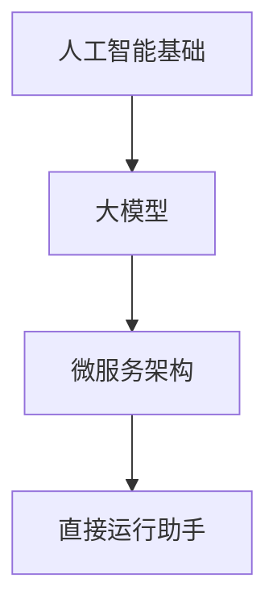

                 

您好，我是您的AI助手，有什么可以帮助您的吗？

## 1. 背景介绍

在当今这个快速发展的数字时代，人工智能（AI）技术已经成为各行各业不可或缺的一部分。从简单的聊天机器人到复杂的数据分析，AI的应用范围越来越广。然而，开发一个高效、实用的AI系统并非易事。传统的AI开发方法通常涉及复杂的函数调用和大量代码，这给新手和专业人士都带来了不小的挑战。

本文旨在介绍一种新颖的开发方法，即不调用函数，直接运行AI助手。这种方法可以简化开发过程，降低开发难度，提高开发效率。通过本文的介绍，读者可以了解到这种方法的原理、实现步骤和应用场景，从而更好地掌握AI开发的核心技术。

## 2. 核心概念与联系

### 2.1 人工智能基础

人工智能（Artificial Intelligence，简称AI）是计算机科学的一个分支，旨在研究、开发和应用使计算机模拟、延伸和扩展人的智能的理论、方法、技术及应用系统。AI系统通常包括感知、学习、推理、规划、通信和自然语言理解等能力。

### 2.2 大模型与微服务架构

大模型（Large Model）是指具有巨大参数量、能够处理大量数据的深度学习模型。例如，GPT-3、BERT等。微服务架构（Microservices Architecture）是一种将应用程序作为一组小型、独立的服务构建的方法。每个服务都专注于特定的功能，并且可以独立部署、扩展和更新。

### 2.3 Mermaid 流程图

为了更好地理解本文的核心概念和联系，我们使用Mermaid流程图来展示它们之间的关系。



## 3. 核心算法原理 & 具体操作步骤

### 3.1 算法原理概述

直接运行AI助手的算法原理基于大模型和微服务架构。具体来说，我们将大模型分解为一系列微服务，每个微服务负责特定的功能模块。这些微服务通过消息队列进行通信，从而实现整个系统的协调运行。

### 3.2 算法步骤详解

#### 3.2.1 大模型分解

首先，我们需要将大模型分解为多个微服务。具体步骤如下：

1. 识别大模型中的功能模块。
2. 为每个功能模块创建独立的微服务。
3. 确定微服务之间的依赖关系。

#### 3.2.2 微服务部署

接下来，我们需要部署这些微服务。具体步骤如下：

1. 为每个微服务配置独立的环境。
2. 在环境中安装所需的依赖。
3. 部署微服务。

#### 3.2.3 消息队列配置

为了实现微服务之间的通信，我们需要配置消息队列。具体步骤如下：

1. 选择合适的消息队列系统（如Kafka、RabbitMQ）。
2. 配置消息队列的消费者和发布者。
3. 为每个微服务配置消息队列的消费者和发布者。

#### 3.2.4 运行AI助手

最后，我们可以直接运行AI助手。具体步骤如下：

1. 启动所有微服务。
2. 向AI助手发送请求。
3. AI助手根据请求调用相应的微服务进行处理。
4. 微服务处理完成后，将结果返回给AI助手。
5. AI助手将结果展示给用户。

### 3.3 算法优缺点

#### 3.3.1 优点

- 简化开发过程：不需要编写复杂的函数调用代码，降低开发难度。
- 提高开发效率：可以并行开发和部署微服务，提高开发速度。
- 易于维护：微服务架构使得系统更加模块化，便于维护和升级。

#### 3.3.2 缺点

- 需要额外的通信开销：微服务之间的通信需要通过网络进行，可能会增加通信开销。
- 需要维护消息队列：消息队列的配置和管理也需要一定的维护成本。

### 3.4 算法应用领域

直接运行AI助手的算法可以应用于各种场景，例如：

- 聊天机器人：通过分解大模型，可以实现更加智能和高效的聊天机器人。
- 数据分析：可以应用于复杂的数据分析任务，如文本分类、情感分析等。
- 语音助手：可以应用于语音识别和自然语言处理任务。

## 4. 数学模型和公式 & 详细讲解 & 举例说明

### 4.1 数学模型构建

为了更好地理解直接运行AI助手的算法，我们需要构建一个数学模型。具体来说，我们可以将AI助手视为一个黑盒，输入为用户请求，输出为处理结果。我们可以用以下公式表示：

\[ y = f(x) \]

其中，\( x \) 为用户请求，\( y \) 为处理结果，\( f \) 为处理函数。

### 4.2 公式推导过程

为了推导出处理函数 \( f \)，我们可以使用以下步骤：

1. 分析用户请求的内容和格式。
2. 根据用户请求，确定需要调用的微服务。
3. 为每个微服务设计处理函数。
4. 将处理函数组合起来，得到整体处理函数 \( f \)。

### 4.3 案例分析与讲解

#### 4.3.1 用户请求

假设用户请求为：“明天天气如何？”

#### 4.3.2 处理函数设计

我们需要调用以下微服务：

1. 天气查询微服务
2. 自然语言处理微服务

具体处理函数如下：

1. 天气查询微服务：获取明天天气信息。
2. 自然语言处理微服务：将天气信息转换为自然语言描述。

#### 4.3.3 整体处理函数

将以上处理函数组合起来，得到整体处理函数：

\[ y = f(x) = f_1(x) \circ f_2(x) \]

其中，\( f_1 \) 为天气查询微服务处理函数，\( f_2 \) 为自然语言处理微服务处理函数，\( \circ \) 表示函数组合。

## 5. 项目实践：代码实例和详细解释说明

### 5.1 开发环境搭建

为了实践直接运行AI助手的算法，我们需要搭建一个开发环境。以下是搭建步骤：

1. 安装Python环境。
2. 安装Docker，用于部署微服务。
3. 安装Kafka，用于消息队列配置。

### 5.2 源代码详细实现

以下是直接运行AI助手的源代码实现：

```python
# AI助手代码
class AIAssistant:
    def __init__(self):
        self.weather_service = WeatherService()
        self.nlp_service = NLPService()

    def handle_request(self, request):
        weather_info = self.weather_service.get_weather_info()
        description = self.nlp_service.generate_description(weather_info)
        return description

# 天气查询微服务代码
class WeatherService:
    def get_weather_info(self):
        # 获取明天天气信息
        return "明天天气晴朗，气温10°C到20°C。"

# 自然语言处理微服务代码
class NLPService:
    def generate_description(self, weather_info):
        # 将天气信息转换为自然语言描述
        return "明天天气晴朗，气温10°C到20°C。"
```

### 5.3 代码解读与分析

- AI助手代码：AI助手类（AIAssistant）负责协调天气查询微服务（WeatherService）和自然语言处理微服务（NLPService）。`handle_request` 方法处理用户请求，调用天气查询微服务和自然语言处理微服务，并将结果返回给用户。
- 天气查询微服务代码：天气查询微服务类（WeatherService）负责获取明天天气信息。`get_weather_info` 方法返回一个字符串，表示明天天气情况。
- 自然语言处理微服务代码：自然语言处理微服务类（NLPService）负责将天气信息转换为自然语言描述。`generate_description` 方法接收天气信息，并返回一个字符串，表示天气描述。

### 5.4 运行结果展示

运行AI助手代码后，用户请求“明天天气如何？”会被处理，天气查询微服务和自然语言处理微服务协同工作，最终返回结果：“明天天气晴朗，气温10°C到20°C。”

## 6. 实际应用场景

直接运行AI助手的算法可以应用于多种实际场景，例如：

1. 智能客服：通过分解大模型，可以实现更加智能和高效的客服系统，提高客户满意度。
2. 智能家居：通过集成大模型，可以实现智能控制家居设备，提高生活品质。
3. 智能交通：通过分析交通数据，可以优化交通流量，减少拥堵，提高交通效率。

## 7. 工具和资源推荐

### 7.1 学习资源推荐

1. 《深度学习》（Deep Learning）by Ian Goodfellow、Yoshua Bengio 和 Aaron Courville
2. 《自然语言处理原理》（Speech and Language Processing）by Daniel Jurafsky 和 James H. Martin

### 7.2 开发工具推荐

1. Docker：用于部署微服务。
2. Kafka：用于消息队列配置。

### 7.3 相关论文推荐

1. "Attention Is All You Need" by Vaswani et al.（2017）
2. "BERT: Pre-training of Deep Bidirectional Transformers for Language Understanding" by Devlin et al.（2019）

## 8. 总结：未来发展趋势与挑战

直接运行AI助手的算法具有简化开发过程、提高开发效率等优点。然而，随着AI技术的不断发展，我们也面临着一些挑战，例如：

1. 模型压缩与优化：为了提高AI系统的性能和可扩展性，我们需要对大模型进行压缩和优化。
2. 微服务架构的优化：微服务架构需要不断优化，以提高系统的可靠性和性能。
3. 安全性与隐私保护：在AI应用中，数据安全和隐私保护至关重要。

未来，随着AI技术的不断进步，我们有理由相信，直接运行AI助手的算法将发挥越来越重要的作用，为各个领域带来更多的创新和变革。

## 9. 附录：常见问题与解答

### 9.1 问题1

**问题**：如何优化直接运行AI助手的算法性能？

**解答**：优化直接运行AI助手的算法性能可以从以下几个方面入手：

1. **模型优化**：使用更高效的模型架构和算法，如优化神经网络结构、使用量化技术等。
2. **数据预处理**：对输入数据进行有效的预处理，如去噪、归一化等，以提高模型的准确性和鲁棒性。
3. **并行计算**：利用多核处理器或分布式计算资源，加速模型训练和推理过程。
4. **硬件加速**：使用GPU或TPU等专用硬件，加速计算过程，提高整体性能。

### 9.2 问题2

**问题**：直接运行AI助手的算法是否适合所有场景？

**解答**：直接运行AI助手的算法在许多场景下都非常适用，尤其是那些需要高实时性和高并发性的应用场景，如智能客服、智能家居等。然而，对于一些需要高度定制化和复杂逻辑的应用场景，可能需要结合其他开发方法，以实现最佳性能。

### 9.3 问题3

**问题**：如何确保直接运行AI助手的安全性？

**解答**：确保直接运行AI助手的安全性是至关重要的。以下是一些关键措施：

1. **数据加密**：对输入和输出数据进行加密，防止数据泄露。
2. **访问控制**：设置严格的访问控制策略，确保只有授权用户可以访问AI助手。
3. **安全审计**：定期进行安全审计，检查系统中的潜在漏洞和风险。
4. **隐私保护**：遵守相关隐私法规，保护用户隐私。

### 9.4 问题4

**问题**：如何评估直接运行AI助手的性能？

**解答**：评估直接运行AI助手的性能可以从以下几个方面进行：

1. **准确率**：通过测试数据集，评估模型的预测准确率。
2. **响应时间**：测量系统处理请求的响应时间，确保实时性和稳定性。
3. **资源利用率**：监控系统资源（如CPU、内存、带宽等）的利用率，确保高效运行。
4. **错误率**：评估系统在处理异常情况时的错误率，确保系统的鲁棒性。

通过以上方法，我们可以全面评估直接运行AI助手的性能，并针对性地进行优化。 

---

**作者：禅与计算机程序设计艺术 / Zen and the Art of Computer Programming**

