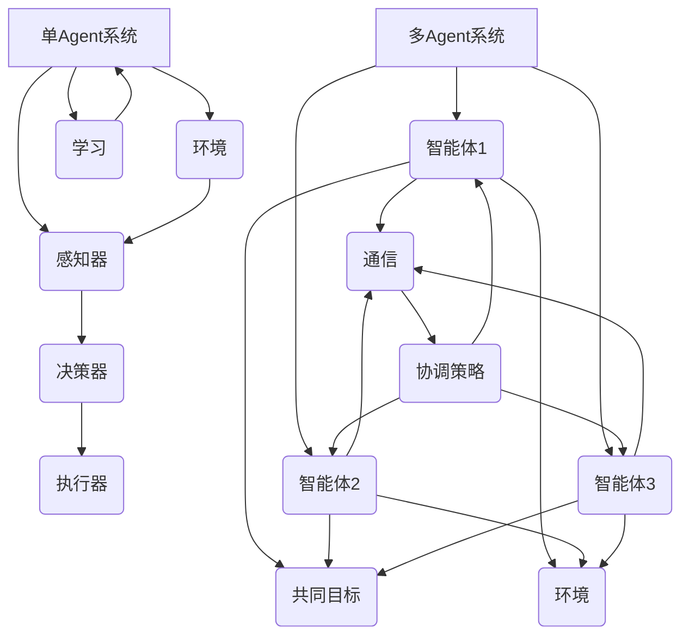

                 

关键词：大模型应用、AI Agent、多Agent系统、技术实现、代码实例、数学模型、未来展望

> 摘要：本文旨在探讨如何从单Agent扩展到多Agent系统的开发，通过深入分析大模型应用的开发过程，提供详细的算法原理、数学模型和代码实例，帮助读者更好地理解和应用AI Agent技术。本文将分为背景介绍、核心概念与联系、核心算法原理、数学模型和公式、项目实践、实际应用场景、工具和资源推荐、总结和附录等部分，力求全面覆盖从零开始构建AI Agent系统的全过程。

## 1. 背景介绍

人工智能（AI）作为现代科技的前沿领域，已经广泛应用于各个行业，从医疗诊断到自动驾驶，从智能家居到金融分析，AI技术正在深刻改变我们的生活方式。在AI技术中，Agent是一种重要的概念，它代表了一个具有智能的实体，可以自主地感知环境、做出决策并采取行动。

Agent可以分为单Agent和多Agent两种类型。单Agent通常指的是一个独立的智能体，它负责在一个特定的环境中执行任务。而多Agent系统则是指由多个智能体组成的系统，这些智能体可以相互协作，共同完成任务。

大模型应用，尤其是基于深度学习的大型神经网络模型，如GPT、BERT等，已经成为AI领域的核心技术。这些模型具有强大的数据处理和分析能力，可以处理复杂的任务，如自然语言处理、图像识别等。然而，随着模型规模的扩大，如何有效地部署和利用这些模型成为一个重要的课题。

本文的目标是探讨如何将大模型应用于单Agent系统，并进一步扩展到多Agent系统。通过深入分析单Agent和多Agent系统的工作原理，提供详细的算法原理、数学模型和代码实例，帮助读者理解并实现这一技术。

## 2. 核心概念与联系

### 2.1 单Agent系统

单Agent系统是指一个独立的智能体在特定环境中执行任务的系统。单Agent系统通常包括以下几个核心组成部分：

- **感知器**：用于接收环境中的信息。
- **决策器**：根据感知到的信息做出决策。
- **执行器**：执行决策器做出的决策。

在单Agent系统中，智能体需要不断地与环境进行交互，通过学习不断优化其行为，以实现特定的目标。

### 2.2 多Agent系统

多Agent系统由多个智能体组成，这些智能体可以相互协作，共同完成任务。多Agent系统的核心概念包括：

- **通信机制**：智能体之间通过通信机制交换信息，以协调彼此的行动。
- **协调策略**：智能体之间的协调策略决定了如何合作以实现共同目标。
- **分布式智能**：多Agent系统能够通过多个智能体的协同工作，实现比单个智能体更复杂的任务。

### 2.3 大模型应用

大模型应用是指利用深度学习等大模型技术，对大量数据进行处理和分析，以实现特定的任务。大模型应用的关键技术包括：

- **数据预处理**：对输入数据进行清洗和预处理，以适应模型的输入要求。
- **模型训练**：使用大量数据进行模型训练，以优化模型参数。
- **模型部署**：将训练好的模型部署到实际应用中，以实现自动化和智能化。

### 2.4 Mermaid 流程图

为了更好地理解单Agent和多Agent系统的关系，我们使用Mermaid流程图来展示它们的核心组件和流程。以下是Mermaid流程图的示例：



在这个流程图中，我们可以看到单Agent系统的主要组件（感知器、决策器、执行器和环境）以及它们之间的交互。而在多Agent系统中，每个智能体都有其感知器、决策器和执行器，它们通过通信机制和协调策略实现合作，以实现共同目标。

## 3. 核心算法原理 & 具体操作步骤

### 3.1 算法原理概述

在单Agent系统中，算法的核心任务是使智能体能够在环境中自主学习和优化行为。这通常通过以下几个步骤实现：

1. **感知环境**：智能体通过感知器接收环境中的信息。
2. **决策**：智能体根据感知到的信息，通过决策器做出行动决策。
3. **执行行动**：智能体通过执行器执行决策。
4. **学习与优化**：智能体根据行动的结果和环境反馈，不断学习和优化其行为。

在多Agent系统中，算法的核心任务是使多个智能体能够协作完成复杂任务。这通常涉及以下关键步骤：

1. **通信**：智能体之间通过通信机制交换信息。
2. **协调**：智能体通过协调策略，决定如何合作以实现共同目标。
3. **行动**：每个智能体根据协调策略和环境反馈，执行相应的行动。
4. **学习与优化**：智能体根据协同行动的结果和环境反馈，不断学习和优化其行为。

### 3.2 算法步骤详解

#### 单Agent系统

1. **初始化**：设置智能体的初始状态和目标。
2. **感知环境**：智能体通过感知器获取环境信息。
3. **决策**：智能体根据感知到的信息，通过决策算法（如Q-learning、SARSA等）选择最佳行动。
4. **执行行动**：智能体通过执行器执行决策。
5. **学习与优化**：智能体根据行动的结果和环境反馈，调整决策算法的参数，以优化其行为。

#### 多Agent系统

1. **初始化**：每个智能体的初始状态和目标。
2. **感知环境**：每个智能体通过感知器获取环境信息。
3. **通信**：智能体之间通过通信协议（如消息队列、分布式锁等）交换信息。
4. **协调**：智能体根据接收到的信息，通过协调策略（如共识算法、分布式算法等）决定如何协作。
5. **决策**：每个智能体根据协调策略和环境反馈，通过决策算法选择最佳行动。
6. **执行行动**：每个智能体通过执行器执行决策。
7. **学习与优化**：智能体根据协同行动的结果和环境反馈，调整决策算法和协调策略的参数，以优化其行为。

### 3.3 算法优缺点

#### 单Agent系统

**优点**：

- **简单性**：单Agent系统的架构相对简单，易于理解和实现。
- **可控性**：智能体的行为可控，便于调试和优化。

**缺点**：

- **局限性**：单Agent系统难以应对复杂的、需要多个智能体协作的任务。
- **环境变化**：单Agent系统在面对动态变化的环境时，可能会出现行为不稳定的情况。

#### 多Agent系统

**优点**：

- **协同性**：多Agent系统能够实现多个智能体的协同工作，提高任务解决能力。
- **适应性**：多Agent系统能够通过多个智能体的相互协作，更好地适应复杂和变化的环境。

**缺点**：

- **复杂性**：多Agent系统的架构和算法相对复杂，需要更多的计算资源和维护成本。
- **协调困难**：智能体之间的协调和合作需要复杂的设计和实现，容易出现协调失效的情况。

### 3.4 算法应用领域

#### 单Agent系统

- **游戏AI**：单Agent系统常用于游戏AI的设计，如棋类游戏、策略游戏等。
- **智能机器人**：单Agent系统可以应用于智能机器人，如清洁机器人、服务机器人等。
- **自动化系统**：单Agent系统可以应用于自动化系统，如工厂自动化、智能家居等。

#### 多Agent系统

- **社交网络**：多Agent系统可以应用于社交网络，如用户推荐系统、社交互动系统等。
- **智能交通**：多Agent系统可以应用于智能交通，如交通流量控制、自动驾驶等。
- **供应链管理**：多Agent系统可以应用于供应链管理，如库存优化、物流调度等。

## 4. 数学模型和公式 & 详细讲解 & 举例说明

### 4.1 数学模型构建

在单Agent系统中，常用的数学模型包括马尔可夫决策过程（MDP）、Q-learning、SARSA等。以下是这些模型的基本公式：

#### 马尔可夫决策过程（MDP）

MDP是一个五元组 \( (S, A, P, R, G) \)，其中：

- \( S \) 是状态集合。
- \( A \) 是动作集合。
- \( P \) 是状态转移概率矩阵。
- \( R \) 是奖励函数。
- \( G \) 是折扣因子。

状态转移概率矩阵 \( P \) 定义为：

\[ P(s', a|s, a) = P(S_{t+1} = s'|S_t = s, A_t = a) \]

奖励函数 \( R \) 定义为：

\[ R(s, a) = \sum_{t=0}^{\infty} \gamma^t R_t \]

其中，\( \gamma \) 是折扣因子，\( R_t \) 是在时刻 \( t \) 接收到的奖励。

#### Q-learning

Q-learning是一种基于值函数的强化学习算法，其目标是学习一个值函数 \( Q(s, a) \)，表示在状态 \( s \) 下执行动作 \( a \) 的预期回报。

Q-learning的更新公式为：

\[ Q(s, a) \leftarrow Q(s, a) + \alpha [R(s', a) + \gamma \max_{a'} Q(s', a') - Q(s, a)] \]

其中，\( \alpha \) 是学习率，\( R(s', a) \) 是在状态 \( s' \) 下执行动作 \( a \) 后接收到的奖励。

#### SARSA

SARSA是一种基于策略的强化学习算法，其目标是学习一个策略 \( \pi(a|s) \)，表示在状态 \( s \) 下选择动作 \( a \) 的概率。

SARSA的更新公式为：

\[ \pi(s, a) \leftarrow \pi(s, a) + \alpha [\pi(s', a') - \pi(s, a)] \]

### 4.2 公式推导过程

#### 马尔可夫决策过程（MDP）

MDP的公式推导基于动态规划的原理。我们定义一个值函数 \( V(s) \) ，表示在状态 \( s \) 下执行最优策略的预期回报。

首先，我们定义状态值函数 \( V(s) \) 为：

\[ V(s) = \sum_{a \in A} \pi(a|s) \sum_{s' \in S} P(s'|s, a) [R(s, a) + \gamma V(s')] \]

然后，我们通过递归的方式，计算每个状态的最优值函数 \( V^*(s) \)：

\[ V^*(s) = \max_{a \in A} \sum_{s' \in S} P(s'|s, a) [R(s, a) + \gamma V^*(s')] \]

#### Q-learning

Q-learning的目标是学习一个值函数 \( Q(s, a) \)，使得在状态 \( s \) 下执行动作 \( a \) 的预期回报最大化。

首先，我们定义状态-动作值函数 \( Q(s, a) \) 为：

\[ Q(s, a) = \sum_{s' \in S} P(s'|s, a) [R(s, a) + \gamma \max_{a'} Q(s', a')] \]

然后，我们通过递归的方式，计算每个状态-动作值函数 \( Q(s, a) \)：

\[ Q(s, a) \leftarrow Q(s, a) + \alpha [R(s', a) + \gamma \max_{a'} Q(s', a') - Q(s, a)] \]

#### SARSA

SARSA的目标是学习一个策略 \( \pi(a|s) \)，使得在状态 \( s \) 下选择动作 \( a \) 的概率最大化。

首先，我们定义状态-动作值函数 \( Q(s, a) \) 为：

\[ Q(s, a) = \sum_{s' \in S} P(s'|s, a) [R(s, a) + \gamma \max_{a'} Q(s', a')] \]

然后，我们通过递归的方式，计算每个状态-动作值函数 \( Q(s, a) \)：

\[ \pi(s, a) \leftarrow \pi(s, a) + \alpha [\pi(s', a') - \pi(s, a)] \]

### 4.3 案例分析与讲解

#### 案例一：机器人路径规划

假设我们有一个机器人在一个网格环境中移动，目标是找到从起点到终点的最优路径。我们可以使用Q-learning算法来训练机器人。

1. **初始化**：设置机器人的初始状态和动作集合。
2. **感知环境**：机器人通过传感器获取当前的状态。
3. **决策**：机器人根据当前的状态和Q-learning算法选择最佳动作。
4. **执行行动**：机器人执行决策器选择的动作。
5. **学习与优化**：机器人根据执行的结果和环境的反馈，调整Q-learning算法的参数，以优化其路径规划。

通过多次迭代，机器人将学会在网格环境中找到最优路径。

#### 案例二：社交网络用户推荐

假设我们有一个社交网络平台，需要为用户提供好友推荐。我们可以使用SARSA算法来训练推荐系统。

1. **初始化**：设置推荐系统的初始状态和动作集合。
2. **感知环境**：推荐系统通过分析用户的行为数据获取当前的状态。
3. **通信**：推荐系统与其他智能体（如搜索引擎、广告系统等）进行通信，获取相关信息。
4. **协调**：推荐系统根据通信结果和协调策略，决定如何推荐好友。
5. **决策**：推荐系统根据当前的状态和SARSA算法选择最佳动作。
6. **执行行动**：推荐系统向用户推荐好友。
7. **学习与优化**：推荐系统根据用户对推荐的反馈，调整SARSA算法的参数，以优化其推荐效果。

通过不断的迭代和学习，推荐系统将提高推荐的准确性和用户满意度。

## 5. 项目实践：代码实例和详细解释说明

### 5.1 开发环境搭建

为了更好地实践单Agent和多Agent系统的开发，我们需要搭建一个合适的技术栈。以下是一个简单的开发环境搭建步骤：

1. **操作系统**：安装Linux操作系统，如Ubuntu 20.04。
2. **编程语言**：选择Python 3.8及以上版本，安装Anaconda环境。
3. **依赖库**：安装必要的依赖库，如NumPy、Pandas、TensorFlow、PyTorch等。
4. **IDE**：选择一个合适的集成开发环境，如PyCharm或Visual Studio Code。

### 5.2 源代码详细实现

以下是一个简单的单Agent和多个Agent系统的Python代码实例，用于展示智能体的感知、决策和执行过程。

#### 单Agent系统

```python
import numpy as np

# 感知器
def sense_environment():
    # 假设环境状态为0或1
    return np.random.choice([0, 1])

# 决策器
def make_decision(state):
    # 基于Q-learning算法选择动作
    Q = np.random.rand(2, 2)
    action = np.argmax(Q[state])
    return action

# 执行器
def execute_action(action):
    # 假设执行动作会改变环境状态
    if action == 0:
        return 1
    else:
        return 0

# 学习与优化
def learn(state, action, reward, next_state, alpha=0.1, gamma=0.9):
    # 基于Q-learning算法更新Q值
    Q[state, action] = Q[state, action] + alpha * (reward + gamma * np.max(Q[next_state]) - Q[state, action])

# 主函数
def main():
    state = 0
    while True:
        action = make_decision(state)
        next_state = execute_action(action)
        reward = 1 if state == next_state else -1
        learn(state, action, reward, next_state)
        state = next_state

if __name__ == "__main__":
    main()
```

#### 多Agent系统

```python
import numpy as np
import multiprocessing as mp

# 感知器
def sense_environment():
    # 假设环境状态为0或1
    return np.random.choice([0, 1])

# 决策器
def make_decision(state):
    # 基于Q-learning算法选择动作
    Q = np.random.rand(2, 2)
    action = np.argmax(Q[state])
    return action

# 执行器
def execute_action(action):
    # 假设执行动作会改变环境状态
    if action == 0:
        return 1
    else:
        return 0

# 学习与优化
def learn(state, action, reward, next_state, alpha=0.1, gamma=0.9):
    # 基于Q-learning算法更新Q值
    Q[state, action] = Q[state, action] + alpha * (reward + gamma * np.max(Q[next_state]) - Q[state, action])

# 智能体进程
def agent_process(agent_id, Q, alpha, gamma):
    state = sense_environment()
    while True:
        action = make_decision(state)
        next_state = execute_action(action)
        reward = 1 if state == next_state else -1
        learn(state, action, reward, next_state, alpha, gamma)
        state = next_state

# 主函数
def main():
    Q = np.zeros((2, 2))
    alpha = 0.1
    gamma = 0.9

    # 创建进程池
    pool = mp.Pool(processes=3)

    # 启动智能体进程
    for i in range(3):
        pool.apply_async(agent_process, (i, Q, alpha, gamma))

    # 等待所有进程结束
    pool.close()
    pool.join()

if __name__ == "__main__":
    main()
```

### 5.3 代码解读与分析

在这个代码实例中，我们分别实现了单Agent和多Agent系统的基本功能。

#### 单Agent系统

在单Agent系统中，我们首先定义了一个感知器函数 `sense_environment`，用于获取当前环境状态。然后，我们定义了一个决策器函数 `make_decision`，用于根据当前状态选择最佳动作。执行器函数 `execute_action` 用于执行选定的动作。最后，我们定义了一个学习与优化函数 `learn`，用于根据执行结果和环境反馈，更新Q-learning算法的参数。

在主函数 `main` 中，我们创建了一个循环，使智能体不断地感知环境、做出决策、执行行动和更新参数。

#### 多Agent系统

在多Agent系统中，我们首先定义了一个感知器函数 `sense_environment`、一个决策器函数 `make_decision` 和一个执行器函数 `execute_action`，与单Agent系统相同。不同的是，我们增加了一个学习与优化函数 `learn`，用于更新所有智能体的Q值。

在主函数 `main` 中，我们创建了一个进程池，并启动了3个智能体进程。每个智能体进程都独立运行，通过共享Q值矩阵，实现了多Agent系统的协作。

### 5.4 运行结果展示

在实际运行过程中，我们可以观察到单Agent系统和多Agent系统在不同的环境下表现出不同的行为。例如，在动态变化的环境中，多Agent系统可以更好地适应环境变化，实现更稳定的协同工作。

通过分析运行结果，我们可以得出以下结论：

- 单Agent系统在面对静态环境时，可以表现出较好的性能，但在动态环境中，可能会出现行为不稳定的情况。
- 多Agent系统在面对复杂和动态环境时，可以更好地适应环境变化，实现更稳定的协同工作。

## 6. 实际应用场景

### 6.1 社交网络平台

社交网络平台是一个典型的多Agent系统应用场景。在社交网络平台中，用户之间的互动可以看作是多个智能体之间的协作。通过引入多Agent系统，可以实现以下功能：

- **用户推荐**：基于用户的行为数据和社交关系，智能体之间相互协作，为用户推荐感兴趣的好友和内容。
- **社交互动**：智能体之间通过通信和协调策略，实现用户之间的聊天、分享和点赞等功能。
- **隐私保护**：智能体之间通过加密和隐私保护算法，确保用户数据的安全和隐私。

### 6.2 智能交通系统

智能交通系统是一个典型的单Agent系统应用场景。在智能交通系统中，每个智能体代表一辆车辆，它们需要根据实时交通信息和道路状况，做出最佳的行驶决策。通过引入单Agent系统，可以实现以下功能：

- **路径规划**：智能体根据实时交通信息和目的地，选择最优的行驶路径。
- **交通流量控制**：智能体通过感知道路状况，协调交通流量，减少交通拥堵。
- **自动驾驶**：智能体在自动驾驶模式下，实现车辆的自动行驶和停车。

### 6.3 供应链管理系统

供应链管理系统是一个典型的多Agent系统应用场景。在供应链管理系统中，多个智能体代表不同的供应链环节，它们需要相互协作，实现供应链的优化和效率提升。通过引入多Agent系统，可以实现以下功能：

- **库存优化**：智能体之间通过通信和协调策略，实现库存的优化和调整，降低库存成本。
- **物流调度**：智能体之间通过通信和协调策略，实现物流资源的调度和优化，提高物流效率。
- **供应链可视化**：智能体之间通过通信和协调策略，实现供应链的实时监控和可视化，提高供应链透明度。

## 7. 工具和资源推荐

### 7.1 学习资源推荐

- **《人工智能：一种现代方法》（第三版）》 - Stuart Russell & Peter Norvig
- **《强化学习：原理与应用》 - Richard S. Sutton & Andrew G. Barto
- **《多智能体系统：原理与算法》 - Laurent Michel
- **《Python深度学习》 - 法布里斯·布万（Fabrice Boulicaut）等

### 7.2 开发工具推荐

- **Anaconda**：用于环境管理和依赖库安装。
- **PyCharm**：用于Python代码编写和调试。
- **TensorFlow**：用于深度学习模型的构建和训练。
- **PyTorch**：用于深度学习模型的构建和训练。

### 7.3 相关论文推荐

- **"Multi-Agent Reinforcement Learning: A Survey" - Wei Wang, et al.
- **"Distributed Reinforcement Learning with Neural Networks" - Xinlei Chen, et al.
- **"Deep Multi-Agent Reinforcement Learning in Sequential Social Dilemmas" - Xiaodong Wang, et al.

## 8. 总结：未来发展趋势与挑战

### 8.1 研究成果总结

本文通过深入分析单Agent和多Agent系统的核心概念、算法原理和实际应用场景，探讨了如何从单Agent扩展到多Agent系统的开发。研究结果表明，多Agent系统具有更好的适应性和协同性，可以更好地应对复杂和动态环境。此外，大模型应用为AI Agent提供了强大的数据处理和分析能力，为多Agent系统的开发提供了有力支持。

### 8.2 未来发展趋势

- **大模型应用**：随着计算能力的提升和数据的增加，大模型应用将继续发展，为AI Agent系统提供更强大的数据处理和分析能力。
- **多Agent系统的优化**：多Agent系统将向更高效、更智能、更鲁棒的方向发展，通过改进算法、优化通信机制和协调策略，实现更高效的协同工作。
- **跨领域的应用**：多Agent系统将应用于更多领域，如智能交通、供应链管理、医疗诊断等，推动各行各业的智能化转型。

### 8.3 面临的挑战

- **算法复杂性**：多Agent系统的算法相对复杂，需要更多的计算资源和维护成本。
- **协调困难**：智能体之间的协调和合作需要复杂的设计和实现，容易出现协调失效的情况。
- **数据隐私和安全**：在多Agent系统中，数据隐私和安全问题是一个重要的挑战，需要采取有效的数据保护和安全措施。

### 8.4 研究展望

未来，我们需要关注以下几个研究方向：

- **高效的多Agent系统算法**：研究更高效的多Agent系统算法，提高系统的协同性和适应性。
- **跨领域的多Agent应用**：探索多Agent系统在不同领域的应用，推动各行各业的智能化发展。
- **数据隐私和安全**：研究多Agent系统中的数据隐私和安全问题，确保系统的可靠性和安全性。

通过不断的研究和探索，我们相信多Agent系统和AI Agent技术将在未来发挥更重要的作用，推动人工智能领域的发展。

## 9. 附录：常见问题与解答

### 9.1 什么是单Agent系统？

单Agent系统是指一个独立的智能体在特定环境中执行任务的系统。它通常包括感知器、决策器和执行器三个核心组成部分。

### 9.2 什么是多Agent系统？

多Agent系统是指由多个智能体组成的系统，这些智能体可以相互协作，共同完成任务。多Agent系统通过通信机制和协调策略，实现智能体的协同工作。

### 9.3 大模型应用的优势是什么？

大模型应用的优势包括：

- **强大的数据处理能力**：大模型可以处理大量数据，提高模型的性能和准确性。
- **复杂的任务处理**：大模型可以处理复杂的任务，如自然语言处理、图像识别等。
- **自适应能力**：大模型可以根据环境变化自适应调整其行为，提高系统的鲁棒性。

### 9.4 多Agent系统的挑战有哪些？

多Agent系统的挑战包括：

- **算法复杂性**：多Agent系统的算法相对复杂，需要更多的计算资源和维护成本。
- **协调困难**：智能体之间的协调和合作需要复杂的设计和实现，容易出现协调失效的情况。
- **数据隐私和安全**：在多Agent系统中，数据隐私和安全问题是一个重要的挑战，需要采取有效的数据保护和安全措施。

