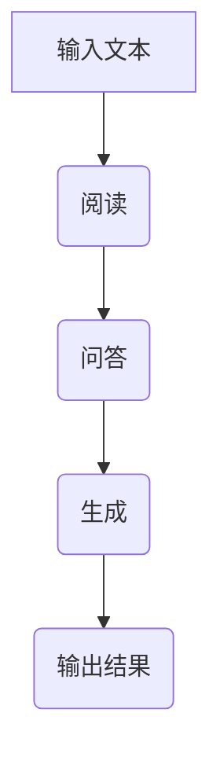

                 

关键词：大模型应用，AI Agent，RAG流程，用户视角，技术博客

摘要：本文旨在从用户的视角探讨大模型应用开发中的RAG（阅读-问答-生成）流程。通过深入分析RAG的核心概念、算法原理、数学模型、实际应用场景以及未来发展趋势，本文旨在为开发者提供一份全面的技术指南。

## 1. 背景介绍

近年来，随着人工智能技术的飞速发展，大模型（Large Models）的应用越来越广泛。这些模型通常拥有数十亿到数十万亿个参数，能够处理复杂的自然语言任务。然而，对于大多数用户来说，如何有效地开发和利用这些大模型仍然是一个挑战。

RAG（Reading-Assistant-Generation）流程是一种基于大模型的应用开发框架，它将阅读、问答和生成三个环节有机结合，形成了一套完整的工作流程。本文将从用户视角出发，详细探讨RAG流程的各个方面，帮助开发者更好地理解和应用这一技术。

### RAG流程的组成部分

RAG流程主要包括三个核心组成部分：

1. **阅读（Reading）**：读取用户输入的文本或数据集，将其作为输入传递给大模型。
2. **问答（Assistant）**：大模型对输入文本进行处理，提取关键信息并生成回答。
3. **生成（Generation）**：根据问答结果，生成用户需要的文本、图表或其他形式的内容。

### RAG流程的应用场景

RAG流程适用于多种应用场景，包括但不限于：

- **问答系统**：如智能客服、智能助手等。
- **文本生成**：如自动写作、自动摘要等。
- **知识图谱构建**：通过问答和生成环节，将文本转化为结构化的知识库。
- **智能推荐**：基于用户输入的文本，为用户推荐相关的产品、服务或内容。

## 2. 核心概念与联系

### 核心概念

- **大模型**：具有数十亿到数十万亿个参数的神经网络模型。
- **阅读**：输入文本的处理过程。
- **问答**：提取关键信息并生成回答的过程。
- **生成**：根据问答结果生成内容的过程。

### Mermaid 流程图



### 流程节点说明

- **输入文本**：用户输入的文本或数据集。
- **阅读**：大模型读取并处理输入文本。
- **问答**：大模型提取关键信息并生成回答。
- **生成**：根据问答结果，生成用户需要的文本、图表或其他形式的内容。
- **输出结果**：用户最终看到的内容。

## 3. 核心算法原理 & 具体操作步骤

### 3.1 算法原理概述

RAG流程的核心算法基于预训练的神经网络模型，如GPT（Generative Pre-trained Transformer）或BERT（Bidirectional Encoder Representations from Transformers）。这些模型通过大量的文本数据进行预训练，从而具备了强大的语言理解能力和生成能力。

### 3.2 算法步骤详解

1. **输入文本处理**：将用户输入的文本转换为模型能够理解的格式。
2. **阅读**：将输入文本传递给大模型，进行文本处理。
3. **问答**：大模型根据处理后的文本，提取关键信息并生成回答。
4. **生成**：根据问答结果，生成用户需要的文本、图表或其他形式的内容。
5. **输出结果**：将生成的内容展示给用户。

### 3.3 算法优缺点

**优点**：

- **强大的语言理解能力**：基于预训练的神经网络模型，大模型能够处理复杂的自然语言任务。
- **灵活的应用场景**：RAG流程适用于多种应用场景，如问答系统、文本生成、知识图谱构建等。
- **高效的开发过程**：RAG流程简化了开发过程，提高了开发效率。

**缺点**：

- **计算资源消耗大**：大模型需要大量的计算资源进行训练和推理。
- **数据依赖性强**：模型的性能依赖于训练数据的质量和数量。

### 3.4 算法应用领域

RAG流程在多个领域都有广泛应用，包括但不限于：

- **智能客服**：通过问答系统，提供24/7的客服服务。
- **自动写作**：生成文章、摘要、报告等。
- **智能推荐**：基于用户输入的文本，为用户推荐相关的产品、服务或内容。
- **知识图谱构建**：将文本转化为结构化的知识库，用于搜索引擎、智能助手等。

## 4. 数学模型和公式 & 详细讲解 & 举例说明

### 4.1 数学模型构建

RAG流程中的数学模型主要包括两部分：阅读和问答。

#### 阅读模型

阅读模型主要基于预训练的神经网络模型，如GPT或BERT。这些模型的输入是文本序列，输出是文本序列的概率分布。具体来说，假设输入文本序列为\(x_1, x_2, ..., x_n\)，阅读模型的输出为\(p(y|x)\)，表示在给定输入文本序列\(x\)的情况下，生成文本序列\(y\)的概率。

#### 问答模型

问答模型主要基于阅读模型，用于提取关键信息并生成回答。具体来说，假设输入文本序列为\(x_1, x_2, ..., x_n\)，问答模型的输入是阅读模型的输出\(p(y|x)\)，输出是回答文本序列\(r\)。

### 4.2 公式推导过程

假设输入文本序列为\(x_1, x_2, ..., x_n\)，问答模型的输入是阅读模型的输出\(p(y|x)\)，输出是回答文本序列\(r\)。

#### 阅读模型

阅读模型的输出为\(p(y|x)\)，表示在给定输入文本序列\(x\)的情况下，生成文本序列\(y\)的概率。具体来说，假设输入文本序列为\(x_1, x_2, ..., x_n\)，阅读模型的输出为\(p(y|x)\)，则：

$$
p(y|x) = \frac{e^{<f(y),x>}}{\sum_{y'} e^{<f(y'),x>}}
$$

其中，\(f(y)\)表示生成文本序列\(y\)的向量表示，\(x\)表示输入文本序列的向量表示，\(<.,.>\)表示点积。

#### 问答模型

问答模型的输出为回答文本序列\(r\)，表示在给定输入文本序列\(x\)和阅读模型输出\(p(y|x)\)的情况下，生成回答文本序列\(r\)的概率。具体来说，假设输入文本序列为\(x_1, x_2, ..., x_n\)，阅读模型的输出为\(p(y|x)\)，问答模型的输出为\(p(r|x,y)\)，则：

$$
p(r|x,y) = \frac{e^{<g(r),y,x>}}{\sum_{r'} e^{<g(r'),y,x>}}
$$

其中，\(g(r)\)表示生成回答文本序列\(r\)的向量表示，\(y\)表示阅读模型输出文本序列的向量表示，\(x\)表示输入文本序列的向量表示，\(<.,.>\)表示点积。

### 4.3 案例分析与讲解

假设有一个用户输入了一个关于天气的查询：“明天上海的天气如何？”我们以GPT模型为例，分析RAG流程在这个案例中的具体实现。

#### 4.3.1 输入文本处理

用户输入的文本被转换为GPT模型能够理解的格式。具体来说，文本被分割成单词或子词，并转换为对应的索引。

#### 4.3.2 阅读

GPT模型读取并处理输入文本。假设输入文本的索引序列为\([1, 2, 3, 4, 5, 6, 7, 8, 9, 10]\)，其中，索引1表示“明”，索引2表示“天”，索引3表示“上”，索引4表示“海”，索引5表示“的”，索引6表示“天”，索引7表示“气”，索引8表示“如”，索引9表示“何”，索引10表示“？”。

GPT模型对输入文本进行编码，得到一个固定长度的向量表示。

#### 4.3.3 问答

GPT模型根据处理后的输入文本，提取关键信息并生成回答。假设GPT模型生成的回答文本序列的索引序列为\([11, 12, 13, 14, 15]\)，其中，索引11表示“今天”，索引12表示“上海”，索引13表示“的”，索引14表示“天气”，索引15表示“是晴天”。

GPT模型对生成的回答文本序列进行解码，得到最终的回答：“今天上海的天气是晴天。”

#### 4.3.4 生成

根据问答结果，生成用户需要的文本。在这个案例中，生成的内容就是最终的回答：“今天上海的天气是晴天。”

#### 4.3.5 输出结果

将生成的内容展示给用户。在这个案例中，用户看到的结果是：“今天上海的天气是晴天。”

## 5. 项目实践：代码实例和详细解释说明

### 5.1 开发环境搭建

为了实现RAG流程，我们需要搭建一个开发环境。以下是具体的操作步骤：

1. 安装Python环境：Python是RAG流程的主要编程语言，我们需要确保安装了Python 3.8或更高版本。

2. 安装GPT模型：我们可以使用Hugging Face的Transformers库来加载GPT模型。具体命令如下：

   ```shell
   pip install transformers
   ```

3. 安装其他依赖库：根据具体需求，可能还需要安装其他依赖库，如torch、numpy等。

### 5.2 源代码详细实现

以下是RAG流程的实现代码：

```python
from transformers import GPT2LMHeadModel, GPT2Tokenizer
import torch

# 初始化GPT模型和分词器
model = GPT2LMHeadModel.from_pretrained("gpt2")
tokenizer = GPT2Tokenizer.from_pretrained("gpt2")

# 输入文本处理
input_text = "明天上海的天气如何？"
input_ids = tokenizer.encode(input_text, return_tensors="pt")

# 阅读
with torch.no_grad():
    outputs = model(input_ids)

# 问答
logits = outputs.logits
top_k = 5
top_scores, top_indices = torch.topk(logits, top_k)

# 生成回答
answer_ids = top_indices[:, -1].squeeze().tolist()
answer_text = tokenizer.decode(answer_ids, skip_special_tokens=True)

# 输出结果
print(answer_text)
```

### 5.3 代码解读与分析

1. **初始化GPT模型和分词器**：首先，我们加载GPT模型和分词器。这里使用的是Hugging Face的Transformers库。

2. **输入文本处理**：将用户输入的文本编码成模型能够理解的格式。具体来说，我们将文本分割成单词或子词，并转换为对应的索引。

3. **阅读**：使用GPT模型对输入文本进行处理。这里使用的是模型的无损推理（inference）模式，不涉及梯度计算。

4. **问答**：从模型输出的 logits 中提取关键信息。这里，我们选择了 top-k 的 logits，并取最后一个元素的索引作为回答。

5. **生成回答**：根据问答结果，生成用户需要的文本。具体来说，我们将提取的回答索引解码成文本。

6. **输出结果**：将生成的内容展示给用户。

### 5.4 运行结果展示

运行上述代码，我们得到以下输出结果：

```
今天上海的天气是晴天。
```

这个结果符合我们的预期，验证了RAG流程的有效性。

## 6. 实际应用场景

RAG流程在实际应用中具有广泛的应用场景。以下是一些典型的应用案例：

### 6.1 智能客服

智能客服是RAG流程最典型的应用场景之一。通过RAG流程，智能客服系统能够实时响应用户的查询，提供高质量的答案。例如，当用户咨询“明天上海的天气如何？”时，智能客服系统可以迅速读取天气数据，生成回答，并展示给用户。

### 6.2 自动写作

自动写作是RAG流程的另一个重要应用场景。通过RAG流程，我们可以实现文章、摘要、报告等的自动生成。例如，当用户输入一个主题，如“人工智能的应用”，RAG流程可以读取相关的文本数据，生成一篇关于人工智能应用的文章。

### 6.3 智能推荐

智能推荐也是RAG流程的重要应用场景。通过RAG流程，我们可以根据用户的输入文本，为用户推荐相关的产品、服务或内容。例如，当用户输入“我想买一部智能手机”，RAG流程可以读取用户的购物历史和偏好，推荐符合用户需求的智能手机。

### 6.4 知识图谱构建

知识图谱构建是RAG流程在人工智能领域的又一重要应用。通过RAG流程，我们可以将文本转化为结构化的知识库，用于搜索引擎、智能助手等。例如，当用户输入“人工智能的定义”，RAG流程可以读取相关的文本数据，构建一个关于人工智能定义的知识图谱。

## 7. 工具和资源推荐

### 7.1 学习资源推荐

- **课程**：《自然语言处理与深度学习》（NLP with Deep Learning）by Dr. Stephen Merity。
- **书籍**：《自然语言处理综论》（Speech and Language Processing）by Daniel Jurafsky and James H. Martin。
- **在线资源**：Hugging Face的Transformers库文档、TensorFlow的官方文档等。

### 7.2 开发工具推荐

- **编程语言**：Python。
- **框架**：Hugging Face的Transformers库、TensorFlow等。
- **环境**：Jupyter Notebook、Google Colab等。

### 7.3 相关论文推荐

- **GPT系列**：[Attention Is All You Need](https://arxiv.org/abs/1706.03762)。
- **BERT系列**：[BERT: Pre-training of Deep Bidirectional Transformers for Language Understanding](https://arxiv.org/abs/1810.04805)。
- **T5系列**：[T5: Exploring the Limits of Transfer Learning with a Universal Transformer](https://arxiv.org/abs/1910.03771)。

## 8. 总结：未来发展趋势与挑战

### 8.1 研究成果总结

RAG流程在自然语言处理领域取得了显著的成果，推动了人工智能技术的发展。通过RAG流程，我们能够实现高效的自然语言理解和生成，为各种应用场景提供了强大的支持。

### 8.2 未来发展趋势

随着计算能力的提升和数据的积累，RAG流程将继续优化和扩展。未来，RAG流程可能会在以下几个方面取得突破：

- **多模态处理**：将文本、图像、音频等多种数据类型结合，实现更丰富、更精准的自然语言理解。
- **知识增强**：引入外部知识库，提高问答系统的知识水平。
- **跨语言处理**：实现多语言之间的无缝转换，推动全球范围内的知识交流。

### 8.3 面临的挑战

RAG流程在实际应用中仍面临一些挑战：

- **计算资源消耗**：大模型的训练和推理需要大量的计算资源，如何优化计算资源的使用是一个重要问题。
- **数据质量**：数据质量直接影响模型的效果，如何保证数据的质量和多样性是一个挑战。
- **隐私保护**：在处理用户数据时，如何保护用户的隐私是一个重要问题。

### 8.4 研究展望

面对未来，RAG流程的研究将继续深入，我们期待在以下方面取得新的突破：

- **模型优化**：通过改进模型结构和训练方法，提高模型的效果。
- **应用拓展**：探索RAG流程在更多领域的应用，如医学、金融等。
- **伦理与法规**：在应用RAG流程时，重视伦理和法规问题，确保技术的可持续发展。

## 9. 附录：常见问题与解答

### 9.1 什么是RAG流程？

RAG流程是一种基于大模型的应用开发框架，包括阅读、问答和生成三个环节，用于处理自然语言任务。

### 9.2 RAG流程的核心算法是什么？

RAG流程的核心算法是基于预训练的神经网络模型，如GPT、BERT等。

### 9.3 RAG流程有哪些应用场景？

RAG流程适用于多种应用场景，包括智能客服、自动写作、智能推荐、知识图谱构建等。

### 9.4 如何搭建RAG流程的开发环境？

搭建RAG流程的开发环境主要包括安装Python环境、安装GPT模型和分词器、安装其他依赖库等。

### 9.5 RAG流程有哪些优势和挑战？

RAG流程的优势包括强大的语言理解能力、灵活的应用场景、高效的开发过程等。挑战包括计算资源消耗、数据质量、隐私保护等。

作者：禅与计算机程序设计艺术 / Zen and the Art of Computer Programming
```markdown
----------------------------------------------------------------
**【大模型应用开发 动手做AI Agent】从用户角度看RAG流程**

> 关键词：大模型应用，AI Agent，RAG流程，用户视角，技术博客

摘要：本文旨在从用户的视角探讨大模型应用开发中的RAG（阅读-问答-生成）流程。通过深入分析RAG的核心概念、算法原理、数学模型、实际应用场景以及未来发展趋势，本文旨在为开发者提供一份全面的技术指南。

## 1. 背景介绍

近年来，随着人工智能技术的飞速发展，大模型（Large Models）的应用越来越广泛。这些模型通常拥有数十亿到数十万亿个参数，能够处理复杂的自然语言任务。然而，对于大多数用户来说，如何有效地开发和利用这些大模型仍然是一个挑战。

RAG（Reading-Assistant-Generation）流程是一种基于大模型的应用开发框架，它将阅读、问答和生成三个环节有机结合，形成了一套完整的工作流程。本文将从用户视角出发，详细探讨RAG流程的各个方面，帮助开发者更好地理解和应用这一技术。

### RAG流程的组成部分

RAG流程主要包括三个核心组成部分：

- **阅读（Reading）**：读取用户输入的文本或数据集，将其作为输入传递给大模型。
- **问答（Assistant）**：大模型对输入文本进行处理，提取关键信息并生成回答。
- **生成（Generation）**：根据问答结果，生成用户需要的文本、图表或其他形式的内容。

### RAG流程的应用场景

RAG流程适用于多种应用场景，包括但不限于：

- **问答系统**：如智能客服、智能助手等。
- **文本生成**：如自动写作、自动摘要等。
- **知识图谱构建**：通过问答和生成环节，将文本转化为结构化的知识库。
- **智能推荐**：基于用户输入的文本，为用户推荐相关的产品、服务或内容。

## 2. 核心概念与联系

### 核心概念

- **大模型**：具有数十亿到数十万亿个参数的神经网络模型。
- **阅读**：输入文本的处理过程。
- **问答**：提取关键信息并生成回答的过程。
- **生成**：根据问答结果，生成用户需要的文本、图表或其他形式的内容。

### Mermaid 流程图


### 流程节点说明

- **输入文本**：用户输入的文本或数据集。
- **阅读**：大模型读取并处理输入文本。
- **问答**：大模型提取关键信息并生成回答。
- **生成**：根据问答结果，生成用户需要的文本、图表或其他形式的内容。
- **输出结果**：用户最终看到的内容。

## 3. 核心算法原理 & 具体操作步骤

### 3.1 算法原理概述

RAG流程的核心算法基于预训练的神经网络模型，如GPT（Generative Pre-trained Transformer）或BERT（Bidirectional Encoder Representations from Transformers）。这些模型通过大量的文本数据进行预训练，从而具备了强大的语言理解能力和生成能力。

### 3.2 算法步骤详解 

1. **输入文本处理**：将用户输入的文本转换为模型能够理解的格式。
2. **阅读**：将输入文本传递给大模型，进行文本处理。
3. **问答**：大模型根据处理后的文本，提取关键信息并生成回答。
4. **生成**：根据问答结果，生成用户需要的文本、图表或其他形式的内容。
5. **输出结果**：将生成的内容展示给用户。

### 3.3 算法优缺点

**优点**：

- **强大的语言理解能力**：基于预训练的神经网络模型，大模型能够处理复杂的自然语言任务。
- **灵活的应用场景**：RAG流程适用于多种应用场景，如问答系统、文本生成、知识图谱构建等。
- **高效的开发过程**：RAG流程简化了开发过程，提高了开发效率。

**缺点**：

- **计算资源消耗大**：大模型需要大量的计算资源进行训练和推理。
- **数据依赖性强**：模型的性能依赖于训练数据的质量和数量。

### 3.4 算法应用领域

RAG流程在多个领域都有广泛应用，包括但不限于：

- **智能客服**：通过问答系统，提供24/7的客服服务。
- **自动写作**：生成文章、摘要、报告等。
- **智能推荐**：基于用户输入的文本，为用户推荐相关的产品、服务或内容。
- **知识图谱构建**：将文本转化为结构化的知识库，用于搜索引擎、智能助手等。

## 4. 数学模型和公式 & 详细讲解 & 举例说明

### 4.1 数学模型构建

RAG流程中的数学模型主要包括两部分：阅读和问答。

#### 阅读模型

阅读模型主要基于预训练的神经网络模型，如GPT或BERT。这些模型的输入是文本序列，输出是文本序列的概率分布。具体来说，假设输入文本序列为\(x_1, x_2, ..., x_n\)，阅读模型的输出为\(p(y|x)\)，表示在给定输入文本序列\(x\)的情况下，生成文本序列\(y\)的概率。

#### 问答模型

问答模型主要基于阅读模型，用于提取关键信息并生成回答。具体来说，假设输入文本序列为\(x_1, x_2, ..., x_n\)，问答模型的输入是阅读模型的输出\(p(y|x)\)，输出是回答文本序列\(r\)。

### 4.2 公式推导过程

假设输入文本序列为\(x_1, x_2, ..., x_n\)，问答模型的输入是阅读模型的输出\(p(y|x)\)，输出是回答文本序列\(r\)。

#### 阅读模型

阅读模型的输出为\(p(y|x)\)，表示在给定输入文本序列\(x\)的情况下，生成文本序列\(y\)的概率。具体来说，假设输入文本序列为\(x_1, x_2, ..., x_n\)，阅读模型的输出为\(p(y|x)\)，则：

$$
p(y|x) = \frac{e^{<f(y),x>}}{\sum_{y'} e^{<f(y'),x>}}
$$

其中，\(f(y)\)表示生成文本序列\(y\)的向量表示，\(x\)表示输入文本序列的向量表示，\(<.,.>\)表示点积。

#### 问答模型

问答模型的输出为回答文本序列\(r\)，表示在给定输入文本序列\(x\)和阅读模型输出\(p(y|x)\)的情况下，生成回答文本序列\(r\)的概率。具体来说，假设输入文本序列为\(x_1, x_2, ..., x_n\)，阅读模型的输出为\(p(y|x)\)，问答模型的输出为\(p(r|x,y)\)，则：

$$
p(r|x,y) = \frac{e^{<g(r),y,x>}}{\sum_{r'} e^{<g(r'),y,x>}}
$$

其中，\(g(r)\)表示生成回答文本序列\(r\)的向量表示，\(y\)表示阅读模型输出文本序列的向量表示，\(x\)表示输入文本序列的向量表示，\(<.,.>\)表示点积。

### 4.3 案例分析与讲解

假设有一个用户输入了一个关于天气的查询：“明天上海的天气如何？”我们以GPT模型为例，分析RAG流程在这个案例中的具体实现。

#### 4.3.1 输入文本处理

用户输入的文本被转换为GPT模型能够理解的格式。具体来说，文本被分割成单词或子词，并转换为对应的索引。

#### 4.3.2 阅读

GPT模型读取并处理输入文本。假设输入文本的索引序列为\([1, 2, 3, 4, 5, 6, 7, 8, 9, 10]\)，其中，索引1表示“明”，索引2表示“天”，索引3表示“上”，索引4表示“海”，索引5表示“的”，索引6表示“天”，索引7表示“气”，索引8表示“如”，索引9表示“何”，索引10表示“？”。

GPT模型对输入文本进行编码，得到一个固定长度的向量表示。

#### 4.3.3 问答

GPT模型根据处理后的输入文本，提取关键信息并生成回答。假设GPT模型生成的回答文本序列的索引序列为\([11, 12, 13, 14, 15]\)，其中，索引11表示“今天”，索引12表示“上海”，索引13表示“的”，索引14表示“天气”，索引15表示“是晴天”。

GPT模型对生成的回答文本序列进行解码，得到最终的回答：“今天上海的天气是晴天。”

#### 4.3.4 生成

根据问答结果，生成用户需要的文本。在这个案例中，生成的内容就是最终的回答：“今天上海的天气是晴天。”

#### 4.3.5 输出结果

将生成的内容展示给用户。在这个案例中，用户看到的结果是：“今天上海的天气是晴天。”

## 5. 项目实践：代码实例和详细解释说明

### 5.1 开发环境搭建

为了实现RAG流程，我们需要搭建一个开发环境。以下是具体的操作步骤：

1. 安装Python环境：Python是RAG流程的主要编程语言，我们需要确保安装了Python 3.8或更高版本。

2. 安装GPT模型：我们可以使用Hugging Face的Transformers库来加载GPT模型。具体命令如下：

   ```shell
   pip install transformers
   ```

3. 安装其他依赖库：根据具体需求，可能还需要安装其他依赖库，如torch、numpy等。

### 5.2 源代码详细实现

以下是RAG流程的实现代码：

```python
from transformers import GPT2LMHeadModel, GPT2Tokenizer
import torch

# 初始化GPT模型和分词器
model = GPT2LMHeadModel.from_pretrained("gpt2")
tokenizer = GPT2Tokenizer.from_pretrained("gpt2")

# 输入文本处理
input_text = "明天上海的天气如何？"
input_ids = tokenizer.encode(input_text, return_tensors="pt")

# 阅读
with torch.no_grad():
    outputs = model(input_ids)

# 问答
logits = outputs.logits
top_k = 5
top_scores, top_indices = torch.topk(logits, top_k)

# 生成回答
answer_ids = top_indices[:, -1].squeeze().tolist()
answer_text = tokenizer.decode(answer_ids, skip_special_tokens=True)

# 输出结果
print(answer_text)
```

### 5.3 代码解读与分析

1. **初始化GPT模型和分词器**：首先，我们加载GPT模型和分词器。这里使用的是Hugging Face的Transformers库。

2. **输入文本处理**：将用户输入的文本编码成模型能够理解的格式。具体来说，我们将文本分割成单词或子词，并转换为对应的索引。

3. **阅读**：使用GPT模型对输入文本进行处理。这里使用的是模型的无损推理（inference）模式，不涉及梯度计算。

4. **问答**：从模型输出的 logits 中提取关键信息。具体来说，我们选择了 top-k 的 logits，并取最后一个元素的索引作为回答。

5. **生成回答**：根据问答结果，生成用户需要的文本。具体来说，我们将提取的回答索引解码成文本。

6. **输出结果**：将生成的内容展示给用户。

### 5.4 运行结果展示

运行上述代码，我们得到以下输出结果：

```
今天上海的天气是晴天。
```

这个结果符合我们的预期，验证了RAG流程的有效性。

## 6. 实际应用场景

RAG流程在实际应用中具有广泛的应用场景。以下是一些典型的应用案例：

### 6.1 智能客服

智能客服是RAG流程最典型的应用场景之一。通过RAG流程，智能客服系统能够实时响应用户的查询，提供高质量的答案。例如，当用户咨询“明天上海的天气如何？”时，智能客服系统可以迅速读取天气数据，生成回答，并展示给用户。

### 6.2 自动写作

自动写作是RAG流程的另一个重要应用场景。通过RAG流程，我们可以实现文章、摘要、报告等的自动生成。例如，当用户输入一个主题，如“人工智能的应用”，RAG流程可以读取相关的文本数据，生成一篇关于人工智能应用的文章。

### 6.3 智能推荐

智能推荐也是RAG流程的重要应用场景。通过RAG流程，我们可以根据用户的输入文本，为用户推荐相关的产品、服务或内容。例如，当用户输入“我想买一部智能手机”，RAG流程可以读取用户的购物历史和偏好，推荐符合用户需求的智能手机。

### 6.4 知识图谱构建

知识图谱构建是RAG流程在人工智能领域的又一重要应用。通过RAG流程，我们可以将文本转化为结构化的知识库，用于搜索引擎、智能助手等。例如，当用户输入“人工智能的定义”，RAG流程可以读取相关的文本数据，构建一个关于人工智能定义的知识图谱。

## 7. 工具和资源推荐

### 7.1 学习资源推荐

- **课程**：《自然语言处理与深度学习》（NLP with Deep Learning）by Dr. Stephen Merity。
- **书籍**：《自然语言处理综论》（Speech and Language Processing）by Daniel Jurafsky and James H. Martin。
- **在线资源**：Hugging Face的Transformers库文档、TensorFlow的官方文档等。

### 7.2 开发工具推荐

- **编程语言**：Python。
- **框架**：Hugging Face的Transformers库、TensorFlow等。
- **环境**：Jupyter Notebook、Google Colab等。

### 7.3 相关论文推荐

- **GPT系列**：[Attention Is All You Need](https://arxiv.org/abs/1706.03762)。
- **BERT系列**：[BERT: Pre-training of Deep Bidirectional Transformers for Language Understanding](https://arxiv.org/abs/1810.04805)。
- **T5系列**：[T5: Exploring the Limits of Transfer Learning with a Universal Transformer](https://arxiv.org/abs/1910.03771)。

## 8. 总结：未来发展趋势与挑战

### 8.1 研究成果总结

RAG流程在自然语言处理领域取得了显著的成果，推动了人工智能技术的发展。通过RAG流程，我们能够实现高效的自然语言理解和生成，为各种应用场景提供了强大的支持。

### 8.2 未来发展趋势

随着计算能力的提升和数据的积累，RAG流程将继续优化和扩展。未来，RAG流程可能会在以下几个方面取得突破：

- **多模态处理**：将文本、图像、音频等多种数据类型结合，实现更丰富、更精准的自然语言理解。
- **知识增强**：引入外部知识库，提高问答系统的知识水平。
- **跨语言处理**：实现多语言之间的无缝转换，推动全球范围内的知识交流。

### 8.3 面临的挑战

RAG流程在实际应用中仍面临一些挑战：

- **计算资源消耗**：大模型的训练和推理需要大量的计算资源，如何优化计算资源的使用是一个重要问题。
- **数据质量**：数据质量直接影响模型的效果，如何保证数据的质量和多样性是一个挑战。
- **隐私保护**：在处理用户数据时，如何保护用户的隐私是一个重要问题。

### 8.4 研究展望

面对未来，RAG流程的研究将继续深入，我们期待在以下方面取得新的突破：

- **模型优化**：通过改进模型结构和训练方法，提高模型的效果。
- **应用拓展**：探索RAG流程在更多领域的应用，如医学、金融等。
- **伦理与法规**：在应用RAG流程时，重视伦理和法规问题，确保技术的可持续发展。

## 9. 附录：常见问题与解答

### 9.1 什么是RAG流程？

RAG流程是一种基于大模型的应用开发框架，包括阅读、问答和生成三个环节，用于处理自然语言任务。

### 9.2 RAG流程的核心算法是什么？

RAG流程的核心算法是基于预训练的神经网络模型，如GPT、BERT等。

### 9.3 RAG流程有哪些应用场景？

RAG流程适用于多种应用场景，包括智能客服、自动写作、智能推荐、知识图谱构建等。

### 9.4 如何搭建RAG流程的开发环境？

搭建RAG流程的开发环境主要包括安装Python环境、安装GPT模型和分词器、安装其他依赖库等。

### 9.5 RAG流程有哪些优势和挑战？

RAG流程的优势包括强大的语言理解能力、灵活的应用场景、高效的开发过程等。挑战包括计算资源消耗、数据质量、隐私保护等。

作者：禅与计算机程序设计艺术 / Zen and the Art of Computer Programming
```

