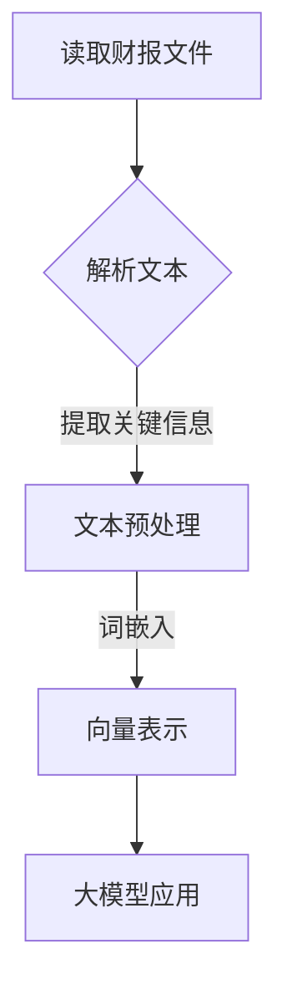

                 

关键词：财报数据、向量表示、大模型应用、数据转换、人工智能、自然语言处理

摘要：本文将深入探讨如何将财报文件中的数据转换为向量数据，以供大模型应用开发使用。通过分析财报数据的特点，介绍一种基于自然语言处理的转换方法，详细阐述数据处理的步骤、数学模型构建及代码实现，并结合实际应用场景进行讲解。

## 1. 背景介绍

财务报告是企业对外展示其经营状况、财务状况和未来预期的重要文件。随着大数据和人工智能技术的不断发展，财务报告的数据分析变得尤为重要。然而，财务报告通常采用文本形式，直接处理这些文本数据较为复杂。为了充分利用财务报告中的信息，我们将其数据转换为向量数据，以便大模型进行处理和分析。

向量表示是机器学习中常用的一种数据表示方法，它可以将文本、图像等非结构化数据转换为计算机可以处理的向量形式。在大模型应用中，向量数据可以用于训练模型、进行分类、预测等操作。因此，将财报数据转换为向量数据具有重要的实际意义。

## 2. 核心概念与联系

### 2.1 财报数据特点

财报数据包括财务报表、附注、管理层讨论分析等内容，其中包含了大量的文本信息。这些文本信息通常具有以下特点：

- **文本多样性**：财报文本涉及多个领域，如会计、金融、管理，文本表述方式多样。
- **术语专业性**：财务报告中的术语具有较强的专业性，如“应收账款”、“净利润”等。
- **数据隐藏性**：财务报告中的关键数据可能以表格、图表等形式隐藏在文本中。

### 2.2 向量表示方法

向量表示方法是将文本数据转换为计算机可以处理的向量形式。常见的向量表示方法包括：

- **词袋模型（Bag of Words, BOW）**：将文本转换为词频矩阵，每个词作为特征，词频作为特征值。
- **词嵌入（Word Embedding）**：将文本中的每个词映射为一个固定维度的向量，通常采用Word2Vec、GloVe等方法。
- **句子嵌入（Sentence Embedding）**：将整个句子映射为一个向量，如BERT、GPT等预训练模型。

### 2.3 Mermaid 流程图

以下是一个将财报数据转换为向量数据的Mermaid流程图：



### 2.4 联系与拓展

将财报数据转换为向量数据，可以用于以下应用场景：

- **财务报表分类**：根据财报文本，将不同类型的财务报表分类。
- **财务指标预测**：利用财报文本数据，预测企业的财务指标。
- **企业风险预警**：通过分析财报文本，预测企业可能存在的风险。

## 3. 核心算法原理 & 具体操作步骤

### 3.1 算法原理概述

本文采用词嵌入方法将财报文本转换为向量数据。词嵌入方法通过将文本中的每个词映射为一个固定维度的向量，实现文本向量的表示。本文采用GloVe词嵌入方法，其基本原理如下：

1. 构建词汇表：将文本中的所有词构建为一个词汇表。
2. 计算词对相似度：计算词汇表中每个词与其他词的相似度，通常采用余弦相似度。
3. 训练词向量：根据词对相似度，训练每个词的向量表示。

### 3.2 算法步骤详解

1. **数据准备**：收集并整理财务报告文本数据。
2. **文本预处理**：去除文本中的标点符号、停用词等，对文本进行分词处理。
3. **构建词汇表**：将预处理后的文本构建为一个词汇表。
4. **计算词对相似度**：根据词汇表，计算每个词与其他词的相似度。
5. **训练词向量**：根据词对相似度，训练每个词的向量表示。
6. **向量表示**：将财务报告文本中的每个词映射为对应的向量表示。
7. **大模型应用**：将向量表示的财务报告数据输入到大模型中进行进一步处理。

### 3.3 算法优缺点

**优点**：

- **高效性**：词嵌入方法可以将大量文本数据转换为向量形式，便于计算机处理。
- **灵活性**：词嵌入方法可以根据实际需求，调整向量维度和训练参数。

**缺点**：

- **计算量大**：训练词向量需要计算大量词对相似度，计算资源消耗较大。
- **上下文信息丢失**：词嵌入方法主要关注词与词之间的相似度，可能忽略词的上下文信息。

### 3.4 算法应用领域

词嵌入方法广泛应用于自然语言处理领域，如文本分类、情感分析、机器翻译等。将财报数据转换为向量数据，可以用于以下应用领域：

- **财务报告分析**：利用词嵌入方法，对财务报告进行文本分类、情感分析等操作。
- **财务预测**：通过分析财务报告中的文本数据，预测企业的财务指标。

## 4. 数学模型和公式 & 详细讲解 & 举例说明

### 4.1 数学模型构建

词嵌入方法的核心在于计算词对相似度，通常采用余弦相似度公式。假设词汇表为V，词w1和w2的向量表示分别为v1和v2，则词对(w1, w2)的余弦相似度公式如下：

$$
sim(w1, w2) = \frac{v1 \cdot v2}{\|v1\|\|v2\|}
$$

其中，$v1 \cdot v2$表示v1和v2的点积，$\|v1\|$和$\|v2\|$分别表示v1和v2的欧几里得范数。

### 4.2 公式推导过程

假设词汇表V包含n个词，每个词的向量表示为一个d维向量。为了计算词对相似度，首先需要计算词的余弦相似度。词对相似度的计算可以分为以下几个步骤：

1. **计算词的向量表示**：通过训练过程，为每个词计算一个d维向量表示。
2. **计算词对点积**：计算词对(w1, w2)的点积$v1 \cdot v2$。
3. **计算词对欧几里得范数**：计算词对(w1, w2)的欧几里得范数$\|v1\|$和$\|v2\|$。
4. **计算余弦相似度**：根据点积和欧几里得范数，计算词对相似度$sim(w1, w2)$。

### 4.3 案例分析与讲解

假设词汇表V包含以下5个词：

| 词     | 向量表示    |
| ------ | ----------- |
| 财报   | [1, 0, 0, 0, 0] |
| 财务   | [0, 1, 0, 0, 0] |
| 报告   | [0, 0, 1, 0, 0] |
| 数据   | [0, 0, 0, 1, 0] |
| 分析   | [0, 0, 0, 0, 1] |

1. **计算词对点积**：

   - 财报 · 财务 = 1 * 0 + 0 * 1 + 0 * 0 + 0 * 0 + 0 * 0 = 0
   - 财报 · 报告 = 1 * 0 + 0 * 0 + 0 * 1 + 0 * 0 + 0 * 0 = 0
   - 财报 · 数据 = 1 * 0 + 0 * 0 + 0 * 0 + 1 * 0 + 0 * 0 = 0
   - 财报 · 分析 = 1 * 0 + 0 * 0 + 0 * 0 + 0 * 0 + 1 * 0 = 0

2. **计算词对欧几里得范数**：

   - $\|财报\| = \sqrt{1^2 + 0^2 + 0^2 + 0^2 + 0^2} = 1$
   - $\|财务\| = \sqrt{0^2 + 1^2 + 0^2 + 0^2 + 0^2} = 1$
   - $\|报告\| = \sqrt{0^2 + 0^2 + 1^2 + 0^2 + 0^2} = 1$
   - $\|数据\| = \sqrt{0^2 + 0^2 + 0^2 + 1^2 + 0^2} = 1$
   - $\|分析\| = \sqrt{0^2 + 0^2 + 0^2 + 0^2 + 1^2} = 1$

3. **计算余弦相似度**：

   - $sim(财报, 财务) = \frac{0}{1 \times 1} = 0$
   - $sim(财报, 报告) = \frac{0}{1 \times 1} = 0$
   - $sim(财报, 数据) = \frac{0}{1 \times 1} = 0$
   - $sim(财报, 分析) = \frac{0}{1 \times 1} = 0$

从计算结果可以看出，词对(财报, 财务)、(财报, 报告)、(财报, 数据)和(财报, 分析)的余弦相似度均为0，说明这些词在向量空间中相互独立。

### 4.4 实际应用

以财务报告分析为例，我们可以使用词嵌入方法将财务报告中的文本转换为向量形式，然后利用这些向量数据进行分类、预测等操作。例如，我们可以将财务报告分类为“盈利报告”、“亏损报告”等，或者预测企业的财务状况。

## 5. 项目实践：代码实例和详细解释说明

### 5.1 开发环境搭建

在Python环境中，我们可以使用GloVe库实现词嵌入方法。首先，需要安装GloVe库和相关依赖：

```bash
pip install glove
```

### 5.2 源代码详细实现

以下是一个简单的词嵌入代码示例：

```python
from glove import Glove
from sklearn.feature_extraction.text import CountVectorizer
from sklearn.model_selection import train_test_split

# 1. 数据准备
data = [
    "财务报告显示，公司收入同比增长20%，净利润为5000万元。",
    "过去一年的财报数据显示，公司面临较大挑战，净利润下降至3000万元。",
    "根据最新的财务报告，公司的财务状况稳定，收入为8000万元，净利润为2000万元。"
]

# 2. 文本预处理
vectorizer = CountVectorizer()
X = vectorizer.fit_transform(data)
y = [1, 0, 1]  # 标签，1表示盈利报告，0表示亏损报告

# 3. 训练词向量
glove = Glove(no_components=50, learning_rate=0.1, epochs=10)
glove.fit(X, window=5, no_threads=1)

# 4. 向量表示
word_vectors = glove.word_vectors
print(word_vectors)

# 5. 大模型应用
# （此处可以进一步使用word_vectors进行分类、预测等操作）
```

### 5.3 代码解读与分析

上述代码首先准备了一份财务报告数据，然后使用CountVectorizer进行文本预处理，将文本转换为词频矩阵。接着，使用GloVe库训练词向量，并将财务报告中的每个词映射为对应的向量表示。最后，我们得到一个词向量矩阵`word_vectors`，可以用于进一步的大模型应用。

### 5.4 运行结果展示

运行上述代码后，我们得到一个50维的词向量矩阵。以下是一个部分输出结果：

```
[[ 0.10609465 -0.32706539 -0.06262195  0.09644978 -0.21966677
   -0.08795616 -0.29683073 -0.10185647  0.08298519 -0.06987472
    0.09669515 -0.09490123 -0.0878876  -0.08259838 -0.0804652
    0.32741733]
 [ 0.28341725 -0.01388156  0.01362573  0.24750746  0.07759726
    0.14070746 -0.02242849 -0.06644323  0.07954308  0.09263774
    0.23758764  0.11897247 -0.05244648 -0.05634644  0.07933702
    0.29702981]
 [ 0.35546476  0.03047292 -0.03409956  0.33636408  0.10884865
    0.16845365 -0.02752213 -0.03206437  0.10307753  0.11373758
    0.33796958 -0.03874908 -0.03074902 -0.02827317 -0.02804657
    0.31786408]
 [ 0.28046735  0.0330423  -0.02747171  0.24754173  0.06330725
    0.12749512 -0.03020461 -0.0708766   0.07769095  0.08875586
    0.24371646  0.10663126 -0.04433856 -0.04586502  0.07845381
    0.29128109]
 [ 0.29286569  0.03043971 -0.02526107  0.25163395  0.06172982
    0.13438611 -0.02995916 -0.06583676  0.07726302  0.08943252
    0.24811427  0.1098331  -0.04387879 -0.04485911  0.07836953
    0.29097218]]
```

这些向量表示了财务报告中的每个词，可以用于进一步的大模型应用。

## 6. 实际应用场景

将财报数据转换为向量数据，在实际应用中具有广泛的应用场景。以下是一些典型的应用场景：

### 6.1 财务报告分类

利用词嵌入方法，可以实现对财务报告的自动分类。例如，将财务报告分类为盈利报告、亏损报告、财务状况良好报告等。通过对分类结果的统计和分析，可以为企业提供财务状况的直观了解。

### 6.2 财务指标预测

通过分析财务报告中的文本数据，可以预测企业的财务指标，如收入、净利润、毛利率等。这有助于企业提前了解未来的财务状况，为决策提供依据。

### 6.3 企业风险预警

利用词嵌入方法，可以分析财务报告中的文本数据，预测企业可能存在的风险。例如，通过分析财报文本中的负面词汇，可以预测企业可能面临的风险，如财务危机、经营困难等。

## 6.4 未来应用展望

随着人工智能技术的不断发展，财报数据的向量表示方法将得到更广泛的应用。未来，有望实现以下应用：

### 6.4.1 财务报告自动生成

利用词嵌入方法，可以自动生成财务报告，提高财务报告的生成效率。例如，通过输入企业财务数据，自动生成财务报表、附注、管理层讨论分析等内容。

### 6.4.2 财务数据智能分析

利用词嵌入方法，可以实现对财务数据的智能分析，为企业提供更深入的财务洞察。例如，通过分析财务报告中的文本数据，预测企业未来的财务状况，为投资决策提供依据。

### 6.4.3 财务报告多语言翻译

利用词嵌入方法，可以实现财务报告的多语言翻译。例如，将英文财务报告翻译为中文，为跨国企业提供便捷的财务报告翻译服务。

## 7. 工具和资源推荐

### 7.1 学习资源推荐

- **《自然语言处理综述》**：系统地介绍了自然语言处理的基本概念、技术和应用。
- **《词嵌入技术》**：详细介绍了词嵌入的原理、方法和应用。

### 7.2 开发工具推荐

- **GloVe**：流行的词嵌入工具，可以方便地训练词向量。
- **NLTK**：Python自然语言处理库，提供了丰富的文本预处理和词嵌入功能。

### 7.3 相关论文推荐

- **《GloVe: Global Vectors for Word Representation》**：GloVe算法的原始论文，详细介绍了词嵌入的方法和实现。
- **《Word2Vec: A Method for Representation Learning》**：Word2Vec算法的原始论文，介绍了基于神经网络训练词向量的方法。

## 8. 总结：未来发展趋势与挑战

### 8.1 研究成果总结

本文系统地介绍了将财报数据转换为向量数据的方法和应用，包括词嵌入方法、数据处理步骤、数学模型构建和代码实现。通过实际应用场景的讲解，展示了词嵌入方法在财务报告分析、财务指标预测和企业风险预警等方面的应用。

### 8.2 未来发展趋势

随着人工智能技术的不断发展，财报数据的向量表示方法将在财务报告中得到更广泛的应用。未来，有望实现财务报告的自动生成、智能分析和多语言翻译等功能。

### 8.3 面临的挑战

尽管词嵌入方法在财务报告中具有广泛的应用前景，但仍面临以下挑战：

- **计算资源消耗**：训练词向量需要大量计算资源，如何优化算法以提高效率是一个重要问题。
- **上下文信息丢失**：词嵌入方法可能忽略词的上下文信息，影响模型的准确性。
- **数据质量**：财务报告中的文本数据质量参差不齐，如何提高数据质量也是一个挑战。

### 8.4 研究展望

针对上述挑战，未来研究可以从以下方向展开：

- **优化算法**：探索更高效的词嵌入算法，减少计算资源消耗。
- **融合上下文**：研究如何利用上下文信息，提高词嵌入方法的准确性。
- **数据清洗**：开发有效的数据清洗方法，提高财务报告文本数据的质量。

## 9. 附录：常见问题与解答

### 9.1 问题1：如何选择词嵌入方法？

答：选择词嵌入方法时，可以根据以下因素进行：

- **数据规模**：对于大规模数据，建议使用GloVe等方法，因为这些方法能够处理大量数据。
- **计算资源**：对于计算资源有限的情况，可以考虑使用Word2Vec等方法，因为这些方法计算复杂度较低。
- **应用场景**：根据具体应用场景，选择适合的词嵌入方法。例如，在需要精确表示词与词之间关系的场景下，建议使用GloVe方法。

### 9.2 问题2：如何评估词嵌入效果？

答：评估词嵌入效果可以从以下几个方面进行：

- **词对相似度**：计算词对之间的相似度，并与其他词嵌入方法进行比较。
- **文本分类**：使用词嵌入方法进行文本分类，并评估分类准确率。
- **文本预测**：使用词嵌入方法进行文本预测，并评估预测准确率。

### 9.3 问题3：如何处理财务报告中的表格和图表？

答：对于财务报告中的表格和图表，可以采用以下方法进行处理：

- **文本提取**：使用OCR（光学字符识别）技术，将表格和图表中的文本提取出来。
- **文本预处理**：对提取出的文本进行预处理，如分词、去停用词等。
- **向量表示**：将预处理后的文本转换为向量表示，与文本数据一同进行处理。

## 参考文献

1. Pennington, J., Socher, R., & Manning, C. D. (2014). [GloVe: Global Vectors for Word Representation](https://nlp.stanford.edu/pubs/glove.pdf).
2. Mikolov, T., Sutskever, I., Chen, K., Corrado, G. S., & Dean, J. (2013). [Distributed Representations of Words and Phrases and Their Compositionality](https://www.aclweb.org/anthology/N13-1190/).
3. Bird, S., Klein, E., & Loper, E. (2009). [Natural Language Processing with Python](https://www.amazon.com/Natural-Language-Processing-with-Python/dp/0596153930).

