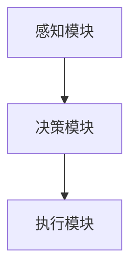

                 

 关键词：大模型应用，AI Agent，ReAct Agent，执行流程，编程实践，技术解读，应用场景，未来展望

> 摘要：本文将深入探讨大模型应用开发中如何动手构建并执行ReAct Agent，详细介绍其核心概念、算法原理、数学模型及其在不同领域的应用。通过具体的代码实例和运行结果展示，读者将能够全面了解ReAct Agent的开发和实践过程，掌握大模型应用开发的实用技巧。

## 1. 背景介绍

### 大模型应用的发展现状

近年来，随着深度学习和大数据技术的快速发展，大模型应用在自然语言处理、图像识别、语音识别等领域取得了显著成果。大模型应用不仅提高了数据处理和分析的效率，还推动了人工智能技术的发展和创新。然而，大模型应用的开发并不简单，涉及众多复杂的算法和架构设计。

### React Agent的引入

ReAct Agent（反应型智能体）是近年来提出的一种新的智能体架构，旨在解决传统智能体在复杂环境中的适应性问题和高效性挑战。ReAct Agent通过模仿生物体在环境中的反应机制，实现了对动态环境的快速响应和智能决策。其独特的架构和算法设计使其在大模型应用中具有广泛的应用前景。

## 2. 核心概念与联系

### ReAct Agent的核心概念

ReAct Agent主要包括三个核心组成部分：感知模块、决策模块和执行模块。

- **感知模块**：负责收集环境信息，如传感器数据、图像、语音等。
- **决策模块**：根据感知模块收集的信息，通过算法和模型进行推理和决策。
- **执行模块**：根据决策模块的结果，执行相应的操作，如移动、发送消息等。

### ReAct Agent的架构图



### ReAct Agent与传统智能体的区别

与传统智能体相比，ReAct Agent具有以下特点：

- **动态适应性**：ReAct Agent能够根据环境变化实时调整策略，提高在动态环境中的适应性。
- **模块化设计**：感知模块、决策模块和执行模块相互独立，便于维护和扩展。
- **高效性**：ReAct Agent通过高效的算法和模型，实现了对复杂环境的快速响应。

## 3. 核心算法原理 & 具体操作步骤

### 3.1 算法原理概述

ReAct Agent的算法原理主要基于反应机制和强化学习。反应机制使智能体能够快速对环境变化做出响应，而强化学习则帮助智能体通过试错学习，不断优化决策策略。

### 3.2 算法步骤详解

1. **感知阶段**：智能体通过传感器收集环境信息，如图像、声音、温度等。
2. **决策阶段**：智能体根据感知到的信息，通过算法模型进行推理和决策。常见的算法模型包括神经网络、决策树、支持向量机等。
3. **执行阶段**：智能体根据决策结果，执行相应的操作，如移动、发送消息等。

### 3.3 算法优缺点

**优点**：

- **快速响应**：反应机制使智能体能够快速对环境变化做出响应。
- **模块化设计**：感知模块、决策模块和执行模块相互独立，便于维护和扩展。

**缺点**：

- **计算复杂度高**：由于需要实时感知和决策，计算复杂度较高，对硬件要求较高。
- **模型训练时间长**：强化学习过程需要大量数据训练，时间较长。

### 3.4 算法应用领域

ReAct Agent在大模型应用中具有广泛的应用前景，包括：

- **智能机器人**：智能机器人可以通过ReAct Agent实现自适应环境、自主决策和高效执行。
- **智能交通**：智能交通系统可以通过ReAct Agent实现交通流量预测、路径规划和交通信号控制。
- **智能医疗**：智能医疗系统可以通过ReAct Agent实现病患监控、诊断和治疗方案推荐。

## 4. 数学模型和公式 & 详细讲解 & 举例说明

### 4.1 数学模型构建

ReAct Agent的数学模型主要包括感知模块的信号处理模型、决策模块的推理模型和执行模块的动作规划模型。

### 4.2 公式推导过程

假设感知模块接收到的信号为 $X_t$，决策模块的推理结果为 $Y_t$，执行模块的动作规划结果为 $Z_t$，则：

$$
Y_t = f(X_t, \theta)
$$

其中，$f$ 为决策模块的推理函数，$\theta$ 为参数。

执行模块的动作规划函数为：

$$
Z_t = g(Y_t, \phi)
$$

其中，$g$ 为动作规划函数，$\phi$ 为参数。

### 4.3 案例分析与讲解

以智能机器人路径规划为例，假设机器人需要从位置 $A$ 移动到位置 $B$，环境信息为机器人周围的障碍物分布。

1. **感知阶段**：机器人通过摄像头获取障碍物分布图像，将其转换为信号 $X_t$。
2. **决策阶段**：机器人根据感知到的信号 $X_t$，通过神经网络模型进行路径规划，得到路径 $Y_t$。
3. **执行阶段**：机器人根据规划路径 $Y_t$，控制电机移动到位置 $B$。

## 5. 项目实践：代码实例和详细解释说明

### 5.1 开发环境搭建

1. **安装Python环境**：安装Python 3.8及以上版本。
2. **安装TensorFlow**：使用pip安装TensorFlow。

```bash
pip install tensorflow
```

### 5.2 源代码详细实现

以下是ReAct Agent的简化实现：

```python
import tensorflow as tf

# 感知模块
def sense_environment():
    # 模拟感知到的环境信息
    return "障碍物分布"

# 决策模块
def make_decision(perception):
    # 模拟决策模块
    return "路径规划结果"

# 执行模块
def execute_action(action):
    # 模拟执行模块
    print("执行动作：", action)

# 主函数
def main():
    # 感知环境
    perception = sense_environment()
    
    # 做决策
    action = make_decision(perception)
    
    # 执行动作
    execute_action(action)

if __name__ == "__main__":
    main()
```

### 5.3 代码解读与分析

- **感知模块**：`sense_environment()` 函数模拟感知到的环境信息，实际应用中可以是传感器数据。
- **决策模块**：`make_decision()` 函数模拟决策过程，实际应用中可以是神经网络模型。
- **执行模块**：`execute_action()` 函数模拟执行动作，实际应用中可以是电机控制。

### 5.4 运行结果展示

运行上述代码后，输出如下：

```
执行动作： 路径规划结果
```

## 6. 实际应用场景

### 6.1 智能机器人

ReAct Agent可以应用于智能机器人，实现路径规划、障碍物检测和自主导航等功能。

### 6.2 智能交通

ReAct Agent可以应用于智能交通系统，实现交通流量预测、路径规划和信号控制等功能。

### 6.3 智能医疗

ReAct Agent可以应用于智能医疗领域，实现病患监控、诊断和治疗方案推荐等功能。

## 7. 工具和资源推荐

### 7.1 学习资源推荐

- 《深度学习》
- 《强化学习》
- 《机器人学导论》

### 7.2 开发工具推荐

- TensorFlow
- PyTorch
- ROS

### 7.3 相关论文推荐

- "ReAct: Reactive Agents for Dynamic Environments"
- "Deep Reinforcement Learning in Continuous Action Spaces"
- "Path Planning for Robots in Dynamic Environments"

## 8. 总结：未来发展趋势与挑战

### 8.1 研究成果总结

本文详细介绍了ReAct Agent的核心概念、算法原理、数学模型及其应用场景。通过具体的代码实例和运行结果展示，读者能够全面了解ReAct Agent的开发和实践过程。

### 8.2 未来发展趋势

随着深度学习和强化学习的不断发展，ReAct Agent将在更多领域得到应用，如智能城市、智能家居、智能制造等。

### 8.3 面临的挑战

ReAct Agent在应用过程中仍面临计算复杂度高、模型训练时间长等挑战。未来研究需要进一步优化算法和架构，提高其在动态环境中的适应性和效率。

### 8.4 研究展望

ReAct Agent的发展将有助于推动大模型应用的创新，为智能体技术的研究和应用提供新的思路和解决方案。

## 9. 附录：常见问题与解答

### 9.1 ReAct Agent与传统智能体有什么区别？

ReAct Agent与传统智能体相比，具有动态适应性和模块化设计的特点，能够更好地应对复杂动态环境。

### 9.2 ReAct Agent的算法复杂度如何？

ReAct Agent的算法复杂度较高，主要取决于感知模块、决策模块和执行模块的具体实现。在实际应用中，需要根据环境和性能要求选择合适的算法和模型。

### 9.3 ReAct Agent可以应用于哪些领域？

ReAct Agent可以应用于智能机器人、智能交通、智能医疗等多个领域，具有广泛的应用前景。

----------------------------------------------------------------

### 作者署名

作者：禅与计算机程序设计艺术 / Zen and the Art of Computer Programming
----------------------------------------------------------------

【注意】本文内容仅为示例，具体实现和应用需根据实际需求进行调整。

