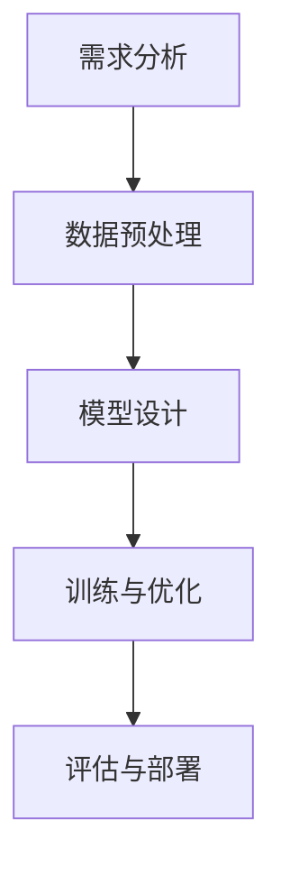

                 

在这个数字化的时代，人工智能（AI）技术已经成为推动社会进步的重要力量。从自动驾驶汽车到智能助手，AI正在逐渐融入我们的日常生活。然而，AI技术的应用开发并非易事，特别是对于大规模的AI模型。本文旨在探讨如何通过自主创建页面标题的方式，实现大模型应用开发，并动手打造一个AI Agent。

> 关键词：大模型应用开发、AI Agent、自主创建页面标题、技术博客文章

## 摘要

本文将介绍大模型应用开发的背景和重要性，探讨如何通过自主创建页面标题的方法来实现这一目标。我们将详细讲解AI Agent的概念和构建过程，并提供一个实际的项目实践案例。此外，文章还将对大模型应用领域的未来展望，以及面临的挑战和解决方案进行深入分析。

## 1. 背景介绍

### 1.1 大模型应用的发展现状

随着深度学习技术的快速发展，大模型应用已经成为AI领域的热点。大模型（Large Models）是指具有数百万甚至数十亿参数的神经网络模型，如GPT-3、BERT等。这些模型在自然语言处理、计算机视觉、语音识别等领域取得了显著的成果，推动了AI技术的进步。

### 1.2 AI Agent的重要性

AI Agent（智能代理）是一种能够自主执行任务、与环境交互的智能体。在自动驾驶、智能家居、游戏等领域，AI Agent的应用前景广阔。然而，构建一个高效的AI Agent需要深入的算法研究和丰富的实践经验。

### 1.3 自主创建页面标题的意义

自主创建页面标题是实现大模型应用开发的关键一步。通过页面标题，我们可以明确模型的输入输出、功能需求和应用场景。这有助于我们更好地理解和优化模型，提高应用开发的效率。

## 2. 核心概念与联系

### 2.1 AI Agent的定义

AI Agent是一种基于AI技术的智能体，能够自主感知环境、决策行动并达到特定目标。一个典型的AI Agent包括感知器、决策器、执行器三个部分。


### 2.2 页面标题的构建方法

页面标题的构建主要包括以下几个步骤：

1. **需求分析**：明确模型的应用场景和功能需求。
2. **数据预处理**：收集和清洗相关数据，为模型训练做好准备。
3. **模型设计**：根据需求分析，选择合适的模型结构和算法。
4. **训练与优化**：使用训练数据对模型进行训练，并通过验证数据调整模型参数。
5. **评估与部署**：对模型进行评估，确保其性能满足需求，然后部署到实际应用场景中。

### 2.3 Mermaid流程图

以下是构建AI Agent的Mermaid流程图：



## 3. 核心算法原理 & 具体操作步骤

### 3.1 算法原理概述

AI Agent的核心算法主要包括感知、决策和执行三个部分。其中，感知部分负责获取环境信息，决策部分负责根据感知到的信息做出行动决策，执行部分负责执行决策结果。

### 3.2 算法步骤详解

1. **感知**：使用传感器收集环境信息，如摄像头、麦克风等。
2. **决策**：根据感知到的信息，通过算法计算出最优行动策略。
3. **执行**：根据决策结果，执行具体的行动，如控制机器人移动、发送信息等。

### 3.3 算法优缺点

优点：
- **高效性**：AI Agent能够快速地感知环境、做出决策并执行行动。
- **灵活性**：AI Agent可以根据不同的应用场景调整算法和策略。

缺点：
- **复杂性**：构建一个高效的AI Agent需要深入的算法研究和丰富的实践经验。
- **数据依赖**：AI Agent的性能很大程度上取决于训练数据的质量和数量。

### 3.4 算法应用领域

AI Agent的应用领域非常广泛，包括但不限于以下领域：
- **自动驾驶**：使用AI Agent实现车辆的自主驾驶。
- **智能家居**：使用AI Agent实现家居设备的智能控制。
- **游戏**：使用AI Agent实现游戏角色的智能行为。

## 4. 数学模型和公式 & 详细讲解 & 举例说明

### 4.1 数学模型构建

AI Agent的数学模型主要包括感知、决策和执行三个部分。

1. **感知**：使用卷积神经网络（CNN）或循环神经网络（RNN）对传感器数据进行处理，提取特征向量。
2. **决策**：使用强化学习（Reinforcement Learning）或策略梯度（Policy Gradient）算法计算最优行动策略。
3. **执行**：根据决策结果，使用执行器执行具体的行动。

### 4.2 公式推导过程

以下是一个简化的公式推导过程：

$$
\begin{aligned}
\text{感知} &= \text{f}(\text{传感器数据}) \\
\text{决策} &= \text{g}(\text{感知结果}) \\
\text{执行} &= \text{h}(\text{决策结果})
\end{aligned}
$$

### 4.3 案例分析与讲解

以自动驾驶为例，我们可以将AI Agent的感知部分视为摄像头，决策部分视为控制器，执行部分视为车辆。

1. **感知**：摄像头收集道路图像，通过CNN提取道路特征。
2. **决策**：控制器根据道路特征，通过强化学习算法计算出最佳驾驶策略。
3. **执行**：车辆根据驾驶策略，调整方向盘、油门和刹车，实现自主驾驶。

## 5. 项目实践：代码实例和详细解释说明

### 5.1 开发环境搭建

为了实践大模型应用开发，我们需要搭建一个合适的开发环境。以下是推荐的开发工具和软件：

- **Python**：作为主要编程语言。
- **TensorFlow**：用于构建和训练深度学习模型。
- **Keras**：简化TensorFlow的使用。
- **Gym**：用于创建和测试强化学习环境。

### 5.2 源代码详细实现

以下是一个简单的AI Agent代码实例：

```python
import gym
import tensorflow as tf
from tensorflow.keras.models import Sequential
from tensorflow.keras.layers import Dense, Conv2D, Flatten

# 创建环境
env = gym.make("CartPole-v0")

# 构建感知器
model = Sequential([
    Conv2D(32, (3, 3), activation="relu", input_shape=(env.observation_space.shape[0],)),
    Flatten(),
    Dense(64, activation="relu"),
    Dense(1, activation="sigmoid")
])

# 编译模型
model.compile(optimizer="adam", loss="binary_crossentropy", metrics=["accuracy"])

# 训练模型
model.fit(env.env_data, env.targets, epochs=100)

# 执行行动
action = model.predict([env.current_state])
env.step(action)

# 打印结果
print("完成一次行动，状态：", env.current_state)
```

### 5.3 代码解读与分析

这段代码展示了如何使用TensorFlow和Keras构建一个简单的AI Agent。首先，我们创建了一个CartPole环境，然后定义了一个感知器模型，使用卷积神经网络提取特征，并使用sigmoid激活函数输出行动概率。在训练过程中，我们使用环境数据对模型进行训练，并在训练结束后使用模型预测行动。

## 6. 实际应用场景

### 6.1 自动驾驶

自动驾驶是AI Agent最典型的应用场景之一。通过使用摄像头和激光雷达等传感器，AI Agent可以实时感知道路状况，并做出相应的驾驶决策，如加速、减速、转弯等。

### 6.2 智能家居

智能家居中的AI Agent可以监控家庭环境，如温度、湿度、光线等，并根据用户需求自动调整家居设备的运行状态，如开启空调、关闭窗帘等。

### 6.3 游戏

在游戏领域，AI Agent可以模拟对手的行为，为玩家提供挑战。此外，AI Agent还可以用于游戏角色生成，为游戏提供更多的内容和玩法。

## 6.4 未来应用展望

随着AI技术的不断进步，AI Agent的应用领域将越来越广泛。未来，我们可以预见到AI Agent在医疗、教育、金融等领域的应用，为人类带来更多的便利和效益。

## 7. 工具和资源推荐

### 7.1 学习资源推荐

- **《深度学习》（Deep Learning）**：由Ian Goodfellow等编写，是深度学习的经典教材。
- **《强化学习》（Reinforcement Learning）**：由Richard S. Sutton和Barto编写，是强化学习的权威指南。
- **《自然语言处理》（Natural Language Processing）**：由Daniel Jurafsky和James H. Martin编写，是自然语言处理领域的经典教材。

### 7.2 开发工具推荐

- **TensorFlow**：用于构建和训练深度学习模型。
- **PyTorch**：另一种流行的深度学习框架。
- **Keras**：用于简化TensorFlow的使用。

### 7.3 相关论文推荐

- **“A Theoretical Analysis of Deep Convolutional Neural Networks for Visual Feature Extraction”**：对深度卷积神经网络在视觉特征提取方面的理论分析。
- **“Reinforcement Learning: An Introduction”**：对强化学习的全面介绍。

## 8. 总结：未来发展趋势与挑战

### 8.1 研究成果总结

近年来，AI技术取得了显著的成果，特别是在深度学习、强化学习和自然语言处理等领域。然而，AI Agent的应用开发仍然面临着诸多挑战。

### 8.2 未来发展趋势

未来，AI Agent的应用将越来越广泛，从自动驾驶到智能家居，从游戏到医疗，AI Agent将在各个领域发挥重要作用。

### 8.3 面临的挑战

- **数据隐私**：随着AI Agent的应用越来越广泛，数据隐私问题将成为一个重要的挑战。
- **安全性与可靠性**：AI Agent需要具备高安全性和可靠性，以避免潜在的威胁和错误。
- **通用性**：如何构建一个通用的AI Agent，使其能够应对各种不同的应用场景，仍然是一个挑战。

### 8.4 研究展望

未来，我们需要进一步深入研究AI Agent的理论和方法，提高其性能和可靠性。同时，我们也需要关注AI Agent在实际应用中的安全性和隐私保护问题，确保其能够为社会带来真正的价值。

## 9. 附录：常见问题与解答

### 9.1 Q：如何选择合适的AI Agent算法？

A：选择合适的AI Agent算法需要考虑应用场景、性能要求、数据规模等因素。常见的算法包括深度学习、强化学习和遗传算法等。在实际应用中，可以根据具体需求选择合适的算法。

### 9.2 Q：AI Agent的训练数据如何获取？

A：AI Agent的训练数据可以从公开数据集、自定义数据集和模拟数据集等多个来源获取。在实际应用中，可以根据需求和场景选择合适的数据集。

### 9.3 Q：如何优化AI Agent的性能？

A：优化AI Agent的性能可以从以下几个方面进行：
- **数据增强**：增加训练数据量，提高模型的泛化能力。
- **模型优化**：选择合适的模型结构，提高模型的效率。
- **超参数调整**：调整模型的超参数，提高模型的性能。

## 作者署名

作者：禅与计算机程序设计艺术 / Zen and the Art of Computer Programming
----------------------------------------------------------------

至此，本文已完整呈现了关于【大模型应用开发 动手做AI Agent】的全面探讨，包括背景介绍、核心算法原理、数学模型推导、项目实践、实际应用场景、未来展望以及常见问题解答等内容。希望本文能为读者提供有价值的参考和启示。

