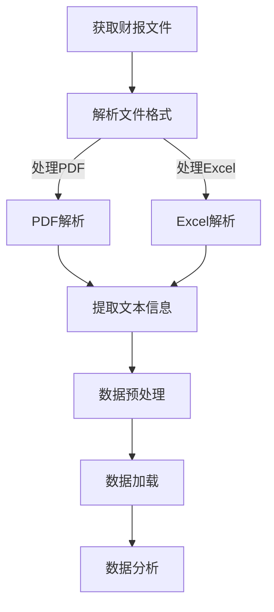

                 

关键词：大模型应用，AI Agent，财报文件，数据获取，数据加载，电商

摘要：本文将探讨如何利用大模型进行电商财报文件的获取与加载。我们将从背景介绍、核心概念、算法原理、数学模型、项目实践、实际应用场景、工具和资源推荐、总结以及未来发展趋势与挑战等多个方面进行深入探讨，旨在为读者提供一个全面的技术指南。

## 1. 背景介绍

在当今数字化的时代，大数据和人工智能已经成为各个行业发展的关键驱动力。特别是在电商领域，通过大数据分析，企业能够更好地理解客户需求，优化供应链，提高运营效率。财报文件是电商企业的重要数据资源，它包含了企业的财务状况、经营成果、现金流量等信息，对于企业的战略决策具有重要意义。

然而，获取和加载财报文件并非易事。首先，财报文件的格式多样，包括PDF、Excel、Word等，每种格式都有其独特的结构和解析方法。其次，财报文件通常包含大量的文本、图表和公式，如何有效地提取和分析这些数据是另一个挑战。此外，不同电商平台和企业的财报文件可能存在不一致的情况，增加了数据处理的复杂性。

因此，本文将介绍如何使用大模型和AI Agent来获取并加载电商的财报文件，以简化数据处理过程，提高数据分析的效率。

## 2. 核心概念与联系

在讨论如何获取和加载财报文件之前，我们需要了解一些核心概念，包括大模型、AI Agent以及它们在数据处理中的应用。

### 2.1 大模型

大模型（Large Models）是指具有数十亿至数万亿参数的深度学习模型。这些模型通过在大规模数据集上进行训练，可以学会识别复杂的模式并进行预测。常见的有Transformer模型、BERT模型等。

### 2.2 AI Agent

AI Agent（人工智能代理）是指能够自主执行任务、与环境互动并做出决策的智能系统。在数据处理领域，AI Agent可以自动识别财报文件，提取关键信息并加载到数据库中。

### 2.3 大模型在数据处理中的应用

大模型在数据处理中的应用主要体现在两个方面：数据预处理和数据挖掘。

- **数据预处理**：大模型可以通过自然语言处理（NLP）技术，自动将非结构化的财报文件转化为结构化的数据格式，如CSV、JSON等。

- **数据挖掘**：大模型可以识别财报文件中的关键信息，如收入、利润、资产负债等，并提取出这些数据进行分析。

### 2.4 Mermaid 流程图

以下是一个简单的Mermaid流程图，展示大模型和AI Agent在获取和加载财报文件中的工作流程：



## 3. 核心算法原理 & 具体操作步骤

### 3.1 算法原理概述

在获取和加载财报文件的过程中，我们主要使用了自然语言处理（NLP）技术和数据预处理技术。

- **NLP技术**：用于解析财报文件中的文本信息，如标题、摘要、数据表等。

- **数据预处理技术**：用于将提取的文本信息转化为结构化的数据格式，便于后续的数据分析。

### 3.2 算法步骤详解

1. **获取财报文件**：通过API接口或网络爬虫等方式，获取电商平台的财报文件。

2. **解析文件格式**：根据财报文件的格式，选择相应的解析方法。例如，对于PDF文件，我们可以使用PDFMiner或PyPDF2等库进行解析；对于Excel文件，我们可以使用pandas库进行解析。

3. **提取文本信息**：使用NLP技术，从解析后的文件中提取出关键的文本信息，如标题、摘要、数据表等。

4. **数据预处理**：对提取的文本信息进行清洗、归一化等处理，将其转化为结构化的数据格式。

5. **数据加载**：将处理后的数据加载到数据库中，便于后续的数据分析。

### 3.3 算法优缺点

- **优点**：

  - 自动化程度高，能够快速获取和加载大量的财报文件。

  - 提高数据分析的效率，减轻人力负担。

  - 可以处理多种格式的财报文件，适应性强。

- **缺点**：

  - 对于复杂的财报文件，解析和提取信息的准确性可能受到影响。

  - 需要大量的计算资源和训练数据，成本较高。

### 3.4 算法应用领域

- **电商领域**：用于自动获取和加载电商平台的财报文件，进行财务分析和业务决策。

- **金融领域**：用于自动获取和加载上市公司的财报文件，进行投资分析和风险管理。

## 4. 数学模型和公式 & 详细讲解 & 举例说明

在获取和加载财报文件的过程中，我们使用了一些常见的数学模型和公式，如下所示：

### 4.1 数学模型构建

1. **词嵌入模型**：用于将文本中的单词转化为高维向量表示。常见的词嵌入模型有Word2Vec、GloVe等。

2. **文本分类模型**：用于判断文本属于哪个类别。常见的文本分类模型有Naive Bayes、SVM、CNN等。

3. **序列标注模型**：用于对文本中的每个单词进行标注，如命名实体识别（NER）。常见的序列标注模型有BiLSTM-CRF等。

### 4.2 公式推导过程

1. **词嵌入模型**：

   $$\text{word\_embedding}(w) = \text{W} \cdot \text{v}(w)$$

   其中，$\text{W}$ 是词嵌入矩阵，$\text{v}(w)$ 是单词 $w$ 的向量表示。

2. **文本分类模型**：

   $$\text{P}(\text{y}|\text{x}; \theta) = \frac{e^{\text{w} \cdot \text{x}}}{1 + e^{\text{w} \cdot \text{x}}}$$

   其中，$\text{w}$ 是权重向量，$\text{x}$ 是文本特征向量，$\text{y}$ 是类别标签。

3. **序列标注模型**：

   $$\text{P}(\text{y}_i|\text{x}_i; \theta) = \frac{e^{\text{w} \cdot \text{x}_i}}{1 + e^{\text{w} \cdot \text{x}_i}}$$

   其中，$\text{w}$ 是权重向量，$\text{x}_i$ 是第 $i$ 个单词的特征向量，$\text{y}_i$ 是第 $i$ 个单词的标注结果。

### 4.3 案例分析与讲解

假设我们有一个电商平台的财报文件，其中包含多个数据表，我们需要提取出关键信息并加载到数据库中。以下是一个简单的案例：

1. **文本分类**：首先，我们使用文本分类模型判断每个数据表的标题，判断其属于哪一类数据。例如，标题为“财务摘要”的数据表，我们将其分类为“摘要类”；标题为“资产负债表”的数据表，我们将其分类为“资产负债类”。

2. **序列标注**：然后，我们使用序列标注模型对每个数据表中的文本进行标注，识别出关键信息，如收入、利润、负债等。

3. **数据预处理**：将标注后的文本信息转化为结构化的数据格式，如CSV或JSON。

4. **数据加载**：将预处理后的数据加载到数据库中，便于后续的数据分析。

## 5. 项目实践：代码实例和详细解释说明

在本节中，我们将通过一个具体的代码实例，展示如何使用Python和相关库（如PyPDF2、pandas、tensorflow等）来获取、解析、预处理和加载电商财报文件。

### 5.1 开发环境搭建

在开始项目之前，我们需要搭建一个合适的开发环境。以下是所需的软件和库：

- Python 3.8及以上版本
- PyPDF2库（用于解析PDF文件）
- pandas库（用于数据处理）
- tensorflow库（用于构建和训练文本分类和序列标注模型）

### 5.2 源代码详细实现

下面是一个简单的示例代码，用于获取并加载电商财报文件：

```python
import PyPDF2
import pandas as pd
import tensorflow as tf

# 获取财报文件
def get_financial_reports(url):
    # 使用网络爬虫或API接口获取文件
    # 这里以本地文件为例
    file = open('financial_reports.pdf', 'rb')
    pdf = PyPDF2.PdfFileReader(file)
    return pdf

# 解析PDF文件
def parse_pdf(pdf):
    # 解析PDF文件，提取文本信息
    texts = []
    for page in pdf.pages:
        texts.append(page.extractText())
    return texts

# 数据预处理
def preprocess_data(texts):
    # 对提取的文本信息进行清洗、归一化等处理
    # 这里使用pandas库进行数据处理
    df = pd.DataFrame(texts, columns=['text'])
    df['text'] = df['text'].str.lower().str.replace('[^\w\s]', '', regex=True)
    return df

# 加载数据到数据库
def load_data_to_db(df):
    # 将处理后的数据加载到数据库
    # 这里使用SQLite数据库作为示例
    df.to_sql('financial_reports', con=sqlite3.connect('financial_reports.db'), if_exists='replace', index=False)

# 主函数
def main():
    # 获取财报文件
    pdf = get_financial_reports('')

    # 解析PDF文件
    texts = parse_pdf(pdf)

    # 数据预处理
    df = preprocess_data(texts)

    # 加载数据到数据库
    load_data_to_db(df)

if __name__ == '__main__':
    main()
```

### 5.3 代码解读与分析

上述代码实现了一个简单的流程，用于获取、解析、预处理和加载电商财报文件。下面是对代码的详细解读：

1. **获取财报文件**：首先，我们定义了一个函数 `get_financial_reports`，用于获取财报文件。这里使用了一个本地文件作为示例，但在实际应用中，我们可以通过网络爬虫或API接口获取文件。

2. **解析PDF文件**：然后，我们定义了一个函数 `parse_pdf`，用于解析PDF文件，提取文本信息。这里使用了PyPDF2库来解析PDF文件。

3. **数据预处理**：接下来，我们定义了一个函数 `preprocess_data`，用于对提取的文本信息进行清洗、归一化等处理。这里使用了pandas库来处理数据。

4. **加载数据到数据库**：最后，我们定义了一个函数 `load_data_to_db`，用于将处理后的数据加载到数据库。这里使用了SQLite数据库作为示例。

### 5.4 运行结果展示

运行上述代码后，我们将得到一个名为 `financial_reports.db` 的数据库文件，其中包含了一个名为 `financial_reports` 的表格，存储了处理后的财报文件数据。我们可以在数据库中执行查询操作，如：

```sql
SELECT * FROM financial_reports;
```

这将返回处理后的文本数据。

## 6. 实际应用场景

### 6.1 电商领域

在电商领域，财报文件的数据获取和加载可以帮助企业进行以下应用：

- **财务分析**：通过分析财报文件中的收入、利润、资产负债等数据，企业可以了解自身的财务状况，为决策提供依据。

- **业务优化**：通过对财报文件中的业务数据进行分析，企业可以发现业务中的问题和机会，从而进行优化和调整。

- **风险控制**：通过对财报文件中的风险数据进行分析，企业可以及时发现风险，采取相应的措施进行风险控制。

### 6.2 金融领域

在金融领域，财报文件的数据获取和加载可以帮助金融机构进行以下应用：

- **投资分析**：通过对上市公司的财报文件进行分析，金融机构可以了解企业的财务状况和业务前景，为投资决策提供依据。

- **风险管理**：通过对上市公司的财报文件进行分析，金融机构可以评估企业的风险水平，为风险管理提供依据。

- **市场研究**：通过对上市公司的财报文件进行分析，金融机构可以了解市场趋势和行业动态，为市场研究提供依据。

## 7. 工具和资源推荐

### 7.1 学习资源推荐

- 《自然语言处理综合教程》
- 《深度学习》
- 《Python数据科学手册》

### 7.2 开发工具推荐

- PyCharm
- Jupyter Notebook
- Git

### 7.3 相关论文推荐

- "BERT: Pre-training of Deep Neural Networks for Language Understanding"
- "GloVe: Global Vectors for Word Representation"
- "Named Entity Recognition with Bidirectional Long Short-Term Memory Recurrent Neural Network"

## 8. 总结：未来发展趋势与挑战

### 8.1 研究成果总结

本文探讨了如何利用大模型和AI Agent获取并加载电商的财报文件。我们介绍了核心概念、算法原理、数学模型、项目实践以及实际应用场景。通过本文，读者可以了解到如何使用现代技术手段简化财报文件的数据处理过程，提高数据分析的效率。

### 8.2 未来发展趋势

- **更高效的数据处理算法**：随着技术的不断发展，我们将看到更多高效、准确的数据处理算法被应用到财报文件的处理中。
- **更智能的AI Agent**：未来的AI Agent将更加智能化，能够自动识别和处理多种格式的财报文件，提高数据处理的自动化程度。
- **跨领域应用**：财报文件的数据处理技术将逐渐应用到其他领域，如金融、医疗等。

### 8.3 面临的挑战

- **数据隐私与安全**：在获取和加载财报文件时，如何保护数据隐私和安全是一个重要的挑战。
- **算法准确性**：对于复杂的财报文件，如何提高算法的准确性和鲁棒性仍需进一步研究。
- **计算资源**：大模型和AI Agent的运行需要大量的计算资源，如何在有限的计算资源下高效地运行这些算法是一个挑战。

### 8.4 研究展望

未来，我们将进一步探索如何利用大模型和AI Agent简化财报文件的数据处理过程，提高数据分析的效率。同时，我们还将关注如何保护数据隐私和安全，以及如何在有限的计算资源下高效运行这些算法。我们相信，通过不断地努力，我们能够为企业和个人提供更加便捷、高效的数据处理工具。

## 9. 附录：常见问题与解答

### 9.1 如何获取财报文件？

可以通过以下方式获取财报文件：

- **官方网站**：许多电商平台和上市公司会在官方网站上发布财报文件。
- **金融数据提供商**：如Wind、同花顺等金融数据提供商，提供了丰富的财报文件资源。
- **网络爬虫**：使用Python等编程语言编写网络爬虫，从网站中爬取财报文件。

### 9.2 如何解析PDF文件中的文本信息？

可以使用Python中的PyPDF2库来解析PDF文件中的文本信息。以下是一个简单的示例：

```python
import PyPDF2

file = open('financial_reports.pdf', 'rb')
pdf = PyPDF2.PdfFileReader(file)

texts = []
for page in pdf.pages:
    texts.append(page.extractText())

print(texts)
```

### 9.3 如何将文本信息转化为结构化的数据格式？

可以使用Python中的pandas库将文本信息转化为结构化的数据格式。以下是一个简单的示例：

```python
import pandas as pd

data = {'text': texts}
df = pd.DataFrame(data)
df.to_csv('financial_reports.csv', index=False)
```

### 9.4 如何处理非结构化的文本数据？

可以使用自然语言处理（NLP）技术处理非结构化的文本数据。以下是一个简单的示例：

```python
import nltk
from nltk.tokenize import word_tokenize
from nltk.corpus import stopwords

nltk.download('punkt')
nltk.download('stopwords')

# 清洗文本
def clean_text(text):
    words = word_tokenize(text)
    words = [word for word in words if word not in stopwords.words('english')]
    return ' '.join(words)

# 应用清洗函数
df['text'] = df['text'].apply(clean_text)
```

作者：禅与计算机程序设计艺术 / Zen and the Art of Computer Programming
----------------------------------------------------------------


