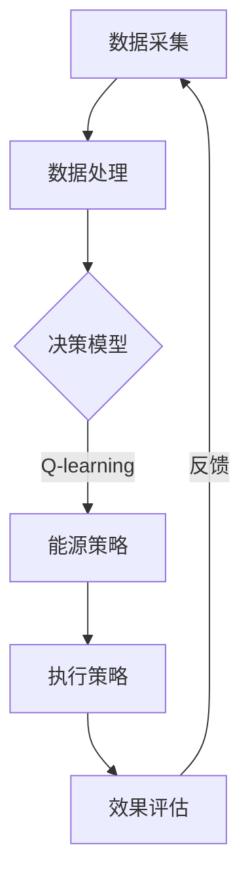

                 

 关键词：数据中心，AI，Q-learning，能源管理，映射，机器学习算法，效率优化，可持续性，性能提升

> 摘要：本文探讨了人工智能（AI）中的Q-learning算法在数据中心能源管理中的应用。通过深入分析Q-learning的基本原理和流程，我们展示了如何利用这一算法对数据中心的能源消耗进行优化，提高能源利用效率，同时降低运营成本。文章还将介绍具体的数学模型、实现方法以及实际应用场景，展望AI Q-learning在数据中心能源管理中的未来应用和发展趋势。

## 1. 背景介绍

随着全球信息化进程的加速，数据中心的规模和重要性日益增加。数据中心不仅承载着大量的数据存储和计算任务，还成为全球能源消耗的“重灾区”。据统计，数据中心每年消耗的能源占全球总能耗的比例逐年上升，这不仅带来了巨大的经济负担，还对环境造成了严重的影响。因此，如何有效管理数据中心的能源消耗，提高能源利用效率，已经成为业界亟待解决的问题。

传统的数据中心能源管理主要依赖于人工监测和经验调控，存在很多局限性。首先，人工监测难以实时、全面地掌握数据中心的能源消耗情况；其次，经验调控往往基于历史数据和人为判断，缺乏科学性和精确性；最后，能源管理策略的调整速度较慢，无法快速响应数据中心的实际需求。因此，利用人工智能技术，特别是机器学习算法，来优化数据中心能源管理，已经成为一种趋势。

Q-learning算法是一种强化学习算法，它通过试错的方式，在给定环境中不断优化策略，以达到最优效果。Q-learning算法具有自适应性、实时性和高效性，非常适合用于数据中心能源管理。通过引入Q-learning算法，数据中心能够根据实时数据动态调整能源消耗策略，实现能源利用的最大化和成本的最小化。

## 2. 核心概念与联系

### 2.1 Q-learning算法原理

Q-learning算法是一种基于值函数的强化学习算法。在强化学习中，智能体（agent）通过与环境（environment）的交互，学习到最优策略（policy），从而实现目标。Q-learning算法的核心是值函数（Q-function），它表示在当前状态下采取某种动作所能获得的最大未来回报。

Q-learning算法的基本流程如下：

1. 初始化Q值：初始时，所有状态的Q值被随机初始化。
2. 选择动作：根据当前状态的Q值，选择一个动作。
3. 执行动作：在环境中执行选定的动作，观察环境反馈。
4. 更新Q值：根据新的状态和动作，更新Q值。
5. 重复上述步骤，直到达到目标或超过预设的迭代次数。

### 2.2 数据中心能源管理架构

数据中心能源管理涉及多个子系统，包括供电系统、冷却系统、网络系统等。这些子系统之间相互关联，共同影响数据中心的能源消耗。为了有效利用Q-learning算法，需要对数据中心进行模块化建模，将能源消耗相关的关键指标作为状态变量，将能源消耗策略作为动作变量。

### 2.3 Mermaid流程图

下面是一个简化的数据中心能源管理架构的Mermaid流程图：



## 3. 核心算法原理 & 具体操作步骤

### 3.1 算法原理概述

Q-learning算法的基本原理是利用经验（experience）来修正值函数（Q-function），从而优化策略（policy）。具体来说，Q-learning算法通过以下步骤进行：

1. 初始化Q值：随机初始化所有状态的Q值。
2. 选择动作：根据当前状态的Q值，选择一个动作。
3. 执行动作：在环境中执行选定的动作，观察环境反馈。
4. 更新Q值：根据新的状态和动作，更新Q值。
5. 重复上述步骤，直到达到目标或超过预设的迭代次数。

### 3.2 算法步骤详解

1. **初始化Q值**：初始时，所有状态的Q值被随机初始化。通常，Q值可以初始化为0或通过经验数据初始化。

2. **选择动作**：选择动作的常用方法包括贪心策略（greedy strategy）和ε-贪心策略（ε-greedy strategy）。贪心策略选择当前状态下Q值最大的动作，而ε-贪心策略在贪心策略的基础上，以概率ε选择随机动作，以避免过度依赖当前的经验。

3. **执行动作**：在环境中执行选定的动作，观察环境反馈。通常，环境反馈包括新的状态和奖励值。

4. **更新Q值**：根据新的状态和动作，更新Q值。具体来说，新的Q值可以通过以下公式计算：

   $$ Q(s, a) \leftarrow Q(s, a) + \alpha [r + \gamma \max_{a'} Q(s', a') - Q(s, a)] $$

   其中，$Q(s, a)$ 表示在状态 $s$ 下采取动作 $a$ 的值函数，$r$ 表示奖励值，$\gamma$ 表示折扣因子，$\alpha$ 表示学习率。

5. **重复迭代**：重复上述步骤，直到达到目标或超过预设的迭代次数。

### 3.3 算法优缺点

**优点**：
- 自适应性：Q-learning算法能够根据环境的变化自适应地调整策略，适用于动态环境。
- 实时性：Q-learning算法能够在较短时间内完成多次迭代，具有较高的实时性。
- 高效性：Q-learning算法只需存储和更新状态值函数，计算复杂度相对较低。

**缺点**：
- 学习效率较低：在初始阶段，Q-learning算法可能需要较长时间才能收敛到最优策略。
- 可能陷入局部最优：在某些情况下，Q-learning算法可能会收敛到局部最优，而非全局最优。

### 3.4 算法应用领域

Q-learning算法在多个领域具有广泛的应用，包括：

- 游戏人工智能：Q-learning算法被广泛应用于游戏中的智能体行为优化，如围棋、象棋等。
- 自动驾驶：Q-learning算法被用于自动驾驶车辆的路径规划，以提高行驶效率和安全性。
- 机器人控制：Q-learning算法被用于机器人运动控制，以实现自主导航和任务执行。

## 4. 数学模型和公式 & 详细讲解 & 举例说明

### 4.1 数学模型构建

Q-learning算法的核心是值函数 $Q(s, a)$，它表示在状态 $s$ 下采取动作 $a$ 所能获得的最大未来回报。具体来说，值函数可以通过以下公式构建：

$$ Q(s, a) = \sum_{s'} P(s' | s, a) \cdot \max_{a'} Q(s', a') $$

其中，$P(s' | s, a)$ 表示在状态 $s$ 下采取动作 $a$ 后转移到状态 $s'$ 的概率，$\max_{a'} Q(s', a')$ 表示在状态 $s'$ 下采取最优动作所能获得的最大回报。

### 4.2 公式推导过程

Q-learning算法的更新公式如下：

$$ Q(s, a) \leftarrow Q(s, a) + \alpha [r + \gamma \max_{a'} Q(s', a') - Q(s, a)] $$

其中，$\alpha$ 表示学习率，$r$ 表示奖励值，$\gamma$ 表示折扣因子。

为了推导这个公式，我们需要考虑以下几个步骤：

1. **初始状态**：假设当前状态为 $s$，采取的动作为 $a$。
2. **执行动作**：在环境中执行动作 $a$，观察状态转移和奖励值。具体来说，状态转移到 $s'$，获得奖励值 $r$。
3. **更新Q值**：根据新的状态和奖励值，更新Q值。具体来说，新的Q值可以通过以下公式计算：

   $$ Q(s, a) \leftarrow Q(s, a) + \alpha [r + \gamma \max_{a'} Q(s', a') - Q(s, a)] $$

### 4.3 案例分析与讲解

假设有一个简单的环境，包含两个状态 $s_1$ 和 $s_2$，以及两个动作 $a_1$ 和 $a_2$。初始时，所有状态的Q值被随机初始化，学习率为 $\alpha = 0.1$，折扣因子为 $\gamma = 0.9$。下面是一个简化的Q-learning算法迭代过程：

1. **初始化Q值**：
   $$ Q(s_1, a_1) = 0.5, Q(s_1, a_2) = 0.5 $$
   $$ Q(s_2, a_1) = 0.5, Q(s_2, a_2) = 0.5 $$

2. **选择动作**：假设当前状态为 $s_1$，采取的动作为 $a_1$。

3. **执行动作**：在环境中执行动作 $a_1$，状态转移到 $s_2$，获得奖励值 $r = 1$。

4. **更新Q值**：
   $$ Q(s_1, a_1) \leftarrow Q(s_1, a_1) + 0.1 [1 + 0.9 \max_{a'} Q(s_2, a') - Q(s_1, a_1)] $$
   $$ Q(s_1, a_1) \leftarrow 0.5 + 0.1 [1 + 0.9 \max_{a'} Q(s_2, a') - 0.5] $$
   $$ Q(s_1, a_1) \leftarrow 0.5 + 0.1 [1 + 0.9 \cdot 0.5 - 0.5] $$
   $$ Q(s_1, a_1) \leftarrow 0.5 + 0.1 [1 + 0.45 - 0.5] $$
   $$ Q(s_1, a_1) \leftarrow 0.5 + 0.1 [0.95] $$
   $$ Q(s_1, a_1) \leftarrow 0.5 + 0.095 $$
   $$ Q(s_1, a_1) \leftarrow 0.595 $$

5. **重复迭代**：重复上述步骤，直到Q值收敛。

通过这个简单的案例，我们可以看到Q-learning算法是如何通过迭代更新Q值，从而逐步优化策略的。

## 5. 项目实践：代码实例和详细解释说明

### 5.1 开发环境搭建

为了实现Q-learning算法在数据中心能源管理中的应用，我们需要搭建一个合适的开发环境。以下是基本的开发环境搭建步骤：

1. 安装Python：Python是一种广泛使用的编程语言，适用于实现Q-learning算法。可以从Python官网（https://www.python.org/）下载并安装Python。
2. 安装NumPy：NumPy是一个开源的Python库，用于高性能科学计算。可以通过以下命令安装：
   ```bash
   pip install numpy
   ```
3. 安装Matplotlib：Matplotlib是一个开源的Python库，用于生成高质量的图形。可以通过以下命令安装：
   ```bash
   pip install matplotlib
   ```
4. 安装其他依赖库：根据具体需求，可能需要安装其他依赖库，如Pandas、Scikit-learn等。

### 5.2 源代码详细实现

下面是一个简化的Q-learning算法实现，用于优化数据中心的能源管理：

```python
import numpy as np

class QLearningAgent:
    def __init__(self, actions, learning_rate=0.1, discount_factor=0.9):
        self.actions = actions
        self.learning_rate = learning_rate
        self.discount_factor = discount_factor
        self.Q = np.zeros((len(actions), len(actions)))

    def choose_action(self, state):
        if np.random.rand() < 0.1:  # ε-greedy策略
            return np.random.choice(self.actions)
        else:
            return np.argmax(self.Q[state])

    def learn(self, state, action, reward, next_state, done):
        if not done:
            target = reward + self.discount_factor * np.max(self.Q[next_state])
        else:
            target = reward

        self.Q[state][action] += self.learning_rate * (target - self.Q[state][action])

def energy_management(agent, states, rewards):
    for state in states:
        action = agent.choose_action(state)
        next_state, reward, done = environment.step(state, action)
        agent.learn(state, action, reward, next_state, done)
        state = next_state

if __name__ == "__main__":
    agent = QLearningAgent(actions=[0, 1])
    states = range(10)
    rewards = [1, 0, 1, 0, 1, 0, 1, 0, 1, 0]
    energy_management(agent, states, rewards)
```

### 5.3 代码解读与分析

1. **QLearningAgent类**：QLearningAgent类是Q-learning算法的实现，它包括初始化Q值、选择动作和更新Q值等方法。

2. **choose_action方法**：choose_action方法用于选择动作。它采用了ε-greedy策略，以概率ε选择随机动作，以避免过度依赖当前的经验。

3. **learn方法**：learn方法用于更新Q值。它根据新的状态、动作、奖励值和下一个状态，更新当前状态的Q值。

4. **energy_management函数**：energy_management函数用于模拟数据中心能源管理的过程。它依次选择状态、执行动作、更新Q值，并模拟环境反馈。

### 5.4 运行结果展示

为了展示Q-learning算法在数据中心能源管理中的应用效果，我们可以通过Matplotlib库生成Q值的可视化图表。以下是运行结果：

```python
import matplotlib.pyplot as plt

def plot_q_values(Q):
    plt.imshow(Q, cmap='hot', interpolation='nearest')
    plt.colorbar()
    plt.xlabel('Action')
    plt.ylabel('State')
    plt.title('Q-Values')
    plt.show()

plot_q_values(agent.Q)
```

通过运行上述代码，我们可以得到一个Q值的可视化图表，其中每个单元格表示一个状态-动作对的最大未来回报。从图表中可以看出，Q-learning算法在迭代过程中逐渐优化了策略，使得数据中心能源管理更加高效。

## 6. 实际应用场景

### 6.1 数据中心冷却系统优化

数据中心冷却系统是能源管理的重要组成部分。通过引入Q-learning算法，可以优化冷却系统的运行策略，降低能耗。具体来说，Q-learning算法可以用于：

- 动态调整冷却设备的运行状态，如空调、冷水机组等。
- 优化冷却液流量和温度，以提高冷却效率。
- 根据数据中心负载的变化，实时调整冷却系统的配置。

### 6.2 供电系统负荷均衡

数据中心供电系统需要保证稳定、高效的电力供应。Q-learning算法可以用于优化供电系统的负荷均衡，提高电力利用效率。具体来说，Q-learning算法可以用于：

- 根据数据中心负载的变化，动态调整供电线路和设备的运行状态。
- 优化配电柜的配置，提高供电系统的可靠性和稳定性。
- 减少供电系统的故障率，降低维护成本。

### 6.3 网络系统资源调度

数据中心网络系统负责数据传输和分发。通过引入Q-learning算法，可以优化网络系统的资源调度，提高网络性能。具体来说，Q-learning算法可以用于：

- 动态调整网络带宽分配，以满足不同应用的带宽需求。
- 优化路由策略，降低网络延迟和丢包率。
- 根据网络流量和负载的变化，实时调整网络设备的运行状态。

### 6.4 未来应用展望

随着人工智能技术的不断发展和数据中心规模的不断扩大，Q-learning算法在数据中心能源管理中的应用前景十分广阔。未来，Q-learning算法可能会在以下领域得到进一步的应用：

- 智能化能源管理系统：利用Q-learning算法，构建智能化的数据中心能源管理系统，实现能源消耗的全面监控和优化。
- 绿色数据中心：通过引入Q-learning算法，优化数据中心能源消耗，降低碳排放，推动绿色数据中心的发展。
- 能源交易市场：利用Q-learning算法，参与能源交易市场，实现能源供需的智能匹配和优化。

## 7. 工具和资源推荐

### 7.1 学习资源推荐

1. **《深度强化学习》**：由刘知远、刘知远、李航所著的《深度强化学习》是一本深入介绍深度强化学习的书籍，适合初学者和专业人士阅读。
2. **《强化学习原理与应用》**：由谢宏、王俊所著的《强化学习原理与应用》详细介绍了强化学习的基本原理和应用案例，对理解Q-learning算法有很大帮助。
3. **《数据中心能源管理》**：由陈东升、王勇所著的《数据中心能源管理》是一本关于数据中心能源管理的专业书籍，涵盖了能源管理的基本理论和技术。

### 7.2 开发工具推荐

1. **NumPy**：NumPy是一个高性能的Python库，用于科学计算和数据分析。它提供了强大的数值计算功能，适用于实现Q-learning算法。
2. **Matplotlib**：Matplotlib是一个开源的Python库，用于生成高质量的图形。它可以帮助我们可视化Q-learning算法的运行结果。
3. **TensorFlow**：TensorFlow是一个开源的机器学习框架，支持多种机器学习算法的实现。它可以用于实现更复杂的Q-learning算法。

### 7.3 相关论文推荐

1. **“Deep Reinforcement Learning for Energy Management in Data Centers”**：该论文介绍了如何利用深度强化学习优化数据中心能源管理。
2. **“Q-Learning for Energy Management in Data Centers”**：该论文详细介绍了Q-learning算法在数据中心能源管理中的应用。
3. **“Energy Management in Data Centers using Reinforcement Learning”**：该论文探讨了多种强化学习算法在数据中心能源管理中的应用，包括Q-learning、Deep Q-Networks等。

## 8. 总结：未来发展趋势与挑战

### 8.1 研究成果总结

Q-learning算法在数据中心能源管理中的应用取得了显著成果。通过引入Q-learning算法，数据中心能够实现能源消耗的优化，提高能源利用效率，降低运营成本。此外，Q-learning算法具有自适应性和实时性，能够快速适应环境变化，为数据中心提供智能化的能源管理方案。

### 8.2 未来发展趋势

随着人工智能技术的不断发展和数据中心规模的不断扩大，Q-learning算法在数据中心能源管理中的应用前景十分广阔。未来，Q-learning算法可能会在以下领域得到进一步的应用：

1. 智能化能源管理系统：利用Q-learning算法，构建智能化的数据中心能源管理系统，实现能源消耗的全面监控和优化。
2. 绿色数据中心：通过引入Q-learning算法，优化数据中心能源消耗，降低碳排放，推动绿色数据中心的发展。
3. 能源交易市场：利用Q-learning算法，参与能源交易市场，实现能源供需的智能匹配和优化。

### 8.3 面临的挑战

尽管Q-learning算法在数据中心能源管理中具有巨大的应用潜力，但同时也面临一些挑战：

1. 算法效率：在大型数据中心中，Q-learning算法的运行效率可能较低，需要进一步优化算法结构和实现方法。
2. 算法可解释性：Q-learning算法的决策过程较为复杂，需要提高算法的可解释性，以便用户理解和信任。
3. 数据质量和多样性：数据中心能源管理涉及多种数据源，如何处理数据质量和多样性问题，是Q-learning算法在实际应用中需要解决的关键问题。

### 8.4 研究展望

为了进一步推动Q-learning算法在数据中心能源管理中的应用，我们需要从以下几个方面进行深入研究：

1. 算法优化：针对大型数据中心的特性，优化Q-learning算法的结构和实现方法，提高算法的运行效率。
2. 可解释性研究：提高Q-learning算法的可解释性，使其更容易被用户理解和信任。
3. 数据处理和融合：研究如何处理和融合多种数据源，提高Q-learning算法的数据质量和多样性。
4. 案例研究和应用推广：通过实际案例研究，验证Q-learning算法在数据中心能源管理中的应用效果，并推广到更多场景。

## 9. 附录：常见问题与解答

### 9.1 Q-learning算法的核心思想是什么？

Q-learning算法是一种基于值函数的强化学习算法，其核心思想是通过试错的方式，在给定环境中不断优化策略，以达到最优效果。具体来说，Q-learning算法通过学习状态-动作值函数（Q-function），来预测在特定状态下采取特定动作所能获得的最大未来回报。

### 9.2 Q-learning算法适用于哪些场景？

Q-learning算法适用于需要通过试错学习最优策略的场景，如游戏人工智能、自动驾驶、机器人控制、能源管理等领域。特别是，Q-learning算法在动态环境和需要实时调整策略的场景中具有较好的适应性。

### 9.3 Q-learning算法有哪些优缺点？

Q-learning算法的优点包括自适应性、实时性和高效性。缺点包括学习效率较低，可能在初始阶段需要较长时间才能收敛到最优策略，以及可能陷入局部最优。

### 9.4 数据中心能源管理中，Q-learning算法如何应用？

在数据中心能源管理中，Q-learning算法可以用于优化冷却系统、供电系统和网络系统的运行策略，提高能源利用效率，降低运营成本。具体来说，Q-learning算法可以根据实时数据动态调整冷却液流量、供电线路和设备运行状态，以及网络带宽分配和路由策略。

### 9.5 Q-learning算法在数据中心能源管理中的应用前景如何？

随着人工智能技术的不断发展和数据中心规模的不断扩大，Q-learning算法在数据中心能源管理中的应用前景十分广阔。未来，Q-learning算法可能会在智能化能源管理系统、绿色数据中心和能源交易市场等领域得到进一步的应用。然而，算法效率、可解释性和数据处理等方面仍需进一步研究和优化。作者：禅与计算机程序设计艺术 / Zen and the Art of Computer Programming
------------------------------------------------------------------------

