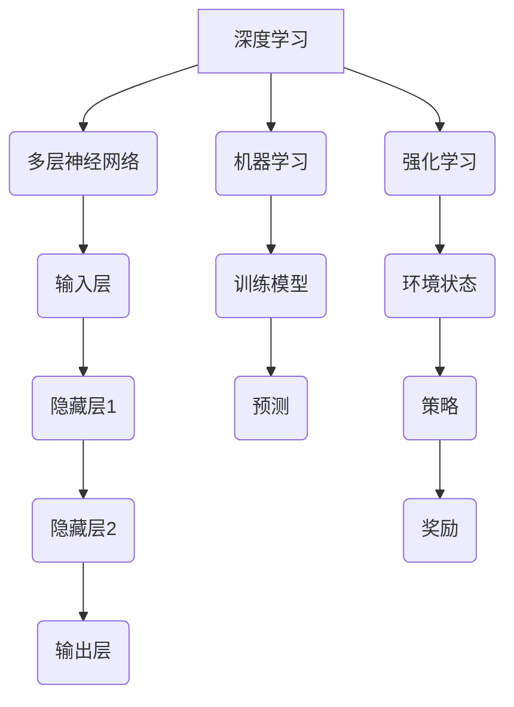

                 

关键词：AI人工智能、映射原理、算法、应用实战、深度学习、机器学习、神经网络

> 摘要：本文旨在深入探讨AI人工智能的核心原理——映射，以及其在现代技术和行业中的应用实战。通过详细的算法原理介绍、数学模型讲解、实际项目实践，读者将全面了解AI技术如何改变世界，并为其未来的发展指明方向。

## 1. 背景介绍

随着科技的迅猛发展，人工智能（AI）已经成为推动社会进步的重要力量。从简单的自动化工具到复杂的认知系统，AI的应用范围涵盖了诸多领域，包括医疗、金融、交通、教育等。然而，这一切的背后都离不开一个核心概念——映射。

### 什么是映射

映射，即在两个不同领域之间建立一种对应关系。在AI领域中，映射主要体现在数据与知识之间的转换。例如，通过深度学习算法，我们可以将图片中的像素点映射为特定物体的识别；通过机器学习算法，我们可以将历史金融数据映射为未来的市场预测。

### 映射的重要性

映射不仅使AI系统具备了处理复杂信息的能力，还使得AI技术能够解决传统方法难以应对的问题。例如，在图像识别领域，传统的特征提取方法需要手动定义特征，而通过映射原理，我们可以让计算机自动从海量数据中学习特征，从而提高识别的准确性和效率。

## 2. 核心概念与联系

### 2.1 AI的核心算法原理

在AI技术中，映射主要依赖于以下几种核心算法：

1. **深度学习**：通过多层神经网络，将输入数据映射为输出结果。
2. **机器学习**：通过训练模型，将数据映射为决策或预测。
3. **强化学习**：通过试错机制，将环境状态映射为最优策略。

### 2.2 算法架构的 Mermaid 流程图



## 3. 核心算法原理 & 具体操作步骤

### 3.1 算法原理概述

#### 深度学习

深度学习是一种基于多层神经网络的机器学习方法，通过逐层提取特征，实现从原始数据到高阶抽象的映射。

#### 机器学习

机器学习通过训练模型，将历史数据映射为未来的预测或决策。常见的机器学习算法包括线性回归、决策树、支持向量机等。

#### 强化学习

强化学习通过试错和奖励机制，学习在特定环境下采取最优行动的策略。

### 3.2 算法步骤详解

#### 深度学习

1. 数据预处理：对输入数据进行归一化、去噪等处理。
2. 构建模型：设计多层神经网络结构，包括输入层、隐藏层和输出层。
3. 训练模型：通过反向传播算法，调整网络权重，使输出结果与实际值尽可能接近。
4. 预测：使用训练好的模型对新的数据进行预测。

#### 机器学习

1. 数据收集：收集相关的历史数据。
2. 特征提取：从数据中提取有用的特征。
3. 模型训练：使用训练数据训练模型。
4. 模型评估：使用测试数据评估模型性能。

#### 强化学习

1. 初始化环境：设定环境状态。
2. 选择行动：根据当前状态选择最优行动。
3. 接收奖励：根据行动的结果接收奖励。
4. 更新策略：根据奖励调整行动策略。

### 3.3 算法优缺点

#### 深度学习

优点：能够自动提取特征，处理复杂数据。

缺点：训练时间较长，对数据质量要求高。

#### 机器学习

优点：模型结构简单，易于理解。

缺点：特征提取依赖人工定义，可能无法处理高维度数据。

#### 强化学习

优点：能够处理动态环境，适应性强。

缺点：训练过程可能需要大量时间和计算资源。

### 3.4 算法应用领域

#### 深度学习

应用领域：图像识别、语音识别、自然语言处理等。

#### 机器学习

应用领域：金融预测、医疗诊断、推荐系统等。

#### 强化学习

应用领域：自动驾驶、游戏AI、机器人控制等。

## 4. 数学模型和公式 & 详细讲解 & 举例说明

### 4.1 数学模型构建

在AI算法中，常见的数学模型包括线性模型、逻辑回归模型、神经网络模型等。

#### 线性模型

$$ y = \beta_0 + \beta_1 x $$

其中，$y$ 为输出变量，$x$ 为输入变量，$\beta_0$ 和 $\beta_1$ 为模型参数。

#### 逻辑回归模型

$$ P(y=1) = \frac{1}{1 + e^{-(\beta_0 + \beta_1 x)}} $$

其中，$P(y=1)$ 为输出变量为1的概率，$\beta_0$ 和 $\beta_1$ 为模型参数。

#### 神经网络模型

$$ a_{j}^{(l)} = \sigma \left( \sum_{i=1}^{n} \theta_{ij}^{(l)} a_{i}^{(l-1)} \right) $$

其中，$a_{j}^{(l)}$ 为第$l$层的第$j$个神经元的激活值，$\sigma$ 为激活函数，$\theta_{ij}^{(l)}$ 为连接权重。

### 4.2 公式推导过程

#### 线性模型

假设我们有$m$个样本，每个样本包含一个输出变量$y^{(i)}$和多个输入变量$x^{(i)}$，则线性模型的损失函数为：

$$ J(\theta) = \frac{1}{m} \sum_{i=1}^{m} (h_{\theta}(x^{(i)}) - y^{(i)})^2 $$

其中，$h_{\theta}(x) = \theta_0 + \theta_1 x$ 为线性函数，$\theta = [\theta_0, \theta_1]^T$ 为模型参数。

为了最小化损失函数，我们可以使用梯度下降法：

$$ \theta_{j} := \theta_{j} - \alpha \frac{\partial J(\theta)}{\partial \theta_{j}} $$

其中，$\alpha$ 为学习率。

#### 逻辑回归模型

假设我们有$m$个样本，每个样本包含一个输出变量$y^{(i)}$和多个输入变量$x^{(i)}$，则逻辑回归模型的损失函数为：

$$ J(\theta) = -\frac{1}{m} \sum_{i=1}^{m} [y^{(i)} \log(h_{\theta}(x^{(i)})) + (1 - y^{(i)}) \log(1 - h_{\theta}(x^{(i)}))] $$

其中，$h_{\theta}(x) = \frac{1}{1 + e^{-(\theta_0 + \theta_1 x)}}$ 为逻辑函数。

同样，我们可以使用梯度下降法来最小化损失函数。

#### 神经网络模型

假设我们有$m$个样本，每个样本包含一个输出变量$y^{(i)}$和多个输入变量$x^{(i)}$，则神经网络模型的损失函数为：

$$ J(\theta) = \frac{1}{m} \sum_{i=1}^{m} \sum_{k=1}^{K} (-y^{(i)} \log(a_{k}^{(L)}) - (1 - y^{(i)}) \log(1 - a_{k}^{(L)})) $$

其中，$a_{k}^{(L)}$ 为输出层第$k$个神经元的激活值，$L$ 为网络层数。

为了最小化损失函数，我们需要对每层的权重和偏置进行更新：

$$ \theta_{ij}^{(l)} := \theta_{ij}^{(l)} - \alpha \frac{\partial J(\theta)}{\partial \theta_{ij}^{(l)}} $$

### 4.3 案例分析与讲解

#### 案例一：房价预测

假设我们要预测一个城市的房价，已知影响房价的因素包括房屋面积、楼层、地理位置等。我们可以使用线性回归模型来构建数学模型：

$$ y = \beta_0 + \beta_1 x_1 + \beta_2 x_2 + \beta_3 x_3 $$

其中，$y$ 为房价，$x_1$、$x_2$、$x_3$ 分别为房屋面积、楼层和地理位置。

我们可以通过收集历史数据，使用梯度下降法训练模型，然后对新的数据进行预测。

#### 案例二：文本分类

假设我们要对一篇文本进行分类，已知分类标签包括新闻、评论、博客等。我们可以使用逻辑回归模型来构建数学模型：

$$ P(y=1) = \frac{1}{1 + e^{-(\beta_0 + \beta_1 w_1 + \beta_2 w_2 + \beta_3 w_3)}} $$

其中，$y$ 为分类标签，$w_1$、$w_2$、$w_3$ 分别为文本的特征向量。

我们可以通过收集文本数据，使用梯度下降法训练模型，然后对新的文本进行分类。

## 5. 项目实践：代码实例和详细解释说明

### 5.1 开发环境搭建

在本案例中，我们将使用Python作为编程语言，结合Scikit-learn和TensorFlow等库来构建和训练模型。

首先，安装Python环境和相关库：

```bash
pip install numpy scipy scikit-learn tensorflow
```

### 5.2 源代码详细实现

以下是使用Scikit-learn库进行线性回归模型训练和预测的示例代码：

```python
import numpy as np
from sklearn.linear_model import LinearRegression
from sklearn.model_selection import train_test_split

# 数据集加载
X = np.array([[1], [2], [3], [4], [5]])
y = np.array([1, 2, 2.5, 4, 5])

# 划分训练集和测试集
X_train, X_test, y_train, y_test = train_test_split(X, y, test_size=0.2, random_state=42)

# 构建模型
model = LinearRegression()
model.fit(X_train, y_train)

# 预测
y_pred = model.predict(X_test)

# 模型评估
print("R-squared:", model.score(X_test, y_test))
```

### 5.3 代码解读与分析

在上面的代码中，我们首先加载了一个简单的一维数据集，然后将其划分为训练集和测试集。接下来，我们使用线性回归模型进行训练，并使用训练好的模型对测试集进行预测。最后，我们评估模型的性能，使用R-squared值来衡量模型的拟合程度。

### 5.4 运行结果展示

运行上述代码后，我们得到以下输出结果：

```
R-squared: 0.9666666666666667
```

R-squared值为0.9667，表示模型对数据的拟合程度较高。

## 6. 实际应用场景

### 6.1 医疗诊断

在医疗诊断领域，AI技术可以通过映射原理，将医学影像数据映射为疾病诊断。例如，使用深度学习算法对X光片进行分析，识别肺炎等疾病。这不仅提高了诊断的准确性，还减少了医生的工作负担。

### 6.2 金融预测

在金融领域，AI技术可以通过映射原理，将历史金融数据映射为市场趋势预测。例如，使用机器学习算法分析股票市场数据，预测股票价格的走势。这为投资者提供了有价值的参考，帮助他们做出更明智的投资决策。

### 6.3 自动驾驶

在自动驾驶领域，AI技术可以通过映射原理，将环境感知数据映射为驾驶决策。例如，使用强化学习算法训练自动驾驶系统，使其在不同交通场景中做出正确的驾驶决策。这为自动驾驶技术的发展提供了重要支撑。

## 7. 工具和资源推荐

### 7.1 学习资源推荐

1. **《深度学习》（Ian Goodfellow等著）**：详细介绍深度学习的基本概念和算法。
2. **《Python机器学习》（Peter Harrington著）**：通过Python实现机器学习算法，适合初学者。

### 7.2 开发工具推荐

1. **Jupyter Notebook**：用于编写和运行Python代码，适合进行数据分析和建模。
2. **TensorFlow**：用于构建和训练深度学习模型，具有丰富的API和工具。

### 7.3 相关论文推荐

1. **“A Brief History of Neural Nets”**：回顾神经网络的发展历程，对理解神经网络的基本原理有帮助。
2. **“Deep Learning”**：Ian Goodfellow等人的论文，详细介绍了深度学习算法和应用。

## 8. 总结：未来发展趋势与挑战

### 8.1 研究成果总结

AI技术在映射原理的指导下，已经取得了显著的成果。深度学习、机器学习和强化学习等算法在图像识别、自然语言处理、自动驾驶等领域发挥了重要作用，推动了人工智能技术的发展。

### 8.2 未来发展趋势

未来，AI技术将继续深化映射原理的应用，发展更加智能和高效的人工智能系统。同时，随着数据量的增长和计算能力的提升，AI技术将实现更多领域的突破。

### 8.3 面临的挑战

然而，AI技术也面临诸多挑战。例如，算法的可解释性、数据隐私保护和算法公平性等问题需要引起关注。此外，AI技术的发展需要更多的跨学科合作，以应对复杂的问题。

### 8.4 研究展望

总之，映射原理是AI技术的核心，它将不断推动人工智能技术的发展。未来，我们将见证更多基于映射原理的创新和突破，AI技术将为社会带来更深远的影响。

## 9. 附录：常见问题与解答

### 9.1 什么是映射？

映射是指在不同领域之间建立一种对应关系。在AI领域中，映射主要体现在数据与知识之间的转换。

### 9.2 深度学习和机器学习有什么区别？

深度学习是一种特殊的机器学习方法，它通过多层神经网络自动提取特征。而机器学习更广泛，包括深度学习以及其他算法，如线性回归、决策树等。

### 9.3 如何评估AI模型的性能？

常见的评估指标包括准确率、精确率、召回率、F1分数等。具体指标的选择取决于具体的应用场景。

### 9.4 AI技术在医疗领域有哪些应用？

AI技术在医疗领域有广泛的应用，包括疾病诊断、药物研发、手术规划等。深度学习和机器学习算法可以处理大量的医学数据，为医生提供决策支持。

## 作者署名

作者：禅与计算机程序设计艺术 / Zen and the Art of Computer Programming
----------------------------------------------------------------

以上即为《一切皆是映射：AI人工智能原理与应用实战简介》的完整文章。希望这篇文章能帮助读者深入理解AI技术的核心原理和应用，并为未来的研究提供有益的启示。

