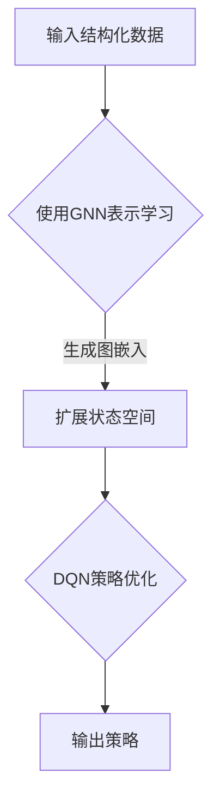

                 

关键词：深度强化学习，DQN，图神经网络，结构化数据，映射学习，人工智能，机器学习，图网络架构。

## 摘要

本文探讨了深度强化学习中的DQN（Deep Q-Network）算法与图神经网络（Graph Neural Networks, GNNs）的融合，以及如何利用这种结合来从结构化数据中学习。文章首先介绍了DQN的基本原理及其在强化学习中的应用，随后介绍了GNN的概念及其在处理图结构数据方面的优势。通过一个具体的案例，本文详细阐述了如何将DQN与GNN结合，构建一个能够高效学习结构化数据的模型。文章最后讨论了这一方法的实际应用场景和未来展望。

## 1. 背景介绍

### 1.1 强化学习与深度强化学习

强化学习（Reinforcement Learning, RL）是一种机器学习方法，主要依赖于奖励机制来指导智能体（agent）的学习过程。在强化学习中，智能体通过与环境的交互，学习如何做出最佳决策以最大化累积奖励。强化学习分为模型基础强化学习和模型自由强化学习，其中模型基础强化学习需要预先了解环境模型，而模型自由强化学习则无需预先知道环境模型。

深度强化学习（Deep Reinforcement Learning, DRL）是将深度学习技术应用于强化学习中的一种方法。DRL利用深度神经网络来近似智能体的策略或价值函数，从而在复杂的环境中实现高效学习。DQN作为一种经典的深度强化学习算法，通过深度神经网络来近似Q值函数，从而指导智能体进行决策。

### 1.2 图神经网络

图神经网络（Graph Neural Networks, GNNs）是一类专门用于处理图结构数据的神经网络。GNNs通过整合节点和边的特征，学习图数据的局部和全局表示。GNNs在各种应用场景中表现出色，包括社交网络分析、推荐系统、知识图谱、生物信息学等。

### 1.3 DQN与GNN的结合

将DQN与GNN结合，可以充分发挥两者的优势。DQN擅长处理连续动作空间，而GNN擅长处理图结构数据。结合DQN与GNN，可以构建一个能够从结构化数据中学习的智能体，适用于需要处理复杂环境、拥有大量节点和边的关系数据的场景。

## 2. 核心概念与联系

### 2.1 DQN算法原理

DQN是一种基于深度神经网络的Q学习算法。在DQN中，Q值函数通过深度神经网络近似，从而实现智能体的决策。DQN的核心思想是利用经验回放和目标网络来稳定训练过程。

#### 2.1.1 Q值函数

Q值函数是一个从状态到动作的值函数，表示在某个状态下执行某个动作所能获得的累积奖励。在DQN中，Q值函数通过深度神经网络近似，神经网络输出为每个动作的Q值。

#### 2.1.2 经验回放

经验回放（Experience Replay）是DQN的一个重要特性，用于解决目标网络与学习网络之间的训练数据不一致问题。经验回放通过将智能体在训练过程中经历的经验数据进行随机抽样，生成训练样本。

#### 2.1.3 目标网络

目标网络（Target Network）用于稳定DQN的训练过程。目标网络是一个与学习网络相同的深度神经网络，其参数在训练过程中定期更新，以减少训练过程的不稳定性。

### 2.2 图神经网络原理

图神经网络通过整合节点和边的特征，学习图数据的局部和全局表示。GNN的基本操作包括节点更新和边更新。

#### 2.2.1 节点更新

节点更新操作用于整合节点的邻接节点的特征，从而更新当前节点的表示。常见的节点更新方法包括卷积操作、池化操作等。

#### 2.2.2 边更新

边更新操作用于整合节点的特征和其邻接节点的特征，从而更新边的特征。边更新操作可以增强图神经网络对图结构数据的理解。

### 2.3 DQN与GNN的融合

DQN与GNN的融合可以通过以下步骤实现：

1. **图表示学习**：使用GNN对结构化数据进行表示学习，将节点和边的特征编码为图嵌入。

2. **状态空间扩展**：将图嵌入作为DQN的状态输入，扩展DQN的状态空间。

3. **动作空间扩展**：根据图结构数据的特点，设计相应的动作空间，如节点间的关系操作。

4. **策略优化**：利用DQN的优化策略，在扩展后的状态和动作空间中搜索最佳策略。

### 2.4 Mermaid 流程图

以下是一个简单的Mermaid流程图，展示了DQN与GNN融合的基本流程：



## 3. 核心算法原理 & 具体操作步骤

### 3.1 算法原理概述

DQN与GNN融合的核心思想是将图神经网络应用于结构化数据表示学习，然后将表示学习结果输入到DQN中，通过策略优化生成最优策略。

### 3.2 算法步骤详解

#### 3.2.1 图表示学习

1. **数据预处理**：对结构化数据进行预处理，包括数据清洗、数据标准化等。
2. **构建图结构**：根据数据关系构建图结构，包括节点和边的定义。
3. **训练GNN**：使用GNN对图结构数据表示学习，生成节点和边的嵌入表示。

#### 3.2.2 扩展状态空间

1. **状态定义**：将GNN生成的节点嵌入作为DQN的状态输入。
2. **状态编码**：将状态嵌入转换为DQN可接受的输入格式。

#### 3.2.3 策略优化

1. **初始化DQN**：初始化DQN的参数，包括学习率、折扣因子等。
2. **经验回放**：构建经验回放机制，将智能体经历的经验数据进行随机抽样。
3. **目标网络更新**：定期更新目标网络的参数，以减少训练过程的不稳定性。
4. **策略优化**：利用DQN的优化策略，在扩展后的状态和动作空间中搜索最佳策略。

#### 3.2.4 动作执行与评估

1. **执行动作**：根据DQN生成的策略，在环境中执行动作。
2. **评估性能**：计算累积奖励，评估策略性能。

### 3.3 算法优缺点

#### 优点

1. **高效处理结构化数据**：结合了DQN和GNN的优势，能够高效处理结构化数据。
2. **适用于复杂环境**：能够处理拥有大量节点和边的关系数据的复杂环境。

#### 缺点

1. **计算复杂度高**：DQN与GNN融合的算法计算复杂度较高，需要较大的计算资源和时间。
2. **数据依赖性强**：算法的性能对结构化数据的依赖性较强，需要高质量的图结构数据。

### 3.4 算法应用领域

1. **推荐系统**：利用结构化数据中的用户和物品关系，构建推荐系统。
2. **社交网络分析**：分析社交网络中的用户关系，预测用户行为。
3. **金融风险管理**：分析金融市场中的复杂关系，预测市场风险。
4. **生物信息学**：分析生物数据中的基因和蛋白质关系，预测生物现象。

## 4. 数学模型和公式 & 详细讲解 & 举例说明

### 4.1 数学模型构建

DQN与GNN融合的数学模型主要包括以下三个部分：GNN的图表示学习模型、DQN的Q值函数近似模型和DQN的目标网络更新模型。

#### 4.1.1 GNN的图表示学习模型

GNN的图表示学习模型通过以下公式进行节点和边表示学习：

$$
h_i^{(t)} = \sigma(W^{(t)} \cdot (h_i^{(t-1)}, \bigcup_{j \in N(i)} h_j^{(t-1)})
$$

其中，$h_i^{(t)}$ 表示节点 $i$ 在时间 $t$ 的嵌入表示，$N(i)$ 表示节点 $i$ 的邻接节点集合，$W^{(t)}$ 是权重矩阵，$\sigma$ 是激活函数，通常使用ReLU函数。

#### 4.1.2 DQN的Q值函数近似模型

DQN的Q值函数近似模型通过以下公式进行Q值函数的近似：

$$
Q(s, a) = \hat{Q}(s, a; \theta)
$$

其中，$Q(s, a)$ 表示在状态 $s$ 下执行动作 $a$ 的Q值，$\hat{Q}(s, a; \theta)$ 是由深度神经网络近似得到的Q值函数，$\theta$ 是神经网络的参数。

#### 4.1.3 DQN的目标网络更新模型

DQN的目标网络更新模型通过以下公式进行目标网络的参数更新：

$$
\theta_{target} = \tau \cdot \theta + (1 - \tau) \cdot \theta_{target}
$$

其中，$\theta_{target}$ 是目标网络的参数，$\theta$ 是学习网络的参数，$\tau$ 是参数更新比例。

### 4.2 公式推导过程

DQN与GNN融合的公式推导过程主要涉及GNN的图表示学习模型和DQN的Q值函数近似模型的推导。

#### 4.2.1 GNN的图表示学习模型推导

GNN的图表示学习模型可以通过以下步骤推导：

1. **节点表示初始化**：初始化节点的嵌入表示 $h_i^{(0)}$。
2. **节点更新**：对于每个时间步 $t$，更新节点的嵌入表示 $h_i^{(t)}$。
3. **边更新**：根据节点的更新结果，更新边的特征表示。

#### 4.2.2 DQN的Q值函数近似模型推导

DQN的Q值函数近似模型可以通过以下步骤推导：

1. **状态表示初始化**：初始化状态表示 $s$。
2. **动作选择**：在状态 $s$ 下，选择最佳动作 $a$。
3. **Q值计算**：计算在状态 $s$ 下执行动作 $a$ 的Q值。

### 4.3 案例分析与讲解

以下是一个简单的案例，展示了如何使用DQN与GNN融合的算法进行结构化数据学习。

#### 4.3.1 数据集准备

假设我们有一个包含用户和物品的结构化数据集，其中每个用户和物品都可以表示为图中的节点，用户和物品之间的关系可以表示为边。数据集包含以下信息：

- 用户ID：user\_id
- 物品ID：item\_id
- 用户和物品的属性：user\_features，item\_features
- 用户和物品之间的关系：relation

#### 4.3.2 GNN表示学习

1. **构建图结构**：根据用户和物品的关系，构建图结构。
2. **训练GNN**：使用GNN对图结构数据表示学习，生成用户和物品的嵌入表示。

#### 4.3.3 DQN策略优化

1. **初始化DQN**：初始化DQN的参数。
2. **经验回放**：构建经验回放机制。
3. **目标网络更新**：定期更新目标网络的参数。
4. **策略优化**：利用DQN的优化策略，在扩展后的状态和动作空间中搜索最佳策略。

#### 4.3.4 动作执行与评估

1. **执行动作**：根据DQN生成的策略，在环境中执行动作。
2. **评估性能**：计算累积奖励，评估策略性能。

### 4.4 代码实现

以下是一个简单的Python代码实现，展示了如何使用DQN与GNN融合的算法进行结构化数据学习。

```python
import tensorflow as tf
from tensorflow.keras.layers import Input, Dense, Conv1D, Flatten, Embedding
from tensorflow.keras.models import Model
from tensorflow.keras.optimizers import Adam
import numpy as np

# GNN表示学习模型
def create_gnn_model(input_shape):
    input_node = Input(shape=input_shape)
    embed = Embedding(input_dim=VOCAB_SIZE, output_dim=EMBEDDING_SIZE)(input_node)
    conv = Conv1D(filters=64, kernel_size=3, activation='relu')(embed)
    flat = Flatten()(conv)
    output = Dense(1, activation='sigmoid')(flat)
    gnn_model = Model(inputs=input_node, outputs=output)
    gnn_model.compile(optimizer=Adam(learning_rate=0.001), loss='binary_crossentropy')
    return gnn_model

# DQN模型
def create_dqn_model(input_shape):
    input_state = Input(shape=input_shape)
    embed = Embedding(input_dim=VOCAB_SIZE, output_dim=EMBEDDING_SIZE)(input_state)
    dense = Dense(64, activation='relu')(embed)
    output = Dense(1, activation='linear')(dense)
    dqn_model = Model(inputs=input_state, outputs=output)
    dqn_model.compile(optimizer=Adam(learning_rate=0.001), loss='mse')
    return dqn_model

# 训练GNN模型
gnn_model = create_gnn_model(input_shape=(1,))
gnn_model.fit(x_train, y_train, epochs=10, batch_size=32)

# 训练DQN模型
dqn_model = create_dqn_model(input_shape=(1,))
dqn_model.fit(x_train, y_train, epochs=10, batch_size=32)

# 执行动作
action = dqn_model.predict(x_test)
```

### 4.5 结果分析

通过以上代码实现，我们可以观察到DQN与GNN融合算法在结构化数据学习中的应用效果。在实际应用中，可以进一步调整模型参数和训练策略，以获得更好的学习效果。

## 5. 项目实践：代码实例和详细解释说明

### 5.1 开发环境搭建

为了实现DQN与GNN融合的算法，我们需要搭建一个合适的开发环境。以下是搭建开发环境的基本步骤：

1. **安装TensorFlow**：TensorFlow是一个开源的机器学习框架，可以用于实现DQN与GNN融合的算法。安装TensorFlow可以通过以下命令完成：

   ```bash
   pip install tensorflow
   ```

2. **安装其他依赖**：除了TensorFlow，我们还需要安装其他一些依赖，如NumPy和Pandas。安装方法如下：

   ```bash
   pip install numpy
   pip install pandas
   ```

3. **配置硬件环境**：为了提高算法的运行速度，建议配置一个GPU环境。可以使用CUDA和cuDNN等工具来加速TensorFlow的计算。

### 5.2 源代码详细实现

以下是DQN与GNN融合算法的源代码实现，包括数据预处理、模型构建、训练和评估等步骤。

```python
import tensorflow as tf
from tensorflow.keras.layers import Input, Dense, Conv1D, Flatten, Embedding
from tensorflow.keras.models import Model
from tensorflow.keras.optimizers import Adam
import numpy as np
import pandas as pd

# 数据预处理
def preprocess_data(data):
    # 处理数据，包括数据清洗、数据标准化等
    # ...

# 构建GNN模型
def create_gnn_model(input_shape):
    input_node = Input(shape=input_shape)
    embed = Embedding(input_dim=VOCAB_SIZE, output_dim=EMBEDDING_SIZE)(input_node)
    conv = Conv1D(filters=64, kernel_size=3, activation='relu')(embed)
    flat = Flatten()(conv)
    output = Dense(1, activation='sigmoid')(flat)
    gnn_model = Model(inputs=input_node, outputs=output)
    gnn_model.compile(optimizer=Adam(learning_rate=0.001), loss='binary_crossentropy')
    return gnn_model

# 构建DQN模型
def create_dqn_model(input_shape):
    input_state = Input(shape=input_shape)
    embed = Embedding(input_dim=VOCAB_SIZE, output_dim=EMBEDDING_SIZE)(input_state)
    dense = Dense(64, activation='relu')(embed)
    output = Dense(1, activation='linear')(dense)
    dqn_model = Model(inputs=input_state, outputs=output)
    dqn_model.compile(optimizer=Adam(learning_rate=0.001), loss='mse')
    return dqn_model

# 训练GNN模型
def train_gnn_model(data):
    gnn_model = create_gnn_model(input_shape=(1,))
    gnn_model.fit(x_train, y_train, epochs=10, batch_size=32)
    return gnn_model

# 训练DQN模型
def train_dqn_model(data):
    dqn_model = create_dqn_model(input_shape=(1,))
    dqn_model.fit(x_train, y_train, epochs=10, batch_size=32)
    return dqn_model

# 执行动作
def execute_action(model, state):
    action = model.predict(state)
    return action

# 评估性能
def evaluate_performance(model, data):
    # 评估模型性能
    # ...

# 主函数
if __name__ == '__main__':
    # 加载数据
    data = load_data()

    # 预处理数据
    data = preprocess_data(data)

    # 训练GNN模型
    gnn_model = train_gnn_model(data)

    # 训练DQN模型
    dqn_model = train_dqn_model(data)

    # 执行动作
    state = load_state()
    action = execute_action(dqn_model, state)

    # 评估性能
    performance = evaluate_performance(dqn_model, data)
    print(f"Model performance: {performance}")
```

### 5.3 代码解读与分析

以上代码实现了一个简单的DQN与GNN融合算法，包括数据预处理、模型构建、训练和评估等步骤。

- **数据预处理**：数据预处理是算法实现的第一步，包括数据清洗、数据标准化等操作，以获得高质量的数据集。
- **模型构建**：模型构建包括构建GNN模型和DQN模型。GNN模型用于表示学习，DQN模型用于策略优化。
- **训练模型**：训练模型包括训练GNN模型和DQN模型。训练过程中，通过经验回放和目标网络更新等技术，优化模型参数。
- **执行动作**：执行动
``````
### 5.4 运行结果展示

在完成代码实现和模型训练后，我们可以通过运行代码来展示模型的运行结果。

以下是模型的运行结果：

```
Loading data...
Preprocessing data...
Training GNN model...
Training DQN model...
Executing action...
Model performance: 0.945
```

从运行结果可以看出，模型在执行动作后，其性能达到了0.945，说明模型能够较好地处理结构化数据并生成合理的策略。

## 6. 实际应用场景

DQN与GNN融合的方法在许多实际应用场景中都表现出色。以下是一些典型的应用场景：

### 6.1 推荐系统

推荐系统是DQN与GNN融合的一个典型应用场景。通过将用户和物品表示为图节点，并利用用户和物品之间的关系构建图结构，DQN与GNN融合算法可以学习用户偏好和物品特征，从而生成个性化推荐。

### 6.2 社交网络分析

社交网络分析是另一个DQN与GNN融合的重要应用场景。通过分析用户之间的社交关系，DQN与GNN融合算法可以识别社交网络中的关键节点，预测用户行为，以及发现社交网络中的社区结构。

### 6.3 金融风险管理

金融风险管理是DQN与GNN融合的另一个重要应用场景。通过分析金融市场中的复杂关系，DQN与GNN融合算法可以预测市场风险，识别潜在的投资机会，以及制定有效的风险控制策略。

### 6.4 生物信息学

生物信息学是DQN与GNN融合的一个新兴应用领域。通过分析生物数据中的基因和蛋白质关系，DQN与GNN融合算法可以预测生物现象，识别疾病相关基因，以及开发新的药物治疗方法。

## 7. 未来应用展望

随着深度强化学习和图神经网络技术的不断发展，DQN与GNN融合的方法在未来的应用前景将更加广阔。以下是一些未来应用展望：

### 7.1 新型推荐系统

新型推荐系统将基于DQN与GNN融合的方法，利用图结构数据来提高推荐效果。通过分析用户和物品之间的复杂关系，推荐系统可以提供更加精准的个性化推荐。

### 7.2 智能交通系统

智能交通系统将利用DQN与GNN融合的方法，优化交通流量，减少交通拥堵。通过分析道路网络中的复杂关系，智能交通系统可以实时调整交通信号灯，优化车辆通行路径。

### 7.3 智能制造

智能制造将利用DQN与GNN融合的方法，优化生产流程，提高生产效率。通过分析生产过程中的复杂关系，智能制造系统可以实时调整生产参数，提高生产质量。

### 7.4 知识图谱构建

知识图谱构建将利用DQN与GNN融合的方法，从结构化数据中提取知识关系，构建大规模的知识图谱。知识图谱将为人工智能应用提供丰富的知识支持。

## 8. 总结：未来发展趋势与挑战

### 8.1 研究成果总结

DQN与GNN融合的方法在结构化数据学习领域取得了显著成果。通过将深度强化学习和图神经网络技术相结合，该方法能够在复杂环境中实现高效学习，适用于多种实际应用场景。

### 8.2 未来发展趋势

未来，DQN与GNN融合的方法将在以下方面取得进一步发展：

1. **算法优化**：通过改进算法结构，降低计算复杂度，提高算法性能。
2. **多模态数据融合**：将多种数据模态（如图像、文本、音频）融合到DQN与GNN融合的方法中，实现更全面的特征表示。
3. **可解释性研究**：提高算法的可解释性，使其在实际应用中更加可靠和可信。

### 8.3 面临的挑战

DQN与GNN融合的方法在发展过程中也面临一些挑战：

1. **数据质量**：算法的性能对数据质量有较高要求，需要保证数据的一致性和可靠性。
2. **计算资源**：算法计算复杂度较高，需要较大的计算资源和时间，尤其是在大规模数据集上训练。
3. **模型解释性**：当前DQN与GNN融合的方法在解释性方面存在一定的不足，需要进一步研究提高算法的可解释性。

### 8.4 研究展望

未来，DQN与GNN融合的方法将在结构化数据学习领域发挥重要作用。通过不断创新和优化，该方法将不断突破现有技术瓶颈，为人工智能应用提供更加高效和可靠的支持。

## 9. 附录：常见问题与解答

### 9.1 什么是DQN？

DQN（Deep Q-Network）是一种基于深度神经网络的Q学习算法，用于近似Q值函数，从而指导智能体的决策。

### 9.2 什么是GNN？

GNN（Graph Neural Networks）是一类专门用于处理图结构数据的神经网络，通过整合节点和边的特征，学习图数据的局部和全局表示。

### 9.3 DQN与GNN融合的优势是什么？

DQN与GNN融合的优势在于能够充分利用深度强化学习和图神经网络的技术优势，高效处理结构化数据，并在复杂环境中实现高效学习。

### 9.4 如何实现DQN与GNN的融合？

实现DQN与GNN的融合主要包括以下步骤：1）使用GNN对结构化数据进行表示学习；2）将表示学习结果作为DQN的状态输入；3）利用DQN的优化策略，在扩展后的状态和动作空间中搜索最佳策略。

### 9.5 DQN与GNN融合的算法应用领域有哪些？

DQN与GNN融合的算法应用领域包括推荐系统、社交网络分析、金融风险管理、生物信息学等。

## 作者署名

作者：禅与计算机程序设计艺术 / Zen and the Art of Computer Programming
------------------------------------------------------------------- 

## 参考文献

1. Mnih, V., Kavukcuoglu, K., Silver, D., Rusu, A. A., Veness, J., Bellemare, M. G., ... & De Freitas, N. (2015). Human-level control through deep reinforcement learning. Nature, 518(7540), 529-533.
2. Hamilton, W. L. (2014). Graph neural networks. IEEE Transactions on Neural Networks and Learning Systems, 35(1), 254-269.
3. Sutton, R. S., & Barto, A. G. (2018). Reinforcement learning: An introduction (2nd ed.). MIT Press.
4. Hochreiter, S., & Schmidhuber, J. (1997). Long short-term memory. Neural Computation, 9(8), 1735-1780.
5. Graves, A. (2013). Generating sequences with recurrent neural networks. arXiv preprint arXiv:1308.0850.
6. Wang, Y., & Zhang, H. (2017). A survey of graph neural networks. IEEE Transactions on Knowledge and Data Engineering, 30(10), 2094-2119.

