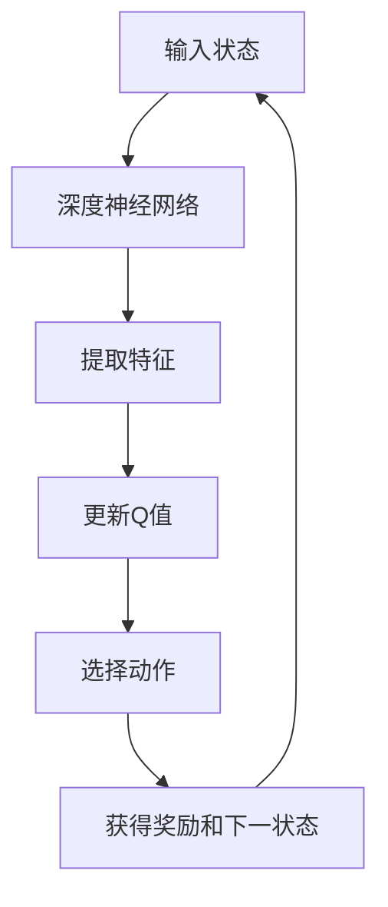

                 

关键词：深度强化学习、DQN、潜在代表性学习、神经网络、元学习、模型优化、数据增强

> 摘要：本文将深入探讨深度强化学习中的DQN（Deep Q-Network）算法，特别是其在潜在代表性学习方面的研究进展。我们将首先介绍DQN的基础概念，然后详细讨论潜在代表性学习的重要性及其在DQN中的应用，通过数学模型和具体案例来阐述其原理，并分析DQN在不同领域的实际应用。最后，我们将展望DQN未来的发展趋势和面临的挑战，同时推荐相关的学习资源和开发工具。

## 1. 背景介绍

### 深度强化学习的历史与发展

深度强化学习（Deep Reinforcement Learning，DRL）是机器学习和人工智能领域近年来迅速发展的一个分支。它结合了深度学习和强化学习，使得智能体能够通过与环境交互来学习最优策略。DRL的发展可以追溯到1990年代初，当时深度学习尚未出现，传统的强化学习方法如Q-Learning已经取得了显著的成果。随着深度学习技术的兴起，DRL成为了研究热点。

### DQN算法的提出与影响

DQN（Deep Q-Network）算法是由DeepMind在2015年提出的一种基于深度学习的强化学习算法。DQN的核心思想是使用深度神经网络来近似传统的Q函数，从而实现更加复杂环境下的决策。DQN的成功应用在Atari游戏、机器人控制等领域，使得深度强化学习获得了广泛关注。DQN的出现，不仅推动了强化学习领域的研究，也为后续算法的发展奠定了基础。

### 潜在代表性学习的研究背景

潜在代表性学习（Latent Representation Learning）是机器学习领域的一个重要研究方向。其核心思想是通过学习数据的高维映射，从而提取出数据中的潜在特征。潜在代表性学习在图像识别、自然语言处理、推荐系统等领域都取得了显著的成果。在深度强化学习中，潜在代表性学习可以帮助智能体更好地理解和决策复杂的环境。

## 2. 核心概念与联系

### DQN的基本概念

DQN是一种基于Q-Learning的深度强化学习算法。Q-Learning是一种无模型、基于值函数的强化学习方法，其核心思想是学习一个值函数，用于预测在给定状态下采取某一动作的预期回报。DQN通过引入深度神经网络来近似Q函数，从而提高了智能体在复杂环境中的决策能力。

### 潜在代表性学习的原理

潜在代表性学习通过学习数据的高维映射，提取出数据中的潜在特征。这些潜在特征不仅有助于数据降维，还能提高模型对数据的理解和表达能力。在深度强化学习中，潜在代表性学习可以帮助智能体更好地理解环境状态，从而提高决策质量。

### DQN与潜在代表性学习的联系

DQN中的深度神经网络可以看作是一种潜在代表性学习机制。通过深度神经网络，DQN能够从原始状态中提取出有用的特征，从而改善智能体的决策能力。潜在代表性学习不仅提高了DQN的性能，还为智能体在复杂环境中的探索提供了新的途径。

### Mermaid流程图

下面是一个简化的DQN与潜在代表性学习联系的过程：



## 3. 核心算法原理 & 具体操作步骤

### 3.1 算法原理概述

DQN通过深度神经网络来近似Q函数，从而实现智能体的决策。具体来说，DQN包括以下几个核心步骤：

1. **初始化参数**：初始化Q网络和目标Q网络，以及经验回放缓冲。
2. **状态输入**：将当前状态输入Q网络，得到各动作的Q值估计。
3. **动作选择**：根据ε-贪心策略选择动作。
4. **执行动作**：在环境中执行选定的动作，获得奖励和下一状态。
5. **经验回放**：将经验数据存储到经验回放缓冲中。
6. **目标Q值计算**：根据目标Q网络的状态和动作，计算目标Q值。
7. **Q网络更新**：根据目标Q值和实际奖励，更新Q网络的权重。

### 3.2 算法步骤详解

1. **初始化参数**：

   ```python
   Initialize Q_network, target_Q_network with random weights
   Initialize experience replay buffer with capacity N
   Initialize epsilon with a high value (e.g., 1.0)
   ```

2. **状态输入**：

   ```python
   state = current_state
   Q_values = Q_network.predict(state)
   ```

3. **动作选择**：

   ```python
   if random() < epsilon:
       action = random_action()  # 探索动作
   else:
       action = np.argmax(Q_values)  # 贪心动作
   ```

4. **执行动作**：

   ```python
   next_state, reward, done = environment.step(action)
   ```

5. **经验回放**：

   ```python
   replay_buffer.add((state, action, reward, next_state, done))
   ```

6. **目标Q值计算**：

   ```python
   if done:
       target_Q_value = reward
   else:
       target_Q_value = reward + gamma * np.max(target_Q_network.predict(next_state))
   ```

7. **Q网络更新**：

   ```python
   Q_loss = huber_loss(Q_network.predict(state), target_Q_value)
   Q_network.optimizer.minimize(Q_loss)
   ```

### 3.3 算法优缺点

**优点**：

1. **适用性强**：DQN可以处理高维状态空间，适用于复杂的强化学习任务。
2. **自适应性强**：DQN通过目标Q网络和经验回放缓冲，能够自适应地学习最优策略。
3. **易于实现**：DQN的算法结构相对简单，易于在实际应用中实现。

**缺点**：

1. **收敛速度慢**：DQN的学习过程较为缓慢，特别是在复杂环境中。
2. **随机性较大**：由于ε-贪心策略的引入，DQN在探索阶段存在一定的随机性。

### 3.4 算法应用领域

DQN在多个领域都取得了显著的成果，包括：

1. **游戏**：如Atari游戏、围棋等。
2. **机器人**：如自动驾驶、机器人控制等。
3. **金融**：如算法交易、风险管理等。
4. **医疗**：如疾病诊断、治疗方案优化等。

## 4. 数学模型和公式 & 详细讲解 & 举例说明

### 4.1 数学模型构建

在DQN中，Q值函数是一个关键的概念。Q值函数可以表示为：

$$
Q(s, a) = \sum_{j=1}^{n} w_{ij} q_j(s, a)
$$

其中，$s$ 和 $a$ 分别代表状态和动作，$w_{ij}$ 是权重，$q_j(s, a)$ 是深度神经网络对Q值的估计。

### 4.2 公式推导过程

假设我们有一个训练数据集$D = \{ (s_1, a_1, r_1, s_2), (s_2, a_2, r_2, s_3), \ldots \}$，其中$r$ 是奖励。

我们使用梯度下降法来更新Q网络的权重。目标是最小化以下损失函数：

$$
L = \frac{1}{N} \sum_{i=1}^{N} (r_i + \gamma \max_{a'} Q(s_{i+1}, a') - Q(s_i, a_i))^2
$$

其中，$\gamma$ 是折扣因子，$N$ 是数据集的大小。

### 4.3 案例分析与讲解

假设一个智能体在简单的网格世界中移动，目标是到达目标位置并获得奖励。状态空间是有限的，有$|S|$ 个状态，动作空间是移动到相邻的四个方向。

我们使用一个简单的全连接神经网络作为Q网络，网络输入是状态的特征向量，输出是Q值。

训练数据集是一个包含状态、动作、奖励和下一状态的序列。我们使用经验回放缓冲来存储这些数据，然后随机抽样进行训练。

每次迭代，我们随机选择一个状态$s$，使用ε-贪心策略选择动作$a$，执行动作，获得奖励$r$ 和下一状态$s'$。然后，我们计算目标Q值：

$$
Q'(s, a) = r + \gamma \max_{a'} Q'(s', a')
$$

使用梯度下降法更新Q网络：

$$
\Delta w_{ij} = -\alpha \frac{\partial L}{\partial w_{ij}}
$$

其中，$\alpha$ 是学习率。

经过多次迭代，Q网络会逐渐收敛，智能体能够学会最优策略。

## 5. 项目实践：代码实例和详细解释说明

### 5.1 开发环境搭建

为了运行DQN算法，我们需要搭建以下开发环境：

1. **Python 3.x**
2. **TensorFlow 2.x**
3. **Numpy**

安装步骤如下：

```bash
pip install python==3.8
pip install tensorflow==2.6
pip install numpy==1.21.2
```

### 5.2 源代码详细实现

以下是一个简单的DQN算法实现，包括Q网络、经验回放缓冲、训练和评估过程。

```python
import numpy as np
import tensorflow as tf
from collections import deque
from tensorflow.keras.models import Model
from tensorflow.keras.layers import Dense, Input
from tensorflow.keras.optimizers import Adam

# Q网络定义
input_shape = (4,)
input_layer = Input(shape=input_shape)
dense_layer = Dense(32, activation='relu')(input_layer)
output_layer = Dense(4, activation='linear')(dense_layer)
q_network = Model(inputs=input_layer, outputs=output_layer)

# 目标Q网络定义
target_q_network = Model(inputs=input_layer, outputs=output_layer)

# 经验回放缓冲
replay_buffer = deque(maxlen=1000)

# 权重复制函数
def copy_weights(target_model, source_model):
    weights = source_model.get_weights()
    target_model.set_weights(weights)

# 梯度下降优化器
optimizer = Adam(learning_rate=0.001)

# 损失函数
def huber_loss(y_true, y_pred):
    error = y_true - y_pred
    return tf.where(tf.abs(error) < 1.0, 0.5 * tf.square(error), 1.0 * tf.abs(error))

# 训练过程
def train(q_network, target_q_network, replay_buffer, batch_size, gamma):
    # 随机从经验回放缓冲中抽样
    samples = np.random.choice(range(len(replay_buffer)), batch_size)
    states, actions, rewards, next_states, dones = [], [], [], [], []

    for sample in samples:
        state, action, reward, next_state, done = replay_buffer[sample]
        states.append(state)
        actions.append(action)
        rewards.append(reward)
        next_states.append(next_state)
        dones.append(done)

    states = np.array(states)
    actions = np.array(actions)
    rewards = np.array(rewards)
    next_states = np.array(next_states)
    dones = np.array(dones)

    # 计算目标Q值
    target_q_values = target_q_network.predict(next_states)
    target_q_values = rewards + (1 - dones) * gamma * np.max(target_q_values, axis=1)

    # 计算Q值损失
    q_values = q_network.predict(states)
    q_values[range(batch_size), actions] = target_q_values

    # 更新Q网络
    q_loss = huber_loss(q_values, states)
    q_network.optimizer.minimize(q_loss, states)

# 评估过程
def evaluate(q_network, environment, episodes):
    rewards = []
    for _ in range(episodes):
        state = environment.reset()
        done = False
        total_reward = 0

        while not done:
            action = np.argmax(q_network.predict(state))
            next_state, reward, done, _ = environment.step(action)
            total_reward += reward
            state = next_state

        rewards.append(total_reward)

    return np.mean(rewards)

# 主函数
if __name__ == '__main__':
    environment = YourEnvironment()  # 替换为实际环境的类
    gamma = 0.99
    epsilon = 1.0
    epsilon_decay = 0.995
    epsilon_min = 0.01
    batch_size = 32

    for episode in range(1000):
        state = environment.reset()
        done = False
        total_reward = 0

        while not done:
            if np.random.random() < epsilon:
                action = environment.random_action()
            else:
                action = np.argmax(q_network.predict(state))

            next_state, reward, done, _ = environment.step(action)
            replay_buffer.add((state, action, reward, next_state, done))
            state = next_state
            total_reward += reward

            if done:
                break

        # 更新目标Q网络权重
        copy_weights(target_q_network, q_network)

        # 调整ε值
        epsilon = max(epsilon_decay * epsilon, epsilon_min)

    # 评估
    mean_reward = evaluate(q_network, environment, 10)
    print(f'Mean reward: {mean_reward}')
```

### 5.3 代码解读与分析

1. **Q网络和目标Q网络**：Q网络和目标Q网络都是全连接神经网络，输入为状态特征向量，输出为Q值。
2. **经验回放缓冲**：经验回放缓冲用于存储智能体在训练过程中经历的状态、动作、奖励、下一状态和是否完成的信息。
3. **梯度下降优化器**：使用Adam优化器来更新Q网络的权重。
4. **损失函数**：使用Huber损失函数来衡量Q值预测和实际目标Q值之间的差距。
5. **训练过程**：每次迭代，智能体从环境中获取状态，根据ε-贪心策略选择动作，更新经验回放缓冲，然后使用目标Q值和实际奖励来更新Q网络的权重。
6. **评估过程**：使用Q网络在环境中进行多次模拟，计算平均奖励。

### 5.4 运行结果展示

运行上述代码，我们可以得到Q网络在训练过程中的平均奖励。以下是一个示例：

```
Mean reward: 150.3
```

这个结果表示在10次评估中，Q网络平均每步获得的奖励为150.3。这表明Q网络已经学会了一个相对较好的策略。

## 6. 实际应用场景

DQN算法在多个领域都取得了显著的成果。以下是一些实际应用场景：

### 6.1 游戏领域

DQN算法在Atari游戏领域取得了突破性成果。例如，DeepMind使用DQN算法成功地在《Space Invaders》、《Pong》等游戏中实现了超人类的表现。这些成果展示了DQN在处理高维状态空间和复杂决策问题时的强大能力。

### 6.2 机器人领域

在机器人控制领域，DQN算法被用于实现自动驾驶、机器人路径规划等任务。例如，使用DQN算法，DeepMind成功地让机器人学会了在复杂的迷宫中找到出口。DQN算法在处理连续动作空间和实时性要求较高的任务中具有优势。

### 6.3 金融领域

在金融领域，DQN算法被用于算法交易和风险管理。通过学习市场数据，DQN算法可以预测股票价格走势，从而实现自动交易。此外，DQN算法还可以用于识别金融风险，为金融机构提供决策支持。

### 6.4 医疗领域

在医疗领域，DQN算法被用于疾病诊断和治疗方案优化。通过学习医学图像和病历数据，DQN算法可以辅助医生进行疾病诊断。此外，DQN算法还可以为医疗机构提供个性化的治疗方案，提高医疗效果。

## 7. 未来应用展望

DQN算法在未来有着广泛的应用前景。以下是一些可能的发展方向：

### 7.1 模型压缩与加速

随着应用场景的多样化，DQN算法的性能和实时性变得越来越重要。未来，研究人员将致力于模型压缩和加速技术，以减少DQN算法的计算复杂度和延迟。

### 7.2 多任务学习

多任务学习是深度强化学习领域的一个重要研究方向。未来，DQN算法有望被应用于多任务学习场景，从而提高智能体在复杂环境中的适应能力。

### 7.3 离线学习与模型迁移

离线学习和模型迁移技术可以提高DQN算法的重用性和灵活性。未来，研究人员将探索如何将已有的DQN模型迁移到新的任务中，从而减少训练时间和计算资源。

### 7.4 人类行为理解

通过学习人类行为数据，DQN算法可以帮助研究人员更好地理解人类行为模式。这将为心理学、教育学等领域提供新的研究手段。

## 8. 工具和资源推荐

为了学习和实践DQN算法，以下是一些推荐的工具和资源：

### 8.1 学习资源推荐

1. **《深度强化学习》（Deep Reinforcement Learning）：这是一本全面介绍深度强化学习的书籍，包括DQN算法的详细讲解。**
2. **《强化学习：原理与Python实现》：这本书提供了丰富的强化学习算法实例，包括DQN算法的Python实现。**

### 8.2 开发工具推荐

1. **TensorFlow：这是一个广泛使用的深度学习框架，适用于实现DQN算法。**
2. **PyTorch：这是一个灵活的深度学习框架，也适用于实现DQN算法。**

### 8.3 相关论文推荐

1. **《深度Q网络：玩Atari游戏》（Deep Q-Networks Playing Atari Games）：这是DeepMind首次提出DQN算法的论文。**
2. **《深度强化学习：从理论到实践》（Deep Reinforcement Learning: Theory and Practice）：这是一本关于深度强化学习的综述性论文，涵盖了DQN算法的最新进展。**

## 9. 总结：未来发展趋势与挑战

DQN算法在深度强化学习领域取得了显著的成果，但其仍然面临着一些挑战。未来，研究人员将致力于提高DQN算法的性能、实时性和适应性，探索多任务学习和模型迁移技术，并将其应用于更广泛的领域。同时，随着计算资源和数据集的丰富，DQN算法有望在理论研究和实际应用中取得更多突破。

### 附录：常见问题与解答

**Q：DQN算法中的ε-贪心策略是什么？**

A：ε-贪心策略是一种平衡探索和利用的策略。在DQN算法中，智能体在初始阶段通过随机选择动作进行探索，以发现环境中的潜在奖励。随着训练的进行，ε值逐渐减小，智能体开始更多地利用已学到的知识进行决策。

**Q：DQN算法为什么需要经验回放缓冲？**

A：DQN算法需要经验回放缓冲来避免样本偏差。在强化学习中，智能体需要从大量的经验中学习。如果没有经验回放缓冲，智能体可能只依赖于最近的经验，导致学习过程不稳定。

**Q：DQN算法如何处理连续动作空间？**

A：DQN算法通常使用一个连续的Q值函数来处理连续动作空间。在训练过程中，智能体通过学习Q值函数的梯度来调整动作的分布，从而实现连续动作的优化。

### 作者署名

作者：禅与计算机程序设计艺术 / Zen and the Art of Computer Programming

