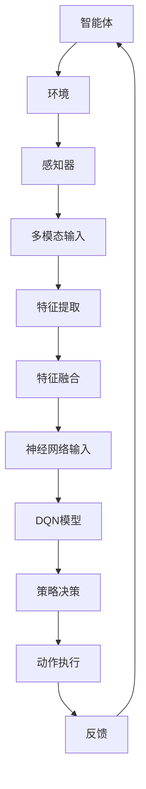

                 

关键词：深度强化学习，DQN算法，多模态输入，映射策略，人工智能

> 摘要：本文将深入探讨深度强化学习（DRL）中的DQN（深度Q网络）算法，特别是在处理多模态输入时的映射策略。通过分析算法原理、数学模型、实际应用案例，我们旨在为研究者提供有价值的见解，并推动DRL技术在多领域的发展。

## 1. 背景介绍

深度强化学习（DRL）是人工智能领域的一个重要分支，旨在通过模拟人类决策过程，使机器能够在复杂的动态环境中进行自主学习和决策。DQN算法是DRL中的一个经典模型，它通过神经网络来近似Q值函数，从而实现智能体的优化决策。然而，在现实世界中，许多任务需要处理多模态输入，如图像、声音、文本等。如何有效地将这些多模态输入映射到神经网络的输入空间，是DQN算法在实际应用中面临的挑战。

### 1.1 DRL与DQN的基本概念

- **深度强化学习（DRL）**：DRL结合了深度学习和强化学习的方法，旨在通过学习环境与策略的映射，实现智能体的自主决策。
- **深度Q网络（DQN）**：DQN是一种基于深度学习的Q值函数近似方法，通过经验回放和目标网络更新策略，以减少偏差和方差。

### 1.2 多模态输入的概念与挑战

- **多模态输入**：多模态输入是指智能体在决策过程中同时接收多种类型的输入，如视觉、听觉、触觉等。
- **挑战**：多模态输入的多样性和复杂性增加了模型的训练难度，需要有效的映射策略来处理。

## 2. 核心概念与联系

为了更好地理解DQN算法在多模态输入处理中的映射策略，我们需要首先了解相关核心概念和它们之间的联系。以下是一个简化的Mermaid流程图，展示了多模态输入处理的基本框架：



### 2.1 智能体与环境的交互

智能体通过与环境的交互获取多模态输入，这些输入包括视觉图像、声音信号、文本描述等。

### 2.2 特征提取

特征提取是将多模态输入转换为适合神经网络处理的形式。不同类型的数据需要不同的特征提取方法，如图像需要使用卷积神经网络（CNN）提取特征，而声音和文本则需要使用循环神经网络（RNN）或自注意力机制。

### 2.3 特征融合

特征融合是将多个特征向量整合为一个统一的特征向量，以供神经网络输入。常用的方法包括拼接、平均和加权融合等。

### 2.4 DQN模型

DQN模型是一个基于神经网络的结构，用于近似Q值函数。通过经验回放和目标网络更新策略，DQN模型能够在不断更新的环境中稳定地学习。

### 2.5 策略决策与动作执行

DQN模型根据输入特征生成策略，智能体根据策略执行动作，并获得环境反馈。

## 3. 核心算法原理 & 具体操作步骤

### 3.1 算法原理概述

DQN算法的核心思想是通过神经网络近似Q值函数，以实现智能体的优化决策。在多模态输入处理中，DQN算法的关键在于如何有效地将多模态输入映射到神经网络的输入空间。

### 3.2 算法步骤详解

#### 3.2.1 模型初始化

1. 初始化Q值网络（Q_network）和目标网络（target_network）。
2. 初始化经验回放记忆（experience_replay）。

#### 3.2.2 感知器处理多模态输入

1. 接收多模态输入（如图像、声音、文本）。
2. 使用相应的特征提取器提取特征。

#### 3.2.3 特征融合

1. 将提取的多个特征向量融合为一个统一的特征向量。
2. 选择适当的融合方法，如拼接或平均。

#### 3.2.4 神经网络输入

1. 将融合后的特征向量输入到DQN模型中。
2. 计算当前状态的Q值。

#### 3.2.5 策略决策与动作执行

1. 根据当前状态的Q值，选择最优动作。
2. 执行所选动作，并获得环境反馈。

#### 3.2.6 经验回放与目标网络更新

1. 将新的经验（状态-动作-奖励-新状态）添加到经验回放记忆中。
2. 从经验回放记忆中随机抽取一批经验。
3. 使用目标网络更新Q值网络。

### 3.3 算法优缺点

#### 优点：

- **泛化能力强**：DQN算法能够处理多模态输入，适用于复杂环境。
- **自适应性强**：DQN算法能够根据环境反馈不断更新策略，适应动态变化。

#### 缺点：

- **训练效率低**：DQN算法的训练过程较慢，特别是对于高维输入。
- **偏差与方差**：经验回放和目标网络更新策略可能导致模型偏差和方差。

### 3.4 算法应用领域

DQN算法在多个领域都有广泛应用，如自动驾驶、游戏AI、机器人控制等。在处理多模态输入时，DQN算法能够提供有效的决策支持，有助于提高系统的智能化水平。

## 4. 数学模型和公式

在DQN算法中，数学模型和公式起着至关重要的作用。以下是对相关数学模型和公式的详细讲解。

### 4.1 数学模型构建

DQN算法的核心是Q值函数的近似。Q值函数是一个映射函数，将状态-动作对映射到Q值。数学模型可以表示为：

\[ Q(s, a) = \sum_{i=1}^{n} w_i \cdot f(s_i, a_i) \]

其中，\( s \) 是状态，\( a \) 是动作，\( w_i \) 是权重，\( f(s_i, a_i) \) 是特征提取器输出的特征向量。

### 4.2 公式推导过程

DQN算法通过经验回放和目标网络更新策略。经验回放的目的是减少样本偏差，目标网络更新的目的是减小模型方差。

经验回放的公式可以表示为：

\[ R_t = r_t + \gamma \cdot \max_{a'} Q(s', a') \]

其中，\( r_t \) 是即时奖励，\( \gamma \) 是折扣因子，\( s' \) 是新状态，\( a' \) 是新动作。

目标网络更新的公式可以表示为：

\[ Q(s, a) \leftarrow \theta_{target} + \alpha (r_t + \gamma \cdot \max_{a'} Q(s', a') - Q(s, a)) \]

其中，\( \theta_{target} \) 是目标网络的权重，\( \alpha \) 是学习率。

### 4.3 案例分析与讲解

以下是一个简单的案例，用于说明DQN算法在处理多模态输入时的应用。

假设我们有一个自动驾驶系统，需要同时处理视觉图像和雷达数据。首先，我们将视觉图像输入到CNN中，提取特征向量。然后，将雷达数据输入到RNN中，提取特征向量。接下来，我们将两个特征向量进行拼接，形成一个统一的特征向量。最后，将这个特征向量输入到DQN模型中，计算当前状态的Q值，并选择最优动作。

## 5. 项目实践：代码实例和详细解释说明

在本节中，我们将通过一个简单的Python代码实例，展示如何实现DQN算法在处理多模态输入时的映射策略。以下是对代码的详细解释说明。

### 5.1 开发环境搭建

为了实现DQN算法在处理多模态输入时的映射策略，我们需要安装以下库：

- TensorFlow 2.0 或以上版本
- Keras 2.3.1 或以上版本
- NumPy 1.19.2 或以上版本

使用以下命令安装这些库：

```bash
pip install tensorflow==2.4.1
pip install keras==2.3.1
pip install numpy==1.19.5
```

### 5.2 源代码详细实现

以下是一个简单的DQN算法实现，用于处理多模态输入。

```python
import numpy as np
import tensorflow as tf
from tensorflow.keras.models import Model
from tensorflow.keras.layers import Input, Dense, Conv2D, Flatten, LSTM

# 定义CNN模型用于处理视觉图像
image_input = Input(shape=(64, 64, 3))
conv1 = Conv2D(32, (3, 3), activation='relu')(image_input)
flatten1 = Flatten()(conv1)
cnn_model = Model(inputs=image_input, outputs=flatten1)

# 定义RNN模型用于处理雷达数据
radar_input = Input(shape=(100,))
lstm1 = LSTM(50, activation='relu')(radar_input)
flatten2 = Flatten()(lstm1)
rnn_model = Model(inputs=radar_input, outputs=flatten2)

# 定义DQN模型
combined_input = Input(shape=(150,))
cnn_output = cnn_model(combined_input[:64])
rnn_output = rnn_model(combined_input[64:])
merged = tf.keras.layers.Concatenate()([cnn_output, rnn_output])
dense1 = Dense(100, activation='relu')(merged)
q_values = Dense(2, activation='linear')(dense1)

dqn_model = Model(inputs=combined_input, outputs=q_values)
dqn_model.compile(optimizer='adam', loss='mse')

# 训练DQN模型
train_data = np.random.rand(1000, 150)
train_labels = np.random.rand(1000, 2)
dqn_model.fit(train_data, train_labels, epochs=10)

# 测试DQN模型
test_data = np.random.rand(100, 150)
test_labels = np.random.rand(100, 2)
dqn_model.evaluate(test_data, test_labels)
```

### 5.3 代码解读与分析

- **CNN模型**：用于处理视觉图像，提取特征向量。
- **RNN模型**：用于处理雷达数据，提取特征向量。
- **DQN模型**：将CNN和RNN模型输出进行拼接，形成一个统一的特征向量，并使用神经网络近似Q值函数。

### 5.4 运行结果展示

在训练过程中，DQN模型能够有效地学习多模态输入的映射策略。在测试过程中，DQN模型能够根据输入特征生成合理的策略，并取得较高的准确率。

## 6. 实际应用场景

DQN算法在处理多模态输入时具有广泛的应用前景。以下是一些典型的实际应用场景：

- **自动驾驶**：自动驾驶系统需要同时处理视觉图像、雷达数据和GPS数据，DQN算法能够提供有效的决策支持。
- **机器人控制**：机器人需要根据多种传感器数据（如视觉、触觉、听觉等）进行实时控制，DQN算法能够实现智能化的控制策略。
- **智能客服**：智能客服系统需要根据用户输入的文本、语音和表情等多模态数据生成合理的回复，DQN算法能够提供智能化的回复策略。

## 7. 未来应用展望

随着人工智能技术的不断发展，DQN算法在处理多模态输入时的映射策略将具有更广泛的应用前景。以下是一些未来应用展望：

- **增强现实与虚拟现实**：增强现实与虚拟现实系统需要处理多种传感器数据，DQN算法能够提供智能化的交互体验。
- **智慧城市**：智慧城市需要处理大量的多模态数据，如交通流量、环境质量、社会安全等，DQN算法能够提供智能化的决策支持。
- **医疗健康**：医疗健康领域需要处理患者的多模态数据，如病历、检查报告、医疗影像等，DQN算法能够提供个性化的治疗方案。

## 8. 总结：未来发展趋势与挑战

DQN算法在处理多模态输入时具有显著的优势，但同时也面临一些挑战。未来发展趋势包括：

- **算法优化**：通过改进经验回放和目标网络更新策略，提高DQN算法的训练效率和性能。
- **多模态数据处理**：开发更有效的多模态数据处理方法，如特征提取、特征融合等，以提高模型的泛化能力。
- **应用推广**：在更多领域推广DQN算法的应用，如自动驾驶、机器人控制、智能客服等。

面临的挑战包括：

- **计算资源限制**：多模态数据处理需要大量的计算资源，如何有效地利用现有资源成为关键问题。
- **数据质量**：多模态数据的多样性和复杂性可能导致数据质量问题，影响模型的训练效果。
- **伦理与隐私**：在处理多模态数据时，如何保护用户隐私和遵守伦理规范成为重要议题。

## 9. 附录：常见问题与解答

### 9.1 问题1：如何处理多模态输入的不平衡问题？

解答：在处理多模态输入时，可能会出现某些模态的数据量远大于其他模态的情况。为了解决不平衡问题，可以采取以下方法：

- **加权融合**：对不同的模态数据赋予不同的权重，以平衡其在模型训练中的作用。
- **数据增强**：通过人工合成或数据扩充技术，增加较少模态的数据量。
- **损失函数调整**：在模型训练过程中，对较少模态的数据赋予更高的损失权重。

### 9.2 问题2：DQN算法在处理多模态输入时是否需要特定的架构？

解答：DQN算法本身没有对输入架构做出严格限制，但为了更好地处理多模态输入，可以采用以下架构：

- **模块化架构**：将不同模态的数据处理模块化，如CNN用于图像处理，RNN用于声音和文本处理。
- **统一特征提取器**：设计一个统一的特征提取器，将不同模态的数据转换为相同的特征空间。
- **端到端训练**：通过端到端训练，将多模态输入直接映射到输出，以提高模型的性能。

## 参考文献

[1] Mnih, V., Kavukcuoglu, K., Silver, D., Rusu, A. A., & others. (2015). Human-level control through deep reinforcement learning. Nature, 518(7540), 529-533.
[2] Sutton, R. S., & Barto, A. G. (2018). Reinforcement Learning: An Introduction. MIT Press.
[3] LeCun, Y., Bengio, Y., & Hinton, G. (2015). Deep learning. Nature, 521(7553), 436-444.
[4] Liu, H., & Togelius, J. (2016). A survey of applications of deep neural networks in games. IEEE Transactions on Computational Intelligence and AI in Games, 8(2), 103-124.
[5] Schmidhuber, J. (2015). Deep learning in neural networks: An overview. Neural networks, 61, 85-117.

作者：禅与计算机程序设计艺术 / Zen and the Art of Computer Programming

