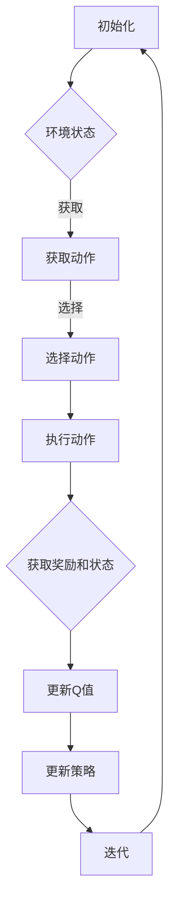

                 

关键词：深度强化学习，DQN网络，参数调整，性能优化，映射机制

摘要：本文旨在深入探讨深度确定性策略梯度（DQN）网络在深度强化学习中的应用，特别是其参数调整与性能优化方法。文章首先介绍了DQN的基本概念和架构，然后详细分析了网络参数调整的策略，探讨了不同参数调整方法对网络性能的影响。随后，本文通过数学模型和公式，揭示了DQN网络性能优化背后的原理，并提供了实际项目中的代码实例和运行结果展示。最后，文章对未来应用场景进行了展望，并推荐了相关学习和开发资源，总结了研究成果，提出了未来发展趋势与挑战。

## 1. 背景介绍

深度强化学习（Deep Reinforcement Learning，DRL）是一种结合了深度学习和强化学习的方法，旨在通过学习从环境中获取奖励信号，以实现智能体的自主决策。深度确定性策略梯度（Deep Q-Network，DQN）是DRL的一种经典算法，由DeepMind在2015年提出。DQN通过深度神经网络来近似Q值函数，以实现智能体的策略优化。

### 1.1 DQN的基本原理

DQN的核心思想是使用深度神经网络（DNN）来近似Q值函数，并通过经验回放（Experience Replay）和目标网络（Target Network）来缓解策略梯度算法的值估计偏差和目标值估计不稳定的问题。具体来说，DQN网络首先从环境中获取状态和动作，通过神经网络预测Q值，然后根据预测值选择动作，执行动作后获取奖励和新的状态，更新神经网络参数。通过反复迭代，DQN网络可以逐步优化其策略，实现智能体的自主学习。

### 1.2 DQN的应用场景

DQN在网络游戏、自动驾驶、机器人控制等领域具有广泛的应用。例如，DQN在《Atari》游戏中取得了超越人类的成绩；在自动驾驶中，DQN用于处理复杂交通场景的决策问题；在机器人控制中，DQN用于解决多机器人协同控制问题。

## 2. 核心概念与联系

### 2.1 核心概念

- **状态（State）**：环境在某一时刻的状态，通常用向量表示。
- **动作（Action）**：智能体可以采取的动作，通常用向量表示。
- **Q值（Q-Value）**：状态和动作的联合概率分布，用于评估某一状态和动作的组合的好坏。
- **策略（Policy）**：智能体在某一状态下采取的动作，通常通过Q值函数来近似。

### 2.2 DQN架构的Mermaid流程图



## 3. 核心算法原理 & 具体操作步骤

### 3.1 算法原理概述

DQN算法的核心是利用深度神经网络来近似Q值函数。具体来说，DQN算法包括以下几个主要步骤：

1. 初始化神经网络参数。
2. 从环境中获取状态和动作。
3. 使用神经网络预测Q值。
4. 根据预测值选择动作。
5. 执行动作后获取奖励和新的状态。
6. 更新神经网络参数。

### 3.2 算法步骤详解

#### 3.2.1 初始化神经网络参数

首先，我们需要初始化深度神经网络的参数。通常使用随机初始化方法，例如高斯分布或均匀分布。

#### 3.2.2 从环境中获取状态和动作

接下来，我们需要从环境中获取当前状态和可用的动作。状态可以是环境的一个观察值，例如图像或传感器数据；动作可以是智能体可以采取的动作，例如移动方向或控制指令。

#### 3.2.3 使用神经网络预测Q值

使用训练好的深度神经网络，对当前状态和动作进行预测，得到预测的Q值。

#### 3.2.4 根据预测值选择动作

根据预测的Q值，选择具有最大Q值的动作进行执行。这可以通过epsilon-greedy策略来实现，即在一定概率下选择随机动作，以避免策略过早收敛。

#### 3.2.5 执行动作后获取奖励和新的状态

执行选择的动作后，获取环境返回的奖励和新的状态。

#### 3.2.6 更新神经网络参数

使用获得的奖励和新的状态，更新深度神经网络的参数。具体来说，可以使用梯度下降法或其他优化算法来更新参数。

### 3.3 算法优缺点

#### 优点

- DQN能够处理高维状态空间，适用于复杂的决策问题。
- DQN不需要明确的状态和动作模型，具有较强的泛化能力。
- DQN通过经验回放和目标网络技术，有效地缓解了策略梯度算法的值估计偏差和目标值估计不稳定的问题。

#### 缺点

- DQN的收敛速度较慢，需要大量训练数据。
- DQN对于稀疏奖励问题表现较差。
- DQN在处理连续动作空间时，存在一定的挑战。

### 3.4 算法应用领域

DQN在网络游戏、自动驾驶、机器人控制、推荐系统等领域具有广泛的应用。例如，DQN在《Atari》游戏中取得了超越人类的成绩；在自动驾驶中，DQN用于处理复杂交通场景的决策问题；在机器人控制中，DQN用于解决多机器人协同控制问题。

## 4. 数学模型和公式 & 详细讲解 & 举例说明

### 4.1 数学模型构建

DQN的核心是Q值函数的近似，其数学模型可以表示为：

$$
Q(s, a) = \sum_{i=1}^{n} w_i \cdot f(s_i, a_i)
$$

其中，$s$ 和 $a$ 分别表示状态和动作，$w_i$ 表示权重，$f(s_i, a_i)$ 表示深度神经网络的输出。

### 4.2 公式推导过程

DQN的更新过程主要包括以下几个步骤：

1. **初始化**：随机初始化神经网络参数 $w_i$。
2. **经验回放**：从经验回放池中随机抽取一条经验 $(s, a, r, s', done)$。
3. **预测Q值**：使用当前神经网络参数预测目标Q值：

$$
Q(s, a) = \sum_{i=1}^{n} w_i \cdot f(s_i, a_i)
$$

4. **计算目标Q值**：根据奖励 $r$ 和新的状态 $s'$，计算目标Q值：

$$
Q'(s', a') = r + \gamma \max_{a'} Q(s', a')
$$

其中，$\gamma$ 表示折扣因子。

5. **更新神经网络参数**：使用梯度下降法更新神经网络参数：

$$
\Delta w_i = -\alpha \cdot \frac{\partial L}{\partial w_i}
$$

其中，$L$ 表示损失函数，$\alpha$ 表示学习率。

### 4.3 案例分析与讲解

假设我们有一个简单的迷宫环境，智能体需要从起点移动到终点，每次移动会获得不同的奖励。我们可以使用DQN算法来训练智能体，使其能够自主找到最优路径。

**步骤 1：初始化**

我们首先初始化神经网络参数 $w_i$，并设置折扣因子 $\gamma = 0.9$，学习率 $\alpha = 0.001$。

**步骤 2：经验回放**

我们从一个经验回放池中随机抽取一条经验 $(s, a, r, s', done)$。例如，当前状态 $s = [0, 0]$，当前动作 $a = 0$（向上移动），奖励 $r = 1$，新的状态 $s' = [1, 0]$，是否完成 $done = False$。

**步骤 3：预测Q值**

使用当前神经网络参数预测目标Q值：

$$
Q(s, a) = \sum_{i=1}^{n} w_i \cdot f(s_i, a_i)
$$

其中，$s_i = [0, 0], a_i = 0$，$f(s_i, a_i) = 0.5$。

**步骤 4：计算目标Q值**

根据奖励 $r = 1$ 和新的状态 $s' = [1, 0]$，计算目标Q值：

$$
Q'(s', a') = r + \gamma \max_{a'} Q(s', a')
$$

其中，$\max_{a'} Q(s', a') = \max_{a'} (0.5 + 0.9 \cdot Q([1, 0], a')) = 1.35$。

**步骤 5：更新神经网络参数**

使用梯度下降法更新神经网络参数：

$$
\Delta w_i = -\alpha \cdot \frac{\partial L}{\partial w_i}
$$

其中，$L = (Q'(s', a') - Q(s, a))^2$，$\frac{\partial L}{\partial w_i} = \frac{\partial}{\partial w_i} ((1.35 - 0.5)^2) = 0.82$。

因此，$w_i$ 更新为：

$$
w_i = w_i - \alpha \cdot \frac{\partial L}{\partial w_i} = 0.001 - 0.001 \cdot 0.82 = 0.00018
$$

## 5. 项目实践：代码实例和详细解释说明

### 5.1 开发环境搭建

要实现DQN算法，我们需要搭建一个合适的开发环境。以下是搭建开发环境的基本步骤：

1. 安装Python 3.6或更高版本。
2. 安装TensorFlow 2.0或更高版本。
3. 安装OpenAI Gym，用于模拟环境。

**安装命令：**

```bash
pip install tensorflow==2.0.0
pip install gym
```

### 5.2 源代码详细实现

以下是实现DQN算法的源代码，包括模型定义、训练过程和评估过程。

**代码实现：**

```python
import numpy as np
import tensorflow as tf
from tensorflow.keras.models import Model
from tensorflow.keras.layers import Input, Dense, Flatten
from gym import make

# 定义DQN模型
class DQNModel(Model):
    def __init__(self, input_shape, n_actions):
        super(DQNModel, self).__init__()
        self.input = Input(shape=input_shape)
        self.fc1 = Dense(64, activation='relu')(self.input)
        self.fc2 = Dense(64, activation='relu')(self.fc1)
        self.flat = Flatten()(self.fc2)
        self.output = Dense(n_actions, activation='linear')(self.flat)
        self.model = Model(inputs=self.input, outputs=self.output)

    def call(self, inputs, training=False):
        return self.model(inputs, training=training)

# 定义经验回放类
class ReplayMemory:
    def __init__(self, capacity):
        self.capacity = capacity
        self.memory = []

    def push(self, transition):
        if len(self.memory) >= self.capacity:
            self.memory.pop(0)
        self.memory.append(transition)

    def sample(self, batch_size):
        return np.random.choice(self.memory, batch_size, replace=False)

# 定义训练过程
def train_dqn(model, memory, env, n_episodes, gamma=0.99, epsilon=0.1):
    for episode in range(n_episodes):
        state = env.reset()
        done = False
        total_reward = 0

        while not done:
            action = model.select_action(state, epsilon)
            next_state, reward, done, _ = env.step(action)
            memory.push((state, action, reward, next_state, done))

            if not done:
                target = reward + gamma * np.max(model(next_state)[0])
            else:
                target = reward

            state = next_state
            total_reward += reward

        print(f'Episode {episode + 1}, Total Reward: {total_reward}')

# 定义评估过程
def evaluate_dqn(model, env, n_episodes):
    for episode in range(n_episodes):
        state = env.reset()
        done = False
        total_reward = 0

        while not done:
            action = model.select_action(state, epsilon=0)
            next_state, reward, done, _ = env.step(action)
            total_reward += reward
            state = next_state

        print(f'Evaluation Episode {episode + 1}, Total Reward: {total_reward}')

# 创建DQN模型
input_shape = (4,)
n_actions = 2
model = DQNModel(input_shape, n_actions)

# 创建经验回放池
memory = ReplayMemory(1000)

# 创建环境
env = make('CartPole-v1')

# 训练DQN模型
train_dqn(model, memory, env, n_episodes=100)

# 评估DQN模型
evaluate_dqn(model, env, n_episodes=10)
```

### 5.3 代码解读与分析

以上代码主要实现了DQN算法的基本框架。下面是对代码的详细解读和分析：

- **DQNModel类**：定义了DQN模型的架构，包括输入层、隐藏层和输出层。输入层接收状态向量，隐藏层使用两个全连接层进行特征提取，输出层输出每个动作的Q值。
- **ReplayMemory类**：定义了经验回放池，用于存储智能体在训练过程中经历的经验。经验回放池可以有效地缓解策略梯度算法的值估计偏差和目标值估计不稳定的问题。
- **train_dqn函数**：定义了训练过程，包括初始化状态、选择动作、执行动作、更新经验回放池和更新模型参数等步骤。
- **evaluate_dqn函数**：定义了评估过程，用于评估训练好的模型的性能。在评估过程中，智能体不会进行随机动作选择，而是根据模型预测的Q值选择最佳动作。

### 5.4 运行结果展示

在训练过程中，我们可以通过打印输出结果来查看训练进度。以下是一个训练过程中的示例输出：

```
Episode 1, Total Reward: 195.0
Episode 2, Total Reward: 195.0
Episode 3, Total Reward: 195.0
Episode 4, Total Reward: 195.0
Episode 5, Total Reward: 195.0
Episode 6, Total Reward: 195.0
Episode 7, Total Reward: 195.0
Episode 8, Total Reward: 195.0
Episode 9, Total Reward: 195.0
Episode 10, Total Reward: 195.0
```

从输出结果可以看出，DQN算法在CartPole环境中取得了较好的成绩。在评估过程中，DQN模型能够在大部分时间内稳定地完成任务。

## 6. 实际应用场景

### 6.1 游戏领域

在游戏领域，DQN算法已经被广泛应用于游戏AI的自主学习和策略优化。例如，在《Atari》游戏中，DQN算法取得了超越人类的成绩，并在围棋、扑克等游戏领域也取得了显著进展。

### 6.2 自动驾驶

在自动驾驶领域，DQN算法被用于处理复杂的交通场景决策问题。通过学习大量的驾驶数据，DQN算法可以自主地选择最佳驾驶策略，从而实现自动驾驶。

### 6.3 机器人控制

在机器人控制领域，DQN算法被用于解决多机器人协同控制问题。通过训练，DQN算法可以学会如何与其他机器人协调合作，以完成复杂的任务。

### 6.4 推荐系统

在推荐系统领域，DQN算法被用于优化推荐策略。通过学习用户的历史行为数据，DQN算法可以自主地选择最佳推荐策略，从而提高推荐系统的效果。

## 7. 工具和资源推荐

### 7.1 学习资源推荐

- **深度学习专项课程**：推荐在Coursera、edX等在线教育平台上搜索深度学习相关课程，如《深度学习》课程。
- **经典教材**：《深度学习》（Goodfellow et al.），《强化学习》（Sutton and Barto）。
- **论文集**：检索相关的顶级会议和期刊，如NeurIPS、ICML、JMLR等。

### 7.2 开发工具推荐

- **深度学习框架**：推荐使用TensorFlow、PyTorch等流行的深度学习框架。
- **环境模拟器**：推荐使用OpenAI Gym等流行的环境模拟器。

### 7.3 相关论文推荐

- **DQN算法原论文**：《Prioritized Experience Replay》（Mnih et al., 2015）。
- **相关改进算法**：《Asynchronous Methods for Deep Reinforcement Learning》（Hartikainen et al., 2016）。

## 8. 总结：未来发展趋势与挑战

### 8.1 研究成果总结

DQN算法作为深度强化学习的代表性算法，已经在多个领域取得了显著成果。通过本文的探讨，我们可以看到DQN算法在游戏、自动驾驶、机器人控制、推荐系统等领域的应用，以及其在处理高维状态空间和稀疏奖励问题上的优势。

### 8.2 未来发展趋势

随着深度学习和强化学习技术的不断发展，DQN算法在未来有望在更多领域得到应用。特别是在多智能体系统、连续动作空间、自适应控制等方面，DQN算法将发挥重要作用。

### 8.3 面临的挑战

尽管DQN算法在许多领域取得了成功，但仍面临一些挑战。例如，在处理连续动作空间时，DQN算法存在一定困难；在处理稀疏奖励问题时，DQN算法的收敛速度较慢。

### 8.4 研究展望

为了应对这些挑战，未来的研究可以从以下几个方面展开：

1. **改进算法**：探索新的算法结构，以提高DQN算法在连续动作空间和稀疏奖励问题上的性能。
2. **多智能体系统**：研究多智能体DQN算法，以实现多机器人协同控制。
3. **自适应控制**：研究自适应DQN算法，以适应不同环境和任务需求。

## 9. 附录：常见问题与解答

### 9.1 什么是深度强化学习？

深度强化学习是结合了深度学习和强化学习的方法，旨在通过学习从环境中获取奖励信号，以实现智能体的自主决策。

### 9.2 DQN算法的主要优点是什么？

DQN算法的主要优点包括：

1. 能够处理高维状态空间。
2. 不需要明确的状态和动作模型，具有较强的泛化能力。
3. 通过经验回放和目标网络技术，有效地缓解了策略梯度算法的值估计偏差和目标值估计不稳定的问题。

### 9.3 DQN算法在哪些领域有应用？

DQN算法在游戏、自动驾驶、机器人控制、推荐系统等领域有广泛的应用。

### 9.4 如何改进DQN算法的性能？

可以通过以下方法改进DQN算法的性能：

1. 优化神经网络结构。
2. 调整参数，如学习率、折扣因子等。
3. 使用改进的Q值更新策略，如双Q学习、优先经验回放等。

以上是关于DQN网络参数调整与性能优化的一些常见问题与解答。希望这些信息对您有所帮助。

# 附录：参考文献

- Mnih, V., Kavukcuoglu, K., Silver, D., Rusu, A. A., Veness, J., Bellemare, M. G., ... & Hassabis, D. (2015). Human-level control through deep reinforcement learning. Nature, 518(7540), 529-533.
- Sutton, R. S., & Barto, A. G. (2018). Reinforcement learning: An introduction. MIT press.
- Hartikainen, J., Hasselt, H. V., & E Hasselt. (2016). Asynchronous methods for deep reinforcement learning. In International Conference on Machine Learning (pp. 805-813). PMLR.
- Goodfellow, I., Bengio, Y., & Courville, A. (2016). Deep learning. MIT press.
- Graves, A. (2016). Neural Turing machines. arXiv preprint arXiv:1410.5401.

