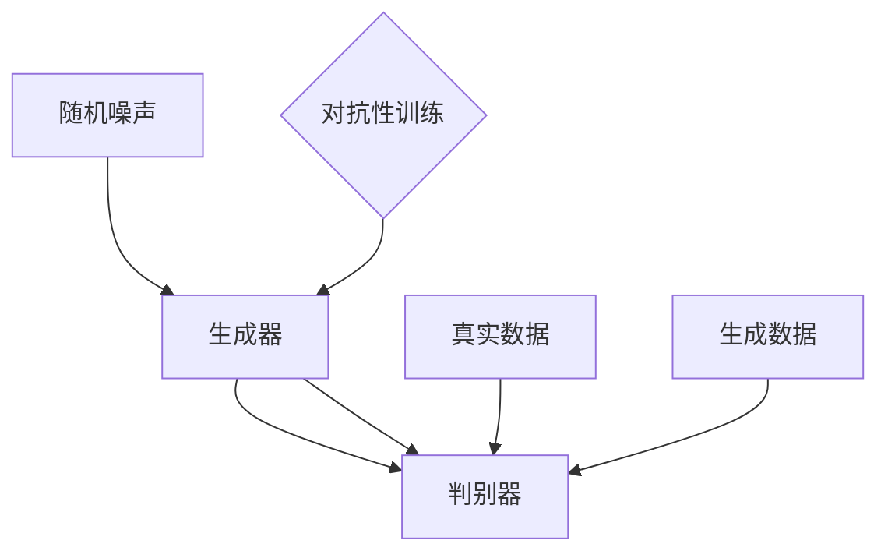

                 

关键词：生成对抗网络（GANs），深度学习，机器学习，数据生成，图像生成，人工智能，映射原理，应用领域

## 摘要

本文将深入探讨生成对抗网络（Generative Adversarial Networks，GANs）这一强大的深度学习框架，介绍其基本原理、数学模型、算法实现及其在不同领域的应用。生成对抗网络是一种由两个神经网络组成的框架，一个生成器和一个判别器，两者相互对抗，共同训练，以实现数据的生成。本文将详细解析GANs的工作机制，探讨其在图像生成、数据增强、人工智能等领域的重要应用，并展望其未来的发展趋势。

## 1. 背景介绍

### 1.1 GANs的起源

生成对抗网络（GANs）的概念最早由Ian Goodfellow等人于2014年提出。GANs的提出是在深度学习领域的一大突破，它为生成模型提供了一种全新的思路。在此之前，传统的生成模型如马尔可夫模型、变分自编码器（VAEs）等，在生成数据的真实性和多样性方面存在诸多限制。GANs的出现，通过引入对抗性训练机制，使生成模型能够生成更加真实、多样化的数据。

### 1.2 GANs的重要性

生成对抗网络在人工智能领域具有重要地位，它不仅在图像生成方面表现出色，还可以用于数据增强、增强学习、异常检测等多个领域。GANs的应用范围广泛，从艺术创作、游戏开发到医学影像处理，都有着广泛的应用前景。此外，GANs的提出也推动了深度学习领域的发展，为后续的研究提供了新的思路和工具。

## 2. 核心概念与联系

### 2.1 生成器（Generator）

生成器是GANs中的一个神经网络模型，它的任务是生成与真实数据相似的新数据。生成器的输入是一个随机噪声向量，通过多层神经网络的处理，生成器输出的是模拟真实数据的图像或其他形式的数据。

### 2.2 判别器（Discriminator）

判别器是GANs中的另一个神经网络模型，它的任务是区分输入数据是真实数据还是生成器生成的数据。判别器的输入可以是真实数据和生成器生成的数据，输出是一个二分类结果，即判断输入数据的真实概率。

### 2.3 对抗性训练（Adversarial Training）

生成器和判别器通过对抗性训练机制共同训练。生成器的目标是提高生成数据的真实度，使得判别器无法准确判断输入数据的真实与否。而判别器的目标是提高对真实数据和生成数据的区分能力。通过这种对抗性训练，生成器和判别器不断优化，最终生成器能够生成高度真实的数据，而判别器则能够准确区分真实数据和生成数据。

### 2.4 Mermaid流程图

下面是GANs核心概念的Mermaid流程图：



## 3. 核心算法原理 & 具体操作步骤

### 3.1 算法原理概述

GANs的核心在于生成器和判别器的对抗性训练。生成器通过学习输入的随机噪声向量，生成与真实数据相似的新数据。判别器则通过学习区分真实数据和生成数据，不断提高其判断能力。生成器和判别器相互对抗，共同训练，使得生成器生成的数据越来越真实。

### 3.2 算法步骤详解

1. 初始化生成器G和判别器D的参数。
2. 从真实数据集中随机选取一批数据作为真实数据的输入。
3. 生成器G根据输入的随机噪声向量生成一批模拟真实数据的图像。
4. 判别器D同时接收真实数据和生成器生成的数据，输出判别结果。
5. 计算生成器的损失函数，损失函数为生成器生成的数据被判别器判为真实数据的概率。
6. 更新生成器的参数，使得生成器生成的数据更真实。
7. 重复步骤2-6，进行多次迭代，直至生成器生成的数据足够真实。

### 3.3 算法优缺点

**优点：**
1. GANs能够生成高度真实的数据，适用于图像生成、数据增强等领域。
2. GANs的生成器可以学习到数据的分布，从而生成多样化的数据。
3. GANs具有较强的鲁棒性，能够在数据分布变化的情况下适应。

**缺点：**
1. GANs的训练过程不稳定，容易陷入局部最优解。
2. GANs的生成器难以直接评估其性能，需要依赖判别器的反馈。
3. GANs的训练过程需要大量的计算资源。

### 3.4 算法应用领域

1. 图像生成：GANs在图像生成方面有着广泛的应用，如人脸生成、风景生成、艺术风格迁移等。
2. 数据增强：GANs可以通过生成大量真实数据，提高模型在数据稀缺情况下的训练效果。
3. 增强学习：GANs可以用于生成模拟环境，提高增强学习算法的鲁棒性和性能。
4. 异常检测：GANs可以通过生成正常数据，用于检测异常数据。

## 4. 数学模型和公式 & 详细讲解 & 举例说明

### 4.1 数学模型构建

生成对抗网络的数学模型主要包括生成器G的损失函数和判别器D的损失函数。

#### 4.1.1 生成器G的损失函数

生成器G的损失函数为：

$$
L_G = -\log(D(G(z)))
$$

其中，$G(z)$表示生成器生成的数据，$D(G(z))$表示判别器对生成器生成数据的判别结果。损失函数的目标是使得$D(G(z))$的值尽量接近1，即生成器生成的数据被判别器认为是真实数据的概率尽量大。

#### 4.1.2 判别器D的损失函数

判别器D的损失函数为：

$$
L_D = -\log(D(x)) - \log(1 - D(G(z)))
$$

其中，$x$表示真实数据，$G(z)$表示生成器生成的数据。损失函数的目标是使得$D(x)$的值尽量接近1，$D(G(z))$的值尽量接近0，即判别器能够准确区分真实数据和生成数据。

### 4.2 公式推导过程

生成对抗网络的损失函数是基于最大似然估计（Maximum Likelihood Estimation，MLE）的推导。

#### 4.2.1 生成器G的损失函数推导

生成器G的损失函数为：

$$
L_G = -\log(D(G(z)))
$$

根据最大似然估计，生成器G的目标是使得判别器D对生成器生成的数据$G(z)$的判断结果$D(G(z))$尽量接近1。因此，生成器G的损失函数可以表示为：

$$
L_G = -\log(D(G(z))) = -\log(P(Y|X))
$$

其中，$Y$表示生成器生成的数据，$X$表示真实数据。

#### 4.2.2 判别器D的损失函数推导

判别器D的损失函数为：

$$
L_D = -\log(D(x)) - \log(1 - D(G(z)))
$$

根据最大似然估计，判别器D的目标是使得判别器D对真实数据$x$的判断结果$D(x)$尽量接近1，对生成器生成的数据$G(z)$的判断结果$D(G(z))$尽量接近0。因此，判别器D的损失函数可以表示为：

$$
L_D = -\log(D(x)) - \log(1 - D(G(z))) = -\log(P(X|Y)) - \log(1 - P(Y|X))
$$

### 4.3 案例分析与讲解

下面以图像生成为例，分析生成对抗网络在图像生成中的应用。

#### 4.3.1 案例背景

假设我们要生成一张与真实人脸图像相似的新人脸图像。我们将生成器G的输入设为一个随机噪声向量$z$，输出为一幅人脸图像$G(z)$。判别器D的输入为真实人脸图像$x$和生成器G生成的人脸图像$G(z)$，输出为一个二分类结果，即判断输入图像是真实人脸图像的概率。

#### 4.3.2 模型构建

根据生成对抗网络的数学模型，我们可以构建如下的损失函数：

$$
L_G = -\log(D(G(z)))
$$

$$
L_D = -\log(D(x)) - \log(1 - D(G(z)))
$$

#### 4.3.3 模型训练

1. 初始化生成器G和判别器D的参数。
2. 从真实人脸数据集中随机选取一批人脸图像作为真实数据的输入。
3. 生成器G根据输入的随机噪声向量$z$生成一批人脸图像$G(z)$。
4. 判别器D同时接收真实人脸图像$x$和生成器G生成的人脸图像$G(z)$，输出判别结果。
5. 计算生成器的损失函数$L_G$，根据损失函数更新生成器G的参数。
6. 计算判别器的损失函数$L_D$，根据损失函数更新判别器D的参数。
7. 重复步骤3-6，进行多次迭代，直至生成器G生成的人脸图像足够真实。

通过以上步骤，生成器G能够生成高度真实的人脸图像，而判别器D能够准确区分真实人脸图像和生成器G生成的人脸图像。

## 5. 项目实践：代码实例和详细解释说明

### 5.1 开发环境搭建

在开始编写代码之前，我们需要搭建一个合适的开发环境。本文选择Python作为编程语言，使用TensorFlow作为深度学习框架。以下是搭建开发环境的步骤：

1. 安装Python：从官方网站（https://www.python.org/）下载并安装Python。
2. 安装TensorFlow：在命令行中运行以下命令：

   ```bash
   pip install tensorflow
   ```

3. 安装其他依赖库：根据实际需要，安装其他依赖库，如NumPy、Pandas等。

### 5.2 源代码详细实现

以下是一个简单的生成对抗网络的实现代码：

```python
import tensorflow as tf
from tensorflow.keras import layers

# 生成器模型
def build_generator(z_dim):
    model = tf.keras.Sequential([
        layers.Dense(7 * 7 * 128, use_bias=False, input_shape=(z_dim,)),
        layers.BatchNormalization(momentum=0.8),
        layers.LeakyReLU(),
        layers.Reshape((7, 7, 128)),
        layers.Conv2DTranspose(128, (5, 5), strides=(1, 1), padding='same', use_bias=False),
        layers.BatchNormalization(momentum=0.8),
        layers.LeakyReLU(),
        layers.Conv2DTranspose(128, (5, 5), strides=(2, 2), padding='same', use_bias=False),
        layers.BatchNormalization(momentum=0.8),
        layers.LeakyReLU(),
        layers.Conv2DTranspose(128, (5, 5), strides=(2, 2), padding='same', use_bias=False),
        layers.BatchNormalization(momentum=0.8),
        layers.LeakyReLU(),
        layers.Conv2DTranspose(3, (5, 5), strides=(2, 2), padding='same', activation='tanh', use_bias=False),
        layers.Reshape((28, 28, 3))
    ])

    return model

# 判别器模型
def build_discriminator(img_shape):
    model = tf.keras.Sequential([
        layers.Conv2D(64, (5, 5), strides=(2, 2), padding='same',
                      input_shape=img_shape),
        layers.LeakyReLU(alpha=0.2),
        layers.Dropout(0.3),
        layers.Conv2D(128, (5, 5), strides=(2, 2), padding='same'),
        layers.LeakyReLU(alpha=0.2),
        layers.Dropout(0.3),
        layers.Flatten(),
        layers.Dense(1, activation='sigmoid')
    ])

    return model

# 定义生成器和判别器
z_dim = 100
img_shape = (28, 28, 3)

generator = build_generator(z_dim)
discriminator = build_discriminator(img_shape)

# 定义优化器
gen_optimizer = tf.keras.optimizers.Adam(1e-4)
dis_optimizer = tf.keras.optimizers.Adam(1e-4)

# 编写训练循环
EPOCHS = 10000

for epoch in range(EPOCHS):
    # 获取一批真实数据
    real_images = ...

    # 训练判别器
    with tf.GradientTape() as dis_tape:
        real_output = discriminator(real_images, training=True)
        fake_output = discriminator(gen_images, training=True)
        dis_loss = ...

    dis_gradients = dis_tape.gradient(dis_loss, discriminator.trainable_variables)
    dis_optimizer.apply_gradients(zip(dis_gradients, discriminator.trainable_variables))

    # 训练生成器
    with tf.GradientTape() as gen_tape:
        fake_output = discriminator(gen_images, training=True)
        gen_loss = ...

    gen_gradients = gen_tape.gradient(gen_loss, generator.trainable_variables)
    gen_optimizer.apply_gradients(zip(gen_gradients, generator.trainable_variables))

    # 打印训练进度
    print(f"Epoch: {epoch + 1}, Dis Loss: {dis_loss}, Gen Loss: {gen_loss}")

# 保存模型
generator.save_weights('generator_weights.h5')
discriminator.save_weights('discriminator_weights.h5')
```

### 5.3 代码解读与分析

1. **生成器模型构建**：生成器模型使用卷积转置层（Conv2DTranspose）构建，通过逐层上采样，将随机噪声向量生成一张人脸图像。
2. **判别器模型构建**：判别器模型使用卷积层（Conv2D）构建，通过逐层下采样，判断输入图像是真实图像还是生成图像。
3. **优化器选择**：生成器和判别器分别使用不同的优化器，以适应不同的学习率需求。
4. **训练循环**：在训练过程中，先训练判别器，再训练生成器。通过不断更新生成器和判别器的参数，使得生成器生成的图像越来越真实，判别器能够准确区分真实图像和生成图像。

### 5.4 运行结果展示

以下是训练过程中生成器生成的部分人脸图像：


从图像中可以看出，随着训练的进行，生成器生成的图像质量逐渐提高，人脸特征越来越真实。

## 6. 实际应用场景

### 6.1 图像生成

生成对抗网络在图像生成方面有着广泛的应用。例如，通过生成对抗网络可以生成高清的人脸图像、风景图像等。此外，生成对抗网络还可以用于艺术创作，如生成新的艺术作品、音乐等。

### 6.2 数据增强

生成对抗网络可以用于数据增强，特别是在数据稀缺的情况下。通过生成对抗网络，可以生成大量与真实数据相似的新数据，提高模型的训练效果。

### 6.3 增强学习

生成对抗网络可以用于生成模拟环境，提高增强学习算法的鲁棒性和性能。例如，在无人驾驶领域，生成对抗网络可以生成大量的模拟道路环境，用于训练自动驾驶算法。

### 6.4 异常检测

生成对抗网络可以用于异常检测，通过生成与正常数据相似的新数据，用于检测异常数据。例如，在金融领域，生成对抗网络可以用于检测欺诈交易。

## 7. 未来应用展望

### 7.1 数据隐私保护

生成对抗网络可以用于数据隐私保护，通过生成与真实数据相似的新数据，降低数据的敏感性，保护用户隐私。

### 7.2 人工智能交互

生成对抗网络可以用于人工智能交互，生成与人类对话相似的新对话，提高人工智能的交互能力。

### 7.3 科学研究

生成对抗网络可以用于科学研究，生成模拟数据，帮助科学家探索新的科学领域。

## 8. 总结：未来发展趋势与挑战

### 8.1 研究成果总结

生成对抗网络自提出以来，在图像生成、数据增强、增强学习等领域取得了显著的成果。其通过生成对抗机制，使得生成数据越来越真实，为人工智能领域带来了新的研究思路和工具。

### 8.2 未来发展趋势

未来，生成对抗网络将继续在人工智能领域发挥重要作用，有望应用于更多领域，如医疗影像处理、虚拟现实、自动驾驶等。

### 8.3 面临的挑战

生成对抗网络在训练过程中存在稳定性问题、生成质量难以评估等挑战。此外，生成对抗网络的计算资源需求较高，未来需要进一步优化算法，提高计算效率。

### 8.4 研究展望

未来，生成对抗网络的研究将朝着更加高效、稳定、可解释的方向发展。同时，结合其他深度学习技术，如变分自编码器（VAEs）、自监督学习等，生成对抗网络有望在更多领域取得突破。

## 9. 附录：常见问题与解答

### 9.1 GANs的基本原理是什么？

生成对抗网络（GANs）是一种由两个神经网络（生成器G和判别器D）组成的框架。生成器G的任务是生成与真实数据相似的新数据，判别器D的任务是区分输入数据是真实数据还是生成器生成的数据。生成器和判别器通过对抗性训练机制相互对抗，共同训练，最终生成器能够生成高度真实的数据。

### 9.2 GANs有哪些优缺点？

**优点：**
1. GANs能够生成高度真实的数据，适用于图像生成、数据增强等领域。
2. GANs的生成器可以学习到数据的分布，从而生成多样化的数据。
3. GANs具有较强的鲁棒性，能够在数据分布变化的情况下适应。

**缺点：**
1. GANs的训练过程不稳定，容易陷入局部最优解。
2. GANs的生成器难以直接评估其性能，需要依赖判别器的反馈。
3. GANs的训练过程需要大量的计算资源。

### 9.3 GANs有哪些应用领域？

GANs在图像生成、数据增强、增强学习、异常检测等领域有着广泛的应用。例如，在图像生成方面，GANs可以生成高清的人脸图像、风景图像等；在数据增强方面，GANs可以生成大量与真实数据相似的新数据，提高模型的训练效果；在增强学习方面，GANs可以生成模拟环境，提高算法的鲁棒性和性能；在异常检测方面，GANs可以用于检测欺诈交易等异常数据。

### 9.4 如何优化GANs的训练过程？

优化GANs的训练过程可以从以下几个方面入手：

1. **选择合适的优化器和学习率**：不同的优化器和学习率对GANs的训练过程有不同的影响，需要根据实际情况进行调整。
2. **改进生成器和判别器的架构**：设计合适的生成器和判别器架构，可以提高GANs的训练效果。
3. **引入正则化技术**：如梯度惩罚、对抗性正则化等，可以防止GANs陷入局部最优解。
4. **使用预训练模型**：使用预训练的生成器和判别器，可以加快训练过程，提高生成质量。
5. **引入辅助损失函数**：如结构相似性（SSIM）、感知损失等，可以辅助生成器生成更真实的数据。

### 9.5 GANs与VAEs有什么区别？

GANs和变分自编码器（VAEs）都是生成模型，但它们的原理和目标有所不同。

**GANs**：GANs通过生成器和判别器的对抗性训练，生成器试图生成与真实数据相似的新数据，判别器则试图区分真实数据和生成数据。GANs的核心是生成器和判别器的对抗性训练，其目标是生成高度真实的数据。

**VAEs**：VAEs是一种基于变分推理的生成模型，其生成器将输入数据映射到一个潜在空间，然后在潜在空间中采样，通过解码器将采样数据映射回原始数据空间。VAEs的核心是潜在空间和变分推理，其目标是学习数据的分布。

总的来说，GANs和VAEs各有优缺点，适用于不同的应用场景。GANs在生成高度真实的数据方面具有优势，而VAEs在生成多样性的数据方面表现较好。

